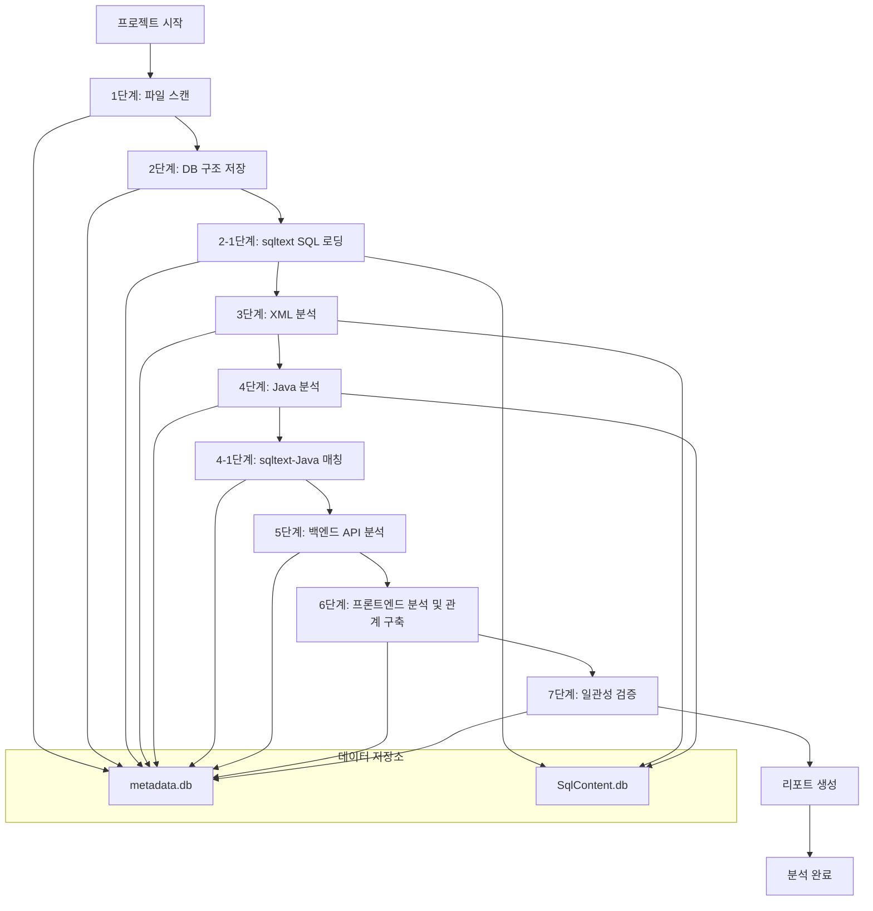
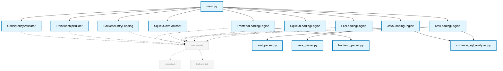
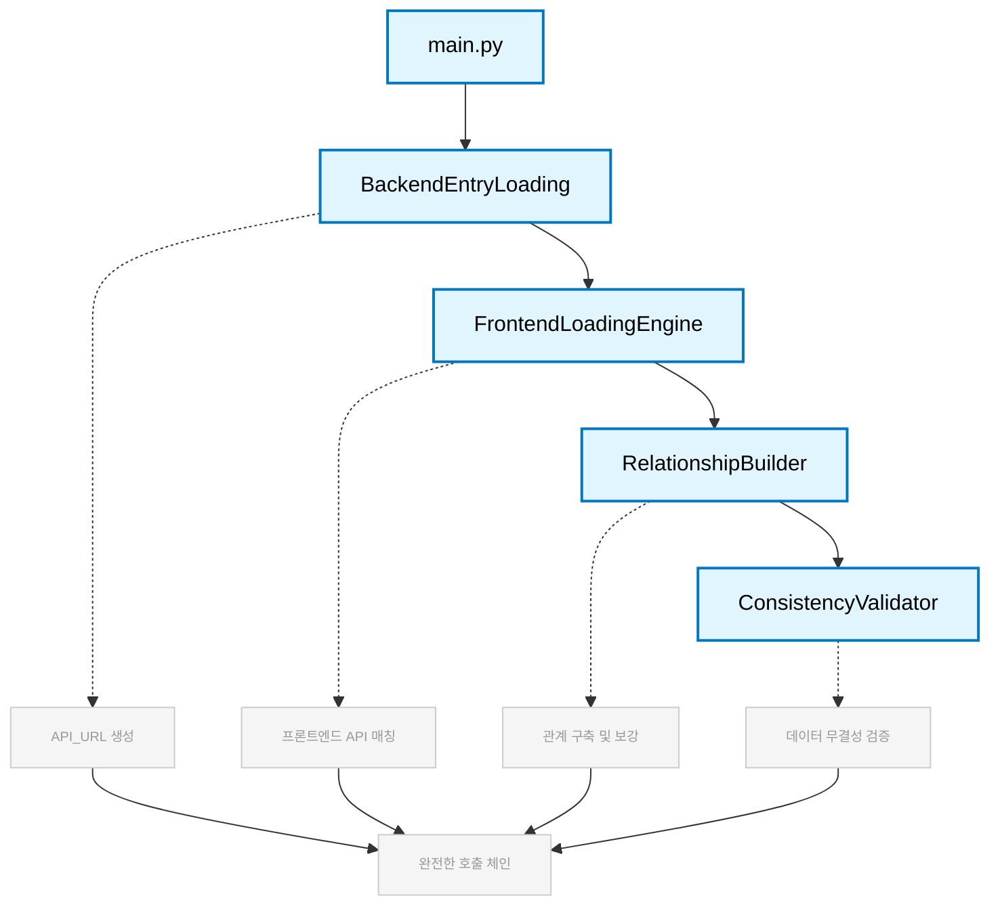

# SourceAnalyzer 프로젝트 분석 시스템 요구사항 명세서

## 문서 목적

이 문서는 SourceAnalyzer 시스템의 **비즈니스 요구사항과 기능 명세**를 정의합니다.
**대상 독자**: 기획자, PM, 시스템 아키텍트
**참조 문서**: [02_데이터베이스_스키마_정의서.md](./02_데이터베이스_스키마_정의서.md), [03_처리_플로우_개요.md](./03_처리_플로우_개요.md)

## 개요

SourceAnalyzer는 Java/Spring/MyBatis 기반 웹 애플리케이션의 소스코드를 분석하여 프론트엔드부터 백엔드, 데이터베이스까지의 완전한 연관관계를 도출하는 메타데이터 분석 시스템입니다.

## 1. 시스템 개요

SourceAnalyzer는 Java/Spring/MyBatis 기반 웹 애플리케이션의 소스코드를 분석하여 프론트엔드부터 백엔드, 데이터베이스까지의 완전한 연관관계를 도출하는 메타데이터 분석 시스템입니다.

## 2. 핵심 기능

### 2.1 분석 파이프라인



### 2.2 단계별 설명

1. **1단계 - 파일 스캔**: 프로젝트 전체 파일 인덱싱 및 `files` 테이블 등록
   📄 [04_1단계_파일_스캔_구현서.md](./04_1단계_파일_스캔_구현서.md)

2. **2단계 - DB 구조 저장**: CSV 파일에서 테이블/컬럼 정보 추출 및 `components` 테이블 등록
   📄 [05_2단계_DB_구조_저장_구현서.md](./05_2단계_DB_구조_저장_구현서.md)

3. **2-1단계 - sqltext SQL 로딩**: `projects/{project}/sqltext/**/*.sql` 파일을 스캔하여 메타DB에 저장
   - `files`: `file_type='SQL'`, 프로젝트 기준 상대 경로로 등록
   - `components`: 쿼리 내용 기반으로 `SQL_SELECT/INSERT/UPDATE/DELETE/MERGE` 등 타입 분류, `layer='QUERY_FROM_SQLTEXT'`
   - `SqlContent.db`: 파일명을 `query_id`로 사용, 정제된 SQL 본문을 gzip 압축하여 저장

4. **3단계 - XML 분석**: MyBatis XML 파싱, JOIN 관계 분석, SQL 컴포넌트 생성
   📄 [06_3단계_XML_분석_구현서.md](./06_3단계_XML_분석_구현서.md)

5. **4단계 - Java 분석**: 클래스/메서드 추출, SQL 추출, 연관관계 도출
   📄 [07_4단계_Java_분석_구현서.md](./07_4단계_Java_분석_구현서.md)

6. **4-1단계 - sqltext-Java 매칭**: Java 파일 내 sqltext SQL ID 문자열 검색으로 CALL_QUERY 관계 생성
   - `layer='QUERY_FROM_SQLTEXT'`인 SQL 컴포넌트 대상
   - Java 파일 내용에서 SQL ID 문자열(파일명) 검색
   - METHOD → SQL 간 CALL_QUERY 관계 자동 생성

7. **5단계 - 백엔드 API**: Spring/Servlet API 진입점 분석
   📄 [08_5단계_API_매핑_구현서.md](./08_5단계_API_매핑_구현서.md)

8. **6단계 - 프론트엔드**: 모든 프론트엔드 파일 통합 분석, frameworks 추적, 연관관계 구축
   📄 [09_6단계_프론트엔드_분석_구현서.md](./09_6단계_프론트엔드_분석_구현서.md)

9. **7단계 - 일관성 검증**: 데이터 무결성 검증, 품질 보장
   📄 [10_7단계_일관성_검증_구현서.md](./10_7단계_일관성_검증_구현서.md)

## 3. 기술적 요구사항

### 3.1 지원 기술

- **Java**: 클래스, 메서드, SQL 추출 (StringBuilder 패턴)
- **XML (MyBatis)**: 안정적 파싱, JOIN 관계 분석, SQL 컴포넌트 생성
- **프론트엔드**: JSP, JSX, Vue, TS, JS, HTML 통합 분석
- **Spring Framework**: @Controller, @RequestMapping API 진입점 분석
- **JPA**: @Entity, @Repository, JpaRepository 분석
- **Frameworks 추적**: jQuery, Axios, Fetch, XHR 자동 수집
- **SQL**: 공통 SQL 파서, JOIN 분석, 테이블/컬럼 추출
- **CSV**: 데이터베이스 스키마 정보 로드
- **sqltext**: 독립 SQL 파일 관리 및 Java 연동

### 3.2 미구현 기능

- **Qwen AI 분석**: 개발 예정 (미구현)
- **고급 JPA 분석**: @OneToMany, @ManyToOne 등 관계 어노테이션
- **Oracle PL/SQL**: 저장 프로시저, 함수 분석
- **고급 프론트엔드**: React Hooks, Vue Composition API 상세 분석

### 3.3 핵심 분석 기능

- **SqlContent.db**: gzip 압축 SQL 내용 별도 관리 (Java 문자열 SQL + sqltext + XML/JPA 쿼리)
- **Layer 분류**: FRONTEND / API_ENTRY / SERVICE / REPOSITORY / SQL / QUERY_FROM_SQLTEXT 등 계층 정보 저장
- **정밀 매칭**: API_URL ↔ METHOD, METHOD ↔ SQL, SQL ↔ TABLE 매핑 (CALL_API / CALL_METHOD / CALL_QUERY / USE_TABLE)
- **일관성 검증**: DB 기반 관계 보강 및 데이터 무결성 검증
- **공통 SQL 조인 분석**: Oracle EXPLICIT/IMPLICIT JOIN, 테이블·컬럼 추출

## 4. 리포트 생성 요구사항

SourceAnalyzer는 다음 9가지 HTML 리포트를 생성합니다:

1. **CallChain Report**: 프론트엔드 → 백엔드 → DB 호출 체인 분석
2. **ERD Report**: Entity Relationship Diagram (기본 레이아웃)
3. **ERD(Dagre) Report**: Dagre 레이아웃 기반 ERD (컬럼 표시/미표시 옵션)
4. **Architecture Report**: 컴포넌트 기반 아키텍처 다이어그램
5. **Architecture Layer Report**: 계층별 아키텍처 다이어그램
6. **Sequence Diagram**: 시퀀스 다이어그램 리포트
7. **QueryList Report**: SQL 쿼리 리스트 분석
8. **Backend Mapping Report**: 백엔드 매핑 상세 리포트
9. **Frontend Mapping Report**: 프론트엔드 매핑 상세 리포트

📄 상세 설명: [20_리포트생성_구현서.md](./20_리포트생성_구현서.md)

## 5. 시스템 아키텍처

### 5.1 메타데이터 분석 파이프라인

이 다이어그램은 SourceAnalyzer의 핵심 데이터 처리 파이프라인을 보여줍니다. `main.py`를 중심으로 파일, XML, 자바 코드 등 다양한 소스코드를 분석하여 메타데이터베이스에 저장하는 과정을 나타냅니다.



### 5.2 백엔드/프론트엔드 분석 시스템

이 다이어그램은 백엔드와 프론트엔드 간의 API 호출 관계를 분석하는 시스템을 보여줍니다.



## 6. 핵심 요구사항

### 6.1 명령행 파라미터 구조

- **필수 파라미터**: `--project-name <프로젝트명>`
- **선택 파라미터**:
  - `--clear-metadb`: 메타데이터베이스 초기화
  - `--verbose`: 상세 로그 출력 (DEBUG 레벨)
  - `--dry-run`: 설정 검증만 수행 (실제 분석 미실행)
  - `--sql-compress`: SQL 내용을 gzip 압축하여 저장 (SqlContent_compressed.db 사용)
- **에러 처리**: 파라미터 미지정 시 명확한 에러 메시지 출력
- **실행 방식**:
  - 기본 모드: `python main.py --project-name sampleSrc --verbose`
  - 압축 모드: `python main.py --project-name sampleSrc --sql-compress`

### 6.2 분석 대상 폴더 구조

```
./projects/{project_name}/
├── src/                    # 분석할 소스코드 (프로젝트마다 동적임)
│   ├── main/java/         # Java 소스
│   └── main/resources/    # MyBatis XML 등
├── db_schema/             # 분석할 DB 스키마 정보
│   ├── ALL_TABLES.csv     # 테이블 정보
│   └── ALL_TAB_COLUMNS.csv # 컬럼 정보
├── sqltext/               # 독립 SQL 파일 (선택사항)
│   └── **/*.sql           # 재귀 스캔
├── config/                # 프로젝트별 설정 (선택사항)
│   └── target_source_config.yaml
├── metadata.db            # 메타데이터베이스 (분석 결과 저장)
├── SqlContent.db          # SQL 내용 데이터베이스 (gzip 압축)
└── report/                # 생성된 리포트
    ├── [리포트명]_[프로젝트명]_[타임스탬프].html
    └── js/               # Offline환경 실행용 JS 라이브러리
```

## 7. 시스템 폴더 구조

### 📁 루트 디렉토리 구조

| **📂 디렉토리** | **📄 주요 파일** | **🎯 역할** | **📋 설명** |
| ------------ | ------------ | --------- | --------- |
| **🚀 실행 파일** | `main.py` | 메인 실행 파일 | 전체 분석 파이프라인 실행 |
| | `create_report.py` | 리포트 생성 | 9가지 HTML 리포트 생성 |
| **⚙️ 분석 엔진** | `file_loading.py` | 1-2단계 파일/DB 분석 | 파일 스캔, DB 구조 저장 |
| | `sqltext_loading.py` | 2-1단계 sqltext 로딩 | sqltext 폴더 SQL 파일 처리 |
| | `xml_loading.py` | 3단계 XML 분석 | MyBatis XML 파싱 |
| | `java_loading.py` | 4단계 Java 분석 | 클래스/메서드 추출 |
| | `sqltext_java_matcher.py` | 4-1단계 sqltext 매칭 | Java-sqltext 연결 |
| | `backend_entry_loading.py` | 5단계 백엔드 API | Spring/Servlet 분석 |
| | `frontend_loading.py` | 6단계 프론트엔드 | 통합 프론트엔드 분석 |
| | `relationship_builder.py` | 6단계 관계 구축 | 프론트엔드-백엔드 매핑 |
| | `consistency_validator.py` | 7단계 일관성 검증 | 데이터 품질 보장 |
| **⚙️ 설정 및 스키마** | `config/` | 시스템 설정 파일들 | YAML 기반 설정 |
| | `config/parser/` | 파서별 키워드 설정 | 19개 YAML 설정 파일 |
| | `database/` | DB 스키마 스크립트 | CREATE TABLE 스크립트 |
| **🔧 핵심 모듈들** | `parser/` | 파싱 엔진들 | Java, XML, Frontend 파서 |
| | `reports/` | 리포트 생성기들 | 9가지 리포트 생성기 |
| | `util/` | 공통 유틸리티들 | Database, Hash, Path, SQL Content 등 |
| **📊 프로젝트 데이터** | `projects/프로젝트명/` | 분석 대상 소스 | 프로젝트별 디렉토리 |
| | `metadata.db` | 메타데이터베이스 | SQLite 데이터베이스 |
| | `SqlContent.db` | SQL 내용 데이터베이스 | gzip 압축 SQL 저장 |
| | `report/` | 생성된 리포트들 | HTML 리포트 파일들 |
| | `logs/` | 실행 로그들 | 분석 과정 로그 |
| **🎨 시각화 자원** | `js/` | JavaScript 라이브러리 | Cytoscape, Dagre, jQuery |

## 8. 사용 제약사항

### 8.1 파일 생성 규칙

- **임시 파일**: `./temp/` 디렉토리에만 생성
- **로그 파일**: `./logs/` 디렉토리에 생성 (24시간 경과 파일 자동 삭제)
- **리포트 파일**: `./projects/{project_name}/report/` 디렉토리에 생성
- **데이터베이스**: `./projects/{project_name}/` 디렉토리에 생성

## 9. 성능 최적화 기능

### 9.1 구현된 최적화 기능

- **대용량 파일 스트리밍**: 스트리밍 처리 지원
- **메모리 최적화**: 메모리 사용량 모니터링, 가비지 컬렉션, 캐시 정리
- **캐싱**: 분석 결과 캐싱, 파일 캐싱, 중복 처리 방지
- **안전한 로깅**: 파일 락 문제 해결, 멀티프로세스 환경 대응

## 10. 사용 시나리오

### 10.1 신규 프로젝트 분석

1. **프로젝트 준비**: `./projects/{project_name}/` 디렉토리 생성
2. **소스코드 복사**: Java, XML, JSP, JS 파일을 `src/` 폴더에 복사
3. **DB 스키마 준비**: `db_schema/` 폴더에 ALL_TABLES.csv, ALL_TAB_COLUMNS.csv 배치
4. **설정 파일**: config/target_source_config.yaml 설정 (선택사항)
5. **분석 실행**: `python main.py --project-name {project_name} --verbose`
6. **리포트 생성**: `python create_report.py --project-name {project_name}`

### 10.2 리포트 생성 흐름

```bash
# 전체 리포트 생성 (기본)
python create_report.py --project-name sampleSrc

# 특정 리포트만 생성
python create_report.py --project-name sampleSrc --report-type erd
python create_report.py --project-name sampleSrc --report-type callchain
python create_report.py --project-name sampleSrc --report-type backend-mapping
```

지원 리포트 타입: callchain, erd, erd-dagre, erd-dagre-no-attribute, architecture, architecture-layer, sequence, query-list, backend-mapping, frontend-mapping, all

## 📚 관련 문서

- [02_데이터베이스_스키마_정의서.md](./02_데이터베이스_스키마_정의서.md): 데이터베이스 스키마 상세 정의
- [03_처리_플로우_개요.md](./03_처리_플로우_개요.md): 처리 플로우 상세 설명
- [04_1단계_파일_스캔_구현서.md](./04_1단계_파일_스캔_구현서.md): 파일 스캔 구현 상세
- [05_2단계_DB_구조_저장_구현서.md](./05_2단계_DB_구조_저장_구현서.md): DB 구조 저장 구현 상세
- [06_3단계_XML_분석_구현서.md](./06_3단계_XML_분석_구현서.md): XML 분석 구현 상세
- [07_4단계_Java_분석_구현서.md](./07_4단계_Java_분석_구현서.md): Java 분석 구현 상세
- [08_5단계_API_매핑_구현서.md](./08_5단계_API_매핑_구현서.md): API 매핑 구현 상세
- [09_6단계_프론트엔드_분석_구현서.md](./09_6단계_프론트엔드_분석_구현서.md): 프론트엔드 분석 구현 상세
- [10_7단계_일관성_검증_구현서.md](./10_7단계_일관성_검증_구현서.md): 일관성 검증 구현 상세
- [20_리포트생성_구현서.md](./20_리포트생성_구현서.md): 리포트 생성 구현 상세
