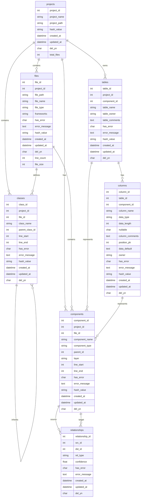
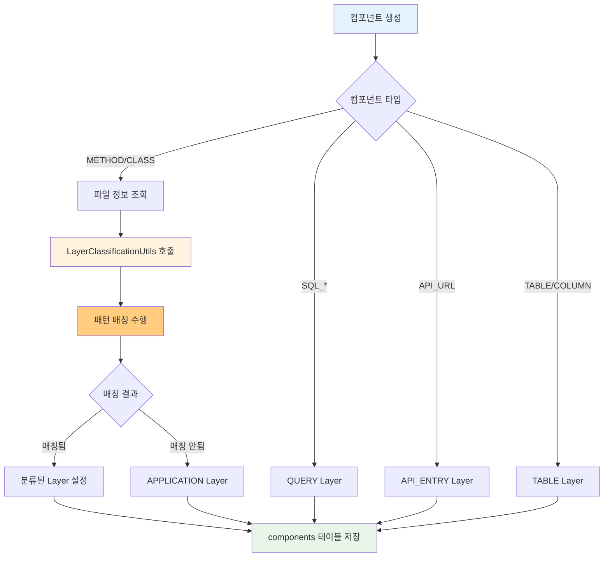
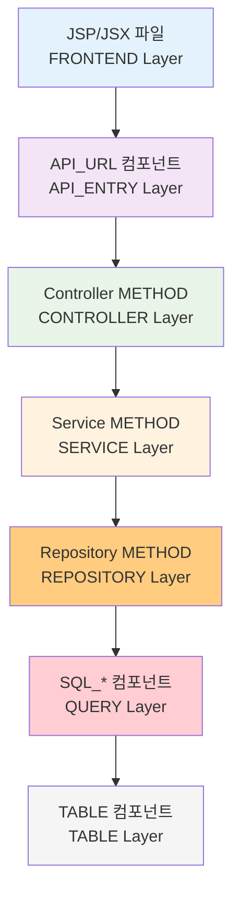
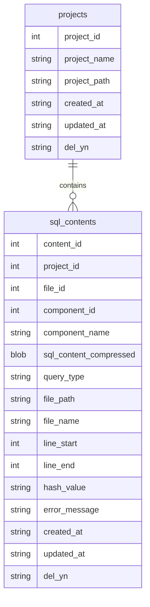

# SourceAnalyzer 메타데이터베이스 스키마 정의서 v4.0

## 문서 목적

이 문서는 SourceAnalyzer 시스템의 **통합 데이터베이스 스키마 구조**를 설명합니다.  
**주요 변경사항**: Java SQL 처리 기능 추가, SqlContent.db 별도 관리, 공통 SQL 파서 적용  
**대상 독자**: 개발자, DBA, 시스템 아키텍트  

## 개요

SourceAnalyzer 시스템의 메타데이터베이스 스키마 정의서 v4.0입니다. Java StringBuilder SQL 추출, SQL 압축 저장, 공통 SQL 조인 분석 기능이 추가되었습니다.

## 스키마 버전

- **버전**: v4.0 (Java SQL 처리 및 공통 SQL 파서 적용)
- **주요 변경**: Java SQL 컴포넌트 지원, SqlContent.db 별도 관리
- **시간대**: 한국 시간대(KST) 적용 (UTC+9)
- **최종 수정**: 2025-01-18

## ERD (Entity Relationship Diagram)



## 테이블 상세 정의

**총 테이블 수**: 7개 (projects, files, classes, components, tables, columns, relationships)

### 1. projects (프로젝트 메타데이터)

프로젝트의 기본 정보를 저장하는 테이블입니다.

| 컬럼명          | 데이터타입        | 제약조건                                  | 설명          |
| ------------ | ------------ | ------------------------------------- | ----------- |
| project_id   | INTEGER      | PRIMARY KEY, AUTOINCREMENT            | 프로젝트 고유 ID  |
| project_name | VARCHAR(100) | NOT NULL                              | 프로젝트명       |
| project_path | VARCHAR(500) | NOT NULL                              | 프로젝트 경로     |
| hash_value   | VARCHAR(64)  |                                       | 변경 감지용 해시값  |
| created_at   | DATETIME     | DEFAULT (datetime('now', '+9 hours')) | 생성일시        |
| updated_at   | DATETIME     | DEFAULT (datetime('now', '+9 hours')) | 수정일시        |
| del_yn       | CHAR(1)      | DEFAULT 'N'                           | 삭제 여부 (Y/N) |
| total_files  | INTEGER      | DEFAULT 0                             | 프로젝트 내 총 파일 수 |

### 2. files (파일 인덱스)

분석 대상 파일들의 최소 정보를 저장하는 테이블입니다.

| 컬럼명           | 데이터타입        | 제약조건                                  | 설명                          |
| ------------- | ------------ | ------------------------------------- | --------------------------- |
| file_id       | INTEGER      | PRIMARY KEY, AUTOINCREMENT            | 파일 고유 ID                    |
| project_id    | INTEGER      | NOT NULL, FK                          | 프로젝트 ID                     |
| file_path     | VARCHAR(500) | NOT NULL                              | 상대경로                        |
| file_name     | VARCHAR(200) | NOT NULL                              | 파일명                         |
| file_type     | VARCHAR(20)  | NOT NULL                              | 파일 타입 (java, jsp, sql, xml, js, html 등) |
| **frameworks** | **VARCHAR(100)** |                                   | **프론트엔드 기술 스택 (jquery, axios, fetch, xhr)** |
| has_error     | CHAR(1)      | DEFAULT 'N'                           | 오류 여부 (Y/N)                 |
| error_message | TEXT         |                                       | 오류 메시지                      |
| hash_value    | VARCHAR(64)  | NOT NULL                              | 변경 감지용 해시값                  |
| created_at    | DATETIME     | DEFAULT (datetime('now', '+9 hours')) | 생성일시                        |
| updated_at    | DATETIME     | DEFAULT (datetime('now', '+9 hours')) | 수정일시                        |
| del_yn        | CHAR(1)      | DEFAULT 'N'                           | 삭제 여부 (Y/N)                 |
| line_count    | INTEGER      |                                       | 라인 수                        |
| file_size     | INTEGER      |                                       | 파일 크기 (바이트)                |

**frameworks 필드 상세:**
- **대상 파일**: JSP, JSX, Vue, TS, TSX, JS, HTML 파일
- **저장 형식**: 콤마 구분 문자열 (예: 'jquery, axios, fetch')
- **중복 제거**: 같은 프레임워크는 한 번만 저장
- **정렬**: 알파벳 순으로 정렬하여 저장
- **소문자 변환**: 일관성을 위해 모두 소문자로 저장

**frameworks 예시 데이터:**
```sql
-- UserList.jsx: Axios와 Fetch 사용
frameworks = 'axios, fetch'

-- OrderForm.jsp: jQuery 사용  
frameworks = 'jquery'

-- ApiClient.js: 모든 방식 사용
frameworks = 'axios, fetch, jquery, xhr'

-- Dashboard.html: jQuery와 Fetch 사용
frameworks = 'fetch, jquery'
```

**외래키 관계:**
- `project_id` → `projects.project_id`

### 3. classes (클래스 정보)

클래스의 기본 정보를 저장하는 테이블입니다.

| 컬럼명             | 데이터타입        | 제약조건                                  | 설명              |
| --------------- | ------------ | ------------------------------------- | --------------- |
| class_id        | INTEGER      | PRIMARY KEY, AUTOINCREMENT            | 클래스 고유 ID       |
| project_id      | INTEGER      | NOT NULL, FK                          | 프로젝트 ID         |
| file_id         | INTEGER      | NOT NULL, FK                          | 파일 ID           |
| class_name      | VARCHAR(200) | NOT NULL                              | 클래스명            |
| parent_class_id | INTEGER      | FK                                    | 상속/구현 부모 클래스 ID |
| line_start      | INTEGER      |                                       | 시작 라인           |
| line_end        | INTEGER      |                                       | 종료 라인           |
| has_error       | CHAR(1)      | DEFAULT 'N'                           | 오류 여부 (Y/N)     |
| error_message   | TEXT         |                                       | 오류 메시지          |
| hash_value      | VARCHAR(64)  |                                       | 변경 감지용 해시값      |
| created_at      | DATETIME     | DEFAULT (datetime('now', '+9 hours')) | 생성일시            |
| updated_at      | DATETIME     | DEFAULT (datetime('now', '+9 hours')) | 수정일시            |
| del_yn          | CHAR(1)      | DEFAULT 'N'                           | 삭제 여부 (Y/N)     |

**외래키 관계:**
- `project_id` → `projects.project_id`
- `file_id` → `files.file_id`
- `parent_class_id` → `classes.class_id` (상속/구현 부모 클래스 참조)

### 4. components (코드 구성 요소 - 통합)

클래스, 메서드, API 호출 등의 모든 구성요소를 저장하는 허브 테이블입니다.

| 컬럼명            | 데이터타입        | 제약조건                                  | 설명                                                                                              |
| -------------- | ------------ | ------------------------------------- | ----------------------------------------------------------------------------------------------- |
| component_id   | INTEGER      | PRIMARY KEY, AUTOINCREMENT            | 구성요소 고유 ID                                                                                      |
| project_id     | INTEGER      | NOT NULL, FK                          | 프로젝트 ID                                                                                         |
| file_id        | INTEGER      | NOT NULL, FK                          | **파일 ID - 컴포넌트별 설정 원칙 적용**                                                                                           |
| component_name | VARCHAR(200) | NOT NULL                              | 구성요소명                                                                                           |
| component_type | VARCHAR(20)  | NOT NULL                              | 구성요소 타입 (METHOD, SQL_SELECT, SQL_INSERT, SQL_UPDATE, SQL_DELETE, TABLE, COLUMN, API_URL). **Java/XML 모두에서 SQL_* 타입 생성 가능**. JSP/JSX/Vue 등 프론트엔드 파일은 files 테이블에만 저장 |
| parent_id      | INTEGER      |                                       | 부모 컴포넌트 ID (COLUMN일때는 TABLE의 component_id, METHOD일때는 classes의 class_id)                                                                              |
| layer          | VARCHAR(30)  |                                       | 계층 (controller, service, mapper, model, dao, view, jsp, xml, db)                                |
| line_start     | INTEGER      |                                       | 시작 라인                                                                                           |
| line_end       | INTEGER      |                                       | 종료 라인                                                                                           |
| has_error      | CHAR(1)      | DEFAULT 'N'                           | 오류 여부 (Y/N)                                                                                     |
| error_message  | TEXT         |                                       | 오류 메시지                                                                                          |
| hash_value     | VARCHAR(64)  |                                       | 변경 감지용 해시값                                                                                      |
| created_at     | DATETIME     | DEFAULT (datetime('now', '+9 hours')) | 생성일시                                                                                            |
| updated_at     | DATETIME     | DEFAULT (datetime('now', '+9 hours')) | 수정일시                                                                                            |
| del_yn         | CHAR(1)      | DEFAULT 'N'                           | 삭제 여부 (Y/N)                                                                                     |
| api_url        | VARCHAR(500) |                                       | API URL (API_URL 타입일 때)                                                                        |
| call_method    | VARCHAR(10)  |                                       | HTTP 메서드 (GET, POST, PUT, DELETE)                                                               |
| class_name     | VARCHAR(200) |                                       | 클래스명 (백엔드 메서드 연결 시)                                                                      |
| method_name    | VARCHAR(200) |                                       | 메서드명 (백엔드 메서드 연결 시)                                                                      |

#### **file_id 설정 원칙**

각 컴포넌트 타입별로 file_id 설정 원칙이 다릅니다:

##### **1. API_URL 컴포넌트**
- **초기 생성**: 백엔드 Java 파일의 file_id
- **매칭 성공**: 프론트엔드 파일의 file_id로 갱신
- **매칭 실패**: 분리된 두 개의 API_URL (각각 다른 file_id)

```python
# 1단계: 백엔드에서 생성
API_URL.file_id = java_file_id

# 2단계: 프론트엔드 매칭 성공
기존_API_URL.file_id = frontend_file_id로 갱신

# 3단계: 프론트엔드 매칭 실패  
새로운_API_URL.file_id = frontend_file_id  # 프론트엔드 것
기존_API_URL.file_id = java_file_id        # 백엔드 것 유지
```

##### **2. TABLE 컴포넌트**
- **원칙**: ALL_TABLES.csv 파일의 file_id 사용
- **구현**: 동적 조회 (하드코딩 금지)

```python
# 동적 file_id 조회
all_tables_file_id = get_file_id_by_name('ALL_TABLES.csv')
TABLE_component.file_id = all_tables_file_id
```

##### **3. COLUMN 컴포넌트**  
- **원칙**: ALL_TAB_COLUMNS.csv 파일의 file_id 사용
- **구현**: 동적 조회 (하드코딩 금지)

```python
# 동적 file_id 조회
all_columns_file_id = get_file_id_by_name('ALL_TAB_COLUMNS.csv')
COLUMN_component.file_id = all_columns_file_id
```

##### **4. METHOD/SQL_* 컴포넌트**
- **원칙**: 실제 소스 파일의 file_id 사용 (Java, XML 등)
- **추론된 컴포넌트**: 원본 소스 파일 file_id 유지

**외래키 관계:**
- `project_id` → `projects.project_id`
- `file_id` → `files.file_id`

**인덱스:**
- `ix_components_01`: (component_name, file_id, project_id) - UNIQUE

### 5. tables (데이터베이스 테이블 정보)

데이터베이스 테이블 정보를 저장하는 테이블입니다.

| 컬럼명            | 데이터타입        | 제약조건                                  | 설명          |
| -------------- | ------------ | ------------------------------------- | ----------- |
| table_id       | INTEGER      | PRIMARY KEY, AUTOINCREMENT            | 테이블 고유 ID   |
| project_id     | INTEGER      | NOT NULL, FK                          | 프로젝트 ID     |
| component_id   | INTEGER      | FK                                    | 구성요소 ID     |
| table_name     | VARCHAR(100) | NOT NULL                              | 테이블명        |
| table_owner    | VARCHAR(50)  | NOT NULL                              | 테이블 소유자     |
| table_comments | TEXT         |                                       | 테이블 코멘트     |
| has_error      | CHAR(1)      | DEFAULT 'N'                           | 오류 여부 (Y/N) |
| error_message  | TEXT         |                                       | 오류 메시지      |
| hash_value     | VARCHAR(64)  |                                       | 변경 감지용 해시값  |
| created_at     | DATETIME     | DEFAULT (datetime('now', '+9 hours')) | 생성일시        |
| updated_at     | DATETIME     | DEFAULT (datetime('now', '+9 hours')) | 수정일시        |
| del_yn         | CHAR(1)      | DEFAULT 'N'                           | 삭제 여부 (Y/N) |

**외래키 관계:**
- `project_id` → `projects.project_id`
- `component_id` → `components.component_id`

### 6. columns (데이터베이스 컬럼 정보)

데이터베이스 컬럼 정보를 저장하는 테이블입니다.

| 컬럼명             | 데이터타입        | 제약조건                                  | 설명                   |
| --------------- | ------------ | ------------------------------------- | -------------------- |
| column_id       | INTEGER      | PRIMARY KEY, AUTOINCREMENT            | 컬럼 고유 ID             |
| table_id        | INTEGER      | NOT NULL, FK                          | 테이블 ID               |
| component_id    | INTEGER      | FK                                    | 컴포넌트 ID (COLUMN 타입) |
| column_name     | VARCHAR(100) | NOT NULL                              | 컬럼명                  |
| data_type       | VARCHAR(50)  |                                       | 데이터 타입               |
| data_length     | INTEGER      |                                       | 데이터 길이               |
| nullable        | CHAR(1)      | DEFAULT 'Y'                           | NULL 허용 여부           |
| column_comments | TEXT         |                                       | 컬럼 코멘트               |
| position_pk     | INTEGER      |                                       | PK 순번 (null이면 PK 아님) |
| data_default    | TEXT         |                                       | 기본값                  |
| owner           | VARCHAR(50)  |                                       | 소유자                  |
| has_error       | CHAR(1)      | DEFAULT 'N'                           | 오류 여부 (Y/N)          |
| error_message   | TEXT         |                                       | 오류 메시지               |
| hash_value      | VARCHAR(64)  |                                       | 변경 감지용 해시값           |
| created_at      | DATETIME     | DEFAULT (datetime('now', '+9 hours')) | 생성일시                 |
| updated_at      | DATETIME     | DEFAULT (datetime('now', '+9 hours')) | 수정일시                 |
| del_yn          | CHAR(1)      | DEFAULT 'N'                           | 삭제 여부 (Y/N)          |

**외래키 관계:**
- `table_id` → `tables.table_id`
- `component_id` → `components.component_id`

### 7. relationships (통합 관계 정보)

모든 관계를 통합 관리하는 테이블입니다.

| 컬럼명             | 데이터타입       | 제약조건                                  | 설명                                                                                            |
| --------------- | ----------- | ------------------------------------- | --------------------------------------------------------------------------------------------- |
| relationship_id | INTEGER     | PRIMARY KEY, AUTOINCREMENT            | 관계 고유 ID                                                                                      |
| src_id          | INTEGER     | NOT NULL, FK                          | 소스 ID (component_id, table_id, column_id 등)                                                   |
| dst_id          | INTEGER     | NOT NULL, FK                          | 대상 ID (component_id, table_id, column_id 등)                                                   |
| rel_type        | VARCHAR(30) | NOT NULL                              | 관계 타입 (CALL_METHOD, CALL_QUERY, USE_TABLE, INHERITANCE, JOIN_EXPLICIT, JOIN_IMPLICIT) |
| confidence      | FLOAT       | DEFAULT 1.0                           | 신뢰도                                                                                           |
| has_error       | CHAR(1)     | DEFAULT 'N'                           | 오류 여부 (Y/N)                                                                                   |
| error_message   | TEXT        |                                       | 오류 메시지                                                                                        |
| created_at      | DATETIME    | DEFAULT (datetime('now', '+9 hours')) | 생성일시                                                                                          |
| updated_at      | DATETIME    | DEFAULT (datetime('now', '+9 hours')) | 수정일시                                                                                          |
| del_yn          | CHAR(1)     | DEFAULT 'N'                           | 삭제 여부 (Y/N)                                                                                   |

**외래키 관계:**
- `src_id` → `components.component_id` (모든 관계의 소스)
- `dst_id` → `components.component_id` (모든 관계의 대상)

## Layer 분류 시스템

### Layer 분류 기준

시스템의 아키텍처를 명확히 파악하기 위해 각 컴포넌트를 레이어별로 분류합니다.

#### Layer 분류 매핑

| 컴포넌트 타입 | Layer | 설명 | 예시 |
|---------------|-------|------|------|
| **FRONTEND** | FRONTEND | 프론트엔드 파일 | JSP, JSX, Vue 파일 |
| **API_URL** | API_ENTRY | API 엔드포인트 | /api/users:GET, /api/orders:POST |
| **METHOD** | CONTROLLER | HTTP 요청 처리 | UserController, OrderServlet |
| **METHOD** | SERVICE | 비즈니스 로직 | UserService, OrderManager |
| **METHOD** | REPOSITORY | 데이터 접근 | UserMapper, OrderDAO |
| **METHOD** | MODEL | 데이터 모델 | UserEntity, OrderVO |
| **METHOD** | UTIL | 유틸리티 | DateUtil, StringHelper |
| **SQL_*** | QUERY | SQL 쿼리 | SQL_SELECT, SQL_INSERT |
| **QUERY** | QUERY | 추론된 쿼리 | INFERRED 쿼리 |
| **TABLE** | TABLE | 데이터베이스 테이블 | USERS, ORDERS |
| **COLUMN** | TABLE | 테이블 컬럼 | USER_ID, ORDER_DATE |

#### 동적 Layer 분류 패턴

METHOD 컴포넌트는 다음 패턴으로 동적 분류됩니다:

**CONTROLLER Layer**:
- suffixes: controller, ctrl, servlet
- keywords: controller, servlet, Servlet, @Controller
- folder_patterns: *controller*, *ctrl*, *web*, *api*, *servlet*

**SERVICE Layer**:
- suffixes: service, svc, manager, facade
- keywords: service, business, logic, manager, facade
- folder_patterns: *service*, *business*, *logic*, *manager*, *facade*

**REPOSITORY Layer**:
- suffixes: dao, repository, repo, mapper
- keywords: dao, repository, mapper, data
- folder_patterns: *dao*, *repository*, *mapper*, *data*

**MODEL Layer**:
- suffixes: entity, model, vo, dto, domain
- keywords: entity, model, vo, dto, domain, bean
- folder_patterns: *model*, *entity*, *vo*, *dto*, *domain*, *bean*, *enums*

**UTIL Layer**:
- suffixes: util, utils, helper, common
- keywords: util, helper, common, tool
- folder_patterns: *util*, *helper*, *common*, *tool*

#### Layer 분류 우선순위

1. **폴더 구조 우선**: 파일 경로의 폴더명이 가장 정확한 분류 기준
2. **클래스명 키워드**: 클래스명에 포함된 키워드로 분류
3. **클래스명 접미사**: 클래스명 끝의 접미사로 분류
4. **기본값**: 분류되지 않은 경우 APPLICATION

### Layer 분류 구현 상세

#### 공통 함수: LayerClassificationUtils

Layer 분류 로직은 `util/layer_classification_utils.py`의 `LayerClassificationUtils` 클래스에서 중앙 관리됩니다.

**주요 메서드**:
- `get_component_layer()`: 컴포넌트 타입과 패턴을 기반으로 레이어 결정
- `classify_component_by_patterns()`: 패턴 매칭을 통한 동적 분류
- `get_layer_classification_patterns()`: 설정 파일에서 분류 패턴 로드

#### 컴포넌트별 Layer 설정 지점

**1. METHOD/CLASS 컴포넌트** (`java_loading.py`):
```python
# Layer 분류를 위한 파일 정보 조회
file_path, file_name = self._get_file_info_for_layer_classification(project_id, file_id)

# Layer 분류 수행 (공통함수 사용)
layer = self.layer_classifier.get_component_layer(
    component_type='METHOD',
    component_name=method_name,
    file_path=file_path,
    file_name=file_name
)
```

**2. SQL_* 컴포넌트** (`xml_loading.py`):
```python
component_data = {
    'layer': 'QUERY',  # SQL 컴포넌트는 QUERY layer
    # ... 기타 필드
}
```

**3. API_URL 컴포넌트** (`backend_entry_loading.py`):
```python
component_data = {
    'layer': 'API_ENTRY',  # API_URL은 API_ENTRY layer
    # ... 기타 필드
}
```

**4. TABLE/COLUMN 컴포넌트** (`file_loading.py`):
```python
component_data = {
    'layer': 'TABLE',  # TABLE/COLUMN은 TABLE layer
    # ... 기타 필드
}
```

#### 설정 파일: java_keyword.yaml

Layer 분류 패턴은 `config/parser/java_keyword.yaml`의 `layer_classification` 섹션에서 관리됩니다:

```yaml
layer_classification:
  controller:
    suffixes: ["controller", "ctrl", "servlet"]
    keywords: ["controller", "servlet", "Servlet", "@Controller"]
    folder_patterns: ["*controller*", "*ctrl*", "*web*", "*api*", "*servlet*"]
  service:
    suffixes: ["service", "svc", "manager", "facade"]
    keywords: ["service", "business", "logic", "manager", "facade"]
    folder_patterns: ["*service*", "*business*", "*logic*", "*manager*", "*facade*"]
  # ... 기타 레이어 패턴
```

#### Layer 분류 장점

1. **아키텍처 명확화**: 각 컴포넌트의 역할과 위치를 명확히 구분
2. **시각적 표현**: 레이어별 색상 구분으로 리포트 가독성 향상
3. **관계 분석**: 레이어간 호출 관계를 통한 아키텍처 패턴 분석
4. **확장성**: 새로운 레이어 패턴을 설정 파일에서 쉽게 추가 가능
5. **일관성**: 모든 컴포넌트에 동일한 분류 기준 적용

#### Layer 분류 처리 플로우



## 단순화된 API 호출 구조

### API_URL 컴포넌트 구조

프론트엔드에서 호출하는 API 정보를 components 테이블에 통합하여 관리합니다.

| 컬럼명 | 설명 | 예시 |
|--------|------|------|
| component_type | API_URL | API_URL |
| component_name | API URL과 HTTP 메서드 조합 | /api/user-profile:GET |
| file_id | 프론트엔드 파일 ID (JSP/JSX) | 201 (JSP 파일 ID) |
| layer | API_ENTRY | API 엔드포인트 레이어 |

**핵심 개념**:
- **프론트엔드 API 호출 = 백엔드 API 진입점**: 동일한 URL이므로 중복 저장 불필요
- **file_id로 프론트 파일 연결**: JSP/JSX 파일에서 호출하는 API임을 명시
- **component_name에 모든 정보 포함**: URL:HTTP_METHOD 형태로 고유 식별
- **layer로 아키텍처 구분**: API_ENTRY 레이어로 명확한 역할 정의

### API 호출 구조 다이어그램 (Layer 포함)



**Layer별 호출 체인 설명**:
1. **FRONTEND Layer**: JSP/JSX/Vue 프론트엔드 파일
2. **API_ENTRY Layer**: 프론트엔드에서 호출하는 API 엔드포인트 (/api/user-profile:GET)
3. **CONTROLLER Layer**: HTTP 요청을 처리하는 컨트롤러 메서드
4. **SERVICE Layer**: 비즈니스 로직을 처리하는 서비스 메서드
5. **REPOSITORY Layer**: 데이터 접근 로직을 처리하는 DAO/Mapper 메서드
6. **QUERY Layer**: 실제 SQL 쿼리 (SQL_SELECT, SQL_INSERT 등)
7. **TABLE Layer**: 데이터베이스 테이블 및 컬럼

### 관계 타입 (6가지 핵심 관계)

#### 1. 메서드 호출 관계
- **CALL_METHOD**: 컴포넌트에서 메서드로의 호출
  - 사용: src_id = 호출하는 컴포넌트, dst_id = 호출받는 METHOD
  - 예시: API_URL → METHOD, METHOD → METHOD (Controller → Service → DAO)
  - 구분: src_id의 component_type으로 호출 유형 판단

#### 2. 쿼리 호출 관계
- **CALL_QUERY**: 메서드에서 SQL 쿼리로의 호출
  - 사용: src_id = METHOD 컴포넌트, dst_id = SQL_* 또는 QUERY 컴포넌트
  - 예시: DAO 메서드에서 SQL 쿼리 호출

#### 3. 테이블 사용 관계
- **USE_TABLE**: SQL 쿼리에서 데이터베이스 테이블 사용
  - 사용: src_id = SQL_* 또는 QUERY 컴포넌트, dst_id = TABLE 컴포넌트
  - 예시: SELECT 쿼리에서 USERS 테이블 사용

#### 4. 상속 관계
- **INHERITANCE**: 클래스 상속 관계
  - 사용: src_id = 자식 클래스 컴포넌트, dst_id = 부모 클래스 컴포넌트
  - 예시: UserController extends BaseController

#### 5. 명시적 조인 관계
- **JOIN_EXPLICIT**: 명시적 조인 관계
  - 사용: src_id = SQL 쿼리 컴포넌트, dst_id = 조인되는 테이블 컴포넌트
  - 예시: SELECT * FROM A JOIN B ON A.id = B.id

#### 6. 암시적 조인 관계
- **JOIN_IMPLICIT**: 암시적 조인 관계
  - 사용: src_id = SQL 쿼리 컴포넌트, dst_id = 조인되는 테이블 컴포넌트
  - 예시: SELECT * FROM A, B WHERE A.id = B.id

**완전한 호출 체인 예시**:
```
JSP 파일 (file_id) 
    ↓
API_URL (/api/user-profile:GET)
    ↓ CALL_METHOD
METHOD (getUserProfile)
    ↓ CALL_METHOD
METHOD (UserService.getUser)
    ↓ CALL_METHOD
METHOD (UserDAO.findById)
    ↓ CALL_QUERY
SQL_SELECT (SELECT * FROM users WHERE id = ?)
    ↓ USE_TABLE
TABLE (USERS)
```

**CallChain Report 쿼리 구조**:
```sql
SELECT 
    ROW_NUMBER() OVER (ORDER BY jsp_file.file_name, api_url.component_name) as chain_id,
    jsp_file.file_name as jsp_file,
    api_url.component_name as api_url,
    class.class_name as class_name,
    method.component_name as method_name,
    xml_file.file_name as xml_file,
    sql.component_name as sql_name,
    sql.component_type as sql_type,
    GROUP_CONCAT(DISTINCT table.table_name) as related_tables
FROM files jsp_file
JOIN components api_url ON jsp_file.file_id = api_url.file_id
JOIN relationships r1 ON api_url.component_id = r1.src_id
JOIN components method ON r1.dst_id = method.component_id
JOIN classes class ON method.parent_id = class.class_id
JOIN relationships r2 ON method.component_id = r2.src_id
JOIN components sql ON r2.dst_id = sql.component_id
JOIN files xml_file ON sql.file_id = xml_file.file_id
LEFT JOIN relationships r3 ON sql.component_id = r3.src_id
LEFT JOIN tables table ON r3.dst_id = table.component_id
WHERE api_url.component_type = 'API_URL'
  AND r1.rel_type = 'CALL_METHOD'
  AND method.component_type = 'METHOD'
  AND r2.rel_type = 'CALL_QUERY'
  AND sql.component_type LIKE 'SQL_%'
  AND (r3.rel_type = 'USE_TABLE' OR r3.rel_type IS NULL)
GROUP BY jsp_file.file_name, api_url.component_name, class.class_name, 
         method.component_name, xml_file.file_name, sql.component_name, sql.component_type
```

**CallChain Report 결과 예시**:
| chain_id | jsp_file | api_url | class_name | method_name | xml_file | sql_name | sql_type | related_tables |
|----------|----------|---------|------------|-------------|----------|----------|----------|----------------|
| 1 | MicroserviceDashboard.jsp | /api/user-profile:GET | MicroserviceController | getUserProfile | UserMapper.xml | getUserById | SQL_SELECT | USERS, USER_PROFILES |
| 2 | UserList.jsp | /api/users:GET | UserController | getUsers | UserMapper.xml | getAllUsers | SQL_SELECT | USERS |

**모든 관계 타입 요약**:
- **CALL_METHOD**: 메서드 호출 관계 (API_URL → METHOD, METHOD → METHOD)
- **CALL_QUERY**: 쿼리 호출 관계 (METHOD → SQL_*/QUERY)
- **USE_TABLE**: 테이블 사용 관계 (SQL_*/QUERY → TABLE)
- **INHERITANCE**: 클래스 상속 관계 (자식 클래스 → 부모 클래스)
- **JOIN_EXPLICIT**: 명시적 조인 관계 (SQL → 조인 테이블)
- **JOIN_IMPLICIT**: 암시적 조인 관계 (SQL → 조인 테이블)

### 데이터 예시

```sql
-- API_URL 컴포넌트들
INSERT INTO components VALUES 
(1001, 1, 201, '/api/user-profile:GET', 'API_URL', NULL, 'FRONTEND', 74, 85, 'N', NULL, 'hash123', '2024-01-01', '2024-01-01', 'N'),
(1002, 1, 201, '/api/order-details:GET', 'API_URL', NULL, 'FRONTEND', 98, 109, 'N', NULL, 'hash456', '2024-01-01', '2024-01-01', 'N');

-- API 호출 관계
INSERT INTO relationships VALUES 
(1001, 2001, 'CALL_METHOD', 1.0, 'N', NULL, 'hash_rel1', '2024-01-01', '2024-01-01', 'N'),  -- API_URL → METHOD
(1002, 2002, 'CALL_METHOD', 1.0, 'N', NULL, 'hash_rel2', '2024-01-01', '2024-01-01', 'N');  -- API_URL → METHOD
```

**실제 데이터 구조**:
- **file_id: 201**: JSP 파일 ID (프론트엔드 파일)
- **component_name**: '/api/user-profile:GET' (URL:HTTP_METHOD 형태)
- **component_type**: 'API_URL' (프론트엔드 API 호출)
- **rel_type**: 'CALL_METHOD' (프론트엔드에서 백엔드로의 호출)

## 주요 개선사항

### 1. 단순화된 구조
- **중복 제거**: 프론트엔드 API 호출 = 백엔드 API 진입점 (동일한 URL)
- **단일 컴포넌트**: API_URL 하나로 프론트엔드와 백엔드 연결
- **명확한 연결**: file_id로 프론트엔드 파일과 API_URL 연결

### 2. 6가지 핵심 관계
- **CALL_METHOD**: 컴포넌트 → METHOD (API_URL → METHOD, METHOD → METHOD)
- **CALL_QUERY**: METHOD → SQL (메서드 → 쿼리)
- **USE_TABLE**: SQL → TABLE (쿼리 → 테이블)
- **INHERITANCE**: 클래스 상속 관계
- **JOIN_EXPLICIT**: 명시적 조인 관계
- **JOIN_IMPLICIT**: 암시적 조인 관계

### 3. 직관적인 호출 체인
```
JSP 파일 → API_URL → METHOD → SQL → TABLE
```

### 4. 확장성
- **새로운 컴포넌트 타입**: components 테이블에 새로운 component_type 추가 가능
- **유연한 관계**: relationships 테이블에서 다양한 관계 타입 지원

## 성능 최적화 특징

1. **변경 감지**: 모든 테이블에 hash_value 컬럼으로 변경 감지
2. **소프트 삭제**: del_yn 컬럼으로 논리적 삭제 지원
3. **오류 추적**: has_error, error_message로 오류 상태 관리
4. **인덱스 최적화**: 자주 조회되는 컬럼 조합에 인덱스 생성
5. **중복 방지**: UNIQUE 인덱스로 데이터 무결성 보장

## 사용 가이드

### 데이터 삽입 순서
1. projects → files → components
2. tables (components 기반)
3. columns (tables 기반)
4. relationships (components 기반)

### 조회 패턴
- **프로젝트별 분석**: projects → files → components
- **파일별 분석**: files → components
- **API 호출 분석**: components (component_type = 'API_URL')
- **테이블별 분석**: tables → columns
- **컴포넌트 관계 분석**: relationships

이 스키마는 SourceAnalyzer 시스템의 핵심 데이터 구조를 정의하며, 프로젝트 분석 결과를 효율적으로 저장하고 조회할 수 있도록 설계되었습니다.

---

## 🗄️ SqlContent.db (별도 데이터베이스) - v4.0 신규 추가

### 개요

SQL 쿼리 내용을 gzip 압축하여 별도로 관리하는 데이터베이스입니다.

- **위치**: `./projects/{project_name}/SqlContent.db`
- **목적**: SQL 내용 압축 저장으로 메타DB 크기 최적화
- **압축 방식**: gzip 압축 (BLOB 형태)
- **지원 범위**: XML 파싱 쿼리 + Java StringBuilder 쿼리

### ERD (SqlContent.db)



### sql_contents 테이블 상세

SQL 쿼리 내용을 압축하여 저장하는 테이블입니다.

| 컬럼명 | 데이터타입 | 제약조건 | 설명 |
|--------|------------|----------|------|
| content_id | INTEGER | PRIMARY KEY, AUTOINCREMENT | SQL 내용 고유 ID |
| project_id | INTEGER | NOT NULL, FK | 프로젝트 ID |
| file_id | INTEGER | | 파일 ID (XML/Java 파일) |
| component_id | INTEGER | | 컴포넌트 ID (SQL_* 타입) |
| component_name | VARCHAR(200) | | 컴포넌트명 (쿼리 ID) |
| sql_content_compressed | BLOB | NOT NULL | **gzip 압축된 SQL 내용** |
| query_type | VARCHAR(20) | NOT NULL | 쿼리 타입 (SQL_SELECT, SQL_INSERT, SQL_UPDATE, SQL_DELETE, QUERY) |
| file_path | VARCHAR(500) | | 파일 경로 (XML/Java) |
| file_name | VARCHAR(200) | | 파일명 |
| line_start | INTEGER | | 시작 라인 (XML=1, Java=실제 라인) |
| line_end | INTEGER | | 종료 라인 (XML=1, Java=실제 라인) |
| hash_value | VARCHAR(64) | | SQL 내용 해시값 |
| error_message | TEXT | | 오류 메시지 |
| created_at | DATETIME | DEFAULT (datetime('now', '+9 hours')) | 생성일시 |
| updated_at | DATETIME | DEFAULT (datetime('now', '+9 hours')) | 수정일시 |
| del_yn | CHAR(1) | DEFAULT 'N' | 삭제 여부 (Y/N) |

**외래키 관계:**
- `project_id` → `projects.project_id`

### 압축 저장 방식

```python
# 압축 저장
import gzip
compressed_content = gzip.compress(sql_content.encode('utf-8'))

# 압축 해제
decompressed_content = gzip.decompress(compressed_content).decode('utf-8')
```

---

## INFERRED 쿼리 처리 개선 방안

### 문제점 및 해결책

**발견된 문제**:
- Java 파서가 `component_type = 'QUERY'`로만 검색하여 XML에서 생성된 `SQL_*` 타입을 찾지 못함
- 결과적으로 모든 쿼리를 inferred query로 중복 생성하여 데이터 중복 발생

**해결 방안**:
1. **쿼리 검색 로직 개선**: `SQL_*` 타입과 `QUERY` 타입 모두 검색
2. **INFERRED 쿼리 정보 보강**: 자바 호출 위치 정보와 SQL 내용 저장
3. **테이블 관계 연결 개선**: `SQL_*` 타입과 `QUERY` 타입 모두 처리

### components 테이블 활용

**쿼리 컴포넌트 타입 (v4.0 개선)**:
- `SQL_SELECT`: **XML/Java 모두에서** 파싱된 SELECT 쿼리
- `SQL_INSERT`: **XML/Java 모두에서** 파싱된 INSERT 쿼리  
- `SQL_UPDATE`: **XML/Java 모두에서** 파싱된 UPDATE 쿼리
- `SQL_DELETE`: **XML/Java 모두에서** 파싱된 DELETE 쿼리
- `QUERY`: Java에서 추론된 INFERRED 쿼리 (정확한 SQL 타입을 모름)

**INFERRED 쿼리 특징**:
- `component_type = 'QUERY'` (정확한 SQL 타입을 알 수 없기 때문)
- `line_start`, `line_end`: 자바에서 쿼리를 호출하는 실제 라인 번호
- `file_id`: 자바 파일의 file_id (XML 파일이 아닌 실제 호출 파일)

### sql_contents 테이블 활용

### Java SQL 처리 기능 (v4.0 신규)

**Java에서 지원하는 SQL 패턴**:
- ✅ **StringBuilder 패턴**: `StringBuilder query = new StringBuilder(); query.append("SELECT ...")`
- ❌ **+ 연산자 패턴**: `String query = "SELECT " + "FROM users"` (미지원)
- ❌ **String.format 패턴**: `String.format("SELECT * FROM %s", tableName)` (미지원)

**Java SQL 컴포넌트 타입**:
- ✅ **SQL_SELECT**: SELECT 쿼리 (StringBuilder에서 추출)
- ✅ **SQL_INSERT**: INSERT 쿼리 (StringBuilder에서 추출)  
- ✅ **SQL_UPDATE**: UPDATE 쿼리 (StringBuilder에서 추출)
- ✅ **SQL_DELETE**: DELETE 쿼리 (StringBuilder에서 추출)
- ❌ **SQL_MERGE**: MERGE 쿼리 (아직 미지원)

**압축 저장 처리**:
- `SqlContentProcessor`를 통한 gzip 압축 저장
- `SqlContent.db`에 별도 관리
- XML과 Java 모두 동일한 방식으로 처리

### sql_contents 테이블 활용

**XML/Java 공통 SQL 내용 저장**:
- `component_id`: SQL 컴포넌트의 component_id
- `sql_content_compressed`: gzip 압축된 SQL 내용 (XML 파싱 결과 또는 Java StringBuilder 추출 결과)
- `query_type`: 정확한 SQL 타입 (SQL_SELECT, SQL_INSERT, SQL_UPDATE, SQL_DELETE)
- `file_path`: 원본 파일 경로 (XML 또는 Java)
- `line_start/line_end`: 실제 라인 번호 (Java의 경우 StringBuilder 위치)
- `START_LINE`, `END_LINE`: 자바 파일에서 SQL이 포함된 라인 범위

### relationships 테이블 활용

**CALL_QUERY 관계**:
- `src_id`: Java METHOD의 component_id
- `dst_id`: SQL 쿼리의 component_id (SQL_* 또는 QUERY 타입)
- `rel_type = 'CALL_QUERY'`

**USE_TABLE 관계**:
- `src_id`: SQL 쿼리의 component_id (SQL_* 또는 QUERY 타입 모두 처리)
- `dst_id`: TABLE의 component_id
- `rel_type = 'USE_TABLE'`

### 개선 효과

1. **중복 방지**: XML에서 생성된 `SQL_*` 타입을 정상적으로 활용
2. **정확한 추적**: 끊어진 쿼리의 정확한 자바 호출 위치 파악
3. **개발 효율성**: 누락된 XML 쿼리 정의를 쉽게 찾아 수정 가능
4. **문서화**: 자동으로 쿼리 호출 관계 문서화