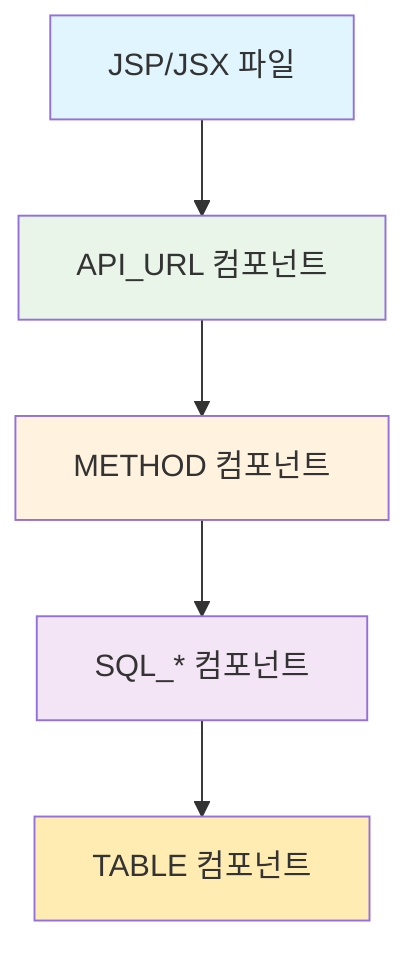

# SourceAnalyzer 메타데이터베이스 스키마 정의서 v3.0

## 문서 목적

이 문서는 SourceAnalyzer 시스템의 **단순화된 데이터베이스 스키마 구조**를 설명합니다.  
**주요 변경사항**: api_components 테이블 제거, components 테이블에 API 호출 정보 통합  
**대상 독자**: 개발자, DBA, 시스템 아키텍트  

## 개요

SourceAnalyzer 시스템의 메타데이터베이스 스키마 정의서 v3.0입니다. 기존의 복잡한 FRONTEND_API/API_ENTRY 구분을 제거하고 단순화된 구조로 개선되었습니다.

## 스키마 버전

- **버전**: v3.0 (단순화된 API 호출 구조)
- **주요 변경**: api_components 테이블 제거, components 테이블 통합
- **시간대**: 한국 시간대(KST) 적용 (UTC+9)

## ERD (Entity Relationship Diagram)

```mermaid
erDiagram
    projects {
        int project_id
        string project_name
        string project_path
        string hash_value
        string created_at
        string updated_at
        string del_yn
        int total_files
    }

    files {
        int file_id
        int project_id
        string file_path
        string file_name
        string file_type
        string has_error
        string error_message
        string hash_value
        string created_at
        string updated_at
        string del_yn
        int line_count
    }

    classes {
        int class_id
        int project_id
        int file_id
        string class_name
        int parent_class_id
        int line_start
        int line_end
        string has_error
        string error_message
        string hash_value
        string created_at
        string updated_at
        string del_yn
    }

    components {
        int component_id
        int project_id
        int file_id
        string component_name
        string component_type
        int parent_id
        string layer
        int line_start
        int line_end
        string has_error
        string error_message
        string hash_value
        string created_at
        string updated_at
        string del_yn
        string api_url
        string call_method
        string class_name
        string method_name
    }

    tables {
        int table_id
        int project_id
        int component_id
        string table_name
        string table_owner
        string table_comments
        string has_error
        string error_message
        string hash_value
        string created_at
        string updated_at
        string del_yn
    }

    columns {
        int column_id
        int table_id
        int component_id
        string column_name
        string data_type
        int data_length
        string nullable
        string column_comments
        int position_pk
        string data_default
        string owner
        string has_error
        string error_message
        string hash_value
        string created_at
        string updated_at
        string del_yn
    }

    relationships {
        int relationship_id
        int src_id
        int dst_id
        string rel_type
        float confidence
        string has_error
        string error_message
        string hash_value
        string created_at
        string updated_at
        string del_yn
    }

    projects ||--o{ files : "has"
    projects ||--o{ classes : "contains"
    projects ||--o{ components : "contains"
    projects ||--o{ tables : "defines"
    files ||--o{ classes : "contains"
    files ||--o{ components : "contains"
    classes ||--o{ classes : "parent_class_id"
    classes ||--o{ components : "parent_id"
    components ||--o{ tables : "defines"
    components ||--o{ relationships : "src_id"
    components ||--o{ relationships : "dst_id"
    tables ||--o{ columns : "has"
    columns ||--o{ components : "component_id"
```



## 테이블 상세 정의

**총 테이블 수**: 7개 (projects, files, classes, components, tables, columns, relationships)

### 1. projects (프로젝트 메타데이터)

프로젝트의 기본 정보를 저장하는 테이블입니다.

| 컬럼명          | 데이터타입        | 제약조건                                  | 설명          |
| ------------ | ------------ | ------------------------------------- | ----------- |
| project_id   | INTEGER      | PRIMARY KEY, AUTOINCREMENT            | 프로젝트 고유 ID  |
| project_name | VARCHAR(100) | NOT NULL                              | 프로젝트명       |
| project_path | VARCHAR(500) | NOT NULL                              | 프로젝트 경로     |
| hash_value   | VARCHAR(64)  |                                       | 변경 감지용 해시값  |
| created_at   | DATETIME     | DEFAULT (datetime('now', '+9 hours')) | 생성일시        |
| updated_at   | DATETIME     | DEFAULT (datetime('now', '+9 hours')) | 수정일시        |
| del_yn       | CHAR(1)      | DEFAULT 'N'                           | 삭제 여부 (Y/N) |
| total_files  | INTEGER      | DEFAULT 0                             | 전체 파일 수     |

### 2. files (파일 인덱스)

분석 대상 파일들의 최소 정보를 저장하는 테이블입니다.

| 컬럼명           | 데이터타입        | 제약조건                                  | 설명                          |
| ------------- | ------------ | ------------------------------------- | --------------------------- |
| file_id       | INTEGER      | PRIMARY KEY, AUTOINCREMENT            | 파일 고유 ID                    |
| project_id    | INTEGER      | NOT NULL, FK                          | 프로젝트 ID                     |
| file_path     | VARCHAR(500) | NOT NULL                              | 상대경로                        |
| file_name     | VARCHAR(200) | NOT NULL                              | 파일명                         |
| file_type     | VARCHAR(20)  |                                       | 파일 타입 (java, jsp, sql, xml) |
| has_error     | CHAR(1)      | DEFAULT 'N'                           | 오류 여부 (Y/N)                 |
| error_message | TEXT         |                                       | 오류 메시지                      |
| hash_value    | VARCHAR(64)  | NOT NULL                              | 변경 감지용 해시값                  |
| created_at    | DATETIME     | DEFAULT (datetime('now', '+9 hours')) | 생성일시                        |
| updated_at    | DATETIME     | DEFAULT (datetime('now', '+9 hours')) | 수정일시                        |
| del_yn        | CHAR(1)      | DEFAULT 'N'                           | 삭제 여부 (Y/N)                 |
| line_count    | INTEGER      |                                       | 라인 수                        |

**외래키 관계:**
- `project_id` → `projects.project_id`

### 3. classes (클래스 정보)

클래스의 기본 정보를 저장하는 테이블입니다.

| 컬럼명             | 데이터타입        | 제약조건                                  | 설명              |
| --------------- | ------------ | ------------------------------------- | --------------- |
| class_id        | INTEGER      | PRIMARY KEY, AUTOINCREMENT            | 클래스 고유 ID       |
| project_id      | INTEGER      | NOT NULL, FK                          | 프로젝트 ID         |
| file_id         | INTEGER      | NOT NULL, FK                          | 파일 ID           |
| class_name      | VARCHAR(200) | NOT NULL                              | 클래스명            |
| parent_class_id | INTEGER      | FK                                    | 상속/구현 부모 클래스 ID |
| line_start      | INTEGER      |                                       | 시작 라인           |
| line_end        | INTEGER      |                                       | 종료 라인           |
| has_error       | CHAR(1)      | DEFAULT 'N'                           | 오류 여부 (Y/N)     |
| error_message   | TEXT         |                                       | 오류 메시지          |
| hash_value      | VARCHAR(64)  |                                       | 변경 감지용 해시값      |
| created_at      | DATETIME     | DEFAULT (datetime('now', '+9 hours')) | 생성일시            |
| updated_at      | DATETIME     | DEFAULT (datetime('now', '+9 hours')) | 수정일시            |
| del_yn          | CHAR(1)      | DEFAULT 'N'                           | 삭제 여부 (Y/N)     |

**외래키 관계:**
- `project_id` → `projects.project_id`
- `file_id` → `files.file_id`
- `parent_class_id` → `classes.class_id` (상속/구현 부모 클래스 참조)

### 4. components (코드 구성 요소 - 통합)

클래스, 메서드, API 호출 등의 모든 구성요소를 저장하는 허브 테이블입니다.

| 컬럼명            | 데이터타입        | 제약조건                                  | 설명                                                                                              |
| -------------- | ------------ | ------------------------------------- | ----------------------------------------------------------------------------------------------- |
| component_id   | INTEGER      | PRIMARY KEY, AUTOINCREMENT            | 구성요소 고유 ID                                                                                      |
| project_id     | INTEGER      | NOT NULL, FK                          | 프로젝트 ID                                                                                         |
| file_id        | INTEGER      | NOT NULL, FK                          | 파일 ID                                                                                           |
| component_name | VARCHAR(200) | NOT NULL                              | 구성요소명                                                                                           |
| component_type | VARCHAR(20)  | NOT NULL                              | 구성요소 타입 (JSP, METHOD, SQL_SELECT, SQL_INSERT, SQL_UPDATE, SQL_DELETE, SQL_MERGE, TABLE, COLUMN, API_CALL) |
| parent_id      | INTEGER      |                                       | 부모 컴포넌트 ID (COLUMN일때는 TABLE의 component_id, METHOD일때는 classes의 class_id)                                                                              |
| layer          | VARCHAR(30)  |                                       | 계층 (controller, service, mapper, model, dao, view, jsp, xml, db)                                |
| line_start     | INTEGER      |                                       | 시작 라인                                                                                           |
| line_end       | INTEGER      |                                       | 종료 라인                                                                                           |
| has_error      | CHAR(1)      | DEFAULT 'N'                           | 오류 여부 (Y/N)                                                                                     |
| error_message  | TEXT         |                                       | 오류 메시지                                                                                          |
| hash_value     | VARCHAR(64)  |                                       | 변경 감지용 해시값                                                                                      |
| created_at     | DATETIME     | DEFAULT (datetime('now', '+9 hours')) | 생성일시                                                                                            |
| updated_at     | DATETIME     | DEFAULT (datetime('now', '+9 hours')) | 수정일시                                                                                            |
| del_yn         | CHAR(1)      | DEFAULT 'N'                           | 삭제 여부 (Y/N)                                                                                     |
| api_url        | VARCHAR(500) |                                       | API URL (API_CALL 타입일 때)                                                                        |
| call_method    | VARCHAR(10)  |                                       | HTTP 메서드 (GET, POST, PUT, DELETE)                                                               |
| class_name     | VARCHAR(200) |                                       | 클래스명 (백엔드 메서드 연결 시)                                                                      |
| method_name    | VARCHAR(200) |                                       | 메서드명 (백엔드 메서드 연결 시)                                                                      |

**외래키 관계:**
- `project_id` → `projects.project_id`
- `file_id` → `files.file_id`

**인덱스:**
- `ix_components_01`: (component_name, file_id, project_id) - UNIQUE

### 5. tables (데이터베이스 테이블 정보)

데이터베이스 테이블 정보를 저장하는 테이블입니다.

| 컬럼명            | 데이터타입        | 제약조건                                  | 설명          |
| -------------- | ------------ | ------------------------------------- | ----------- |
| table_id       | INTEGER      | PRIMARY KEY, AUTOINCREMENT            | 테이블 고유 ID   |
| project_id     | INTEGER      | NOT NULL, FK                          | 프로젝트 ID     |
| component_id   | INTEGER      | FK                                    | 구성요소 ID     |
| table_name     | VARCHAR(100) | NOT NULL                              | 테이블명        |
| table_owner    | VARCHAR(50)  | NOT NULL                              | 테이블 소유자     |
| table_comments | TEXT         |                                       | 테이블 코멘트     |
| has_error      | CHAR(1)      | DEFAULT 'N'                           | 오류 여부 (Y/N) |
| error_message  | TEXT         |                                       | 오류 메시지      |
| hash_value     | VARCHAR(64)  |                                       | 변경 감지용 해시값  |
| created_at     | DATETIME     | DEFAULT (datetime('now', '+9 hours')) | 생성일시        |
| updated_at     | DATETIME     | DEFAULT (datetime('now', '+9 hours')) | 수정일시        |
| del_yn         | CHAR(1)      | DEFAULT 'N'                           | 삭제 여부 (Y/N) |

**외래키 관계:**
- `project_id` → `projects.project_id`
- `component_id` → `components.component_id`

### 6. columns (데이터베이스 컬럼 정보)

데이터베이스 컬럼 정보를 저장하는 테이블입니다.

| 컬럼명             | 데이터타입        | 제약조건                                  | 설명                   |
| --------------- | ------------ | ------------------------------------- | -------------------- |
| column_id       | INTEGER      | PRIMARY KEY, AUTOINCREMENT            | 컬럼 고유 ID             |
| table_id        | INTEGER      | NOT NULL, FK                          | 테이블 ID               |
| component_id    | INTEGER      | FK                                    | 컴포넌트 ID (COLUMN 타입) |
| column_name     | VARCHAR(100) | NOT NULL                              | 컬럼명                  |
| data_type       | VARCHAR(50)  |                                       | 데이터 타입               |
| data_length     | INTEGER      |                                       | 데이터 길이               |
| nullable        | CHAR(1)      | DEFAULT 'Y'                           | NULL 허용 여부           |
| column_comments | TEXT         |                                       | 컬럼 코멘트               |
| position_pk     | INTEGER      |                                       | PK 순번 (null이면 PK 아님) |
| data_default    | TEXT         |                                       | 기본값                  |
| owner           | VARCHAR(50)  |                                       | 소유자                  |
| has_error       | CHAR(1)      | DEFAULT 'N'                           | 오류 여부 (Y/N)          |
| error_message   | TEXT         |                                       | 오류 메시지               |
| hash_value      | VARCHAR(64)  |                                       | 변경 감지용 해시값           |
| created_at      | DATETIME     | DEFAULT (datetime('now', '+9 hours')) | 생성일시                 |
| updated_at      | DATETIME     | DEFAULT (datetime('now', '+9 hours')) | 수정일시                 |
| del_yn          | CHAR(1)      | DEFAULT 'N'                           | 삭제 여부 (Y/N)          |

**외래키 관계:**
- `table_id` → `tables.table_id`
- `component_id` → `components.component_id`

### 7. relationships (통합 관계 정보)

모든 관계를 통합 관리하는 테이블입니다.

| 컬럼명             | 데이터타입       | 제약조건                                  | 설명                                                                                            |
| --------------- | ----------- | ------------------------------------- | --------------------------------------------------------------------------------------------- |
| relationship_id | INTEGER     | PRIMARY KEY, AUTOINCREMENT            | 관계 고유 ID                                                                                      |
| src_id          | INTEGER     | NOT NULL, FK                          | 소스 ID (component_id, table_id, column_id 등)                                                   |
| dst_id          | INTEGER     | NOT NULL, FK                          | 대상 ID (component_id, table_id, column_id 등)                                                   |
| rel_type        | VARCHAR(30) | NOT NULL                              | 관계 타입 (CALL_API, CALL_METHOD_C2S, CALL_METHOD_S2D, CALL_QUERY_M2S, CALL_QUERY_D2S, USE_TABLE_Q2D, USE_TABLE_S2D, FK, PK, JOIN_EXPLICIT, JOIN_IMPLICIT, QUERY_TABLE) |
| confidence      | FLOAT       | DEFAULT 1.0                           | 신뢰도                                                                                           |
| has_error       | CHAR(1)     | DEFAULT 'N'                           | 오류 여부 (Y/N)                                                                                   |
| error_message   | TEXT        |                                       | 오류 메시지                                                                                        |
| created_at      | DATETIME    | DEFAULT (datetime('now', '+9 hours')) | 생성일시                                                                                          |
| updated_at      | DATETIME    | DEFAULT (datetime('now', '+9 hours')) | 수정일시                                                                                          |
| del_yn          | CHAR(1)     | DEFAULT 'N'                           | 삭제 여부 (Y/N)                                                                                   |

**외래키 관계:**
- `src_id` → `components.component_id` (모든 관계의 소스)
- `dst_id` → `components.component_id` (모든 관계의 대상)

## 단순화된 API 호출 구조

### API_URL 컴포넌트 구조

프론트엔드에서 호출하는 API 정보를 components 테이블에 통합하여 관리합니다.

| 컬럼명 | 설명 | 예시 |
|--------|------|------|
| component_type | API_URL | API_URL |
| component_name | API URL과 HTTP 메서드 조합 | /api/user-profile:GET |
| file_id | 프론트엔드 파일 ID (JSP/JSX) | 201 (JSP 파일 ID) |

**핵심 개념**:
- **프론트엔드 API 호출 = 백엔드 API 진입점**: 동일한 URL이므로 중복 저장 불필요
- **file_id로 프론트 파일 연결**: JSP/JSX 파일에서 호출하는 API임을 명시
- **component_name에 모든 정보 포함**: URL:HTTP_METHOD 형태로 고유 식별

### API 호출 구조 다이어그램



**호출 체인 설명**:
1. **JSP/JSX 파일**: 프론트엔드 파일 (file_id로 연결)
2. **API_URL 컴포넌트**: 프론트엔드에서 호출하는 API (/api/user-profile:GET)
3. **METHOD 컴포넌트**: 백엔드 컨트롤러 메서드
4. **SQL_* 컴포넌트**: 데이터베이스 쿼리
5. **TABLE 컴포넌트**: 데이터베이스 테이블

### 관계 타입 (4가지 핵심 관계)

#### 1. 메서드 호출 관계
- **CALL_METHOD**: 컴포넌트에서 메서드로의 호출
  - 사용: src_id = 호출하는 컴포넌트, dst_id = 호출받는 METHOD
  - 예시: API_URL → METHOD, METHOD → METHOD (Controller → Service → DAO)
  - 구분: src_id의 component_type으로 호출 유형 판단

#### 2. 쿼리 호출 관계
- **CALL_QUERY**: 메서드에서 SQL 쿼리로의 호출
  - 사용: src_id = METHOD 컴포넌트, dst_id = SQL_* 컴포넌트
  - 예시: DAO 메서드에서 SQL 쿼리 호출

#### 3. 테이블 사용 관계
- **USE_TABLE**: SQL 쿼리에서 데이터베이스 테이블 사용
  - 사용: src_id = SQL_* 컴포넌트, dst_id = TABLE 컴포넌트
  - 예시: SELECT 쿼리에서 USERS 테이블 사용

#### 4. 기타 관계
- **JOIN_EXPLICIT**: 명시적 조인 관계
- **JOIN_IMPLICIT**: 암시적 조인 관계
- **INHERITANCE**: 클래스 상속 관계

**완전한 호출 체인 예시**:
```
JSP 파일 (file_id) 
    ↓
API_URL (/api/user-profile:GET)
    ↓ CALL_METHOD
METHOD (getUserProfile)
    ↓ CALL_METHOD
METHOD (UserService.getUser)
    ↓ CALL_METHOD
METHOD (UserDAO.findById)
    ↓ CALL_QUERY
SQL_SELECT (SELECT * FROM users WHERE id = ?)
    ↓ USE_TABLE
TABLE (USERS)
```

**CallChain Report 쿼리 구조**:
```sql
SELECT 
    ROW_NUMBER() OVER (ORDER BY jsp_file.file_name, api_url.component_name) as chain_id,
    jsp_file.file_name as jsp_file,
    api_url.component_name as api_url,
    class.class_name as class_name,
    method.component_name as method_name,
    xml_file.file_name as xml_file,
    sql.component_name as sql_name,
    sql.component_type as sql_type,
    GROUP_CONCAT(DISTINCT table.table_name) as related_tables
FROM files jsp_file
JOIN components api_url ON jsp_file.file_id = api_url.file_id
JOIN relationships r1 ON api_url.component_id = r1.src_id
JOIN components method ON r1.dst_id = method.component_id
JOIN classes class ON method.parent_id = class.class_id
JOIN relationships r2 ON method.component_id = r2.src_id
JOIN components sql ON r2.dst_id = sql.component_id
JOIN files xml_file ON sql.file_id = xml_file.file_id
LEFT JOIN relationships r3 ON sql.component_id = r3.src_id
LEFT JOIN tables table ON r3.dst_id = table.component_id
WHERE api_url.component_type = 'API_URL'
  AND r1.rel_type = 'CALL_METHOD'
  AND method.component_type = 'METHOD'
  AND r2.rel_type = 'CALL_QUERY'
  AND sql.component_type LIKE 'SQL_%'
  AND (r3.rel_type = 'USE_TABLE' OR r3.rel_type IS NULL)
GROUP BY jsp_file.file_name, api_url.component_name, class.class_name, 
         method.component_name, xml_file.file_name, sql.component_name, sql.component_type
```

**CallChain Report 결과 예시**:
| chain_id | jsp_file | api_url | class_name | method_name | xml_file | sql_name | sql_type | related_tables |
|----------|----------|---------|------------|-------------|----------|----------|----------|----------------|
| 1 | MicroserviceDashboard.jsp | /api/user-profile:GET | MicroserviceController | getUserProfile | UserMapper.xml | getUserById | SQL_SELECT | USERS, USER_PROFILES |
| 2 | UserList.jsp | /api/users:GET | UserController | getUsers | UserMapper.xml | getAllUsers | SQL_SELECT | USERS |

**기타 관계 타입** (필요시 사용):
- **JOIN_EXPLICIT**: 명시적 조인 관계
- **JOIN_IMPLICIT**: 암시적 조인 관계
- **INHERITANCE**: 클래스 상속 관계

### 데이터 예시

```sql
-- API_URL 컴포넌트들
INSERT INTO components VALUES 
(1001, 1, 201, '/api/user-profile:GET', 'API_URL', NULL, 'FRONTEND', 74, 85, 'N', NULL, 'hash123', '2024-01-01', '2024-01-01', 'N'),
(1002, 1, 201, '/api/order-details:GET', 'API_URL', NULL, 'FRONTEND', 98, 109, 'N', NULL, 'hash456', '2024-01-01', '2024-01-01', 'N');

-- API 호출 관계
INSERT INTO relationships VALUES 
(1001, 2001, 'CALL_API', 1.0, 'N', NULL, 'hash_rel1', '2024-01-01', '2024-01-01', 'N'),  -- API_URL → METHOD
(1002, 2002, 'CALL_API', 1.0, 'N', NULL, 'hash_rel2', '2024-01-01', '2024-01-01', 'N');  -- API_URL → METHOD
```

**실제 데이터 구조**:
- **file_id: 201**: JSP 파일 ID (프론트엔드 파일)
- **component_name**: '/api/user-profile:GET' (URL:HTTP_METHOD 형태)
- **component_type**: 'API_URL' (프론트엔드 API 호출)
- **rel_type**: 'CALL_API' (프론트엔드에서 백엔드로의 호출)

## 주요 개선사항

### 1. 단순화된 구조
- **중복 제거**: 프론트엔드 API 호출 = 백엔드 API 진입점 (동일한 URL)
- **단일 컴포넌트**: API_URL 하나로 프론트엔드와 백엔드 연결
- **명확한 연결**: file_id로 프론트엔드 파일과 API_URL 연결

### 2. 3가지 핵심 관계
- **CALL_METHOD**: 컴포넌트 → METHOD (API_URL → METHOD, METHOD → METHOD)
- **CALL_QUERY**: METHOD → SQL (메서드 → 쿼리)
- **USE_TABLE**: SQL → TABLE (쿼리 → 테이블)

### 3. 직관적인 호출 체인
```
JSP 파일 → API_URL → METHOD → SQL → TABLE
```

### 4. 확장성
- **새로운 컴포넌트 타입**: components 테이블에 새로운 component_type 추가 가능
- **유연한 관계**: relationships 테이블에서 다양한 관계 타입 지원

## 성능 최적화 특징

1. **변경 감지**: 모든 테이블에 hash_value 컬럼으로 변경 감지
2. **소프트 삭제**: del_yn 컬럼으로 논리적 삭제 지원
3. **오류 추적**: has_error, error_message로 오류 상태 관리
4. **인덱스 최적화**: 자주 조회되는 컬럼 조합에 인덱스 생성
5. **중복 방지**: UNIQUE 인덱스로 데이터 무결성 보장

## 사용 가이드

### 데이터 삽입 순서
1. projects → files → components
2. tables (components 기반)
3. columns (tables 기반)
4. relationships (components 기반)

### 조회 패턴
- **프로젝트별 분석**: projects → files → components
- **파일별 분석**: files → components
- **API 호출 분석**: components (component_type = 'API_CALL')
- **테이블별 분석**: tables → columns
- **컴포넌트 관계 분석**: relationships

이 스키마는 SourceAnalyzer 시스템의 핵심 데이터 구조를 정의하며, 프로젝트 분석 결과를 효율적으로 저장하고 조회할 수 있도록 설계되었습니다.
