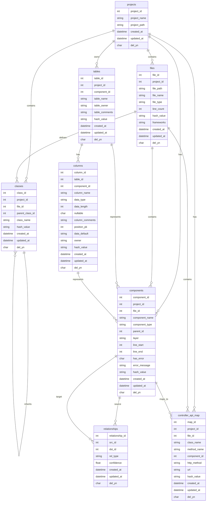
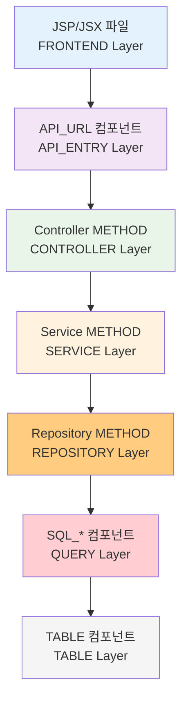

# SourceAnalyzer 메타데이터베이스 스키마 정의서 v4.2

## 문서 목적

이 문서는 SourceAnalyzer 시스템의 **실제 구현된 데이터베이스 스키마 구조**를 설명합니다.
**구현된 기능**: Java SQL 처리, SqlContent.db 선택적 압축 관리, Layer 분류 시스템, ERD 고아 테이블 옵션, 공통 SQL 파서, sqltext 연계
**대상 독자**: 개발자, DBA, 시스템 아키텍트  

## 개요

SourceAnalyzer 시스템의 메타데이터베이스 스키마 정의서 v4.2입니다. 실제 개발소스에 구현된 기능들만을 기반으로 작성되었습니다.

## 스키마 버전

- **버전**: v4.3 (실제 구현 기반)
- **주요 기능**: Layer 분류 시스템, ERD 고아 테이블 옵션, SqlContent 선택적 압축 관리, 정밀 매칭 보조 테이블, sqltext 기반 쿼리 관리
- **시간대**: 한국 시간대(KST) 적용 (UTC+9)
- **최종 수정**: 2025-01-01
- **구현 상태**: 7단계 파이프라인, 리포트 생성, SQL 1패스 파서 개선, 정밀 휴리스틱 통합, 즉시 관계 생성, 인덱싱 보완, 경로키 일관성

## ERD (Entity Relationship Diagram)


```mermaid
erDiagram
    projects {
        int project_id
        string project_name
        string project_path
        datetime created_at
        datetime updated_at
        char del_yn
    }

    files {
        int file_id
        int project_id
        string file_path
        string file_name
        string file_type
        int line_count
        string hash_value
        string frameworks
        datetime created_at
        datetime updated_at
        char del_yn
    }

    tables {
        int table_id
        int project_id
        int component_id
        string table_name
        string table_owner
        string table_comments
        string hash_value
        datetime created_at
        datetime updated_at
        char del_yn
    }

    columns {
        int column_id
        int table_id
        int component_id
        string column_name
        string data_type
        int data_length
        char nullable
        string column_comments
        int position_pk
        string data_default
        string owner
        string hash_value
        datetime created_at
        datetime updated_at
        char del_yn
    }

    classes {
        int class_id
        int project_id
        int file_id
        int parent_class_id
        string class_name
        string hash_value
        datetime created_at
        datetime updated_at
        char del_yn
    }

    components {
        int component_id
        int project_id
        int file_id
        string component_name
        string component_type
        int parent_id
        string layer
        int line_start
        int line_end
        char has_error
        string error_message
        string hash_value
        datetime created_at
        datetime updated_at
        char del_yn
    }

    relationships {
        int relationship_id
        int src_id
        int dst_id
        string rel_type
        float confidence
        datetime created_at
        datetime updated_at
        char del_yn
    }

    controller_api_map {
        int map_id
        int project_id
        int file_id
        string class_name
        string method_name
        int component_id
        string http_method
        string url
        string hash_value
        datetime created_at
        datetime updated_at
        char del_yn
    }

    projects ||--o{ files : contains
    projects ||--o{ tables : owns
    projects ||--o{ classes : contains
    projects ||--o{ components : has
    projects ||--o{ controller_api_map : has
    
    files ||--o{ classes : defines
    files ||--o{ components : contains
    files ||--o{ controller_api_map : contains
    
    tables ||--o{ columns : has
    tables ||--o{ components : represents
    
    columns ||--o{ components : represents
    
    classes ||--o{ classes : inherits
    
    components ||--o{ relationships : source
    components ||--o{ relationships : target
    components ||--o{ controller_api_map : maps_to
```

## 테이블 상세 정의

**총 테이블 수**: 8개 (projects, files, classes, components, tables, columns, relationships, controller_api_map)

### 1. projects (프로젝트 메타데이터)

프로젝트의 기본 정보를 저장하는 테이블입니다.

| 컬럼명          | 데이터타입        | 제약조건                                  | 설명          |
| ------------ | ------------ | ------------------------------------- | ----------- |
| project_id   | INTEGER      | PRIMARY KEY, AUTOINCREMENT            | 프로젝트 고유 ID  |
| project_name | VARCHAR(100) | NOT NULL                              | 프로젝트명       |
| project_path | VARCHAR(500) | NOT NULL                              | 프로젝트 경로     |
| created_at   | DATETIME     | DEFAULT (datetime('now', '+9 hours')) | 생성일시        |
| updated_at   | DATETIME     | DEFAULT (datetime('now', '+9 hours')) | 수정일시        |
| del_yn       | CHAR(1)      | DEFAULT 'N'                           | 삭제 여부 (Y/N) |

### 2. files (파일 인덱스)

분석 대상 파일들의 최소 정보를 저장하는 테이블입니다.

| 컬럼명           | 데이터타입        | 제약조건                                  | 설명                          |
| ------------- | ------------ | ------------------------------------- | --------------------------- |
| file_id       | INTEGER      | PRIMARY KEY, AUTOINCREMENT            | 파일 고유 ID                    |
| project_id    | INTEGER      | NOT NULL, FK                          | 프로젝트 ID                     |
| file_path     | VARCHAR(1000) | NOT NULL                              | 디렉터리 경로(Unix 방식)        |
| file_name     | VARCHAR(300) | NOT NULL                              | 파일명                         |
| file_type     | VARCHAR(50)  | NOT NULL                              | 파일 타입 (JAVA/XML/JSP/JS/TS/CSV/HTML 등) |
| line_count    | INTEGER      | DEFAULT 0                             | 라인 수                        |
| hash_value    | VARCHAR(64)  |                                       | 파일 내용 해시(생성)            |
| frameworks    | VARCHAR(200) |                                       | 프레임워크 정보(생성, 예: spring,mybatis) |
| created_at    | DATETIME     | DEFAULT (datetime('now', '+9 hours')) | 생성일시                        |
| updated_at    | DATETIME     | DEFAULT (datetime('now', '+9 hours')) | 수정일시                        |
| del_yn        | CHAR(1)      | DEFAULT 'N'                           | 삭제 여부 (Y/N)                 |

**frameworks 필드 상세:**
- **대상 파일**: JSP, JSX, Vue, TS, TSX, JS, HTML 파일
- **저장 형식**: 콤마 구분 문자열 (예: 'jquery, axios, fetch')
- **중복 제거**: 같은 프레임워크는 한 번만 저장
- **정렬**: 알파벳 순으로 정렬하여 저장
- **소문자 변환**: 일관성을 위해 모두 소문자로 저장

**frameworks 예시 데이터:**
```sql
-- UserList.jsx: Axios와 Fetch 사용
frameworks = 'axios, fetch'

-- OrderForm.jsp: jQuery 사용  
frameworks = 'jquery'

-- ApiClient.js: 모든 방식 사용
frameworks = 'axios, fetch, jquery, xhr'

-- Dashboard.html: jQuery와 Fetch 사용
frameworks = 'fetch, jquery'
```

**외래키 관계:**
- `project_id` → `projects.project_id`

### 3.1 controller_api_map (Controller API 매핑 보조 테이블)

Controller와 API_URL 간의 정밀 매핑 정보를 저장하는 보조 테이블입니다.

| 컬럼명             | 데이터타입        | 제약조건                                  | 설명              |
| --------------- | ------------ | ------------------------------------- | --------------- |
| map_id          | INTEGER      | PRIMARY KEY, AUTOINCREMENT            | 매핑 고유 ID       |
| project_id      | INTEGER      | NOT NULL, FK                          | 프로젝트 ID         |
| file_id         | INTEGER      | NOT NULL, FK                          | 파일 ID           |
| class_name      | VARCHAR(200) | NOT NULL                              | Controller 클래스명 |
| method_name     | VARCHAR(200) | NOT NULL                              | 메서드명            |
| component_id    | INTEGER      | FK                                    | 메서드의 component_id |
| http_method     | VARCHAR(10)  | NOT NULL                              | HTTP 메서드 (GET/POST/PUT/DELETE) |
| url             | VARCHAR(500) | NOT NULL                              | API URL           |
| hash_value      | VARCHAR(64)  | NOT NULL                              | API identity 해시  |
| created_at      | DATETIME     | DEFAULT (datetime('now', '+9 hours')) | 생성일시           |
| updated_at      | DATETIME     | DEFAULT (datetime('now', '+9 hours')) | 수정일시           |
| del_yn          | CHAR(1)      | DEFAULT 'N'                           | 삭제 여부 (Y/N)    |

**외래키 관계:**
- `project_id` → `projects.project_id`
- `file_id` → `files.file_id`
- `component_id` → `components.component_id`

### 3.2 classes (클래스 정보)

클래스의 기본 정보를 저장하는 테이블입니다.

| 컬럼명             | 데이터타입        | 제약조건                                  | 설명              |
| --------------- | ------------ | ------------------------------------- | --------------- |
| class_id        | INTEGER      | PRIMARY KEY, AUTOINCREMENT            | 클래스 고유 ID       |
| project_id      | INTEGER      | NOT NULL, FK                          | 프로젝트 ID         |
| file_id         | INTEGER      | NOT NULL, FK                          | 파일 ID           |
| class_name      | VARCHAR(200) | NOT NULL                              | 클래스명            |
| parent_class_id | INTEGER      | FK                                    | 상속/구현 부모 클래스 ID |
| line_start      | INTEGER      |                                       | 시작 라인           |
| line_end        | INTEGER      |                                       | 종료 라인           |
| hash_value      | VARCHAR(64)  |                                       | 변경 감지용 해시값      |
| created_at      | DATETIME     | DEFAULT (datetime('now', '+9 hours')) | 생성일시            |
| updated_at      | DATETIME     | DEFAULT (datetime('now', '+9 hours')) | 수정일시            |
| del_yn          | CHAR(1)      | DEFAULT 'N'                           | 삭제 여부 (Y/N)     |

**외래키 관계:**
- `project_id` → `projects.project_id`
- `file_id` → `files.file_id`
- `parent_class_id` → `classes.class_id` (상속/구현 부모 클래스 참조)

### 4. components (코드 구성 요소 - 통합)

클래스, 메서드, API 호출 등의 모든 구성요소를 저장하는 허브 테이블입니다.

| 컬럼명            | 데이터타입        | 제약조건                                  | 설명                                                                                              |
| -------------- | ------------ | ------------------------------------- | ----------------------------------------------------------------------------------------------- |
| component_id   | INTEGER      | PRIMARY KEY, AUTOINCREMENT            | 구성요소 고유 ID                                                                                      |
| project_id     | INTEGER      | NOT NULL, FK                          | 프로젝트 ID                                                                                         |
| file_id        | INTEGER      | NOT NULL, FK                          | **파일 ID - 컴포넌트별 설정 원칙 적용**                                                                                           |
| component_name | VARCHAR(200) | NOT NULL                              | 구성요소명                                                                                           |
| component_type | VARCHAR(20)  | NOT NULL                              | 구성요소 타입 (METHOD, SQL_SELECT, SQL_INSERT, SQL_UPDATE, SQL_DELETE, TABLE, COLUMN, API_URL). **Java/XML 모두에서 SQL_* 타입 생성 가능**. JSP/JSX/Vue 등 프론트엔드 파일은 files 테이블에만 저장 |
| parent_id      | INTEGER      |                                       | 부모 컴포넌트 ID (COLUMN일때는 TABLE의 component_id, METHOD일때는 classes의 class_id)                                                                              |

#### **parent_id 사용 규칙**

각 컴포넌트 타입별로 parent_id 설정 원칙이 다릅니다:

| 컴포넌트 타입 | parent_id 값 | 설명 | 예시 |
|---------------|---------------|------|------|
| **METHOD** | classes.class_id | 메서드가 속한 클래스의 ID | UserController.getUser() → UserController 클래스 ID |
| **COLUMN** | TABLE의 component_id | 컬럼이 속한 테이블의 컴포넌트 ID | USERS.user_id → USERS 테이블의 component_id |
| **API_URL** | None | 독립적 API 엔드포인트 | /api/users:GET |
| **SQL_*** | None | 독립적 SQL 쿼리 | SELECT * FROM users |
| **TABLE** | None | 독립적 데이터베이스 테이블 | USERS |
| **CLASS** | None | 독립적 클래스 | UserController |
| layer          | VARCHAR(30)  |                                       | 계층 (controller, service, mapper, model, dao, view, jsp, xml, db)                                |
| line_start     | INTEGER      |                                       | 시작 라인                                                                                           |
| line_end       | INTEGER      |                                       | 종료 라인                                                                                           |
| hash_value     | VARCHAR(64)  |                                       | 변경 감지용 해시값                                                                                      |
| created_at     | DATETIME     | DEFAULT (datetime('now', '+9 hours')) | 생성일시                                                                                            |
| updated_at     | DATETIME     | DEFAULT (datetime('now', '+9 hours')) | 수정일시                                                                                            |
| del_yn         | CHAR(1)      | DEFAULT 'N'                           | 삭제 여부 (Y/N)                                                                                     |
#### **file_id 설정 원칙**

각 컴포넌트 타입별로 file_id 설정 원칙이 다릅니다:

##### **1. API_URL 컴포넌트**
- **초기 생성**: 백엔드 Java 파일의 file_id
- **매칭 성공**: 프론트엔드 파일의 file_id로 갱신
- **매칭 실패**: 분리된 두 개의 API_URL (각각 다른 file_id)

```python
# 1단계: 백엔드에서 생성
API_URL.file_id = java_file_id

# 2단계: 프론트엔드 매칭 성공
기존_API_URL.file_id = frontend_file_id로 갱신

# 3단계: 프론트엔드 매칭 실패  
새로운_API_URL.file_id = frontend_file_id  # 프론트엔드 것
기존_API_URL.file_id = java_file_id        # 백엔드 것 유지
```

##### **2. TABLE 컴포넌트**
- **원칙**: ALL_TABLES.csv 파일의 file_id 사용
- **구현**: 동적 조회 (하드코딩 금지)

```python
# 동적 file_id 조회
all_tables_file_id = get_file_id_by_name('ALL_TABLES.csv')
TABLE_component.file_id = all_tables_file_id
```

##### **3. COLUMN 컴포넌트**  
- **원칙**: ALL_TAB_COLUMNS.csv 파일의 file_id 사용
- **구현**: 동적 조회 (하드코딩 금지)

```python
# 동적 file_id 조회
all_columns_file_id = get_file_id_by_name('ALL_TAB_COLUMNS.csv')
COLUMN_component.file_id = all_columns_file_id
```

##### **4. METHOD/SQL_* 컴포넌트**
- **원칙**: 실제 소스 파일의 file_id 사용 (Java, XML 등)
- **모든 파서 생성 컴포넌트**: 원본 소스 파일 file_id 유지

**외래키 관계:**
- `project_id` → `projects.project_id`
- `file_id` → `files.file_id`

**인덱스:**
- `ix_components_01`: (component_name, file_id, project_id) - UNIQUE

### 5. tables (데이터베이스 테이블 정보)

데이터베이스 테이블 정보를 저장하는 테이블입니다.

| 컬럼명            | 데이터타입        | 제약조건                                  | 설명          |
| -------------- | ------------ | ------------------------------------- | ----------- |
| table_id       | INTEGER      | PRIMARY KEY, AUTOINCREMENT            | 테이블 고유 ID   |
| project_id     | INTEGER      | NOT NULL, FK                          | 프로젝트 ID     |
| component_id   | INTEGER      | FK                                    | 구성요소 ID     |
| table_name     | VARCHAR(100) | NOT NULL                              | 테이블명        |
| table_owner    | VARCHAR(50)  | NOT NULL                              | 테이블 소유자     |
| table_comments | TEXT         |                                       | 테이블 코멘트     |
| hash_value     | VARCHAR(64)  |                                       | 변경 감지용 해시값  |
| created_at     | DATETIME     | DEFAULT (datetime('now', '+9 hours')) | 생성일시        |
| updated_at     | DATETIME     | DEFAULT (datetime('now', '+9 hours')) | 수정일시        |
| del_yn         | CHAR(1)      | DEFAULT 'N'                           | 삭제 여부 (Y/N) |

**외래키 관계:**
- `project_id` → `projects.project_id`
- `component_id` → `components.component_id`

### 6. columns (데이터베이스 컬럼 정보)

데이터베이스 컬럼 정보를 저장하는 테이블입니다.

| 컬럼명             | 데이터타입        | 제약조건                                  | 설명                   |
| --------------- | ------------ | ------------------------------------- | -------------------- |
| column_id       | INTEGER      | PRIMARY KEY, AUTOINCREMENT            | 컬럼 고유 ID             |
| table_id        | INTEGER      | NOT NULL, FK                          | 테이블 ID               |
| component_id    | INTEGER      | FK                                    | 컴포넌트 ID (COLUMN 타입) |
| column_name     | VARCHAR(100) | NOT NULL                              | 컬럼명                  |
| data_type       | VARCHAR(50)  |                                       | 데이터 타입               |
| data_length     | INTEGER      |                                       | 데이터 길이               |
| nullable        | CHAR(1)      | DEFAULT 'Y'                           | NULL 허용 여부           |
| column_comments | TEXT         |                                       | 컬럼 코멘트               |
| position_pk     | INTEGER      |                                       | PK 순번 (null이면 PK 아님) |
| data_default    | TEXT         |                                       | 기본값                  |
| owner           | VARCHAR(50)  |                                       | 소유자                  |
| hash_value      | VARCHAR(64)  |                                       | 변경 감지용 해시값           |
| created_at      | DATETIME     | DEFAULT (datetime('now', '+9 hours')) | 생성일시                 |
| updated_at      | DATETIME     | DEFAULT (datetime('now', '+9 hours')) | 수정일시                 |
| del_yn          | CHAR(1)      | DEFAULT 'N'                           | 삭제 여부 (Y/N)          |

**외래키 관계:**
- `table_id` → `tables.table_id`
- `component_id` → `components.component_id`

### 7. relationships (통합 관계 정보)

모든 관계를 통합 관리하는 테이블입니다.

| 컬럼명             | 데이터타입       | 제약조건                                  | 설명                                                                                            |
| --------------- | ----------- | ------------------------------------- | --------------------------------------------------------------------------------------------- |
| relationship_id | INTEGER     | PRIMARY KEY, AUTOINCREMENT            | 관계 고유 ID                                                                                      |
| src_id          | INTEGER     | NOT NULL, FK                          | 소스 ID (component_id, table_id, column_id 등)                                                   |
| dst_id          | INTEGER     | NOT NULL, FK                          | 대상 ID (component_id, table_id, column_id 등)                                                   |
| rel_type        | VARCHAR(50) | NOT NULL                              | 관계 타입 (CALL_API, CALL_METHOD, CALL_QUERY, USE_TABLE, INHERITANCE, JOIN_EXPLICIT, JOIN_EXPLICIT_OUTER, JOIN_EXPLICIT_FULL_OUTER, JOIN_IMPLICIT, JOIN_IMPLICIT_OUTER, JOIN_MERGEON) |
| confidence      | FLOAT       | DEFAULT 1.0                           | 신뢰도                                                                                           |
| created_at      | DATETIME    | DEFAULT (datetime('now', '+9 hours')) | 생성일시                                                                                          |
| updated_at      | DATETIME    | DEFAULT (datetime('now', '+9 hours')) | 수정일시                                                                                          |
| del_yn          | CHAR(1)     | DEFAULT 'N'                           | 삭제 여부 (Y/N)                                                                                   |

**외래키 관계:**
- `src_id` → `components.component_id` (모든 관계의 소스)
- `dst_id` → `components.component_id` (모든 관계의 대상)

### 8. controller_api_map (컨트롤러 API 매핑 정보)

컨트롤러 어노테이션 정보를 저장하여 API_URL↔METHOD 정밀 매칭을 위한 보조 테이블입니다.

| 컬럼명           | 데이터타입        | 제약조건                                  | 설명                          |
| ------------- | ------------ | ------------------------------------- | --------------------------- |
| map_id        | INTEGER      | PRIMARY KEY, AUTOINCREMENT            | 매핑 고유 ID                    |
| project_id    | INTEGER      | NOT NULL, FK                          | 프로젝트 ID                     |
| file_id       | INTEGER      | FK                                    | 파일 ID (Java 컨트롤러 파일)      |
| class_name    | VARCHAR(200) | NOT NULL                              | 클래스명 (예: UserController)    |
| method_name   | VARCHAR(200) | NOT NULL                              | 메서드명 (예: selectUser)        |
| http_method   | VARCHAR(10)  |                                       | HTTP 메서드 (예: GET, POST)      |
| url           | TEXT         |                                       | URL 패턴 (예: /api/users)        |
| identity_hash | VARCHAR(64)  |                                       | 식별 해시 (HTTP+URL 조합)         |
| created_at    | DATETIME     | DEFAULT (datetime('now', '+9 hours')) | 생성일시                        |
| del_yn        | CHAR(1)      | DEFAULT 'N'                           | 삭제 여부 (Y/N)                 |

**외래키 관계:**
- `project_id` → `projects.project_id`
- `file_id` → `files.file_id`

**인덱스:**
- `ix_controller_api_map_01`: (project_id, identity_hash) - 해시로 빠른 조회
- `ix_controller_api_map_02`: (project_id, class_name, method_name) - 클래스+메서드로 빠른 조회

### 9. mapper_map (MyBatis 매핑 정보)

MyBatis XML의 namespace + id와 SQL 컴포넌트를 연결하는 보조 테이블입니다.

| 컬럼명             | 데이터타입        | 제약조건                                  | 설명                          |
| --------------- | ------------ | ------------------------------------- | --------------------------- |
| map_id           | INTEGER      | PRIMARY KEY, AUTOINCREMENT            | 매핑 고유 ID                    |
| project_id       | INTEGER      | NOT NULL, FK                          | 프로젝트 ID                     |
| file_id          | INTEGER      | FK                                    | 파일 ID (XML 매퍼 파일)         |
| namespace        | VARCHAR(500) | NOT NULL                              | 네임스페이스 (예: com.example.UserMapper) |
| query_id         | VARCHAR(200) | NOT NULL                              | 쿼리 ID (예: selectUser)        |
| sql_component_id | INTEGER      | NOT NULL, FK                          | SQL 컴포넌트 ID                 |
| created_at       | DATETIME     | DEFAULT (datetime('now', '+9 hours')) | 생성일시                        |
| del_yn           | CHAR(1)      | DEFAULT 'N'                           | 삭제 여부 (Y/N)                 |

**외래키 관계:**
- `project_id` → `projects.project_id`
- `file_id` → `files.file_id`
- `sql_component_id` → `components.component_id`

**인덱스:**
- `ix_mapper_map_01`: (project_id, namespace, query_id) - UNIQUE - 프로젝트 내에서 namespace + query_id는 유일해야 함

## Layer 분류 시스템 (실제 구현)

### 구현 위치
- **핵심 클래스**: `util/layer_classification_utils.py`의 `LayerClassificationUtils`
- **설정 파일**: `config/parser/java_keyword.yaml`의 `layer_classification` 섹션

### Layer 분류 매핑

| 컴포넌트 타입 | Layer | 설명 | 예시 |
|---------------|-------|------|------|
| **FRONTEND** | FRONTEND | 프론트엔드 파일 | JSP, JSX, Vue 파일 |
| **API_URL** | API_ENTRY | API 엔드포인트 | /api/users:GET, /api/orders:POST |
| **METHOD** | CONTROLLER | HTTP 요청 처리 | UserController, OrderServlet |
| **METHOD** | SERVICE | 비즈니스 로직 | UserService, OrderManager |
| **METHOD** | REPOSITORY | 데이터 접근 | UserMapper, OrderDAO |
| **METHOD** | MODEL | 데이터 모델 | UserEntity, OrderVO |
| **METHOD** | UTIL | 유틸리티 | DateUtil, StringHelper |
| **SQL_*** | QUERY | SQL 쿼리 | SQL_SELECT, SQL_INSERT |
| **QUERY** | QUERY | 미분류/보조용 쿼리 | 비정형 쿼리 (자동 생성하지 않음) |
| **TABLE** | TABLE | 데이터베이스 테이블 | USERS, ORDERS |
| **COLUMN** | TABLE | 테이블 컬럼 | USER_ID, ORDER_DATE |

### 동적 Layer 분류 패턴

**설정 파일**: `config/parser/java_keyword.yaml`
```yaml
layer_classification:
  controller:
    suffixes: ["controller", "ctrl", "servlet"]
    keywords: ["controller", "servlet", "Servlet", "@Controller"]
    folder_patterns: ["*controller*", "*ctrl*", "*web*", "*api*", "*servlet*"]
  service:
    suffixes: ["service", "svc", "manager", "facade"]
    keywords: ["service", "business", "logic", "manager", "facade"]
    folder_patterns: ["*service*", "*business*", "*logic*", "*manager*", "*facade*"]
  # ... 기타 레이어 패턴
```

### Layer 분류 우선순위

1. **폴더 구조 우선**: 파일 경로의 폴더명이 가장 정확한 분류 기준
2. **클래스명 키워드**: 클래스명에 포함된 키워드로 분류
3. **클래스명 접미사**: 클래스명 끝의 접미사로 분류
4. **기본값**: 분류되지 않은 경우 APPLICATION

### 주요 메서드

- `get_component_layer()`: 컴포넌트 타입과 패턴을 기반으로 레이어 결정
- `classify_component_by_patterns()`: 패턴 매칭을 통한 동적 분류
- `get_layer_classification_patterns()`: 설정 파일에서 분류 패턴 로드

## 단순화된 API 호출 구조

### API_URL 컴포넌트 구조

프론트엔드에서 호출하는 API 정보를 components 테이블에 통합하여 관리합니다.

| 컬럼명 | 설명 | 예시 |
|--------|------|------|
| component_type | API_URL | API_URL |
| component_name | API URL과 HTTP 메서드 조합 | /api/user-profile:GET |
| file_id | 프론트엔드 파일 ID (JSP/JSX) | 201 (JSP 파일 ID) |
| layer | API_ENTRY | API 엔드포인트 레이어 |

**핵심 개념**:
- **프론트엔드 API 호출 = 백엔드 API 진입점**: 동일한 URL이므로 중복 저장 불필요
- **file_id로 프론트 파일 연결**: JSP/JSX 파일에서 호출하는 API임을 명시
- **component_name에 모든 정보 포함**: URL:HTTP_METHOD 형태로 고유 식별
- **layer로 아키텍처 구분**: API_ENTRY 레이어로 명확한 역할 정의

### API 호출 구조 다이어그램 (Layer 포함)


```mermaid
graph TD
    A[JSP/JSX 파일<br/>FRONTEND Layer] --> B[API_URL 컴포넌트<br/>API_ENTRY Layer]
    B --> C[Controller METHOD<br/>CONTROLLER Layer]
    C --> D[Service METHOD<br/>SERVICE Layer]
    D --> E[Repository METHOD<br/>REPOSITORY Layer]
    E --> F[SQL_* 컴포넌트<br/>QUERY Layer]
    F --> G[TABLE 컴포넌트<br/>TABLE Layer]
    
    style A fill:#e3f2fd
    style B fill:#f3e5f5
    style C fill:#e8f5e8
    style D fill:#fff3e0
    style E fill:#ffcc80
    style F fill:#ffcdd2
    style G fill:#f5f5f5
```

**Layer별 호출 체인 설명**:
1. **FRONTEND Layer**: JSP/JSX/Vue 프론트엔드 파일
2. **API_ENTRY Layer**: 프론트엔드에서 호출하는 API 엔드포인트 (/api/user-profile:GET)
3. **CONTROLLER Layer**: HTTP 요청을 처리하는 컨트롤러 메서드
4. **SERVICE Layer**: 비즈니스 로직을 처리하는 서비스 메서드
5. **REPOSITORY Layer**: 데이터 접근 로직을 처리하는 DAO/Mapper 메서드
6. **QUERY Layer**: 실제 SQL 쿼리 (SQL_SELECT, SQL_INSERT 등)
7. **TABLE Layer**: 데이터베이스 테이블 및 컬럼

### 관계 타입 (7가지 핵심 관계)

#### 1. API 호출 관계
- **CALL_API**: JSP/프론트엔드에서 API_URL로의 호출
  - 사용: src_id = JSP/프론트엔드 컴포넌트, dst_id = API_URL 컴포넌트
  - 예시: JSP 파일에서 API 호출

#### 2. 메서드 호출 관계
- **CALL_METHOD**: 컴포넌트에서 메서드로의 호출
  - 사용: src_id = 호출하는 컴포넌트, dst_id = 호출받는 METHOD
  - 예시: API_URL → METHOD, METHOD → METHOD (Controller → Service → DAO)
  - 구분: src_id의 component_type으로 호출 유형 판단

#### 3. 쿼리 호출 관계
- **CALL_QUERY**: 메서드에서 SQL 쿼리로의 호출
  - 사용: src_id = METHOD 컴포넌트, dst_id = SQL_* 또는 QUERY 컴포넌트
  - 예시: DAO 메서드에서 SQL 쿼리 호출

#### 4. 테이블 사용 관계
- **USE_TABLE**: SQL 쿼리에서 데이터베이스 테이블 사용
  - 사용: src_id = SQL_* 또는 QUERY 컴포넌트, dst_id = TABLE 컴포넌트
  - 예시: SELECT 쿼리에서 USERS 테이블 사용

#### 5. 상속 관계
- **INHERITANCE**: 클래스 상속 관계
  - 사용: src_id = 자식 클래스 컴포넌트, dst_id = 부모 클래스 컴포넌트
  - 예시: UserController extends BaseController

#### 6. 조인 관계
- **공통 사용**: src_id = SQL 쿼리 컴포넌트, dst_id = 조인되는 TABLE 컴포넌트
- **JOIN_EXPLICIT**: `INNER JOIN ... ON ...` (일반 ANSI JOIN)
- **JOIN_EXPLICIT_OUTER**: `LEFT/RIGHT OUTER JOIN` (방향은 LEFT/RIGHT 기준)
- **JOIN_EXPLICIT_FULL_OUTER**: `FULL OUTER JOIN`
- **JOIN_IMPLICIT**: `WHERE` 기반 `T1.F1 = T2.F2` 형태
- **JOIN_IMPLICIT_OUTER**: Oracle `(+)` 방식, `(+)` 위치로 방향 결정
- **JOIN_MERGEON**: `MERGE ... USING ... ON`
- **분석 제외**: CROSS/NATURAL/USING/비동등(>, <, BETWEEN) 조인 조건

**완전한 호출 체인 예시**:
```
JSP 파일 (file_id) 
    ↓
API_URL (/api/user-profile:GET)
    ↓ CALL_METHOD
METHOD (getUserProfile)
    ↓ CALL_METHOD
METHOD (UserService.getUser)
    ↓ CALL_METHOD
METHOD (UserDAO.findById)
    ↓ CALL_QUERY
SQL_SELECT (SELECT * FROM users WHERE id = ?)
    ↓ USE_TABLE
TABLE (USERS)
```

**CallChain Report 쿼리 구조**:
```sql
SELECT 
    ROW_NUMBER() OVER (ORDER BY jsp_file.file_name, api_url.component_name) as chain_id,
    jsp_file.file_name as jsp_file,
    api_url.component_name as api_url,
    class.class_name as class_name,
    method.component_name as method_name,
    xml_file.file_name as xml_file,
    sql.component_name as sql_name,
    sql.component_type as sql_type,
    GROUP_CONCAT(DISTINCT table.table_name) as related_tables
FROM files jsp_file
JOIN components api_url ON jsp_file.file_id = api_url.file_id
JOIN relationships r1 ON api_url.component_id = r1.src_id
JOIN components method ON r1.dst_id = method.component_id
JOIN classes class ON method.parent_id = class.class_id
JOIN relationships r2 ON method.component_id = r2.src_id
JOIN components sql ON r2.dst_id = sql.component_id
JOIN files xml_file ON sql.file_id = xml_file.file_id
LEFT JOIN relationships r3 ON sql.component_id = r3.src_id
LEFT JOIN tables table ON r3.dst_id = table.component_id
WHERE api_url.component_type = 'API_URL'
  AND r1.rel_type = 'CALL_METHOD'
  AND method.component_type = 'METHOD'
  AND r2.rel_type = 'CALL_QUERY'
  AND sql.component_type LIKE 'SQL_%'
  AND (r3.rel_type = 'USE_TABLE' OR r3.rel_type IS NULL)
GROUP BY jsp_file.file_name, api_url.component_name, class.class_name, 
         method.component_name, xml_file.file_name, sql.component_name, sql.component_type
```

**CallChain Report 결과 예시**:
| chain_id | jsp_file | api_url | class_name | method_name | xml_file | sql_name | sql_type | related_tables |
|----------|----------|---------|------------|-------------|----------|----------|----------|----------------|
| 1 | MicroserviceDashboard.jsp | /api/user-profile:GET | MicroserviceController | getUserProfile | UserMapper.xml | getUserById | SQL_SELECT | USERS, USER_PROFILES |
| 2 | UserList.jsp | /api/users:GET | UserController | getUsers | UserMapper.xml | getAllUsers | SQL_SELECT | USERS |

**모든 관계 타입 요약**:
- **CALL_API**: API 호출 관계 (JSP/프론트엔드 → API_URL)
- **CALL_METHOD**: 메서드 호출 관계 (API_URL → METHOD, METHOD → METHOD)
- **CALL_QUERY**: 쿼리 호출 관계 (METHOD → SQL_*/QUERY)
- **USE_TABLE**: 테이블 사용 관계 (SQL_*/QUERY → TABLE)
- **INHERITANCE**: 클래스 상속 관계 (자식 클래스 → 부모 클래스)
- **JOIN_EXPLICIT**: `INNER JOIN ... ON ...` (SQL → 조인 테이블)
- **JOIN_EXPLICIT_OUTER**: `LEFT/RIGHT OUTER JOIN` (SQL → 조인 테이블)
- **JOIN_EXPLICIT_FULL_OUTER**: `FULL OUTER JOIN` (SQL → 조인 테이블)
- **JOIN_IMPLICIT**: `WHERE` 기반 조인 (SQL → 조인 테이블)
- **JOIN_IMPLICIT_OUTER**: Oracle `(+)` 외부 조인 (SQL → 조인 테이블)
- **JOIN_MERGEON**: `MERGE ... USING ... ON` (SQL → 조인 테이블)

모든 조인 관계는 `rel_type`이 `JOIN_`으로 시작하므로 조회 시 `rel_type LIKE 'JOIN_%'`로 일괄 조회할 수 있다.

### 데이터 예시

```sql
-- API_URL 컴포넌트들
INSERT INTO components VALUES 
(1001, 1, 201, '/api/user-profile:GET', 'API_URL', NULL, 'FRONTEND', 74, 85, 'N', NULL, 'hash123', '2024-01-01', '2024-01-01', 'N'),
(1002, 1, 201, '/api/order-details:GET', 'API_URL', NULL, 'FRONTEND', 98, 109, 'N', NULL, 'hash456', '2024-01-01', '2024-01-01', 'N');

-- API 호출 관계
INSERT INTO relationships VALUES 
(1001, 2001, 'CALL_METHOD', 1.0, 'N', NULL, 'hash_rel1', '2024-01-01', '2024-01-01', 'N'),  -- API_URL → METHOD
(1002, 2002, 'CALL_METHOD', 1.0, 'N', NULL, 'hash_rel2', '2024-01-01', '2024-01-01', 'N');  -- API_URL → METHOD
```

**실제 데이터 구조**:
- **file_id: 201**: JSP 파일 ID (프론트엔드 파일)
- **component_name**: '/api/user-profile:GET' (URL:HTTP_METHOD 형태)
- **component_type**: 'API_URL' (프론트엔드 API 호출)
- **rel_type**: 'CALL_METHOD' (프론트엔드에서 백엔드로의 호출)

## 주요 개선사항

### 1. 단순화된 구조
- **중복 제거**: 프론트엔드 API 호출 = 백엔드 API 진입점 (동일한 URL)
- **단일 컴포넌트**: API_URL 하나로 프론트엔드와 백엔드 연결
- **명확한 연결**: file_id로 프론트엔드 파일과 API_URL 연결

### 2. 핵심 관계
- **CALL_API**: JSP/프론트엔드 → API_URL (프론트엔드에서 API 호출)
- **CALL_METHOD**: 컴포넌트 → METHOD (API_URL → METHOD, METHOD → METHOD)
- **CALL_QUERY**: METHOD → SQL (메서드 → 쿼리)
- **USE_TABLE**: SQL → TABLE (쿼리 → 테이블)
- **INHERITANCE**: 클래스 상속 관계
- **JOIN_EXPLICIT**: `INNER JOIN ... ON ...`
- **JOIN_EXPLICIT_OUTER**: `LEFT/RIGHT OUTER JOIN`
- **JOIN_EXPLICIT_FULL_OUTER**: `FULL OUTER JOIN`
- **JOIN_IMPLICIT**: `WHERE` 기반 조인
- **JOIN_IMPLICIT_OUTER**: Oracle `(+)` 외부 조인
- **JOIN_MERGEON**: `MERGE ... USING ... ON`

### 3. 직관적인 호출 체인
```
JSP 파일 → API_URL → METHOD → SQL → TABLE
```

### 4. 확장성
- **새로운 컴포넌트 타입**: components 테이블에 새로운 component_type 추가 가능
- **유연한 관계**: relationships 테이블에서 다양한 관계 타입 지원

## 성능 최적화 특징

1. **변경 감지**: 모든 테이블에 hash_value 컬럼으로 변경 감지
2. **소프트 삭제**: del_yn 컬럼으로 논리적 삭제 지원
3. **오류 추적**: 로깅 시스템으로 오류 상태 관리
4. **인덱스 최적화**: 자주 조회되는 컬럼 조합에 인덱스 생성
5. **중복 방지**: UNIQUE 인덱스로 데이터 무결성 보장

## 사용 가이드

### 데이터 삽입 순서
1. projects → files → components
2. tables (components 기반)
3. columns (tables 기반)
4. relationships (components 기반)

### 조회 패턴
- **프로젝트별 분석**: projects → files → components
- **파일별 분석**: files → components
- **API 호출 분석**: components (component_type = 'API_URL')
- **테이블별 분석**: tables → columns
- **컴포넌트 관계 분석**: relationships

이 스키마는 SourceAnalyzer 시스템의 핵심 데이터 구조를 정의하며, 프로젝트 분석 결과를 효율적으로 저장하고 조회할 수 있도록 설계되었습니다.

## SqlContent 데이터베이스 (별도 관리) - 실제 구현

### 구현 위치
- **스키마**: `database/create_sql_content_db.sql`
- **관리 클래스**: `util/sql_content_manager.py`
- **압축 제어**: `--sql-compress` 명령행 파라미터

### 개요

SQL 쿼리 내용을 별도 데이터베이스로 관리하여 메타DB 크기를 최적화합니다.

- **위치**: `./projects/{project_name}/`
  - 비압축 모드 (기본): `SqlContent.db`
  - 압축 모드 (--sql-compress): `SqlContent_compressed.db`
- **목적**: SQL 내용 분리 저장으로 메타DB 크기 최적화
- **압축 방식**:
  - 비압축: UTF-8 인코딩 (BLOB)
  - 압축: gzip 압축 (BLOB)
- **지원 범위**: XML 파싱 쿼리 + Java StringBuilder 쿼리

### 저장 모드 선택

| 모드 | 명령행 | 파일명 | 압축 방식 | 용도 |
|------|--------|--------|-----------|------|
| **비압축** | 기본 (파라미터 없음) | SqlContent.db | UTF-8 인코딩 | 개발/디버깅, SQL 내용 직접 조회 |
| **압축** | --sql-compress | SqlContent_compressed.db | gzip 압축 | 운영/배포, 저장 공간 최적화 (약 20% 크기 감소) |

**실행 예시**:
```bash
# 비압축 모드 (기본)
python main.py --project-name sampleSrc

# 압축 모드
python main.py --project-name sampleSrc --sql-compress
```

### sql_contents 테이블 상세

| 컬럼명 | 데이터타입 | 제약조건 | 설명 |
|--------|------------|----------|------|
| project_id | INTEGER | NOT NULL, FK | 프로젝트 ID |
| file_id | INTEGER | NOT NULL | 파일 ID (XML/Java 파일) |
| component_id | INTEGER | NOT NULL | 컴포넌트 ID (SQL_* 타입) |
| component_name | VARCHAR(200) | NOT NULL | 컴포넌트명 (쿼리 ID) |
| sql_content_compressed | BLOB | NOT NULL | **SQL 내용 (비압축: UTF-8 인코딩 / 압축: gzip 압축)** |
| file_path | VARCHAR(500) | | 파일 경로 (XML/Java) |
| file_name | VARCHAR(200) | | 파일명 (XML/Java) |
| hash_value | VARCHAR(64) | | SQL 내용 해시값 |
| created_at | DATETIME | DEFAULT (datetime('now', '+9 hours')) | 생성일시 |
| updated_at | DATETIME | DEFAULT (datetime('now', '+9 hours')) | 수정일시 |
| del_yn | CHAR(1) | DEFAULT 'N' | 삭제 여부 (Y/N) |

**인덱스:**
- `ix_sql_contents_01`: (component_name, file_id, project_id) - UNIQUE
- `ix_sql_contents_02`: (component_id)
- `ix_sql_contents_03`: (hash_value)

**외래키 관계:**
- `project_id` → `projects.project_id`

### 저장 및 조회 방식

**비압축 모드 (기본)**:
```python
# 저장
sql_data = sql_content.encode('utf-8')

# 조회
sql_content = sql_data.decode('utf-8')
```

**압축 모드 (--sql-compress)**:
```python
# 저장
import gzip
sql_data = gzip.compress(sql_content.encode('utf-8'))

# 조회
sql_content = gzip.decompress(sql_data).decode('utf-8')
```

### 파일 크기 비교

**실제 측정 결과** (sampleSrc 프로젝트, 308개 SQL 쿼리 기준):
- 비압축 모드: SqlContent.db = 172KB
- 압축 모드: SqlContent_compressed.db = 144KB
- **크기 감소**: 약 16% (28KB 절감)

**권장 사용 시나리오**:
- **비압축**: 개발/디버깅 시 SQL 내용 직접 확인 필요한 경우
- **압축**: 운영 배포 시 저장 공간 최적화 필요한 경우

---

## SQL 쿼리 처리 (XML/Java/sqltext)

### 공통 원칙
- **INFERRED 유지**: 스키마에 없는 테이블/컬럼/쿼리가 참조되면 INFERRED 테이블·컬럼(조인 분석 시), INFERRED 쿼리(Java에서 매퍼/XML에 없는 경우)를 생성해 연관관계를 끊지 않는다.
- **SQL_* 타입 고정 + 보조 QUERY**: 쿼리는 내용 기반으로 `SQL_SELECT/INSERT/UPDATE/DELETE/MERGE` 등 실제 타입을 사용하고, 원문을 찾지 못한 Java 호출은 `QUERY`(INFERRED)로 보조 저장한다.
- **sqltext 연계**: `sqltext/**/*.sql` 파일은 파일명=쿼리ID로 등록하고, 내용으로 SQL 타입을 분류하여 `layer='QUERY_FROM_SQLTEXT'`로 저장한다.

### Java SQL 처리
- **지원 패턴**: `StringBuilder` 기반 SQL 결합을 1패스로 추출한다.
- **미지원**: `+` 연산자 문자열 결합, `String.format` 등은 지원하지 않는다.
- **저장 방식**:
  - components: SQL_* 컴포넌트(component_id 기준)
  - SqlContent(DB/압축): SQL 본문 저장 (압축 여부는 `--sql-compress`로 제어)
- **관계 생성**: CALL_QUERY는 METHOD→SQL_* (component_id 기준), 이후 USE_TABLE/JOIN_*은 공통 SQL 파서 결과를 사용한다.

### sqltext/sql_contents 매핑
- sqltext 쿼리는 `component_name=쿼리ID(파일명)`, `layer='QUERY_FROM_SQLTEXT'`, `component_type LIKE 'SQL%'`로 저장한다.
- SqlContent.db/SqlContent_compressed.db에는 동일한 component_id/file_id/project_id 조합으로 SQL 본문을 저장하고, gzip 압축 여부만 달라진다.

## ERD 리포트 기능 (실제 구현)

### ERD 고아 테이블 표시 옵션

**구현 위치**: `reports/erd_metadata_service.py`
- `get_all_tables_with_columns()` 메서드로 고아 테이블 포함 조회 지원
- `--include-orphan` 옵션으로 제어

**사용법**:
```bash
# 기본 (고아 테이블 제외)
python create_report.py --project-name {project_name} --report-type erd

# 고아 테이블 포함
python create_report.py --project-name {project_name} --report-type erd --include-orphan
```

### 조인 관계 처리 / INFERRED

- XML/Java/sqltext에서 추출된 SQL은 공통 SQL 파서로 테이블/조인 조건을 1패스로 분석한다.
- 조인·테이블 정보가 스키마에 없어도 관계를 끊지 않기 위해 INFERRED 테이블/컬럼을 생성해 저장한다.
- 결과는 USE_TABLE/JOIN_* 관계와 함께 INFERRED 테이블/컬럼 메타를 기록한다.

### ERD 리포트 생성 도구

**지원하는 ERD 타입**:
1. **Mermaid ERD**: `reports/erd_report_generator.py`
2. **Dagre ERD**: `reports/erd_dagre_report_generator.py`

**공용 메타데이터 서비스**:
- `ERDMetadataService`: 두 ERD 타입 모두에서 공용으로 사용
- 일관된 데이터 조회 로직 제공
