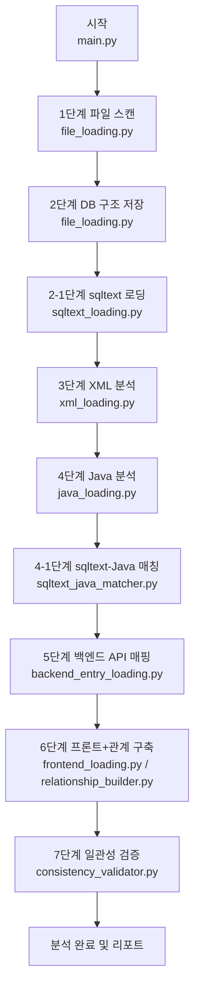

# SourceAnalyzer 처리 플로우 개요

## 문서 목적

이 문서는 SourceAnalyzer 시스템의 **전체 처리 플로우와 실행 구조**를 설명합니다.
**대상 독자**: 개발자, 시스템 엔지니어
**참조 문서**: [01_시스템_요구사항_정의서.md](./01_시스템_요구사항_정의서.md), [02_데이터베이스_스키마_정의서.md](./02_데이터베이스_스키마_정의서.md)

## 개요

SourceAnalyzer의 메타데이터 생성 플로우는 `main.py`로부터 시작하여 총 9단계(세부 단계 포함)로 구성됩니다.

## 전체 처리 플로우

### 전체 개략 흐름도


```mermaid
flowchart TD
    A[시작<br/>main.py] --> B[1단계 파일 스캔<br/>file_loading.py]
    B --> C[2단계 DB 구조 저장<br/>file_loading.py]
    C --> C1[2-1단계 sqltext 로딩<br/>sqltext_loading.py]
    C1 --> D[3단계 XML 분석<br/>xml_loading.py]
    D --> E[4단계 Java 분석<br/>java_loading.py]
    E --> E1[4-1단계 sqltext-Java 매칭<br/>sqltext_java_matcher.py]
    E1 --> F[5단계 백엔드 API 매핑<br/>backend_entry_loading.py]
    F --> G[6단계 프론트+관계 구축<br/>frontend_loading.py / relationship_builder.py]
    G --> H[7단계 일관성 검증<br/>consistency_validator.py]
    H --> I[분석 완료 및 리포트]
```

### 실행 단계 요약

| 단계 | 모듈 | 역할 | 특이사항 |
|------|------|------|----------|
| **1단계** | `file_loading.py` | 파일 스캔 | files 테이블 등록 |
| **2단계** | `file_loading.py` | DB 구조 저장 | tables/columns 저장, TABLE/COLUMN 컴포넌트 생성 |
| **2-1단계** | `sqltext_loading.py` | sqltext SQL 로딩 | sqltext 폴더 SQL 파일 처리 |
| **3단계** | `xml_loading.py` | XML 분석 | MyBatis 파싱, SQL 컴포넌트 생성 |
| **4단계** | `java_loading.py` | Java 분석 | 클래스/메서드 추출, SQL 추출 |
| **4-1단계** | `sqltext_java_matcher.py` | sqltext-Java 매칭 | Java 파일 내 SQL ID 문자열 검색 |
| **5단계** | `backend_entry_loading.py` | 백엔드 API 매핑 | Spring/Servlet API 진입점 분석 |
| **6단계** | `frontend_loading.py` + `relationship_builder.py` | 프론트엔드 분석 및 관계 구축 | JSP/JSX/Vue/TS/JS/HTML 통합 처리 |
| **7단계** | `consistency_validator.py` | 일관성 검증 | DB 기반 관계 보강, 데이터 무결성 검증 |

## 실행 흐름 (main.py)

```python
# main.py 실행 순서
1. 로그 파일 정리 (24시간 경과 파일 삭제)
2. 명령행 인자 처리 및 검증
3. 프로젝트 존재 여부 확인
4. 메타데이터베이스 초기화 (--clear-metadb 옵션)
5. 데이터베이스 스키마 생성
6. 분석 단계 실행 (1단계 ~ 7단계)
7. 분석 완료
```

## 단계별 상세 설명

### 1단계: 파일 스캔

**목적**: 프로젝트 전체 파일을 `files` 테이블에 등록

**처리**:
- `FileUtils.scan_directory()`로 프로젝트 전체 디렉토리 재귀적 스캔
- `target_source_config.yaml` 설정 기반 파일 필터링
- 파일 확장자로 타입 결정 (java, xml, jsp, sql, csv 등)
- `HashUtils`로 파일 내용 해시값 생성
- `DatabaseUtils.upsert()`로 `INSERT OR REPLACE` 실행

**결과**: 모든 파일의 `file_id` 생성으로 후속 단계에서 참조 가능

**구현 파일**: `file_loading.py` (FileLoadingEngine.execute_file_scan)

📄 상세: [04_1단계_파일_스캔_구현서.md](./04_1단계_파일_스캔_구현서.md)

### 2단계: DB 구조 저장

**목적**: CSV 파일에서 테이블/컬럼 정보를 메타DB에 저장하고 components에 등록

**처리**:
- `FileLoadingEngine.execute_db_loading()`: ALL_TABLES.csv → `tables` 테이블, ALL_TAB_COLUMNS.csv → `columns` 테이블
- TABLE/COLUMN 컴포넌트 생성 및 components 테이블 등록
- 데이터 타입, NULL 허용 여부, PK 정보, 컬럼 코멘트 등 저장

**결과**: 테이블/컬럼 구조 정보 저장 및 components에서 참조 가능

**구현 파일**: `file_loading.py` (FileLoadingEngine.execute_db_loading)

📄 상세: [05_2단계_DB_구조_저장_구현서.md](./05_2단계_DB_구조_저장_구현서.md)

### 2-1단계: sqltext SQL 로딩

**목적**: `projects/{project}/sqltext/**/*.sql` 파일을 메타DB와 SqlContent 데이터베이스에 저장

**처리**:
- sqltext 폴더 하위 모든 *.sql 파일 재귀 스캔
- 파일명(확장자 제외)을 query_id로 사용
- `files`: `file_type='SQL'`, 프로젝트 기준 상대 경로로 등록
- `components`: 쿼리 내용 분석하여 `SQL_SELECT/INSERT/UPDATE/DELETE/MERGE` 등 타입 분류, `layer='QUERY_FROM_SQLTEXT'`
- `SqlContent.db` (비압축) 또는 `SqlContent_compressed.db` (압축): 정제된 SQL 본문을 저장 (--sql-compress 파라미터에 따라 선택)

**결과**: 독립 SQL 파일이 메타DB에 등록되어 Java 코드와 연결 가능

**구현 파일**: `sqltext_loading.py` (SqlTextLoadingEngine)

### 3단계: XML 분석

**목적**: MyBatis XML 파일에서 SQL 쿼리를 추출하고 JOIN 관계를 분석

**처리**:
- **SQL 1패스 파서 적용**: 전처리(MyBatis 태그 제거, 주석 제거, 정규화) → 테이블/별칭 추출 → 컬럼 추출 → 조인 분석
- **즉시 관계 생성**: SQL 저장 직후 JOIN/USE_COLUMN 관계 즉시 생성
- **이중 파서 아키텍처**: DOM 파서 + SAX Fallback으로 안정성 확보

**결과**: SQL 컴포넌트 생성, JOIN 관계 분석, mapper_map 테이블 저장

**구현 파일**: `xml_loading.py` (XmlLoadingEngine)

📄 상세: [06_3단계_XML_분석_구현서.md](./06_3단계_XML_분석_구현서.md)

### 4단계: Java 분석

**목적**: Java 파일에서 CLASS, METHOD 추출 및 관계 분석을 한 번에 처리

**처리**:
- **스트리밍 처리**: `JavaParser.parse_java_file()`로 한 파일씩 처리
- **통합 분석**: 클래스/메서드 추출과 관계 분석을 동시에 처리
- `classes` 테이블에 클래스 정보 등록
- `components` 테이블에 `METHOD` 타입으로 등록
- **즉시 관계 생성**: SQL 저장 직후 JOIN/USE_COLUMN 관계 즉시 생성
- **관계 분석**: CALL_QUERY_M2S, CALL_METHOD_C2S, CALL_METHOD_S2D, USE_TABLE_S2D 관계 등록

**결과**: CLASS, METHOD 정보 등록 및 관계 분석 완료

**구현 파일**: `java_loading.py` (load_java_files_simple), `parser/java_parser.py`

📄 상세: [07_4단계_Java_분석_구현서.md](./07_4단계_Java_분석_구현서.md)

### 4-1단계: sqltext-Java 매칭

**목적**: Java 파일 내 sqltext SQL ID 문자열을 검색해 CALL_QUERY 관계를 생성

**처리**:
- `layer='QUERY_FROM_SQLTEXT'`인 SQL 컴포넌트 목록 로드
- Java 파일 내용에서 SQL ID 문자열(파일명) 검색
- 매칭되는 경우 METHOD → SQL 간 CALL_QUERY 관계 자동 생성
- 단순 문자열 매칭으로 누락 최소화

**결과**: sqltext SQL과 Java 메서드 간 연결 관계 구축

**구현 파일**: `sqltext_java_matcher.py` (SqlTextJavaMatcher)

### 5단계: 백엔드 API 진입점 분석

**목적**: Java 백엔드 제일 앞단인 API 진입점을 분석하여 프론트엔드 → 백엔드 호출 체인 구성

**처리**:
- Java 파일에서 백엔드 진입점 식별 (`@RestController`, `@Controller`, `@RequestMapping` 등)
- API 엔드포인트 매핑 (URL 패턴 → Controller 메서드)
- **Controller/Mapper 인덱싱**: controller_api_map, mapper_map 보조 테이블에 정밀 소스 저장
- `API_URL` 타입으로 components 테이블에 등록
- **정밀 매칭**: controller_api_map, mapper_map 우선 활용한 정확한 관계 매핑

**결과**: 프론트엔드 기술 무관하게 백엔드 제일 앞단부터 완전한 호출 체인 구성

**구현 파일**: `backend_entry_loading.py` (execute_backend_entry_loading)

📄 상세: [08_5단계_API_매핑_구현서.md](./08_5단계_API_매핑_구현서.md)

### 6단계: 프론트엔드 분석 및 관계 구축

**목적**: 모든 프론트엔드 파일을 분석하고 API 호출 관계 구축

**처리**:
- **6-1단계**: 프론트엔드 파일 분석 (`frontend_loading.py`)
  - JSP, JSX, Vue, TypeScript, JavaScript, HTML 파일 통합 처리
  - jQuery, Axios, Fetch, XMLHttpRequest 등 다양한 방식 지원
  - Frameworks 추적: 각 파일에서 사용된 프론트엔드 기술 스택 자동 수집
  - API_URL 컴포넌트 생성: 프론트엔드 API 호출을 API_URL 컴포넌트로 변환

- **6-2단계**: 연관관계 구축 (`relationship_builder.py`)
  - 프론트엔드 API와 백엔드 API 자동 매칭
  - 완전한 호출 체인: 프론트엔드 파일 → API_URL → METHOD → SQL → TABLE

- **6-3단계**: DB 기반 관계 보강 (`relationship_builder.py`)
  - controller_api_map, mapper_map 기반 CALL_API, CALL_METHOD 관계 보강

**결과**: 완전한 프론트엔드 → 백엔드 호출 체인 구성, frameworks 사용 현황 추적

**구현 파일**: `frontend_loading.py` (FrontendLoadingEngine), `relationship_builder.py` (RelationshipBuilder)

📄 상세: [09_6단계_프론트엔드_분석_구현서.md](./09_6단계_프론트엔드_분석_구현서.md)

### 7단계: 일관성 검증

**목적**: 메타데이터베이스 생성 완료 후 데이터 일관성 검증 및 오류 검출

**처리**:
- 외래키 무결성 위반 검출
- API_URL 중복 검출
- parent_id 타입 불일치 검출
- TABLE/COLUMN file_id 불일치 검출
- CHECK 제약조건 위반 검출
- **보조 테이블 무결성**: controller_api_map, mapper_map 검증
- 치명적 문제 발견 시 handle_error() 호출하여 프로그램 종료

**결과**: 메타데이터베이스 품질 보장, 신뢰할 수 있는 분석 결과 제공

**구현 파일**: `consistency_validator.py` (execute_consistency_validation)

📄 상세: [10_7단계_일관성_검증_구현서.md](./10_7단계_일관성_검증_구현서.md)

## 핵심 설계 원칙

### Components 테이블 저장 대상

- **저장**: CLASS, METHOD, SQL_*, TABLE, COLUMN, API_URL
- **제외**: java 파일 자체 (files 테이블에만 저장)

### Relationships 테이블 역할

- **모든 관계 통합 관리**: 컴포넌트 간, 컬럼 간, 테이블 간 관계
- **조인 관계**: 테이블 간 조인 관계도 relationships에서 관리
- **호출 관계**: 메서드 → 쿼리, JSP → 메서드, JSP → API_URL → METHOD 등

### 처리 순서의 중요성

1. **종속관계 고려**: 하위 테이블부터 생성 후 상위 테이블 연결
2. **컴포넌트 우선**: relationships에서 참조할 수 있도록 components 먼저 생성
3. **관계 마지막**: 모든 컴포넌트 생성 후 관계 정의

## 시스템 특징

- **연관관계 중심**: 완전한 프론트엔드 → 백엔드 → 데이터베이스 연결고리 도출
- **안정적 파싱**: 정규식 기반으로 복잡도를 낮추고 안정성 확보
- **메모리 최적화**: 스트리밍 처리로 대용량 프로젝트 효율적 처리
- **범용 프론트엔드**: JSP, JSX, Vue, TS, JS, HTML 통합 지원
- **Frameworks 추적**: jQuery, Axios, Fetch, XHR 등 기술 스택 자동 수집
- **중앙 관계 관리**: RelationshipBuilder를 통한 통합 연관관계 구축
- **데이터 품질 보장**: 일관성 검증을 통한 메타데이터베이스 신뢰성 확보

## 개발 지침

### 경로키 일관성 준수

- **규칙**: 모든 로더/유틸에서 DB 조회 시 `files.file_path` + `files.file_name` 조합 사용
- **전체 경로 재구성**: 프로젝트 루트 + `file_path` + `file_name` + `PathUtils` 정규화(`/`) 사용
- **영향**: 파일 식별/중복/관계 매핑의 일관성 보장

### 멱등 저장 (INSERT OR IGNORE)

- **규칙**: 관계 저장은 `INSERT OR IGNORE`(멱등) 준수
- **목적**: 재실행/증분 시에도 관계 중복 최소화
- **적용 범위**: `relationships` 테이블 저장 시 중복 삽입 방지

### 메타DB 우선 사용 원칙

- 리포트/검증/관계 생성 시에는 **항상 metadata.db/SqlContent.db에 저장된 정제 데이터**를 사용한다.
- 파서가 이미 정규화·검증해 저장한 메타를 재파싱하지 말고, 메타DB→리포트로 이어지는 일관된 파이프라인을 유지한다.

## 📚 관련 문서

- [01_시스템_요구사항_정의서.md](./01_시스템_요구사항_정의서.md): 비즈니스 요구사항 및 기능 명세
- [02_데이터베이스_스키마_정의서.md](./02_데이터베이스_스키마_정의서.md): 데이터베이스 스키마 구조 상세
- [04_1단계_파일_스캔_구현서.md](./04_1단계_파일_스캔_구현서.md): 파일 스캔 구현 상세
- [05_2단계_DB_구조_저장_구현서.md](./05_2단계_DB_구조_저장_구현서.md): DB 구조 저장 구현 상세
- [06_3단계_XML_분석_구현서.md](./06_3단계_XML_분석_구현서.md): XML 분석 구현 상세
- [07_4단계_Java_분석_구현서.md](./07_4단계_Java_분석_구현서.md): Java 분석 구현 상세
- [08_5단계_API_매핑_구현서.md](./08_5단계_API_매핑_구현서.md): API 매핑 구현 상세
- [09_6단계_프론트엔드_분석_구현서.md](./09_6단계_프론트엔드_분석_구현서.md): 프론트엔드 분석 구현 상세
- [10_7단계_일관성_검증_구현서.md](./10_7단계_일관성_검증_구현서.md): 일관성 검증 구현 상세
- [20_리포트생성_구현서.md](./20_리포트생성_구현서.md): 리포트 생성 구현 상세
