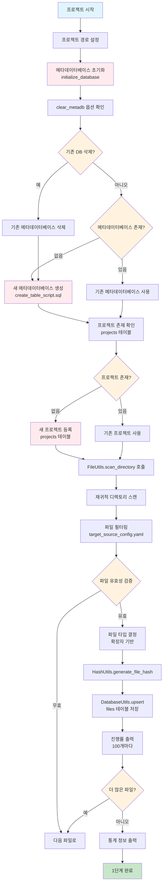

# 처리플로우 상세 - 1단계: 파일 정보 저장 (프로젝트 전체 스캔)

## 개요

**목적**: 프로젝트 전체 파일 스캔 및 파일 정보를 메타데이터베이스에 저장  
**핵심 기능**: 파일 시스템 탐색, 파일 필터링, 메타데이터 수집, 데이터베이스 저장  
**실행 함수**: `FileLoadingEngine.execute_file_scan()`  
**구현 상태**: ✅ **구현 완료**  
**파일**: `file_loading.py`  
**실행 위치**: `main.py`의 1단계 실행 부분

## 처리 플로우 차트



## 1단계 실행 흐름

### 1. 메타데이터베이스 초기화 (`initialize_database`)

```python
def initialize_database(self, clear_metadb: bool = False) -> bool:
```

**기능**:

- **기존 DB 삭제**: `clear_metadb=True`일 때 기존 메타데이터베이스 파일 삭제
- **데이터베이스 연결**: SQLite 메타데이터베이스에 연결
- **스키마 생성**: `create_table_script.sql`을 사용하여 테이블 구조 생성

**경로**: `projects/{project_name}/metadata.db`

**처리 과정**:

1. 기존 메타데이터베이스 파일 존재 여부 확인
2. `clear_metadb=True`인 경우 기존 파일 삭제 (`os.remove()`)
3. `DatabaseUtils`를 사용하여 SQLite 데이터베이스 연결
4. `database/create_table_script.sql` 스키마 파일로 테이블 생성
5. 초기화 완료 로그 출력

**오류 처리**: 예외 발생 시 `handle_error()` 함수로 오류 처리 후 `False` 반환

### 2. 프로젝트 정보 관리 (`add_project_info`)

```python
def add_project_info(self) -> bool:
```

**기능**: 프로젝트 정보를 `projects` 테이블에 UPSERT 방식으로 저장

**처리 로직**:

1. **프로젝트 존재 여부 확인**: `projects` 테이블에서 해당 프로젝트명 조회
2. **신규 프로젝트인 경우**: 프로젝트 정보를 새로 삽입
3. **기존 프로젝트인 경우**: 기존 정보 업데이트 (주로 `total_files` 등)

**프로젝트 정보 구성**:

- `project_name`: 프로젝트명
- `project_path`: 프로젝트 상대경로 (`projects/{project_name}`)
- `hash_value`: 하드코딩된 '-' (사용자 규칙)
- `del_yn`: 'N' (삭제되지 않음)
- `total_files`: 0 (초기값, 파일 스캔 완료 후 업데이트)

**저장 방식**: UPSERT 방식으로 중복 실행 시에도 안전하게 처리

**오류 처리**: 예외 발생 시 `handle_error()` 함수로 오류 처리 후 `False` 반환

### 3. 프로젝트 ID 조회 (`get_project_id`)

```python
def get_project_id(self) -> Optional[int]:
```

**기능**: 프로젝트명으로 프로젝트 ID 조회

**처리 로직**:

1. **데이터베이스 조회**: `projects` 테이블에서 `project_name`으로 검색
2. **결과 반환**: 프로젝트 ID 반환 또는 None (프로젝트가 없는 경우)

**사용 목적**: 
- 파일 정보 저장 시 `project_id` 외래키 설정
- 전역 프로젝트 정보 설정
- 다른 단계에서의 프로젝트 식별

**오류 처리**: 예외 발생 시 `handle_error()` 함수로 오류 처리 후 `None` 반환

## 1단계 실행 흐름

### 실행 순서

1. **메타데이터베이스 초기화** (`initialize_database`)
   - 데이터베이스 연결 및 스키마 생성
   - `clear_metadb=True`일 때 기존 DB 삭제

2. **프로젝트 정보 관리** (`add_project_info`)
   - 프로젝트 존재 여부 확인
   - 신규 프로젝트면 삽입, 기존 프로젝트면 업데이트

3. **프로젝트 ID 조회** (`get_project_id`)
   - 프로젝트명으로 프로젝트 ID 획득
   - 전역 프로젝트 정보 설정용

4. **프로젝트 전체 파일 스캔** (`scan_project_files`)
   - 디렉토리 스캔 → 파일 필터링 → 정보 수집

5. **파일 정보 데이터베이스 저장** (`save_files_to_database`)
   - 프로젝트 ID로 파일 정보 저장

6. **통계 정보 출력** (`_print_statistics`)
   - 처리 결과 통계 출력

## 주요 함수별 상세 설명

### 1. 프로젝트 전체 파일 스캔 (`scan_project_files`)

```python
def scan_project_files(self) -> List[Dict[str, Any]]:
```

#### 1-1. 디렉토리 스캔

- **FileUtils.scan_directory()** 사용하여 재귀적 전체 디렉토리 스캔
- 프로젝트 루트부터 모든 하위 디렉토리 탐색

#### 1-2. 파일 필터링 (`_should_include_file`)

**제외 대상**:

- `metadata.db`, `metadata.db-shm`, `metadata.db-wal` (메타데이터베이스 파일)
- `config/*` 디렉토리 전체
- `db_schema/` 하위에서 `ALL_TABLES.csv`, `ALL_TAB_COLUMNS.csv`만 포함

**포함 대상**:

- `src/` 하위 파일들은 `target_source_config.yaml` 설정 적용

#### 1-3. 파일 필터 적용 (`_apply_file_filters`)

**target_source_config.yaml 설정 기반**:

**⚠️ 중요 개선사항 (과도한 제외 방지)**:
- **최소 제외 원칙**: 버전 관리(.git), 패키지(node_modules), 로그(logs)만 제외
- **포괄적 포함**: test, config, target, build 등 모두 포함하여 파일 누락 방지
- **CSV 파일 필수**: `ALL_TABLES.csv`, `ALL_TAB_COLUMNS.csv` 확실히 포함
- **유연한 설정**: 프로젝트별로 필요시 exclude_directories 조정 가능

**포함 패턴** (`include_patterns`):

```yaml
# 백엔드 파일들
- "**/*.java"
- "**/*.jsp" 
- "**/*.xml"
- "**/*.sql"
- "**/*.properties"
- "**/*.jar"
# 데이터베이스 스키마 파일들 (중요!)
- "**/*.csv"
# 프론트엔드 파일들
- "**/*.jsx"
- "**/*.vue"
- "**/*.ts"
- "**/*.tsx"
- "**/*.js"
- "**/*.html"
- "**/*.css"
```

**제외 디렉토리** (`exclude_directories`):

```yaml
# 최소한만 제외 (과도한 제외 방지)
exclude_directories:
  # 버전 관리 시스템만 제외 (필수)
  - "**/.git/**"
  - "**/.svn/**"
  # 패키지 관리자 디렉토리만 제외 (필수)
  - "**/node_modules/**"
  - "**/vendor/**"
  # 시스템 생성 로그만 제외 (필수)
  - "**/logs/**"
  - "**/temp/**"
  
  # 모두 포함하도록 주석 처리 (파일 누락 방지)
  # - "**/target/**"   # Maven 빌드 (소스 포함 가능)
  # - "**/build/**"    # Gradle 빌드 (소스 포함 가능)
  # - "**/test/**"     # 테스트 코드 (분석 대상)
  # - "**/config/**"   # 설정 파일 (CSV 포함 가능)
```

**제외 파일** (`exclude_files`):

```yaml
- "**/*.class"
- "**/*.log"
- "**/*.tmp"
- "**/*.bak"
- "**/*.swp"
- "**/*.orig"
- "**/Architecture_Report_*.txt"
- "**/ERD_Report_*.txt"
- "**/CallChain_Report_*.html"
- "**/*_Report_*.txt"
- "**/*_Report_*.html"
```

### 2. 개별 파일 정보 수집 (`_get_file_info`)

```python
def _get_file_info(self, file_path: str) -> Optional[Dict[str, Any]]:
```

**수집 정보**:

- `file_path`: 프로젝트 기준 상대경로
- `file_name`: 파일명
- `file_type`: 파일 확장자 (대문자)
- `hash_value`: 파일 내용 해시값 (HashUtils 사용)
- `line_count`: 파일 라인 수
- `has_error`: 오류 여부 ('N'/'Y')
- `error_message`: 오류 메시지 (오류 시)
- `del_yn`: 'N' (삭제되지 않음)

**오류 처리**:

- 파일이 존재하지 않는 경우: `has_error='Y'`, `error_message='파일이 존재하지 않습니다'`
- 파일 정보 수집 실패: `has_error='Y'`, 구체적인 오류 메시지

### 3. 파일 정보 데이터베이스 저장 (`save_files_to_database`)

```python
def save_files_to_database(self, files: List[Dict[str, Any]]) -> bool:
```

**저장 과정**:

1. **프로젝트 ID 조회**: `get_project_id()`로 프로젝트 ID 획득
   - `add_project_info()`에서 UPSERT로 프로젝트 정보 저장 후 ID 조회
   - 기존 프로젝트가 있으면 기존 ID 사용, 신규 프로젝트면 새로 생성된 ID 사용
2. **파일 데이터 변환**: 각 파일 정보에 `project_id` 추가
3. **개별 UPSERT**: 각 파일을 `files` 테이블에 저장
   - 키: `['file_name', 'file_path', 'project_id']`
   - 기존 파일이 있으면 업데이트, 없으면 삽입
4. **프로젝트 통계 업데이트**: `_update_project_total_files()`로 프로젝트의 총 파일 수 업데이트

### 4. 통계 정보 출력 (`_print_statistics`)

```python
def _print_statistics(self):
```

**출력 통계**:

- 총 파일 수
- 성공 스캔 파일 수
- 오류 파일 수
- 파일 타입별 통계 (Java, XML, JSP, SQL, CSV, 기타)

## 1단계 특징 및 핵심 로직

### 사용자 규칙 준수

- **공통함수 사용**: `FileUtils`, `DatabaseUtils`, `PathUtils` 등 util 모듈 활용
- **하드코딩 금지**: 설정 파일 기반 필터링, 공통함수 사용
- **예외 처리**: `handle_error()` 공통함수로 모든 예외 처리
- **프로젝트 해시값**: 하드코딩된 '-' 사용

### 프로젝트 ID 관리 로직

- **UPSERT 방식**: 프로젝트가 이미 존재하면 기존 ID 사용, 없으면 새로 생성
- **전역 프로젝트 정보**: main.py에서 프로젝트 ID 획득 후 전역적으로 사용
- **안전한 재실행**: 중복 실행 시에도 데이터 무결성 보장

### 성능 최적화

- **재귀적 스캔**: 한 번의 디렉토리 탐색으로 모든 파일 수집
- **메모리 효율**: 파일별 개별 처리로 메모리 사용량 최소화
- **UPSERT 방식**: 중복 실행 시에도 안전한 데이터 업데이트

### 안정성

- **오류 복구**: 개별 파일 오류가 전체 프로세스를 중단시키지 않음
- **데이터 무결성**: 트랜잭션 기반 데이터베이스 저장
- **로깅**: 상세한 로그로 실행 과정 추적 가능

## 실행 결과 예시

```
=== 파일 스캔 통계 ===
총 파일 수: 34
성공 스캔: 34
오류 파일: 0
Java 파일: 19
XML 파일: 5
JSP 파일: 8
SQL 파일: 0
CSV 파일: 2
기타 파일: 0
```

## 데이터베이스 테이블

### files 테이블

프로젝트의 모든 파일 정보를 저장하는 핵심 테이블

**주요 컬럼**:

- `file_id`: 파일 고유 ID (Primary Key)
- `project_id`: 프로젝트 ID (Foreign Key)
- `file_path`: 프로젝트 기준 상대경로
- `file_name`: 파일명
- `file_type`: 파일 확장자 (대문자)
- `hash_value`: 파일 내용 해시값
- `line_count`: 파일 라인 수
- `has_error`: 오류 여부 ('N'/'Y')
- `error_message`: 오류 메시지
- `del_yn`: 삭제 여부 ('N'/'Y')

### projects 테이블

프로젝트 기본 정보를 저장하는 테이블

**주요 컬럼**:

- `project_id`: 프로젝트 고유 ID (Primary Key)
- `project_name`: 프로젝트명
- `project_path`: 프로젝트 경로
- `hash_value`: 프로젝트 해시값 (하드코딩: '-')
- `total_files`: 총 파일 수
- `del_yn`: 삭제 여부 ('N'/'Y')

## 설정 파일

### target_source_config.yaml

파일 필터링 및 분석 대상 설정

**주요 설정**:

- `include_patterns`: 포함할 파일 패턴
- `exclude_directories`: 제외할 디렉토리 패턴
- `exclude_files`: 제외할 파일 패턴
- `file_type_settings`: 파일 타입별 상세 설정
- `path_mappings`: Java-XML 경로 매핑 규칙

## 오류 처리

### 예외 처리 방식

- **공통함수 사용**: `handle_error()` 함수로 모든 예외 처리
- **오류 로깅**: 상세한 오류 메시지와 함께 로그 기록
- **프로그램 종료**: 치명적 오류 시 프로그램 종료
- **파싱 오류 예외**: 파싱 오류는 `has_error='Y'`로 표시하고 계속 진행

## 확장성

### 새로운 파일 타입 지원

- `target_source_config.yaml`에 새로운 확장자 추가
- `FileUtils`에 새로운 파일 타입 처리 로직 추가
- 데이터베이스 스키마 확장 (필요시)

### 로깅 레벨

- **INFO**: 일반적인 실행 과정
- **DEBUG**: 상세한 디버깅 정보
- **WARNING**: 경고 메시지
- **ERROR**: 오류 메시지

### 통계 정보

- 
- **최종 통계**: 처리 완료 후 전체 통계 정보
- **오류 통계**: 오류 발생 현황 및 원인 분석

이 1단계 로직은 프로젝트의 모든 소스 파일을 체계적으로 수집하고 메타데이터베이스에 저장하여, 이후 단계에서의 분석 작업을 위한 기반 데이터를 구축하는 핵심 역할을 수행합니다.
