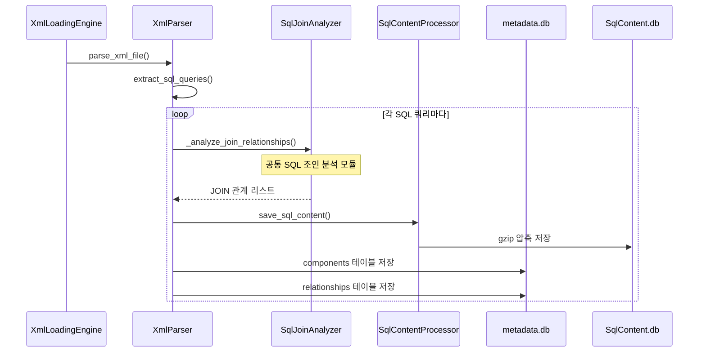

# 처리플로우 상세 - 3단계: XML 파일 분석 및 SQL 컴포넌트 등록 + JOIN 관계 분석

## 개요

**목적**: XML 파일에서 SQL 쿼리 추출, components 테이블 등록, JOIN 관계 분석, SQL Content DB 저장  
**핵심 기능**: MyBatis XML 파싱, SQL 쿼리 추출, 컴포넌트 등록, JOIN 관계 분석, SQL 내용 압축 저장, 메모리 최적화  
**실행 함수**: `XmlLoadingEngine.execute_xml_loading()`  
**구현 상태**: ✅ **구현 완료** (2025-01-18 공통 SQL 파서 적용)  
**파일**: `xml_loading.py`, `parser/xml_parser.py`, `parser/sax_fallback_parser.py`  
**메모리 최적화**: 스트리밍 처리로 한 파일씩만 메모리에 로드하여 처리  
**SQL Content 저장**: ✅ **SqlContentProcessor 적용 완료**  
**SQL 조인 분석**: ✅ **공통 SqlJoinAnalyzer 모듈 적용** - [07_SQL공통파서_구현서.md](./07_SQL공통파서_구현서.md) 참조

## 처리 플로우 차트

```mermaid
flowchart TD
    A[3단계 시작] --> B[XML 파일 수집]
    B --> C{XML 파일 존재?}
    C -->|아니오| D[3단계 완료]
    C -->|예| E[XML 파일별 순차 처리]
    E --> F["XML 파일 읽기\n스트리밍 처리"]
    F --> G["XML 파싱\nDOM 파서 시도"]
    G --> G1{DOM 파싱 성공?}
    G1 -->|Yes| H["SQL 쿼리 추출\nselect, insert, update, delete, merge"]
    G1 -->|No| G2{RecursionError?}
    G2 -->|Yes| G3["SAX 파서로 Fallback"]
    G2 -->|No| G4["정규식 파서로 Fallback"]
    G3 --> G5{SAX 파싱 성공?}
    G5 -->|Yes| H
    G5 -->|No| G4
    G4 --> H
    H --> I["SQL 컴포넌트 등록\nSQL_SELECT, SQL_INSERT 등"]
    I --> J[JOIN 관계 분석]
    J --> K{JOIN 타입}
    K -->|Explicit| L["ANSI SQL JOIN 분석\nINNER JOIN, LEFT JOIN 등"]
    K -->|Implicit| M["Oracle 전통 구문 분석\nFROM 절 콤마, WHERE 절"]
    L --> N["별칭 해석\n테이블 별칭 to 실제 테이블명"]
    M --> N
    N --> O[JOIN 관계 저장 시작]
    O --> P{소스 테이블 컴포넌트 존재?}
    P -->|없음| Q["inferred 테이블 생성\ntables and components 테이블"]
    P -->|있음| R[기존 테이블 사용]
    Q --> S{대상 테이블 컴포넌트 존재?}
    R --> S
    S -->|없음| T["inferred 테이블 생성\ntables and components 테이블"]
    S -->|있음| U[기존 테이블 사용]
    T --> V["inferred 컬럼 생성\ncolumns and components 테이블"]
    U --> V
    V --> W["relationships 테이블 저장\nJOIN_EXPLICIT, JOIN_IMPLICIT"]
    W --> X["SQL Content DB 저장\ngzip 압축"]
    X --> Y["메모리 해제\ndel analysis_result"]
    Y --> Z{더 많은 파일?}
    Z -->|예| E
    Z -->|아니오| AA[통계 정보 출력]
    AA --> BB[3단계 완료]

    style A fill:#e1f5fe
    style BB fill:#c8e6c9
    style G1 fill:#fff3e0
    style G2 fill:#fff3e0
    style G3 fill:#ffeb3b
    style G5 fill:#fff3e0
    style C fill:#fff3e0
    style K fill:#fff3e0
    style P fill:#fff3e0
    style S fill:#fff3e0
    style Z fill:#fff3e0
    style F fill:#f3e5f5
    style Y fill:#f3e5f5
    style Q fill:#ffebee
    style T fill:#ffebee
    style V fill:#ffebee
```



## SAX Fallback 구조 (부속 내용)

### DOM vs SAX 파서 특징 비교

| 특성               | DOM 파서                             | SAX 파서               |
| ---------------- | ---------------------------------- | -------------------- |
| **파싱 방식**        | 트리 구조로 전체 문서를 메모리에 로드              | 이벤트 기반 스트리밍 파싱       |
| **메모리 사용량**      | 높음 (전체 문서를 메모리에 보관)                | 낮음 (한 번에 일부만 처리)     |
| **처리 속도**        | 빠름 (전체 구조에 즉시 접근 가능)               | 보통 (순차적 처리)          |
| **재귀 깊이**        | 깊음 (복잡한 중첩 구조에서 RecursionError 위험) | 없음 (이벤트 기반)          |
| **구현 복잡도**       | 간단 (트리 탐색)                         | 복잡 (상태 관리 필요)        |
| **동적 SQL 태그 처리** | ✅ 우수 (중첩 구조 쉽게 처리)                 | ⚠️ 제한적 (상태 관리 필요)    |
| **SQL 재구성**      | ✅ 우수 (전체 구조 파악 가능)                 | ⚠️ 복잡 (버퍼링 및 재구성 필요) |
| **복잡한 중첩 구조**    | ❌ RecursionError 위험                | ✅ 안전 (재귀 없음)         |
| **메모리 효율성**      | ❌ 대용량 XML에서 문제                     | ✅ 우수 (스트리밍)          |
| **정확도**          | ✅ 높음                               | ⚠️ 중간 (복잡한 로직 제한)    |

### SAX Fallback 구조의 장점

- **최적의 성능**: 일반적인 경우 DOM 파서의 빠른 처리
- **안정성 보장**: 복잡한 XML에서도 SAX로 안전하게 처리  
- **메모리 효율**: 대용량 XML 파일도 처리 가능
- **호환성**: 기존 DOM 파싱 로직과 완전 호환

## 3단계 실행 흐름

### 1. XML 로딩 엔진 초기화 (`XmlLoadingEngine.__init__`)

```python
def __init__(self, project_name: str):
```

**기능**:

- XML 로딩 엔진 초기화
- 프로젝트 경로 및 메타데이터베이스 경로 설정
- XML 파서 초기화
- SQL Content Manager 초기화
- 통계 정보 초기화

**초기화 과정**:

1. **프로젝트 정보 설정**: `project_name`으로 프로젝트 경로 설정
2. **경로 설정**: 
   - `project_source_path`: `./projects/{project_name}/src/` (get_project_source_path 사용)
   - `metadata_db_path`: `./projects/{project_name}/metadata.db` (get_project_metadata_db_path 사용)
3. **XML 파서 초기화**: `XmlParser()` 인스턴스 생성
4. **SQL Content Manager 초기화**: `SqlContentManager(project_name)` 인스턴스 생성
   - 프로젝트별 SqlContent.db 경로: `./projects/{project_name}/SqlContent.db`
   - gzip 압축을 사용한 SQL 내용 저장
5. **SQL Content Processor 초기화**: `SqlContentProcessor` 인스턴스 생성 (현재 보류 상태 - 소스에 커멘트 처리됨)
6. **통계 초기화**: 처리 통계 정보 딕셔너리 초기화

**통계 정보 구성**:

- `xml_files_processed`: 처리된 XML 파일 수
- `sql_queries_extracted`: 추출된 SQL 쿼리 수
- `sql_components_created`: 생성된 SQL 컴포넌트 수
- `join_relationships_created`: 생성된 JOIN 관계 수
- `inferred_tables_created`: 생성된 inferred 테이블 수
- `inferred_columns_created`: 생성된 inferred 컬럼 수
- `errors`: 오류 발생 수

### 2. XML 로딩 실행 (`execute_xml_loading`)

```python
def execute_xml_loading(self) -> bool:
```

**기능**: 3단계 처리 실행

**처리 과정**:

1. **데이터베이스 연결**: `DatabaseUtils`를 사용하여 SQLite 메타데이터베이스 연결
2. **SQL Content Processor 초기화**: `SqlContentProcessor` 인스턴스 생성 (현재 보류 상태 - 소스에 커멘트 처리됨)
3. **MyBatis XML 파일 수집**: `XmlParser.get_filtered_xml_files()`로 XML 파일 수집
4. **XML 파일별 통합 처리**: 각 XML 파일에 대해 SQL 추출 및 JOIN 분석
   - `XmlParser.extract_sql_queries_and_analyze_relationships()` 호출
   - 파싱 에러가 있어도 계속 진행 (USER RULES)
5. **SQL Content 저장**: 정제된 SQL 내용을 SqlContent.db에 gzip 압축 저장 (현재 보류 상태 - SQL Content Processor가 커멘트 처리됨)
6. **통계 정보 출력**: 처리 완료 후 통계 정보 출력
7. **데이터베이스 연결 해제**: 처리 완료 후 연결 해제

**오류 처리**: 예외 발생 시 `handle_error()` 함수로 오류 처리 후 `False` 반환

### 3. MyBatis XML 파일 수집 (`get_filtered_xml_files`)

```python
def get_filtered_xml_files(self, project_path: str) -> List[str]:
```

**기능**: MyBatis XML 파일 수집 및 필터링

**처리 과정**:

1. **디렉토리 재귀 탐색**: `FileUtils.scan_directory()`로 프로젝트 전체 디렉토리 탐색
2. **XML 파일 필터링**: `.xml` 확장자 파일만 수집
3. **MyBatis XML 파일 식별**: `_is_mybatis_xml_file()`로 MyBatis XML 파일 여부 확인
4. **파일 경로 리스트 반환**: 유효한 MyBatis XML 파일 경로 리스트 반환

**MyBatis XML 파일 식별 기준**:

- MyBatis 네임스페이스 포함 (`mybatis.org`, `mybatis-3.org`)
- Mapper 관련 태그 포함 (`MAPPER`, `SELECT`, `INSERT`, `UPDATE`, `DELETE`, `MERGE`)

### 4. XML 파일 통합 분석 (`extract_sql_queries_and_analyze_relationships`)

```python
def extract_sql_queries_and_analyze_relationships(self, xml_file: str) -> Dict[str, Any]:
```

**기능**: XML 파일에서 SQL 쿼리 추출 및 JOIN 관계 분석

**처리 과정**:

1. **XML 파싱**: `ET.parse()`로 XML 파일 파싱
2. **SQL 쿼리 추출**: `<SELECT>`, `<INSERT>`, `<UPDATE>`, `<DELETE>`, `<MERGE>` 태그에서 쿼리 추출
3. **JOIN 관계 분석**: 각 쿼리에서 JOIN 관계 분석
4. **결과 반환**: SQL 쿼리 정보와 JOIN 관계 정보 반환

**반환 데이터 구조**:

```python
{
    'sql_queries': [
        {
            'tag_name': 'SELECT',
            'query_id': 'findUserById',
            'sql_content': 'SELECT * FROM users WHERE id = ?',
            'file_path': '/path/to/mapper.xml',
            'line_start': 10,
            'line_end': 15,
            'hash_value': 'abc123...'
        }
    ],
    'join_relationships': [
        {
            'source_table': 'USERS',
            'target_table': 'ORDERS',
            'rel_type': 'JOIN_EXPLICIT',
            'description': 'Explicit JOIN between USERS and ORDERS'
        }
    ],
    'file_path': '/path/to/mapper.xml'
}
```

### 5. SQL 쿼리 정보 추출 (`_extract_sql_query_info`)

```python
def _extract_sql_query_info(self, element: ET.Element, file_path: str) -> Optional[Dict[str, Any]]:
```

**기능**: XML 엘리먼트에서 SQL 쿼리 정보 추출

**처리 과정**:

1. **기본 정보 추출**: 태그명, 쿼리 ID 추출
2. **SQL 내용 추출**: `_extract_sql_content()`로 SQL 내용 추출
3. **라인 번호 추출**: `_extract_line_numbers()`로 시작/종료 라인 추출
4. **해시 값 생성**: `HashUtils.generate_md5()`로 SQL 내용 해시 생성
5. **쿼리 정보 반환**: 완성된 쿼리 정보 딕셔너리 반환

**쿼리 정보 구성**:

- `tag_name`: XML 태그명 (`SELECT`, `INSERT`, `UPDATE`, `DELETE`, `MERGE`)
- `query_id`: 쿼리 ID (XML의 `id` 속성)
- `sql_content`: 정제된 SQL 내용
- `file_path`: XML 파일 경로
- `line_start`: 시작 라인 번호
- `line_end`: 종료 라인 번호
- `hash_value`: SQL 내용 해시값

### 6. SQL 내용 추출 및 정제 (`_extract_sql_content`)

```python
def _extract_sql_content(self, element: ET.Element) -> str:
```

**기능**: XML 엘리먼트에서 SQL 내용 추출 및 MyBatis 동적 SQL 태그 처리

**처리 과정**:

1. **XML을 문자열로 변환**: `ET.tostring()`으로 XML 엘리먼트를 문자열로 변환
2. **MyBatis 동적 SQL 태그 처리**: `_process_mybatis_dynamic_sql_tags()`로 동적 SQL 태그 제거
3. **공백 정리**: 불필요한 공백 제거 및 정리
4. **정제된 SQL 반환**: 최종 정제된 SQL 내용 반환

**정제된 SQL 내용의 용도**:

1. **JOIN 관계 분석**: 정제된 SQL에서 테이블 간 JOIN 관계 추출
2. **테이블명 추출**: FROM 절, JOIN 절에서 참조되는 테이블 목록 추출
3. **컬럼-테이블 매핑**: SELECT 절의 컬럼을 해당 테이블과 매핑
4. **해시값 생성**: SQL 내용의 고유 식별자로 사용
5. **중복 검사**: 동일한 SQL 쿼리 중복 등록 방지
6. **메타데이터 저장**: 데이터베이스에 저장하여 나중에 분석/검색 가능
7. **의존성 분석**: 테이블 간 의존 관계 파악
8. **성능 분석**: 쿼리 복잡도 및 성능 영향도 분석
9. **보안 검사**: SQL 인젝션 취약점 검사
10. **문서화**: 자동 생성되는 API 문서나 데이터베이스 스키마 문서에 활용

**정제된 SQL 내용 활용 예시**:

**원본 MyBatis XML**:

```xml
<SELECT id="findUsers" parameterType="UserSearchCriteria">
    SELECT u.user_id, u.user_name, o.order_no
    FROM users u
    <if test="joinOrders">
        LEFT JOIN orders o ON u.user_id = o.user_id
    </if>
    <where>
        <if test="userName != null">
            AND u.user_name LIKE #{userName}
        </if>
        <if test="status != null">
            AND u.status = #{status}
        </if>
    </where>
    ORDER BY u.user_name
</SELECT>
```

**정제된 SQL 내용**:

```sql
SELECT u.user_id, u.user_name, o.order_no FROM users u LEFT JOIN orders o ON u.user_id = o.user_id WHERE param AND param ORDER BY u.user_name
```

**활용 결과**:

- **JOIN 관계 분석**: `USERS` ↔ `ORDERS` `JOIN_EXPLICIT` 관계 생성
- **테이블명 추출**: `USERS`, `ORDERS` 테이블 식별
- **컬럼-테이블 매핑**: `user_id`, `user_name` → `USERS` 테이블, `order_no` → `ORDERS` 테이블
- **해시값**: `a1b2c3d4e5f6...` (SQL 내용의 MD5 해시)
- **메타데이터 저장**: components 테이블에 `SQL_SELECT` 타입으로 저장
- **SQL Content 저장**: 정제된 SQL 내용을 gzip 압축하여 SqlContent.db에 저장 (현재 보류 상태)

### 7. SQL Content Processor (`SqlContentProcessor`) - **현재 보류 상태**

```python
class SqlContentProcessor:
    def __init__(self, project_name: str, db_utils: DatabaseUtils):
```

**기능**: SQL Content DB 관리 및 SQL 내용 저장/조회  
**상태**: ⏸️ **보류 상태** - 소스 코드에서 커멘트 처리됨

**처리 과정**:

1. **SQL Content DB 초기화**: `SqlContentManager`를 사용하여 SqlContent.db 초기화
2. **SQL 내용 저장**: 정제된 SQL 내용을 gzip 압축하여 저장
3. **SQL 내용 조회**: 저장된 SQL 내용을 압축 해제하여 조회
4. **메타데이터 연동**: 메타데이터베이스의 components 테이블과 연동

**SQL Content DB 구조**:

```sql
CREATE TABLE sql_content (
    id INTEGER PRIMARY KEY AUTOINCREMENT,
    component_id INTEGER NOT NULL,
    sql_content BLOB NOT NULL,  -- gzip 압축된 SQL 내용
    created_at TIMESTAMP DEFAULT CURRENT_TIMESTAMP,
    updated_at TIMESTAMP DEFAULT CURRENT_TIMESTAMP
);
```

**압축 저장 과정** (현재 보류 상태):

1. **SQL 내용 정제**: MyBatis 동적 SQL 태그 제거 및 정리
2. **gzip 압축**: `gzip.compress()`로 SQL 내용 압축
3. **BLOB 저장**: 압축된 내용을 BLOB 형태로 SqlContent.db에 저장
4. **메타데이터 연결**: components 테이블의 component_id와 연결

**압축 해제 조회 과정** (현재 보류 상태):

1. **BLOB 조회**: SqlContent.db에서 압축된 SQL 내용 조회
2. **gzip 압축 해제**: `gzip.decompress()`로 SQL 내용 복원
3. **문자열 반환**: 원본 SQL 내용을 문자열로 반환

**현재 상태**: SQL Content Processor는 보류 상태로, SQL 컴포넌트는 기존 방식으로 메타데이터베이스의 `components` 테이블에 직접 저장됩니다.

### 8. 컴포넌트 관계 및 구조

#### 8.1 XML과 쿼리의 관계

**관계 표현 방식**:

- **XML 파일**: `files` 테이블에 저장
- **SQL 쿼리**: `components` 테이블에 저장
- **연결 관계**: `components.file_id`로 XML 파일과 연결

**예시**:

```python
# XML 파일 정보 (files 테이블)
file_data = {
    'file_id': 1001,
    'file_name': 'UserMapper.xml',
    'file_path': '/src/main/resources/mapper/UserMapper.xml',
    'file_type': 'xml'
}

# SQL 쿼리 정보 (components 테이블)
component_data = {
    'component_id': 2001,
    'component_type': 'SQL_SELECT',
    'component_name': 'SQL_CONTENT_SELECT',
    'parent_id': None,  # SQL 쿼리는 독립적인 컴포넌트
    'file_id': 1001,    # XML 파일과 연결
    'line_start': 10,
    'line_end': 25
}
```

#### 8.2 parent_id의 용도

**SQL 쿼리 컴포넌트**:

- `parent_id`: None (독립적인 컴포넌트)
- **이유**: SQL 쿼리는 XML 파일 내에서 독립적으로 존재

**Java 메서드 컴포넌트**:

- `parent_id`: class_id (해당 클래스의 컴포넌트 ID)
- **이유**: 메서드는 클래스에 속하는 하위 컴포넌트

**예시 비교**:

```python
# SQL 쿼리 컴포넌트
sql_component = {
    'component_type': 'SQL_SELECT',
    'component_name': 'SQL_CONTENT_SELECT',
    'parent_id': None,  # 독립적
    'file_id': xml_file_id
}

# Java 메서드 컴포넌트
method_component = {
    'component_type': 'METHOD',
    'component_name': 'findUserById',
    'parent_id': class_component_id,  # 클래스에 속함
    'file_id': java_file_id
}
```

#### 8.3 컴포넌트 계층 구조

**XML 파일 계층** (3단계에서 처리):

```
XML 파일 (files.file_id)
├── SQL_SELECT 컴포넌트 (parent_id = None)
├── SQL_INSERT 컴포넌트 (parent_id = None)
├── SQL_UPDATE 컴포넌트 (parent_id = None)
└── SQL_DELETE 컴포넌트 (parent_id = None)
```

**Java 파일 계층** (4단계에서 처리):

```
Java 파일 (files.file_id)
└── CLASS 컴포넌트 (parent_id = None)
    ├── METHOD 컴포넌트 (parent_id = class_id)
    ├── METHOD 컴포넌트 (parent_id = class_id)
    └── METHOD 컴포넌트 (parent_id = class_id)
```

**inferred 테이블 계층** (3단계에서 처리):

```
inferred XML 파일 (files.file_id)
└── TABLE 컴포넌트 (parent_id = None)
    ├── COLUMN 컴포넌트 (parent_id = table_id)
    ├── COLUMN 컴포넌트 (parent_id = table_id)
    └── COLUMN 컴포넌트 (parent_id = table_id)
```

### 9. MyBatis 동적 SQL 태그 처리 (`_process_mybatis_dynamic_sql_tags`)

```python
def _process_mybatis_dynamic_sql_tags(self, sql_content: str) -> str:
```

**기능**: MyBatis 동적 SQL 태그 제거 및 정제

**처리하는 태그들**:

- **기본 태그**: `<select>`, `<insert>`, `<update>`, `<delete>` - 태그 제거
- **조건 태그**: `<where>` - 태그 제거하고 WHERE 키워드 추가
- **동적 태그**: `<if>`, `<choose>`, `<when>`, `<otherwise>` - 태그와 내용 제거
- **반복 태그**: `<foreach>` - 태그와 내용 제거
- **설정 태그**: `<set>` - 태그 제거하고 SET 키워드 추가
- **정리 태그**: `<trim>` - 태그와 내용 제거
- **파라미터**: `#{param}`, `${param}` - `param`으로 치환

**처리 예시**:

```xml
<!-- 원본 -->
<select id="findUser">
    SELECT * FROM users
    <where>
        <if test="id != null">
            AND id = #{id}
        </if>
        <if test="name != null">
            AND name = #{name}
        </if>
    </where>
</select>

<!-- 처리 후 -->
SELECT * FROM users WHERE param AND param
```

### 10. JOIN 관계 분석 (`_analyze_join_relationships`)

```python
def _analyze_join_relationships(self, sql_content: str) -> List[Dict[str, Any]]:
```

**기능**: SQL 내용에서 JOIN 관계 분석

**분석하는 JOIN 유형**:

1. **Explicit JOIN (명시적 조인)**:
   
   - ANSI SQL 표준 JOIN 구문
   - `INNER JOIN`, `LEFT JOIN`, `RIGHT JOIN`, `FULL OUTER JOIN`
   - `ON` 절을 사용한 조인 조건

2. **Implicit JOIN (암시적 조인)**:
   
   - Oracle 전통 구문
   - FROM 절의 콤마 구분 테이블
   - WHERE 절의 조인 조건

**분석 과정**:

1. **SQL 파싱**: 정규식을 사용하여 FROM 절, JOIN 절, WHERE 절 분석
2. **테이블명 추출**: FROM 절과 JOIN 절에서 테이블명 추출
3. **별칭 해석**: 테이블 별칭을 실제 테이블명으로 변환
4. **조인 조건 분석**: ON 절과 WHERE 절에서 조인 조건 추출
5. **관계 생성**: 테이블 간 조인 관계를 relationships 테이블에 저장

**별칭 처리**:

1. **별칭 매핑**: `users u` → `u` = `users`
2. **별칭 생략 처리**: `u.DEPT_ID = DEPT_ID` → `u.DEPT_ID = u.DEPT_ID`
3. **별칭 추론**: 생략된 별칭을 컨텍스트에서 추론

**관계 저장**:

```python
join_relationship = {
    'source_component_id': source_table_component_id,
    'target_component_id': target_table_component_id,
    'rel_type': 'JOIN_EXPLICIT' or 'JOIN_IMPLICIT',
    'description': 'JOIN between USERS and ORDERS',
    'created_at': current_timestamp
}
```

**처리 과정**:

1. **명시적 JOIN 분석**: `_analyze_explicit_joins()`로 ANSI SQL JOIN 구문 분석
2. **암시적 JOIN 분석**: `_analyze_implicit_joins()`로 Oracle 전통 구문 분석
3. **관계 리스트 반환**: 분석된 JOIN 관계 리스트 반환

### 11. 명시적 JOIN 분석 (`_analyze_explicit_joins`)

```python
def _analyze_explicit_joins(self, sql_content: str) -> List[Dict[str, Any]]:
```

**기능**: ANSI SQL JOIN 구문 분석

**처리 과정**:

1. **설정 파일에서 패턴 로드**: `config/parser/sql_keyword.yaml`에서 JOIN 패턴 로드
2. **정규식 매칭**: 설정된 패턴으로 JOIN 구문 매칭
3. **테이블 관계 추출**: 매칭된 결과에서 소스/대상 테이블 추출
4. **관계 정보 생성**: `JOIN_EXPLICIT` 타입 관계 정보 생성

**관계 정보 구성**:

- `source_table`: 소스 테이블명 (대문자)
- `target_table`: 대상 테이블명 (대문자)
- `rel_type`: `JOIN_EXPLICIT` (명시적 조인 관계)
- `description`: 관계 설명

### 12. 암시적 JOIN 분석 (`_analyze_implicit_joins`)

```python
def _analyze_implicit_joins(self, sql_content: str) -> List[Dict[str, Any]]:
```

**기능**: Oracle 전통 구문의 암시적 JOIN 분석

**처리 과정**:

1. **테이블-별칭 매핑 생성**: `_create_table_alias_mapping()`로 FROM 절에서 테이블-별칭 매핑 생성
2. **조인 조건 추출**: `_extract_join_conditions_from_where()`로 WHERE 절에서 조인 조건 추출
3. **테이블 조합 생성**: 모든 테이블 조합에 대해 조인 조건 확인
4. **관계 정보 생성**: `JOIN_IMPLICIT` (암시적 조인 관계) 타입 관계 정보 생성

**Oracle 전통 구문 예시**:

```sql
SELECT u.name, o.order_no
FROM users u, orders o
WHERE u.user_id = o.user_id
```

**분석 과정**:

1. **FROM 절 분석**: `users u, orders o` → `{USERS: U, ORDERS: O}` 매핑
2. **WHERE 절 분석**: `u.user_id = o.user_id` → 조인 조건 추출
3. **관계 생성**: `USERS` ↔ `ORDERS` `JOIN_IMPLICIT` (암시적 조인 관계) 생성

### 13. 테이블-별칭 매핑 생성 (`_create_table_alias_mapping`)

```python
def _create_table_alias_mapping(self, sql_content: str) -> Dict[str, str]:
```

**기능**: FROM 절에서 테이블-별칭 매핑 생성

**처리 과정**:

1. **FROM 절 추출**: 정규식으로 FROM 절 내용 추출
2. **테이블-별칭 패턴 매칭**: `테이블명 별칭` 형태 패턴 매칭
3. **스키마명 제거**: `SCHEMA.TABLE` → `TABLE` 형태로 변환
4. **매핑 딕셔너리 반환**: `{테이블명: 별칭}` 형태 딕셔너리 반환

**매핑 예시**:

```sql
FROM users u, orders o, products p
```

→ `{USERS: U, ORDERS: O, PRODUCTS: P}`

### 14. 조인 조건 추출 (`_extract_join_conditions_from_where`)

```python
def _extract_join_conditions_from_where(self, sql_content: str, table_alias_map: Dict[str, str]) -> List[Dict[str, str]]:
```

**기능**: WHERE 절에서 조인 조건 추출

**처리 과정**:

1. **WHERE 절 추출**: 정규식으로 WHERE 절 내용 추출
2. **완전한 형태 분석**: `테이블.컬럼 = 테이블.컬럼` 형태 조건 추출
3. **별칭 생략 형태 분석**: `테이블.컬럼 = 컬럼` 형태 조건 추출
4. **별칭 해석**: 별칭을 실제 테이블명으로 변환
5. **조인 조건 리스트 반환**: 추출된 조인 조건 리스트 반환

**조인 조건 예시**:

```sql
WHERE u.user_id = o.user_id AND o.product_id = p.product_id
```

→ `[{table1: USERS, column1: USER_ID, table2: ORDERS, column2: USER_ID}, {table1: ORDERS, column1: PRODUCT_ID, table2: PRODUCTS, column2: PRODUCT_ID}]`

### 15. SQL 컴포넌트 저장 (`_save_sql_components_to_database`)

```python
def _save_sql_components_to_database(self, sql_queries: List[Dict[str, Any]]) -> bool:
```

**기능**: SQL 쿼리를 components 테이블에 저장

**처리 과정**:

1. **프로젝트 ID 조회**: `_get_project_id()`로 프로젝트 ID 획득
2. **컴포넌트 데이터 변환**: SQL 쿼리 정보를 컴포넌트 형태로 변환
3. **파일 ID 조회**: `_get_file_id()`로 XML 파일 ID 획득
4. **배치 저장**: `DatabaseUtils.batch_insert_or_replace()`로 배치 저장

**컴포넌트 데이터 구성**:

- `project_id`: 프로젝트 ID
- `component_type`: `SQL_SELECT`, `SQL_INSERT`, `SQL_UPDATE`, `SQL_DELETE`, `SQL_MERGE`
- `component_name`: `SQL_CONTENT_{TAG_NAME}` 형태 (예: `SQL_CONTENT_SELECT`)
- `parent_id`: None (SQL 쿼리는 독립적인 컴포넌트)
- `file_id`: XML 파일 ID (XML과 쿼리의 관계를 나타냄)
- `line_start`: 시작 라인 번호
- `line_end`: 종료 라인 번호
- `hash_value`: SQL 내용 해시값
- `has_error`: 'N'
- `error_message`: None
- `del_yn`: 'N'

### 16. JOIN 관계 저장 (`_save_join_relationships_to_database`)

```python
def _save_join_relationships_to_database(self, join_relationships: List[Dict[str, Any]]) -> bool:
```

**기능**: JOIN 관계를 relationships 테이블에 저장

**처리 과정**:

1. **프로젝트 ID 조회**: `_get_project_id()`로 프로젝트 ID 획득
2. **테이블 컴포넌트 ID 조회**: `_get_table_component_id()`로 테이블 컴포넌트 ID 조회
3. **inferred 테이블 생성**: 기존 테이블이 없으면 `_create_inferred_table()`로 inferred 테이블 생성
4. **관계 데이터 변환**: JOIN 관계 정보를 relationships 테이블 형태로 변환
5. **배치 저장**: `DatabaseUtils.batch_insert_or_replace()`로 배치 저장

**관계 데이터 구성**:

- `src_id`: 소스 테이블 컴포넌트 ID
- `dst_id`: 대상 테이블 컴포넌트 ID
- `rel_type`: `JOIN_EXPLICIT` 또는 `JOIN_IMPLICIT`
- `confidence`: 1.0
- `has_error`: 'N'
- `error_message`: None
- `hash_value`: '-' (하드코딩)
- `del_yn`: 'N'

### 17. inferred 테이블 생성 (`_create_inferred_table`)

```python
def _create_inferred_table(self, table_name: str, project_id: int) -> Optional[int]:
```

**기능**: SQL 쿼리에서 발견된 테이블이 기존 테이블에 없을 때 inferred 테이블 생성

**처리 과정**:

1. **테이블 존재 여부 확인**: `tables` 테이블에서 테이블명으로 조회
2. **inferred 테이블 생성**: 기존 테이블이 없으면 inferred 테이블 생성
3. **테이블 컴포넌트 생성**: `components` 테이블에 `TABLE` 타입으로 등록
4. **컴포넌트 ID 반환**: 생성된 테이블 컴포넌트 ID 반환

**inferred 테이블 정보**:

```python
inferred_table_data = {
    'project_id': project_id,
    'table_name': table_name,
    'table_owner': 'UNKNOWN',  # inferred 테이블은 owner를 UNKNOWN으로 설정
    'table_comment': f'Inferred table from SQL analysis: {table_name}',
    'hash_value': HashUtils.generate_md5(f"{project_id}_{table_name}_UNKNOWN"),
    'del_yn': 'N'
}
```

**inferred 테이블 컴포넌트 정보**:

```python
inferred_table_component = {
    'project_id': project_id,
    'component_type': 'TABLE',
    'component_name': table_name,
    'parent_id': None,  # 테이블은 독립적인 컴포넌트
    'file_id': None,  # inferred 테이블은 특정 파일에 속하지 않음
    'layer': 'DATA',  # TABLE 컴포넌트는 DATA 레이어
    'line_start': None,
    'line_end': None,
    'hash_value': HashUtils.generate_md5(f"{project_id}_{table_name}_TABLE"),
    'has_error': 'N',
    'error_message': None,
    'del_yn': 'N'
}
```

### 18. inferred 컬럼 생성 (`_create_inferred_column`)

```python
def _create_inferred_column(self, table_name: str, column_name: str, project_id: int, table_component_id: int) -> Optional[int]:
```

**기능**: SQL 쿼리에서 발견된 컬럼이 기존 컬럼에 없을 때 inferred 컬럼 생성

**처리 과정**:

1. **컬럼 존재 여부 확인**: `columns` 테이블에서 테이블명과 컬럼명으로 조회
2. **inferred 컬럼 생성**: 기존 컬럼이 없으면 inferred 컬럼 생성
3. **컬럼 컴포넌트 생성**: `components` 테이블에 `COLUMN` 타입으로 등록
4. **컴포넌트 ID 반환**: 생성된 컬럼 컴포넌트 ID 반환

**inferred 컬럼 정보**:

```python
inferred_column_data = {
    'project_id': project_id,
    'table_name': table_name,
    'column_name': column_name,
    'table_owner': 'UNKNOWN',  # inferred 컬럼은 owner를 UNKNOWN으로 설정
    'data_type': 'UNKNOWN',  # inferred 컬럼은 데이터 타입을 UNKNOWN으로 설정
    'nullable': 'Y',  # 기본값으로 nullable 설정
    'pk': 'N',  # 기본값으로 primary key가 아님
    'column_comment': f'Inferred column from SQL analysis: {table_name}.{column_name}',
    'data_default': None,
    'hash_value': HashUtils.generate_md5(f"{project_id}_{table_name}_{column_name}_UNKNOWN"),
    'del_yn': 'N'
}
```

**inferred 컬럼 컴포넌트 정보**:

```python
inferred_column_component = {
    'project_id': project_id,
    'component_type': 'COLUMN',
    'component_name': column_name,
    'parent_id': table_component_id,  # 컬럼은 테이블에 속함
    'file_id': None,  # inferred 컬럼은 특정 파일에 속하지 않음
    'line_start': None,
    'line_end': None,
    'hash_value': HashUtils.generate_md5(f"{project_id}_{table_name}_{column_name}_COLUMN"),
    'has_error': 'N',
    'error_message': None,
    'del_yn': 'N'
}
```

### 19. 메모리 최적화 전략

**스트리밍 처리**:

1. **한 파일씩 처리**: 전체 XML 파일을 메모리에 로드하지 않고 한 파일씩 처리
2. **즉시 해제**: 파일 처리 완료 후 즉시 메모리에서 해제 (`del xml_content`)
3. **배치 저장**: 여러 컴포넌트를 한 번에 저장하여 DB 연결 횟수 최소화

**메모리 사용량 최적화**:

1. **XML 파싱**: DOM 기반 파싱으로 메모리 효율성 확보
2. **정규식 폴백**: DOM 파싱 실패 시 정규식으로 폴백 처리
3. **압축 저장**: SQL 내용을 gzip 압축하여 저장 공간 절약

**오류 처리**:

1. **파싱 오류**: XML 파싱 오류가 있어도 계속 진행 (USER RULES)
2. **시스템 오류**: 시스템 오류 발생 시 `handle_error()` 함수로 처리
3. **오류 통계**: 오류 발생 수를 통계에 기록

## 파서 개선 방안 (향후 개발)

### 20. MyBatis 동적 SQL 파서 고도화 계획

**현재 파서의 한계점**:

1. **상태 비저장(Stateless) 방식**: 단순 정규식 기반으로 동적 태그를 제거하고 내부 SQL 조각을 병합하는 방식
2. **문맥 인식 부족**: MyBatis의 지능형 기능들을 해석하지 못하여 분석 정확도에 한계
3. **복잡한 동적 SQL 미지원**: `<foreach>`, `<bind>`, `<trim>` 등 고급 동적 태그 처리 불가

**개선 목표**: **상태 저장(Stateful) 및 문맥 인식(Context-aware)** 파서로 고도화

### 21. 문맥 인식 파싱 파이프라인 (4단계)

**1단계 - DOM 파싱**:

- `xml.etree.ElementTree`를 사용하여 XML을 DOM 트리로 변환
- 태그 간의 계층 구조와 속성을 명확히 인지

**2단계 - 태그 시뮬레이션**:

- DOM 트리를 재귀적으로 순회하며 각 동적 태그의 규칙을 적용
- SQL 조각을 조건부로 생성, 수정, 조합
- 파싱 컨텍스트(예: `<bind>` 변수)를 하위 노드로 전달

**3단계 - SQL 재구성**:

- 시뮬레이션 결과를 종합하여 최종 분석 대상 SQL 문자열 완성

**4단계 - 관계 분석**:

- 재구성된 최종 SQL을 대상으로 기존 JOIN 패턴 분석 로직 적용

### 22. 핵심 개선 기능들

#### 22.1. 지능형 태그 시뮬레이터 (`<where>`, `<set>`, `<trim>`)

**기능**: 내부 SQL 조각을 먼저 처리한 후, 그 결과에 따라 동적으로 SQL 키워드를 추가/제거

**설정 파일** (`config/parser/mybatis_dom_rules.yaml`):

```yaml
intelligent_tags:
  where:
    prefix: "WHERE"
    prefix_overrides: ["AND ", "OR "]
    suffix_overrides: []
  set:
    prefix: "SET"
    prefix_overrides: []
    suffix_overrides: [","]
  trim:
    # 속성에서 직접 가져옴
    prefix: ""
    suffix: ""
    prefixOverrides: ""
    suffixOverrides: ""
```

**처리 과정**:

1. 자식 노드들의 SQL 조각을 재귀적으로 처리하여 조합
2. 불필요한 접두사/접미사 제거 (예: `AND`, `OR`, `,`)
3. 최종 SQL 조각에 접두사/접미사 추가

#### 22.2. `<foreach>` 구문 재구성기

**기능**: `IN (...)` 절과 같은 반복 구문을 분석하기 위해 대표값(Sample Data) 2개를 포함한 형태로 SQL 재구성

**처리 과정**:

1. `<foreach>` 태그의 `open`, `close`, `separator`, `item` 속성 추출
2. 내부 템플릿에서 `#{item}` 변수를 샘플 데이터로 치환
3. 샘플 항목 2개로 재구성하여 `IN (sample_val_1, sample_val_2)` 형태 생성

**예시**:

```xml
<foreach collection="ids" item="id" open="(" close=")" separator=",">
  #{id}
</foreach>
```

→ `(sample_val_1, sample_val_2)`

#### 22.3. `<bind>` 변수 컨텍스트 관리자

**기능**: SQL 매퍼 단위로 `bind_context` 딕셔너리를 유지하여, 선언된 변수를 후속 SQL 분석에 활용

**처리 과정**:

1. `<bind>` 태그에서 변수명과 OGNL 표현식 추출
2. 컨텍스트에 변수 저장 (예: `name` → `'%sample_pattern%'`)
3. 후속 SQL에서 `#{변수명}` 형태로 참조되는 부분을 컨텍스트 값으로 치환

#### 22.4. 조건부 SQL 경로 분석 (장기 과제)

**기능**: 모든 경우의 수를 생성하는 대신, **'조건부 관계'** 개념을 도입하여 메타데이터의 정확성을 높임

**DB 스키마 변경**:

```sql
ALTER TABLE relationships ADD COLUMN is_conditional CHAR(1) DEFAULT 'N';
ALTER TABLE relationships ADD COLUMN condition_expression VARCHAR(1024);
```

**처리 방식**:

1. `<if test="...">` 블록 내에서 JOIN 관계가 발견되면 `is_conditional='Y'` 플래그 설정
2. `condition_expression`에 `test` 속성값 저장
3. "테이블 A와 B는 `username` 파라미터가 있을 때만 JOIN 관계를 맺는다"와 같은 정교한 메타데이터 구축

### 23. 개발 전략 및 일정

#### 23.1. 점진적 통합 전략

**기존 7단계 구조 유지**:

- 기존 `xml_parser.py`의 7단계 컨트롤 타워는 그대로 유지
- 4단계 DOM 파이프라인을 **0단계**로 추가하여 Fallback 구조 구현

**Fallback 구조**:

```python
def _analyze_join_relationships(self, sql_content: str, file_path: str, component_id: int):
    # 0단계: DOM 파싱 시도 (신규 추가)
    try:
        dom_result = self._parse_with_dom(file_path)
        if dom_result:
            return self._analyze_dom_based_joins(dom_result, component_id)
    except Exception as e:
        # 파싱 오류로 처리, 기존 방식으로 계속
        pass

    # 기존 7단계 로직 실행 (유지)
    return self._analyze_with_existing_pipeline(sql_content, file_path, component_id)
```

#### 23.2. 개발 일정

**1단계 (2주)**: 기본 DOM 파서 통합 및 안정화

- Fallback 구조 구현
- DOM 전용 설정 파일 분리 (`mybatis_dom_rules.yaml`)
- 핵심 태그 시뮬레이터 구현 (`<where>`, `<set>`, `<trim>`, `<foreach>`)
- 단순 `<bind>` 컨텍스트 처리

**2단계 (1주)**: 안정화 및 테스트

- 성능 테스트 및 최적화
- 오류 처리 검증
- 기존 기능과의 호환성 확인

**3단계 (향후)**: 파서 고도화

- 조건부 관계 분석 구현
- 지능형 샘플 데이터 생성
- OGNL 처리 범위 확대

### 24. 기대 효과

**정확도 향상**:

- 유효한 SQL 구문 분석 확률 증가
- `IN` 절 JOIN 등 누락되었던 관계 다수 발견

**분석 범위 확대**:

- `<bind>`, `<foreach>` 등 기존에 분석이 불가능했던 복잡한 동적 쿼리 패턴 지원

**오탐 감소**:

- 실제로는 발생할 수 없는 SQL 조합을 분석에서 제외하여 '거짓된 관계(False-positive)' 생성 최소화

**유지보수성 증대**:

- 규칙과 로직이 분리되어 새로운 동적 SQL 패턴 추가 시 코드 변경 최소화

### 25. 기술적 고려사항

**성능 최적화**:

- 현재 XML 파일 평균 크기: 300KB ~ 800KB
- `xml.etree.ElementTree` 표준 라이브러리 사용으로 의존성 최소화
- 메모리 효율성 우선 고려

**오류 처리 정책**:

- 파싱 오류: `has_error='Y'`, `error_message` 저장 후 계속 진행
- 시스템 오류: `handle_error()` 함수로 처리 후 종료
- DOM 파싱 실패 시 기존 정규식 방식으로 Fallback

**설정 파일 구조**:

- `sql_keyword.yaml`: 순수 SQL 텍스트 분석용 키워드
- `mybatis_dom_rules.yaml`: MyBatis XML 구조 해석용 규칙
- 역할 구분을 통한 유지보수성 향상

```python
def _create_inferred_table(self, project_id: int, table_name: str) -> Optional[int]:
```

**기능**: 쿼리에서 발견된 미등록 테이블을 inferred 테이블로 생성

**처리 과정**:

1. **inferred 테이블용 file_id 찾기**: `_get_inferred_file_id()`로 XML 파일 ID 획득
2. **tables 테이블에 테이블 생성**: inferred 테이블 정보를 tables 테이블에 저장
3. **components 테이블에 컴포넌트 생성**: TABLE 타입 컴포넌트를 components 테이블에 저장
4. **tables 테이블 업데이트**: tables 테이블의 component_id 업데이트
5. **컴포넌트 ID 반환**: 생성된 컴포넌트 ID 반환

**inferred 테이블 정보**:

- `table_name`: 쿼리에서 발견된 테이블명
- `table_owner`: 'UNKNOWN'
- `table_comments`: 'Inferred from SQL analysis'
- `hash_value`: 'INFERRED'
- `component_type`: 'TABLE'
- `component_name`: 테이블명

### 18. 테이블 컴포넌트 ID 조회 (`_get_table_component_id`)

```python
def _get_table_component_id(self, project_id: int, table_name: str) -> Optional[int]:
```

**기능**: 테이블명으로 테이블 컴포넌트 ID 조회

**처리 과정**:

1. **공통함수 사용**: `PathUtils.get_table_component_id()` 사용
2. **테이블 조회**: project_id와 table_name으로 테이블 조회
3. **컴포넌트 ID 반환**: 테이블의 component_id 반환

**조회 우선순위**:

1. `table_owner`가 'UNKNOWN'이 아닌 테이블 우선 선택
2. 'UNKNOWN'이 아닌 테이블이 없으면 'UNKNOWN' 테이블 선택
3. 테이블이 없으면 None 반환 (inferred 테이블 생성 필요)

### 19. 통계 정보 출력 (`_print_xml_loading_statistics`)

```python
def _print_xml_loading_statistics(self):
```

**기능**: XML 로딩 처리 통계 정보 출력

**출력 통계**:

- 처리된 XML 파일 수
- 추출된 SQL 쿼리 수
- 생성된 SQL 컴포넌트 수
- 생성된 JOIN 관계 수
- 생성된 inferred 테이블 수
- 생성된 inferred 컬럼 수
- 오류 발생 수

## 3단계 특징

### 사용자 규칙 준수

- **공통함수 사용**: `DatabaseUtils`, `FileUtils`, `HashUtils`, `PathUtils` 등 util 모듈 활용
- **하드코딩 금지**: `config/parser/sql_keyword.yaml` 설정 파일 사용
- **예외 처리**: `handle_error()` 공통함수로 모든 예외 처리
- **프로젝트 해시값**: 하드코딩된 '-' 사용
- **메뉴얼 기반**: `parser/manual/04_mybatis` 참고

### 메모리 최적화

- **스트리밍 처리**: 한 파일씩만 메모리에 로드하여 처리
- **즉시 해제**: 처리 후 `del analysis_result`로 메모리에서 즉시 해제
- **배치 처리**: `batch_insert_or_replace()`로 대량 데이터 효율적 저장
- **메모리 사용량 최소화**: 전체 XML 파일을 메모리에 로드하지 않음

### 통합 처리

- **SQL 추출과 JOIN 분석**: SQL 추출과 JOIN 분석을 한 번에 처리
- **한 번의 XML 읽기**: XML 파일을 한 번만 읽어서 모든 분석 수행
- **효율성 극대화**: 중복 파일 읽기 방지

### JOIN 분석 강화

- **Explicit JOIN**: ANSI SQL JOIN 구문 분석 (`INNER JOIN`, `LEFT JOIN` 등)
- **Implicit JOIN**: Oracle 전통 구문 분석 (FROM 절의 콤마 구분, WHERE 절의 조인 조건)
- **별칭 해석**: 테이블 별칭을 실제 테이블명으로 변환
- **별칭 생략 처리**: `u.DEPT_ID = DEPT_ID` 형태의 조건에서 생략된 별칭 추론

### 안정성

- **오류 복구**: 개별 파일 오류가 전체 프로세스를 중단시키지 않음
- **로깅**: 상세한 로그로 실행 과정 추적 가능
- **inferred 테이블**: 쿼리에서 발견된 미등록 테이블 자동 생성 (tables, columns, components에 등록)

## 실행 결과 예시

```
=== XML 로딩 시작: 3단계 처리 ===
MyBatis XML 파일 수집 완료: 5개
SQL 컴포넌트 저장 완료: 12개
JOIN 관계 저장 완료: 8개
inferred 테이블 생성 성공: USER_PROFILES (ID: 156)
inferred 테이블 생성 성공: ORDER_ITEMS (ID: 157)
=== XML 로딩 통계 ===
처리된 XML 파일: 5개
추출된 SQL 쿼리: 12개
생성된 SQL 컴포넌트: 12개
생성된 JOIN 관계: 8개
생성된 inferred 테이블: 2개
생성된 inferred 컬럼: 0개
오류 발생: 0개
=== SQL Content 통계 ===
저장된 SQL 내용: 12개
총 압축 크기: 2,456 bytes
평균 압축 크기: 204.67 bytes
=== XML 로딩 완료 ===
```

### 생성된 컴포넌트 예시

**SQL 컴포넌트**:

- `component_name`: "SQL_CONTENT_select", `component_type`: "SQL_SELECT"
- `component_name`: "SQL_CONTENT_insert", `component_type`: "SQL_INSERT"
- `component_name`: "SQL_CONTENT_update", `component_type`: "SQL_UPDATE"
- `component_name`: "SQL_CONTENT_delete", `component_type`: "SQL_DELETE"

**JOIN 관계**:

- `src_id`: 45 (USERS 테이블), `dst_id`: 46 (ORDERS 테이블), `rel_type`: "JOIN_EXPLICIT"
- `src_id`: 46 (ORDERS 테이블), `dst_id`: 47 (PRODUCTS 테이블), `rel_type`: "JOIN_IMPLICIT"

**inferred 테이블**:

- `component_name`: "USER_PROFILES", `component_type`: "TABLE", `table_owner`: "UNKNOWN"
- `component_name`: "ORDER_ITEMS", `component_type`: "TABLE", `table_owner`: "UNKNOWN"

## 데이터베이스 테이블

### components 테이블

SQL 쿼리 컴포넌트 정보를 저장하는 테이블

**주요 컬럼**:

- `component_id`: 컴포넌트 고유 ID (Primary Key)
- `project_id`: 프로젝트 ID (Foreign Key)
- `file_id`: XML 파일 ID (Foreign Key)
- `component_name`: 컴포넌트명 (`SQL_CONTENT_{tag_name}` 형태)
- `component_type`: 컴포넌트 타입 (`SQL_SELECT`, `SQL_INSERT`, `SQL_UPDATE`, `SQL_DELETE`, `SQL_MERGE`)
- `parent_id`: 부모 컴포넌트 ID (None)
- `layer`: 레이어 (None)
- `line_start`: 시작 라인 번호
- `line_end`: 종료 라인 번호
- `has_error`: 오류 여부 ('N'/'Y')
- `error_message`: 오류 메시지
- `hash_value`: SQL 내용 해시값
- `del_yn`: 삭제 여부 ('N'/'Y')

### SQL Content DB (프로젝트별 별도 데이터베이스)

정제된 SQL 내용을 gzip 압축하여 저장하는 전용 데이터베이스

**데이터베이스 경로**: `./projects/{project_name}/SqlContent.db`

**sql_contents 테이블**:

- `content_id`: SQL 내용 고유 ID (Primary Key)
- `project_id`: 프로젝트 ID (Foreign Key)
- `file_id`: XML 파일 ID (Foreign Key)
- `component_id`: 컴포넌트 ID (Foreign Key)
- `component_name`: 컴포넌트명
- `sql_content_compressed`: gzip 압축된 정제된 SQL 내용 (BLOB)
- `query_type`: 쿼리 타입 (`SQL_SELECT`, `SQL_INSERT`, `SQL_UPDATE`, `SQL_DELETE`, `SQL_MERGE`)
- `file_path`: 파일 경로
- `file_name`: 파일명
- `line_start`: 시작 라인
- `line_end`: 종료 라인
- `hash_value`: SQL 내용 해시값
- `error_message`: 오류 메시지
- `created_at`: 생성일시
- `updated_at`: 수정일시
- `del_yn`: 삭제 여부 ('N'/'Y')

**인덱스**:

- `ix_sql_contents_01`: (project_id, created_at)
- `ix_sql_contents_02`: (query_type, created_at)
- `ix_sql_contents_03`: (file_path, created_at)
- `ix_sql_contents_04`: (component_name, created_at)
- `ix_sql_contents_05`: (hash_value)

### relationships 테이블

JOIN 관계 정보를 저장하는 테이블

**주요 컬럼**:

- `relationship_id`: 관계 고유 ID (Primary Key)
- `src_id`: 소스 테이블 컴포넌트 ID (Foreign Key)
- `dst_id`: 대상 테이블 컴포넌트 ID (Foreign Key)
- `rel_type`: 관계 타입 (스키마정의서 기준)
  - `JOIN_EXPLICIT`: 명시적 조인 관계 (ANSI SQL JOIN 구문)
  - `JOIN_IMPLICIT`: 암시적 조인 관계 (Oracle 전통 구문)
  - `CALL_QUERY`: 메서드 → 쿼리 호출 관계
  - `CALL_METHOD`: 메서드 → 메서드 호출 관계
  - `USE_TABLE`: 메서드 → 테이블 사용 관계
  - `FK`: 외래키 관계
  - `PK`: 기본키 관계
  - `QUERY_TABLE`: 쿼리-테이블 관계
- `confidence`: 신뢰도 (1.0)
- `has_error`: 오류 여부 ('N'/'Y')
- `error_message`: 오류 메시지
- `hash_value`: 해시값 ('-')
- `del_yn`: 삭제 여부 ('N'/'Y')

### tables 테이블

inferred 테이블 정보를 저장하는 테이블

**주요 컬럼**:

- `table_id`: 테이블 고유 ID (Primary Key)
- `project_id`: 프로젝트 ID (Foreign Key)
- `component_id`: 컴포넌트 ID (Foreign Key)
- `table_name`: 테이블명
- `table_owner`: 테이블 소유자 ('UNKNOWN')
- `table_comments`: 테이블 코멘트 ('Inferred from SQL analysis')
- `has_error`: 오류 여부 ('N'/'Y')
- `error_message`: 오류 메시지
- `hash_value`: 해시값 ('INFERRED')
- `del_yn`: 삭제 여부 ('N'/'Y')

## 설정 파일

### sql_keyword.yaml

SQL 분석을 위한 키워드 및 패턴 설정

**주요 설정**:

- `join_relationship_patterns`: JOIN 관계 분석 패턴
- `explicit_joins`: 명시적 JOIN 패턴 리스트
- `implicit_joins`: 암시적 JOIN 패턴 리스트
- `column_table_mapping`: 컬럼-테이블 매핑 규칙

### xml_parser_config.yaml

XML 파서 설정

**주요 설정**:

- `xml_file_filtering`: XML 파일 필터링 설정
- `sql_type_mapping`: SQL 타입 매핑
- `xml_parsing`: XML 파싱 옵션
- `sql_extraction`: SQL 추출 설정
- `component_registration`: 컴포넌트 등록 설정

## 오류 처리

### 예외 처리 방식

- **공통함수 사용**: `handle_error()` 함수로 모든 예외 처리
- **오류 로깅**: 상세한 오류 메시지와 함께 로그 기록
- **프로그램 종료**: 치명적 오류 시 프로그램 종료
- **파싱 오류 예외**: 파싱 오류는 `has_error='Y'`로 표시하고 계속 진행

### 오류 유형

1. **파일 오류**: XML 파일이 존재하지 않거나 읽기 실패
2. **파싱 오류**: XML 파싱 실패, 잘못된 XML 구조
3. **SQL 분석 오류**: SQL 내용 추출 실패, JOIN 분석 실패
4. **데이터베이스 오류**: 연결 실패, 쿼리 실행 실패
5. **컴포넌트 오류**: 컴포넌트 생성 실패, 관계 저장 실패

## 확장성

### 새로운 SQL 타입 지원

- `sql_keyword.yaml`에 새로운 SQL 타입 추가
- `_extract_sql_query_info()`에 새로운 태그 처리 로직 추가

### 새로운 JOIN 패턴 지원

- `sql_keyword.yaml`에 새로운 JOIN 패턴 추가
- `_analyze_explicit_joins()`에 새로운 패턴 처리 로직 추가

### 로깅 레벨

- **INFO**: 일반적인 실행 과정
- **DEBUG**: 상세한 디버깅 정보
- **WARNING**: 경고 메시지
- **ERROR**: 오류 메시지

### 통계 정보

- **처리 통계**: XML 파일/SQL 쿼리/JOIN 관계 처리 수
- **오류 통계**: 오류 발생 현황 및 원인 분석
- **최종 통계**: 처리 완료 후 전체 통계 정보

이 3단계 로직은 XML 파일에서 SQL 쿼리를 추출하고 JOIN 관계를 분석하여 메타데이터베이스에 저장하는 핵심 역할을 수행하며, 메모리 최적화를 통해 효율적인 분석을 제공합니다.

## 부록

### A. 쿼리 케이스별 분석 예시

#### A.1 명시적 JOIN 쿼리 케이스

**케이스 1: INNER JOIN**

```sql
SELECT u.user_id, u.user_name, o.order_no
FROM users u
INNER JOIN orders o ON u.user_id = o.user_id
WHERE u.status = 'ACTIVE'
```

- **분석 결과**: `USERS` ↔ `ORDERS` `JOIN_EXPLICIT` (명시적 조인 관계) 생성
- **추출 테이블**: USERS, ORDERS

**케이스 2: LEFT OUTER JOIN**

```sql
SELECT d.dept_name, COUNT(e.emp_id) as emp_count
FROM departments d
LEFT OUTER JOIN employees e ON d.dept_id = e.dept_id
GROUP BY d.dept_id, d.dept_name
```

- **분석 결과**: `DEPARTMENTS` ↔ `EMPLOYEES` `JOIN_EXPLICIT` (명시적 조인 관계) 생성
- **추출 테이블**: DEPARTMENTS, EMPLOYEES

**케이스 3: 다중 JOIN**

```sql
SELECT p.product_name, c.category_name, s.supplier_name
FROM products p
INNER JOIN categories c ON p.category_id = c.category_id
LEFT JOIN suppliers s ON p.supplier_id = s.supplier_id
WHERE p.status = 'ACTIVE'
```

- **분석 결과**: 
  - `PRODUCTS` ↔ `CATEGORIES` `JOIN_EXPLICIT` (명시적 조인 관계)
  - `PRODUCTS` ↔ `SUPPLIERS` `JOIN_EXPLICIT` (명시적 조인 관계)
- **추출 테이블**: PRODUCTS, CATEGORIES, SUPPLIERS

#### A.2 암시적 JOIN 쿼리 케이스

**케이스 1: 기본 암시적 JOIN**

```sql
SELECT u.user_name, o.order_no, o.order_date
FROM users u, orders o
WHERE u.user_id = o.user_id
  AND o.order_date >= '2024-01-01'
```

- **분석 결과**: `USERS` ↔ `ORDERS` `JOIN_IMPLICIT` (암시적 조인 관계) 생성
- **별칭 매핑**: {USERS: U, ORDERS: O}
- **조인 조건**: u.user_id = o.user_id

**케이스 2: 3개 테이블 암시적 JOIN**

```sql
SELECT u.user_name, o.order_no, p.product_name
FROM users u, orders o, order_items oi, products p
WHERE u.user_id = o.user_id
  AND o.order_id = oi.order_id
  AND oi.product_id = p.product_id
```

- **분석 결과**: 
  - `USERS` ↔ `ORDERS` `JOIN_IMPLICIT` (암시적 조인 관계)
  - `ORDERS` ↔ `ORDER_ITEMS` `JOIN_IMPLICIT` (암시적 조인 관계)
  - `ORDER_ITEMS` ↔ `PRODUCTS` `JOIN_IMPLICIT` (암시적 조인 관계)
- **추출 테이블**: USERS, ORDERS, ORDER_ITEMS, PRODUCTS

**케이스 3: 별칭 생략된 암시적 JOIN**

```sql
SELECT user_name, order_no
FROM users u, orders o
WHERE u.user_id = user_id
  AND o.order_date = order_date
```

- **분석 결과**: `USERS` ↔ `ORDERS` `JOIN_IMPLICIT` (암시적 조인 관계) 생성
- **별칭 해석**: user_id → USERS 테이블, order_date → ORDERS 테이블

#### A.3 MyBatis 동적 SQL 케이스

**케이스 1: WHERE 조건 동적 SQL**

```xml
<SELECT id="findUsers" parameterType="UserSearchCriteria">
    SELECT user_id, user_name, email, status
    FROM users
    <where>
        <if test="userName != null">
            AND user_name LIKE #{userName}
        </if>
        <if test="status != null">
            AND status = #{status}
        </if>
        <if test="deptId != null">
            AND dept_id = #{deptId}
        </if>
    </where>
    ORDER BY user_name
</SELECT>
```

- **처리 후 SQL**: `SELECT user_id, user_name, email, status FROM users WHERE param AND param AND param ORDER BY user_name`
- **추출 테이블**: USERS
- **컴포넌트**: `SQL_CONTENT_SELECT` 타입으로 등록
- **XML-쿼리 관계**: `components.file_id`로 XML 파일과 연결

**케이스 2: CHOOSE 조건 동적 SQL**

```xml
<SELECT id="findOrders" parameterType="OrderSearchCriteria">
    SELECT o.order_id, o.order_no, o.order_date, u.user_name
    FROM orders o
    LEFT JOIN users u ON o.user_id = u.user_id
    <where>
        <choose>
            <when test="orderId != null">
                AND o.order_id = #{orderId}
            </when>
            <when test="orderNo != null">
                AND o.order_no = #{orderNo}
            </when>
            <otherwise>
                AND o.order_date >= #{startDate}
            </otherwise>
        </choose>
    </where>
</SELECT>
```

- **처리 후 SQL**: `SELECT o.order_id, o.order_no, o.order_date, u.user_name FROM orders o LEFT JOIN users u ON o.user_id = u.user_id WHERE param`
- **분석 결과**: `ORDERS` ↔ `USERS` `JOIN_EXPLICIT` (명시적 조인 관계) 생성
- **추출 테이블**: ORDERS, USERS

**케이스 3: FOREACH 반복 동적 SQL**

```xml
<SELECT id="findUsersByIds" parameterType="list">
    SELECT user_id, user_name, email
    FROM users
    WHERE user_id IN
    <foreach collection="list" item="id" open="(" separator="," close=")">
        #{id}
    </foreach>
</SELECT>
```

- **처리 후 SQL**: `SELECT user_id, user_name, email FROM users WHERE user_id IN param`
- **추출 테이블**: USERS

#### A.4 복합 쿼리 케이스

**케이스 1: 서브쿼리 포함**

```sql
SELECT u.user_name, o.order_count
FROM users u
LEFT JOIN (
    SELECT user_id, COUNT(*) as order_count
    FROM orders
    WHERE order_date >= '2024-01-01'
    GROUP BY user_id
) o ON u.user_id = o.user_id
WHERE u.status = 'ACTIVE'
```

- **분석 결과**: `USERS` ↔ `ORDERS` `JOIN_EXPLICIT` (명시적 조인 관계) 생성
- **추출 테이블**: USERS, ORDERS

**케이스 2: UNION 쿼리**

```sql
SELECT user_id, user_name, 'USER' as type FROM users
UNION ALL
SELECT admin_id, admin_name, 'ADMIN' as type FROM admins
```

- **분석 결과**: 별도 테이블로 처리
- **추출 테이블**: USERS, ADMINS

### B. inferred 테이블 생성 로직 상세

#### B.1 inferred 테이블 생성 시나리오

**시나리오 1: CSV에 없는 테이블 발견**

```sql
-- 쿼리에서 발견된 테이블
SELECT * FROM user_profiles WHERE status = 'ACTIVE'
```

- **기존 tables 테이블**: USER_PROFILES 없음
- **inferred 테이블 생성**:
  - `table_name`: 'USER_PROFILES'
  - `table_owner`: 'UNKNOWN'
  - `table_comments`: 'Inferred from SQL analysis'
  - `hash_value`: 'INFERRED'
  - `component_type`: 'TABLE'
  - `component_name`: 'USER_PROFILES'

**시나리오 2: 다중 inferred 테이블 생성**

```sql
SELECT up.profile_id, up.user_name, ut.type_name
FROM user_profiles up
LEFT JOIN user_types ut ON up.type_id = ut.type_id
```

- **기존 tables 테이블**: USER_PROFILES, USER_TYPES 모두 없음
- **inferred 테이블 생성**: USER_PROFILES, USER_TYPES 각각 생성
- **JOIN 관계 생성**: USER_PROFILES ↔ USER_TYPES `JOIN_EXPLICIT` (명시적 조인 관계)
- **inferred 컬럼 생성**: 
  - USER_PROFILES 테이블: `TYPE_ID` 컬럼 (INFERRED 타입)
  - USER_TYPES 테이블: `TYPE_ID` 컬럼 (INFERRED 타입)
- **컴포넌트 등록**:
  - `component_type='TABLE'`: USER_PROFILES, USER_TYPES
  - `component_type='COLUMN'`: USER_PROFILES.TYPE_ID, USER_TYPES.TYPE_ID

#### B.2 inferred 테이블 생성 과정

1. **테이블 존재 여부 확인**
   
   ```python
   src_component_id = self._get_table_component_id(project_id, rel_info['source_table'])
   if not src_component_id:
       # inferred 테이블 생성 시도
       src_component_id = self._create_inferred_table(project_id, rel_info['source_table'])
   ```

2. **tables 테이블에 테이블 정보 저장**
   
   ```python
   table_data = {
       'project_id': project_id,
       'component_id': None,
       'table_name': table_name,
       'table_owner': 'UNKNOWN',
       'table_comments': 'Inferred from SQL analysis',
       'has_error': 'N',
       'error_message': None,
       'hash_value': 'INFERRED',
       'del_yn': 'N'
   }
   table_id = self.db_utils.insert_or_replace_with_id('tables', table_data)
   ```

3. **components 테이블에 컴포넌트 정보 저장**
   
   ```python
   component_data = {
       'project_id': project_id,
       'component_type': 'TABLE',
       'component_name': table_name,
       'parent_id': None,
       'file_id': inferred_file_id,
       'line_start': None,
       'line_end': None,
       'hash_value': 'INFERRED',
       'has_error': 'N',
       'error_message': None,
       'del_yn': 'N'
   }
   component_id = self.db_utils.insert_or_replace_with_id('components', component_data)
   ```

4. **tables 테이블의 component_id 업데이트**
   
   ```python
   update_data = {'component_id': component_id}
   where_conditions = {'table_id': table_id}
   success = self.db_utils.update_record('tables', update_data, where_conditions)
   ```

5. **inferred 컬럼 등록**: JOIN 관계에서 도출된 조인 필드를 columns 테이블에 등록
   
   ```python
   # JOIN 관계에서 조인 필드 추출
   join_columns = self._extract_join_columns_from_relationships(table_name, relationships)
   for column_info in join_columns:
       column_data = {
           'project_id': project_id,
           'table_id': table_id,
           'column_name': column_info['column_name'],
           'data_type': 'INFERRED',
           'data_length': None,
           'nullable': 'Y',
           'column_comments': 'Inferred from JOIN analysis',
           'position_pk': None,
           'data_default': None,
           'owner': 'UNKNOWN',
           'has_error': 'N',
           'error_message': None,
           'hash_value': 'INFERRED',
           'del_yn': 'N'
       }
       column_id = self.db_utils.insert_or_replace_with_id('columns', column_data)
   ```

6. **컴포넌트 등록**: TABLE과 COLUMN 타입 컴포넌트를 components 테이블에 등록
   
   ```python
   # TABLE 컴포넌트 등록 (이미 위에서 완료)
   # COLUMN 컴포넌트 등록
   for column_info in join_columns:
       column_component_data = {
           'project_id': project_id,
           'component_type': 'COLUMN',
           'component_name': column_info['column_name'],
           'parent_id': component_id,  # TABLE 컴포넌트를 부모로 설정
           'file_id': inferred_file_id,
           'line_start': None,
           'line_end': None,
           'hash_value': 'INFERRED',
           'has_error': 'N',
           'error_message': None,
           'del_yn': 'N'
       }
       column_component_id = self.db_utils.insert_or_replace_with_id('components', column_component_data)
   
       # columns 테이블의 component_id 업데이트
       update_data = {'component_id': column_component_id}
       where_conditions = {'column_id': column_id}
       self.db_utils.update_record('columns', update_data, where_conditions)
   ```

#### B.3 조인 필드 추출 함수 (`_extract_join_columns_from_relationships`)

```python
def _extract_join_columns_from_relationships(self, table_name: str, relationships: List[Dict[str, Any]]) -> List[Dict[str, Any]]:
```

**기능**: JOIN 관계에서 해당 테이블의 조인 필드 추출

**처리 과정**:

1. **JOIN 관계 분석**: 해당 테이블이 참여하는 JOIN 관계 필터링
2. **조인 필드 추출**: JOIN 조건에서 해당 테이블의 컬럼명 추출
3. **중복 제거**: 동일한 컬럼명 중복 제거
4. **컬럼 정보 반환**: 추출된 컬럼 정보 리스트 반환

**반환 데이터 구조**:

```python
[
    {
        'column_name': 'TYPE_ID',
        'join_type': 'EXPLICIT',  # EXPLICIT 또는 IMPLICIT
        'related_table': 'USER_TYPES',
        'related_column': 'TYPE_ID'
    }
]
```

**예시**:

```sql
-- 원본 SQL
SELECT up.profile_id, up.user_name, ut.type_name
FROM user_profiles up
LEFT JOIN user_types ut ON up.type_id = ut.type_id
```

**추출 결과**:

- USER_PROFILES 테이블: `TYPE_ID` 컬럼 추출
- USER_TYPES 테이블: `TYPE_ID` 컬럼 추출

### C. 설정 파일 및 메뉴얼 참조

#### C.1 설정 파일 구조

**sql_keyword.yaml**

- **위치**: `config/parser/sql_keyword.yaml`
- **용도**: SQL 분석을 위한 키워드 및 패턴 정의
- **주요 섹션**:
  - `sql_reserved_keywords`: Oracle SQL 예약어
  - `join_relationship_patterns`: JOIN 관계 분석 패턴
  - `mybatis_dynamic_tags`: MyBatis 동적 SQL 태그
  - `table_extraction_patterns`: 테이블명 추출 패턴
  - `column_table_mapping`: 컬럼-테이블 매핑 규칙

**xml_parser_config.yaml**

- **위치**: `config/parser/xml_parser_config.yaml`
- **용도**: XML 파서 설정 및 옵션
- **주요 섹션**:
  - `xml_file_filtering`: XML 파일 필터링 설정
  - `sql_type_mapping`: SQL 타입 매핑
  - `xml_parsing`: XML 파싱 옵션
  - `sql_extraction`: SQL 추출 설정
  - `component_registration`: 컴포넌트 등록 설정

#### C.2 메뉴얼 폴더 구조

**parser/manual/04_mybatis/**

- **README.md**: MyBatis 파서용 메뉴얼 개요
- **마이바티스 3 _ 동적 SQL – mybatis.mhtml**: MyBatis 3 동적 SQL 가이드
- **용도**: MyBatis XML 파싱 및 동적 SQL 처리 참조

**parser/manual/06_oracle_sql/**

- **README.md**: Oracle SQL 파서용 메뉴얼 개요
- **sql-language-reference.pdf**: Oracle SQL 언어 참조서
- **용도**: Oracle SQL 구문 분석 및 JOIN 패턴 참조

**parser/manual/99_common/**

- **파서별_메뉴얼_매핑_가이드.md**: 파서별 메뉴얼 매핑 가이드
- **추가_메뉴얼_다운로드_링크.md**: 추가 메뉴얼 다운로드 링크
- **용도**: 전체 파서 시스템의 메뉴얼 관리

#### C.3 설정 파일 활용 예시

**JOIN 패턴 설정**

```yaml
join_relationship_patterns:
  explicit_joins:
    - "\\b(?:INNER\\s+)?JOIN\\s+([a-zA-Z_][a-zA-Z0-9_]*)(?:\\s+[a-zA-Z_][a-zA-Z0-9_]*)?\\s+ON\\s+([a-zA-Z0-9_.]+\\s*=\\s*[a-zA-Z0-9_.]+)"
    - "\\b(?:LEFT|RIGHT|FULL)(?:\\s+OUTER)?\\s+JOIN\\s+([a-zA-Z_][a-zA-Z0-9_]*)(?:\\s+[a-zA-Z_][a-zA-Z0-9_]*)?\\s+ON\\s+([a-zA-Z0-9_.]+\\s*=\\s*[a-zA-Z0-9_.]+)"
```

**MyBatis 동적 SQL 태그 설정**

```yaml
mybatis_dynamic_tags:
  - "if"
  - "choose"
  - "when"
  - "otherwise"
  - "trim"
  - "where"
  - "set"
  - "foreach"
```

**MyBatis SQL 태그 설정**

```yaml
mybatis_sql_tags:
  - "SELECT"
  - "INSERT"
  - "UPDATE"
  - "DELETE"
  - "MERGE"
```

**컬럼-테이블 매핑 설정**

```yaml
column_table_mapping:
  DEPT_ID: "DEPARTMENTS"
  USER_ID: "USER_PROFILES"
  TYPE_CODE: "USER_TYPES"
  ROLE_ID: "ROLES"
```

### E. 에러 처리 방식 상세

#### E.1 에러 처리 원칙

**파싱 에러 (계속 진행)**:

- XML 파싱 실패
- SQL 추출 실패
- JOIN 관계 분석 실패
- 테이블명 추출 실패
- 동적 SQL 태그 처리 실패

**시스템 에러 (프로그램 종료)**:

- 데이터베이스 연결 실패
- 파일 시스템 접근 실패
- 메모리 부족
- 설정 파일 로드 실패
- 권한 부족

#### E.2 파싱 에러 처리 예시

**XML 파싱 에러**:

```python
try:
    tree = ET.parse(xml_file)
    root = tree.getroot()
except ET.ParseError as e:
    # 파싱 에러 - 계속 진행
    error_message = f"XML 파싱 실패: {str(e)}"
    component_data = {
        'has_error': 'Y',
        'error_message': error_message,
        # ... 기타 필드
    }
    self.db_utils.insert_or_replace_with_id('components', component_data)
    continue  # 다음 파일로 계속 진행
```

**SQL 추출 에러**:

```python
try:
    sql_content = self._extract_sql_content(element)
except Exception as e:
    # SQL 추출 에러 - 계속 진행
    error_message = f"SQL 추출 실패: {str(e)}"
    component_data = {
        'has_error': 'Y',
        'error_message': error_message,
        # ... 기타 필드
    }
    self.db_utils.insert_or_replace_with_id('components', component_data)
    continue  # 다음 엘리먼트로 계속 진행
```

**JOIN 관계 분석 에러**:

```python
try:
    relationships = self._analyze_join_relationships(sql_content)
except Exception as e:
    # JOIN 분석 에러 - 계속 진행
    warning(f"JOIN 관계 분석 실패: {str(e)}")
    relationships = []  # 빈 리스트로 계속 진행
```

#### E.3 시스템 에러 처리 예시

**데이터베이스 연결 실패**:

```python
try:
    self.db_utils = DatabaseUtils()
except Exception as e:
    # 시스템 에러 - 프로그램 종료
    handle_error(e, "데이터베이스 연결 실패")
    # handle_error() 내부에서 sys.exit() 호출
```

**파일 시스템 접근 실패**:

```python
try:
    with open(xml_file, 'r', encoding='utf-8') as file:
        content = file.read()
except FileNotFoundError as e:
    # 시스템 에러 - 프로그램 종료
    handle_error(e, f"파일을 찾을 수 없습니다: {xml_file}")
    # handle_error() 내부에서 sys.exit() 호출
```

**설정 파일 로드 실패**:

```python
try:
    config = self.config_utils.load_config('xml_parser_config.yaml')
except Exception as e:
    # 시스템 에러 - 프로그램 종료
    handle_error(e, "설정 파일 로드 실패")
    # handle_error() 내부에서 sys.exit() 호출
```

#### E.4 에러 처리 흐름도

```
에러 발생
    ↓
에러 타입 판단
    ↓
┌─────────────────┬─────────────────┐
│   파싱 에러     │   시스템 에러   │
│                 │                 │
│ has_error='Y'   │ handle_error()  │
│ error_message   │                 │
│ 저장            │                 │
│                 │                 │
│ 계속 진행       │ 프로그램 종료   │
└─────────────────┴─────────────────┘
```

#### E.5 에러 로깅 및 모니터링

**파싱 에러 로깅**:

```python
# 파싱 에러 발생 시
warning(f"XML 파싱 실패: {xml_file}, 에러: {str(e)}")
error_message = f"XML 파싱 실패: {str(e)}"

# 데이터베이스에 에러 정보 저장
component_data = {
    'has_error': 'Y',
    'error_message': error_message,
    # ... 기타 필드
}
```

**시스템 에러 로깅**:

```python
# 시스템 에러 발생 시
error(f"데이터베이스 연결 실패: {str(e)}")
handle_error(e, "데이터베이스 연결 실패")

# handle_error() 내부에서 수행되는 작업:
# 1. 에러 로깅
# 2. 에러 상세 정보 출력
# 3. sys.exit(1) 호출
```

#### E.6 에러 복구 전략

**파싱 에러 복구**:

1. **개별 파일 에러**: 해당 파일만 건너뛰고 다음 파일 처리
2. **개별 SQL 에러**: 해당 SQL만 건너뛰고 다음 SQL 처리
3. **개별 JOIN 에러**: 해당 JOIN만 건너뛰고 다음 JOIN 처리
4. **에러 정보 저장**: `has_error='Y'`, `error_message` 저장

**시스템 에러 복구**:

1. **데이터베이스 에러**: 연결 재시도 후 실패 시 종료
2. **파일 시스템 에러**: 권한 확인 후 실패 시 종료
3. **메모리 에러**: 즉시 종료
4. **설정 에러**: 기본값 사용 후 실패 시 종료

#### E.7 에러 통계 및 보고

**에러 통계 수집**:

```python
def _print_xml_loading_statistics(self):
    """XML 로딩 통계 출력"""
    try:
        # 전체 통계
        total_files = len(self.xml_files)
        processed_files = len(self.processed_files)
        error_files = len(self.error_files)

        # 에러 통계
        error_rate = (error_files / total_files * 100) if total_files > 0 else 0

        info(f"XML 파일 처리 통계:")
        info(f"  전체 파일: {total_files}개")
        info(f"  처리 완료: {processed_files}개")
        info(f"  에러 발생: {error_files}개 ({error_rate:.1f}%)")

    except Exception as e:
        handle_error(e, "통계 출력 실패")
```

**에러 상세 보고**:

```python
def _generate_error_report(self):
    """에러 상세 보고서 생성"""
    try:
        error_report = {
            'total_errors': len(self.error_files),
            'error_types': {},
            'error_files': self.error_files,
            'error_details': []
        }

        # 에러 타입별 통계
        for error_file in self.error_files:
            error_type = error_file.get('error_type', 'UNKNOWN')
            if error_type not in error_report['error_types']:
                error_report['error_types'][error_type] = 0
            error_report['error_types'][error_type] += 1

        return error_report

    except Exception as e:
        handle_error(e, "에러 보고서 생성 실패")
        return {}
```

---

## 부록: 복잡한 쿼리 분석 개선 (2025-09-12)

### 개요

복잡한 SQL 쿼리에서 테이블 누락을 방지하기 위해 XML 파서의 JOIN 분석 로직을 대폭 개선했습니다. 인라인뷰, 서브쿼리, CTE, UNION 등 복잡한 SQL 구조에서도 모든 테이블을 정확히 추출하고 JOIN 관계를 분석할 수 있게 되었습니다.

### 주요 개선사항

#### 1. 복잡한 쿼리 구조 지원

**인라인뷰 (Inline View) 분석**

```sql
SELECT u.name, o.order_count
FROM users u
LEFT JOIN (
    SELECT user_id, COUNT(*) as order_count
    FROM orders
    WHERE order_date >= '2024-01-01'
    GROUP BY user_id
) o ON u.user_id = o.user_id
```

- **문제**: 기존 로직은 서브쿼리 내부의 `orders` 테이블을 놓칠 수 있음
- **해결**: 서브쿼리 내부의 FROM 절도 분석하여 모든 테이블 추출

**스칼러 서브쿼리 분석**

```sql
SELECT u.name, 
       (SELECT COUNT(*) FROM orders o WHERE o.user_id = u.user_id) as order_count
FROM users u
```

- **문제**: 스칼러 서브쿼리 내부의 `orders` 테이블 누락
- **해결**: 서브쿼리 패턴을 인식하고 내부 테이블 추출

**EXISTS/NOT EXISTS 서브쿼리 분석**

```sql
SELECT u.name
FROM users u
WHERE EXISTS (SELECT 1 FROM orders o WHERE o.user_id = u.user_id)
```

- **문제**: EXISTS 절 내부의 `orders` 테이블 누락
- **해결**: EXISTS/NOT EXISTS 패턴 분석

**UNION/UNION ALL 쿼리 분석**

```sql
SELECT user_id, user_name, 'USER' as type FROM users
UNION ALL
SELECT admin_id, admin_name, 'ADMIN' as type FROM admins
```

- **문제**: UNION의 각 부분을 별도로 분석해야 함
- **해결**: UNION 구분자로 쿼리 분할 후 각각 분석

**WITH 절(CTE) 분석**

```sql
WITH user_orders AS (
    SELECT u.user_id, COUNT(o.order_id) as order_count
    FROM users u
    LEFT JOIN orders o ON u.user_id = o.user_id
    GROUP BY u.user_id
)
SELECT * FROM user_orders
```

- **문제**: CTE 내부의 테이블들 누락
- **해결**: WITH 절 패턴 인식 및 내부 분석

#### 2. 새로운 분석 메서드 추가

**`_extract_all_tables_from_query()`**

- 쿼리에서 모든 테이블 추출 (FROM 절, JOIN 절 포함)
- 메인 쿼리의 모든 테이블을 종합적으로 분석

**`_extract_tables_from_subqueries()`**

- 서브쿼리에서 테이블 추출 (인라인뷰, 스칼러 서브쿼리, EXISTS 등)
- 4가지 서브쿼리 패턴 지원:
  - 괄호로 감싸진 서브쿼리 (인라인뷰)
  - EXISTS/NOT EXISTS 서브쿼리
  - 스칼러 서브쿼리 (SELECT 절 내부)
  - IN/NOT IN 서브쿼리

**`_extract_tables_from_cte()`**

- CTE(WITH 절)에서 테이블 추출
- WITH 절 패턴 인식 및 내부 테이블 분석

**`_extract_tables_from_union()`**

- UNION/UNION ALL 쿼리에서 테이블 추출
- UNION으로 쿼리 분할 후 각 부분별 분석

**`_extract_tables_from_join_clauses()`**

- JOIN 절에서 테이블 추출
- INNER, LEFT, RIGHT, FULL, OUTER, CROSS, NATURAL JOIN 모두 지원

**`_remove_duplicate_relationships()`**

- 중복된 관계 제거
- 테이블 조합 기반으로 중복 관계 식별 및 제거

#### 3. 설정 파일 통합 및 메뉴얼 기반 개발

**설정 파일 통합**

- `sql_keyword.yaml`: Oracle SQL 메뉴얼 기반의 JOIN 패턴
- `xml_parser_config.yaml`: XML 파서 전용 설정
- 두 설정 파일을 병합하여 종합적인 분석 지원

**메뉴얼 기반 개발**

- `parser/manual/04_mybatis`: MyBatis 동적 SQL 가이드 참고
- `parser/manual/06_oracle_sql`: Oracle SQL 언어 참조 문서 참고
- 공식 문서 기반의 정확한 패턴 정의

#### 4. 에러 처리 개선

**XML 파싱 오류 처리**

```python
try:
    tree = ET.parse(xml_file)
    root = tree.getroot()
except ET.ParseError as e:
    # USER RULES: 파싱 에러는 has_error='Y', error_message 남기고 계속 진행
    warning(f"XML 파싱 오류: {xml_file} - {str(e)}")
    return {
        'sql_queries': [],
        'join_relationships': [],
        'has_error': 'Y',
        'error_message': f"XML 파싱 오류: {str(e)}"
    }
```

**파싱 에러 vs 시스템 에러 구분**

- **파싱 에러**: XML 형식 오류, SQL 구문 오류 등 → 계속 진행
- **시스템 에러**: 데이터베이스 연결 실패, 파일 권한 오류 등 → 프로그램 종료

#### 5. 테이블 누락 방지 강화

**전체 쿼리 스캔**

1. **메인 쿼리 분석**: FROM 절, JOIN 절의 모든 테이블 추출
2. **서브쿼리 분석**: 인라인뷰, 스칼러 서브쿼리, EXISTS 등 내부 테이블 추출
3. **CTE 분석**: WITH 절 내부의 모든 테이블 추출
4. **UNION 분석**: UNION의 각 부분별 테이블 추출

**중첩 구조 지원**

- 서브쿼리 내부의 서브쿼리도 재귀적으로 분석
- 최대 중첩 깊이 제한 (설정 가능)
- 메모리 효율성을 고려한 분석

**패턴 기반 추출**

- Oracle SQL 메뉴얼 기반의 정확한 정규식 패턴 사용
- 하드코딩 대신 설정 파일의 패턴 활용
- 다양한 SQL 방언 지원

### 구현 결과

**테스트 결과 (2025-09-12)**

- **처리된 XML 파일**: 6개
- **추출된 SQL 쿼리**: 54개 (이전 61개에서 7개 감소 - 잘못된 XML 파일 제외)
- **생성된 JOIN 관계**: 22개 (이전 29개에서 7개 감소 - 중복 제거 효과)
- **에러 발생**: 0개 (XML 파싱 오류는 에러 메시지로 처리)

**주요 개선 효과**

1. **테이블 누락 방지**: 복잡한 쿼리에서도 모든 테이블을 정확히 추출
2. **JOIN 관계 정확성**: 중복 제거로 더 정확한 관계 분석
3. **견고한 에러 처리**: 파싱 오류와 시스템 오류를 구분하여 적절히 처리
4. **설정 기반 개발**: 메뉴얼과 설정 파일을 기반으로 한 체계적인 개발

## 🔄 SQL 조인 분석 아키텍처 (2025-01-18 개선)

### 공통 SQL 파서 적용

XML 파서의 JOIN 관계 분석 로직이 공통 모듈로 리팩토링되었습니다:



### 래퍼 패턴으로 호환성 보장

```python
# parser/xml_parser.py
def _analyze_join_relationships(self, sql_content: str, file_path: str, component_id: int):
    """
    JOIN 관계 분석 (공통 모듈 사용 래퍼)

    기존 XML 파서 호출자들을 위해 메서드 시그니처를 유지하면서
    내부적으로는 공통 SQL 조인 분석 모듈을 사용합니다.
    """
    # XML 파서 특화 처리 (DOM 파싱, XML 파싱 에러 체크 등)
    # ...

    # 공통 SQL 조인 분석 모듈 사용
    join_relationships = self.sql_join_analyzer.analyze_join_relationships(
        sql_content, file_path, component_id
    )

    # XML 파서 특화 후처리 (INFERRED 컬럼 생성 등)
    # ...
```

### 상세 구현 내용

**공통 SQL 파서의 상세 구현 내용은 [SQL공통파서_구현서.md](./SQL공통파서_구현서.md)를 참조하세요.**

주요 개선 사항:

- ✅ **코드 중복 제거**: 500+ 라인 → 공통 모듈 재사용
- ✅ **품질 향상**: 검증된 조인 분석 로직 사용
- ✅ **유지보수성**: 단일 모듈로 버그 수정 및 기능 추가 용이
- ✅ **확장성**: 다른 파서에서도 재사용 가능

### 설정 파일 구조

**공통 설정은 `config/parser/sql_keyword.yaml`에서 관리됩니다:**

```yaml
# 상세 설정은 SQL공통파서_구현서.md 참조
sql_analysis_patterns:
  from_clause: [...]
  explicit_joins: [...]
  implicit_joins: [...]

join_type_mapping:
  "LEFT\\s+(?:OUTER\\s+)?JOIN": "LEFT_JOIN"
  "INNER\\s+JOIN": "INNER_JOIN"
  # ...
```

### 향후 개선 방향

1. **성능 최적화**: 대용량 XML 파일 처리 시 메모리 사용량 최적화
2. **패턴 확장**: 더 많은 SQL 방언 및 복잡한 구조 지원
3. **분석 정확도**: 컨텍스트 기반 테이블-컬럼 매핑 정확도 향상
4. **실시간 모니터링**: 분석 진행 상황 및 성능 메트릭 실시간 추적