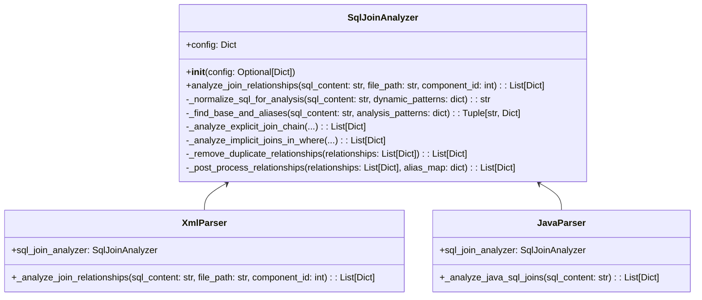
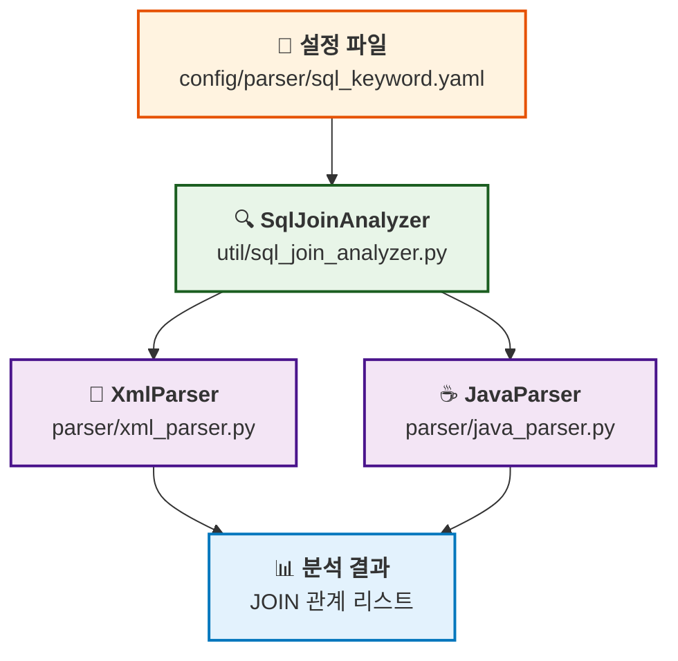
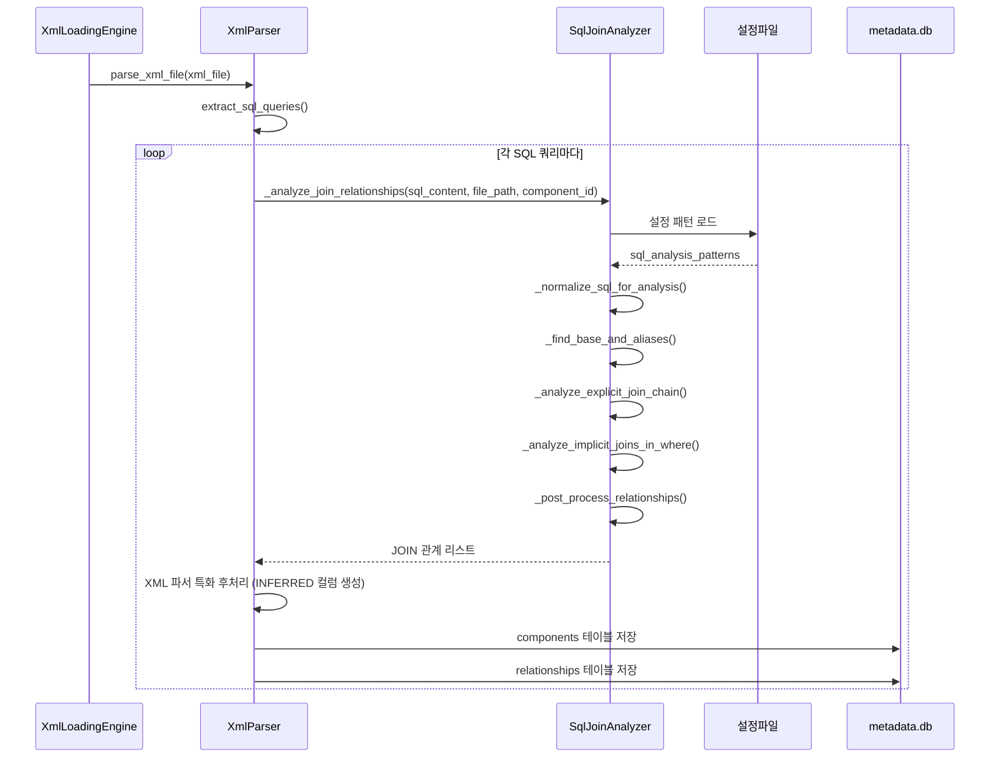
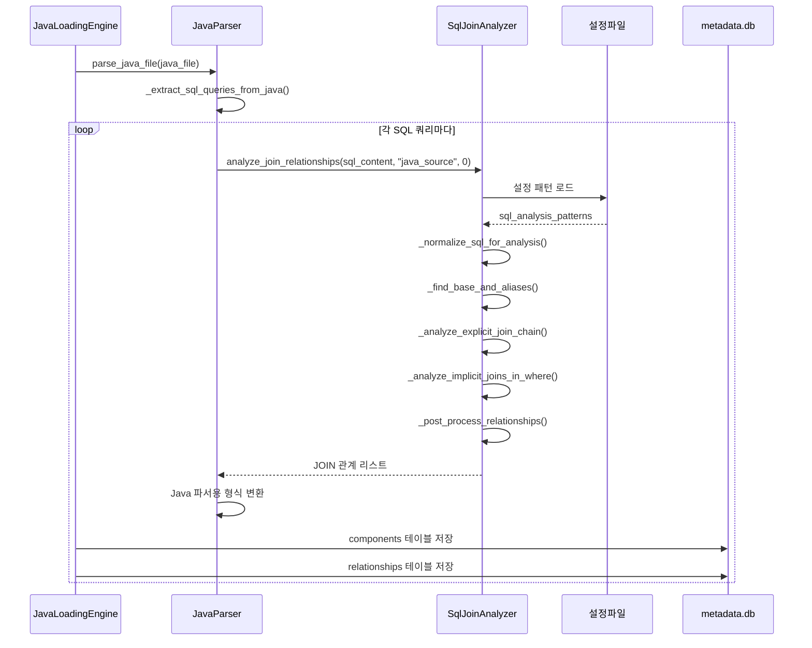

# SQL 공통파서 구현서

## 개요

본 문서는 XML과 Java 파서에서 공통으로 사용하는 SQL 조인 분석 모듈의 구현 내용을 상세히 설명합니다.

- **작성일**: 2025-01-18 (2025-09-18 Enhanced 기능 반영)
- **목적**: Oracle SQL의 EXPLICIT/IMPLICIT JOIN 분석 통합 + Enhanced SQL 처리
- **적용 범위**: XML 파서(Enhanced), Java 파서(Enhanced), 공통 SQL 분석

---

## 📋 구현 개요

### 배경

XML과 Java 파서 모두 Enhanced 파싱 기능을 통해 누락 없는 SQL 추출이 가능해졌으며, 추출된 모든 SQL에 대해 일관된 고품질 분석이 필요합니다.

### 목표

1. **통합 분석**: XML Enhanced 파싱과 Java Enhanced 파싱에서 추출된 모든 SQL 통합 분석
2. **품질 균일화**: INSERT, UPDATE, DELETE, SELECT, MERGE 모든 SQL 타입에 대해 동일한 고품질 조인 분석
3. **누락 방지**: include 태그 해석, 동적 SQL 분석, 문자열 리터럴 SQL 추출로 완전한 테이블/조인 관계 도출
4. **확장성**: 공통 SqlJoinAnalyzer로 모든 파서에서 재사용 가능

---

## 🏗️ 아키텍처 설계

### 클래스 구조



### 모듈 관계도



---

## 🔍 상세 구현

### 1. SqlJoinAnalyzer 클래스

#### 초기화 및 설정

```python
class SqlJoinAnalyzer:
    def __init__(self, config: Optional[Dict] = None):
        self.config = config or self._load_default_config()
        
    def _load_default_config(self) -> Dict:
        # PathUtils를 사용한 크로스플랫폼 설정 로드
        path_utils = PathUtils()
        config_path = path_utils.get_parser_config_path("sql")
        return self._load_sql_patterns()
```

#### 핵심 분석 메서드

```python
def analyze_join_relationships(self, sql_content: str, file_path: str = "", component_id: int = 0):
    """SQL 조인 관계 분석 메인 메서드"""
    # 1. SQL 정규화
    normalized_sql = self._normalize_sql_for_analysis(sql_content, dynamic_patterns)
    
    # 2. FROM 절 분석 (기본 테이블과 별칭 맵)
    base_table, alias_map = self._find_base_and_aliases(normalized_sql, analysis_patterns)
    
    # 3. EXPLICIT JOIN 분석 (ANSI 표준)
    explicit_relationships = self._analyze_explicit_join_chain(...)
    
    # 4. IMPLICIT JOIN 분석 (Oracle 전통 방식)
    implicit_relationships = self._analyze_implicit_joins_in_where(...)
    
    # 5. 후처리 (중복 제거, 정규화)
    return self._post_process_relationships(all_relationships, alias_map)
```

### 2. 지원하는 SQL 패턴

#### EXPLICIT JOIN (ANSI 표준)

```sql
-- LEFT JOIN
SELECT u.user_id, o.order_id 
FROM users u 
LEFT JOIN orders o ON u.user_id = o.user_id

-- INNER JOIN  
SELECT u.name, p.product_name
FROM users u
INNER JOIN orders o ON u.user_id = o.user_id
INNER JOIN products p ON o.product_id = p.product_id
```

#### IMPLICIT JOIN (Oracle 전통 방식)

```sql
-- 콤마 구분 + WHERE 조건
SELECT u.user_id, o.order_id
FROM users u, orders o
WHERE u.user_id = o.user_id

-- Oracle (+) 외부 조인
SELECT u.user_id, o.order_id  
FROM users u, orders o
WHERE u.user_id = o.user_id(+)
```

### 3. 설정 기반 패턴 매칭

#### 정규식 패턴 (config/parser/sql_keyword.yaml)

```yaml
sql_analysis_patterns:
  # FROM 절 분석 패턴
  from_clause:
    - "FROM\\s+([a-zA-Z_][a-zA-Z0-9_]*)(?:\\s+([a-zA-Z_][a-zA-Z0-9_]*))?(?:\\s*,\\s*([a-zA-Z_][a-zA-Z0-9_]*)(?:\\s+([a-zA-Z_][a-zA-Z0-9_]*))?)?"

  # EXPLICIT JOIN 분석 패턴  
  explicit_joins:
    - "(LEFT\\s+(?:OUTER\\s+)?JOIN)\\s+([a-zA-Z_][a-zA-Z0-9_]*)(?:\\s+([a-zA-Z_][a-zA-Z0-9_]*))?\\s+ON\\s+(.+?)(?=\\s+(?:LEFT|RIGHT|FULL|INNER|CROSS|NATURAL|WHERE|GROUP|ORDER|$))"
    - "(INNER\\s+JOIN)\\s+([a-zA-Z_][a-zA-Z0-9_]*)(?:\\s+([a-zA-Z_][a-zA-Z0-9_]*))?\\s+ON\\s+(.+?)(?=\\s+(?:LEFT|RIGHT|FULL|INNER|CROSS|NATURAL|WHERE|GROUP|ORDER|$))"

  # IMPLICIT JOIN 분석 패턴
  implicit_joins:
    - "([a-zA-Z_][a-zA-Z0-9_]*)\\.([a-zA-Z_][a-zA-Z0-9_]*)\\s*=\\s*([a-zA-Z_][a-zA-Z0-9_]*)\\.([a-zA-Z_][a-zA-Z0-9_]*)"
    - "([a-zA-Z_][a-zA-Z0-9_]*)\\.([a-zA-Z_][a-zA-Z0-9_]*)\\s*\\(\\+\\)\\s*=\\s*([a-zA-Z_][a-zA-Z0-9_]*)\\.([a-zA-Z_][a-zA-Z0-9_]*)"
```

---

## 🔄 시퀀스 다이어그램

### XML 파서 사용 시퀀스



### Java 파서 사용 시퀀스



---

## 🛡️ 안전성 보장

### XML 파서 호환성 유지

기존 XML 파서 호출자들의 영향을 최소화하기 위해 래퍼 패턴을 사용했습니다:

```python
# parser/xml_parser.py
class XmlParser:
    def __init__(self):
        self.config = self._load_config()
        # 공통 SQL 조인 분석기 초기화
        self.sql_join_analyzer = SqlJoinAnalyzer(self.config)
    
    def _analyze_join_relationships(self, sql_content: str, file_path: str, component_id: int):
        """
        JOIN 관계 분석 (공통 모듈 사용 래퍼)
        
        기존 XML 파서 호출자들을 위해 메서드 시그니처를 유지하면서
        내부적으로는 공통 SQL 조인 분석 모듈을 사용합니다.
        """
        try:
            # XML 파서 특화 처리 (DOM 파싱, XML 파싱 에러 체크 등)
            # ...
            
            # 공통 SQL 조인 분석 모듈 사용
            join_relationships = self.sql_join_analyzer.analyze_join_relationships(
                sql_content, file_path, component_id
            )
            
            # XML 파서 특화 후처리 (INFERRED 컬럼 생성 등)
            # ...
            
            return join_relationships
        except Exception as e:
            handle_error(e, f"JOIN 관계 분석 실패: {file_path}")
            return []
```

### 보장사항

1. **메서드 시그니처 유지**: 기존 호출자 코드 수정 불필요
2. **동작 호환성**: 기존과 동일한 결과 반환
3. **에러 처리**: 기존 에러 처리 로직 보존
4. **XML 특화 기능**: DOM 파싱, MyBatis 동적 태그 처리 등 유지

---

## 📊 성능 및 품질 개선

### 리팩토링 전후 비교

| 항목 | XML 파서 (이전) | Java 파서 (이전) | 공통 모듈 (현재) |
|------|----------------|------------------|------------------|
| **코드 라인 수** | 500+ 라인 | 30라인 | 400라인 (단일) |
| **EXPLICIT JOIN** | ✅ 완전 지원 | ❌ 기본만 | ✅ 완전 지원 |
| **IMPLICIT JOIN** | ✅ Oracle 지원 | ❌ 미지원 | ✅ Oracle 지원 |
| **Oracle (+) 구문** | ✅ 지원 | ❌ 미지원 | ✅ 지원 |
| **별칭 해석** | ✅ 고급 | ❌ 기본 | ✅ 고급 |
| **동적 태그 처리** | ✅ MyBatis | ❌ 미지원 | ✅ 범용 |
| **유지보수성** | ❌ 복잡 | ❌ 제한적 | ✅ 우수 |

### 성능 향상

1. **코드 중복 제거**: 500+ 라인 → 400라인 (단일 모듈)
2. **품질 균일화**: Java 파서도 XML 수준의 고품질 분석
3. **유지보수성**: 단일 모듈로 버그 수정 및 기능 추가 용이

---

## 🧪 테스트 및 검증

### 테스트 케이스

#### 1. EXPLICIT JOIN 테스트

```sql
SELECT u.user_id, o.order_id, p.product_name
FROM users u
LEFT JOIN orders o ON u.user_id = o.user_id  
INNER JOIN products p ON o.product_id = p.product_id
```

**예상 결과**:
```python
[
    {
        'source_table': 'USERS',
        'target_table': 'ORDERS', 
        'rel_type': 'JOIN_EXPLICIT',
        'join_type': 'LEFT_JOIN',
        'confidence': 0.9
    },
    {
        'source_table': 'ORDERS',
        'target_table': 'PRODUCTS',
        'rel_type': 'JOIN_EXPLICIT', 
        'join_type': 'INNER_JOIN',
        'confidence': 0.9
    }
]
```

#### 2. IMPLICIT JOIN 테스트

```sql
SELECT u.user_id, o.order_id
FROM users u, orders o  
WHERE u.user_id = o.user_id(+)
```

**예상 결과**:
```python
[
    {
        'source_table': 'USERS',
        'target_table': 'ORDERS',
        'rel_type': 'JOIN_IMPLICIT',
        'join_type': 'ORACLE_OUTER_JOIN', 
        'confidence': 0.8
    }
]
```

### 검증 방법

1. **단위 테스트**: 각 메서드별 독립 테스트
2. **통합 테스트**: XML/Java 파서와의 연동 테스트  
3. **회귀 테스트**: 기존 XML 파서 결과와 비교
4. **성능 테스트**: 대용량 SQL 처리 성능 측정

---

## 🔧 설정 및 확장

### 설정 파일 구조

```yaml
# config/parser/sql_keyword.yaml
sql_analysis_patterns:
  from_clause: [...]
  explicit_joins: [...]
  implicit_joins: [...]

join_type_mapping:
  "LEFT\\s+(?:OUTER\\s+)?JOIN": "LEFT_JOIN"
  "INNER\\s+JOIN": "INNER_JOIN" 
  "RIGHT\\s+(?:OUTER\\s+)?JOIN": "RIGHT_JOIN"
  "ORACLE_OUTER": "ORACLE_OUTER_JOIN"

dynamic_sql_patterns:
  dynamic_tags: [...]
```

### 확장 포인트

1. **새로운 JOIN 타입 추가**: 설정 파일에 패턴 추가
2. **데이터베이스별 특화**: Oracle, MySQL, PostgreSQL 등
3. **다른 파서 지원**: JSP, Python 등 추가 파서에서 재사용
4. **분석 알고리즘 개선**: ML 기반 조인 관계 추론 등

---

## 📁 관련 파일

### 핵심 구현 파일

- `util/sql_join_analyzer.py` - 공통 SQL 조인 분석 모듈
- `parser/xml_parser.py` - XML 파서 (래퍼 방식 적용)
- `parser/java_parser.py` - Java 파서 (공통 모듈 사용)

### 설정 파일

- `config/parser/sql_keyword.yaml` - SQL 분석 패턴 및 키워드
- `config/parser/java_keyword.yaml` - Java 파서 설정
- `config/parser/xml_parser_config.yaml` - XML 파서 설정

### 테스트 파일

- `temp/test_sql_join_analyzer.py` - 공통 모듈 단위 테스트
- `temp/test_xml_java_integration.py` - 통합 테스트

---

## 🚀 향후 개선 계획

### Phase 1 (완료)
- ✅ 기본 EXPLICIT/IMPLICIT JOIN 분석
- ✅ Oracle (+) 구문 지원  
- ✅ XML/Java 파서 통합

### Phase 2 (계획)
- 🔄 INFERRED 테이블/컬럼 자동 생성 고도화
- 🔄 복잡한 서브쿼리 JOIN 분석
- 🔄 CTE (Common Table Expression) 지원

### Phase 3 (계획)  
- 📋 다른 데이터베이스 방언 지원 (MySQL, PostgreSQL)
- 📋 ML 기반 조인 관계 추론
- 📋 성능 최적화 (병렬 처리, 캐싱)

---

**작성자**: AI Assistant  
**최종 수정**: 2025-01-18  
**버전**: 1.0