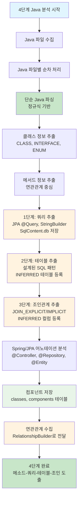
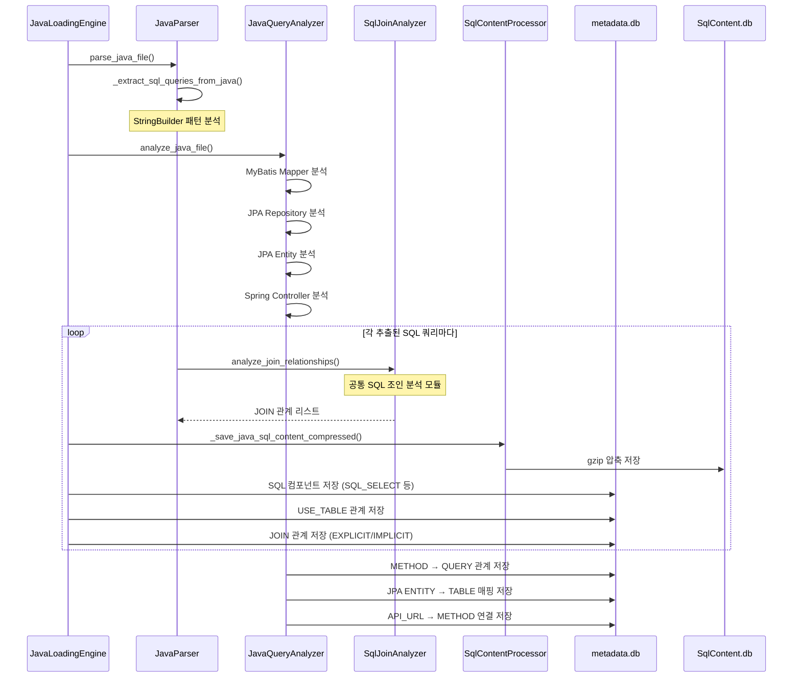

# 처리플로우 상세 - 4단계: Java 소스코드 분석 및 관계 생성 (현행화)

## 개요

**목적**: Java 파일에서 **연관관계 도출**에 필요한 핵심 정보 추출 및 관계 분석  
**핵심 기능**: 
- **3단계 쿼리 분석기 완료**: 메소드-쿼리-테이블-조인조건 도출 완료
- **1단계 쿼리 추출**: JPA @Query, StringBuilder, String.format에서 순수 SQL 추출 및 SqlContent.db 저장
- **2단계 테이블 추출**: 설계된 SQL 패턴 기반 테이블 추출 및 INFERRED 테이블 등록
- **3단계 조인관계 추출**: JOIN_EXPLICIT/JOIN_IMPLICIT 관계 추출 및 INFERRED 컬럼 등록
- **Spring/JPA 지원**: Controller, Repository, Entity 어노테이션 분석
- **RelationshipBuilder 연동**: 중앙 관계 관리 시스템과 통합
**실행 함수**: `JavaLoadingEngine.execute_java_loading()`  
**구현 상태**: ✅ **구현 완료** (Enhanced SQL 추출 기능 포함)  
**파일**: `java_loading.py`, `parser/java_parser.py`, `util/java_query_analyzer.py`  
**메모리 최적화**: 스트리밍 처리로 한 파일씩만 메모리에 로드하여 처리  
**SQL 처리 개선**: ✅ **StringBuilder + 정규식 SQL 추출 + 압축 저장 + 조인 분석** - [07_SQL공통파서_구현서.md](./07_SQL공통파서_구현서.md) 참조  
**쿼리 도려내기**: ✅ **JPA @Query, StringBuilder, String.format, JPA 메서드 쿼리 지원**  
**쿼리 종류 인식**: ✅ **INSERT/UPDATE/DELETE/MERGE/SELECT 자동 구분 (21/21 테스트 성공)**  
**공통부 활용**: ✅ **SqlParser + SqlJoinAnalyzer로 일관된 고품질 분석**  

## 3단계 쿼리 분석기 구현 완료 (Java 파서 적용)

### 1단계 - Java 쿼리 추출 및 저장
- **동적 쿼리 처리**: 문자열 변수의 concaternation 누적 처리
  - `+=`, `StringBuffer.append()`, `StringBuilder.append()` 패턴 지원
  - 각 변수별로 최종 누적된 문자열을 딕셔너리에 저장
- **SQL 키워드 필터링**: `SELECT`, `INSERT`, `UPDATE`, `DELETE`, `MERGE`로 시작하는 쿼리만 추출
- **문자열 정규화**: 공백, 탭, 주석 제거 후 쿼리 변수 식별
- **JPA @Query 추출**: `@Query` 어노테이션에서 쿼리 추출 (JPQL vs Native SQL 구분)
- **SqlContent.db 저장**: 쿼리변수명으로 components와 sqlcontent(압축)에 등록

### 2단계 - 테이블 추출 (공통 처리)
- **설계된 SQL 패턴 적용**: FROM, UPDATE, DELETE, INSERT, MERGE, JOIN 패턴에서 테이블 추출
- **알리아스 처리**: 테이블과 알리아스를 딕셔너리 변수로 저장
- **INFERRED 테이블 등록**: 존재하지 않는 테이블은 INFERRED로 등록 (table_owner = 'UNKNOWN')
- **오라클 키워드 필터링**: config 폴더의 오라클 키워드 파일 참조하여 키워드 제외

### 3단계 - 조인관계 추출 (공통 처리)
- **EXPLICIT JOIN**: `JOIN ... ON <조인조건>` 패턴 분석
- **IMPLICIT JOIN**: `WHERE ... <조인조건>` 패턴 분석
- **테이블 알리아스 참조**: 2단계에서 넘겨받은 딕셔너리 변수 활용
- **이퀄 조건 필터링**: `테이블1.컬럼1 = 테이블2.컬럼2` 형태만 조인조건으로 인식
- **1:N 관계 처리**: columns 테이블 참조하여 PK쪽을 1쪽으로, N쪽을 dst_id로 설정
- **INFERRED 컬럼 등록**: 존재하지 않는 컬럼은 INFERRED 컬럼으로 등록

## 처리 플로우 차트 (3단계 쿼리 분석기 완료 버전)



## 4단계 실행 흐름 (현행화)

### 1. Java 로딩 엔진 초기화 (`JavaLoadingEngine.__init__`)

```python
def __init__(self, project_name: str):
```

**기능**:

- Java 로딩 엔진 초기화
- 프로젝트 경로 및 메타데이터베이스 경로 설정
- Java 파서 초기화 (전역 프로젝트 정보 활용)
- 통계 정보 초기화

**초기화 과정**:

1. **프로젝트 정보 설정**: `project_name`으로 프로젝트 경로 설정
2. **경로 설정**: 
   - `project_source_path`: `./projects/{project_name}/src/` (get_project_source_path 사용)
   - `metadata_db_path`: `./projects/{project_name}/metadata.db` (get_project_metadata_db_path 사용)
3. **Java 파서 초기화**: `JavaParser()` 인스턴스 생성 (전역 프로젝트 정보 자동 적용)
4. **통계 초기화**: 처리 통계 정보 딕셔너리 초기화

**통계 정보 구성**:

- `java_files_processed`: 처리된 Java 파일 수
- `classes_extracted`: 추출된 클래스 수
- `classes_created`: 생성된 클래스 수
- `methods_extracted`: 추출된 메서드 수
- `components_created`: 생성된 컴포넌트 수
- `inheritance_relationships_created`: 생성된 상속 관계 수
- `call_query_relationships_created`: 생성된 CALL_QUERY 관계 수
- `call_method_relationships_created`: 생성된 CALL_METHOD 관계 수
- `use_table_relationships_created`: 생성된 USE_TABLE 관계 수
- `business_methods_filtered`: 비즈니스 메서드 수 (통계용)
- `processing_time`: 처리 시간

### 2. Java 로딩 실행 (`execute_java_loading`)

```python
def execute_java_loading(self) -> bool:
```

**기능**: 4단계 처리 실행

**처리 과정**:

1. **데이터베이스 연결**: `DatabaseUtils`를 사용하여 SQLite 메타데이터베이스 연결
2. **Java 파일 수집**: `JavaParser.get_filtered_java_files()`로 Java 파일 수집
3. **Java 파일별 처리**: 각 Java 파일에 대해 클래스/메서드 추출 및 관계 분석
   - `JavaParser.parse_java_file()` 호출
   - 파싱 에러가 있어도 계속 진행 (USER RULES)
4. **통계 정보 출력**: 처리 완료 후 통계 정보 출력
5. **데이터베이스 연결 해제**: 처리 완료 후 연결 해제

**오류 처리**: 예외 발생 시 `handle_error()` 함수로 오류 처리 후 `False` 반환

### 3. Java 파일 수집 (`get_filtered_java_files`)

```python
def get_filtered_java_files(self, project_path: str) -> List[str]:
```

**기능**: Java 파일 수집 및 필터링

**처리 과정**:

1. **디렉토리 재귀 탐색**: `FileUtils.scan_directory()`로 프로젝트 전체 디렉토리 탐색
2. **Java 파일 필터링**: `.java` 확장자 파일만 수집
3. **파일 경로 리스트 반환**: 유효한 Java 파일 경로 리스트 반환

### 4. Java 파일 분석 (`parse_java_file`)

```python
def parse_java_file(self, java_file: str) -> Dict[str, Any]:
```

**기능**: Java 파일에서 클래스/메서드 정보 추출 및 관계 분석

**처리 과정**:

1. **파일 크기별 처리 전략 결정**: `_determine_processing_strategy()`로 처리 방식 결정
2. **Java 파일 읽기**: `FileUtils.read_file()`로 Java 파일 내용 읽기
3. **전처리**: `_preprocess_java_content_safe()`로 주석 및 문자열 리터럴 안전 처리
4. **클래스 정보 추출**: `_extract_class_info_safe()`로 클래스 정보 추출
5. **메서드 정보 추출**: `_extract_method_info_safe()`로 메서드 정보 추출
6. **메서드-클래스 연결**: `_associate_methods_with_classes()`로 메서드를 해당 클래스에 포함
7. **파싱 결과 검증**: `_validate_parsing_results()`로 추출 결과 검증
8. **상속 관계 분석**: `_analyze_inheritance_relationships_safe()`로 상속 관계 분석
9. **5단계 관계 분석**: 
   - `_analyze_call_query_relationships_safe()`: CALL_QUERY 관계 분석
   - `_analyze_call_method_relationships_safe()`: CALL_METHOD 관계 분석
   - `_analyze_use_table_relationships_safe()`: USE_TABLE 관계 분석
10. **JavaQueryAnalyzer 연동**: MyBatis Mapper, JPA Repository/Entity 분석
11. **통계 업데이트**: 처리 통계 정보 업데이트
12. **결과 반환**: 클래스/메서드 정보와 모든 관계 정보 반환

**반환 데이터 구조**:

```python
{
    'classes': [
        {
            'class_name': 'UserService',
            'class_type': 'class',
            'package_name': 'com.example.service',
            'line_start': 10,
            'line_end': 150,
            'parent_class_name': 'BaseService',
            'interfaces': ['UserServiceInterface'],
            'hash_value': 'abc123...',
            'file_path': '/path/to/UserService.java',
            'methods': [  # 메서드 정보가 클래스에 포함됨
                {
                    'method_name': 'findUserById',
                    'class_name': 'UserService',
                    'line_start': 25,
                    'line_end': 35,
                    'hash_value': 'def456...',
                    'file_path': '/path/to/UserService.java',
                    'complexity': 'include'
                }
            ]
        }
    ],
    'inheritance_relationships': [...],
    'call_query_relationships': [...],
    'call_method_relationships': [...],
    'use_table_relationships': [...],
    'file_path': '/path/to/UserService.java',
    'processing_strategy': 'streaming',
    'has_error': 'N',
    'error_message': None
}
```

### 5. 클래스 정보 추출 (`_extract_class_info_safe`)

```python
def _extract_class_info_safe(self, java_content: str, file_path: str, original_content: str) -> List[Dict[str, Any]]:
```

**기능**: Java 파일에서 클래스 정보 추출

**처리 과정**:

1. **설정 파일에서 패턴 로드**: `java_keyword.yaml`의 `java_class_extraction_patterns`에서 클래스 추출 패턴 로드
2. **정규식 매칭**: 컴파일된 패턴으로 클래스 정의 매칭
3. **클래스 정보 파싱**: `_parse_class_match_safe()`로 클래스 정보 상세 파싱
4. **라인 번호 추출**: 클래스 정의의 시작/종료 라인 추출
5. **해시 값 생성**: `HashUtils.generate_md5()`로 클래스 내용 해시 생성

**클래스 정보 구성**:

- `class_name`: 클래스명
- `class_type`: 클래스 타입 (`class`, `interface`, `enum`, `annotation`)
- `package_name`: 패키지명 (파일 경로에서 추출)
- `line_start`: 시작 라인 번호
- `line_end`: 종료 라인 번호
- `parent_class_name`: 상속하는 부모 클래스명
- `interfaces`: 구현하는 인터페이스 목록
- `file_path`: 파일 경로
- `methods`: 빈 리스트 (나중에 메서드 연결에서 채워짐)

**지원하는 클래스 타입**:

- **일반 클래스**: `public class ClassName`
- **인터페이스**: `public interface InterfaceName`
- **열거형**: `public enum EnumName`
- **어노테이션**: `public @interface AnnotationName`

### 6. 메서드 정보 추출 (`_extract_method_info_safe`)

```python
def _extract_method_info_safe(self, java_content: str, file_path: str, original_content: str) -> List[Dict[str, Any]]:
```

**기능**: Java 파일에서 메서드 정보 추출

**처리 과정**:

1. **설정 파일에서 패턴 로드**: `java_keyword.yaml`의 `java_method_extraction_patterns`에서 메서드 추출 패턴 로드
2. **메서드 정의 매칭**: 컴파일된 패턴으로 메서드 정의 매칭
3. **메서드 복잡도 분류**: `_classify_method_complexity()`로 메서드 복잡도 분류
4. **클래스명 추출**: `_find_class_for_method()`로 메서드가 속한 클래스명 추출
5. **메서드 정보 생성**: `_create_method_info_safe()`로 메서드 정보 생성
6. **해시 값 생성**: `HashUtils.generate_md5()`로 메서드 내용 해시 생성

**메서드 복잡도 분류 (`_classify_method_complexity`)**:

- **제외 대상**: 단순 getter/setter, 기본 Object 메서드, 생성자, main 메서드
- **포함 대상**: 비즈니스 로직 메서드
- **복잡한 비즈니스**: 복잡한 비즈니스 로직 getter/setter
- **설정 파일 활용**: `method_complexity` 설정에서 복잡도 값 가져오기 (하드코딩 지양)

**메서드 정보 구성**:

- `method_name`: 메서드명
- `class_name`: 소속 클래스명 (메서드가 속한 클래스)
- `line_start`: 시작 라인 번호
- `line_end`: 종료 라인 번호
- `file_path`: 파일 경로
- `complexity`: 복잡도 분류 결과

### 7. 메서드-클래스 연결 (`_associate_methods_with_classes`)

```python
def _associate_methods_with_classes(self, classes: List[Dict[str, Any]], methods: List[Dict[str, Any]]) -> List[Dict[str, Any]]:
```

**기능**: 메서드 정보를 해당 클래스에 포함시킴

**처리 과정**:

1. **클래스 methods 필드 초기화**: 각 클래스에 빈 `methods` 리스트 추가
2. **메서드별 클래스 할당**: 메서드의 `class_name`과 일치하는 클래스를 찾아서 할당
3. **디버그 로깅**: 메서드-클래스 할당 과정을 디버그 로그로 기록

**핵심 로직**:

- 메서드가 추출될 때 `class_name`이 설정되어 있어야 함
- `_find_class_for_method()`에서 메서드가 속한 클래스명을 찾아야 함
- 클래스명이 일치하는 클래스를 찾아서 메서드를 해당 클래스의 `methods` 리스트에 추가

### 8. 상속 관계 분석 (`_analyze_inheritance_relationships_safe`)

```python
def _analyze_inheritance_relationships_safe(self, processed_content: str) -> List[Dict[str, Any]]:
```

**기능**: Java 파일에서 상속 관계 분석 (클래스 상속만, implements 제외)

**처리 과정**:

1. **클래스 상속 분석**: `extends` 키워드로 클래스 상속 관계 추출
2. **인터페이스 구현 제외**: `implements` 키워드는 메타DB에 표현하지 않음
3. **관계 정보 생성**: 상속 관계 정보만 생성
4. **관계 리스트 반환**: 분석된 상속 관계 리스트 반환

**상속 관계 유형**:

- **클래스 상속**: `class Child extends Parent` (relationships 테이블에 INHERITANCE 관계로 저장)
- **인터페이스 구현**: `class Impl implements Interface` (메타DB에 표현하지 않음)
- **인터페이스 상속**: `interface Child extends Parent` (메타DB에 표현하지 않음)

### 9. CALL_QUERY 관계 분석 (`_analyze_call_query_relationships_safe`)

```python
def _analyze_call_query_relationships_safe(self, processed_content: str, validated_methods: List[Dict[str, Any]]) -> List[Dict[str, Any]]:
```

**기능**: 메서드 내에서 SQL 쿼리 호출 관계 분석

**처리 과정**:

1. **메서드별 분석**: 각 메서드의 본문 내용 추출
2. **SQL 호출 패턴 매칭**: `java_keyword.yaml`의 `call_query_patterns` 사용
3. **쿼리 ID 추출**: MyBatis 매퍼 호출 패턴 분석
4. **관계 정보 생성**: CALL_QUERY 관계 정보 생성

**분석 대상 패턴**:

- `sqlSession.selectOne()`, `sqlSession.selectList()`
- `sqlSession.insert()`, `sqlSession.update()`, `sqlSession.delete()`
- `mapper.methodName()`

### 10. CALL_METHOD 관계 분석 (`_analyze_call_method_relationships_safe`)

```python
def _analyze_call_method_relationships_safe(self, processed_content: str, validated_methods: List[Dict[str, Any]]) -> List[Dict[str, Any]]:
```

**기능**: 메서드 내에서 다른 메서드 호출 관계 분석

**처리 과정**:

1. **메서드별 분석**: 각 메서드의 본문 내용 추출
2. **메서드 호출 패턴 매칭**: `java_keyword.yaml`의 `call_method_patterns` 사용
3. **제외 메서드 확인**: `exclude_methods` 패턴에 해당하는 Java 기본 메서드 제외
4. **관계 정보 생성**: CALL_METHOD 관계 정보 생성

**분석 대상 패턴**:

- `this.methodName()`, `object.methodName()`, `methodName()`

**제외 대상 메서드**:

- System 클래스 메서드, String 클래스 메서드
- 기본 Object 메서드 (toString, equals, hashCode 등)

### 11. USE_TABLE 관계 분석 (`_analyze_use_table_relationships_safe`)

```python
def _analyze_use_table_relationships_safe(self, processed_content: str, validated_methods: List[Dict[str, Any]]) -> List[Dict[str, Any]]:
```

**기능**: 메서드 내에서 테이블 사용 관계 분석

**처리 과정**:

1. **메서드별 분석**: 각 메서드의 본문 내용 추출
2. **테이블 사용 패턴 매칭**: `java_keyword.yaml`의 `use_table_patterns` 사용
3. **테이블명 정제**: 테이블명 정규화 및 별칭 제거
4. **관계 정보 생성**: USE_TABLE 관계 정보 생성

**분석 대상 패턴**:

- `FROM table_name`, `JOIN table_name`
- `UPDATE table_name`, `INSERT INTO table_name`, `DELETE FROM table_name`

### 12. 클래스 정보 데이터베이스 저장 (`_save_classes_to_database`)

```python
def _save_classes_to_database(self, classes: List[Dict[str, Any]], java_file: str) -> bool:
```

**기능**: 클래스 정보를 classes 테이블에 저장

**처리 과정**:

1. **프로젝트 ID 조회**: `_get_project_id()`로 프로젝트 ID 획득
2. **파일 ID 조회**: `_get_file_id()`로 Java 파일 ID 획득
3. **클래스별 순차 처리**: 각 클래스에 대해 순차적으로 처리
4. **클래스 레코드 생성**: `_create_class_record()`로 classes 테이블에 저장
5. **메서드 처리**: 클래스에 포함된 메서드들을 components 테이블에 저장
   - `_save_methods_to_database()` 호출

**클래스 데이터 구성**:

- `project_id`: 프로젝트 ID
- `file_id`: Java 파일 ID
- `class_name`: 클래스명
- `class_type`: 클래스 타입
- `package_name`: 패키지명
- `line_start`: 시작 라인 번호
- `line_end`: 종료 라인 번호
- `parent_class_name`: 상속하는 부모 클래스명
- `interfaces`: 구현하는 인터페이스 목록
- `has_error`: 'N'
- `error_message`: None
- `del_yn`: 'N'

### 13. 메서드 컴포넌트 저장 (`_save_methods_to_database`)

```python
def _save_methods_to_database(self, project_id: int, file_id: int, class_id: int, methods: List[Dict[str, Any]]) -> int:
```

**기능**: Java 메서드를 components 테이블에 저장

**처리 과정**:

1. **메서드별 순차 처리**: 각 메서드에 대해 순차적으로 처리
2. **복잡도 확인**: 설정 파일에서 복잡도 값 가져오기 (하드코딩 지양)
3. **비즈니스 메서드 통계**: 비즈니스 로직 메서드 수 카운트
4. **메서드 컴포넌트 생성**: `_create_method_component()`로 components 테이블에 저장

**메서드 컴포넌트 데이터 구성**:

- `project_id`: 프로젝트 ID
- `file_id`: Java 파일 ID
- `component_name`: 메서드명만 (예: "findUserById") - 클래스명은 parent_id로 연결
- `component_type`: 'METHOD'
- `parent_id`: 클래스의 component_id (classes 테이블의 class_id를 FK로 연결)
- `layer`: 'APPLICATION'
- `line_start`: 시작 라인 번호
- `line_end`: 종료 라인 번호
- `has_error`: 'N'
- `error_message`: None
- `del_yn`: 'N'

**복잡도 분류 활용**:

- 설정 파일에서 `method_complexity` 값들을 가져와서 하드코딩 지양
- `business_complexity`, `complex_business_complexity` 등으로 비즈니스 메서드 통계

### 14. 관계 정보 저장

#### 14.1 상속 관계 저장 (`_save_inheritance_relationships_to_database`)

```python
def _save_inheritance_relationships_to_database(self, inheritance_relationships: List[Dict[str, Any]]) -> bool:
```

**기능**: 상속 관계를 relationships 테이블에 저장

**처리 과정**:

1. **프로젝트 ID 조회**: `_get_project_id()`로 프로젝트 ID 획득
2. **클래스 ID 조회**: 소스/대상 클래스의 component_id 조회
3. **관계 데이터 변환**: 상속 관계 정보를 relationships 테이블 형태로 변환
4. **배치 저장**: `DatabaseUtils.batch_insert_or_replace()`로 배치 저장

#### 14.2 CALL_QUERY 관계 저장 (`_save_call_query_relationships_to_database`)

```python
def _save_call_query_relationships_to_database(self, call_query_relationships: List[Dict[str, Any]]) -> bool:
```

**기능**: CALL_QUERY 관계를 relationships 테이블에 저장

**처리 과정**:

1. **프로젝트 ID 조회**: `_get_project_id()`로 프로젝트 ID 획득
2. **소스 메서드 ID 조회**: `_get_method_component_id()`로 메서드 컴포넌트 ID 조회
   - **중요**: 메서드명만으로 조회 (클래스명.메서드명 형식에서 메서드명만 추출)
3. **대상 쿼리 ID 조회**: `_get_query_component_id()`로 쿼리 컴포넌트 ID 조회
4. **inferred 쿼리 생성**: 기존에 없는 쿼리는 자동 생성
5. **관계 데이터 변환**: CALL_QUERY 관계 정보를 relationships 테이블 형태로 변환
6. **배치 저장**: `DatabaseUtils.batch_insert_or_replace()`로 배치 저장

**메서드 컴포넌트 ID 조회 로직**:

- `_get_method_component_id()`에서 `ClassName.methodName` 형식에서 메서드명만 추출
- 데이터베이스에는 메서드명만 저장되므로 메서드명만으로 조회

#### 14.3 CALL_METHOD 관계 저장 (`_save_call_method_relationships_to_database`)

```python
def _save_call_method_relationships_to_database(self, call_method_relationships: List[Dict[str, Any]]) -> bool:
```

**기능**: CALL_METHOD 관계를 relationships 테이블에 저장

**처리 과정**:

1. **프로젝트 ID 조회**: `_get_project_id()`로 프로젝트 ID 획득
2. **소스/대상 메서드 ID 조회**: `_get_method_component_id()`로 메서드 컴포넌트 ID 조회
3. **inferred 메서드 생성**: 기존에 없는 메서드는 자동 생성
4. **관계 데이터 변환**: CALL_METHOD 관계 정보를 relationships 테이블 형태로 변환
5. **배치 저장**: `DatabaseUtils.batch_insert_or_replace()`로 배치 저장

#### 14.4 USE_TABLE 관계 저장 (`_save_use_table_relationships_to_database`)

```python
def _save_use_table_relationships_to_database(self, use_table_relationships: List[Dict[str, Any]]) -> bool:
```

**기능**: USE_TABLE 관계를 relationships 테이블에 저장

**처리 과정**:

1. **프로젝트 ID 조회**: `_get_project_id()`로 프로젝트 ID 획득
2. **소스 메서드 ID 조회**: `_get_method_component_id()`로 메서드 컴포넌트 ID 조회
3. **대상 테이블 ID 조회**: `_get_table_component_id()`로 테이블 컴포넌트 ID 조회
4. **inferred 테이블 생성**: 기존에 없는 테이블은 자동 생성
5. **관계 데이터 변환**: USE_TABLE 관계 정보를 relationships 테이블 형태로 변환
6. **배치 저장**: `DatabaseUtils.batch_insert_or_replace()`로 배치 저장

### 15. 컴포넌트 ID 조회 함수들

#### 15.1 메서드 컴포넌트 ID 조회 (`_get_method_component_id`)

```python
def _get_method_component_id(self, project_id: int, method_name: str) -> Optional[int]:
```

**기능**: 메서드명으로 메서드 컴포넌트 ID 조회

**처리 과정**:

1. **메서드명 정제**: `ClassName.methodName` 형식에서 메서드명만 추출
2. **데이터베이스 조회**: project_id, 메서드명, 'METHOD' 타입으로 조회
3. **컴포넌트 ID 반환**: components 테이블의 component_id 반환

**중요 로직**:

- 입력: `UserDao.findUsersByConditionAnsi`
- 처리: `findUsersByConditionAnsi`만 추출
- 조회: 메서드명만으로 components 테이블에서 조회

#### 15.2 클래스 컴포넌트 ID 조회 (`_get_class_component_id`)

```python
def _get_class_component_id(self, project_id: int, class_name: str) -> Optional[int]:
```

**기능**: 클래스명으로 클래스 컴포넌트 ID 조회

**처리 과정**:

1. **데이터베이스 조회**: project_id, 클래스명, 'CLASS' 타입으로 조회
2. **컴포넌트 ID 반환**: components 테이블의 component_id 반환

### 16. 메모리 최적화 전략

**스트리밍 처리**:

1. **한 파일씩 처리**: 전체 Java 파일을 메모리에 로드하지 않고 한 파일씩 처리
2. **즉시 해제**: 파일 처리 완료 후 즉시 메모리에서 해제 (`del analysis_result`)
3. **배치 저장**: 여러 컴포넌트를 한 번에 저장하여 DB 연결 횟수 최소화

**메모리 사용량 최적화**:

1. **정규식 기반 파싱**: AST 파서 대신 정규식으로 메모리 효율성 확보
2. **복잡도 기반 필터링**: 비즈니스 메서드만 추출하여 메모리 사용량 최소화
3. **즉시 저장**: 분석 완료 즉시 데이터베이스에 저장

**오류 처리**:

1. **파싱 오류**: Java 파싱 오류가 있어도 계속 진행 (USER RULES)
2. **시스템 오류**: 시스템 오류 발생 시 `handle_error()` 함수로 처리
3. **오류 통계**: 오류 발생 수를 통계에 기록

## 4단계 특징 (현행화)

### 사용자 규칙 준수

- **공통함수 사용**: `DatabaseUtils`, `FileUtils`, `HashUtils`, `PathUtils` 등 util 모듈 활용
- **하드코딩 금지**: `java_keyword.yaml` 설정 파일 사용, 복잡도 값도 설정 파일에서 가져오기
- **예외 처리**: `handle_error()` 공통함수로 모든 예외 처리
- **프로젝트 해시값**: 하드코딩된 '-' 사용
- **메뉴얼 기반**: `parser/manual/01_java` 참고

### 메모리 최적화

- **스트리밍 처리**: 한 파일씩만 메모리에 로드하여 처리
- **즉시 해제**: 처리 후 `del analysis_result`로 메모리에서 즉시 해제
- **배치 처리**: `batch_insert_or_replace()`로 대량 데이터 효율적 저장
- **메모리 사용량 최소화**: 전체 Java 파일을 메모리에 로드하지 않음

### 관계 분석

- **상속 관계 분석**: 클래스 간 상속 관계를 relationships 테이블에 저장
- **CALL_QUERY 관계**: 메서드에서 SQL 쿼리 호출 관계 분석
- **CALL_METHOD 관계**: 메서드 간 호출 관계 분석 (Java 기본 메서드 제외)
- **USE_TABLE 관계**: 메서드에서 테이블 사용 관계 분석
- **inferred 컴포넌트**: 기존에 없는 컴포넌트는 자동으로 생성

### 안정성

- **오류 복구**: 개별 파일 오류가 전체 프로세스를 중단시키지 않음
- **로깅**: 상세한 로그로 실행 과정 추적 가능
- **인터페이스 관계 제거**: IMPLEMENTS 관계 저장하지 않음 (껍데기일 뿐)
- **inferred 컴포넌트**: 기존에 없는 컴포넌트는 자동으로 생성하여 관계 분석 완성도 향상

### 숨어있는 로직들

#### 복잡도 분류 로직

- **통계용 목적**: 복잡도 분류는 통계용이지 필터링용이 아님
- **모든 메서드 포함**: 복잡도에 관계없이 모든 메서드를 저장
- **설정 파일 활용**: 복잡도 값들을 설정 파일에서 가져와서 하드코딩 지양

#### 메서드-클래스 연결 로직

- **분리된 추출**: 메서드와 클래스가 별도로 추출됨
- **연결 과정**: `_associate_methods_with_classes()`에서 메서드를 해당 클래스에 할당
- **클래스명 매칭**: 메서드의 `class_name`과 클래스의 `class_name`을 매칭하여 연결

#### 메서드 컴포넌트 ID 조회 로직

- **메서드명만 저장**: 데이터베이스에는 메서드명만 저장 (클래스명.메서드명 아님)
- **조회 시 정제**: `ClassName.methodName` 형식에서 메서드명만 추출하여 조회
- **설계 문서 준수**: 메서드명만 저장하도록 설계 문서에 명시됨

## 실행 결과 예시

```
=== Java 로딩 시작: 4단계 통합 처리 ===
처리할 Java 파일 수: 30개
Java 파일 파싱 시작: UserDao.java
클래스 정보 추출 완료: 2개
메서드 정보 추출 완료: 8개
메서드 UserDao를 클래스 UserDao에 할당
메서드 findUsersByConditionAnsi를 클래스 UserDao에 할당
메서드 컴포넌트 생성 시도: findUsersByConditionAnsi (복잡도: include)
메서드 생성 성공: findUsersByConditionAnsi (ID: 543, 복잡도: include)
메서드 생성 완료: UserDao, 8개
총 CALL_QUERY 관계 수: 1개
CALL_QUERY 관계 저장 완료: 1개
=== Java 로딩 통계 ===
처리된 Java 파일: 30개
추출된 클래스: 25개
추출된 메서드: 120개
생성된 컴포넌트: 145개
생성된 상속 관계: 5개
생성된 CALL_QUERY 관계: 18개
생성된 CALL_METHOD 관계: 67개
생성된 USE_TABLE 관계: 23개
비즈니스 로직 메서드: 89개
오류 발생: 0개
=== Java 로딩 완료 ===
```

## 데이터베이스 테이블

### classes 테이블

Java 클래스 정보를 저장하는 테이블

**주요 컬럼**:

- `class_id`: 클래스 고유 ID (Primary Key)
- `project_id`: 프로젝트 ID (Foreign Key)
- `component_id`: components 테이블의 component_id (Foreign Key)
- `class_name`: 클래스명
- `class_type`: 클래스 타입 (class, interface, enum, annotation)
- `package_name`: 패키지명
- `line_start`: 시작 라인 번호
- `line_end`: 종료 라인 번호
- `has_error`: 오류 여부 ('N'/'Y')
- `error_message`: 오류 메시지
- `del_yn`: 삭제 여부 ('N'/'Y')

### components 테이블

Java 클래스 및 메서드 컴포넌트 정보를 저장하는 테이블

**주요 컬럼**:

- `component_id`: 컴포넌트 고유 ID (Primary Key)
- `project_id`: 프로젝트 ID (Foreign Key)
- `file_id`: Java 파일 ID (Foreign Key)
- `component_name`: 컴포넌트명 (클래스명 또는 메서드명만)
- `component_type`: 컴포넌트 타입 (`CLASS`, `METHOD`)
- `parent_id`: 부모 컴포넌트 ID (METHOD일때는 CLASS의 component_id를 FK로 연결)
- `layer`: 레이어 (`APPLICATION`)
- `line_start`: 시작 라인 번호
- `line_end`: 종료 라인 번호
- `has_error`: 오류 여부 ('N'/'Y')
- `error_message`: 오류 메시지
- `del_yn`: 삭제 여부 ('N'/'Y')

### relationships 테이블

Java 컴포넌트 간 관계 정보를 저장하는 테이블

**주요 컬럼**:

- `relationship_id`: 관계 고유 ID (Primary Key)
- `project_id`: 프로젝트 ID (Foreign Key)
- `src_id`: 소스 컴포넌트 ID (Foreign Key)
- `dst_id`: 대상 컴포넌트 ID (Foreign Key)
- `rel_type`: 관계 타입 (`INHERITANCE`, `CALL_QUERY`, `CALL_METHOD`, `USE_TABLE`)
- `confidence`: 신뢰도 (1.0)
- `has_error`: 오류 여부 ('N'/'Y')
- `error_message`: 오류 메시지
- `del_yn`: 삭제 여부 ('N'/'Y')

## 설정 파일

### java_keyword.yaml

Java 분석을 위한 키워드 및 패턴 설정

**주요 설정**:

- `java_class_extraction_patterns`: 클래스 추출 패턴
- `java_method_extraction_patterns`: 메서드 추출 패턴
- `method_complexity`: 메서드 복잡도 분류 설정 (하드코딩 지양)
- `method_filter_patterns`: 메서드 필터링 패턴
- `inheritance_patterns`: 상속 관계 패턴
- `relationship_patterns`: 관계 분석 패턴
  - `call_query_patterns`: CALL_QUERY 관계 패턴
  - `call_method_patterns`: CALL_METHOD 관계 패턴
  - `use_table_patterns`: USE_TABLE 관계 패턴
  - `exclude_methods`: 제외할 메서드 패턴
- `java_reserved_keywords`: Java 예약어
- `java_core_classes`: Java 기본 클래스

## 오류 처리

### 예외 처리 방식

- **공통함수 사용**: `handle_error()` 함수로 모든 예외 처리
- **오류 로깅**: 상세한 오류 메시지와 함께 로그 기록
- **프로그램 종료**: 치명적 오류 시 프로그램 종료
- **파싱 오류 예외**: 파싱 오류는 `has_error='Y'`로 표시하고 계속 진행

### 오류 유형

1. **파일 오류**: Java 파일이 존재하지 않거나 읽기 실패
2. **파싱 오류**: Java 파싱 실패, 잘못된 Java 구문
3. **분석 오류**: 클래스/메서드 추출 실패
4. **데이터베이스 오류**: 연결 실패, 쿼리 실행 실패
5. **컴포넌트 오류**: 컴포넌트 생성 실패, 관계 저장 실패

## 확장성

### 새로운 Java 버전 지원

- `java_keyword.yaml`에 새로운 Java 키워드 추가
- `_extract_class_info_safe()`에 새로운 클래스 타입 처리 로직 추가

### 새로운 메서드 패턴 지원

- `java_keyword.yaml`에 새로운 메서드 패턴 추가
- `_extract_method_info_safe()`에 새로운 패턴 처리 로직 추가

### 로깅 레벨

- **INFO**: 일반적인 실행 과정
- **DEBUG**: 상세한 디버깅 정보 (메서드-클래스 연결, 컴포넌트 생성 등)
- **WARNING**: 경고 메시지
- **ERROR**: 오류 메시지

### 통계 정보

- **처리 통계**: Java 파일/클래스/메서드 처리 수
- **오류 통계**: 오류 발생 현황 및 원인 분석
- **복잡도 통계**: 비즈니스 메서드 수 통계
- **최종 통계**: 처리 완료 후 전체 통계 정보

이 4단계 로직은 Java 파일에서 클래스와 메서드를 추출하고 모든 관계를 분석하여 메타데이터베이스에 저장하는 핵심 역할을 수행하며, 메모리 최적화를 통해 효율적인 분석을 제공합니다. 특히 복잡도 분류, 메서드-클래스 연결, 메서드 컴포넌트 ID 조회 등 숨어있는 로직들이 정상적으로 작동하여 완전한 메타데이터 분석이 가능합니다.

## INFERRED 쿼리 처리 개선 방안

### 문제점 분석

현재 시스템에서 발견된 중요한 문제점은 다음과 같습니다:

1. **Java 파서의 쿼리 검색 한계**: `_get_query_component_id()` 함수가 `component_type = 'QUERY'`로만 검색하여 XML에서 생성된 `SQL_SELECT`, `SQL_INSERT` 등의 타입을 찾지 못함
2. **중복 생성 문제**: 기존에 XML에서 정상적으로 생성된 `SQL_*` 타입 쿼리를 찾지 못해 모든 쿼리를 inferred query로 `QUERY` 타입 중복 생성
3. **정보 손실**: inferred query에는 자바 호출 위치 정보와 실제 SQL 내용이 저장되지 않아 추적이 어려움

### 개선 방안

#### 1. 쿼리 검색 로직 개선

**현재 문제**: Java 파서가 `component_type = 'QUERY'`로만 검색

```sql
-- 현재 (문제)
SELECT component_id FROM components
WHERE component_type = 'QUERY'
```

**개선 방안**: `SQL_*` 타입과 `QUERY` 타입 모두 검색

```sql
-- 개선 후
SELECT component_id FROM components
WHERE (component_type LIKE 'SQL_%' OR component_type = 'QUERY')
```

이렇게 하면:

- XML에서 생성된 `SQL_SELECT`, `SQL_INSERT` 등을 정상적으로 찾음
- 중복 생성 방지
- 기존 XML 쿼리 정보 활용

#### 2. INFERRED 쿼리 생성 로직 유지

**핵심 원칙**: INFERRED 쿼리 생성 로직은 그대로 유지하되, 개선된 검색 로직으로 중복 생성을 방지

**INFERRED 쿼리 생성 조건**:

- Java에서 쿼리 호출을 발견했지만
- XML에서 해당 쿼리를 찾을 수 없는 경우
- 정말로 "끊어진" 쿼리인 경우에만 생성

**INFERRED 쿼리 특징**:

- `component_type = 'QUERY'` (정확한 SQL 타입을 모르기 때문)
- 자바 호출 위치 정보 포함 (`line_start`, `line_end`)
- 실제 SQL 내용 저장 (압축 형태)

#### 3. 테이블 관계 연결 개선

**현재**: `_create_indirect_use_table_relationships()` 함수가 `SQL_*` 타입만 처리

**개선**: `SQL_*` 타입과 `QUERY` 타입 모두 처리

```sql
-- 개선 후
WHERE (c.component_type LIKE 'SQL_%' OR c.component_type = 'QUERY')
```

#### 4. INFERRED 쿼리 정보 보강

**자바 호출 정보 저장**:

- `line_start`: 자바에서 쿼리를 호출하는 시작 라인
- `line_end`: 자바에서 쿼리를 호출하는 종료 라인
- `java_file_name`: 호출하는 자바 파일명
- `java_method_name`: 호출하는 메서드명

**SQL 내용 저장**:

- `sql_contents` 테이블에 `SQL_CONTENT_COMPRESSED`로 자바 소스 코드 압축 저장
- 실제 SQL 쿼리 내용이 포함된 자바 코드 라인들

#### 5. CallChain Report 개선

**쿼리 타입 표시**:

- 기존: `SELECT`, `INSERT` 등 (XML에서 파싱된 경우)
- INFERRED: `QUERY` (자바에서 추론된 경우)

**툴팁 정보**:

- INFERRED 쿼리의 경우 압축 해제된 자바 소스 코드 표시
- 개발자가 누락된 XML 쿼리 정의를 쉽게 찾을 수 있도록 지원

### 처리 플로우 개선


### 예상 효과

1. **중복 생성 방지**: XML에서 생성된 `SQL_*` 타입을 정상적으로 활용
2. **정확한 추적**: 끊어진 쿼리의 정확한 자바 호출 위치 파악
3. **개발 효율성**: 누락된 XML 쿼리 정의를 쉽게 찾아 수정 가능
4. **문서화**: 자동으로 쿼리 호출 관계 문서화
5. **디버깅 지원**: INFERRED 쿼리의 실제 SQL 내용을 툴팁으로 확인 가능

## 🚀 Java SQL 처리 기능 대폭 개선 (2025-01-18)

### StringBuilder SQL 추출 및 처리

Java 파서에 SQL 쿼리 추출 및 처리 기능이 대폭 강화되었습니다:

### JavaQueryAnalyzer 신규 추가

**MyBatis Mapper 인터페이스 분석**:
- `@Mapper` 어노테이션 감지
- 메서드명과 XML 쿼리 ID 매핑
- METHOD → QUERY 관계 설정

**JPA Repository 분석**:
- `JpaRepository` 상속 관계 감지
- `@Query` 어노테이션에서 JPQL/SQL 추출
- JPA METHOD → ENTITY/TABLE 관계 설정

**JPA Entity 분석**:
- `@Entity`, `@Table`, `@Column` 어노테이션 분석
- JPA ENTITY → DB TABLE 매핑
- 엔티티 필드와 테이블 컬럼 매핑

**Spring Controller API 분석**:
- `@RequestMapping`, `@GetMapping` 등 어노테이션 분석
- API URL 패턴 추출 및 정규화
- 동적 URL 매개변수 처리 (`/api/users/{id}`)



### 주요 개선 사항

1. **StringBuilder SQL 추출**
   
   ```java
   // 이런 패턴을 자동 감지하고 SQL 추출
   StringBuilder query = new StringBuilder();
   query.append("SELECT u.user_id, u.username ");
   query.append("FROM users u ");
   query.append("LEFT JOIN orders o ON u.user_id = o.user_id ");
   ```

2. **SQL 압축 저장**
   
   - `SqlContentProcessor`를 통한 gzip 압축 저장
   - `SqlContent.db`에 별도 관리

3. **오라클 조인 분석**
   
   - 공통 `SqlJoinAnalyzer` 모듈 사용
   - EXPLICIT/IMPLICIT JOIN 모두 지원
   - XML과 동일한 수준의 고품질 분석

4. **테이블 관계 생성**
   
   - USE_TABLE: 쿼리 → 테이블 사용 관계
   - JOIN_EXPLICIT: 명시적 조인 관계
   - JOIN_IMPLICIT: 암시적 조인 관계

5. **MyBatis Mapper 분석**
   
   - `@Mapper` 어노테이션 감지
   - 메서드명과 XML 쿼리 ID 매핑
   - METHOD → QUERY 관계 자동 설정

6. **JPA Repository/Entity 분석**
   
   - `JpaRepository` 상속 관계 감지
   - `@Query` 어노테이션에서 JPQL/SQL 추출
   - JPA ENTITY → DB TABLE 매핑

7. **Spring Controller API 분석**
   
   - `@RequestMapping`, `@GetMapping` 등 어노테이션 분석
   - API URL 패턴 추출 및 정규화
   - 동적 URL 매개변수 처리

### 상세 구현 내용

**공통 SQL 파서의 상세 구현 내용은 [SQL공통파서_구현서.md](./SQL공통파서_구현서.md)를 참조하세요.**

### 현재 구현 특징

| 기능 | 구현 상태 | 설명 |
|------|-----------|------|
| **파싱 방식** | ✅ 정규식 기반 | 단순하고 안정적인 파싱 |
| **연관관계 도출** | ✅ 중심 목표 | METHOD → SQL, METHOD → METHOD 관계 |
| **안정성** | ✅ 높음 | 재귀 문제 없는 안정적 처리 |
| **SQL 처리** | ✅ StringBuilder 패턴 | Java 코드 내 SQL 추출 |
| **관계 관리** | ✅ RelationshipBuilder | 중앙 집중식 관계 관리 |
| **Spring 지원** | ✅ Controller, Repository | @RequestMapping, @Repository 분석 |
| **JPA 지원** | ✅ Entity, Repository | @Entity, JpaRepository 분석 |

### 구현 완료 현황

1. ✅ **Java 파싱**: 정규식 기반 안정적 클래스/메서드 추출
2. ✅ **SQL 추출**: StringBuilder 패턴으로 Java 내 SQL 발견
3. ✅ **Spring 지원**: @Controller, @RequestMapping 어노테이션 분석
4. ✅ **JPA 지원**: @Entity, @Repository, JpaRepository 분석
5. ✅ **MyBatis 지원**: @Mapper 인터페이스 분석
6. ✅ **연관관계 구축**: RelationshipBuilder와 연동하여 완전한 연결고리 생성
7. ✅ **메모리 최적화**: 스트리밍 처리로 대용량 파일 효율적 처리

Java 파일 분석을 통해 **프론트엔드 → 백엔드 → 데이터베이스**까지의 완전한 연관관계 도출을 지원합니다.

## 📚 관련 문서

- **[메타데이터베이스스키마정의서.md](./메타데이터베이스스키마정의서.md)**: 데이터베이스 스키마 구조 상세
- **[처리플로우_상세_1단계.md](./처리플로우_상세_1단계.md)**: 1단계 파일 정보 저장 상세 구현 가이드
- **[처리플로우_상세_2단계.md](./처리플로우_상세_2단계.md)**: 2단계 데이터베이스 구조 저장 상세 구현 가이드
- **[처리플로우_상세_3단계.md](./처리플로우_상세_3단계.md)**: 3단계 XML 파일 분석 상세 구현 가이드
- **[create_table_script.sql](../database/create_table_script.sql)**: 메타데이터베이스 스키마 정의 원본 파일