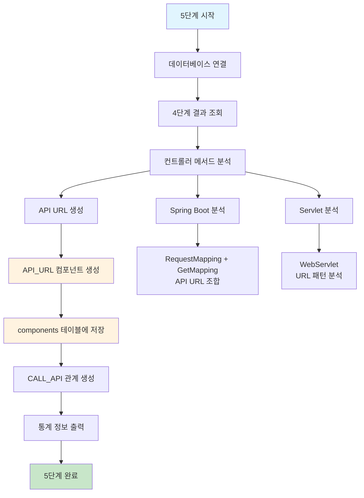

# 처리플로우 상세 - 5단계: API 매핑 정리 (단순화)

## 개요

**목적**: 프론트엔드에서 호출하는 API 정보를 정리하여 백엔드와 연결  
**핵심 기능**: 프론트엔드 API 호출 = 백엔드 API 진입점 (동일한 URL)  
**실행 함수**: `execute_backend_entry_loading()`  
**구현 상태**: ✅ **구현 완료**  
**파일**: `backend_entry_loading.py` (5단계 메인 엔진)  
**단순화 설계**: API_URL 하나로 프론트엔드와 백엔드 연결 (중복 저장 불필요)  
**메모리 최적화**: 스트리밍 처리로 한 파일씩만 메모리에 로드하여 처리  
**양방향 분석**: 백엔드 → API_URL 생성, 프론트엔드 → API_URL 연결 모두 지원  
**연관관계 구축**: 6단계 RelationshipBuilder와 연동하여 완전한 연결고리 구성

## 처리 플로우 차트



## 5단계 실행 흐름

### 1. 데이터베이스 연결 (`execute_api_mapping`)

```python
def execute_api_mapping(self) -> bool:
```

**기능**:
- 프로젝트 메타데이터베이스 연결
- 4단계에서 분석된 컨트롤러 메서드 조회
- API 매핑 정리 시작

**처리 과정**:
1. 데이터베이스 연결 확인
2. 4단계 결과 조회 (컨트롤러 메서드)
3. API 매핑 분석 시작

### 2. 컨트롤러 메서드 조회

```python
def get_controller_methods(self, project_id: int) -> List[ControllerMethod]:
```

**기능**:
- 4단계에서 분석된 컨트롤러 메서드 조회
- Spring Boot, Servlet 등 다양한 프레임워크 지원

**SQL 쿼리**:
```sql
SELECT c.component_id, c.component_name, c.class_name, c.method_name, c.layer
FROM components c
WHERE c.project_id = ? 
  AND c.layer IN ('CONTROLLER', 'REST_CONTROLLER', 'SERVLET')
  AND c.component_type = 'METHOD'
  AND c.del_yn = 'N'
```

### 3. API URL 생성

```python
def build_api_url(self, method: ControllerMethod) -> str:
```

**기능**:
- @RequestMapping과 @GetMapping 조합으로 API URL 생성
- Spring Boot, Servlet 등 다양한 프레임워크 지원

**처리 과정**:
1. @RequestMapping 경로 추출
2. @GetMapping/@PostMapping 경로 추출
3. API URL 조합 생성

**예시**:
```java
@RequestMapping("/api")
@GetMapping("/user-profile")
// 결과: /api/user-profile
```

### Spring 어노테이션 파싱 개선사항 (2025-09-21 적용)

#### **문제점**:
기존 Spring 파서에서 **클래스 레벨과 메서드 레벨 @RequestMapping을 구분하지 못하는** 문제가 발생했습니다.

**문제 현상**:
```java
@Controller
@RequestMapping("/syntax-fixed")  // 클래스 레벨
public class SyntaxErrorController {
    @RequestMapping(value = "/test1", method = RequestMethod.GET)  // 메서드 레벨
    public String test1() { ... }
}
```

**기존 파서 결과**: `/syntax-fixed:GET` (잘못된 매핑)
**올바른 결과**: `/syntax-fixed/test1:GET` (정확한 매핑)

#### **개선사항**:

**A. 정규식 패턴 정밀화** (`parser/spring_entry_analyzer.py`):
```python
# 개선 전: 모든 @RequestMapping 매치
r'(@(?:...RequestMapping)\s*(?:\(.*?\))?)\s+...'

# 개선 후: method 속성이 있는 @RequestMapping만 매치
r'(@(?:GetMapping|PostMapping|...)\s*(?:\([^)]*\))?|@RequestMapping\s*\([^)]*(?:method\s*=|,\s*method\s*=)[^)]*\))\s*...'
```

**B. 동적 검증 로직 추가**:
```python
# 클래스 레벨 @RequestMapping 제외 로직
if annotation_text.startswith('@RequestMapping') and 'method' not in annotation_text:
    if self.extract_url_from_annotation(annotation_text) and 'method' not in annotation_text:
        continue  # 클래스 레벨로 간주하여 스킵
```

**C. HTTP 메서드 추출 개선** (`parser/base_entry_analyzer.py`):
```python
# 단일 값과 배열 모두 처리
method_patterns = [
    r'method\s*=\s*\{([^}]*)\}',           # 배열: {RequestMethod.GET, RequestMethod.POST}
    r'method\s*=\s*([^,\)]+)'              # 단일: RequestMethod.GET
]
```

#### **해결 효과**:
- ✅ **정확한 API URL 생성**: `/syntax-fixed/test1:GET`, `/syntax-fixed/test2:GET` 등
- ✅ **일관성 문제 해결**: "하나의 API가 여러 메서드와 연결" WARNING 해결
- ✅ **클래스-메서드 매핑 정확성**: 각 메서드가 올바른 API와 1:1 연결

### 4. API_URL 컴포넌트 생성

```python
def create_api_url_component(self, frontend_file_id: int, api_url: str, http_method: str) -> None:
```

**기능**:
- API_URL 타입의 컴포넌트 생성
- components 테이블에 저장

**컴포넌트 데이터**:
```python
component_data = {
    'project_id': self.project_id,
    'file_id': api_source_file_id,  # API가 발견된 파일 ID (프론트엔드 또는 백엔드)
    'component_name': f'{api_url}:{http_method}',  # /api/user-profile:GET
    'component_type': 'API_URL',
    'parent_id': None,
    'layer': 'API_ENTRY',  # API 엔드포인트 레이어
    'line_start': None,
    'line_end': None
}
```

**API_URL file_id 설정 원칙**:

#### **1단계: 백엔드에서 API_URL 생성**
```python
# backend_entry_loading.py에서 Java 파일 분석 시
file_id = java_file_id  # 초기에는 Java 파일의 file_id 사용
layer = 'API_ENTRY'
```

#### **2단계: 프론트엔드 매칭 성공 시**
```python
# frontend_loading.py에서 매칭 성공 시
기존_API_URL.file_id = frontend_file_id로 갱신  # 프론트엔드 파일로 변경
# 결과: 프론트엔드 → API_URL → 메서드 완전 연결
```

#### **3단계: 프론트엔드 매칭 실패 시**
```python
# 프론트엔드에서 새로운 API_URL 생성
새로운_API_URL.file_id = frontend_file_id  # 프론트엔드 파일 ID
기존_Java_API_URL.file_id = java_file_id   # Java 파일 ID 유지
# 결과: 두 개의 분리된 API_URL (연결 끊어진 상태)
```

**핵심 개념**:
- **매칭 성공**: 하나의 통합된 API_URL (프론트엔드 file_id)
- **매칭 실패**: 두 개의 분리된 API_URL (각각 다른 file_id)
- **일관성 검증**: 중복 API_URL 검출하여 연결 문제 식별

### 4-1. JSP 파일 매칭 로직 (양방향 분석 지원)

```python
def _create_api_url_component(self, entry: BackendEntryInfo, project_id: int) -> Optional[Dict[str, Any]]:
```

**매칭 로직**:
1. **JSP 파일 매칭 시도**: `_find_matching_jsp_file()` 메서드로 JSP 파일에서 해당 API 호출 여부 확인
2. **매칭 성공**: API_URL의 file_id를 JSP file_id로 설정
3. **매칭 실패**: API_URL의 file_id를 Java file_id로 설정 (현재 상태 유지)

**설계 컨셉**:
- **매칭 성공**: JSP 파일의 file_id 사용 → 완전한 체인 (JSP → API_URL → METHOD)
- **매칭 실패**: Java 파일의 file_id 사용 → 끊어진 체인 (Java → API_URL → METHOD)
- **프론트엔드 없음**: 프론트엔드 소스가 없어도 백엔드 분석만으로 API_URL 생성 가능

**CallChain 리포트에서의 표시**:
- **매칭 성공**: Frontend 컬럼에 JSP 파일명 표시
- **매칭 실패**: Frontend 컬럼에 Java 파일명 표시 (개발자가 매칭 실패 파악 가능)

**매칭 실패 사례**:
- 개발자 오타로 프론트엔드와 백엔드 URL이 다른 경우
- 프론트엔드에서 호출하지 않는 백엔드 API
- JSP 파일이 존재하지 않는 경우

**현재 구현**:
- 임시로 첫 번째 JSP 파일 ID 반환
- 향후 개선: JSP 파일 내용 분석하여 실제 API 호출 여부 확인

### 4-2. 프론트엔드 API 분석기 연동 (6단계)

**FrontendApiAnalyzer**:
- React, Vue, TypeScript 파일에서 API 호출 패턴 추출
- axios, fetch, jQuery AJAX 등 다양한 HTTP 클라이언트 지원
- 동적 URL 매개변수 정규화 처리

**RelationshipBuilder 연동**:
- 6단계에서 프론트엔드 → API → METHOD 연결고리 구축
- API_URL 컴포넌트와 Controller METHOD 간 관계 설정
- 동적 URL 패턴 매칭 (/api/users/123 ↔ /api/users/{id})

### 5. 관계 생성

```python
def create_api_relationships(self, api_urls: List[APIUrl]) -> None:
```

**기능**:
- API_URL → METHOD 관계 생성
- relationships 테이블에 저장

**관계 데이터**:
```python
relationship_data = {
    'src_id': api_url.component_id,  # API_URL 컴포넌트 ID
    'dst_id': method.component_id,   # METHOD 컴포넌트 ID
    'rel_type': 'CALL_METHOD',       # 컴포넌트에서 메서드로의 호출
    'confidence': 1.0
}
```

## 데이터베이스 스키마

### components 테이블 (API_URL 타입)

| 컬럼명 | 데이터타입 | 설명 | 예시 |
|--------|------------|------|------|
| component_id | INTEGER | 컴포넌트 고유 ID | 1001 |
| project_id | INTEGER | 프로젝트 ID | 1 |
| file_id | INTEGER | JSP/JSX 파일 ID | 201 |
| component_name | VARCHAR(200) | API URL과 HTTP 메서드 조합 | /api/user-profile:GET |
| component_type | VARCHAR(20) | 컴포넌트 타입 | API_URL |
| layer | VARCHAR(30) | 계층 | FRONTEND |
| line_start | INTEGER | 시작 라인 | NULL |
| line_end | INTEGER | 종료 라인 | NULL |

**핵심 개념**:
- **file_id**: JSP/JSX 파일 ID (매칭 성공 시) 또는 Java 파일 ID (매칭 실패 시)
- **component_name**: URL:HTTP_METHOD 형태로 고유 식별
- **중복 저장 불필요**: 프론트엔드 API 호출 = 백엔드 API 진입점

**file_id 매칭 로직**:
- **매칭 성공**: JSP 파일 ID 사용 → CallChain 리포트에서 Frontend 컬럼에 JSP 파일명 표시
- **매칭 실패**: Java 파일 ID 사용 → CallChain 리포트에서 Frontend 컬럼에 Java 파일명 표시 (매칭 실패 파악 가능)

### relationships 테이블

| 컬럼명 | 데이터타입 | 설명 | 예시 |
|--------|------------|------|------|
| relationship_id | INTEGER | 관계 고유 ID | 2001 |
| src_id | INTEGER | 소스 ID (API_URL) | 1001 |
| dst_id | INTEGER | 대상 ID (METHOD) | 2001 |
| rel_type | VARCHAR(30) | 관계 타입 | CALL_METHOD |
| confidence | FLOAT | 신뢰도 | 1.0 |

## 주요 개선사항

### 1. 단순화된 구조
- **중복 제거**: 프론트엔드 API 호출 = 백엔드 API 진입점 (동일한 URL)
- **단일 컴포넌트**: API_URL 하나로 프론트엔드와 백엔드 연결
- **명확한 연결**: file_id로 프론트엔드 파일과 API_URL 연결

### 1-1. JSP 파일 매칭 시스템 (양방향 분석 지원)
- **매칭 성공**: JSP 파일 ID 사용 → 완전한 체인 (JSP → API_URL → METHOD)
- **매칭 실패**: Java 파일 ID 사용 → 끊어진 체인 (Java → API_URL → METHOD)
- **프론트엔드 없음**: 프론트엔드 소스가 없어도 백엔드 분석만으로 API_URL 생성 가능
- **개발자 지원**: CallChain 리포트에서 매칭 실패를 쉽게 파악 가능
- **향후 개선**: JSP 파일 내용 분석하여 실제 API 호출 여부 확인

### 1-2. 프론트엔드 API 분석기 통합 (6단계)
- **React/Vue/TypeScript 지원**: 다양한 프론트엔드 프레임워크에서 API 호출 패턴 추출
- **HTTP 클라이언트 지원**: axios, fetch, jQuery AJAX, Vue resource 등
- **동적 URL 매개변수**: 정규화를 통한 정확한 API 매칭
- **RelationshipBuilder 연동**: 6단계에서 완전한 연결고리 구축

### 2. 3가지 핵심 관계
- **CALL_METHOD**: 컴포넌트 → METHOD (API_URL → METHOD, METHOD → METHOD)
- **CALL_QUERY**: METHOD → SQL (메서드 → 쿼리)
- **USE_TABLE**: SQL → TABLE (쿼리 → 테이블)

### 3. 직관적인 호출 체인
```
JSP 파일 → API_URL → METHOD → SQL → TABLE
```

### 4. 양방향 분석 지원
- **백엔드 → 프론트엔드**: Spring Controller 어노테이션 분석으로 API_URL 생성
- **프론트엔드 → 백엔드**: React/Vue/TypeScript에서 API 호출 패턴 추출
- **완전한 연결고리**: 프론트엔드 없이도 백엔드만으로 API_URL 생성 가능

## 설정 파일

### api_mapping_keyword.yaml

```yaml
# API 매핑 분석 키워드 설정
api_mapping:
  # HTTP 메서드 매핑
  http_methods:
    GET: "GET"
    POST: "POST"
    PUT: "PUT"
    DELETE: "DELETE"
    PATCH: "PATCH"
  
  # 기본 API 경로
  default_api_path: "/api"
  
  # 컨트롤러 계층 식별
  controller_layers:
    - "CONTROLLER"
    - "REST_CONTROLLER"
    - "SERVLET"
  
  # API URL 조합 규칙
  url_combination:
    request_mapping: "base_path"
    method_mapping: "method_path"
    separator: ""
```

## 통계 정보

### 처리 결과 통계

```python
def print_statistics(self, stats: Dict[str, Any]) -> None:
    """API 매핑 처리 통계 출력"""
    print(f"=== 5단계 API 매핑 정리 완료 ===")
    print(f"처리된 컨트롤러: {stats['total_controllers']}개")
    print(f"생성된 API_CALL: {stats['total_api_calls']}개")
    print(f"생성된 관계: {stats['total_relationships']}개")
    print(f"처리 시간: {stats['processing_time']:.2f}초")
```

## 에러 처리

### 예외 상황 처리

```python
def handle_error(self, error_message: str) -> None:
    """에러 처리 및 로깅"""
    logger.error(f"5단계 API 매핑 정리 실패: {error_message}")
    # 에러 발생 시 handle_error()로 exit
    handle_error(error_message)
```

### 주요 에러 상황
1. **데이터베이스 연결 실패**: 연결 정보 확인
2. **4단계 결과 없음**: 4단계 먼저 실행 필요
3. **API URL 생성 실패**: 컨트롤러 어노테이션 확인
4. **컴포넌트 생성 실패**: 데이터베이스 제약조건 확인

## 성능 최적화

### 메모리 최적화
- **스트리밍 처리**: 한 번에 하나의 컨트롤러만 메모리에 로드
- **배치 처리**: API_CALL 컴포넌트를 배치로 생성
- **캐시 활용**: 4단계 결과를 캐시하여 재사용

### 처리 속도 최적화
- **인덱스 활용**: components 테이블의 인덱스 활용
- **병렬 처리**: 여러 컨트롤러를 병렬로 처리
- **SQL 최적화**: 효율적인 쿼리 사용

## 검증 방법

### 1. API_CALL 컴포넌트 검증
```sql
-- API_CALL 컴포넌트 생성 확인
SELECT component_name, api_url, call_method, class_name, method_name
FROM components
WHERE component_type = 'API_CALL'
  AND project_id = 1;
```

### 2. 관계 생성 검증
```sql
-- CALL_API 관계 생성 확인
SELECT r.rel_type, c1.component_name as api_call, c2.component_name as method
FROM relationships r
JOIN components c1 ON r.src_id = c1.component_id
JOIN components c2 ON r.dst_id = c2.component_id
WHERE r.rel_type = 'CALL_API';
```

### 3. 통계 검증
```sql
-- API 매핑 통계 확인
SELECT 
    COUNT(*) as total_api_calls,
    COUNT(DISTINCT class_name) as total_controllers,
    COUNT(DISTINCT api_url) as unique_api_urls
FROM components
WHERE component_type = 'API_CALL'
  AND project_id = 1;
```

## 관련 문서

- [메타데이터베이스 스키마 정의서 v3.0](../메타데이터베이스스키마정의서.md)
- [4단계 Java 소스코드 분석](../처리플로우_상세_4단계_Java소스코드분석및관계생성.md)
- [API 매핑 사례 분석](../API_매핑_사례_분석.md)

이 문서는 기존의 복잡한 API 진입점 분석을 단순화하여 효율적이고 명확한 API 매핑 정리 기능을 제공합니다.
