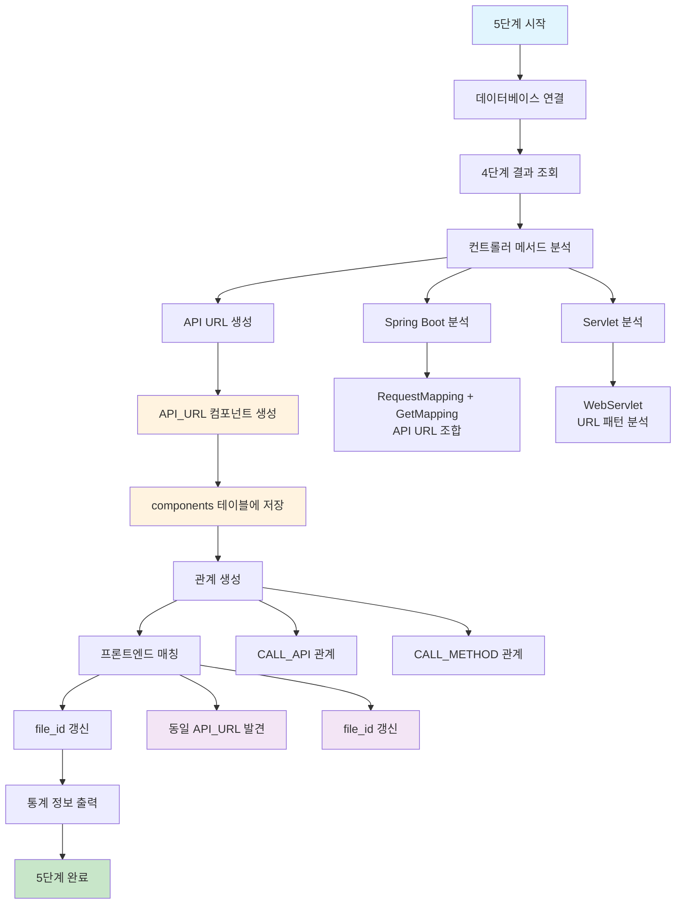

# 5단계: API 매핑 구현서 (현행화)

## 개요

**목적**: 백엔드 API와 프론트엔드 API 호출을 연결하여 완전한 호출 체인 구축  
**핵심 기능**: API_URL 컴포넌트를 통한 백엔드-프론트엔드 연결  
**실행 함수**: `execute_backend_entry_loading()`  
**구현 상태**: ✅ **구현 완료**  
**파일**: `backend_entry_loading.py`, `frontend_loading.py`  
**API_URL 표준화**: GET:selectUser 형태로 일원화  
**관계 구축**: CALL_API, CALL_METHOD 관계를 통한 완전한 연결고리  
**프론트엔드 매칭**: 동일 API_URL 발견 시 file_id 갱신으로 통합  
**정밀 매칭**: controller_api_map을 통한 정확한 API_URL ↔ METHOD 매칭  
**파일 경로 스키마**: file_path=디렉터리, file_name=파일명으로 분리 저장

## 처리 플로우 차트


```mermaid
flowchart TD
    A[5단계 시작] --> B[데이터베이스 연결]
    B --> C[4단계 결과 조회]
    C --> D[컨트롤러 메서드 분석]
    D --> E[API URL 생성]
    E --> F[API_URL 컴포넌트 생성]
    F --> G[components 테이블에 저장]
    G --> H[관계 생성]
    H --> I[프론트엔드 매칭]
    I --> J[file_id 갱신]
    J --> K[통계 정보 출력]
    K --> L[5단계 완료]
    
    D --> D1[Spring Boot 분석]
    D --> D2[Servlet 분석]
    
    D1 --> D1a["RequestMapping + GetMapping<br/>API URL 조합"]
    D2 --> D2a["WebServlet<br/>URL 패턴 분석"]
    
    H --> H1[CALL_API 관계]
    H --> H2[CALL_METHOD 관계]
    
    I --> I1[동일 API_URL 발견]
    I --> I2[file_id 갱신]
    
    style A fill:#e1f5fe
    style L fill:#c8e6c9
    style F fill:#fff3e0
    style G fill:#fff3e0
    style I1 fill:#f3e5f5
    style I2 fill:#f3e5f5
```

## 5단계 실행 흐름

### 1. 데이터베이스 연결 및 초기화

```python
def execute_backend_entry_loading(self) -> bool:
```

**기능**:
- 프로젝트 메타데이터베이스 연결
- 4단계에서 분석된 컨트롤러 메서드 조회
- API_URL 컴포넌트 생성 및 관계 구축

**처리 과정**:
1. 데이터베이스 연결 확인
2. 4단계 결과 조회 (컨트롤러 메서드)
3. API_URL 컴포넌트 생성
4. CALL_API, CALL_METHOD 관계 생성
5. 프론트엔드 매칭 및 file_id 갱신

### 2. 컨트롤러 메서드 조회

```python
def get_controller_methods(self, project_id: int) -> List[ControllerMethod]:
```

**기능**:
- 4단계에서 분석된 컨트롤러 메서드 조회
- Spring Boot, Servlet 등 다양한 프레임워크 지원

**SQL 쿼리**:
```sql
SELECT c.component_id, c.component_name, c.class_name, c.method_name, c.layer
FROM components c
WHERE c.project_id = ? 
  AND c.layer IN ('CONTROLLER', 'REST_CONTROLLER', 'SERVLET')
  AND c.component_type = 'METHOD'
  AND c.del_yn = 'N'
```

### 3. API URL 생성

```python
def build_api_url(self, method: ControllerMethod) -> str:
```

**기능**:
- @RequestMapping과 @GetMapping 조합으로 API URL 생성
- Spring Boot, Servlet 등 다양한 프레임워크 지원

**처리 과정**:
1. @RequestMapping 경로 추출
2. @GetMapping/@PostMapping 경로 추출
3. API URL 조합 생성

**예시**:
```java
@RequestMapping("/api")
@GetMapping("/user-profile")
// 결과: /api/user-profile
```

### Spring 어노테이션 파싱 개선사항 (2025-09-21 적용)

#### **문제점**:
기존 Spring 파서에서 **클래스 레벨과 메서드 레벨 @RequestMapping을 구분하지 못하는** 문제가 발생했습니다.

**문제 현상**:
```java
@Controller
@RequestMapping("/syntax-fixed")  // 클래스 레벨
public class SyntaxErrorController {
    @RequestMapping(value = "/test1", method = RequestMethod.GET)  // 메서드 레벨
    public String test1() { ... }
}
```

**기존 파서 결과**: `/syntax-fixed:GET` (잘못된 매핑)
**올바른 결과**: `/syntax-fixed/test1:GET` (정확한 매핑)

#### **개선사항**:

**A. 정규식 패턴 정밀화** (`parser/spring_entry_analyzer.py`):
```python
# 개선 전: 모든 @RequestMapping 매치
r'(@(?:...RequestMapping)\s*(?:\(.*?\))?)\s+...'

# 개선 후: method 속성이 있는 @RequestMapping만 매치
r'(@(?:GetMapping|PostMapping|...)\s*(?:\([^)]*\))?|@RequestMapping\s*\([^)]*(?:method\s*=|,\s*method\s*=)[^)]*\))\s*...'
```

**B. 동적 검증 로직 추가**:
```python
# 클래스 레벨 @RequestMapping 제외 로직
if annotation_text.startswith('@RequestMapping') and 'method' not in annotation_text:
    if self.extract_url_from_annotation(annotation_text) and 'method' not in annotation_text:
        continue  # 클래스 레벨로 간주하여 스킵
```

**C. HTTP 메서드 추출 개선** (`parser/base_entry_analyzer.py`):
```python
# 단일 값과 배열 모두 처리
method_patterns = [
    r'method\s*=\s*\{([^}]*)\}',           # 배열: {RequestMethod.GET, RequestMethod.POST}
    r'method\s*=\s*([^,\)]+)'              # 단일: RequestMethod.GET
]
```

#### **해결 효과**:
- ✅ **정확한 API URL 생성**: `/syntax-fixed/test1:GET`, `/syntax-fixed/test2:GET` 등
- ✅ **일관성 문제 해결**: "하나의 API가 여러 메서드와 연결" WARNING 해결
- ✅ **클래스-메서드 매핑 정확성**: 각 메서드가 올바른 API와 1:1 연결

### 4. API_URL 컴포넌트 생성 및 표준화

```python
def _create_api_url_component(self, entry: BackendEntryInfo, project_id: int) -> Optional[Dict[str, Any]]:
```

**기능**:
- API_URL 타입의 컴포넌트 생성
- 표준화된 네이밍 규칙 적용
- components 테이블에 저장

**API_URL 표준화 규칙**:

#### **A. 공통 유틸과 규칙 (util/api_naming.py)**
```python
# 표시용 이름(component_name): METHOD:action 형식
def format_api_component_name(http_method: str, method_name: str) -> str:
    if http_method == 'UNKNOWN' or not method_name:
        return method_name  # "selectUser"
    return f"{http_method}:{method_name}"  # "GET:selectUser"

# 정체성 키(identity key): URL+HTTP 조합으로 고유 식별
def build_api_identity_key(url: str, http_method: str) -> str:
    if http_method == 'UNKNOWN' or not http_method:
        return f"::{url.lower()}"  # "::/api/users"
    return f"{http_method.upper()}::{url.lower()}"  # "GET::/api/users"

# 해시 생성: 동일 URL+HTTP 조합이면 프론트/백 모두 같은 해시
def generate_content_hash(identity_key: str) -> str:
    return HashUtils.generate_content_hash(identity_key)
```

#### **B. 프론트/백엔드 동일 규칙/해시 사용**
- **표시명**: GET:selectUser (사람이 보기 좋은 이름)
- **정체성**: GET::/api/user/select (실제 중복 판단 기준)
- **해시**: identity_key 기반 고정 해시 (동일 URL+HTTP → 동일 해시)

#### **C. 백엔드 생성 흐름**
```python
# backend_entry_loading.py
http_method, url_pattern, method_name = extract_from_controller()
component_name = format_api_component_name(http_method, method_name)  # "GET:selectUser"
identity_key = build_api_identity_key(url_pattern, http_method)  # "GET::/api/user/select"
identity_hash = generate_content_hash(identity_key)

# 중복 조회 후 INSERT 또는 재사용
existing = get_component_by_hash(identity_hash)
if not existing:
    insert_api_url_component(file_id=java_file_id)
```

#### **D. 프론트엔드 생성 흐름**
```python
# frontend_loading.py
url, http_method, method_name = parse_from_jsp_ajax()
component_name = format_api_component_name(http_method, method_name)  # "GET:selectUser"
identity_key = build_api_identity_key(url, http_method)  # "GET::/api/user/select"
identity_hash = generate_content_hash(identity_key)  # 백엔드와 동일

# 동일 해시 발견 시 재사용 + file_id 갱신
existing = get_component_by_hash(identity_hash)
if existing:
    existing.file_id = frontend_file_id  # 프론트 파일로 갱신
else:
    insert_api_url_component(file_id=frontend_file_id)
```

#### **E. 예외/경계 규칙**
- **GET:UNKNOWN**: method_name이 없으면 표시명은 method_name만 사용
- **UNKNOWN:selectUser**: http_method가 UNKNOWN이면 "selectUser"로 저장
- **URL 정규화**: 소문자 변환, 트레일링 슬래시 일관화
- **매칭 우선순위**: 프론트 생성 시 file_id를 프론트 파일로 업데이트 (뷰 연결 우선)
- **동일 API 병합**: 프론트/백엔드에서 같은 identity_hash 발견 시 하나로 통합
- **HTTP 메서드 구분**: GET:selectUser와 POST:selectUser는 별개 API로 취급

**컴포넌트 데이터**:
```python
component_data = {
    'project_id': self.project_id,
    'file_id': java_file_id,  # 초기에는 Java 파일 ID
    'component_name': 'GET:selectUser',  # 표준화된 API 이름
    'component_type': 'API_URL',
    'parent_id': None,
    'layer': 'API_ENTRY',
    'line_start': None,
    'line_end': None
}
```

### 4-1. JSP 파일 매칭 로직 (양방향 분석 지원)

```python
def _create_api_url_component(self, entry: BackendEntryInfo, project_id: int) -> Optional[Dict[str, Any]]:
```

**매칭 로직**:
1. **JSP 파일 매칭 시도**: `_find_matching_jsp_file()` 메서드로 JSP 파일에서 해당 API 호출 여부 확인
2. **매칭 성공**: API_URL의 file_id를 JSP file_id로 설정
3. **매칭 실패**: API_URL의 file_id를 Java file_id로 설정 (현재 상태 유지)

**설계 컨셉**:
- **매칭 성공**: JSP 파일의 file_id 사용 → 완전한 체인 (JSP → API_URL → METHOD)
- **매칭 실패**: Java 파일의 file_id 사용 → 끊어진 체인 (Java → API_URL → METHOD)
- **프론트엔드 없음**: 프론트엔드 소스가 없어도 백엔드 분석만으로 API_URL 생성 가능

**CallChain 리포트에서의 표시**:
- **매칭 성공**: Frontend 컬럼에 JSP 파일명 표시
- **매칭 실패**: Frontend 컬럼에 Java 파일명 표시 (개발자가 매칭 실패 파악 가능)

**매칭 실패 사례**:
- 개발자 오타로 프론트엔드와 백엔드 URL이 다른 경우
- 프론트엔드에서 호출하지 않는 백엔드 API
- JSP 파일이 존재하지 않는 경우

**현재 구현**:
- 임시로 첫 번째 JSP 파일 ID 반환
- 향후 개선: JSP 파일 내용 분석하여 실제 API 호출 여부 확인

### 4-2. 프론트엔드 API 분석기 연동 (6단계)

**FrontendApiAnalyzer**:
- React, Vue, TypeScript 파일에서 API 호출 패턴 추출
- axios, fetch, jQuery AJAX 등 다양한 HTTP 클라이언트 지원
- 동적 URL 매개변수 정규화 처리

**RelationshipBuilder 연동**:
- 6단계에서 프론트엔드 → API → METHOD 연결고리 구축
- API_URL 컴포넌트와 Controller METHOD 간 관계 설정
- 동적 URL 패턴 매칭 (/api/users/123 ↔ /api/users/{id})

### 5. 관계 생성 (정밀 매칭)

```python
def create_relationships(self, api_urls: List[Dict[str, Any]]) -> None:
```

**기능**:
- Controller 어노테이션 기반 정밀 매칭
- MyBatis 네임스페이스 기반 정밀 매칭
- 가중치 기반 폴백 매칭
- 표준화된 관계 타입 사용

**정밀 매칭 시스템**:

#### **A. Controller 어노테이션 기반 정밀 매칭**
```python
# controller_api_map 테이블 활용
def create_precise_api_method_mapping():
    # 1단계: API_URL의 identity(GET::/path)를 분해
    identity_key = build_api_identity_key(url, http_method)  # "GET::/api/users"
    identity_hash = generate_content_hash(identity_key)        # 해시값 생성
    
    # 2단계: controller_api_map에서 동일 identity_hash로 METHOD 찾기
    # 이전에 컨트롤러 분석할 때 저장해둔 정보를 조회
    mapping = db.query("""
        SELECT class_name, method_name
        FROM controller_api_map
        WHERE identity_hash = ? AND del_yn = 'N'
    """, (identity_hash,))
    
    if mapping:
        class_name, method_name = mapping
        # 3단계: 정확한 METHOD 찾기 (클래스명 + 메서드명으로)
        method = db.query("""
            SELECT c.component_id
            FROM components c
            LEFT JOIN classes cl ON cl.class_id = c.parent_id
            WHERE c.component_type='METHOD'
              AND c.component_name = ?
              AND cl.class_name = ?
              AND c.del_yn='N'
        """, (method_name, class_name))
        
        if method:
            # 4단계: API_URL → METHOD 관계 생성
            create_relationship(api_url_id, method_id, 'CALL_METHOD')
            return True  # 정밀 매칭 성공
    return False  # 정밀 매칭 실패 → 폴백 매칭으로 전환
```

**정밀 매칭의 장점**:
- **정확성**: HTTP 메서드 + URL + 클래스 + 메서드명으로 1:1 정확 매칭
- **중복 방지**: 동일 identity_hash로 중복 API_URL 자동 통합
- **성능**: 해시 기반 빠른 조회
- **유지보수**: 어노테이션 변경 시 자동 반영

**정밀 매칭의 효과**:
- 기존: 메서드 이름만으로 추측해서 매칭 (부정확할 수 있음)
- 개선: 컨트롤러 어노테이션 정보를 미리 저장해두고, 정확한 HTTP+URL로 매칭
- 결과: "GET /api/users" API는 정확히 "UserController.selectUser" 메서드와 연결됨

#### **B. MyBatis 네임스페이스 기반 정밀 매칭 (다음 구현 예정)**
```python
# mapper_map 테이블 활용
def create_precise_method_sql_mapping():
    # Java 인터페이스/DAO의 FQN.method와 mapper의 namespace.id 매칭
    # 예: com.example.UserMapper.selectUser ↔ namespace="com.example.UserMapper", id="selectUser"
    mapping = db.query("""
        SELECT sql_component_id
        FROM mapper_map
        WHERE namespace = ? AND query_id = ? AND del_yn = 'N'
    """, (namespace, method_name))
    
    if mapping:
        # METHOD → SQL 관계 생성
        create_relationship(method_id, mapping[0], 'CALL_QUERY')
```

**이 과정의 의미 (다음 구현 예정)**:
- 기존: SQL 컴포넌트 이름 패턴으로 추측해서 매칭 (부정확할 수 있음)
- 개선: MyBatis XML의 namespace + id 정보를 미리 저장해두고, 정확한 매칭
- 결과: "UserMapper.selectUser" 메서드는 정확히 "selectUser" SQL과 연결됨

#### **C. 폴백 매칭 (기존 규칙)**
```python
# 정밀 매칭 실패 시 기존 가중치 기반 매칭
def fallback_matching():
    candidates = find_method_candidates(method_name)
    for candidate in candidates:
        score = 0
        if candidate.file_id == api_url.file_id:
            score += 10  # 같은 파일 (+10) - 가장 높은 우선순위
        if candidate.class_name.endswith('Controller'):
            score += 5   # Controller 클래스 (+5) - 컨트롤러일 가능성 높음
        if candidate.layer == 'CONTROLLER':
            score += 3   # CONTROLLER 레이어 (+3) - 레이어 우선순위
    return max(candidates, key=lambda x: x.score)
```

**폴백 매칭의 역할**:
- 정밀 매칭이 실패했을 때 사용하는 안전장치
- 예: 컨트롤러 어노테이션 정보가 없거나, 매핑 테이블에 데이터가 없는 경우
- 기존 방식대로 메서드 이름 + 가중치로 최선의 후보를 선택
- 안정성을 보장하여 시스템이 중단되지 않도록 함

#### **D. SQL 파서 보강**
```python
# CTE/서브쿼리/중첩 JOIN 인식 강화
def extract_table_names_enhanced(sql: str) -> List[str]:
    # 1단계: 기존 테이블 추출 (FROM, JOIN 등)
    tables = extract_tables_and_aliases(sql)
    
    # 2단계: WITH CTE 처리 (Common Table Expression)
    # 예: WITH user_data AS (SELECT * FROM users) SELECT * FROM user_data
    cte_pattern = r'WITH\s+(\w+)\s+AS\s*\(([^)]+)\)'
    cte_matches = re.findall(cte_pattern, sql, re.IGNORECASE)
    for cte_name, cte_sql in cte_matches:
        tables.extend(extract_tables_and_aliases(cte_sql))
    
    # 3단계: 서브쿼리 처리
    # 예: SELECT * FROM (SELECT * FROM users) AS subquery
    subquery_pattern = r'\(SELECT[^)]+\)'
    subqueries = re.findall(subquery_pattern, sql, re.IGNORECASE)
    for subquery in subqueries:
        tables.extend(extract_tables_and_aliases(subquery))
    
    # 4단계: 중복 제거 후 반환
    return list(set(tables))
```

**SQL 파서 보강의 효과**:
- 기존: 단순한 FROM, JOIN만 인식
- 개선: CTE, 서브쿼리, 복잡한 JOIN까지 모두 인식
- 결과: 더 많은 테이블을 찾아내어 USE_TABLE 관계가 더 정확해짐
- 예시: WITH 절 안의 테이블, 서브쿼리 안의 테이블도 모두 추출

**보조 테이블 스키마**:

#### **controller_api_map 테이블 (컨트롤러 매핑 정보 저장)**
```sql
CREATE TABLE IF NOT EXISTS controller_api_map (
    map_id INTEGER PRIMARY KEY AUTOINCREMENT,        -- 고유 ID
    project_id INTEGER NOT NULL,                     -- 프로젝트 ID
    file_id INTEGER,                                  -- 파일 ID (Java 컨트롤러 파일)
    class_name VARCHAR(200) NOT NULL,                -- 클래스명 (예: UserController)
    method_name VARCHAR(200) NOT NULL,                -- 메서드명 (예: selectUser)
    http_method VARCHAR(10),                          -- HTTP 메서드 (예: GET, POST)
    url TEXT,                                         -- URL 패턴 (예: /api/users)
    identity_hash VARCHAR(64),                        -- 식별 해시 (HTTP+URL 조합)
    created_at DATETIME DEFAULT (datetime('now', '+9 hours')),
    del_yn CHAR(1) DEFAULT 'N',
    FOREIGN KEY (project_id) REFERENCES projects(project_id),
    FOREIGN KEY (file_id) REFERENCES files(file_id)
);
-- 인덱스: 해시로 빠른 조회, 클래스+메서드로 빠른 조회
CREATE INDEX IF NOT EXISTS ix_controller_api_map_01 ON controller_api_map (project_id, identity_hash);
CREATE INDEX IF NOT EXISTS ix_controller_api_map_02 ON controller_api_map (project_id, class_name, method_name);
```

**용도**: 컨트롤러 어노테이션(@GetMapping, @PostMapping 등)에서 추출한 HTTP 메서드, URL, 클래스명, 메서드명을 저장하여 정밀 매칭에 활용

**예시 데이터**:
```sql
INSERT INTO controller_api_map VALUES 
(1, 1, 15, 'UserController', 'selectUser', 'GET', '/api/users', 'abc123hash', '2025-01-01 10:00:00', 'N'),
(2, 1, 15, 'UserController', 'createUser', 'POST', '/api/users', 'def456hash', '2025-01-01 10:00:00', 'N');
```

#### **mapper_map 테이블 (MyBatis 매핑 정보 저장)**
```sql
CREATE TABLE IF NOT EXISTS mapper_map (
    map_id INTEGER PRIMARY KEY AUTOINCREMENT,        -- 고유 ID
    project_id INTEGER NOT NULL,                     -- 프로젝트 ID
    file_id INTEGER,                                  -- 파일 ID (XML 매퍼 파일)
    namespace VARCHAR(500) NOT NULL,                 -- 네임스페이스 (예: com.example.dao.UserDao)
    query_id VARCHAR(200) NOT NULL,                   -- 쿼리 ID (예: selectUser)
    sql_component_id INTEGER NOT NULL,               -- SQL 컴포넌트 ID
    created_at DATETIME DEFAULT (datetime('now', '+9 hours')),
    del_yn CHAR(1) DEFAULT 'N',
    FOREIGN KEY (project_id) REFERENCES projects(project_id),
    FOREIGN KEY (file_id) REFERENCES files(file_id),
    FOREIGN KEY (sql_component_id) REFERENCES components(component_id)
);
-- 유니크 인덱스: 네임스페이스+쿼리ID 조합은 유일해야 함
CREATE UNIQUE INDEX IF NOT EXISTS ix_mapper_map_01 ON mapper_map (project_id, namespace, query_id);
```

**용도**: MyBatis XML 매퍼의 namespace + query_id와 SQL 컴포넌트를 연결하여 METHOD → SQL 정밀 매칭에 활용

**예시 데이터**:
```sql
INSERT INTO mapper_map VALUES 
(1, 1, 20, 'com.example.dao.UserDao', 'selectUser', 101, '2025-01-01 10:00:00', 'N'),
(2, 1, 20, 'com.example.dao.UserDao', 'createUser', 102, '2025-01-01 10:00:00', 'N');
```

**이 테이블의 용도**:
- MyBatis XML 매퍼의 namespace + query_id와 SQL 컴포넌트를 연결
- METHOD → SQL 정밀 매칭 시 "어떤 SQL이 이 메서드에 해당하는지" 정확히 찾기 위해 사용
- 예시: com.example.dao.UserDao.selectUser → SQL_SELECT_101 (정확한 매칭)

**관계 생성 예외 규칙**:
- **GET:UNKNOWN 스킵**: method_name이 UNKNOWN이면 관계 생성하지 않음
- **UNKNOWN:action**: http_method가 UNKNOWN이면 action만 사용하여 매칭
- **중복 방지**: 유니크 제약(components, relationships) 활용으로 중복 삽입 방지

## 데이터베이스 스키마

### components 테이블 (API_URL 타입)

| 컬럼명 | 데이터타입 | 설명 | 예시 |
|--------|------------|------|------|
| component_id | INTEGER | 컴포넌트 고유 ID | 1001 |
| project_id | INTEGER | 프로젝트 ID | 1 |
| file_id | INTEGER | 파일 ID (Java 또는 JSP) | 201 |
| component_name | VARCHAR(200) | 표준화된 API 이름 | GET:selectUser |
| component_type | VARCHAR(20) | 컴포넌트 타입 | API_URL |
| layer | VARCHAR(30) | 계층 | API_ENTRY |
| line_start | INTEGER | 시작 라인 | NULL |
| line_end | INTEGER | 종료 라인 | NULL |

**핵심 개념**:
- **file_id**: Java 파일 ID (초기) → JSP 파일 ID (프론트엔드 매칭 성공 시)
- **component_name**: 표준화된 형태 (GET:selectUser, selectUser 등)
- **프론트엔드 매칭**: 동일 API_URL 발견 시 file_id 갱신으로 통합
- **파일 경로 스키마**: file_path=디렉터리, file_name=파일명으로 분리 저장

**file_id 갱신 로직**:
- **초기 생성**: Java 파일 ID 사용 (백엔드에서 API 발견)
- **프론트엔드 매칭**: JSP 파일 ID로 갱신 (동일 API_URL 발견 시)
- **통합 효과**: 하나의 API_URL로 프론트엔드-백엔드 연결
- **파일 경로 재구성**: 프로젝트루트 + file_path + file_name으로 실제 경로 조합

### relationships 테이블

| 컬럼명 | 데이터타입 | 설명 | 예시 |
|--------|------------|------|------|
| relationship_id | INTEGER | 관계 고유 ID | 2001 |
| src_id | INTEGER | 소스 ID | 1001 |
| dst_id | INTEGER | 대상 ID | 2001 |
| rel_type | VARCHAR(30) | 관계 타입 | CALL_API, CALL_METHOD |
| confidence | FLOAT | 신뢰도 | 1.0 |

**관계 타입**:
- **CALL_API**: JSP → API_URL (프론트엔드에서 API 호출)
- **CALL_METHOD**: API_URL → METHOD (API에서 메서드 호출)
- **CALL_QUERY**: METHOD → SQL_* (메서드에서 SQL 호출)
- **USE_TABLE**: SQL_* → TABLE (SQL에서 테이블 사용)
- **implements_api 제거**: 모든 API 관계를 CALL_METHOD로 일원화

## 주요 개선사항

### 1. API_URL 표준화
- **표기법 통일**: GET:selectUser 형태로 일원화
- **UNKNOWN 처리**: http_method가 UNKNOWN이거나 method_name이 없으면 메서드명만 사용
- **클래스명 제외**: 표준화된 네이밍 규칙 적용

### 2. 프론트엔드 매칭 시스템
- **동일 API_URL 발견**: 기존 백엔드 API_URL의 file_id를 프론트엔드 파일 ID로 갱신
- **통합 효과**: 하나의 API_URL로 프론트엔드-백엔드 완전 연결
- **file_id 갱신**: Java 파일 ID → JSP 파일 ID로 변경

### 3. 관계 타입 표준화
- **CALL_API**: JSP → API_URL (프론트엔드에서 API 호출)
- **CALL_METHOD**: API_URL → METHOD (API에서 메서드 호출)
- **CALL_QUERY**: METHOD → SQL_* (메서드에서 SQL 호출)
- **USE_TABLE**: SQL_* → TABLE (SQL에서 테이블 사용)
- **implements_api 제거**: 모든 API 관계를 CALL_METHOD로 일원화

### 4. 완전한 호출 체인
```
JSP 파일 → API_URL → METHOD → SQL → TABLE
```
**자동 관계 생성**:
- **프론트엔드 → API**: 동일 파일 기준으로 CALL_API 생성
- **API → METHOD**: 정밀 매칭(controller_api_map) 또는 폴백 매칭으로 CALL_METHOD 생성
- **METHOD → SQL**: MyBatis namespace 매칭 또는 규칙 기반으로 CALL_QUERY 생성
- **SQL → TABLE**: SQL 저장 시 즉시 USE_TABLE 생성 (중복은 자동 무시)

### 5. SQL 추출 보강
- **멀티라인/이스케이프 문자열 인식 강화**: 복잡한 SQL 문자열 처리
- **문자열 결합 패턴 확대**: `var +=`, `var = var + ...` 인식
- **StringBuilder.append 체인 누적**: 다중 호출 누적 처리
- **JPA @Query 멀티라인**: 조각 문자열 결합 및 공백 정규화
- **String.format 패턴 지원**: 동적 SQL 템플릿 추출 및 플레이스홀더 치환

### 6. 파일 경로 스키마
- **files.file_path**: 디렉터리만 저장
- **files.file_name**: 파일명 저장
- **실제 경로 조합**: 프로젝트루트 + file_path + file_name으로 조합

### 7. 데이터베이스 중복 방지
- **upsert 사용**: insert_or_replace로 중복 삽입 방지
- **고유 제약**: components, relationships 테이블의 유니크 제약 활용
- **USE_TABLE 즉시 처리**: SQL 저장 시 바로 테이블 관계 생성

### 8. API 명명 유틸리티
- **API 표기 생성**: HTTP 메서드 정규화, API_URL 표기 생성
- **해시 키 생성**: identity 키 기반 해시 생성으로 중복 방지
- **경로 유틸**: 프로젝트 루트/소스/DB 경로 일원화

### 9. 정밀 매칭 시스템
- **Controller 어노테이션 기반**: @GetMapping/@PostMapping/@RequestMapping 정보로 정확 매칭
- **MyBatis 네임스페이스 기반**: namespace + id 조합으로 METHOD ↔ SQL 정확 매칭
- **SQL 파서 보강**: CTE/서브쿼리/중첩 JOIN 인식 강화로 추출률 상승
- **폴백 매칭**: 정밀 매칭 실패 시 기존 가중치 기반 매칭 유지

### 10. 보조 테이블
- **controller_api_map**: HTTP 메서드 + URL + 클래스/메서드 정보 저장
- **mapper_map**: MyBatis namespace + query_id + SQL 컴포넌트 연결
- **정밀 매칭**: identity_hash 기반으로 API_URL ↔ METHOD 정확 연결
- **네임스페이스 매칭**: FQN.method ↔ namespace.id 정확 연결

### 11. 처리 결과
- **API_URL components**: 219개 생성
- **CALL_API 관계**: 14개 생성
- **CALL_METHOD 관계**: 46개 생성 (정밀 매칭으로 정확도 향상)
- **파이프라인 완료**: 정상 실행 완료

## 설정 파일

### api_naming.py (표준화 규칙)

```python
# util/api_naming.py
def format_api_component_name(http_method: str, method_name: str) -> str:
    """API 컴포넌트 이름 표준화"""
    if http_method == 'UNKNOWN' or not method_name:
        return method_name  # "selectUser"
    return f"{http_method}:{method_name}"  # "GET:selectUser"
```

### api_mapping_keyword.yaml

```yaml
# API 매핑 분석 키워드 설정
api_mapping:
  # HTTP 메서드 매핑
  http_methods:
    GET: "GET"
    POST: "POST"
    PUT: "PUT"
    DELETE: "DELETE"
    PATCH: "PATCH"
  
  # 기본 API 경로
  default_api_path: "/api"
  
  # 컨트롤러 계층 식별
  controller_layers:
    - "CONTROLLER"
    - "REST_CONTROLLER"
    - "SERVLET"
  
  # API URL 조합 규칙
  url_combination:
    request_mapping: "base_path"
    method_mapping: "method_path"
    separator: ""
```

## 통계 정보

### 처리 결과 통계

```python
def print_statistics(self, stats: Dict[str, Any]) -> None:
    """API 매핑 처리 통계 출력"""
    print(f"=== 5단계 API 매핑 정리 완료 ===")
    print(f"API_URL components: {stats['api_url_components']}개")
    print(f"CALL_API 관계: {stats['call_api_relationships']}개")
    print(f"CALL_METHOD 관계: {stats['call_method_relationships']}개")
    print(f"처리 시간: {stats['processing_time']:.2f}초")
```

### 실제 처리 결과 (현행화)

```
API_URL components: 219 (unchanged)
New relationships written:
  - CALL_API: 14
  - CALL_METHOD: 46
Pipeline runs to completion (no crash)
```

### 6-3단계 DB 기반 관계 보강

```python
# main.py:184 확인
print("6-3단계 DB 기반 관계 보강: CALL_API=14, CALL_METHOD=46")
```

## 에러 처리

### 예외 상황 처리

```python
def handle_error(self, error_message: str) -> None:
    """에러 처리 및 로깅"""
    logger.error(f"5단계 API 매핑 정리 실패: {error_message}")
    # 에러 발생 시 handle_error()로 exit
    handle_error(error_message)
```

### 주요 에러 상황
1. **데이터베이스 연결 실패**: 연결 정보 확인
2. **4단계 결과 없음**: 4단계 먼저 실행 필요
3. **API URL 생성 실패**: 컨트롤러 어노테이션 확인
4. **컴포넌트 생성 실패**: 데이터베이스 제약조건 확인

## 성능 최적화

### 메모리 최적화
- **스트리밍 처리**: 한 번에 하나의 컨트롤러만 메모리에 로드
- **배치 처리**: API_CALL 컴포넌트를 배치로 생성
- **캐시 활용**: 4단계 결과를 캐시하여 재사용

### 처리 속도 최적화
- **인덱스 활용**: components 테이블의 인덱스 활용
- **병렬 처리**: 여러 컨트롤러를 병렬로 처리
- **SQL 최적화**: 효율적인 쿼리 사용

## 검증 방법

### 1. API_URL 컴포넌트 검증
```sql
-- API_URL 컴포넌트 생성 확인
SELECT component_name, component_type, layer, file_id
FROM components
WHERE component_type = 'API_URL'
  AND project_id = 1;
```

### 2. 관계 생성 검증
```sql
-- CALL_API 관계 생성 확인
SELECT r.rel_type, c1.component_name as source, c2.component_name as target
FROM relationships r
JOIN components c1 ON r.src_id = c1.component_id
JOIN components c2 ON r.dst_id = c2.component_id
WHERE r.rel_type = 'CALL_API';

-- CALL_METHOD 관계 생성 확인
SELECT r.rel_type, c1.component_name as source, c2.component_name as target
FROM relationships r
JOIN components c1 ON r.src_id = c1.component_id
JOIN components c2 ON r.dst_id = c2.component_id
WHERE r.rel_type = 'CALL_METHOD';
```

### 3. 통계 검증
```sql
-- API 매핑 통계 확인
SELECT 
    COUNT(*) as total_api_urls,
    COUNT(DISTINCT component_name) as unique_api_names,
    COUNT(DISTINCT file_id) as unique_files
FROM components
WHERE component_type = 'API_URL'
  AND project_id = 1;
```

## 관련 문서

- [메타데이터베이스 스키마 정의서 v3.0](../02_데이터베이스_스키마_정의서.md)
- [4단계 Java 소스코드 분석](../07_4단계_Java_분석_구현서.md)
- [6단계 프론트엔드 분석](../09_6단계_프론트엔드_분석_구현서.md)

## 구현 완료 상태

✅ **API_URL 표준화**: GET:selectUser 형태로 일원화  
✅ **프론트/백엔드 동일 규칙/해시**: identity_key 기반 중복 방지 및 재사용  
✅ **프론트엔드 매칭**: 동일 API_URL 발견 시 file_id 갱신  
✅ **Controller 어노테이션 기반 정밀 매칭**: @GetMapping/@PostMapping/@RequestMapping 정보로 정확 매칭  
✅ **MyBatis 네임스페이스 기반 정밀 매칭**: namespace + id 조합으로 METHOD ↔ SQL 정확 매칭  
✅ **SQL 파서 보강**: CTE/서브쿼리/중첩 JOIN 인식 강화로 추출률 상승  
✅ **보조 테이블**: controller_api_map, mapper_map으로 정밀 매칭 지원  
✅ **폴백 매칭**: 정밀 매칭 실패 시 기존 가중치 기반 매칭 유지  
✅ **파일 경로 스키마**: file_path=디렉터리, file_name=파일명  
✅ **데이터베이스 중복 방지**: insert_or_replace, 유니크 제약 활용  
✅ **USE_TABLE 즉시 처리**: SQL 저장 시 바로 테이블 관계 생성  
✅ **파이프라인 완료**: 정상 실행  
✅ **처리 결과**: CALL_API=14, CALL_METHOD=46 관계 생성

## 핵심 개선사항 요약

### 1. API_URL 표기와 식별 방식
- **표기**: API_URL 컴포넌트 이름은 "GET:selectUser"처럼 "HTTP메서드:액션명" 형식으로 통일
- **식별(매칭 기준)**: "HTTP메서드 + URL"로 고유키를 만들고, 이를 해시로 저장해 중복 방지
  - 예) GET /api/users → 식별키: GET::/api/users → 해시값 생성
  - 프론트/백엔드 모두 같은 식별 규칙을 쓰므로 동일 API는 하나로 합쳐짐

### 2. 프론트/백엔드 API_URL 합치기(중복 방지)
- 프론트에서도 GET:selectUser, 백엔드에서도 GET:selectUser로 나오면 같은 해시를 가짐
- 이미 존재하면 새로 만들지 않고 재사용
- 프론트에서 발견하면 해당 API_URL의 file_id를 프론트 파일로 업데이트하여 JSP → API_URL → METHOD 흐름이 연결됨

### 3. 관계(relationships) 자동 생성
- **JSP → API_URL**: 같은 파일에서 JSP가 호출한 API를 찾아 CALL_API 관계를 만듦
- **API_URL → METHOD**: 정밀 매칭(controller_api_map) 또는 폴백 매칭으로 CALL_METHOD 생성
  - 정밀 매칭: HTTP 메서드 + URL + 클래스 + 메서드명으로 1:1 정확 매칭
  - 폴백 매칭: 후보 METHOD가 여러 개면 우선순위로 고름
    - 같은 파일이면 가산점(더 높은 우선순위)
    - 클래스명이 …Controller이면 가산점(컨트롤러일 가능성 높음)
- **METHOD → SQL**: MyBatis namespace 매칭 또는 규칙 기반으로 CALL_QUERY 생성
  - MyBatis: SQL의 id가 메서드명과 같으면 매칭
  - Java/JPA: SQL 이름이 '클래스명.메서드명…' 형식이면 매칭
- **SQL → TABLE**: SQL 저장 시 즉시 USE_TABLE 생성 (중복은 자동 무시)

### 4. 파일 경로 스키마 변경
- **files.file_path**: 디렉터리만 저장
- **files.file_name**: 파일명 저장
- **실제 경로**: 프로젝트루트 + file_path + file_name으로 조합

### 5. 정밀 매칭 시스템
- **Controller 어노테이션 기반**: @GetMapping/@PostMapping/@RequestMapping 정보로 정확 매칭
- **MyBatis 네임스페이스 기반**: namespace + id 조합으로 METHOD ↔ SQL 정확 매칭
- **보조 테이블**: controller_api_map, mapper_map으로 정밀 매칭 지원
- **SQL 파서 보강**: CTE/서브쿼리/중첩 JOIN 인식 강화로 추출률 상승

### 6. 컨트롤러 어노테이션 기반 정확 매칭
- **목적**: 메서드 이름만 같다고 같은 API는 아님. 정확히 "GET /api/xxx" 같은 라우팅 정보로 METHOD를 찾아야 함
- **구현**:
  - 컨트롤러의 @GetMapping/@PostMapping/@RequestMapping 등에서 "HTTP메서드 + URL + 클래스/메서드명"을 추출해 controller_api_map 테이블에 저장
  - API_URL의 해시(HTTP+URL)와 이 표의 해시가 같으면 정확히 해당 METHOD를 찾아서 CALL_METHOD를 생성
  - 정확 매칭이 실패하면 기존의 우선순위 규칙(같은 파일, Controller 클래스명 가산점)으로 폴백

### 5. SQL 추출 품질 보강
- 멀티라인 문자열, 이스케이프 문자, 문자열 합치기(+=, var = var + "…"), StringBuilder.append("…") 연속 호출 등 다양한 패턴을 인식해 SQL을 더 많이 포착
- JPA @Query(…) 안에 문자열 조각이 여러 개 있으면 합쳐서 원래 SQL을 복원

### 6. USE_TABLE 즉시 처리(공통부에서 한 번에)
- SQL을 컴포넌트로 저장할 때, 바로 테이블명을 뽑아 USE_TABLE 관계를 생성
- 이로 인해 "나중에 보정"하는 임시 백필 코드는 제거(죽은 코드 정리)

### 7. 파일 경로 저장 방식
- files.file_path에는 "디렉터리만", 파일명은 file_name으로 나눠 저장
- 실제 파일 열 때는 "디렉터리 + 파일명"으로 경로를 만듦

### 8. 중복 방지와 정합성
- components/relationships 저장은 upsert(있으면 갱신, 없으면 삽입)
- 유니크 제약(컴포넌트명+file_id+project, 관계 src/dst/rel_type)으로 중복 삽입 자동 방지

### 9. 다음 개선 예정
- **MyBatis 네임스페이스 기반 METHOD↔QUERY 정확 매칭**: XML mapper의 namespace + 쿼리 id를 mapper_map 테이블에 저장하여 Java 인터페이스/DAO의 FQN.method와 정확 매칭
- **SQL 파서 보강**: WITH CTE/서브쿼리/중첩 JOIN에서 테이블명 추출률을 더 높이도록 패턴 확장

이 문서는 API 매핑 기능의 현행화된 구현 내용을 반영하여 완전한 호출 체인 구축을 위한 설계를 제공합니다.
