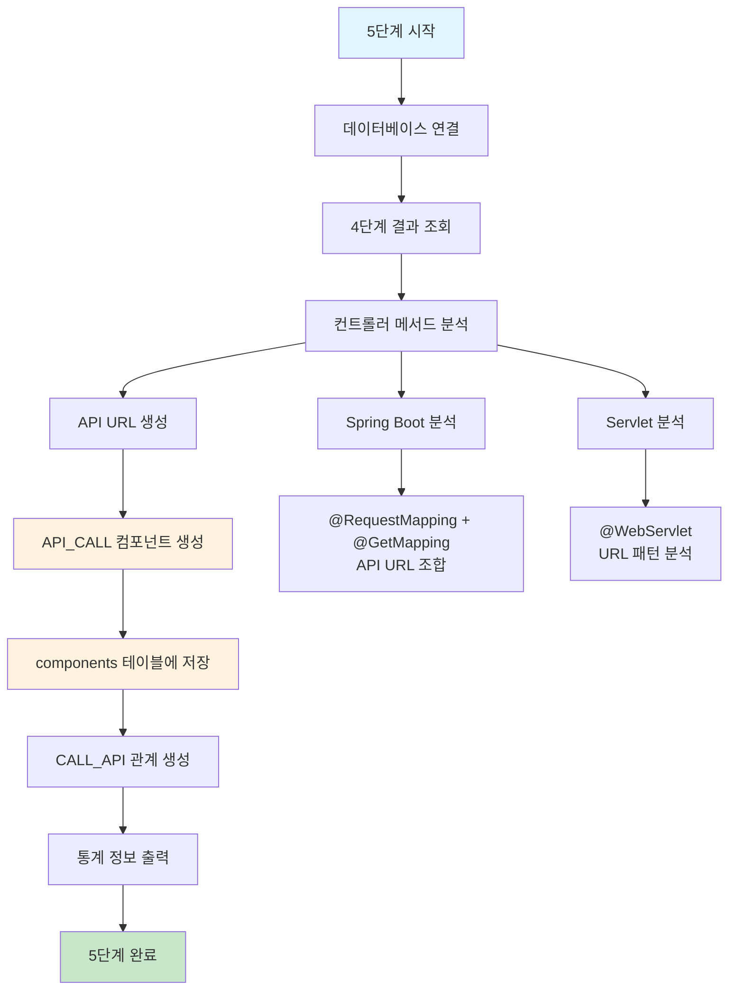

# 처리플로우 상세 - 5단계: API 매핑 정리 (단순화)

## 개요

**목적**: 4단계에서 분석된 Java 컨트롤러 정보를 바탕으로 API 매핑을 정리  
**핵심 기능**: 컨트롤러 메서드에서 API URL 추출, API_CALL 컴포넌트 생성  
**실행 함수**: `APIMappingLoadingEngine.execute_api_mapping()`  
**구현 상태**: 🔄 **개발 예정** (현재 미구현)  
**파일**: `api_mapping_loading.py` (5단계 메인 엔진)  
**단순화 설계**: api_components 테이블 제거, components 테이블에 API_CALL 통합  
**메모리 최적화**: 스트리밍 처리로 한 파일씩만 메모리에 로드하여 처리

## 처리 플로우 차트



## 5단계 실행 흐름

### 1. 데이터베이스 연결 (`execute_api_mapping`)

```python
def execute_api_mapping(self) -> bool:
```

**기능**:
- 프로젝트 메타데이터베이스 연결
- 4단계에서 분석된 컨트롤러 메서드 조회
- API 매핑 정리 시작

**처리 과정**:
1. 데이터베이스 연결 확인
2. 4단계 결과 조회 (컨트롤러 메서드)
3. API 매핑 분석 시작

### 2. 컨트롤러 메서드 조회

```python
def get_controller_methods(self, project_id: int) -> List[ControllerMethod]:
```

**기능**:
- 4단계에서 분석된 컨트롤러 메서드 조회
- Spring Boot, Servlet 등 다양한 프레임워크 지원

**SQL 쿼리**:
```sql
SELECT c.component_id, c.component_name, c.class_name, c.method_name, c.layer
FROM components c
WHERE c.project_id = ? 
  AND c.layer IN ('CONTROLLER', 'REST_CONTROLLER', 'SERVLET')
  AND c.component_type = 'METHOD'
  AND c.del_yn = 'N'
```

### 3. API URL 생성

```python
def build_api_url(self, method: ControllerMethod) -> str:
```

**기능**:
- @RequestMapping과 @GetMapping 조합으로 API URL 생성
- Spring Boot, Servlet 등 다양한 프레임워크 지원

**처리 과정**:
1. @RequestMapping 경로 추출
2. @GetMapping/@PostMapping 경로 추출
3. API URL 조합 생성

**예시**:
```java
@RequestMapping("/api")
@GetMapping("/user-profile")
// 결과: /api/user-profile
```

### 4. API_CALL 컴포넌트 생성

```python
def create_api_call_component(self, method: ControllerMethod, api_url: str) -> None:
```

**기능**:
- API_CALL 타입의 컴포넌트 생성
- components 테이블에 저장

**컴포넌트 데이터**:
```python
component_data = {
    'project_id': self.project_id,
    'file_id': method.file_id,
    'component_name': method.class_name,
    'component_type': 'API_CALL',
    'parent_id': None,
    'layer': method.layer,
    'line_start': method.line_start,
    'line_end': method.line_end,
    'api_url': api_url,
    'call_method': method.http_method,
    'class_name': method.class_name,
    'method_name': method.method_name
}
```

### 5. 관계 생성

```python
def create_api_relationships(self, api_calls: List[APICall]) -> None:
```

**기능**:
- API_CALL → METHOD 관계 생성
- relationships 테이블에 저장

**관계 데이터**:
```python
relationship_data = {
    'src_id': api_call.component_id,
    'dst_id': method.component_id,
    'rel_type': 'CALL_API',
    'confidence': 1.0
}
```

## 데이터베이스 스키마

### components 테이블 (API_CALL 타입)

| 컬럼명 | 데이터타입 | 설명 | 예시 |
|--------|------------|------|------|
| component_id | INTEGER | 컴포넌트 고유 ID | 1001 |
| project_id | INTEGER | 프로젝트 ID | 1 |
| file_id | INTEGER | 파일 ID | 201 |
| component_name | VARCHAR(200) | 컴포넌트명 | MicroserviceController |
| component_type | VARCHAR(20) | 컴포넌트 타입 | API_CALL |
| layer | VARCHAR(30) | 계층 | CONTROLLER |
| line_start | INTEGER | 시작 라인 | 19 |
| line_end | INTEGER | 종료 라인 | 26 |
| api_url | VARCHAR(500) | API URL | /api/user-profile |
| call_method | VARCHAR(10) | HTTP 메서드 | GET |
| class_name | VARCHAR(200) | 클래스명 | MicroserviceController |
| method_name | VARCHAR(200) | 메서드명 | getUserProfile |

### relationships 테이블

| 컬럼명 | 데이터타입 | 설명 | 예시 |
|--------|------------|------|------|
| relationship_id | INTEGER | 관계 고유 ID | 2001 |
| src_id | INTEGER | 소스 ID (API_CALL) | 1001 |
| dst_id | INTEGER | 대상 ID (METHOD) | 2001 |
| rel_type | VARCHAR(30) | 관계 타입 | CALL_API |
| confidence | FLOAT | 신뢰도 | 1.0 |

## 주요 개선사항

### 1. 단순화된 구조
- **기존**: api_components 테이블 + 복잡한 3단계 분석
- **개선**: components 테이블 통합 + 단순한 1단계 정리

### 2. 효율적인 처리
- **기존**: 중복 분석 (4단계에서 이미 분석된 것 재분석)
- **개선**: 기존 결과 활용 (4단계 결과를 API_CALL로 변환)

### 3. 명확한 역할
- **4단계**: Java 소스코드 분석 (컨트롤러 메서드 식별)
- **5단계**: API 매핑 정리 (API URL 생성 및 관계 설정)

## 설정 파일

### api_mapping_keyword.yaml

```yaml
# API 매핑 분석 키워드 설정
api_mapping:
  # HTTP 메서드 매핑
  http_methods:
    GET: "GET"
    POST: "POST"
    PUT: "PUT"
    DELETE: "DELETE"
    PATCH: "PATCH"
  
  # 기본 API 경로
  default_api_path: "/api"
  
  # 컨트롤러 계층 식별
  controller_layers:
    - "CONTROLLER"
    - "REST_CONTROLLER"
    - "SERVLET"
  
  # API URL 조합 규칙
  url_combination:
    request_mapping: "base_path"
    method_mapping: "method_path"
    separator: ""
```

## 통계 정보

### 처리 결과 통계

```python
def print_statistics(self, stats: Dict[str, Any]) -> None:
    """API 매핑 처리 통계 출력"""
    print(f"=== 5단계 API 매핑 정리 완료 ===")
    print(f"처리된 컨트롤러: {stats['total_controllers']}개")
    print(f"생성된 API_CALL: {stats['total_api_calls']}개")
    print(f"생성된 관계: {stats['total_relationships']}개")
    print(f"처리 시간: {stats['processing_time']:.2f}초")
```

## 에러 처리

### 예외 상황 처리

```python
def handle_error(self, error_message: str) -> None:
    """에러 처리 및 로깅"""
    logger.error(f"5단계 API 매핑 정리 실패: {error_message}")
    # 에러 발생 시 handle_error()로 exit
    handle_error(error_message)
```

### 주요 에러 상황
1. **데이터베이스 연결 실패**: 연결 정보 확인
2. **4단계 결과 없음**: 4단계 먼저 실행 필요
3. **API URL 생성 실패**: 컨트롤러 어노테이션 확인
4. **컴포넌트 생성 실패**: 데이터베이스 제약조건 확인

## 성능 최적화

### 메모리 최적화
- **스트리밍 처리**: 한 번에 하나의 컨트롤러만 메모리에 로드
- **배치 처리**: API_CALL 컴포넌트를 배치로 생성
- **캐시 활용**: 4단계 결과를 캐시하여 재사용

### 처리 속도 최적화
- **인덱스 활용**: components 테이블의 인덱스 활용
- **병렬 처리**: 여러 컨트롤러를 병렬로 처리
- **SQL 최적화**: 효율적인 쿼리 사용

## 검증 방법

### 1. API_CALL 컴포넌트 검증
```sql
-- API_CALL 컴포넌트 생성 확인
SELECT component_name, api_url, call_method, class_name, method_name
FROM components
WHERE component_type = 'API_CALL'
  AND project_id = 1;
```

### 2. 관계 생성 검증
```sql
-- CALL_API 관계 생성 확인
SELECT r.rel_type, c1.component_name as api_call, c2.component_name as method
FROM relationships r
JOIN components c1 ON r.src_id = c1.component_id
JOIN components c2 ON r.dst_id = c2.component_id
WHERE r.rel_type = 'CALL_API';
```

### 3. 통계 검증
```sql
-- API 매핑 통계 확인
SELECT 
    COUNT(*) as total_api_calls,
    COUNT(DISTINCT class_name) as total_controllers,
    COUNT(DISTINCT api_url) as unique_api_urls
FROM components
WHERE component_type = 'API_CALL'
  AND project_id = 1;
```

## 관련 문서

- [메타데이터베이스 스키마 정의서 v3.0](../메타데이터베이스스키마정의서.md)
- [4단계 Java 소스코드 분석](../처리플로우_상세_4단계_Java소스코드분석및관계생성.md)
- [API 매핑 사례 분석](../API_매핑_사례_분석.md)

이 문서는 기존의 복잡한 API 진입점 분석을 단순화하여 효율적이고 명확한 API 매핑 정리 기능을 제공합니다.
