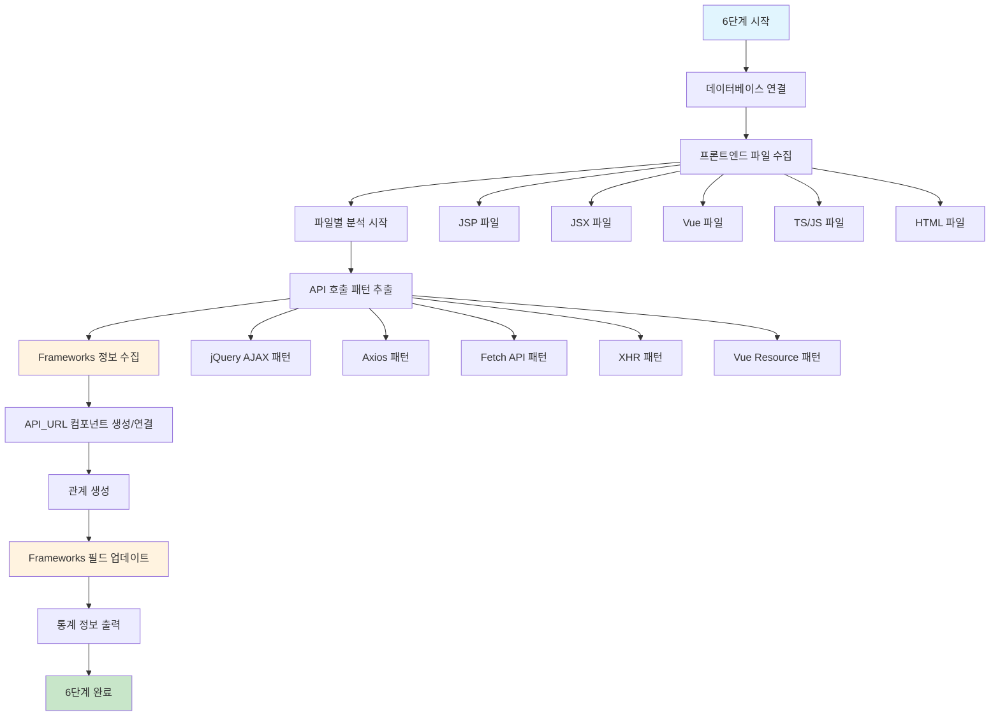

# 처리플로우 상세 - 6단계: 프론트엔드 파일 분석 및 연관관계 구축

## 개요

**목적**: 모든 프론트엔드 파일(JSP, JSX, Vue, TS, JS, HTML)을 분석하고 API 호출 관계 구축  
**핵심 기능**: 범용 프론트엔드 지원 및 frameworks 사용 현황 추적  
**실행 함수**: `execute_frontend_loading()`  
**구현 상태**: ✅ **구현 완료**  
**파일**: `frontend_loading.py` (통합 엔진), `parser/frontend_parser.py` (파싱 로직)  
**메모리 최적화**: 스트리밍 처리로 한 파일씩만 메모리에 로드하여 처리  
**frameworks 추적**: 각 파일에서 사용된 프론트엔드 기술 스택 자동 수집  

## 지원하는 프론트엔드 기술 스택

### 📱 **지원 파일 타입**

| 파일 타입 | 확장자 | 설명 | 주요 사용처 |
|-----------|--------|------|-------------|
| **JSP** | `.jsp` | Java Server Pages | 전통적인 Java 웹 애플리케이션 |
| **JSX** | `.jsx` | React JavaScript | React 컴포넌트 (JavaScript) |
| **TSX** | `.tsx` | React TypeScript | React 컴포넌트 (TypeScript) |
| **Vue** | `.vue` | Vue.js 컴포넌트 | Vue.js 단일 파일 컴포넌트 |
| **TypeScript** | `.ts` | TypeScript | 타입 안전성이 보장된 JavaScript |
| **JavaScript** | `.js` | JavaScript | 순수 JavaScript |
| **HTML** | `.html` | HTML | 정적 웹 페이지 |

### 🌐 **지원하는 HTTP 클라이언트 Frameworks**

#### **1. jQuery AJAX** 
**설명**: 전통적인 JavaScript 라이브러리의 AJAX 기능  
**특징**: 간단한 API, 크로스 브라우저 호환성  
**사용처**: 레거시 웹 애플리케이션, JSP 기반 프로젝트  

**샘플 소스**:
```javascript
// jQuery AJAX - GET 요청
$.ajax({
    url: '/api/users',
    method: 'GET',
    success: function(data) {
        console.log('사용자 목록:', data);
    },
    error: function(xhr, status, error) {
        console.error('에러 발생:', error);
    }
});

// jQuery 단축 메서드
$.get('/api/users/123', function(user) {
    console.log('사용자 정보:', user);
});

$.post('/api/users', {
    name: '홍길동',
    email: 'hong@example.com'
}, function(result) {
    console.log('생성 결과:', result);
});

// JSON 전용 요청
$.getJSON('/api/products', function(products) {
    console.log('상품 목록:', products);
});
```

#### **2. Axios**
**설명**: Promise 기반의 현대적인 HTTP 클라이언트  
**특징**: Promise 지원, 요청/응답 인터셉터, 자동 JSON 변환  
**사용처**: React, Vue.js 등 현대적인 SPA  

**샘플 소스**:
```javascript
// Axios - GET 요청
axios.get('/api/users')
    .then(response => {
        console.log('사용자 목록:', response.data);
    })
    .catch(error => {
        console.error('에러 발생:', error);
    });

// Axios - POST 요청
axios.post('/api/users', {
    name: '홍길동',
    email: 'hong@example.com'
})
.then(response => {
    console.log('생성 결과:', response.data);
});

// Axios - 설정 객체 방식
axios({
    method: 'put',
    url: '/api/users/123',
    data: {
        name: '김철수',
        email: 'kim@example.com'
    }
})
.then(response => {
    console.log('업데이트 결과:', response.data);
});

// async/await 사용
async function fetchUsers() {
    try {
        const response = await axios.get('/api/users');
        return response.data;
    } catch (error) {
        console.error('사용자 조회 실패:', error);
    }
}
```

#### **3. Fetch API**
**설명**: 브라우저 내장 HTTP 클라이언트 (ES6+)  
**특징**: Promise 기반, 스트림 지원, 모던 브라우저 표준  
**사용처**: 모던 웹 애플리케이션, 외부 라이브러리 없이 사용  

**샘플 소스**:
```javascript
// Fetch - GET 요청
fetch('/api/users')
    .then(response => response.json())
    .then(users => {
        console.log('사용자 목록:', users);
    })
    .catch(error => {
        console.error('에러 발생:', error);
    });

// Fetch - POST 요청
fetch('/api/users', {
    method: 'POST',
    headers: {
        'Content-Type': 'application/json'
    },
    body: JSON.stringify({
        name: '홍길동',
        email: 'hong@example.com'
    })
})
.then(response => response.json())
.then(result => {
    console.log('생성 결과:', result);
});

// async/await 사용
async function createUser(userData) {
    try {
        const response = await fetch('/api/users', {
            method: 'POST',
            headers: {
                'Content-Type': 'application/json'
            },
            body: JSON.stringify(userData)
        });
        
        if (!response.ok) {
            throw new Error(`HTTP error! status: ${response.status}`);
        }
        
        return await response.json();
    } catch (error) {
        console.error('사용자 생성 실패:', error);
    }
}
```

#### **4. XMLHttpRequest (XHR)**
**설명**: 전통적인 브라우저 내장 HTTP 클라이언트  
**특징**: 모든 브라우저 지원, 세밀한 제어 가능  
**사용처**: 레거시 코드, 특별한 요구사항이 있는 경우  

**샘플 소스**:
```javascript
// XMLHttpRequest - GET 요청
const xhr = new XMLHttpRequest();
xhr.open('GET', '/api/users');
xhr.onreadystatechange = function() {
    if (xhr.readyState === 4 && xhr.status === 200) {
        const users = JSON.parse(xhr.responseText);
        console.log('사용자 목록:', users);
    }
};
xhr.send();

// XMLHttpRequest - POST 요청
const postXhr = new XMLHttpRequest();
postXhr.open('POST', '/api/users');
postXhr.setRequestHeader('Content-Type', 'application/json');
postXhr.onreadystatechange = function() {
    if (postXhr.readyState === 4 && postXhr.status === 201) {
        const result = JSON.parse(postXhr.responseText);
        console.log('생성 결과:', result);
    }
};
postXhr.send(JSON.stringify({
    name: '홍길동',
    email: 'hong@example.com'
}));

// 파일 업로드 예시
function uploadFile(file) {
    const formData = new FormData();
    formData.append('file', file);
    
    const xhr = new XMLHttpRequest();
    xhr.open('POST', '/api/upload');
    xhr.upload.onprogress = function(e) {
        if (e.lengthComputable) {
            const percentComplete = (e.loaded / e.total) * 100;
            console.log('업로드 진행률:', percentComplete + '%');
        }
    };
    xhr.onload = function() {
        if (xhr.status === 200) {
            console.log('업로드 완료:', xhr.responseText);
        }
    };
    xhr.send(formData);
}
```

#### **5. Vue Resource**
**설명**: Vue.js 전용 HTTP 클라이언트 (현재는 Axios 권장)  
**특징**: Vue 인스턴스에 통합, 간단한 API  
**사용처**: 구버전 Vue.js 프로젝트  

**샘플 소스**:
```javascript
// Vue Resource 사용 예시
export default {
    data() {
        return {
            users: []
        }
    },
    methods: {
        // GET 요청
        async fetchUsers() {
            try {
                const response = await this.$http.get('/api/users');
                this.users = response.body;
            } catch (error) {
                console.error('사용자 조회 실패:', error);
            }
        },
        
        // POST 요청
        async createUser(userData) {
            try {
                const response = await this.$http.post('/api/users', userData);
                console.log('생성 결과:', response.body);
                this.fetchUsers(); // 목록 새로고침
            } catch (error) {
                console.error('사용자 생성 실패:', error);
            }
        },
        
        // PUT 요청
        async updateUser(userId, userData) {
            try {
                const response = await this.$http.put(`/api/users/${userId}`, userData);
                console.log('업데이트 결과:', response.body);
            } catch (error) {
                console.error('사용자 업데이트 실패:', error);
            }
        },
        
        // DELETE 요청
        async deleteUser(userId) {
            try {
                await this.$http.delete(`/api/users/${userId}`);
                console.log('사용자 삭제 완료');
                this.fetchUsers(); // 목록 새로고침
            } catch (error) {
                console.error('사용자 삭제 실패:', error);
            }
        }
    }
}
```

## 처리 플로우 차트



## 6단계 실행 흐름

### 1. 프론트엔드 파일 수집

```python
def _get_frontend_files(self, project_id: int) -> List[Dict[str, Any]]:
    """프론트엔드 파일 목록 조회"""
    query = """
        SELECT file_id, file_name, file_path, file_type
        FROM files 
        WHERE project_id = ? 
          AND file_type IN ('JSP', 'JSX', 'VUE', 'TS', 'TSX', 'JS', 'HTML')
          AND del_yn = 'N'
        ORDER BY file_type, file_name
    """
```

### 2. API 호출 패턴 분석

```python
def parse_frontend_file(self, file_path: str, file_type: str) -> Dict[str, Any]:
    """프론트엔드 파일 분석 및 API 호출 추출"""
    
    # 파일 타입별 분석
    if file_type.upper() == 'HTML':
        return self._parse_html_file(content, file_name)
    elif file_type.upper() in ['JS', 'JSX', 'TS', 'TSX', 'VUE']:
        return self._parse_javascript_file(content, file_name, file_type)
    elif file_type.upper() == 'JSP':
        return self._parse_jsp_file(content, file_name)
```

### 3. Frameworks 정보 수집 및 저장

```python
def _save_api_call_relationships_to_database(self, api_calls: List[Dict[str, Any]], 
                                           project_id: int, file_type: str) -> None:
    """API 호출 관계 저장 및 frameworks 수집"""
    
    # 현재 파일에서 사용된 프레임워크들 수집
    frameworks_in_file = set()
    
    for api_call in api_calls:
        # 프레임워크 정보 수집
        framework = api_call.get('framework')
        if framework:
            frameworks_in_file.add(framework.lower())
    
    # 파일의 frameworks 필드 업데이트
    if frameworks_in_file and self.current_file_id:
        self._update_file_frameworks(frameworks_in_file)
```

### 4. API_URL 컴포넌트 생성/연결

```python
def _find_or_create_api_url_component(self, api_call: Dict[str, Any], 
                                    project_id: int, file_type: str) -> Optional[int]:
    """API_URL 컴포넌트 찾기 또는 생성 (기존 API_URL의 file_id 갱신 방식)"""
    
    # 1. 기존 API_URL 컴포넌트 찾기 (Java든 프론트엔드든 상관없이)
    existing_api = self.db_utils.execute_query(existing_api_query, (project_id, component_name))
    
    # 2. 기존 API_URL이 있으면 file_id를 현재 프론트엔드 파일로 갱신
    if existing_api:
        if self._update_api_url_file_id(api_id, self.current_file_id):
            debug(f"기존 API_URL file_id 갱신: {component_name}")
            return api_id
    
    # 3. 기존 API_URL이 없으면 새로 생성
    return self._create_frontend_api_url_component(api_call, project_id, component_name)
```

## 데이터베이스 스키마

### files 테이블 (frameworks 필드 추가)

| 컬럼명 | 데이터타입 | 설명 | 예시 |
|--------|------------|------|------|
| file_id | INTEGER | 파일 고유 ID | 201 |
| file_name | VARCHAR(200) | 파일명 | UserList.jsx |
| file_type | VARCHAR(20) | 파일 타입 | JSX |
| **frameworks** | **VARCHAR(100)** | **사용된 프레임워크** | **'axios, fetch'** |

**frameworks 필드 특징**:
- ✅ **중복 제거**: 같은 프레임워크는 한 번만 저장
- ✅ **정렬**: 알파벳 순으로 정렬하여 저장
- ✅ **소문자 변환**: 일관성을 위해 모두 소문자로 저장
- ✅ **컴마 구분**: 여러 프레임워크는 ', '로 구분

**예시 데이터**:
```sql
INSERT INTO files (file_name, file_type, frameworks) VALUES
('UserList.jsx', 'JSX', 'axios, fetch'),
('ProductView.vue', 'VUE', 'axios'),
('OrderForm.jsp', 'JSP', 'jquery'),
('ApiClient.js', 'JS', 'axios, fetch, xhr'),
('Dashboard.html', 'HTML', 'jquery, fetch');
```

### components 테이블 (API_URL 타입)

| 컬럼명 | 데이터타입 | 설명 | 예시 |
|--------|------------|------|------|
| component_id | INTEGER | 컴포넌트 고유 ID | 1001 |
| project_id | INTEGER | 프로젝트 ID | 1 |
| file_id | INTEGER | 프론트엔드 파일 ID | 201 |
| component_name | VARCHAR(200) | API URL:HTTP_METHOD | /api/users:GET |
| component_type | VARCHAR(20) | 컴포넌트 타입 | API_URL |
| layer | VARCHAR(30) | 계층 | API_ENTRY |

## 통계 정보 출력

### 기본 통계
```
=== 프론트엔드 파일 로딩 통계 ===
총 파일: 25개
처리 완료: 23개
에러 파일: 2개
JSP 파일: 8개
JSX 파일: 5개
Vue 파일: 3개
TS 파일: 4개
TSX 파일: 2개
JS 파일: 7개
HTML 파일: 2개
생성된 컴포넌트: 15개
발견된 API 호출: 42개
생성된 관계: 38개
```

### Frameworks 사용 현황
```
=== 프론트엔드 Frameworks 사용 현황 ===
  JSP 파일:
    jquery: 5개 파일
    jquery, axios: 2개 파일
    fetch: 1개 파일
  JSX 파일:
    axios: 3개 파일
    fetch: 2개 파일
  JS 파일:
    jquery: 4개 파일
    axios, fetch: 2개 파일
    xhr: 1개 파일
  사용된 프레임워크: axios, fetch, jquery, xhr
```

## 주요 개선사항

### 1. 범용 프론트엔드 지원
- ✅ **7가지 파일 타입**: JSP, JSX, TSX, Vue, TS, JS, HTML
- ✅ **5가지 HTTP 클라이언트**: jQuery, Axios, Fetch, XHR, Vue Resource
- ✅ **통합 처리**: 하나의 엔진으로 모든 프론트엔드 기술 지원

### 2. Frameworks 추적 시스템
- ✅ **자동 수집**: API 호출 분석 시 프레임워크 정보 자동 추출
- ✅ **중복 제거**: 파일별로 사용된 프레임워크만 저장
- ✅ **통계 제공**: 프로젝트 전체 기술 스택 현황 파악

### 3. 메모리 최적화
- ✅ **스트리밍 처리**: 한 번에 하나의 파일만 메모리에 로드
- ✅ **즉시 해제**: 처리 완료 후 즉시 메모리에서 해제
- ✅ **배치 처리**: API_URL 컴포넌트를 배치로 생성

### 4. 완전한 연관관계 구축
```
프론트엔드 파일 → API_URL → METHOD → SQL → TABLE
```

## 검증 방법

### 1. Frameworks 필드 검증
```sql
-- Frameworks 사용 현황 조회
SELECT file_type, frameworks, COUNT(*) as file_count
FROM files 
WHERE project_id = 1 
  AND frameworks IS NOT NULL 
  AND frameworks != ''
GROUP BY file_type, frameworks
ORDER BY file_type, frameworks;
```

### 2. API_URL 컴포넌트 검증
```sql
-- 프론트엔드 API_URL 컴포넌트 확인
SELECT c.component_name, f.file_name, f.file_type, f.frameworks
FROM components c
JOIN files f ON c.file_id = f.file_id
WHERE c.component_type = 'API_URL'
  AND f.file_type IN ('JSP', 'JSX', 'VUE', 'TS', 'TSX', 'JS', 'HTML')
  AND c.project_id = 1;
```

### 3. 연관관계 검증
```sql
-- 프론트엔드 → 백엔드 호출 체인 확인
SELECT 
    f.file_name as frontend_file,
    f.frameworks,
    c1.component_name as api_url,
    c2.component_name as backend_method
FROM files f
JOIN components c1 ON f.file_id = c1.file_id
JOIN relationships r ON c1.component_id = r.src_id
JOIN components c2 ON r.dst_id = c2.component_id
WHERE c1.component_type = 'API_URL'
  AND c2.component_type = 'METHOD'
  AND r.rel_type = 'CALL_METHOD'
  AND f.project_id = 1;
```

## 관련 문서

- [메타데이터베이스 스키마 정의서](./02_데이터베이스_스키마_정의서.md)
- [5단계 API 매핑 구현서](./08_5단계_API_매핑_구현서.md)
- [처리 플로우 개요](./03_처리_플로우_개요.md)

이 문서는 모든 프론트엔드 기술을 통합 지원하고 frameworks 사용 현황을 추적하는 포괄적인 프론트엔드 분석 시스템을 제공합니다.
