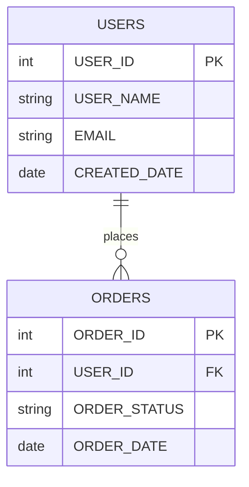

# 7단계: 리포트 생성 구현서

## 개요

**목적**: 메타데이터베이스의 분석 결과를 다양한 형태의 리포트로 생성하여 개발자와 아키텍트에게 직관적인 정보 제공  
**핵심 기능**: CallChain, Architecture, ERD, ERD(Dagre) 리포트 생성  
**실행 함수**: `ReportUtils.generate_all_reports()`  
**구현 상태**: ✅ **구현 완료**  
**파일**: `reports/` 디렉토리의 각종 리포트 생성기  
**특징**: HTML 기반 인터랙티브 리포트, 오프라인 환경 지원  

## 리포트 종류

### 1. CallChain Report
**파일**: `callchain_report_generator.py`  
**목적**: 프론트엔드부터 데이터베이스까지의 전체 호출 체인 시각화  
**특징**:
- JSP → API_URL → METHOD → SQL/QUERY → TABLE 호출 체인 표시
- INFERRED 쿼리(QUERY 타입)와 XML 파싱 쿼리(SQL_* 타입) 구분 표시
- SqlContent.db 연동으로 정제된 SQL 쿼리 툴팁 제공
- 필터링 및 검색 기능

### 2. Architecture Report  
**파일**: `architecture_report_generator.py`  
**목적**: 시스템의 레이어별 아키텍처 구조 시각화  
**특징**:
- 레이어별 컴포넌트 구조 분석 (FRONTEND, CONTROLLER, SERVICE, DAO, DATA)
- 컴포넌트 간 관계 시각화 (Mermaid 다이어그램)
- 레이어별 통계 정보 제공

### 3. ERD Report
**파일**: `erd_report_generator.py`  
**목적**: 데이터베이스 구조 시각화 (Mermaid 기반)  
**특징**:
- 테이블과 컬럼 정보를 활용한 Mermaid ERD 생성
- 테이블 간 관계 시각화
- 오프라인 환경 지원 (Mermaid.js 로컬화)

### 4. ERD(Dagre) Report
**파일**: `erd_dagre_report_generator.py`  
**목적**: 고도화된 인터랙티브 ERD 생성  
**특징**:
- Cytoscape.js와 Dagre 레이아웃 사용
- 드래그 앤 드롭, 줌 인/아웃 등 인터랙티브 기능
- 테이블 클릭 시 상세 정보 표시

## 처리 플로우

```mermaid
flowchart TD
    A[7단계 리포트 생성 시작] --> B[프로젝트 정보 조회]
    B --> C[리포트 생성기 초기화]
    C --> D[CallChain Report 생성]
    D --> E[Architecture Report 생성]
    E --> F[ERD Report 생성]
    F --> G[ERD(Dagre) Report 생성]
    G --> H[리포트 파일 저장]
    H --> I[생성 완료 통지]
    
    D --> D1[호출 체인 데이터 조회]
    D1 --> D2[INFERRED 쿼리 처리]
    D2 --> D3[SQL 내용 툴팁 생성]
    D3 --> D4[HTML 리포트 생성]
    
    E --> E1[레이어별 컴포넌트 분석]
    E1 --> E2[관계 데이터 조회]
    E2 --> E3[Mermaid 다이어그램 생성]
    E3 --> E4[HTML 리포트 생성]
    
    F --> F1[테이블 정보 조회]
    F1 --> F2[컬럼 정보 조회]
    F2 --> F3[Mermaid ERD 생성]
    F3 --> F4[HTML 리포트 생성]
    
    G --> G1[테이블 정보 조회]
    G1 --> G2[컬럼 정보 조회]
    G2 --> G3[Cytoscape.js 노드 생성]
    G3 --> G4[Dagre 레이아웃 적용]
    G4 --> G5[인터랙티브 HTML 생성]
```

## INFERRED 쿼리 처리 개선

### CallChain Report에서의 INFERRED 쿼리 표시

**기존 문제**:
- INFERRED 쿼리와 XML 파싱 쿼리가 동일하게 표시됨
- 쿼리 타입이 `QUERY`로만 표시되어 구분이 어려움
- 실제 SQL 내용을 확인할 수 없음

**개선 방안**:

#### 1. 쿼리 타입 구분 표시
```python
def _convert_query_type(self, component_type: str, component_data: Dict[str, Any] = None) -> str:
    """컴포넌트 타입을 쿼리 타입으로 변환"""
    if component_type.startswith('SQL_'):
        return component_type[4:]  # SQL_ 제거 (SELECT, INSERT, UPDATE, DELETE)
    elif component_type == 'QUERY':
        # INFERRED 쿼리임을 명확히 표시
        return 'INFERRED_QUERY'
    elif component_type == 'CALCULATION_ONLY':
        return 'NO-QUERY'
    return component_type
```

#### 2. INFERRED 쿼리 툴팁 정보
```html
<span class="callchain-badge query-type tooltip inferred-query" 
      data-query="INFERRED_QUERY"
      data-java-file="UserDao.java"
      data-java-method="findUsersByConditionAnsi"
      data-java-line="45">
    INFERRED_QUERY
    <span class="tooltiptext">
        자바에서 추론된 쿼리
        파일: UserDao.java
        메서드: findUsersByConditionAnsi
        라인: 45
        SQL: mapper.findUsersWithAnsiJoin(searchDto)
    </span>
</span>
```

#### 3. SQL 내용 압축 해제 및 표시
```python
def _get_sql_content_for_inferred_query(self, component_id: int) -> str:
    """INFERRED 쿼리의 SQL 내용 조회 및 압축 해제"""
    try:
        # SqlContent.db에서 압축된 SQL 내용 조회
        query = """
            SELECT sql_content_compressed, line_start, line_end
            FROM sql_contents 
            WHERE component_id = ? AND del_yn = 'N'
        """
        
        results = self.sql_content_db.execute_query(query, (component_id,))
        
        if results and len(results) > 0:
            compressed_content = results[0]['sql_content_compressed']
            line_start = results[0]['line_start']
            line_end = results[0]['line_end']
            
            # gzip 압축 해제
            decompressed_content = gzip.decompress(compressed_content).decode('utf-8')
            
            return f"라인 {line_start}-{line_end}:\n{decompressed_content}"
        
        return "SQL 내용을 찾을 수 없습니다."
        
    except Exception as e:
        error(f"INFERRED 쿼리 SQL 내용 조회 실패: {component_id} - {str(e)}")
        return "SQL 내용 조회 중 오류가 발생했습니다."
```

## 리포트 생성기별 상세 기능

### CallChain Report Generator

**주요 기능**:
1. **호출 체인 데이터 조회**: JSP부터 TABLE까지의 전체 호출 체인
2. **INFERRED 쿼리 처리**: QUERY 타입과 SQL_* 타입 구분 처리
3. **SQL 내용 툴팁**: SqlContent.db 연동으로 실제 SQL 내용 표시
4. **필터링 기능**: 파일명, 쿼리 타입별 필터링
5. **통계 정보**: 전체 호출 체인 수, 쿼리 타입별 분포

**핵심 SQL 쿼리**:
```sql
-- 호출 체인 데이터 조회 (INFERRED 쿼리 포함)
SELECT 
    ROW_NUMBER() OVER (ORDER BY frontend_file.file_name, api_url.component_name) as chain_id,
    frontend_file.file_name as jsp_file,
    api_url.component_name as api_entry,
    cls.class_name as class_name,
    method.component_name as method_name,
    CASE 
        WHEN sql.inferred_source = 'JAVA_CALL' THEN 
            CONCAT(sql.java_file_name, ' (', sql.java_class_name, '.', sql.java_method_name, ')')
        ELSE xml_file.file_name 
    END as xml_file,
    sql.component_name as query_id,
    CASE 
        WHEN sql.component_type = 'QUERY' AND sql.inferred_source = 'JAVA_CALL' THEN 'INFERRED_QUERY'
        ELSE sql.component_type 
    END as query_type,
    GROUP_CONCAT(DISTINCT t.table_name) as related_tables
FROM components api_url
JOIN files frontend_file ON api_url.file_id = frontend_file.file_id
JOIN relationships r1 ON api_url.component_id = r1.src_id AND r1.rel_type = 'CALL_METHOD'
JOIN components method ON r1.dst_id = method.component_id
JOIN classes cls ON method.parent_id = cls.class_id
JOIN relationships r2 ON method.component_id = r2.src_id AND r2.rel_type = 'CALL_QUERY'
JOIN components sql ON r2.dst_id = sql.component_id
LEFT JOIN files xml_file ON sql.file_id = xml_file.file_id
LEFT JOIN relationships r3 ON sql.component_id = r3.src_id AND r3.rel_type = 'USE_TABLE'
LEFT JOIN tables t ON r3.dst_id = t.component_id
WHERE api_url.component_type = 'API_URL'
  AND method.component_type = 'METHOD'
  AND (sql.component_type LIKE 'SQL_%' OR sql.component_type = 'QUERY')
  AND api_url.del_yn = 'N'
  AND method.del_yn = 'N'
  AND sql.del_yn = 'N'
GROUP BY frontend_file.file_name, api_url.component_name, cls.class_name, 
         method.component_name, xml_file.file_name, sql.component_name, sql.component_type
```

### Architecture Report Generator

**주요 기능**:
1. **레이어별 컴포넌트 분석**: FRONTEND, CONTROLLER, SERVICE, DAO, DATA 레이어별 분류
2. **관계 시각화**: Mermaid 다이어그램으로 컴포넌트 간 관계 표시
3. **통계 정보**: 레이어별 컴포넌트 수, 관계 수 통계
4. **오프라인 지원**: 로컬 Mermaid.js 라이브러리 사용

**레이어 분류 기준**:
- **FRONTEND**: JSP 파일, API_URL 컴포넌트
- **CONTROLLER**: layer = 'CONTROLLER'인 클래스
- **SERVICE**: layer = 'SERVICE'인 클래스  
- **DAO**: layer = 'DAO'인 클래스
- **DATA**: SQL_* 타입, QUERY 타입, TABLE 타입 컴포넌트

### ERD Report Generator

**주요 기능**:
1. **테이블 정보 조회**: tables 테이블에서 테이블 정보 추출
2. **컬럼 정보 조회**: columns 테이블에서 컬럼 정보 추출
3. **Mermaid ERD 생성**: 테이블과 컬럼을 Mermaid ERD 문법으로 변환
4. **오프라인 지원**: 로컬 Mermaid.js 라이브러리 사용

**Mermaid ERD 문법**:


### ERD(Dagre) Report Generator

**주요 기능**:
1. **Cytoscape.js 노드 생성**: 테이블과 컬럼을 Cytoscape 노드로 변환
2. **Dagre 레이아웃**: 자동 레이아웃으로 테이블 배치
3. **인터랙티브 기능**: 드래그 앤 드롭, 줌 인/아웃, 테이블 클릭 시 상세 정보
4. **오프라인 지원**: 로컬 Cytoscape.js, Dagre 라이브러리 사용

**Cytoscape 노드 구조**:
```javascript
{
    data: {
        id: 'table_USERS',
        label: 'USERS',
        type: 'table',
        columns: [
            { name: 'USER_ID', type: 'int', pk: true },
            { name: 'USER_NAME', type: 'string', pk: false },
            { name: 'EMAIL', type: 'string', pk: false }
        ]
    }
}
```

## 리포트 템플릿 시스템

### ReportTemplates 클래스

**위치**: `reports/report_templates.py`  
**기능**: 모든 리포트의 HTML 템플릿 제공

**주요 템플릿**:
1. **기본 HTML 구조**: DOCTYPE, head, body 기본 구조
2. **CallChain 테이블**: 호출 체인 데이터를 표 형태로 표시
3. **Architecture 다이어그램**: Mermaid 다이어그램 삽입
4. **ERD 다이어그램**: Mermaid ERD 삽입
5. **ERD(Dagre) 인터랙티브**: Cytoscape.js 인터랙티브 다이어그램

### ERDDagreTemplates 클래스

**위치**: `reports/erd_dagre_templates.py`  
**기능**: ERD(Dagre) 리포트 전용 템플릿 제공

**특징**:
- Cytoscape.js 초기화 코드
- Dagre 레이아웃 설정
- 노드 스타일링 (테이블, 컬럼, 관계)
- 인터랙티브 기능 (클릭, 드래그, 줌)

## 리포트 파일 구조

```
reports/
├── __init__.py                          # 리포트 모듈 초기화
├── architecture_report_generator.py     # Architecture 리포트 생성기
├── callchain_report_generator.py        # CallChain 리포트 생성기
├── erd_report_generator.py              # ERD 리포트 생성기
├── erd_dagre_report_generator.py        # ERD(Dagre) 리포트 생성기
├── report_templates.py                  # 공통 리포트 템플릿
├── erd_dagre_templates.py               # ERD(Dagre) 전용 템플릿
├── css/
│   └── woori.css                        # 리포트 스타일시트
├── js/
│   ├── cytoscape.min.js                 # Cytoscape.js 라이브러리
│   ├── cytoscape-dagre.js               # Cytoscape Dagre 확장
│   ├── cytoscape-fcose.js               # Cytoscape fCoSE 레이아웃
│   ├── dagre.min.js                     # Dagre 레이아웃 라이브러리
│   ├── jquery-3.6.0.min.js              # jQuery 라이브러리
│   └── jquery.qtip.min.js               # jQuery 툴팁 플러그인
└── sample_report/                       # 샘플 리포트 파일들
    ├── CallChainReport_*.html
    ├── architecture_mermaid_*.html
    ├── ERD_*.html
    └── erd_cytoscape_*.html
```

## 리포트 생성 실행

### ReportUtils.generate_all_reports()

**위치**: `util/report_utils.py`  
**기능**: 모든 리포트를 일괄 생성

**실행 순서**:
1. CallChain Report 생성
2. Architecture Report 생성  
3. ERD Report 생성
4. ERD(Dagre) Report 생성

**사용 예시**:
```python
from util.report_utils import ReportUtils

# 모든 리포트 생성
ReportUtils.generate_all_reports('SampleSrc', './reports/sample_report/')
```

## 오류 처리

### 리포트 생성 오류

1. **데이터베이스 연결 오류**: 메타데이터베이스 연결 실패
2. **SqlContent.db 연결 오류**: SQL 내용 조회 실패
3. **템플릿 파일 오류**: HTML 템플릿 파일 읽기 실패
4. **라이브러리 파일 오류**: CSS/JS 라이브러리 파일 누락
5. **파일 쓰기 오류**: 리포트 HTML 파일 생성 실패

### 오류 처리 방식

```python
try:
    # 리포트 생성 로직
    report_content = self._generate_report_content()
    self._save_report_file(report_content)
    
except Exception as e:
    handle_error(e, f"리포트 생성 실패: {self.report_type}")
    return False
```

## 성능 최적화

### 1. 데이터베이스 쿼리 최적화
- **인덱스 활용**: 자주 조회되는 컬럼 조합에 인덱스 생성
- **배치 처리**: 대량 데이터는 배치 단위로 처리
- **연결 풀**: 데이터베이스 연결 재사용

### 2. 메모리 최적화
- **스트리밍 처리**: 대용량 리포트는 스트리밍으로 생성
- **즉시 해제**: 사용 완료된 데이터는 즉시 메모리 해제
- **압축 저장**: SQL 내용은 gzip 압축으로 저장

### 3. 파일 I/O 최적화
- **로컬 라이브러리**: CDN 의존성 제거로 오프라인 지원
- **캐시 활용**: 변경되지 않은 데이터는 캐시 활용
- **병렬 처리**: 독립적인 리포트는 병렬 생성

## 확장성

### 새로운 리포트 타입 추가

1. **리포트 생성기 클래스 생성**: 새로운 리포트 생성기 클래스 작성
2. **템플릿 추가**: 해당 리포트용 HTML 템플릿 작성
3. **ReportUtils 수정**: `generate_all_reports()`에 새로운 리포트 추가
4. **메인 로직 수정**: 리포트 생성 호출 부분 수정

### 새로운 시각화 라이브러리 추가

1. **라이브러리 파일 추가**: `reports/js/` 디렉토리에 라이브러리 파일 추가
2. **템플릿 수정**: HTML 템플릿에 라이브러리 로드 코드 추가
3. **초기화 코드 작성**: 라이브러리 초기화 및 설정 코드 작성

## 사용 가이드

### 리포트 생성 실행

```bash
# 메타데이터 생성 후 리포트 생성
cd CreateMetaDb
python main.py --project-name SampleSrc
python -c "from util.report_utils import ReportUtils; ReportUtils.generate_all_reports('SampleSrc', './reports/sample_report/')"
```

### 리포트 확인

생성된 리포트는 `reports/sample_report/` 디렉토리에서 확인할 수 있습니다:

- **CallChainReport_*.html**: 호출 체인 리포트
- **architecture_mermaid_*.html**: 아키텍처 리포트
- **ERD_*.html**: ERD 리포트 (Mermaid)
- **erd_cytoscape_*.html**: ERD 리포트 (Dagre)

## 통계 정보

### 리포트 생성 통계

- **처리 시간**: 각 리포트별 생성 시간
- **파일 크기**: 생성된 HTML 파일 크기
- **데이터 수**: 처리된 컴포넌트, 관계 수
- **오류 수**: 생성 과정에서 발생한 오류 수

### CallChain Report 통계

- **전체 호출 체인 수**: JSP부터 TABLE까지의 전체 체인 수
- **INFERRED 쿼리 수**: QUERY 타입으로 생성된 쿼리 수
- **XML 파싱 쿼리 수**: SQL_* 타입으로 생성된 쿼리 수
- **테이블 사용 수**: 사용된 테이블 수

이 7단계 리포트 생성 로직은 메타데이터베이스의 분석 결과를 다양한 형태의 직관적인 리포트로 변환하여 개발자와 아키텍트에게 시스템의 전체 구조와 호출 관계를 명확하게 보여주는 핵심 역할을 수행합니다. 특히 INFERRED 쿼리 처리 개선을 통해 끊어진 쿼리의 정확한 위치와 내용을 파악할 수 있어 시스템의 완성도를 크게 향상시킵니다.

## 📚 관련 문서

- **[메타데이터베이스스키마정의서.md](./02_데이터베이스_스키마_정의서.md)**: 데이터베이스 스키마 구조 상세
- **[07_4단계_Java_분석_구현서.md](./07_4단계_Java_분석_구현서.md)**: Java 분석 및 INFERRED 쿼리 처리 상세
- **[06_3단계_XML_분석_구현서.md](./06_3단계_XML_분석_구현서.md)**: XML 분석 및 SQL_* 타입 생성 상세
