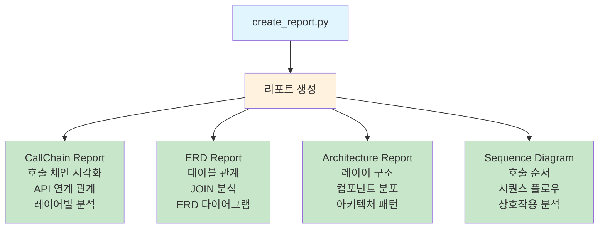
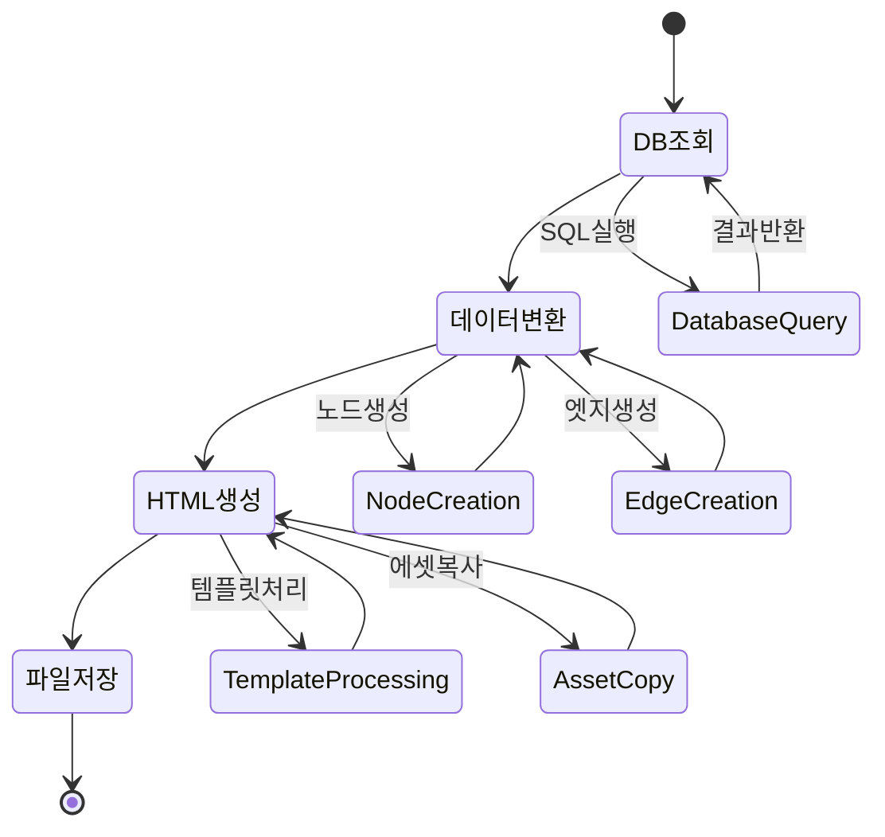

# SourceAnalyzer 리포트 생성 구현서

## 문서 목적

이 문서는 SourceAnalyzer 시스템의 **리포트 생성 기능**의 구현 상태와 사용법을 상세히 설명합니다.  
**대상 독자**: 개발자, 시스템 관리자  
**구현 상태**: ✅ **구현 완료**  

## 개요

SourceAnalyzer는 메타데이터 분석 결과를 다양한 형태의 시각적 리포트로 생성하는 기능을 제공합니다. HTML 기반의 인터랙티브 리포트를 통해 프로젝트의 구조와 관계를 직관적으로 파악할 수 있습니다.

## 리포트 생성 실행

### 명령어 형식

```bash
# 모든 리포트 생성
python create_report.py --project-name <프로젝트명>

# 특정 리포트만 생성
python create_report.py --project-name <프로젝트명> --report-type <리포트타입>

# 출력 디렉토리 지정
python create_report.py --project-name <프로젝트명> --output-dir <출력경로>
```

### 사용 예시

```bash
# SampleSrc 프로젝트의 모든 리포트 생성
python create_report.py --project-name SampleSrc

# CallChain 리포트만 생성
python create_report.py --project-name SampleSrc --report-type callchain

# ERD 리포트만 생성
python create_report.py --project-name SampleSrc --report-type erd

# 아키텍처 리포트만 생성
python create_report.py --project-name SampleSrc --report-type architecture
```

## 지원되는 리포트 타입



### 1. CallChain Report (`callchain`)

**목적**: 메서드 호출 체인 및 API 연계 관계 분석  
**파일명**: `[프로젝트명]_CallChainReport_[날짜시간].html`  
**주요 기능**:
- JSP → Method → SQL 호출 체인 시각화
- Frontend API → Backend API 연계 관계
- 레이어별 호출 관계 분석
- Cytoscape.js 기반 인터랙티브 그래프

**구현 파일**: `reports/callchain_report_generator.py`

### 2. ERD Report (`erd`, `erd-dagre`)

**목적**: 데이터베이스 ERD (Entity Relationship Diagram) 생성  
**파일명**: `[프로젝트명]_ERD_[날짜시간].html` / `[프로젝트명]_ERD_Dagre_[날짜시간].html`  
**주요 기능**:
- 테이블 간 관계 시각화
- JOIN 관계 분석 결과 표시
- 기본 레이아웃(`erd`) 및 Dagre 레이아웃(`erd-dagre`) 지원
- 테이블 상세 정보 표시 (컬럼, 데이터 타입, PK/FK)

**구현 파일**: 
- `reports/erd_report_generator.py` (기본)
- `reports/erd_dagre_report_generator.py` (Dagre 레이아웃)

### 3. Architecture Report (`architecture`, `architecture-layer`)

**목적**: 시스템 아키텍처 및 레이어 구조 분석  
**파일명**: `[프로젝트명]_ArchitectureReport_[날짜시간].html` / `[프로젝트명]_ArchitectureLayerDiagram_[날짜시간].html`  
**주요 기능**:
- 레이어별 컴포넌트 분포 분석
- Controller, Service, DAO, Entity 계층 구조
- 컴포넌트 간 의존성 관계
- 아키텍처 패턴 분석

**구현 파일**:
- `reports/architecture_report_generator.py` (기본)
- `reports/architecture_layer_report_generator.py` (레이어 중심)

### 4. Sequence Diagram Report (`sequence`)

**목적**: 시퀀스 다이어그램 기반 호출 순서 분석  
**파일명**: `[프로젝트명]_SequenceDiagram_[날짜시간].html`  
**주요 기능**:
- 메서드 호출 순서 시각화
- 레이어 간 상호작용 분석
- 다양한 다이어그램 타입 지원 (full_chain, method_call, layer_based, query_type)

**구현 파일**: `reports/sequence_diagram_report_generator.py`

## 리포트 구조

### 파일 구성

```
D:\Analyzer\CreateMetaDb\
├── create_report.py              # 리포트 생성 메인 실행 파일
├── reports/                      # 리포트 생성 모듈
│   ├── __init__.py
│   ├── callchain_report_generator.py       # CallChain 리포트
│   ├── erd_report_generator.py             # ERD 리포트 (기본)
│   ├── erd_dagre_report_generator.py       # ERD 리포트 (Dagre)
│   ├── architecture_report_generator.py   # 아키텍처 리포트 (기본)
│   ├── architecture_layer_report_generator.py  # 아키텍처 리포트 (레이어)
│   ├── sequence_diagram_report_generator.py    # 시퀀스 다이어그램
│   ├── report_templates.py                # 공통 템플릿
│   ├── erd_metadata_service.py            # ERD 메타데이터 서비스
│   ├── erd_dagre_templates.py             # ERD Dagre 템플릿
│   ├── css/                               # CSS 파일
│   │   └── woori.css
│   └── js/                                # JavaScript 라이브러리
│       ├── cytoscape.min.js
│       ├── cytoscape-dagre.js
│       ├── cytoscape-fcose.js
│       ├── dagre.min.js
│       ├── jquery-3.6.0.min.js
│       └── jquery.qtip.min.js
└── projects/[프로젝트명]/report/           # 리포트 출력 디렉토리
    ├── [프로젝트명]_CallChainReport_[날짜시간].html
    ├── [프로젝트명]_ERD_[날짜시간].html
    ├── [프로젝트명]_ArchitectureReport_[날짜시간].html
    └── ...
```

### 공통 기능

**모든 리포트 공통**:
- HTML5 기반 인터랙티브 리포트
- 반응형 디자인 (모바일 지원)
- 검색 및 필터링 기능
- 확대/축소, 패닝 지원
- 통계 정보 표시
- 에러 처리 및 로딩 상태 표시

**사용 라이브러리**:
- **Cytoscape.js**: 그래프 시각화
- **jQuery**: DOM 조작 및 이벤트 처리
- **Dagre**: 계층적 레이아웃
- **FCOSE**: 물리 기반 레이아웃

## 리포트 생성 과정



### 1. 데이터 수집

```python
# 메타데이터베이스에서 분석 데이터 조회
stats = self._get_statistics()           # 통계 정보
components = self._get_components()      # 컴포넌트 정보
relationships = self._get_relationships() # 관계 정보
```

### 2. 데이터 변환

```python
# 리포트별 데이터 구조로 변환
nodes = self._create_nodes(components)
edges = self._create_edges(relationships)
layout_data = self._prepare_layout_data(nodes, edges)
```

### 3. HTML 생성

```python
# 템플릿 기반 HTML 생성
html_content = self._generate_html(stats, layout_data)
```

### 4. 파일 저장

```python
# 타임스탬프 포함 파일명으로 저장
output_file = self._save_report(html_content)
```

## 설정 및 커스터마이징

### 리포트 설정

리포트 생성 시 다음 설정들을 조정할 수 있습니다:

**레이아웃 설정**:
- 노드 간격, 계층 분리
- 색상 스키마, 폰트 크기
- 애니메이션 효과

**필터링 설정**:
- 표시할 컴포넌트 타입
- 관계 타입별 표시/숨김
- 신뢰도 임계값

### 확장 가능성

**새로운 리포트 타입 추가**:
1. `reports/` 디렉토리에 새 생성기 클래스 작성
2. `BaseReportGenerator` 상속
3. `create_report.py`에 새 리포트 타입 등록

**템플릿 커스터마이징**:
- `reports/report_templates.py` 수정
- CSS/JS 파일 추가 또는 수정
- 새로운 시각화 라이브러리 통합

## 성능 최적화

### 대용량 프로젝트 지원

**메모리 최적화**:
- 배치 처리로 메모리 사용량 제한
- 불필요한 데이터 조기 해제
- 스트리밍 방식의 데이터 처리

**렌더링 최적화**:
- 가상화된 노드 렌더링
- 레벨 오브 디테일(LOD) 적용
- 비동기 데이터 로딩

## 문제 해결

### 일반적인 문제

**1. 리포트 생성 실패**
- 메타데이터베이스 존재 여부 확인
- 프로젝트 분석 완료 여부 확인
- 출력 디렉토리 권한 확인

**2. 브라우저에서 리포트가 표시되지 않음**
- JavaScript 활성화 확인
- 최신 브라우저 사용 권장
- 로컬 파일 보안 정책 확인

**3. 성능 저하**
- 대용량 프로젝트의 경우 특정 리포트만 생성
- 브라우저 메모리 부족 시 페이지 새로고침

### 로그 확인

```bash
# 상세 로그로 실행
python create_report.py --project-name SampleSrc --verbose

# 로그 파일 확인
cat logs/source_analyzer_[날짜].log
```

## 향후 개발 계획

### 예정된 기능

- **PDF 내보내기**: 리포트의 PDF 변환 기능
- **대시보드**: 여러 리포트를 통합한 대시보드 뷰
- **실시간 업데이트**: 소스 변경 시 리포트 자동 갱신
- **비교 리포트**: 버전 간 변경사항 비교
- **성능 메트릭**: 코드 복잡도, 의존성 메트릭 추가

### 기술적 개선

- **WebGL 렌더링**: 대용량 그래프 성능 향상
- **서버 모드**: 웹 서버 기반 리포트 서비스
- **API 제공**: REST API를 통한 리포트 데이터 접근
- **플러그인 시스템**: 사용자 정의 리포트 타입 지원

---

**관련 문서**:
- [01_시스템_요구사항_정의서.md](./01_시스템_요구사항_정의서.md)
- [03_처리_플로우_개요.md](./03_처리_플로우_개요.md)
- [02_데이터베이스_스키마_정의서.md](./02_데이터베이스_스키마_정의서.md)

**구현 파일**:
- `create_report.py`: 리포트 생성 메인 실행 파일
- `reports/*.py`: 각 리포트 타입별 생성기
- `util/report_utils.py`: 리포트 생성 공통 유틸리티
