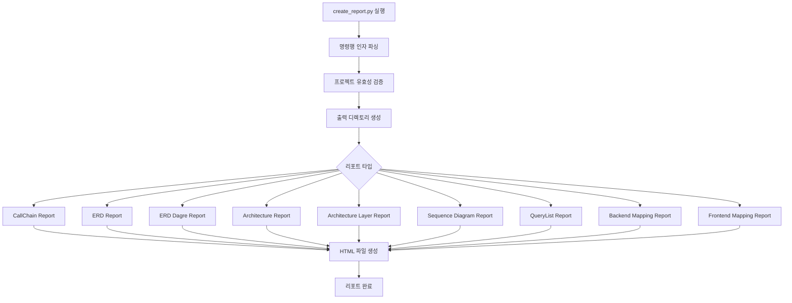

# 리포트 생성 구현서

## 문서 목적

이 문서는 SourceAnalyzer 시스템의 **리포트 생성 기능**을 설명합니다.
**대상 독자**: 개발자, 시스템 엔지니어
**참조 문서**: [01_시스템_요구사항_정의서.md](./01_시스템_요구사항_정의서.md), [02_데이터베이스_스키마_정의서.md](./02_데이터베이스_스키마_정의서.md)

## 개요

**목적**: 메타데이터베이스의 분석 결과를 다양한 형태의 리포트로 생성하여 개발자와 아키텍트에게 직관적인 정보 제공
**실행 파일**: `create_report.py`
**구현 상태**: 9가지 리포트 생성기 모두 구현됨
**특징**: HTML 기반 인터랙티브 리포트, 오프라인 환경 지원 (Mermaid/Cytoscape.js 로컬)

## 리포트 생성 명령

```bash
# 전체 리포트 생성 (기본)
python create_report.py --project-name sampleSrc

# 특정 리포트만 생성
python create_report.py --project-name sampleSrc --report-type erd
python create_report.py --project-name sampleSrc --report-type callchain
python create_report.py --project-name sampleSrc --report-type backend-mapping
python create_report.py --project-name sampleSrc --report-type frontend-mapping

# 출력 디렉토리 지정
python create_report.py --project-name sampleSrc --output-dir ./my_reports
```

**지원 리포트 타입**: callchain, erd, erd-dagre, erd-dagre-no-attribute, architecture, architecture-layer, sequence, query-list, backend-mapping, frontend-mapping, all

**공통 조회 규칙**: 모든 조인 관계는 `rel_type`이 `JOIN_`으로 시작하므로 리포트(콜체인/백엔드 매핑 등)에서 조인 관계 조회 시 `rel_type LIKE 'JOIN_%'`를 사용한다.

## 리포트 종류

### 1. CallChain Report

**파일**: `reports/callchain_report_generator.py`
**목적**: 프론트엔드부터 데이터베이스까지의 전체 호출 체인 시각화

**핵심 기능**:
- 프론트엔드 파일 → API_URL → METHOD → SQL → TABLE 호출 체인 표시
- SqlContent.db 연동으로 정제된 SQL 쿼리 툴팁 제공
- 필터링 및 검색 기능
- 레이어별 색상 구분

**출력 파일**: `CallChain_Report_[프로젝트명]_[타임스탬프].html`

### 2. ERD Report

**파일**: `reports/erd_report_generator.py`
**목적**: 데이터베이스 구조 시각화 (Mermaid 기반)

**핵심 기능**:
- 테이블과 컬럼 정보를 활용한 Mermaid ERD 생성
- 테이블 간 JOIN 관계 시각화
- 고아 테이블 자동 제외
- 오프라인 환경 지원 (Mermaid.js 로컬)

**출력 파일**: `ERD_Report_[프로젝트명]_[타임스탬프].html`

### 3. ERD(Dagre) Report

**파일**: `reports/erd_dagre_report_generator.py`
**목적**: 고도화된 인터랙티브 ERD 생성

**핵심 기능**:
- Cytoscape.js와 Dagre 레이아웃 사용
- 드래그 앤 드롭, 줌 인/아웃 등 인터랙티브 기능
- 테이블 클릭 시 상세 정보 표시
- 컬럼 표시/미표시 옵션 (--report-type erd-dagre-no-attribute)
- 고아 테이블 자동 제외

**출력 파일**: `ERD_Dagre_Report_[프로젝트명]_[타임스탬프].html`

### 4. Architecture Report

**파일**: `reports/architecture_report_generator.py`
**목적**: 시스템의 컴포넌트 기반 아키텍처 구조 시각화

**핵심 기능**:
- 컴포넌트 간 관계 시각화 (Mermaid 다이어그램)
- 컴포넌트 타입별 분류 및 표시
- 관계 타입별 통계 정보 제공
- 오프라인 환경 지원

**출력 파일**: `Architecture_Report_[프로젝트명]_[타임스탬프].html`

### 5. Architecture Layer Report

**파일**: `reports/architecture_layer_report_generator.py`
**목적**: 시스템의 레이어별 아키텍처 구조 시각화

**핵심 기능**:
- 레이어별 컴포넌트 구조 분석 (FRONTEND, API_ENTRY, SERVICE, REPOSITORY, SQL 등)
- 레이어 간 관계 시각화
- 레이어별 통계 정보 제공
- Mermaid 다이어그램으로 계층 구조 표현

**레이어 분류**:
- FRONTEND: 프론트엔드 파일
- API_ENTRY: Spring Controller, Servlet
- SERVICE: 비즈니스 로직 레이어
- REPOSITORY: 데이터 접근 레이어
- SQL: SQL 쿼리
- QUERY_FROM_SQLTEXT: sqltext 폴더 SQL

**출력 파일**: `Architecture_Layer_Report_[프로젝트명]_[타임스탬프].html`

### 6. Sequence Diagram Report

**파일**: `reports/sequence_diagram_report_generator.py`
**목적**: 시퀀스 다이어그램 리포트 생성

**핵심 기능**:
- 호출 순서를 시퀀스 다이어그램으로 시각화
- Mermaid 시퀀스 다이어그램 형식
- 프론트엔드 → 백엔드 → DB 호출 흐름 표현
- 액터별 메시지 전달 과정 표시

**출력 파일**: `Sequence_Diagram_Report_[프로젝트명]_[타임스탬프].html`

### 7. QueryList Report

**파일**: `reports/query_list_report_generator.py`
**목적**: SQL 쿼리 리스트 분석 리포트

**핵심 기능**:
- 프로젝트 내 모든 SQL 쿼리 목록 표시
- 쿼리 타입별 분류 (SELECT, INSERT, UPDATE, DELETE 등)
- 사용 위치 (Java/XML/sqltext) 표시
- 쿼리별 사용된 테이블 목록
- 필터링 및 검색 기능

**출력 파일**: `QueryList_Report_[프로젝트명]_[타임스탬프].html`

### 8. Backend Mapping Report

**파일**: `reports/backend_mapping_report_generator.py`
**목적**: 백엔드 매핑 상세 리포트 (Java/XML/sqltext 쿼리별 테이블/조인 매핑)

**핵심 기능**:
- SqlContent.db 조회 시 `component_id` 포함
- USE_TABLE/JOIN 정보는 metadata에서 `component_id` 기준으로 매핑
- sqltext 쿼리는 `layer='QUERY_FROM_SQLTEXT'`로 구분
- 출력: Path / File / Method(QueryID) / SQL 타입 / 테이블 / 조인 조건 / 조인 타입

**컬럼 구성**:
- No: 순번
- Path: 파일 경로
- File: 파일명
- Method: 메서드명 또는 QueryID
- SQL Type: SQL_SELECT, SQL_INSERT 등
- Tables: 사용된 테이블 목록
- Join Conditions: 조인 조건
- Join Type: JOIN_EXPLICIT/EXPLICIT_OUTER/EXPLICIT_FULL_OUTER/IMPLICIT/IMPLICIT_OUTER/MERGEON

**출력 파일**: `Backend_Mapping_Report_[프로젝트명]_[타임스탬프].html`

### 9. Frontend Mapping Report

**파일**: `reports/frontend_mapping_report_generator.py`
**목적**: 프론트엔드 매핑 상세 리포트 (프론트엔드 → API → METHOD → QUERY 체인)

**핵심 기능**:
- Backend Mapping Report와 동일 스타일의 테이블 UI
- API_URL/Method/Query 매핑은 metadata 관계(CALL_API/CALL_METHOD/CALL_QUERY) 사용
- 프론트엔드 파일에서 호출하는 전체 체인 표시

**컬럼 구성**:
- No: 순번
- Frontend: 프론트엔드 컴포넌트명
- Frontend File: 프론트엔드 파일명
- API URL: 호출하는 API URL
- Method: 백엔드 메서드명
- Method File: 메서드가 정의된 파일
- Query ID: 실행되는 쿼리 ID

**출력 파일**: `Frontend_Mapping_Report_[프로젝트명]_[타임스탬프].html`

## 리포트 생성 플로우



## 리포트 생성기 공통 구조

모든 리포트 생성기는 다음 구조를 따릅니다:

```python
class [ReportName]ReportGenerator:
    def __init__(self, project_name: str, output_dir: str):
        self.project_name = project_name
        self.output_dir = output_dir
        self.db_utils = DatabaseUtils(...)

    def generate_report(self) -> bool:
        """리포트 생성 메인 함수"""
        try:
            # 1. 데이터 조회
            data = self._fetch_data()

            # 2. HTML 생성
            html_content = self._generate_html(data)

            # 3. 파일 저장
            output_file = self._save_report(html_content)

            info(f"리포트 생성 완료: {output_file}")
            return True
        except Exception as e:
            handle_error(e, "리포트 생성 실패")
            return False

    def _fetch_data(self):
        """메타DB에서 데이터 조회"""
        pass

    def _generate_html(self, data):
        """HTML 컨텐츠 생성"""
        pass

    def _save_report(self, html_content):
        """파일 저장"""
        pass
```

## 리포트 HTML 템플릿 구조

### 공통 요소

모든 리포트는 다음 공통 요소를 포함합니다:

1. **헤더**:
   - 프로젝트명
   - 리포트 타입
   - 생성 날짜/시간

2. **통계 정보**:
   - 총 항목 수
   - 타입별 분포
   - 주요 지표

3. **메인 컨텐츠**:
   - 테이블 또는 다이어그램
   - 필터링/검색 기능
   - 정렬 기능

4. **오프라인 지원**:
   - 로컬 JavaScript 라이브러리 (Cytoscape.js, Dagre, jQuery)
   - 로컬 Mermaid.js

### 기술 스택

- **JavaScript 라이브러리**:
  - Cytoscape.js: 그래프 시각화
  - Dagre: 레이아웃 알고리즘
  - jQuery: DOM 조작
  - Mermaid.js: 다이어그램 렌더링

- **CSS 프레임워크**:
  - Bootstrap (선택적)
  - 커스텀 CSS

## 오프라인 환경 지원

모든 리포트는 폐쇄망 환경에서도 실행 가능하도록 설계되었습니다:

1. **JavaScript 라이브러리 로컬화**:
   - `js/` 폴더에 모든 필수 라이브러리 포함
   - CDN 의존성 제거

2. **리포트 생성 시 자동 복사**:
   - 리포트 생성 시 `js/` 폴더를 출력 디렉토리로 자동 복사
   - 상대 경로로 라이브러리 참조

3. **지원 파일**:
   - `cytoscape.min.js`
   - `dagre.min.js`
   - `cytoscape-dagre.js`
   - `jquery.min.js`
   - `mermaid.min.js`

## 주요 구현 포인트

### 1. 메타DB 우선 사용

- 리포트 생성 시 원본 소스를 재파싱하지 않음
- metadata.db와 SqlContent.db에 저장된 정제 데이터만 사용
- 일관된 데이터 파이프라인 유지

### 2. component_id 기반 매핑

- SqlContent 조회 시 `component_id` 포함하여 정확한 매핑
- 동일 쿼리 ID라도 파일별로 테이블이 섞이지 않도록 보장

### 3. 고아 테이블 제외

- ERD 리포트에서 관계가 없는 테이블 자동 제외
- `include_orphan_tables=False` 고정

### 4. 에러 핸들링

- 리포트 생성 실패 시 `handle_error()` 호출
- 일부 리포트 실패해도 다른 리포트는 계속 생성

## 성능 최적화

### 1. 쿼리 최적화

- 필요한 데이터만 조회
- JOIN 최소화
- 인덱스 활용

### 2. 메모리 관리

- 대용량 데이터는 스트리밍 처리
- 불필요한 데이터 즉시 해제

### 3. 캐싱

- 반복 조회되는 데이터 캐싱
- 프로젝트 정보, 테이블 목록 등

## 📚 관련 문서

- [01_시스템_요구사항_정의서.md](./01_시스템_요구사항_정의서.md): 리포트 요구사항
- [02_데이터베이스_스키마_정의서.md](./02_데이터베이스_스키마_정의서.md): 데이터 스키마
- [03_처리_플로우_개요.md](./03_처리_플로우_개요.md): 전체 처리 플로우
