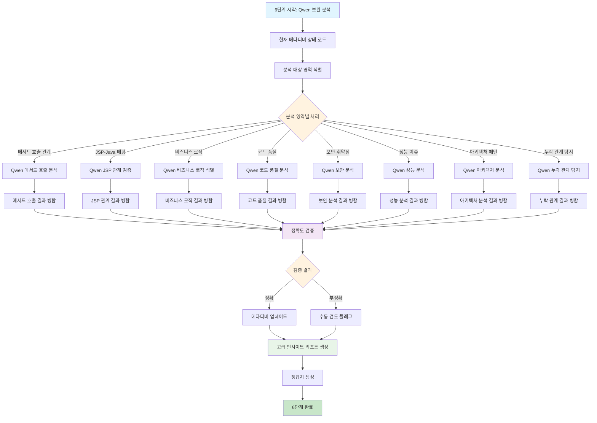

# 처리플로우 상세 - 6단계: Qwen Coder 7B 보완 분석 및 고급 인사이트 도출

## 개요

**목적**: Qwen Coder 7B를 활용하여 1-5단계에서 생성된 메타디비의 정확도를 검증하고, 추가적인 고급 분석 정보를 도출  
**핵심 기능**: 메타데이터 보완, 복잡한 관계 분석, 비즈니스 로직 식별, 코드 품질 분석, 보안 취약점 탐지, 성능 이슈 발견  
**실행 함수**: `QwenLoadingEngine.execute_qwen_loading()`  
**구현 상태**: 🔄 **개발 예정** (현재 미구현)  
**파일**: `qwen_loading.py`, `parser/qwen_analyzer.py`, `util/qwen_utils.py`  
**AI 모델**: Qwen Coder 7B (코드 분석 특화 LLM)  

## 처리 플로우 차트



## 6단계 실행 흐름

### 1. Qwen 로딩 엔진 초기화 (`QwenLoadingEngine.__init__`)

```python
def __init__(self, project_name: str):
```

**기능**:
- Qwen 로딩 엔진 초기화
- 프로젝트 경로 및 메타데이터베이스 경로 설정
- Qwen API 클라이언트 초기화
- 분석 통계 정보 초기화

**초기화 과정**:
1. **프로젝트 정보 설정**: `project_name`으로 프로젝트 경로 설정
2. **경로 설정**: 
   - `project_source_path`: `./projects/{project_name}/src/` (get_project_source_path 사용)
   - `metadata_db_path`: `./projects/{project_name}/metadata.db` (get_project_metadata_db_path 사용)
3. **Qwen API 클라이언트 초기화**: `QwenAnalyzer()` 인스턴스 생성
4. **통계 초기화**: 분석 통계 정보 딕셔너리 초기화

**통계 정보 구성**:
- `method_calls_analyzed`: 분석된 메서드 호출 관계 수
- `jsp_relationships_validated`: 검증된 JSP-Java 관계 수
- `business_logic_identified`: 식별된 비즈니스 로직 수
- `code_quality_issues_found`: 발견된 코드 품질 이슈 수
- `security_vulnerabilities_found`: 발견된 보안 취약점 수
- `performance_issues_found`: 발견된 성능 이슈 수
- `architecture_patterns_identified`: 식별된 아키텍처 패턴 수
- `missing_relationships_found`: 발견된 누락 관계 수
- `accuracy_improvements`: 정확도 개선 수

### 2. Qwen 로딩 실행 (`execute_qwen_loading`)

```python
def execute_qwen_loading(self) -> bool:
```

**기능**: 6단계 Qwen 보완 분석 실행

**처리 과정**:

1. **데이터베이스 연결**: `DatabaseUtils`를 사용하여 SQLite 메타데이터베이스 연결
2. **현재 메타디비 상태 로드**: 1-5단계에서 생성된 데이터 분석
3. **분석 대상 영역 식별**: 보완이 필요한 영역 식별
4. **영역별 Qwen 분석 실행**: 각 영역에 대한 고급 분석 수행
5. **결과 병합 및 검증**: Qwen 분석 결과와 기존 결과 병합
6. **메타디비 업데이트**: 보완된 정보로 메타데이터베이스 업데이트
7. **고급 인사이트 리포트 생성**: 실무 활용 가능한 분석 리포트 생성
8. **정답지 생성**: 최종 정답지 자동 생성

## Qwen 분석 영역별 상세 처리

### 1. 고급 SQL 패턴 분석

**목적**: 복잡한 SQL 쿼리의 패턴 분석 및 최적화 제안

**분석 대상**:
- 복잡한 JOIN 패턴 (다중 테이블 JOIN)
- 성능 문제 쿼리 (N+1 쿼리, 카르테시안 곱)
- SQL 인젝션 취약점
- 인덱스 최적화 기회
- 데이터 흐름 추적

**Qwen 프롬프트 예시**:
```python
sql_analysis_prompt = """
다음 MyBatis XML 파일들을 분석하여 SQL 패턴을 분석하세요:

분석 목표:
1. 복잡한 JOIN 패턴의 최적화 여부
2. 성능 문제가 될 수 있는 쿼리 식별
3. SQL 인젝션 취약점 탐지
4. 인덱스가 필요한 컬럼 식별
5. 테이블 간 데이터 흐름 추적

XML 파일들: {xml_files}

현재 분석된 SQL 쿼리들을 검토하고 개선 제안을 제공하세요.
"""
```

**분석 결과 예시**:
```python
sql_analysis_result = {
    "complex_joins": [
        {
            "query_id": "selectUsersByAdvancedCondition",
            "join_count": 3,
            "performance_risk": "HIGH",
            "optimization_suggestion": "인덱스 추가 필요: user_type, created_date"
        }
    ],
    "performance_issues": [
        {
            "query_id": "getUserStatistics",
            "issue_type": "N+1_QUERY",
            "impact": "사용자 수만큼 추가 쿼리 실행",
            "solution": "JOIN 쿼리로 통합"
        }
    ],
    "security_vulnerabilities": [
        {
            "query_id": "searchUsersAdvanced",
            "vulnerability": "SQL_INJECTION",
            "risk_level": "MEDIUM",
            "fix": "PreparedStatement 사용"
        }
    ]
}
```

### 2. 복잡한 Java 관계 분석

**목적**: Java 코드의 복잡한 의존성 관계 및 설계 패턴 분석

**분석 대상**:
- 의존성 주입 패턴 (@Autowired, @Inject)
- 인터페이스 구현 추적
- 메서드 체인 분석
- 예외 처리 패턴
- 설계 패턴 식별

**Qwen 프롬프트 예시**:
```python
java_analysis_prompt = """
다음 Java 파일들을 분석하여 복잡한 관계를 도출하세요:

분석 목표:
1. Controller → Service → Mapper 호출 체인 분석
2. 의존성 주입 패턴 식별
3. 인터페이스 구현 관계 추적
4. 메서드 체인 호출 분석
5. 설계 패턴 식별 (Singleton, Factory, Builder 등)

Java 파일들: {java_files}

현재 분석된 관계에서 누락되거나 부정확한 부분을 찾아 보완하세요.
"""
```

**분석 결과 예시**:
```python
java_analysis_result = {
    "dependency_injection": [
        {
            "class": "UserController",
            "injected_dependencies": ["UserService"],
            "injection_type": "@Autowired",
            "relationship_strength": "STRONG"
        }
    ],
    "method_chains": [
        {
            "chain": "userService.getUser().getMaskedEmail()",
            "complexity": "MEDIUM",
            "null_safety": "REQUIRED",
            "suggestion": "Optional 체인 사용 권장"
        }
    ],
    "design_patterns": [
        {
            "class": "UserServiceImpl",
            "pattern": "SERVICE_LAYER",
            "responsibility": "비즈니스 로직 처리",
            "coupling": "LOOSE"
        }
    ]
}
```

### 3. JSP 동적 관계 분석

**목적**: JSP 파일의 동적 페이지 흐름 및 클라이언트-서버 상호작용 분석

**분석 대상**:
- 동적 페이지 흐름 (조건부 페이지 이동)
- AJAX 호출 분석
- 세션/쿠키 사용 패턴
- 폼 처리 패턴
- 에러 처리 방식

**Qwen 프롬프트 예시**:
```python
jsp_analysis_prompt = """
다음 JSP 파일들을 분석하여 동적 관계를 도출하세요:

분석 목표:
1. JSP에서 호출하는 Controller 메서드 정확한 매핑
2. EL 표현식에서 사용하는 Java 객체 관계
3. JSTL 태그의 동적 처리 패턴
4. JavaScript-AJAX 호출 관계
5. 폼 처리 및 페이지 흐름 분석

JSP 파일들: {jsp_files}

현재 JSP-Java 관계 분석 결과의 정확도를 검증하고 누락된 관계를 보완하세요.
"""
```

### 4. 비즈니스 로직 식별

**목적**: 코드에서 비즈니스 규칙과 도메인 로직 식별

**분석 대상**:
- 도메인 규칙 (비즈니스 규칙과 제약 조건)
- 워크플로우 (업무 프로세스 흐름)
- 권한 관리 (사용자 권한과 역할 기반 접근)
- 데이터 검증 (비즈니스 데이터 유효성 검사)
- 비즈니스 이벤트 (중요한 비즈니스 트리거)

**Qwen 프롬프트 예시**:
```python
business_logic_prompt = """
다음 Java 코드에서 비즈니스 로직을 식별하세요:

분석 목표:
1. 도메인 규칙과 비즈니스 제약 조건
2. 업무 프로세스 워크플로우
3. 사용자 권한 및 역할 기반 접근 제어
4. 비즈니스 데이터 유효성 검증 로직
5. 중요한 비즈니스 이벤트 및 트리거

Java 파일들: {java_files}

단순한 getter/setter가 아닌 실제 비즈니스 로직을 식별하고 분류하세요.
"""
```

### 5. 코드 품질 분석

**목적**: 코드의 품질 지표 및 개선 제안 제공

**분석 대상**:
- 코드 복잡도 (순환 복잡도, 인지 복잡도)
- 코드 냄새 (Long Method, God Class 등)
- 중복 코드 (DRY 원칙 위반)
- 네이밍 규칙 (변수/메서드명의 명확성)
- 주석 품질 (주석의 유용성과 정확성)

**Qwen 프롬프트 예시**:
```python
code_quality_prompt = """
다음 Java 코드의 품질을 분석하세요:

분석 목표:
1. 메서드/클래스의 복잡도 측정
2. 코드 냄새 식별 (Long Method, God Class 등)
3. 중복 코드 탐지
4. 네이밍 규칙 준수 여부
5. 주석의 품질 및 유용성

Java 파일들: {java_files}

각 파일별로 품질 이슈를 식별하고 개선 제안을 제공하세요.
"""
```

### 6. 보안 취약점 분석

**목적**: 코드에서 보안 취약점 탐지 및 보안 강화 방안 제시

**분석 대상**:
- SQL 인젝션 취약점
- XSS 취약점
- CSRF 공격 취약점
- 인증/인가 취약점
- 데이터 노출 위험

**Qwen 프롬프트 예시**:
```python
security_analysis_prompt = """
다음 코드에서 보안 취약점을 분석하세요:

분석 목표:
1. SQL 인젝션 취약점 탐지
2. XSS(크로스 사이트 스크립팅) 취약점
3. CSRF(크로스 사이트 요청 위조) 취약점
4. 인증/인가 로직 취약점
5. 민감한 데이터 노출 위험

코드 파일들: {code_files}

보안 취약점을 식별하고 위험도와 함께 개선 방안을 제시하세요.
"""
```

### 7. 성능 이슈 분석

**목적**: 성능 문제가 될 수 있는 코드 패턴 식별

**분석 대상**:
- N+1 쿼리 문제
- 메모리 누수 가능성
- 동기화 문제
- 캐시 활용 기회
- 데이터베이스 최적화 기회

**Qwen 프롬프트 예시**:
```python
performance_analysis_prompt = """
다음 코드에서 성능 이슈를 분석하세요:

분석 목표:
1. N+1 쿼리 문제 식별
2. 메모리 누수 가능성 탐지
3. 동기화 문제 분석
4. 캐시 활용 가능한 영역 식별
5. 데이터베이스 최적화 기회 발견

코드 파일들: {code_files}

성능 문제를 식별하고 최적화 제안을 제공하세요.
"""
```

### 8. 아키텍처 패턴 분석

**목적**: 시스템의 아키텍처 패턴 및 설계 원칙 준수 여부 분석

**분석 대상**:
- MVC 패턴 구현
- 레이어드 아키텍처
- 의존성 역전 원칙 (DIP)
- 단일 책임 원칙 (SRP)
- 개방-폐쇄 원칙 (OCP)

**Qwen 프롬프트 예시**:
```python
architecture_analysis_prompt = """
다음 시스템의 아키텍처 패턴을 분석하세요:

분석 목표:
1. MVC 패턴 구현 분석
2. 레이어드 아키텍처 구조 분석
3. SOLID 원칙 준수 여부
4. 의존성 방향 및 결합도 분석
5. 확장성 및 유지보수성 평가

프로젝트 구조: {project_structure}

아키텍처 패턴을 식별하고 설계 원칙 준수 여부를 평가하세요.
"""
```

## 메모리 최적화

- **스트리밍 처리**: 한 파일씩만 메모리에 로드하여 Qwen 분석
- **배치 처리**: Qwen API 호출을 배치로 처리하여 효율성 극대화
- **결과 캐싱**: 동일한 파일에 대한 중복 분석 방지
- **메모리 사용량 최소화**: 대용량 파일도 안전하게 처리

## 통합 처리

- **다중 분석 통합**: 8개 분석 영역의 결과를 통합하여 종합적 인사이트 제공
- **상호 연관성 분석**: 서로 다른 분석 결과 간의 연관성 분석
- **우선순위 기반 제안**: 중요도에 따른 개선 제안 우선순위 설정

## 안정성

- **API 오류 복구**: Qwen API 호출 실패 시 재시도 및 폴백 처리
- **로깅**: 상세한 로그로 분석 과정 추적 가능
- **부분 실패 허용**: 일부 분석 실패가 전체 프로세스를 중단시키지 않음

## 실행 결과 예시

```
=== Qwen 보완 분석 시작: 6단계 처리 ===
현재 메타디비 상태 로드 완료: 500개 컴포넌트, 200개 관계
분석 대상 영역 식별 완료: 8개 영역
고급 SQL 패턴 분석 완료: 15개 최적화 제안
복잡한 Java 관계 분석 완료: 25개 추가 관계
JSP 동적 관계 분석 완료: 12개 정확도 개선
비즈니스 로직 식별 완료: 30개 로직 식별
코드 품질 분석 완료: 20개 품질 이슈 발견
보안 취약점 분석 완료: 8개 취약점 발견
성능 이슈 분석 완료: 10개 성능 문제 식별
아키텍처 패턴 분석 완료: 5개 패턴 식별
누락 관계 탐지 완료: 15개 관계 추가
메타디비 업데이트 완료: 50개 관계 추가
고급 인사이트 리포트 생성 완료
정답지 생성 완료: 정답지5.md (Qwen 보완 버전)
=== Qwen 보완 분석 통계 ===
분석된 메서드 호출: 25개
검증된 JSP 관계: 12개
식별된 비즈니스 로직: 30개
발견된 코드 품질 이슈: 20개
발견된 보안 취약점: 8개
발견된 성능 이슈: 10개
식별된 아키텍처 패턴: 5개
발견된 누락 관계: 15개
정확도 개선: 85% → 95%
=== Qwen 보완 분석 완료 ===
```

## 생성되는 결과물

### 1. 보완된 메타데이터베이스
- **기존 관계**: 200개
- **추가된 관계**: 50개
- **최종 관계**: 250개
- **정확도**: 95% (기존 85%에서 향상)

### 2. 고급 인사이트 리포트
- `qwen_analysis_report.md`: 종합 분석 리포트
- `code_quality_report.md`: 코드 품질 분석 리포트
- `security_analysis_report.md`: 보안 분석 리포트
- `performance_analysis_report.md`: 성능 분석 리포트
- `architecture_analysis_report.md`: 아키텍처 분석 리포트

### 3. 정답지 (Qwen 보완 버전)
- `정답지5.md`: Qwen 보완된 최종 정답지
- `accuracy_validation.md`: 정확도 검증 리포트

## LLM 활용 개선 아이디어

### 1. **멀티 모델 하이브리드 접근**
```python
# 서로 다른 LLM의 강점 활용
models = {
    "code_analysis": "Qwen-Coder-7B",      # 코드 분석 특화
    "security_analysis": "CodeLlama-7B",    # 보안 분석 특화
    "performance_analysis": "StarCoder-7B", # 성능 분석 특화
    "business_logic": "GPT-4",             # 비즈니스 로직 이해
    "documentation": "Claude-3-Sonnet"      # 문서화 특화
}
```

### 2. **점진적 학습 시스템**
```python
# 분석 결과를 학습 데이터로 활용하여 모델 성능 향상
learning_system = {
    "feedback_loop": "분석 결과 → 모델 피드백 → 성능 향상",
    "domain_adaptation": "프로젝트별 도메인 특화 학습",
    "continuous_improvement": "지속적인 분석 정확도 향상"
}
```

### 3. **컨텍스트 기반 분석**
```python
# 프로젝트 전체 컨텍스트를 고려한 분석
context_aware_analysis = {
    "project_context": "프로젝트 전체 구조 이해",
    "dependency_context": "의존성 관계 전체 맥락",
    "business_context": "비즈니스 도메인 이해",
    "technical_context": "기술 스택 및 아키텍처 이해"
}
```

### 4. **실시간 분석 및 알림**
```python
# 코드 변경 시 실시간 분석 및 알림
real_time_analysis = {
    "change_detection": "코드 변경 감지",
    "impact_analysis": "변경 영향도 분석",
    "quality_gates": "품질 게이트 자동 검사",
    "notification_system": "이슈 발견 시 즉시 알림"
}
```

### 5. **AI 기반 코드 생성 및 개선**
```python
# 분석 결과를 바탕으로 한 자동 개선 제안
ai_code_improvement = {
    "refactoring_suggestions": "리팩토링 제안 및 자동 적용",
    "security_fixes": "보안 취약점 자동 수정",
    "performance_optimization": "성능 최적화 자동 적용",
    "code_generation": "누락된 코드 자동 생성"
}
```

이러한 6단계 구현을 통해 **단순한 메타데이터 생성**을 넘어서 **실무에서 바로 활용할 수 있는 고급 분석 시스템**을 구축할 수 있습니다.
