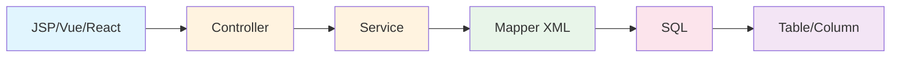
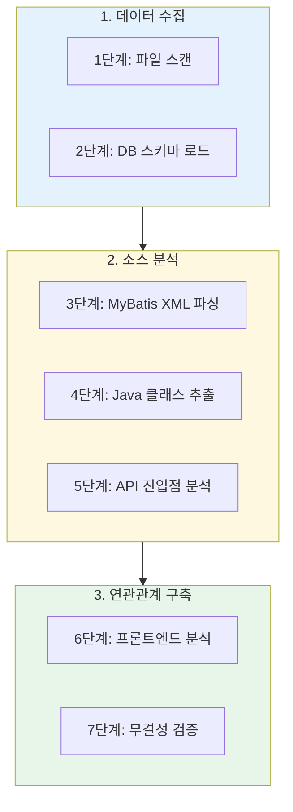
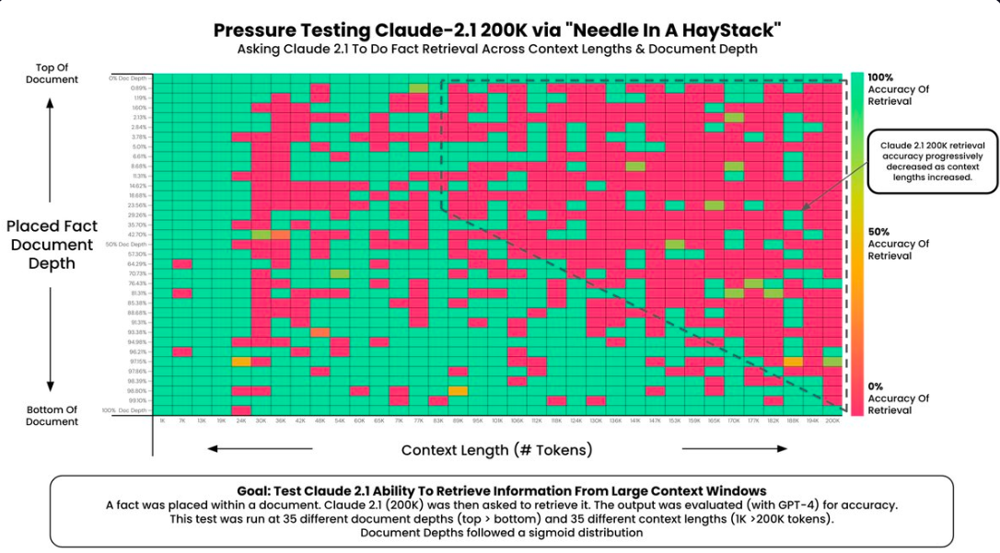
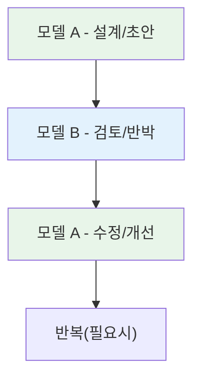

# AI 코딩 어시스턴스 활용 사례 발표 (통합 스크립트)

> 금융회사 IT개발팀(개발/운영/아키텍처/품질/보안·내부통제) 대상 발표용 원고입니다.  
> PPT 파일은 별도로 제작하고, 이 문서는 **슬라이드별 상세 내용 + 발표 스크립트(말하기 원고) + Q&A 힌트**를 한 파일로 통합.

```
제목: AI 코딩 어시스턴스 활용 사례 발표
부제: 소스분석기(SourceAnalyzer) 개발 프로젝트로 배운 교훈
발표자: [이름]
소속: [팀명]
일자: 2026년 1월
```

---

## 발표 운영 가이드(발표자용)

- 이 발표의 목적은 “AI 찬양/비판”이 아니라 **현업 개발팀이 안전하게 생산성을 얻는 방법**을 공유하는 것입니다.

---

# Slide 1. 표지

## 화면에 보여줄 내용

- AI 코딩 어시스턴스 활용 사례 발표
- 소스분석기(SourceAnalyzer) 개발 프로젝트로 배운 교훈
- 발표자/소속/일자

## 발표 스크립트(예시)

오늘은 AI 코딩 어시스턴스를 실제 개발에 적용하면서 겪었던 시행착오를 공유하겠습니다.

---

# Slide 2. 오늘의 핵심 메시지

## 화면에 보여줄 내용(한 줄)

> AI는 도구일 뿐, 운전자는 사람이다.

## 보조 포인트

- AI는 “방향 설정/책임/통제”를 대신하지 못함
- 사람은 “목표/제약/검증/최종 결정”을 맡아야 함

## 발표 스크립트(예시)

AI는 코드를 빨리 만들어주지만, 목표가 불명확하거나 통제가 없으면 품질과 리스크가 커집니다. 특히 금융권은 보안·감사·변경관리 체계가 있어 “빨리 만드는 것”만으로는 성공이 아닙니다.

---

# Slide 3. 오늘 이야기의 흐름(목차)

## 화면에 보여줄 내용

1) 프로젝트/문제 소개  
2) 시행착오 사례(실패에서 배운 점)  
3) AI 협업 원칙(체크리스트)  
4) 금융권 관점 보강(보안/내부통제/SDLC)  
5) 실무 팁(모델 핑퐁/질의서/프롬프트)  
6) 결론/Q&A  

## 발표 스크립트(예시)

처음엔 “AI가 다 해주겠지”로 시작했는데, 결국은 우리가 원래 하던 개발 원칙을 더 엄격하게 지켜야 한다는 결론으로 갔습니다. 그 과정을 순서대로 공유하겠습니다.

---

# Slide 4. SourceAnalyzer란?

## 화면에 보여줄 내용

> 프론트엔드 → 백엔드 → DB까지 연관관계를 자동 도출하는 메타데이터 분석 시스템



## 발표 스크립트(예시)

기간계/업무시스템에서 “이 화면이 어떤 API를 타고, 어떤 SQL을 실행하고, 어떤 테이블과 컬럼에 영향이 있는지” 같은 질문이 반복됩니다. SourceAnalyzer는 그 연관관계를 메타데이터로 만들어 리포트/검증/영향도 분석에 활용하는 도구입니다.

---

# Slide 5. 분석 범위(기술 스택)

## 화면에 보여줄 내용

- 백엔드: Java/Spring, MyBatis XML, JPA 등
- 프론트: JSP/Vue/React/TypeScript/JavaScript 등
- SQL: JOIN/테이블·컬럼 추출

## 발표 스크립트(예시)

소스분석기 개발 목표는 “완벽한 파서” 구현이 아니라 “연관관계” 도출입니다. 즉, 100% 문법 검증이 아니라 운영에 유의미한 연결고리를 최대한 안정적으로 뽑는 게 핵심이었습니다.

---

# Slide 6. 7단계 분석 파이프라인(아키텍처)

## 화면에 보여줄 내용



## 발표 스크립트(예시)

큰 문제를 한 번에 맡기면 통제가 안 되고, 결과 검증도 어려워집니다. 그래서 단계별 입력/출력을 고정하고, 검증 가능한 단위로 쪼개는 게 중요했습니다.

---

# Slide 7. 시행착오 요약

## 화면에 보여줄 내용

| 시도  | 요청/전략       | 결과(요약)          |
| ---:| ----------- | --------------- |
| 1   | 무계획 개발 요청   | 의도와 다른 결과물      |
| 2   | PRD 작성 후 개발 | 가정/추측 많아 미완성    |
| 3   | 정교한 파서 개발   | 복잡도 폭발로 중단      |
| 4   | 메타DB 직접 설계  | 복잡도↑, 기존 소스 훼손  |
| 5   | “스키마 변경 금지” | 편의 위해 스키마 변경 시도 |
| 6   | “검토해줘”      | 검토 없이 바로 개발     |
| 7   | 분할정복        | 통합 실패           |
| 8   | 중복 코드 금지    | 중복 생성/부분 수정     |
| 9   | 정답지 기반 검증   | 우회적 처리/근본 미해결   |

## 발표 스크립트(예시)

AI를 쓰면 처음엔 정말 빨라 보이는데, 일정 수준을 넘어가면 품질과 일관성이 흔들리면서 “분할정복/통제”가 핵심 과제가 됩니다.

---

# Slide 8. 실패 ① 무계획 개발 요청

## 화면에 보여줄 내용

- 요청: “소스분석기 개발해줘”
- 결과: 그럴듯하지만 목표 불일치
- 교훈: 요구사항/수용기준 없으면 실패

## 발표 스크립트(예시)

AI는 “그럴듯한 코드”를 만들지만, “우리 조직이 원하는 결과물”과의 간극을 스스로 메우지 못합니다. AI에게 개발을 시키는 것은 사람에게 일을 시키는 것과 동일했습니다.   상세한 개발 배경과 목표 없이는 의도한 바를 구현해 낼 수 없었습니다.

---

# Slide 9. 실패 ② PRD를 AI에게 ‘작성’시킴

## 화면에 보여줄 내용

- PRD는 “정의/검증”이 핵심(책임은 사람)
- AI는 초안/템플릿/정리에 강점
- 가정/추측이 섞이면 개발이 엇나감

## 발표 스크립트(예시)

PRD 형식은 금방 채워지는데, 우리가 중요하게 보는 용어 정의, 수용 기준, 실패 조건, 예외 처리 같은 부분은 빠지기 쉽습니다. PRD는 사람이 책임지고, AI는 ‘정리 도구’로 쓰는 게 안전합니다.

---

# Slide 10. 실패 ③ 파서에 집착(정확한 신택스 체크)

## 화면에 보여줄 내용

```
목표: 정확한 신택스 체크 ❌
목표: 소스 간 연관관계 분석 ✅
```

## 발표 스크립트(예시)

거침없이 각 언어별 파서를 개발해 내길래 감탁을 했지만, “정교한 파서” 구현에 집중하면서 복잡도가 급증하고 결국 프론트에서 백엔드 테이블까지 연관과계 도출에 실패합니다.   최종 목표가 ‘연관관계’ 도출이라면 정확한 신택스에 집착할 필요가 없습니다.  결론:정확한 달성 목표는 사람이 제시를 해주어야 합니다.

---

# Slide 11. 실패 ④ 복잡도 증가 → 기존 소스 훼손

## 화면에 보여줄 내용

- 초반 진척은 빠름
- 복잡도↑ → 이전 맥락 유지 실패
- 교훈: 단위/단계별 입력·출력 고정 + 회귀 테스트

## 발표 스크립트(예시)

조각은 그럴듯한데 전체 맥락이 깨지는 순간이 옵니다. 기능 추가가 기존 기능을 깨뜨리는 문제가 반복되면서, “통합은 사람이 한다”는 원칙이 더 명확해졌습니다.

---

# Slide 12. 실패 ⑤ 설계 불변 원칙(스키마/핵심 구조)이 흔들릴 때

## 화면에 보여줄 내용

- AI는 편의(조인 회피)를 위해 변경을 시도할 수 있음
- 교훈: 불변 영역을 기술적으로 잠그기(읽기 전용/검증/실패 처리)

## 발표 스크립트(예시)

문서로 “테이블 설계는 승인 없이 변경하지 마”라고 지침을 줘도, 상상코딩을 하다 필요하면 컬럼을 만듬.
(작은 모델은 추론능력이 떨어져서, 큰 모델은 과도한 학습량이 오히려 튜닝을 방해하는)
※ DDL/핵심 설계는 변경 금지 영역으로 지정

---

# Slide 13. 실패 ⑥ 어디로 튈지 모르는 4차원 신입 개발자

## 화면에 보여줄 내용

- “검토”라고 해도 개발을 시작할 수 있음
- 안전한 요청: “개발하지 말고 검토만, 결과를 문서로”

## 발표 스크립트(예시)

내가 언제 그거하라고 했냐고???ㅠ

---

# Slide 14. 실패 ⑦ 분할정복은 되지만, 통합은 실패

## 화면에 보여줄 내용

- 모듈 단위 성과는 좋음
- 전체 퍼즐(통합)에서 막힘
- 교훈: 통합 설계/인터페이스 계약은 사람이 주도

## 발표 스크립트(예시)

AI는 부분 최적화는 잘하지만, 전체 최적화는 약합니다. 

---

# Slide 15. 실패 ⑧ 중복 코드(컨텍스트 한계)

## 화면에 보여줄 내용

- 이미 있는 기능을 못 보고 “새로” 만들기 쉬움
- 중복된 소스 일부만 수정 → 동작 불일치
- 교훈: 공통화 포인트를 사람이 먼저 선언 + 검색/리뷰 절차

## 발표 스크립트(예시)

규모가 커지면 AI는 전체를 보지 못해 중복을 인지하지 못합니다. 기존에 개발된 소스가 있는지 점검하지 않고, 비슷한 기능을 또 만들어 중복이 늘어나는 패턴이 반복됩니다.

공통 로직을 문서화하고 숙지하고 개발하라고 해도, 컨텍스트 한계 때문에 잘 반영되지 않는 경우가 많습니다.

> - 과거: 컨텍스트 윈도우가 작아(대개 수천 토큰 수준) 단일 컨텍스트에 긴 문서를 담는 것이 불가
> - 현재: 수십만~수백만 토큰 모델이 등장하면서 `NIAH`/`NIAN`이 **롱컨텍스트 능력 평가의 핵심 지표**로 부각(찾기 → 엮기/추론)
> 
> - `NIAH (Needle In A Haystack)`: 단순 사실 확인(검색/추출)
>   - 방대한 텍스트(haystack) 속에 **명확한 사실 1개(needle)**를 숨겨두고, 모델이 해당 구절을 찾아 그대로 답하는지 평가
>   - 예) 숨겨진 정보: "2024년 10월 2일 점심 메뉴는 김치찌개였다." → 질문: "2024년 10월 2일 점심 메뉴가 뭐야?"
> - `NIAN (Needle In A Needlestack)`: 복잡한 논리 및 관계 추출(조합/추론)
>   - 문서 곳곳에 **서로 연관된 여러 단서(needles)**를 흩어두고, 이를 **연결·조합**해야만 답이 나오는지 평가
>   - 예) (10p) "철수는 어제 점심으로 영희가 추천한 메뉴를 먹었다." + (500p) "영희는 매콤하고 칼칼한 국물 요리가 먹고 싶다고 했다." + (1200p) "국물 요리는 김치찌개/미역국" → 질문: "철수가 먹은 메뉴는?"
> 
> 

---

# Slide 16. 실패 ⑨ Exception 발생시 스킵처리

## 화면에 보여줄 내용

- Excetion 발생시 logger.debug(), Continue -> 에러 발생 원인을 고치고 가야하는데 에러가 발생한지 모르고 지나가면 후속 로직에서 원인 파악이 어려움

## 발표 스크립트(예시)

github에서 학습한 소스 사례들이 대부분 에러 무시하고 Skip하는 소스가 많은듯.  문서로 지침을 주고 강조해고 무시됨.

---

# Slide 17. 실패 ⑩ 하드코딩으로 에러 우회

## 화면에 보여줄 내용

- 근본적인 원인 파악을 해서 로직 개선을 하는게 아니라 하드코딩으로 해결

* ERD 리포트에 테이블명에 Owner도 추가해 넣어줘.
  
  ERD 리포트 생성 로직을 수정해야 하나, Owner가 추가 표시되도록 생성된 리포트 HTML파일을 수정.
- Excetion 발생시 logger.debug(), Skip -> 에러 발생 원인을 고치고 가야하는데 에러가 발생한지 모르고 지나가면 후속 로직에서 원인 파악이 어려움

## 발표 스크립트(예시)

- github에서 학습한 소스 사례들이 대부분 에러 무시하고 Skip하는 소스가 많은듯. 문서로 지침을 주고 강조해고 무시됨.-

- 명확한 지시 필요

---

# # Slide 18. AI가 알아서 하고 난 쉴 수 있어야 하는거 아니야?

## 화면에 보여줄 내용

- 
- 자주 나오는 위험 패턴: 하드코딩/설계 변경/중복 생성/Exception Skip/부정확한 가정

## 발표 스크립트(예시)

언제 뭘 망가뜨릴지 한순간도 눈을 뗄 수가 없음.  "이거 뭐하는거야? 혹시 XXX 하드코딩하는거 아니야?"  "아, 네 죄송합니다. XXX 하드코딩하고 있었습니다""

---

# Slide 19. 실무 팁 ① 모델 간 핑퐁(교차 검토)

## 화면에 보여줄 내용



## 발표 스크립트(예시)

한 모델만 믿으면 편향이 생깁니다. 설계문서/리스크/테스트 항목 같은 건 다른 모델로 검토시키면 누락이 줄어듭니다. 다만, 최종 승인 책임은 사람입니다.

---

# Slide 20. 실무 팁 ② 질의서 기반 협업(막힐 때)

## 화면에 보여줄 내용

| 단계  | 행동                    |
| ---:| --------------------- |
| 1   | “시니어에게 보낼 질의서 작성” 시키기 |
| 2   | 다른 모델에게 “답변서 작성” 시키기  |
| 3   | 답변서를 근거로 원래 문제 재정의/해결 |

## 발표 스크립트(예시)

AI가 문제를 풀지 못할 때는, 문제를 잘게 쪼개고 질문을 정교하게 만드는 게 핵심입니다. 질의서/답변서 방식은 “내가 무엇을 모르고 있는지”를 드러내는 데 효과적이었습니다.

---

# Slide 21. 실무 팁 ③ 프롬프트 톤(한국어/영어)

## 화면에 보여줄 내용

- 한국어: 존댓말 + 명확한 제약(“개발하지 말고 검토만”)
- 영어: 군더더기 없이 명령형(토큰 절약)

## 발표 스크립트(예시)

프롬프트의 핵심은 예의가 아니라 “명확성”입니다. 특히 금지사항(스키마 변경 금지, 하드코딩 금지, 예외 시 중지 등)을 반복해서 박아두는 게 중요합니다.


---

# Slide 24. AI의 한계와 가치(현실적 기대치)

## 화면에 보여줄 내용

| 작업 유형                | AI 활용도(체감) |
| -------------------- | ---------- |
| 소스 스니펫/보일러플레이트       | 높음         |
| 단순 변환 로직(포맷/좌표/매핑 등) | 높음         |
| 문서 초안/정리/체크리스트       | 중~높음       |
| 복잡한 아키텍처 설계          | 낮음         |
| 전체 시스템 통합            | 매우 낮음      |

## 발표 스크립트(예시)

외부의 최신 모델도 복잡한 전체 통합을 자동으로 완성시키는 수준은 아닙니다. 내부망 모델은 제약이 더 있을 수 있으니, “어떤 업무에 쓰면 ROI가 나는지”부터 작게 검증하는 방식이 필요합니다.

---

# Slide 25. 조직 관점 시사점(R&R, AA의 역할)

## 화면에 보여줄 내용

- AI POC/개발의 R&R: 누가 무엇을 책임질 것인가?
- 결론: 업무+IT를 아는 AA/시니어의 가치 상승

## 발표 스크립트(예시)

AI는 코드를 쓰는 사람의 효율을 높이지만, 목표 설정·검증·통합·리스크 판단은 더 중요해집니다. 결국 업무와 IT를 같이 이해하는 인력이 AI 시대에 더 필요합니다.

---

# Slide 26. 결론

## 화면에 보여줄 내용

> AI는 도구일 뿐, 운전자는 사람이다.

## 
