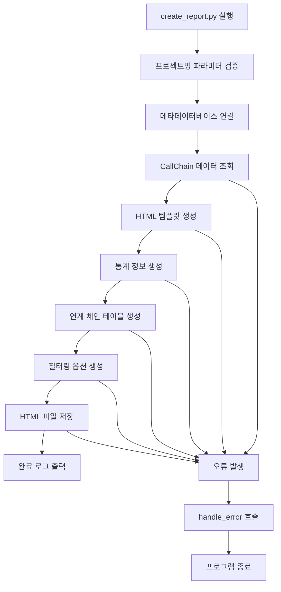

# CallChain Report 생성 개발계획서

## 문서 정보
- **작성일**: 2025-01-14 14:30:00
- **버전**: v1.0
- **작성자**: SourceAnalyzer 개발팀
- **문서 목적**: JSP-Class-Method-XML-Query-Table 연계 정보를 표시하는 CallChain Report 생성 기능 개발 계획

## 1. 개요

### 1.1 개발 목표
메타데이터베이스의 정보를 활용하여 JSP-Class-Method-XML-Query-Table 간의 연계 정보를 시각적으로 표시하는 CallChain Report를 생성하는 기능을 개발합니다.

### 1.2 주요 기능
- **연계 체인 추적**: JSP → Class → Method → XML → Query → Table 연계 정보 표시
- **통계 정보**: 클래스, 메서드, XML 파일, 테이블, 조인 관계 수 표시
- **필터링 기능**: 클래스, 메서드, 테이블명으로 검색 및 필터링
- **쿼리 툴팁**: query_type에 마우스 오버 시 정제된 SQL 쿼리 표시 (SqlContent.db 연동)
- **CSV 내보내기**: 분석 결과를 CSV 형태로 내보내기
- **반응형 UI**: 모바일/데스크톱 환경 지원
- **오프라인 실행**: 인터넷 연결 없이 독립적으로 실행 가능
- **크로스플랫폼**: Windows, RHEL, Ubuntu 등 다양한 OS 환경 지원

### 1.3 출력 형식
- **파일명**: `{project_name}_CallChainReport_{timestamp}.html`
- **저장 위치**: `./projects/{project_name}/report/`
- **형식**: HTML + CSS + JavaScript (샘플 리포트와 동일한 구조)
- **오프라인 지원**: 모든 리소스가 HTML 파일 내에 임베드되어 외부 의존성 없음

## 2. 시스템 아키텍처

### 2.1 전체 플로우차트



### 2.2 파일 구조

```
CreateMetaDb/
├── create_report.py              # 메인 실행 파일
├── reports/                      # 리포트 생성 코어 파일들
│   ├── __init__.py
│   ├── callchain_report_generator.py    # CallChain 리포트 생성기
│   ├── erd_report_generator.py          # ERD 리포트 생성기
│   └── report_templates.py              # HTML 템플릿 관리
└── projects/
    └── {project_name}/
        ├── metadata.db           # 메타데이터베이스
        ├── SqlContent.db         # 정제된 SQL 내용 저장소
        └── report/               # 생성된 리포트 저장 위치
            └── {project_name}_CallChainReport_{timestamp}.html
```

## 3. 상세 설계

### 3.1 메인 실행 파일: create_report.py

```python
#!/usr/bin/env python3
"""
SourceAnalyzer 리포트 생성 메인 실행 파일
- CallChain Report 생성
- ERD Report 생성
"""

import sys
import argparse
from datetime import datetime
from pathlib import Path

# 프로젝트 루트를 Python 경로에 추가
sys.path.append(str(Path(__file__).parent))

from util.logger import app_logger, handle_error
from util.path_utils import PathUtils
from util.database_utils import DatabaseUtils
from reports.callchain_report_generator import CallChainReportGenerator
from reports.erd_report_generator import ERDReportGenerator


def parse_arguments():
    """명령행 인자 파싱"""
    parser = argparse.ArgumentParser(
        description='SourceAnalyzer 리포트 생성 도구',
        formatter_class=argparse.RawDescriptionHelpFormatter,
        epilog="""
사용 예시:
  python create_report.py --project-name sampleSrc --report-type callchain
  python create_report.py --project-name sampleSrc --report-type erd
  python create_report.py --project-name sampleSrc --report-type all
        """
    )
    
    parser.add_argument(
        '--project-name', '-p',
        required=True,
        help='분석할 프로젝트명 (필수)'
    )
    
    parser.add_argument(
        '--report-type', '-t',
        choices=['callchain', 'erd', 'all'],
        default='all',
        help='생성할 리포트 타입 (기본값: all)'
    )
    
    parser.add_argument(
        '--output-dir', '-o',
        help='출력 디렉토리 (기본값: ./projects/{project_name}/report)'
    )
    
    parser.add_argument(
        '--verbose', '-v',
        action='store_true',
        help='상세 로그 출력'
    )
    
    return parser.parse_args()


def validate_project(project_name: str, path_utils: PathUtils) -> bool:
    """프로젝트 유효성 검증"""
    try:
        # 프로젝트 디렉토리 존재 확인
        if not path_utils.project_exists(project_name):
            app_logger.error(f"프로젝트가 존재하지 않습니다: {project_name}")
            return False
        
        # 메타데이터베이스 파일 존재 확인
        metadata_db_path = path_utils.get_project_metadata_db_path(project_name)
        if not Path(metadata_db_path).exists():
            app_logger.error(f"메타데이터베이스가 존재하지 않습니다: {metadata_db_path}")
            return False
        
        app_logger.info(f"프로젝트 유효성 검증 완료: {project_name}")
        return True
        
    except Exception as e:
        handle_error(e, f"프로젝트 유효성 검증 실패: {project_name}")


def create_output_directory(project_name: str, path_utils: PathUtils, output_dir: str = None) -> str:
    """출력 디렉토리 생성"""
    try:
        if output_dir:
            output_path = path_utils.normalize_path(output_dir)
        else:
            output_path = path_utils.get_project_report_path(project_name)
        
        Path(output_path).mkdir(parents=True, exist_ok=True)
        app_logger.info(f"출력 디렉토리 준비 완료: {output_path}")
        return output_path
        
    except Exception as e:
        handle_error(e, f"출력 디렉토리 생성 실패: {output_path}")


def generate_callchain_report(project_name: str, output_dir: str) -> bool:
    """CallChain Report 생성"""
    try:
        app_logger.info("CallChain Report 생성 시작")
        
        generator = CallChainReportGenerator(project_name, output_dir)
        success = generator.generate_report()
        
        if success:
            app_logger.info("CallChain Report 생성 완료")
            return True
        else:
            app_logger.error("CallChain Report 생성 실패")
            return False
            
    except Exception as e:
        handle_error(e, "CallChain Report 생성 중 오류 발생")


def generate_erd_report(project_name: str, output_dir: str) -> bool:
    """ERD Report 생성"""
    try:
        app_logger.info("ERD Report 생성 시작")
        
        generator = ERDReportGenerator(project_name, output_dir)
        success = generator.generate_report()
        
        if success:
            app_logger.info("ERD Report 생성 완료")
            return True
        else:
            app_logger.error("ERD Report 생성 실패")
            return False
            
    except Exception as e:
        handle_error(e, "ERD Report 생성 중 오류 발생")


def main():
    """메인 함수"""
    try:
        app_logger.info("=== SourceAnalyzer 리포트 생성 도구 시작 ===")
        
        # 명령행 인자 파싱
        args = parse_arguments()
        
        # 경로 유틸리티 초기화
        path_utils = PathUtils()
        
        # 프로젝트 유효성 검증
        if not validate_project(args.project_name, path_utils):
            sys.exit(1)
        
        # 출력 디렉토리 생성
        output_dir = create_output_directory(args.project_name, path_utils, args.output_dir)
        
        # 리포트 생성
        success_count = 0
        total_count = 0
        
        if args.report_type in ['callchain', 'all']:
            total_count += 1
            if generate_callchain_report(args.project_name, output_dir):
                success_count += 1
        
        if args.report_type in ['erd', 'all']:
            total_count += 1
            if generate_erd_report(args.project_name, output_dir):
                success_count += 1
        
        # 결과 출력
        app_logger.info(f"=== 리포트 생성 완료 ===")
        app_logger.info(f"성공: {success_count}/{total_count}")
        app_logger.info(f"출력 디렉토리: {output_dir}")
        
        if success_count == total_count:
            app_logger.info("모든 리포트가 성공적으로 생성되었습니다.")
            sys.exit(0)
        else:
            app_logger.error("일부 리포트 생성에 실패했습니다.")
            sys.exit(1)
            
    except KeyboardInterrupt:
        app_logger.info("사용자에 의해 중단되었습니다.")
        sys.exit(0)
    except Exception as e:
        handle_error(e, "리포트 생성 도구 실행 중 치명적 오류 발생")


if __name__ == '__main__':
    main()
```

### 3.2 CallChain Report 생성기: reports/callchain_report_generator.py

```python
"""
CallChain Report 생성기
- JSP-Class-Method-XML-Query-Table 연계 정보 표시
- 통계 정보 및 필터링 기능 제공
"""

import os
import sys
import gzip
from datetime import datetime
from pathlib import Path
from typing import List, Dict, Any, Optional

# 크로스플랫폼 경로 처리
if sys.platform.startswith('win'):
    import ntpath
    path_module = ntpath
else:
    import posixpath
    path_module = posixpath

from util.logger import app_logger, handle_error
from util.path_utils import PathUtils
from util.database_utils import DatabaseUtils
from reports.report_templates import ReportTemplates


class CallChainReportGenerator:
    """CallChain Report 생성기 클래스"""
    
    def __init__(self, project_name: str, output_dir: str):
        """
        초기화
        
        Args:
            project_name: 프로젝트명
            output_dir: 출력 디렉토리
        """
        self.project_name = project_name
        self.output_dir = output_dir
        self.path_utils = PathUtils()
        self.templates = ReportTemplates()
        
        # 메타데이터베이스 연결
        self.metadata_db_path = self.path_utils.get_project_metadata_db_path(project_name)
        self.db_utils = DatabaseUtils(self.metadata_db_path)
        
        if not self.db_utils.connect():
            handle_error(Exception("데이터베이스 연결 실패"), f"메타데이터베이스 연결 실패: {self.metadata_db_path}")
    
    def generate_report(self) -> bool:
        """
        CallChain Report 생성
        
        Returns:
            생성 성공 여부 (True/False)
        """
        try:
            app_logger.info(f"CallChain Report 생성 시작: {self.project_name}")
            
            # 1. 통계 정보 조회
            stats = self._get_statistics()
            
            # 2. 연계 체인 데이터 조회
            chain_data = self._get_call_chain_data()
            
            # 3. 필터링 옵션 데이터 조회
            filter_options = self._get_filter_options()
            
            # 4. HTML 생성
            html_content = self._generate_html(stats, chain_data, filter_options)
            
            # 5. 파일 저장
            output_file = self._save_report(html_content)
            
            app_logger.info(f"CallChain Report 생성 완료: {output_file}")
            return True
            
        except Exception as e:
            handle_error(e, "CallChain Report 생성 실패")
            return False
        finally:
            self.db_utils.disconnect()
    
    def _get_statistics(self) -> Dict[str, int]:
        """통계 정보 조회"""
        try:
            stats = {}
            
            # Java 클래스 수
            query = """
                SELECT COUNT(*) as count
                FROM components c
                JOIN projects p ON c.project_id = p.project_id
                WHERE p.project_name = ? AND c.component_type = 'CLASS' AND c.del_yn = 'N'
            """
            result = self.db_utils.execute_query(query, (self.project_name,))
            stats['java_classes'] = result[0]['count'] if result else 0
            
            # 데이터베이스 테이블 수
            query = """
                SELECT COUNT(DISTINCT t.table_name) as count
                FROM tables t
                JOIN projects p ON t.project_id = p.project_id
                WHERE p.project_name = ? AND t.del_yn = 'N'
            """
            result = self.db_utils.execute_query(query, (self.project_name,))
            stats['database_tables'] = result[0]['count'] if result else 0
            
            # XML 파일 수
            query = """
                SELECT COUNT(DISTINCT f.file_name) as count
                FROM files f
                JOIN projects p ON f.project_id = p.project_id
                WHERE p.project_name = ? AND f.file_type = 'XML' AND f.del_yn = 'N'
            """
            result = self.db_utils.execute_query(query, (self.project_name,))
            stats['xml_files'] = result[0]['count'] if result else 0
            
            # JOIN 관계 수
            query = """
                SELECT COUNT(*) as count
                FROM relationships r
                JOIN projects p ON r.src_id IN (
                    SELECT c.component_id FROM components c WHERE c.project_id = p.project_id
                )
                WHERE p.project_name = ? AND r.rel_type LIKE 'JOIN_%' AND r.del_yn = 'N'
            """
            result = self.db_utils.execute_query(query, (self.project_name,))
            stats['join_relations'] = result[0]['count'] if result else 0
            
            app_logger.debug(f"통계 정보 조회 완료: {stats}")
            return stats
            
        except Exception as e:
            handle_error(e, "통계 정보 조회 실패")
            return {}
    
    def _get_call_chain_data(self) -> List[Dict[str, Any]]:
        """연계 체인 데이터 조회 (SqlContent.db 연동)"""
        try:
            # METHOD -> QUERY -> TABLE 연계 체인 조회
            query = """
                SELECT 
                    ROW_NUMBER() OVER (ORDER BY cls.component_name, m.component_name) as chain_id,
                    cls.component_name as class_name,
                    m.component_name as method_name,
                    xml_file.file_name as xml_file,
                    q.component_name as query_id,
                    q.component_type as query_type,
                    GROUP_CONCAT(DISTINCT t.table_name, ', ') as related_tables
                FROM components cls
                JOIN components m ON cls.component_id = m.parent_id AND m.component_type = 'METHOD'
                JOIN relationships r1 ON m.component_id = r1.src_id AND r1.rel_type = 'CALL_QUERY'
                JOIN components q ON r1.dst_id = q.component_id AND q.component_type IN ('QUERY', 'SQL_SELECT', 'SQL_INSERT', 'SQL_UPDATE', 'SQL_DELETE', 'SQL_MERGE')
                JOIN files xml_file ON q.file_id = xml_file.file_id
                LEFT JOIN relationships r2 ON q.component_id = r2.src_id AND r2.rel_type = 'QUERY_TABLE'
                LEFT JOIN tables t ON r2.dst_id = t.component_id
                JOIN projects p ON cls.project_id = p.project_id
                WHERE p.project_name = ? 
                  AND cls.component_type = 'CLASS'
                  AND cls.del_yn = 'N'
                  AND m.del_yn = 'N'
                  AND q.del_yn = 'N'
                GROUP BY cls.component_name, m.component_name, xml_file.file_name, q.component_name, q.component_type
                ORDER BY cls.component_name, m.component_name
            """
            
            results = self.db_utils.execute_query(query, (self.project_name,))
            
            # SqlContent.db에서 정제된 SQL 내용 조회
            sql_content_map = self._get_sql_contents()
            
            # 데이터 정제
            chain_data = []
            for row in results:
                query_id = row['query_id']
                sql_content = sql_content_map.get(query_id, '')
                
                chain_data.append({
                    'chain_id': row['chain_id'],
                    'class_name': row['class_name'],
                    'method_name': row['method_name'],
                    'xml_file': row['xml_file'],
                    'query_id': query_id,
                    'query_type': row['query_type'],
                    'related_tables': row['related_tables'] or '',
                    'sql_content': sql_content  # 정제된 SQL 내용 추가
                })
            
            app_logger.debug(f"연계 체인 데이터 조회 완료: {len(chain_data)}건")
            return chain_data
            
        except Exception as e:
            handle_error(e, "연계 체인 데이터 조회 실패")
            return []
    
    def _get_sql_contents(self) -> Dict[str, str]:
        """SqlContent.db에서 정제된 SQL 내용 조회 및 압축 해제 (크로스플랫폼 지원)"""
        try:
            # 크로스플랫폼 경로 생성 (공통함수 사용)
            project_path = self.path_utils.get_project_path(self.project_name)
            sql_content_db_path = path_module.join(project_path, "SqlContent.db")
            
            # 경로 정규화 (크로스플랫폼 대응)
            sql_content_db_path = path_module.normpath(sql_content_db_path)
            
            if not os.path.exists(sql_content_db_path):
                app_logger.warning(f"SqlContent.db 파일이 존재하지 않습니다: {sql_content_db_path}")
                return {}
            
            # SqlContent.db 연결
            sql_content_db = DatabaseUtils(sql_content_db_path)
            if not sql_content_db.connect():
                app_logger.warning("SqlContent.db 연결 실패")
                return {}
            
            try:
                # 정제된 SQL 내용 조회
                query = """
                    SELECT component_name, sql_content_compressed
                    FROM sql_contents
                    WHERE project_id = (
                        SELECT project_id FROM projects WHERE project_name = ?
                    )
                    AND del_yn = 'N'
                """
                
                results = sql_content_db.execute_query(query, (self.project_name,))
                
                sql_content_map = {}
                for row in results:
                    component_name = row['component_name']
                    compressed_content = row['sql_content_compressed']
                    
                    # gzip 압축 해제 (크로스플랫폼 호환)
                    try:
                        decompressed_content = gzip.decompress(compressed_content).decode('utf-8')
                        sql_content_map[component_name] = decompressed_content
                    except Exception as decompress_error:
                        app_logger.warning(f"SQL 내용 압축 해제 실패: {component_name}, 오류: {str(decompress_error)}")
                        sql_content_map[component_name] = ''
                
                app_logger.debug(f"정제된 SQL 내용 조회 완료: {len(sql_content_map)}건")
                return sql_content_map
                
            finally:
                sql_content_db.disconnect()
                
        except Exception as e:
            app_logger.warning(f"SqlContent.db 조회 실패: {str(e)}")
            return {}
    
    def _get_filter_options(self) -> Dict[str, List[str]]:
        """필터링 옵션 데이터 조회"""
        try:
            filter_options = {}
            
            # 테이블 목록
            query = """
                SELECT DISTINCT t.table_name
                FROM tables t
                JOIN projects p ON t.project_id = p.project_id
                WHERE p.project_name = ? AND t.del_yn = 'N'
                ORDER BY t.table_name
            """
            result = self.db_utils.execute_query(query, (self.project_name,))
            filter_options['tables'] = [row['table_name'] for row in result]
            
            # 쿼리 타입 목록
            query_types = ['SELECT', 'INSERT', 'UPDATE', 'DELETE', 'MERGE', 'TRUNCATE']
            filter_options['query_types'] = query_types
            
            app_logger.debug(f"필터링 옵션 조회 완료: {len(filter_options['tables'])}개 테이블")
            return filter_options
            
        except Exception as e:
            handle_error(e, "필터링 옵션 조회 실패")
            return {'tables': [], 'query_types': []}
    
    def _generate_html(self, stats: Dict[str, int], chain_data: List[Dict[str, Any]], filter_options: Dict[str, List[str]]) -> str:
        """HTML 생성"""
        try:
            timestamp = datetime.now().strftime('%Y-%m-%d %H:%M:%S')
            
            # HTML 템플릿 생성
            html_content = self.templates.get_callchain_template(
                project_name=self.project_name,
                timestamp=timestamp,
                stats=stats,
                chain_data=chain_data,
                filter_options=filter_options
            )
            
            app_logger.debug("HTML 생성 완료")
            return html_content
            
        except Exception as e:
            handle_error(e, "HTML 생성 실패")
            return ""
    
    def _save_report(self, html_content: str) -> str:
        """리포트 파일 저장"""
        try:
            timestamp = datetime.now().strftime('%Y%m%d_%H%M%S')
            filename = f"{self.project_name}_CallChainReport_{timestamp}.html"
            output_path = os.path.join(self.output_dir, filename)
            
            with open(output_path, 'w', encoding='utf-8') as f:
                f.write(html_content)
            
            app_logger.info(f"리포트 파일 저장 완료: {output_path}")
            return output_path
            
        except Exception as e:
            handle_error(e, "리포트 파일 저장 실패")
            return ""


if __name__ == '__main__':
    # 테스트용 실행
    generator = CallChainReportGenerator('sampleSrc', './temp')
    generator.generate_report()
```

### 3.3 HTML 템플릿 관리: reports/report_templates.py

```python
"""
리포트 HTML 템플릿 관리
- CallChain Report 템플릿
- ERD Report 템플릿
"""

from typing import Dict, List, Any


class ReportTemplates:
    """리포트 템플릿 관리 클래스"""
    
    def get_callchain_template(self, project_name: str, timestamp: str, stats: Dict[str, int], 
                              chain_data: List[Dict[str, Any]], filter_options: Dict[str, List[str]]) -> str:
        """CallChain Report HTML 템플릿 생성"""
        
        # 통계 카드 HTML 생성
        stats_html = self._generate_stats_html(stats)
        
        # 필터링 옵션 HTML 생성
        filter_html = self._generate_filter_html(filter_options)
        
        # 연계 체인 테이블 HTML 생성
        table_html = self._generate_chain_table_html(chain_data)
        
        return f"""<!DOCTYPE html>
<html lang="ko">
<head>
    <meta charset="UTF-8">
    <meta name="viewport" content="width=device-width, initial-scale=1.0">
    <title>CallChain Report - {project_name}</title>
    <script src="js/mermaid.min.js"></script>
    <style>
        {self._get_callchain_css()}
    </style>
</head>
<body>
    <div class="container">
        <div class="header">
            <h1>CallChain Report</h1>
            <div class="subtitle">Class-Method-XML-Query-Table 연계 정보</div>
            <div class="subtitle">프로젝트: {project_name} | 생성일시: {timestamp}</div>
        </div>
        {stats_html}
        <div class="content">
            <div class="section">
                <h2>필터 및 검색</h2>
                {filter_html}
            </div>
            <div class="section">
                <h2>완전한 연계 경로</h2>
                <div class="table-container">
                    <table id="chainTable">
                        <thead>
                            <tr>
                                <th>연계ID</th>
                                <th>클래스</th>
                                <th>메서드</th>
                                <th>XML파일</th>
                                <th>쿼리ID</th>
                                <th>쿼리종류</th>
                                <th>관련테이블들</th>
                            </tr>
                        </thead>
                        <tbody>
                            {table_html}
                        </tbody>
                    </table>
                </div>
            </div>
        </div>
    </div>
    
    <script>
        {self._get_callchain_javascript()}
    </script>
</body>
</html>"""
    
    def _generate_stats_html(self, stats: Dict[str, int]) -> str:
        """통계 카드 HTML 생성"""
        return f"""
        <div class="stats">
            <div class="stat-card">
                <div class="stat-number">{stats.get('java_classes', 0)}</div>
                <div class="stat-label">Java 클래스</div>
            </div>
            <div class="stat-card">
                <div class="stat-number">{stats.get('database_tables', 0)}</div>
                <div class="stat-label">데이터베이스 테이블</div>
            </div>
            <div class="stat-card">
                <div class="stat-number">{stats.get('xml_files', 0)}</div>
                <div class="stat-label">XML 파일</div>
            </div>
            <div class="stat-card">
                <div class="stat-number">{stats.get('join_relations', 0)}</div>
                <div class="stat-label">JOIN 관계</div>
            </div>
        </div>"""
    
    def _generate_filter_html(self, filter_options: Dict[str, List[str]]) -> str:
        """필터링 옵션 HTML 생성"""
        # 테이블 옵션
        table_options = ''.join([f'<option value="{table}">{table}</option>' for table in filter_options.get('tables', [])])
        
        # 쿼리 타입 옵션
        query_type_options = ''.join([f'<option value="{qt}">{qt}</option>' for qt in filter_options.get('query_types', [])])
        
        return f"""
        <div class="filter-controls">
            <input type="text" id="searchInput" placeholder="클래스, 메서드, 테이블명으로 검색..." style="width: 300px;">
            <select id="tableFilter">
                <option value="">모든 테이블</option>
                {table_options}
            </select>
            <select id="queryTypeFilter">
                <option value="">모든 쿼리 타입</option>
                {query_type_options}
            </select>
            <button onclick="filterTable()">필터 적용</button>
            <button onclick="clearFilters()">필터 초기화</button>
            <button onclick="exportToCSV()">CSV 내보내기</button>
        </div>"""
    
    def _generate_chain_table_html(self, chain_data: List[Dict[str, Any]]) -> str:
        """연계 체인 테이블 HTML 생성 (툴팁 포함, 오프라인 지원)"""
        rows = []
        for data in chain_data:
            sql_content = data.get('sql_content', '')
            # HTML 특수문자 이스케이프 (크로스플랫폼 호환)
            escaped_sql = (sql_content.replace('&', '&amp;')
                          .replace('<', '&lt;')
                          .replace('>', '&gt;')
                          .replace('"', '&quot;')
                          .replace("'", '&#39;'))
            
            # 툴팁이 있는 경우와 없는 경우 분기
            if sql_content:
                query_type_html = f'<span class="query-type tooltip" data-query="{escaped_sql}">{data["query_type"]}<span class="tooltiptext">{escaped_sql}</span></span>'
            else:
                query_type_html = f'<span class="query-type">{data["query_type"]}</span>'
            
            # 안전한 HTML 생성 (크로스플랫폼 호환)
            rows.append(f"""
                <tr>
                    <td><span class="chain-id">{data['chain_id']}</span></td>
                    <td><span class="class-name">{data['class_name']}</span></td>
                    <td><span class="method-name">{data['method_name']}</span></td>
                    <td><span class="xml-file">{data['xml_file']}</span></td>
                    <td><span class="query-id">{data['query_id']}</span></td>
                    <td>{query_type_html}</td>
                    <td><span class="tables">{data['related_tables']}</span></td>
                </tr>""")
        
        return '\n'.join(rows)
    
    def _get_callchain_css(self) -> str:
        """CallChain Report CSS 스타일"""
        return """
        body {
            font-family: 'Segoe UI', Tahoma, Geneva, Verdana, sans-serif;
            margin: 0;
            padding: 20px;
            background: linear-gradient(135deg, #667eea 0%, #764ba2 100%);
            min-height: 100vh;
        }
        .container {
            width: 100%;
            max-width: 100%;
            margin: 0;
            background: white;
            border-radius: 15px;
            box-shadow: 0 20px 40px rgba(0,0,0,0.1);
            overflow: hidden;
            min-height: 100vh;
        }
        .header {
            background: linear-gradient(135deg, #2c3e50 0%, #34495e 100%);
            color: white;
            padding: 30px;
            text-align: center;
        }
        .header h1 {
            margin: 0;
            font-size: 2.5em;
            font-weight: 300;
        }
        .header .subtitle {
            margin: 10px 0 0 0;
            opacity: 0.8;
            font-size: 1.1em;
        }
        .stats {
            display: grid;
            grid-template-columns: repeat(auto-fit, minmax(200px, 1fr));
            gap: 20px;
            padding: 30px;
            background: #f8f9fa;
        }
        .stat-card {
            background: white;
            padding: 20px;
            border-radius: 10px;
            text-align: center;
            box-shadow: 0 5px 15px rgba(0,0,0,0.1);
            transition: transform 0.3s ease;
        }
        .stat-card:hover {
            transform: translateY(-5px);
        }
        .stat-number {
            font-size: 2em;
            font-weight: bold;
            color: #3498db;
            margin-bottom: 5px;
        }
        .stat-label {
            color: #7f8c8d;
            font-size: 0.9em;
        }
        .content {
            padding: 30px;
        }
        .section {
            margin-bottom: 40px;
        }
        .section h2 {
            color: #2c3e50;
            border-bottom: 3px solid #3498db;
            padding-bottom: 10px;
            margin-bottom: 20px;
        }
        .table-container {
            overflow-x: auto;
            margin: 20px 0;
            border-radius: 10px;
            box-shadow: 0 5px 15px rgba(0,0,0,0.1);
        }
        table {
            width: 100%;
            border-collapse: collapse;
            background: white;
            font-size: 1.0em;
        }
        th {
            background: linear-gradient(135deg, #3498db 0%, #2980b9 100%);
            color: white;
            padding: 15px 10px;
            text-align: left;
            font-weight: 600;
            position: sticky;
            top: 0;
            z-index: 10;
        }
        td {
            padding: 12px 10px;
            border-bottom: 1px solid #ecf0f1;
            vertical-align: top;
        }
        tr:hover {
            background-color: #f8f9fa;
        }
        .chain-id, .class-name, .method-name, .xml-file, .query-id, .query-type, .tables {
            background: #f8f9fa;
            color: #495057;
            padding: 6px 10px;
            border: 1px solid #dee2e6;
            border-radius: 3px;
            font-family: monospace;
            font-size: 1.0em;
        }
        .filter-controls {
            background: #ecf0f1;
            padding: 20px;
            border-radius: 10px;
            margin-bottom: 20px;
        }
        .filter-controls input, .filter-controls select {
            margin: 5px;
            padding: 8px 12px;
            border: 1px solid #bdc3c7;
            border-radius: 5px;
            font-size: 0.9em;
        }
        .filter-controls button {
            background: #3498db;
            color: white;
            border: none;
            padding: 8px 16px;
            border-radius: 5px;
            cursor: pointer;
            margin: 5px;
        }
        .filter-controls button:hover {
            background: #2980b9;
        }
        .tooltip {
            position: relative;
            display: inline-block;
        }
        .tooltip .tooltiptext {
            visibility: hidden;
            width: 500px;
            background-color: #2c3e50;
            color: #fff;
            text-align: left;
            border-radius: 6px;
            padding: 10px;
            position: absolute;
            z-index: 1000;
            bottom: 125%;
            left: 50%;
            margin-left: -250px;
            opacity: 0;
            transition: opacity 0.3s;
            font-family: monospace;
            font-size: 1.0em;
            white-space: pre-wrap;
            word-break: break-all;
            max-height: 300px;
            overflow-y: auto;
            box-shadow: 0 4px 8px rgba(0,0,0,0.3);
        }
        .tooltip .tooltiptext::after {
            content: "";
            position: absolute;
            top: 100%;
            left: 50%;
            margin-left: -5px;
            border-width: 5px;
            border-style: solid;
            border-color: #2c3e50 transparent transparent transparent;
        }
        .tooltip:hover .tooltiptext {
            visibility: visible;
            opacity: 1;
        }
        @media (max-width: 768px) {
            .container {
                margin: 10px;
                border-radius: 10px;
            }
            .header {
                padding: 20px;
            }
            .header h1 {
                font-size: 2em;
            }
            .content {
                padding: 20px;
            }
            table {
                font-size: 0.8em;
            }
            th, td {
                padding: 8px 5px;
            }
            .tooltip .tooltiptext {
                width: 300px;
                margin-left: -150px;
            }
        }
        """
    
    def _get_callchain_javascript(self) -> str:
        """CallChain Report JavaScript (오프라인 지원)"""
        return """
        // 오프라인 환경 지원을 위한 JavaScript
        // 외부 라이브러리 의존성 없이 순수 JavaScript로 구현
        
        // 검색 기능
        function filterTable() {
            const searchInput = document.getElementById('searchInput').value.toLowerCase();
            const tableFilter = document.getElementById('tableFilter').value;
            const queryTypeFilter = document.getElementById('queryTypeFilter').value;
            const table = document.getElementById('chainTable');
            const rows = table.getElementsByTagName('tr');
            
            for (let i = 1; i < rows.length; i++) {
                const row = rows[i];
                const cells = row.getElementsByTagName('td');
                let shouldShow = true;
                
                // 텍스트 검색
                if (searchInput) {
                    let found = false;
                    for (let j = 0; j < cells.length; j++) {
                        if (cells[j].textContent.toLowerCase().includes(searchInput)) {
                            found = true;
                            break;
                        }
                    }
                    if (!found) shouldShow = false;
                }
                
                // 테이블 필터
                if (tableFilter && shouldShow) {
                    const tablesCell = cells[6];
                    if (!tablesCell.textContent.includes(tableFilter)) {
                        shouldShow = false;
                    }
                }
                
                // 쿼리 타입 필터
                if (queryTypeFilter && shouldShow) {
                    const queryTypeCell = cells[5];
                    if (!queryTypeCell.textContent.includes(queryTypeFilter)) {
                        shouldShow = false;
                    }
                }
                
                row.style.display = shouldShow ? '' : 'none';
            }
        }
        
        // 필터 초기화
        function clearFilters() {
            document.getElementById('searchInput').value = '';
            document.getElementById('tableFilter').value = '';
            document.getElementById('queryTypeFilter').value = '';
            const table = document.getElementById('chainTable');
            const rows = table.getElementsByTagName('tr');
            for (let i = 1; i < rows.length; i++) {
                rows[i].style.display = '';
            }
        }
        
        // CSV 내보내기 (정제된 SQL 내용 포함)
        function exportToCSV() {
            const table = document.getElementById('chainTable');
            const rows = table.getElementsByTagName('tr');
            let csv = [];
            
            // 헤더 추가
            csv.push('연계ID,클래스,메서드,XML파일,쿼리ID,쿼리종류,정제된SQL내용,관련테이블들');
            
            for (let i = 1; i < rows.length; i++) {
                const cells = rows[i].getElementsByTagName('td');
                if (cells.length > 0 && rows[i].style.display !== 'none') {
                    let row = [];
                    for (let j = 0; j < cells.length; j++) {
                        let cellText = cells[j].textContent.replace(/"/g, '""');
                        
                        // 쿼리종류 컬럼(인덱스 5)의 경우 정제된 SQL 내용도 포함
                        if (j === 5) {
                            const queryTypeSpan = cells[j].querySelector('.query-type');
                            if (queryTypeSpan && queryTypeSpan.classList.contains('tooltip')) {
                                const sqlContent = queryTypeSpan.getAttribute('data-query') || '';
                                row.push('"' + cellText + '"'); // 쿼리종류
                                row.push('"' + sqlContent.replace(/"/g, '""') + '"'); // 정제된 SQL 내용
                            } else {
                                row.push('"' + cellText + '"'); // 쿼리종류
                                row.push('""'); // 빈 정제된 SQL 내용
                            }
                        } else {
                            row.push('"' + cellText + '"');
                        }
                    }
                    csv.push(row.join(','));
                }
            }
            
            const csvContent = csv.join('\\n');
            const blob = new Blob([csvContent], { type: 'text/csv;charset=utf-8;' });
            const link = document.createElement('a');
            const url = URL.createObjectURL(blob);
            link.setAttribute('href', url);
            link.setAttribute('download', 'CallChainReport_' + new Date().toISOString().slice(0,19).replace(/:/g,'-') + '.csv');
            link.style.visibility = 'hidden';
            document.body.appendChild(link);
            link.click();
            document.body.removeChild(link);
        }
        
        // 이벤트 리스너 등록
        document.getElementById('searchInput').addEventListener('keypress', function(e) {
            if (e.key === 'Enter') {
                filterTable();
            }
        });
        
        document.getElementById('searchInput').addEventListener('input', function() {
            filterTable();
        });
        
        document.getElementById('tableFilter').addEventListener('change', function() {
            filterTable();
        });
        
        document.getElementById('queryTypeFilter').addEventListener('change', function() {
            filterTable();
        });
        
        // 툴팁 기능 초기화
        document.addEventListener('DOMContentLoaded', function() {
            // query-type 요소에 툴팁 이벤트 리스너 추가
            const queryTypeElements = document.querySelectorAll('.query-type.tooltip');
            queryTypeElements.forEach(function(element) {
                element.addEventListener('mouseenter', function() {
                    const tooltip = this.querySelector('.tooltiptext');
                    if (tooltip) {
                        tooltip.style.visibility = 'visible';
                        tooltip.style.opacity = '1';
                    }
                });
                
                element.addEventListener('mouseleave', function() {
                    const tooltip = this.querySelector('.tooltiptext');
                    if (tooltip) {
                        tooltip.style.visibility = 'hidden';
                        tooltip.style.opacity = '0';
                    }
                });
            });
        });
        """


if __name__ == '__main__':
    # 테스트용 실행
    templates = ReportTemplates()
    html = templates.get_callchain_template(
        project_name='test',
        timestamp='2025-01-14 14:30:00',
        stats={'java_classes': 10, 'database_tables': 5, 'xml_files': 3, 'join_relations': 8},
        chain_data=[],
        filter_options={'tables': ['USERS', 'PRODUCTS'], 'query_types': ['SELECT', 'INSERT']}
    )
    print(html[:500] + '...')
```

## 4. 데이터베이스 쿼리 설계

### 4.1 연계 체인 데이터 조회 쿼리

```sql
-- JSP-Class-Method-XML-Query-Table 연계 체인 조회
SELECT 
    ROW_NUMBER() OVER (ORDER BY cls.component_name, m.component_name) as chain_id,
    cls.component_name as class_name,
    m.component_name as method_name,
    xml_file.file_name as xml_file,
    q.component_name as query_id,
    q.component_type as query_type,
    GROUP_CONCAT(DISTINCT t.table_name, ', ') as related_tables
FROM components cls
JOIN components m ON cls.component_id = m.parent_id AND m.component_type = 'METHOD'
JOIN relationships r1 ON m.component_id = r1.src_id AND r1.rel_type = 'CALL_QUERY'
JOIN components q ON r1.dst_id = q.component_id AND q.component_type IN ('QUERY', 'SQL_SELECT', 'SQL_INSERT', 'SQL_UPDATE', 'SQL_DELETE', 'SQL_MERGE')
JOIN files xml_file ON q.file_id = xml_file.file_id
LEFT JOIN relationships r2 ON q.component_id = r2.src_id AND r2.rel_type = 'QUERY_TABLE'
LEFT JOIN tables t ON r2.dst_id = t.component_id
JOIN projects p ON cls.project_id = p.project_id
WHERE p.project_name = ? 
  AND cls.component_type = 'CLASS'
  AND cls.del_yn = 'N'
  AND m.del_yn = 'N'
  AND q.del_yn = 'N'
GROUP BY cls.component_name, m.component_name, xml_file.file_name, q.component_name, q.component_type
ORDER BY cls.component_name, m.component_name;
```

### 4.2 SqlContent.db 정제된 SQL 내용 조회 쿼리

```sql
-- SqlContent.db에서 정제된 SQL 내용 조회 (gzip 압축 해제 필요)
SELECT component_name, sql_content_compressed
FROM sql_contents
WHERE project_id = (
    SELECT project_id FROM projects WHERE project_name = ?
)
AND del_yn = 'N';
```

### 4.3 통계 정보 조회 쿼리

```sql
-- Java 클래스 수
SELECT COUNT(*) as count
FROM components c
JOIN projects p ON c.project_id = p.project_id
WHERE p.project_name = ? AND c.component_type = 'CLASS' AND c.del_yn = 'N';

-- 데이터베이스 테이블 수
SELECT COUNT(DISTINCT t.table_name) as count
FROM tables t
JOIN projects p ON t.project_id = p.project_id
WHERE p.project_name = ? AND t.del_yn = 'N';

-- XML 파일 수
SELECT COUNT(DISTINCT f.file_name) as count
FROM files f
JOIN projects p ON f.project_id = p.project_id
WHERE p.project_name = ? AND f.file_type = 'XML' AND f.del_yn = 'N';

-- JOIN 관계 수
SELECT COUNT(*) as count
FROM relationships r
JOIN projects p ON r.src_id IN (
    SELECT c.component_id FROM components c WHERE c.project_id = p.project_id
)
WHERE p.project_name = ? AND r.rel_type LIKE 'JOIN_%' AND r.del_yn = 'N';
```

## 5. 에러 처리 및 로깅

### 5.1 에러 처리 규칙
- 모든 exception 발생 시 `handle_error()`로 exit() 처리
- warning 후 계속 실행하지 않고 에러로 처리
- 파싱 에러를 제외한 모든 exception은 치명적 오류로 처리

### 5.2 로깅 규칙
- `util.logger` 모듈의 공통 로깅 함수 사용
- 파일명.라인번호 포함한 상세 로그 기록
- SourceAnalyzer_{timestamp}.log 파일에 기록

## 6. 개발 가이드라인

### 6.1 하드코딩 금지
- 모든 경로는 `util.path_utils` 모듈 사용
- 설정값은 `config/target_source_config.yaml`에서 로드
- 프로젝트명은 명령행 파라미터로 전달

### 6.2 공통 함수 활용
- 경로 관련: `PathUtils` 클래스 사용
- 데이터베이스 관련: `DatabaseUtils` 클래스 사용
- 로깅 관련: `logger` 모듈 함수 사용

### 6.3 크로스플랫폼 대응
- Windows, RHEL 환경 모두 지원
- 경로 구분자 자동 처리
- 파일 인코딩 UTF-8 사용

### 7.4 SqlContent.db 연동 처리
- **압축 해제**: gzip.decompress() 사용하여 정제된 SQL 내용 복원
- **에러 처리**: 압축 해제 실패 시 빈 문자열로 처리하고 warning 로그 기록
- **성능 최적화**: component_name을 키로 하는 딕셔너리로 매핑하여 O(1) 조회
- **HTML 이스케이프**: SQL 내용의 HTML 특수문자 이스케이프 처리 필수

### 7.5 오프라인 환경 지원
- **독립 실행**: 인터넷 연결 없이 완전히 독립적으로 실행
- **내장 리소스**: 모든 CSS, JavaScript가 HTML 파일 내에 임베드
- **외부 의존성 제거**: CDN, 외부 라이브러리 사용 금지
- **로컬 파일 시스템**: 모든 데이터는 로컬 파일 시스템에서만 처리

### 7.6 크로스플랫폼 호환성
- **경로 처리**: `path_module` 사용하여 OS별 경로 구분자 자동 처리
- **파일 인코딩**: UTF-8 통일 사용으로 다국어 지원
- **SQLite 호환**: SQLite3는 모든 주요 OS에서 네이티브 지원
- **Python 표준 라이브러리**: 외부 패키지 의존성 최소화

## 8. 테스트 계획

### 8.1 단위 테스트
- 각 클래스별 메서드 테스트
- 데이터베이스 쿼리 결과 검증
- HTML 템플릿 생성 테스트

### 8.2 통합 테스트
- 전체 리포트 생성 플로우 테스트
- 다양한 프로젝트 데이터로 테스트
- 에러 상황 시나리오 테스트
- SqlContent.db 연동 테스트

### 8.3 크로스플랫폼 테스트
- Windows 환경 테스트 (Windows 10, Windows Server)
- RHEL 환경 테스트 (RHEL 7, 8, 9)
- Ubuntu 환경 테스트 (18.04, 20.04, 22.04)
- 경로 처리 및 파일 인코딩 테스트

### 8.4 오프라인 환경 테스트
- 인터넷 연결 차단 환경에서 실행 테스트
- 방화벽 차단 환경에서 실행 테스트
- 외부 라이브러리 의존성 제거 확인
- 독립 실행 파일 생성 및 배포 테스트

### 8.5 성능 테스트
- 대용량 데이터 처리 성능 측정
- 메모리 사용량 모니터링
- 리포트 생성 시간 측정
- gzip 압축 해제 성능 테스트

## 9. 배포 및 운영

### 9.1 배포 방법

#### 9.1.1 일반 배포 (온라인 환경)
```bash
# CallChain Report 생성
python create_report.py --project-name sampleSrc --report-type callchain

# ERD Report 생성
python create_report.py --project-name sampleSrc --report-type erd

# 모든 리포트 생성
python create_report.py --project-name sampleSrc --report-type all
```

#### 9.1.2 오프라인 환경 배포
```bash
# 1. 소스 코드 패키징 (오프라인 환경용)
tar -czf CreateMetaDb_offline.tar.gz CreateMetaDb/

# 2. 오프라인 환경에서 압축 해제
tar -xzf CreateMetaDb_offline.tar.gz

# 3. Python 실행 (인터넷 연결 없이)
python create_report.py --project-name sampleSrc --report-type all
```

#### 9.1.3 크로스플랫폼 배포
```bash
# Windows 환경
python create_report.py --project-name sampleSrc --report-type callchain

# RHEL/Ubuntu 환경
python3 create_report.py --project-name sampleSrc --report-type callchain

# 실행 권한 확인 (Linux/Unix)
chmod +x create_report.py
```

### 9.2 출력 파일
- **위치**: `./projects/{project_name}/report/`
- **형식**: HTML 파일 (오프라인 실행 가능)
- **명명규칙**: `{project_name}_CallChainReport_{timestamp}.html`
- **특징**: 모든 CSS, JavaScript가 HTML 내에 임베드되어 외부 의존성 없음

### 9.3 시스템 요구사항

#### 9.3.1 최소 요구사항
- **Python**: 3.6 이상 (표준 라이브러리만 사용)
- **메모리**: 최소 512MB RAM
- **디스크**: 최소 100MB 여유 공간
- **OS**: Windows 7+, RHEL 6+, Ubuntu 16.04+

#### 9.3.2 권장 요구사항
- **Python**: 3.8 이상
- **메모리**: 1GB RAM 이상
- **디스크**: 500MB 여유 공간
- **OS**: Windows 10+, RHEL 8+, Ubuntu 20.04+

### 9.4 오프라인 환경 고려사항
- **인터넷 연결**: 불필요 (완전 독립 실행)
- **방화벽**: 모든 포트 차단되어도 실행 가능
- **프록시**: 프록시 설정 불필요
- **외부 라이브러리**: Python 표준 라이브러리만 사용

## 10. 참고 자료

### 10.1 관련 문서
- [메타데이터베이스스키마정의서.md](./메타데이터베이스스키마정의서.md)
- [요구사항정의서.md](./요구사항정의서.md)
- [처리플로우_요약.md](./처리플로우_요약.md)

### 10.2 샘플 리포트
- `D:\Analyzer\reports\sample_report\CallChainReport_20250908_022429.html`

### 10.3 유틸리티 모듈
- `util/path_utils.py`: 경로 처리 유틸리티
- `util/database_utils.py`: 데이터베이스 처리 유틸리티
- `util/logger.py`: 로깅 및 에러 처리 유틸리티

## 11. 요약

### 11.1 핵심 특징
- **오프라인 실행**: 인터넷 연결 없이 완전 독립 실행 가능
- **크로스플랫폼**: Windows, RHEL, Ubuntu 등 다양한 OS 지원
- **SqlContent.db 연동**: gzip 압축된 정제된 SQL 내용 툴팁 표시
- **외부 의존성 제거**: Python 표준 라이브러리만 사용
- **폐쇄망 대응**: 방화벽 차단 환경에서도 실행 가능

### 11.2 기술적 우위
- **성능 최적화**: 딕셔너리 매핑으로 O(1) SQL 내용 조회
- **메모리 효율성**: gzip 압축으로 저장 공간 절약
- **보안성**: 로컬 파일 시스템만 사용하여 데이터 유출 방지
- **유지보수성**: 모듈화된 구조로 확장성 보장

### 11.3 배포 전략
- **단일 패키지**: 모든 리소스가 하나의 HTML 파일에 포함
- **무설치**: Python 환경만 있으면 즉시 실행 가능
- **이식성**: USB나 네트워크 드라이브에서도 실행 가능
