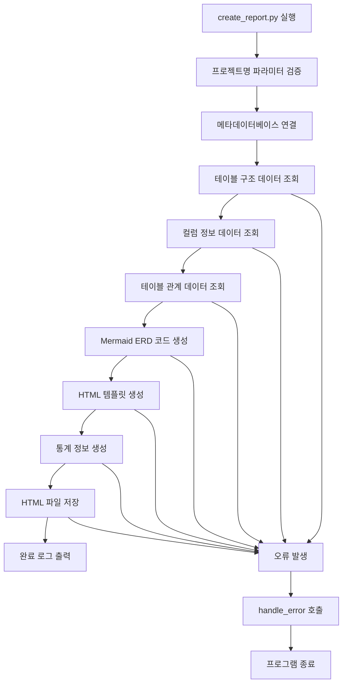
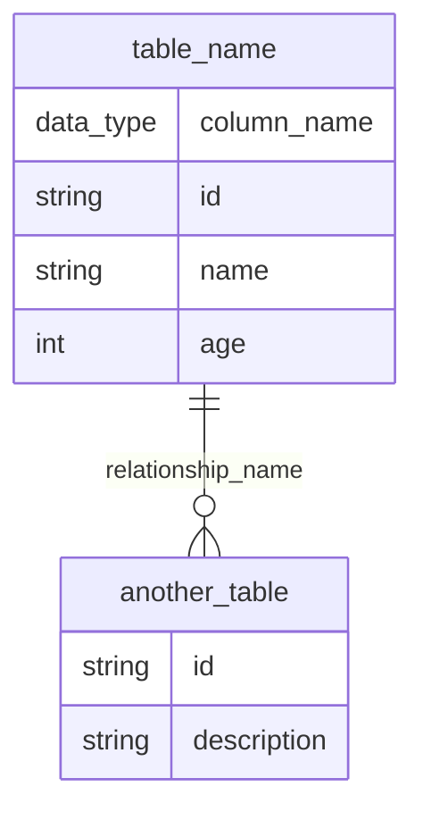

# ERD Report 생성 개발계획서

## 문서 정보
- **작성일**: 2025-01-14 14:30:00
- **버전**: v1.0
- **작성자**: SourceAnalyzer 개발팀
- **문서 목적**: 메타데이터베이스의 테이블과 컬럼 정보를 활용한 ERD(Entity Relationship Diagram) 생성 기능 개발 계획

## 1. 개요

### 1.1 개발 목표
메타데이터베이스의 테이블, 컬럼, 관계 정보를 활용하여 Mermaid 기반의 ERD(Entity Relationship Diagram)를 생성하는 기능을 개발합니다.

### 1.2 주요 기능
- **테이블 구조 표시**: 테이블명, 컬럼명, 데이터 타입, PK/FK 정보 표시
- **관계 다이어그램**: Mermaid erDiagram 문법으로 테이블 간 관계 시각화
- **통계 정보**: 테이블 수, 컬럼 수, 관계 수 표시
- **반응형 UI**: 모바일/데스크톱 환경 지원
- **다이어그램 확대/축소**: 대용량 ERD의 가독성 향상

### 1.3 출력 형식
- **파일명**: `{project_name}_ERD_{timestamp}.html`
- **저장 위치**: `./projects/{project_name}/report/`
- **형식**: HTML + CSS + JavaScript + Mermaid

## 2. 시스템 아키텍처

### 2.1 전체 플로우차트



### 2.2 파일 구조

```
CreateMetaDb/
├── create_report.py              # 메인 실행 파일 (공통)
├── reports/                      # 리포트 생성 코어 파일들
│   ├── __init__.py
│   ├── erd_report_generator.py           # ERD 리포트 생성기
│   ├── callchain_report_generator.py    # CallChain 리포트 생성기 (공통)
│   └── report_templates.py              # HTML 템플릿 관리 (공통)
└── projects/
    └── {project_name}/
        └── report/               # 생성된 리포트 저장 위치
            └── {project_name}_ERD_{timestamp}.html
```

## 3. 상세 설계

### 3.1 ERD Report 생성기: reports/erd_report_generator.py

```python
"""
ERD Report 생성기
- 테이블과 컬럼 정보를 활용한 Mermaid ERD 생성
- 테이블 간 관계 시각화
"""

import os
from datetime import datetime
from pathlib import Path
from typing import List, Dict, Any, Optional, Tuple

from util.logger import app_logger, handle_error
from util.path_utils import PathUtils
from util.database_utils import DatabaseUtils
from reports.report_templates import ReportTemplates


class ERDReportGenerator:
    """ERD Report 생성기 클래스"""
    
    def __init__(self, project_name: str, output_dir: str):
        """
        초기화
        
        Args:
            project_name: 프로젝트명
            output_dir: 출력 디렉토리
        """
        self.project_name = project_name
        self.output_dir = output_dir
        self.path_utils = PathUtils()
        self.templates = ReportTemplates()
        
        # 메타데이터베이스 연결
        self.metadata_db_path = self.path_utils.get_project_metadata_db_path(project_name)
        self.db_utils = DatabaseUtils(self.metadata_db_path)
        
        if not self.db_utils.connect():
            handle_error(Exception("데이터베이스 연결 실패"), f"메타데이터베이스 연결 실패: {self.metadata_db_path}")
    
    def generate_report(self) -> bool:
        """
        ERD Report 생성
        
        Returns:
            생성 성공 여부 (True/False)
        """
        try:
            app_logger.info(f"ERD Report 생성 시작: {self.project_name}")
            
            # 1. 통계 정보 조회
            stats = self._get_statistics()
            
            # 2. 테이블 구조 데이터 조회
            tables_data = self._get_tables_data()
            
            # 3. 테이블 관계 데이터 조회
            relationships_data = self._get_relationships_data()
            
            # 4. Mermaid ERD 코드 생성
            mermaid_code = self._generate_mermaid_erd(tables_data, relationships_data)
            
            # 5. HTML 생성
            html_content = self._generate_html(stats, mermaid_code, tables_data)
            
            # 6. 파일 저장
            output_file = self._save_report(html_content)
            
            app_logger.info(f"ERD Report 생성 완료: {output_file}")
            return True
            
        except Exception as e:
            handle_error(e, "ERD Report 생성 실패")
            return False
        finally:
            self.db_utils.disconnect()
    
    def _get_statistics(self) -> Dict[str, int]:
        """통계 정보 조회"""
        try:
            stats = {}
            
            # 테이블 수
            query = """
                SELECT COUNT(DISTINCT t.table_name) as count
                FROM tables t
                JOIN projects p ON t.project_id = p.project_id
                WHERE p.project_name = ? AND t.del_yn = 'N'
            """
            result = self.db_utils.execute_query(query, (self.project_name,))
            stats['total_tables'] = result[0]['count'] if result else 0
            
            # 컬럼 수
            query = """
                SELECT COUNT(*) as count
                FROM columns c
                JOIN tables t ON c.table_id = t.table_id
                JOIN projects p ON t.project_id = p.project_id
                WHERE p.project_name = ? AND c.del_yn = 'N'
            """
            result = self.db_utils.execute_query(query, (self.project_name,))
            stats['total_columns'] = result[0]['count'] if result else 0
            
            # JOIN 관계 수
            query = """
                SELECT COUNT(*) as count
                FROM relationships r
                JOIN projects p ON r.src_id IN (
                    SELECT c.component_id FROM components c WHERE c.project_id = p.project_id
                )
                WHERE p.project_name = ? AND r.rel_type LIKE 'JOIN_%' AND r.del_yn = 'N'
            """
            result = self.db_utils.execute_query(query, (self.project_name,))
            stats['join_relations'] = result[0]['count'] if result else 0
            
            # FK 관계 수
            query = """
                SELECT COUNT(*) as count
                FROM relationships r
                JOIN projects p ON r.src_id IN (
                    SELECT c.component_id FROM components c WHERE c.project_id = p.project_id
                )
                WHERE p.project_name = ? AND r.rel_type = 'FK' AND r.del_yn = 'N'
            """
            result = self.db_utils.execute_query(query, (self.project_name,))
            stats['fk_relations'] = result[0]['count'] if result else 0
            
            app_logger.debug(f"통계 정보 조회 완료: {stats}")
            return stats
            
        except Exception as e:
            handle_error(e, "통계 정보 조회 실패")
            return {}
    
    def _get_tables_data(self) -> List[Dict[str, Any]]:
        """테이블 구조 데이터 조회"""
        try:
            query = """
                SELECT 
                    t.table_name,
                    t.table_owner,
                    t.table_comments,
                    COUNT(c.column_id) as column_count
                FROM tables t
                LEFT JOIN columns c ON t.table_id = c.table_id AND c.del_yn = 'N'
                JOIN projects p ON t.project_id = p.project_id
                WHERE p.project_name = ? AND t.del_yn = 'N'
                GROUP BY t.table_id, t.table_name, t.table_owner, t.table_comments
                ORDER BY t.table_name
            """
            
            tables_result = self.db_utils.execute_query(query, (self.project_name,))
            
            # 각 테이블의 컬럼 정보 조회
            tables_data = []
            for table in tables_result:
                table_name = table['table_name']
                
                # 컬럼 정보 조회
                columns_query = """
                    SELECT 
                        c.column_name,
                        c.data_type,
                        c.data_length,
                        c.nullable,
                        c.column_comments,
                        c.position_pk,
                        c.data_default
                    FROM columns c
                    JOIN tables t ON c.table_id = t.table_id
                    JOIN projects p ON t.project_id = p.project_id
                    WHERE p.project_name = ? 
                      AND t.table_name = ? 
                      AND c.del_yn = 'N'
                    ORDER BY c.position_pk, c.column_name
                """
                
                columns_result = self.db_utils.execute_query(columns_query, (self.project_name, table_name))
                
                # 컬럼 정보 정제
                columns = []
                for col in columns_result:
                    columns.append({
                        'column_name': col['column_name'],
                        'data_type': col['data_type'] or 'string',
                        'data_length': col['data_length'],
                        'nullable': col['nullable'] == 'Y',
                        'column_comments': col['column_comments'],
                        'position_pk': col['position_pk'],
                        'data_default': col['data_default'],
                        'is_primary_key': col['position_pk'] is not None
                    })
                
                tables_data.append({
                    'table_name': table_name,
                    'table_owner': table['table_owner'],
                    'table_comments': table['table_comments'],
                    'column_count': table['column_count'],
                    'columns': columns
                })
            
            app_logger.debug(f"테이블 구조 데이터 조회 완료: {len(tables_data)}개 테이블")
            return tables_data
            
        except Exception as e:
            handle_error(e, "테이블 구조 데이터 조회 실패")
            return []
    
    def _get_relationships_data(self) -> List[Dict[str, Any]]:
        """테이블 관계 데이터 조회"""
        try:
            query = """
                SELECT 
                    r.rel_type,
                    t1.table_name as src_table,
                    t2.table_name as dst_table,
                    r.confidence
                FROM relationships r
                JOIN tables t1 ON r.src_id = t1.component_id
                JOIN tables t2 ON r.dst_id = t2.component_id
                JOIN projects p ON t1.project_id = p.project_id
                WHERE p.project_name = ? 
                  AND r.rel_type IN ('JOIN_EXPLICIT', 'JOIN_IMPLICIT', 'FK')
                  AND r.del_yn = 'N'
                ORDER BY t1.table_name, t2.table_name
            """
            
            results = self.db_utils.execute_query(query, (self.project_name,))
            
            relationships_data = []
            for row in results:
                relationships_data.append({
                    'rel_type': row['rel_type'],
                    'src_table': row['src_table'],
                    'dst_table': row['dst_table'],
                    'confidence': row['confidence']
                })
            
            app_logger.debug(f"테이블 관계 데이터 조회 완료: {len(relationships_data)}개 관계")
            return relationships_data
            
        except Exception as e:
            handle_error(e, "테이블 관계 데이터 조회 실패")
            return []
    
    def _generate_mermaid_erd(self, tables_data: List[Dict[str, Any]], relationships_data: List[Dict[str, Any]]) -> str:
        """Mermaid ERD 코드 생성"""
        try:
            mermaid_lines = ['erDiagram']
            
            # 테이블 정의 생성
            for table in tables_data:
                table_name = table['table_name']
                mermaid_lines.append(f'    {table_name} {{')
                
                # 컬럼 정의 추가
                for column in table['columns']:
                    column_name = column['column_name']
                    data_type = self._normalize_data_type(column['data_type'])
                    
                    # PK 표시
                    if column['is_primary_key']:
                        column_def = f'        {data_type} {column_name}'
                    else:
                        column_def = f'        {data_type} {column_name}'
                    
                    mermaid_lines.append(column_def)
                
                mermaid_lines.append('    }')
                mermaid_lines.append('')  # 빈 줄 추가
            
            # 관계 정의 생성
            for rel in relationships_data:
                src_table = rel['src_table']
                dst_table = rel['dst_table']
                rel_type = rel['rel_type']
                
                # Mermaid 관계 문법으로 변환
                if rel_type == 'JOIN_EXPLICIT':
                    mermaid_lines.append(f'    {src_table} ||--o{{ {dst_table} : "explicit_join"')
                elif rel_type == 'JOIN_IMPLICIT':
                    mermaid_lines.append(f'    {src_table} ||--o{{ {dst_table} : "implicit_join"')
                elif rel_type == 'FK':
                    mermaid_lines.append(f'    {src_table} ||--o{{ {dst_table} : "foreign_key"')
            
            mermaid_code = '\n'.join(mermaid_lines)
            app_logger.debug("Mermaid ERD 코드 생성 완료")
            return mermaid_code
            
        except Exception as e:
            handle_error(e, "Mermaid ERD 코드 생성 실패")
            return ""
    
    def _normalize_data_type(self, data_type: str) -> str:
        """데이터 타입 정규화 (Mermaid 호환)"""
        if not data_type:
            return 'string'
        
        data_type = data_type.upper()
        
        # Mermaid에서 지원하는 타입으로 변환
        type_mapping = {
            'VARCHAR': 'string',
            'CHAR': 'string',
            'TEXT': 'string',
            'CLOB': 'string',
            'INT': 'int',
            'INTEGER': 'int',
            'BIGINT': 'int',
            'SMALLINT': 'int',
            'TINYINT': 'int',
            'FLOAT': 'float',
            'DOUBLE': 'float',
            'DECIMAL': 'float',
            'NUMERIC': 'float',
            'DATE': 'date',
            'DATETIME': 'date',
            'TIMESTAMP': 'date',
            'TIME': 'string',
            'BOOLEAN': 'string',
            'BOOL': 'string',
            'BLOB': 'string',
            'BINARY': 'string'
        }
        
        return type_mapping.get(data_type, 'string')
    
    def _generate_html(self, stats: Dict[str, int], mermaid_code: str, tables_data: List[Dict[str, Any]]) -> str:
        """HTML 생성"""
        try:
            timestamp = datetime.now().strftime('%Y-%m-%d %H:%M:%S')
            
            # HTML 템플릿 생성
            html_content = self.templates.get_erd_template(
                project_name=self.project_name,
                timestamp=timestamp,
                stats=stats,
                mermaid_code=mermaid_code,
                tables_data=tables_data
            )
            
            app_logger.debug("HTML 생성 완료")
            return html_content
            
        except Exception as e:
            handle_error(e, "HTML 생성 실패")
            return ""
    
    def _save_report(self, html_content: str) -> str:
        """리포트 파일 저장"""
        try:
            timestamp = datetime.now().strftime('%Y%m%d_%H%M%S')
            filename = f"{self.project_name}_ERD_{timestamp}.html"
            output_path = os.path.join(self.output_dir, filename)
            
            with open(output_path, 'w', encoding='utf-8') as f:
                f.write(html_content)
            
            app_logger.info(f"리포트 파일 저장 완료: {output_path}")
            return output_path
            
        except Exception as e:
            handle_error(e, "리포트 파일 저장 실패")
            return ""


if __name__ == '__main__':
    # 테스트용 실행
    generator = ERDReportGenerator('sampleSrc', './temp')
    generator.generate_report()
```

### 3.2 ERD HTML 템플릿 확장: reports/report_templates.py

```python
    def get_erd_template(self, project_name: str, timestamp: str, stats: Dict[str, int], 
                        mermaid_code: str, tables_data: List[Dict[str, Any]]) -> str:
        """ERD Report HTML 템플릿 생성"""
        
        # 통계 카드 HTML 생성
        stats_html = self._generate_erd_stats_html(stats)
        
        # 테이블 정보 HTML 생성
        tables_info_html = self._generate_tables_info_html(tables_data)
        
        return f"""<!DOCTYPE html>
<html lang="ko">
<head>
    <meta charset="UTF-8">
    <meta name="viewport" content="width=device-width, initial-scale=1.0">
    <title>sampleSrc - Mermaid ERD</title>
    <script src="https://cdn.jsdelivr.net/npm/mermaid@10.6.1/dist/mermaid.min.js"></script>
    <style>
        {self._get_erd_css()}
    </style>
</head>
<body>
    <div class="container">
        <div class="header">
            <h1>Entity Relationship Diagram</h1>
            <div class="subtitle">데이터베이스 테이블 관계도</div>
            <div class="subtitle">프로젝트: {project_name} | 생성일시: {timestamp}</div>
        </div>
        {stats_html}
        <div class="content">
            <div class="section">
                <h2>ERD 다이어그램</h2>
                <div class="mermaid-container">
                    <div class="mermaid">
{mermaid_code}
                    </div>
                </div>
            </div>
            {tables_info_html}
        </div>
    </div>
    
    <script>
        {self._get_erd_javascript()}
    </script>
</body>
</html>"""
    
    def _generate_erd_stats_html(self, stats: Dict[str, int]) -> str:
        """ERD 통계 카드 HTML 생성"""
        return f"""
        <div class="stats">
            <div class="stat-card">
                <div class="stat-number">{stats.get('total_tables', 0)}</div>
                <div class="stat-label">테이블</div>
            </div>
            <div class="stat-card">
                <div class="stat-number">{stats.get('total_columns', 0)}</div>
                <div class="stat-label">컬럼</div>
            </div>
            <div class="stat-card">
                <div class="stat-number">{stats.get('join_relations', 0)}</div>
                <div class="stat-label">조인 관계</div>
            </div>
            <div class="stat-card">
                <div class="stat-number">{stats.get('fk_relations', 0)}</div>
                <div class="stat-label">외래키 관계</div>
            </div>
        </div>"""
    
    def _generate_tables_info_html(self, tables_data: List[Dict[str, Any]]) -> str:
        """테이블 정보 HTML 생성"""
        if not tables_data:
            return ""
        
        tables_html = ""
        for table in tables_data:
            columns_html = ""
            for column in table['columns']:
                pk_indicator = " (PK)" if column['is_primary_key'] else ""
                nullable_indicator = "" if column['nullable'] else " (NOT NULL)"
                columns_html += f"""
                    <tr>
                        <td>{column['column_name']}{pk_indicator}</td>
                        <td>{column['data_type']}</td>
                        <td>{column['data_length'] or '-'}</td>
                        <td>{'Y' if column['nullable'] else 'N'}{nullable_indicator}</td>
                        <td>{column['data_default'] or '-'}</td>
                        <td>{column['column_comments'] or '-'}</td>
                    </tr>"""
            
            tables_html += f"""
            <div class="table-info-section">
                <h3>테이블: {table['table_name']}</h3>
                <p><strong>소유자:</strong> {table['table_owner']}</p>
                <p><strong>컬럼 수:</strong> {table['column_count']}개</p>
                <p><strong>설명:</strong> {table['table_comments'] or '설명 없음'}</p>
                <div class="table-container">
                    <table>
                        <thead>
                            <tr>
                                <th>컬럼명</th>
                                <th>데이터타입</th>
                                <th>길이</th>
                                <th>NULL</th>
                                <th>기본값</th>
                                <th>설명</th>
                            </tr>
                        </thead>
                        <tbody>
                            {columns_html}
                        </tbody>
                    </table>
                </div>
            </div>"""
        
        return f"""
        <div class="section">
            <h2>테이블 상세 정보</h2>
            {tables_html}
        </div>"""
    
    def _get_erd_css(self) -> str:
        """ERD Report CSS 스타일"""
        return """
        body {
            font-family: 'Segoe UI', Tahoma, Geneva, Verdana, sans-serif;
            margin: 0;
            padding: 20px;
            background: linear-gradient(135deg, #667eea 0%, #764ba2 100%);
            min-height: 100vh;
        }
        
        .container {
            max-width: 1400px;
            margin: 0 auto;
            background: white;
            border-radius: 15px;
            box-shadow: 0 20px 40px rgba(0,0,0,0.1);
            overflow: hidden;
        }
        
        .header {
            background: linear-gradient(135deg, #2c3e50 0%, #34495e 100%);
            color: white;
            padding: 30px;
            text-align: center;
        }
        
        .header h1 {
            margin: 0;
            font-size: 2.5em;
            font-weight: 300;
        }
        
        .header .subtitle {
            margin: 10px 0 0 0;
            opacity: 0.8;
            font-size: 1.1em;
        }
        
        .stats {
            display: grid;
            grid-template-columns: repeat(auto-fit, minmax(200px, 1fr));
            gap: 20px;
            padding: 30px;
            background: #f8f9fa;
        }
        
        .stat-card {
            background: white;
            padding: 20px;
            border-radius: 10px;
            text-align: center;
            box-shadow: 0 5px 15px rgba(0,0,0,0.08);
            border-left: 4px solid #3498db;
        }
        
        .stat-number {
            font-size: 2em;
            font-weight: bold;
            color: #2c3e50;
            margin-bottom: 5px;
        }
        
        .stat-label {
            color: #7f8c8d;
            font-size: 0.9em;
            text-transform: uppercase;
            letter-spacing: 1px;
        }
        
        .content {
            padding: 30px;
        }
        
        .section {
            margin-bottom: 40px;
        }
        
        .section h2 {
            color: #2c3e50;
            border-bottom: 3px solid #3498db;
            padding-bottom: 10px;
            margin-bottom: 20px;
        }
        
        .mermaid-container {
            background: #f8f9fa;
            border-radius: 10px;
            padding: 20px;
            margin: 20px 0;
            border: 1px solid #e9ecef;
            position: relative;
            overflow: auto;
            max-height: 80vh;
            width: 100%;
        }
        
        .mermaid {
            text-align: center;
            width: 100%;
            min-height: 400px;
        }
        
        .table-info-section {
            margin-bottom: 30px;
            padding: 20px;
            background: #f8f9fa;
            border-radius: 10px;
            border-left: 4px solid #28a745;
        }
        
        .table-info-section h3 {
            color: #2c3e50;
            margin-top: 0;
            margin-bottom: 10px;
        }
        
        .table-info-section p {
            margin: 5px 0;
            color: #495057;
        }
        
        .table-container {
            overflow-x: auto;
            margin: 20px 0;
            border-radius: 10px;
            box-shadow: 0 5px 15px rgba(0,0,0,0.1);
        }
        
        table {
            width: 100%;
            border-collapse: collapse;
            background: white;
            font-size: 0.9em;
        }
        
        th {
            background: linear-gradient(135deg, #28a745 0%, #20c997 100%);
            color: white;
            padding: 12px 8px;
            text-align: left;
            font-weight: 600;
            position: sticky;
            top: 0;
            z-index: 10;
        }
        
        td {
            padding: 10px 8px;
            border-bottom: 1px solid #ecf0f1;
            vertical-align: top;
        }
        
        tr:hover {
            background-color: #f8f9fa;
        }
        
        @media (max-width: 768px) {
            .container {
                margin: 10px;
                border-radius: 10px;
            }
            
            .header {
                padding: 20px;
            }
            
            .header h1 {
                font-size: 2em;
            }
            
            .content {
                padding: 20px;
            }
            
            .mermaid-container {
                padding: 10px;
                max-height: 60vh;
            }
            
            table {
                font-size: 0.8em;
            }
            
            th, td {
                padding: 8px 5px;
            }
        }
        """
    
    def _get_erd_javascript(self) -> str:
        """ERD Report JavaScript"""
        return """
        // Mermaid 초기화
        mermaid.initialize({
            startOnLoad: true,
            theme: 'default',
            flowchart: {
                useMaxWidth: true,
                htmlLabels: true
            },
            er: {
                useMaxWidth: true
            }
        });
        
        // 다이어그램 확대/축소 기능
        function zoomIn() {
            const mermaidContainer = document.querySelector('.mermaid-container');
            const currentTransform = mermaidContainer.style.transform || 'scale(1)';
            const currentScale = parseFloat(currentTransform.match(/scale\\((\\d+(?:\\.\\d+)?)\\)/)?.[1] || '1');
            const newScale = Math.min(currentScale * 1.2, 3);
            mermaidContainer.style.transform = `scale(${newScale})`;
        }
        
        function zoomOut() {
            const mermaidContainer = document.querySelector('.mermaid-container');
            const currentTransform = mermaidContainer.style.transform || 'scale(1)';
            const currentScale = parseFloat(currentTransform.match(/scale\\((\\d+(?:\\.\\d+)?)\\)/)?.[1] || '1');
            const newScale = Math.max(currentScale / 1.2, 0.5);
            mermaidContainer.style.transform = `scale(${newScale})`;
        }
        
        function resetZoom() {
            const mermaidContainer = document.querySelector('.mermaid-container');
            mermaidContainer.style.transform = 'scale(1)';
        }
        
        // 확대/축소 버튼 추가
        document.addEventListener('DOMContentLoaded', function() {
            const mermaidContainer = document.querySelector('.mermaid-container');
            if (mermaidContainer) {
                const zoomControls = document.createElement('div');
                zoomControls.innerHTML = `
                    <div style="position: absolute; top: 10px; right: 10px; z-index: 1000;">
                        <button onclick="zoomIn()" style="margin: 2px; padding: 5px 10px; background: #3498db; color: white; border: none; border-radius: 3px; cursor: pointer;">+</button>
                        <button onclick="zoomOut()" style="margin: 2px; padding: 5px 10px; background: #3498db; color: white; border: none; border-radius: 3px; cursor: pointer;">-</button>
                        <button onclick="resetZoom()" style="margin: 2px; padding: 5px 10px; background: #e74c3c; color: white; border: none; border-radius: 3px; cursor: pointer;">Reset</button>
                    </div>
                `;
                mermaidContainer.style.position = 'relative';
                mermaidContainer.appendChild(zoomControls);
            }
        });
        
        // 다이어그램 렌더링 완료 후 이벤트 처리
        mermaid.init();
        """
```

## 4. 데이터베이스 쿼리 설계

### 4.1 테이블 구조 조회 쿼리

```sql
-- 테이블 기본 정보 조회
SELECT 
    t.table_name,
    t.table_owner,
    t.table_comments,
    COUNT(c.column_id) as column_count
FROM tables t
LEFT JOIN columns c ON t.table_id = c.table_id AND c.del_yn = 'N'
JOIN projects p ON t.project_id = p.project_id
WHERE p.project_name = ? AND t.del_yn = 'N'
GROUP BY t.table_id, t.table_name, t.table_owner, t.table_comments
ORDER BY t.table_name;

-- 테이블별 컬럼 상세 정보 조회
SELECT 
    c.column_name,
    c.data_type,
    c.data_length,
    c.nullable,
    c.column_comments,
    c.position_pk,
    c.data_default
FROM columns c
JOIN tables t ON c.table_id = t.table_id
JOIN projects p ON t.project_id = p.project_id
WHERE p.project_name = ? 
  AND t.table_name = ? 
  AND c.del_yn = 'N'
ORDER BY c.position_pk, c.column_name;
```

### 4.2 테이블 관계 조회 쿼리

```sql
-- 테이블 간 관계 조회
SELECT 
    r.rel_type,
    t1.table_name as src_table,
    t2.table_name as dst_table,
    r.confidence
FROM relationships r
JOIN tables t1 ON r.src_id = t1.component_id
JOIN tables t2 ON r.dst_id = t2.component_id
JOIN projects p ON t1.project_id = p.project_id
WHERE p.project_name = ? 
  AND r.rel_type IN ('JOIN_EXPLICIT', 'JOIN_IMPLICIT', 'FK')
  AND r.del_yn = 'N'
ORDER BY t1.table_name, t2.table_name;
```

## 5. Mermaid ERD 문법 규칙

### 5.1 ERD 다이어그램 문법



### 5.2 관계 타입 매핑

| 메타데이터 관계 타입 | Mermaid 관계 문법 | 설명 |
|---------------------|------------------|------|
| JOIN_EXPLICIT | `||--o{` | 명시적 조인 관계 |
| JOIN_IMPLICIT | `||--o{` | 암시적 조인 관계 |
| FK | `||--o{` | 외래키 관계 |

### 5.3 데이터 타입 정규화

```python
def _normalize_data_type(self, data_type: str) -> str:
    """데이터 타입 정규화 (Mermaid 호환)"""
    type_mapping = {
        'VARCHAR': 'string',
        'CHAR': 'string',
        'TEXT': 'string',
        'INT': 'int',
        'INTEGER': 'int',
        'BIGINT': 'int',
        'FLOAT': 'float',
        'DOUBLE': 'float',
        'DECIMAL': 'float',
        'DATE': 'date',
        'DATETIME': 'date',
        'TIMESTAMP': 'date',
        'BOOLEAN': 'string'
    }
    return type_mapping.get(data_type.upper(), 'string')
```

## 6. 에러 처리 및 로깅

### 6.1 에러 처리 규칙
- 모든 exception 발생 시 `handle_error()`로 exit() 처리
- warning 후 계속 실행하지 않고 에러로 처리
- 파싱 에러를 제외한 모든 exception은 치명적 오류로 처리

### 6.2 로깅 규칙
- `util.logger` 모듈의 공통 로깅 함수 사용
- 파일명.라인번호 포함한 상세 로그 기록
- SourceAnalyzer_{timestamp}.log 파일에 기록

## 7. 개발 가이드라인

### 7.1 하드코딩 금지
- 모든 경로는 `util.path_utils` 모듈 사용
- 설정값은 `config/target_source_config.yaml`에서 로드
- 프로젝트명은 명령행 파라미터로 전달

### 7.2 공통 함수 활용
- 경로 관련: `PathUtils` 클래스 사용
- 데이터베이스 관련: `DatabaseUtils` 클래스 사용
- 로깅 관련: `logger` 모듈 함수 사용

### 7.3 Mermaid 문법 준수
- Mermaid 10.6.1 버전 호환성 유지
- ERD 문법 규칙 준수
- 한글 및 특수문자 처리

## 8. 테스트 계획

### 8.1 단위 테스트
- ERD 생성기 클래스별 메서드 테스트
- Mermaid 코드 생성 테스트
- 데이터 타입 정규화 테스트

### 8.2 통합 테스트
- 전체 ERD 생성 플로우 테스트
- 다양한 테이블 구조로 테스트
- 대용량 ERD 렌더링 테스트

### 8.3 브라우저 호환성 테스트
- Chrome, Firefox, Safari, Edge 테스트
- 모바일 브라우저 테스트
- Mermaid 렌더링 품질 검증

## 9. 배포 및 운영

### 9.1 배포 방법
```bash
# ERD Report 생성
python create_report.py --project-name sampleSrc --report-type erd

# 모든 리포트 생성
python create_report.py --project-name sampleSrc --report-type all
```

### 9.2 출력 파일
- **위치**: `./projects/{project_name}/report/`
- **형식**: HTML 파일
- **명명규칙**: `{project_name}_ERD_{timestamp}.html`

### 9.3 성능 최적화
- 대용량 ERD의 경우 가독성을 위한 확대/축소 기능 제공
- 테이블 수가 많은 경우 페이지 분할 고려
- Mermaid 렌더링 최적화

## 10. 참고 자료

### 10.1 관련 문서
- [메타데이터베이스스키마정의서.md](./메타데이터베이스스키마정의서.md)
- [CallChainReport생성_개발계획서.md](./CallChainReport생성_개발계획서_20250114_143000.md)

### 10.2 샘플 리포트
- `D:\Analyzer\reports\sample_report\ERD_20250903_221048.html`

### 10.3 Mermaid 참고 자료
- [Mermaid ERD 문서](https://mermaid.js.org/syntax/entityRelationshipDiagram.html)
- [Mermaid 라이브러리](https://cdn.jsdelivr.net/npm/mermaid@10.6.1/dist/mermaid.min.js)

### 10.4 유틸리티 모듈
- `util/path_utils.py`: 경로 처리 유틸리티
- `util/database_utils.py`: 데이터베이스 처리 유틸리티
- `util/logger.py`: 로깅 및 에러 처리 유틸리티
