# 20250914_170000_최종_5단계개발계획서_02_메타데이터베이스스키마정의

## 1. 개요

SourceAnalyzer 시스템의 메타데이터베이스 스키마는 프로젝트 분석 결과를 효율적으로 저장하고 관리하기 위해 설계되었습니다. 이 스키마는 `database/create_table_script.sql`을 기준으로 하며, 프로젝트의 파일, 클래스, 컴포넌트, 테이블, 컬럼 및 이들 간의 관계를 체계적으로 정의합니다.

### 1.1. 스키마 버전

*   **버전**: v2.0 (최적화된 메타데이터 스키마)
*   **기준 파일**: `database/create_table_script.sql`
*   **시간대**: 한국 시간대(KST) 적용 (UTC+9)
*   **동적 활용**: `./project` 폴더의 파일들을 동적으로 활용하여 성능 최적화

### 1.2. 연결 관계 정리

*   **components**: 관계의 대상이 되는 모든 객체 저장 (jsp, method, query, table, column)
*   **relationships**: 모든 관계를 통합 관리 (컴포넌트 간, 컬럼 간, 테이블 간 관계)
*   **classes**: 클래스 정보를 별도 테이블로 관리하여 정확한 관계 모델링 지원
*   **parent_id**: components 테이블의 계층 구조 및 다양한 테이블과의 관계 표현

## 2. ERD (Entity Relationship Diagram)

```mermaid
erDiagram
    projects {
        int project_id
        string project_name
        string project_path
        string hash_value
        date created_at
        date updated_at
        string del_yn
        int total_files
    }

    files {
        int file_id
        int project_id
        string file_path
        string file_name
        string file_type
        string has_error
        string error_message
        string hash_value
        date created_at
        date updated_at
        string del_yn
        int line_count
    }

    classes {
        int class_id
        int project_id
        int file_id
        string class_name
        int parent_class_id
        int line_start
        int line_end
        string has_error
        string error_message
        string hash_value
        date created_at
        date updated_at
        string del_yn
    }

    components {
        int component_id
        int project_id
        int file_id
        string component_name
        string component_type
        int parent_id
        string layer
        int line_start
        int line_end
        string has_error
        string error_message
        string hash_value
        date created_at
        date updated_at
        string del_yn
    }

    tables {
        int table_id
        int project_id
        int component_id
        string table_name
        string table_owner
        string table_comments
        string has_error
        string error_message
        string hash_value
        date created_at
        date updated_at
        string del_yn
    }

    columns {
        int column_id
        int table_id
        int component_id
        string column_name
        string data_type
        int data_length
        string nullable
        string column_comments
        int position_pk
        string data_default
        string owner
        string has_error
        string error_message
        string hash_value
        date created_at
        date updated_at
        string del_yn
    }

    relationships {
        int relationship_id
        int src_id
        int dst_id
        string rel_type
        float confidence
        string has_error
        string error_message
        string hash_value
        date created_at
        date updated_at
        string del_yn
    }

    projects ||--o{ files : "has"
    projects ||--o{ classes : "contains"
    projects ||--o{ components : "contains"
    projects ||--o{ tables : "defines"
    files ||--o{ classes : "contains"
    files ||--o{ components : "contains"
    classes ||--o{ classes : "parent_class_id"
    classes ||--o{ components : "parent_id"
    components ||--o{ tables : "defines"
    components ||--o{ relationships : "src_id"
    components ||--o{ relationships : "dst_id"
    tables ||--o{ columns : "has"
    columns ||--o{ components : "component_id"
```

## 3. 테이블 상세 정의

**총 테이블 수**: 7개 (projects, files, classes, components, tables, columns, relationships)

### 3.1. projects (프로젝트 메타데이터)

프로젝트의 기본 정보를 저장하는 테이블입니다.

| 컬럼명          | 데이터타입        | 제약조건                                  | 설명          |
| ------------ | ------------ | ------------------------------------- | ----------- |
| project_id   | INTEGER      | PRIMARY KEY, AUTOINCREMENT            | 프로젝트 고유 ID  |
| project_name | VARCHAR(100) | NOT NULL                              | 프로젝트명       |
| project_path | VARCHAR(500) | NOT NULL                              | 프로젝트 경로     |
| hash_value   | VARCHAR(64)  |                                       | 변경 감지용 해시값  |
| created_at   | DATETIME     | DEFAULT (datetime('now', '+9 hours')) | 생성일시        |
| updated_at   | DATETIME     | DEFAULT (datetime('now', '+9 hours')) | 수정일시        |
| del_yn       | CHAR(1)      | DEFAULT 'N'                           | 삭제 여부 (Y/N) |
| total_files  | INTEGER      | DEFAULT 0                             | 전체 파일 수     |

### 3.2. files (파일 인덱스)

분석 대상 파일들의 최소 정보를 저장하는 테이블입니다.

| 컬럼명           | 데이터타입        | 제약조건                                  | 설명                          |
| ------------- | ------------ | ------------------------------------- | --------------------------- |
| file_id       | INTEGER      | PRIMARY KEY, AUTOINCREMENT            | 파일 고유 ID                    |
| project_id    | INTEGER      | NOT NULL, FK                          | 프로젝트 ID                     |
| file_path     | VARCHAR(500) | NOT NULL                              | 상대경로                        |
| file_name     | VARCHAR(200) | NOT NULL                              | 파일명                         |
| file_type     | VARCHAR(20)  |                                       | 파일 타입 (java, jsp, sql, xml) |
| has_error     | CHAR(1)      | DEFAULT 'N'                           | 오류 여부 (Y/N)                 |
| error_message | TEXT         |                                       | 오류 메시지                      |
| hash_value    | VARCHAR(64)  | NOT NULL                              | 변경 감지용 해시값                  |
| created_at    | DATETIME     | DEFAULT (datetime('now', '+9 hours')) | 생성일시                        |
| updated_at    | DATETIME     | DEFAULT (datetime('now', '+9 hours')) | 수정일시                        |
| del_yn        | CHAR(1)      | DEFAULT 'N'                           | 삭제 여부 (Y/N)                 |
| line_count    | INTEGER      |                                       | 라인 수                        |

**외래키 관계:**

*   `project_id` → `projects.project_id`

### 3.3. classes (클래스 정보)

클래스의 기본 정보를 저장하는 테이블입니다.

| 컬럼명             | 데이터타입        | 제약조건                                  | 설명              |
| --------------- | ------------ | ------------------------------------- | --------------- |
| class_id        | INTEGER      | PRIMARY KEY, AUTOINCREMENT            | 클래스 고유 ID       |
| project_id      | INTEGER      | NOT NULL, FK                          | 프로젝트 ID         |
| file_id         | INTEGER      | NOT NULL, FK                          | 파일 ID           |
| class_name      | VARCHAR(200) | NOT NULL                              | 클래스명            |
| parent_class_id | INTEGER      | FK                                    | 상속/구현 부모 클래스 ID |
| line_start      | INTEGER      |                                       | 시작 라인           |
| line_end        | INTEGER      |                                       | 종료 라인           |
| has_error       | CHAR(1)      | DEFAULT 'N'                           | 오류 여부 (Y/N)     |
| error_message   | TEXT         |                                       | 오류 메시지          |
| hash_value      | VARCHAR(64)  |                                       | 변경 감지용 해시값      |
| created_at      | DATETIME     | DEFAULT (datetime('now', '+9 hours')) | 생성일시            |
| updated_at      | DATETIME     | DEFAULT (datetime('now', '+9 hours')) | 수정일시            |
| del_yn          | CHAR(1)      | DEFAULT 'N'                           | 삭제 여부 (Y/N)     |

**외래키 관계:**

*   `project_id` → `projects.project_id`
*   `file_id` → `files.file_id`
*   `parent_class_id` → `classes.class_id` (상속/구현 부모 클래스 참조)

**인덱스:**

*   `ix_classes_01`: (class_name, file_id, project_id) - UNIQUE
*   `ix_classes_02`: (parent_class_id) - 일반 인덱스

### 3.4. components (코드 구성 요소)

클래스, 메서드, SQL 쿼리, 테이블, 컬럼, JSP 등 모든 코드 구성 요소의 기본 정보를 저장하는 허브 테이블입니다.

| 컬럼명            | 데이터타입        | 제약조건                                  | 설명                                                                                              |
| -------------- | ------------ | ------------------------------------- | ----------------------------------------------------------------------------------------------- |
| component_id   | INTEGER      | PRIMARY KEY, AUTOINCREMENT            | 구성요소 고유 ID                                                                                      |
| project_id     | INTEGER      | NOT NULL, FK                          | 프로젝트 ID                                                                                         |
| file_id        | INTEGER      | NOT NULL, FK                          | 파일 ID                                                                                           |
| component_name | VARCHAR(200) | NOT NULL                              | 구성요소명                                                                                           |
| component_type | VARCHAR(20)  | NOT NULL                              | 구성요소 타입 (JSP, METHOD, SQL_SELECT, SQL_INSERT, SQL_UPDATE, SQL_DELETE, SQL_MERGE, TABLE, COLUMN, CLASS) |
| parent_id      | INTEGER      |                                       | 부모 컴포넌트 ID (COLUMN일때는 TABLE의 component_id, METHOD일때는 CLASS의 class_id)                                                                              |
| layer          | VARCHAR(30)  |                                       | 계층 (controller, service, mapper, model, dao, view, jsp, xml, db, application)                                |
| line_start     | INTEGER      |                                       | 시작 라인                                                                                           |
| line_end       | INTEGER      |                                       | 종료 라인                                                                                           |
| has_error      | CHAR(1)      | DEFAULT 'N'                           | 오류 여부 (Y/N)                                                                                     |
| error_message  | TEXT         |                                       | 오류 메시지                                                                                          |
| hash_value     | VARCHAR(64)  |                                       | 변경 감지용 해시값                                                                                      |
| created_at     | DATETIME     | DEFAULT (datetime('now', '+9 hours')) | 생성일시                                                                                            |
| updated_at     | DATETIME     | DEFAULT (datetime('now', '+9 hours')) | 수정일시                                                                                            |
| del_yn         | CHAR(1)      | DEFAULT 'N'                           | 삭제 여부 (Y/N)                                                                                     |

**외래키 관계:**

*   `project_id` → `projects.project_id`
*   `file_id` → `files.file_id`

**인덱스:**

*   `ix_components_01`: (component_name, file_id, project_id) - UNIQUE

### 3.5. tables (데이터베이스 테이블 정보)

데이터베이스 테이블 정보를 저장하는 테이블입니다.

| 컬럼명            | 데이터타입        | 제약조건                                  | 설명          |
| -------------- | ------------ | ------------------------------------- | ----------- |
| table_id       | INTEGER      | PRIMARY KEY, AUTOINCREMENT            | 테이블 고유 ID   |
| project_id     | INTEGER      | NOT NULL, FK                          | 프로젝트 ID     |
| component_id   | INTEGER      | FK                                    | 구성요소 ID     |
| table_name     | VARCHAR(100) | NOT NULL                              | 테이블명        |
| table_owner    | VARCHAR(50)  | NOT NULL                              | 테이블 소유자     |
| table_comments | TEXT         |                                       | 테이블 코멘트     |
| has_error      | CHAR(1)      | DEFAULT 'N'                           | 오류 여부 (Y/N) |
| error_message  | TEXT         |                                       | 오류 메시지      |
| hash_value     | VARCHAR(64)  |                                       | 변경 감지용 해시값  |
| created_at     | DATETIME     | DEFAULT (datetime('now', '+9 hours')) | 생성일시        |
| updated_at     | DATETIME     | DEFAULT (datetime('now', '+9 hours')) | 수정일시        |
| del_yn         | CHAR(1)      | DEFAULT 'N'                           | 삭제 여부 (Y/N) |

**외래키 관계:**

*   `project_id` → `projects.project_id`
*   `component_id` → `components.component_id`

**인덱스:**

*   `ix_tables_01`: (table_name, table_owner, project_id) - UNIQUE

### 3.6. columns (데이터베이스 컬럼 정보)

데이터베이스 컬럼 정보를 저장하는 테이블입니다.

| 컬럼명             | 데이터타입        | 제약조건                                  | 설명                   |
| --------------- | ------------ | ------------------------------------- | -------------------- |
| column_id       | INTEGER      | PRIMARY KEY, AUTOINCREMENT            | 컬럼 고유 ID             |
| table_id        | INTEGER      | NOT NULL, FK                          | 테이블 ID               |
| component_id    | INTEGER      | FK                                    | 컴포넌트 ID (COLUMN 타입) |
| column_name     | VARCHAR(100) | NOT NULL                              | 컬럼명                  |
| data_type       | VARCHAR(50)  |                                       | 데이터 타입               |
| data_length     | INTEGER      |                                       | 데이터 길이               |
| nullable        | CHAR(1)      | DEFAULT 'Y'                           | NULL 허용 여부           |
| column_comments | TEXT         |                                       | 컬럼 코멘트               |
| position_pk     | INTEGER      |                                       | PK 순번 (null이면 PK 아님) |
| data_default    | TEXT         |                                       | 기본값                  |
| owner           | VARCHAR(50)  |                                       | 소유자                  |
| has_error       | CHAR(1)      | DEFAULT 'N'                           | 오류 여부 (Y/N)          |
| error_message   | TEXT         |                                       | 오류 메시지               |
| hash_value      | VARCHAR(64)  |                                       | 변경 감지용 해시값           |
| created_at      | DATETIME     | DEFAULT (datetime('now', '+9 hours')) | 생성일시                 |
| updated_at      | DATETIME     | DEFAULT (datetime('now', '+9 hours')) | 수정일시                 |
| del_yn          | CHAR(1)      | DEFAULT 'N'                           | 삭제 여부 (Y/N)          |

**외래키 관계:**

*   `table_id` → `tables.table_id`
*   `component_id` → `components.component_id`

**인덱스:**

*   `ix_columns_01`: (table_id, column_name) - UNIQUE

### 3.7. relationships (통합 관계 정보)

모든 관계를 통합 관리하는 테이블입니다.

| 컬럼명             | 데이터타입       | 제약조건                                  | 설명                                                                                            |
| --------------- | ----------- | ------------------------------------- | --------------------------------------------------------------------------------------------- |
| relationship_id | INTEGER     | PRIMARY KEY, AUTOINCREMENT            | 관계 고유 ID                                                                                      |
| src_id          | INTEGER     | NOT NULL, FK                          | 소스 ID (component_id, table_id, column_id 등)                                                   |
| dst_id          | INTEGER     | NOT NULL, FK                          | 대상 ID (component_id, table_id, column_id 등)                                                   |
| rel_type        | VARCHAR(30) | NOT NULL                              | 관계 타입 (CALL_QUERY, CALL_METHOD, USE_TABLE, FK, PK, JOIN_EXPLICIT, JOIN_IMPLICIT, QUERY_TABLE, INHERITANCE) |
| confidence      | FLOAT       | DEFAULT 1.0                           | 신뢰도                                                                                           |
| has_error       | CHAR(1)     | DEFAULT 'N'                           | 오류 여부 (Y/N)                                                                                   |
| error_message   | TEXT        |                                       | 오류 메시지                                                                                        |
| created_at      | DATETIME    | DEFAULT (datetime('now', '+9 hours')) | 생성일시                                                                                          |
| updated_at      | DATETIME    | DEFAULT (datetime('now', '+9 hours')) | 수정일시                                                                                          |
| del_yn          | CHAR(1)     | DEFAULT 'N'                           | 삭제 여부 (Y/N)                                                                                   |

**외래키 관계:**

*   `src_id` → `components.component_id` (모든 관계의 소스)
*   `dst_id` → `components.component_id` (모든 관계의 대상)

**제약조건:**

*   `CHECK (src_id != dst_id)`: 자기 자신과의 관계 방지

**인덱스:**

*   `ix_relationships_01`: (src_id, dst_id, rel_type) - UNIQUE

## 4. SQL Content 데이터베이스

### 4.1. 개요

정제된 SQL 내용을 gzip 압축하여 저장하는 전용 데이터베이스입니다. 3단계 XML 파싱 과정에서 추출된 정제된 SQL 내용을 압축하여 저장하며, 2차 개발 리포트에서 활용됩니다.

### 4.2. 데이터베이스 구조

**데이터베이스 경로**: `./projects/{project_name}/SqlContent.db`

**생성 스크립트**: `database/create_sql_content_db.sql`

### 4.3. sql_contents 테이블

정제된 SQL 내용을 저장하는 핵심 테이블입니다.

#### 테이블 구조

| 컬럼명 | 타입 | 제약조건 | 설명 |
|--------|------|----------|------|
| content_id | INTEGER | PRIMARY KEY AUTOINCREMENT | SQL 내용 고유 ID |
| project_id | INTEGER | NOT NULL | 프로젝트 ID (Foreign Key) |
| file_id | INTEGER | | XML 파일 ID (Foreign Key) |
| component_id | INTEGER | | 컴포넌트 ID (Foreign Key) |
| component_name | VARCHAR(200) | | 컴포넌트명 |
| sql_content_compressed | BLOB | NOT NULL | gzip 압축된 정제된 SQL 내용 |
| query_type | VARCHAR(20) | NOT NULL | 쿼리 타입 (SQL_SELECT, SQL_INSERT, SQL_UPDATE, SQL_DELETE, SQL_MERGE) |
| file_path | VARCHAR(500) | | 파일 경로 |
| file_name | VARCHAR(200) | | 파일명 |
| line_start | INTEGER | | 시작 라인 |
| line_end | INTEGER | | 종료 라인 |
| hash_value | VARCHAR(64) | | SQL 내용 해시값 |
| error_message | TEXT | | 오류 메시지 |
| created_at | DATETIME | DEFAULT CURRENT_TIMESTAMP | 생성일시 |
| updated_at | DATETIME | DEFAULT CURRENT_TIMESTAMP | 수정일시 |
| del_yn | CHAR(1) | DEFAULT 'N' | 삭제 여부 |

#### 인덱스

*   `ix_sql_contents_01`: (project_id, created_at) - 프로젝트별 시간순 조회
*   `ix_sql_contents_02`: (query_type, created_at) - 쿼리 타입별 시간순 조회
*   `ix_sql_contents_03`: (file_path, created_at) - 파일별 시간순 조회
*   `ix_sql_contents_04`: (component_name, created_at) - 컴포넌트별 시간순 조회
*   `ix_sql_contents_05`: (hash_value) - 해시값으로 중복 검사

## 5. 관계 타입 (rel_type)

`relationships` 테이블의 `rel_type` 컬럼에서 사용 가능한 값들:

### 5.1. Java 관계

*   **CALL_QUERY**: 메서드 → 쿼리 호출 관계
*   **CALL_METHOD**: 메서드 → 메서드 호출 관계
*   **USE_TABLE**: 메서드 → 테이블 사용 관계
*   **INHERITANCE**: 클래스 → 클래스 상속 관계

### 5.2. 데이터베이스 관계

*   **FK**: 외래키 관계
*   **PK**: 기본키 관계
*   **JOIN_EXPLICIT**: 명시적 조인 관계
*   **JOIN_IMPLICIT**: 암시적 조인 관계
*   **QUERY_TABLE**: 쿼리-테이블 관계

## 6. 성능 최적화 특징

1.  **변경 감지**: 모든 테이블에 `hash_value` 컬럼으로 변경 감지
2.  **소프트 삭제**: `del_yn` 컬럼으로 논리적 삭제 지원
3.  **오류 추적**: `has_error`, `error_message`로 오류 상태 관리
4.  **인덱스 최적화**: 자주 조회되는 컬럼 조합에 인덱스 생성
5.  **중복 방지**: UNIQUE 인덱스로 데이터 무결성 보장

---
