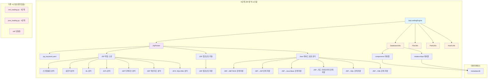
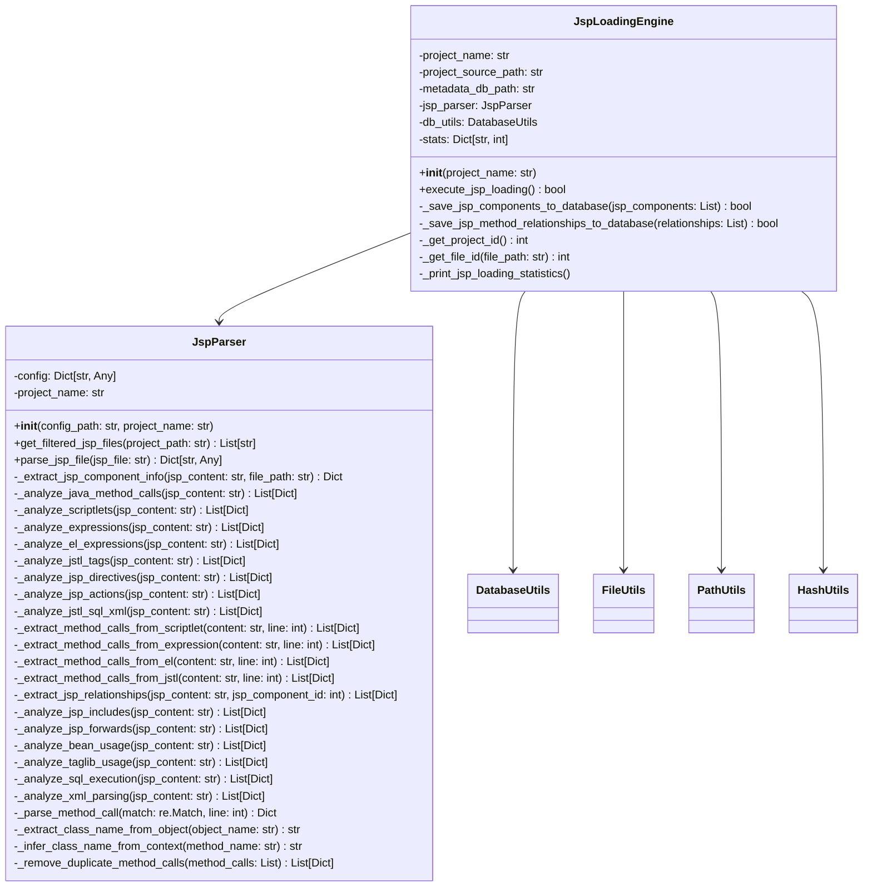
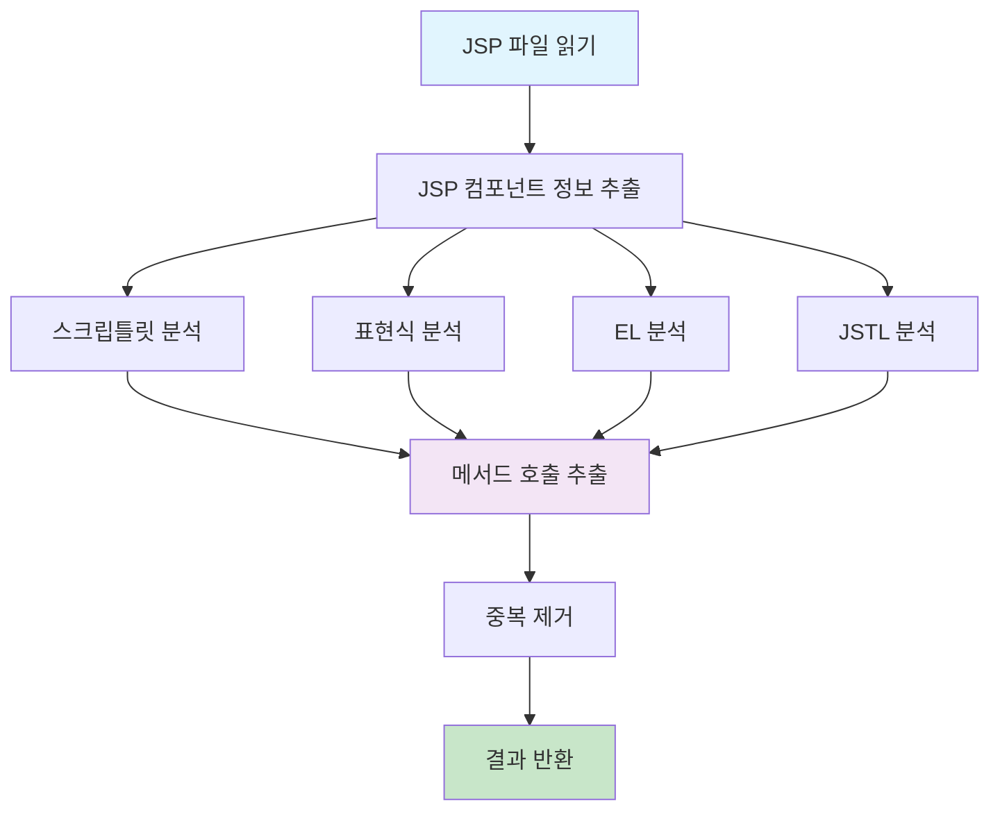

# 최종 5단계 개발계획서 - 2장: 아키텍처 설계

## 문서 정보
- **작성일**: 2025-09-14 18:48:41
- **작성자**: AI Assistant
- **문서 유형**: 최종 통합 개발계획서
- **대상 단계**: 5단계 - JSP 파일 분석 및 컴포넌트 등록
- **문서 버전**: v1.0 (최종 통합본)

## 📋 목차

1. [개요 및 요구사항](./20250914_184841_최종_5단계개발계획서_01_개요및요구사항.md)
2. [아키텍처 설계](./20250914_184841_최종_5단계개발계획서_02_아키텍처설계.md) ← **현재 문서**
3. [상세 구현 계획](./20250914_184841_최종_5단계개발계획서_03_상세구현계획.md)
4. [소스코드 구현 가이드](./20250914_184841_최종_5단계개발계획서_04_소스코드구현가이드.md)
5. [테스트 및 검증 계획](./20250914_184841_최종_5단계개발계획서_05_테스트및검증계획.md)

---

## 1. 전체 아키텍처 개요

### 1.1 5단계 아키텍처 다이어그램



### 1.2 아키텍처 설계 원칙

#### 1.2.1 독립성 보장
- **완전 분리**: 5단계는 기존 3-4단계와 완전히 독립적으로 동작
- **공통 함수 재사용**: util 모듈의 기존 함수들을 수정 없이 재사용
- **설정 파일 분리**: JSP 전용 설정 파일로 독립성 확보

#### 1.2.2 확장성 고려
- **모듈화 설계**: 각 기능별로 독립적인 모듈로 설계
- **설정 기반 동작**: 하드코딩 없이 설정 파일로 동작 제어
- **플러그인 구조**: 새로운 JSP 태그나 분석 로직을 쉽게 추가 가능

#### 1.2.3 성능 최적화
- **스트리밍 처리**: 메모리 효율적인 파일 처리
- **배치 처리**: 데이터베이스 저장 시 배치 처리로 성능 향상
- **메모리 모니터링**: 실시간 메모리 사용량 추적

---

## 2. 파일 구조 설계

### 2.1 전체 파일 구조

```
CreateMetaDb/
├── jsp_loading.py              # 5단계 메인 엔진 (새로 생성)
├── parser/
│   ├── jsp_parser.py           # JSP 파싱 로직 (새로 생성)
│   ├── xml_parser.py            # 3단계 (기존 유지 - 절대 수정 금지)
│   └── java_parser.py           # 4단계 (기존 유지 - 절대 수정 금지)
├── config\parser\
│   ├── jsp_keyword.yaml        # JSP 파싱 설정 (새로 생성)
│   ├── mybatis_keyword.yaml     # 3단계 (기존 유지)
│   └── java_keyword.yaml        # 4단계 (기존 유지)
├── util/                        # 공통 유틸리티 (기존 유지 - 절대 수정 금지)
│   ├── database_utils.py
│   ├── file_utils.py
│   ├── path_utils.py
│   ├── hash_utils.py
│   ├── config_utils.py
│   └── logger.py
├── main.py                      # 메인 실행 파일 (5단계 호출 추가)
├── file_loading.py              # 1-2단계 (기존 유지)
└── xml_loading.py               # 3단계 (기존 유지)
```

### 2.2 새로 생성할 파일들

#### 2.2.1 jsp_loading.py (5단계 메인 엔진)
```python
"""
5단계 JSP 파일 분석 및 컴포넌트 등록
- JSP 파일 파싱 및 JSP 컴포넌트 정보 추출
- JSP → Java 메서드 관계 분석
- 메모리 최적화를 통한 스트리밍 처리
"""

class JspLoadingEngine:
    """5단계 JSP 로딩 엔진"""
    
    def __init__(self, project_name: str):
        """JSP 로딩 엔진 초기화"""
        
    def execute_jsp_loading(self) -> bool:
        """5단계 처리 실행"""
        
    def _save_jsp_components_to_database(self, jsp_components: List[Dict[str, Any]]) -> bool:
        """JSP 컴포넌트를 components 테이블에 저장"""
        
    def _save_jsp_method_relationships_to_database(self, relationships: List[Dict[str, Any]]) -> bool:
        """JSP → METHOD 관계를 relationships 테이블에 저장"""
```

#### 2.2.2 parser/jsp_parser.py (JSP 파싱 로직)
```python
"""
JSP 파일 파싱 및 분석 로직
- JSP 파일 수집 및 필터링
- JSP 컴포넌트 정보 추출
- Java 메서드 호출 분석
"""

class JspParser:
    """JSP 파서 - 5단계 통합 처리"""
    
    def __init__(self, config_path: str = None, project_name: str = None):
        """JSP 파서 초기화"""
        
    def get_filtered_jsp_files(self, project_path: str = None) -> List[str]:
        """JSP 파일 수집 및 필터링"""
        
    def parse_jsp_file(self, jsp_file: str) -> Dict[str, Any]:
        """JSP 파일에서 컴포넌트 정보 추출 및 Java 메서드 관계 분석"""
        
    def _extract_jsp_component_info(self, jsp_content: str, file_path: str) -> Dict[str, Any]:
        """JSP 파일에서 JSP 컴포넌트 정보 추출"""
        
    def _analyze_java_method_calls(self, jsp_content: str) -> List[Dict[str, Any]]:
        """JSP 파일에서 Java 메서드 호출 분석"""
```

#### 2.2.3 JSP 파싱 설정 (path_utils.get_parser_config_path 방식) - **매뉴얼 기반 확장**
```yaml
# JSP 파싱을 위한 키워드 및 패턴 설정 (Jakarta Server Pages 3.1 스펙 기반)

# 기존 JSP 요소 패턴
jsp_scriptlet_patterns:
  - r'<%([^%]+)%>'  # 스크립틀릿

jsp_expression_patterns:
  - r'<%=([^%]+)%>'  # 표현식

jsp_el_patterns:
  - r'\$\{([^}]+)\}'  # EL 표현식

jsp_jstl_patterns:
  - r'<c:([^>]+)>'  # JSTL Core
  - r'<fmt:([^>]+)>'  # JSTL Formatting
  - r'<sql:([^>]+)>'  # JSTL SQL
  - r'<x:([^>]+)>'  # JSTL XML
  - r'\$\{fn:([^}]+)\}'  # JSTL Functions

# 매뉴얼 기반 추가 패턴
jsp_directive_patterns:
  - r'<%@\s*page\s+([^%]+)%>'  # page 디렉티브
  - r'<%@\s*include\s+([^%]+)%>'  # include 디렉티브
  - r'<%@\s*taglib\s+([^%]+)%>'  # taglib 디렉티브

jsp_action_patterns:
  - r'<jsp:([^>]+)>'  # JSP 액션 태그
  - r'<jsp:include\s+([^>]+)>'  # include 액션
  - r'<jsp:forward\s+([^>]+)>'  # forward 액션
  - r'<jsp:useBean\s+([^>]+)>'  # useBean 액션
  - r'<jsp:setProperty\s+([^>]+)>'  # setProperty 액션
  - r'<jsp:getProperty\s+([^>]+)>'  # getProperty 액션

# 관계 도출을 위한 패턴
java_method_call_patterns:
  - r'(\w+)\.(\w+)\s*\('  # object.method()
  - r'(\w+)\s*\([^)]*\)'  # method()

jsp_include_patterns:
  - r'file\s*=\s*["\']([^"\']+)["\']'  # include file 속성
  - r'page\s*=\s*["\']([^"\']+)["\']'  # include page 속성

jsp_bean_patterns:
  - r'class\s*=\s*["\']([^"\']+)["\']'  # useBean class 속성
  - r'id\s*=\s*["\']([^"\']+)["\']'  # useBean id 속성

jsp_taglib_patterns:
  - r'uri\s*=\s*["\']([^"\']+)["\']'  # taglib uri 속성
  - r'prefix\s*=\s*["\']([^"\']+)["\']'  # taglib prefix 속성

# 클래스명 매핑
class_name_mapping:
  userService: UserService
  userController: UserController
  orderService: OrderService

method_class_mapping:
  getUserList: UserService
  saveUser: UserService
  getOrderList: OrderService
```

---

## 3. 클래스 구조 설계

### 3.1 JspLoadingEngine 클래스

#### 3.1.1 클래스 다이어그램


#### 3.1.2 주요 메서드 설계

**JspLoadingEngine.execute_jsp_loading()**:
```python
def execute_jsp_loading(self) -> bool:
    """
    5단계 처리 실행
    
    처리 과정:
    1. 데이터베이스 연결
    2. JSP 파일 수집
    3. JSP 파일별 통합 처리
    4. 통계 정보 출력
    5. 데이터베이스 연결 해제
    
    Returns:
        bool: 처리 성공 여부
    """
```

**JspParser.parse_jsp_file()**:
```python
def parse_jsp_file(self, jsp_file: str) -> Dict[str, Any]:
    """
    JSP 파일에서 컴포넌트 정보 추출 및 Java 메서드 관계 분석
    
    Args:
        jsp_file: JSP 파일 경로
        
    Returns:
        Dict[str, Any]: JSP 컴포넌트 정보와 Java 메서드 관계 정보
        {
            'jsp_component': {...},
            'java_method_relationships': [...],
            'file_path': '...',
            'has_error': 'N'/'Y',
            'error_message': '...'
        }
    """
```

### 3.2 JspParser 클래스

#### 3.2.1 JSP 분석 플로우


#### 3.2.2 JSP 요소별 분석 메서드

**스크립틀릿 분석**:
```python
def _analyze_scriptlets(self, jsp_content: str) -> List[Dict[str, Any]]:
    """
    스크립틀릿 분석
    
    분석 대상:
    - <% ... %> 태그 내 Java 코드
    - 객체 메서드 호출: object.method()
    - 직접 메서드 호출: method()
    
    Returns:
        List[Dict]: 스크립틀릿에서 추출된 메서드 호출 정보
    """
```

**표현식 분석**:
```python
def _analyze_expressions(self, jsp_content: str) -> List[Dict[str, Any]]:
    """
    표현식 분석
    
    분석 대상:
    - <%= ... %> 태그 내 Java 표현식
    - 주로 메서드 호출 결과 출력
    
    Returns:
        List[Dict]: 표현식에서 추출된 메서드 호출 정보
    """
```

**EL 분석**:
```python
def _analyze_el_expressions(self, jsp_content: str) -> List[Dict[str, Any]]:
    """
    EL 표현식 분석
    
    분석 대상:
    - ${...} 표현식 언어
    - 메서드 호출: ${object.method()}
    - 프로퍼티 접근: ${object.property} (getter 메서드로 간주)
    
    Returns:
        List[Dict]: EL에서 추출된 메서드 호출 정보
    """
```

**JSTL 분석**:
```python
def _analyze_jstl_tags(self, jsp_content: str) -> List[Dict[str, Any]]:
    """
    JSTL 태그 분석
    
    분석 대상:
    - <c:forEach>, <c:if> 등 JSTL Core 태그
    - <fmt:formatDate> 등 JSTL Formatting 태그
    - 태그 내 EL 표현식에서 메서드 호출
    
    Returns:
        List[Dict]: JSTL에서 추출된 메서드 호출 정보
    """
```

---

## 4. 데이터베이스 스키마 활용

### 4.1 components 테이블 활용

#### 4.1.1 JSP 컴포넌트 저장
```sql
INSERT INTO components (
    project_id,
    component_type,
    component_name,
    parent_id,
    file_id,
    line_start,
    line_end,
    hash_value,
    has_error,
    error_message,
    del_yn
) VALUES (
    ?, 'JSP', ?, NULL, ?, ?, ?, ?, 'N', NULL, 'N'
);
```

#### 4.1.2 JSP 컴포넌트 데이터 구성
```python
jsp_component_data = {
    'project_id': 1,
    'component_type': 'JSP',
    'component_name': 'userList.jsp',
    'parent_id': None,  # JSP는 독립적인 컴포넌트
    'file_id': 1001,    # files 테이블의 file_id
    'line_start': 1,
    'line_end': 150,
    'hash_value': 'a1b2c3d4e5f6...',
    'has_error': 'N',
    'error_message': None,
    'del_yn': 'N'
}
```

### 4.2 relationships 테이블 활용

#### 4.2.1 JSP → METHOD 관계 저장
```sql
INSERT INTO relationships (
    src_id,
    dst_id,
    rel_type,
    confidence,
    has_error,
    error_message,
    hash_value,
    del_yn
) VALUES (
    ?, ?, 'CALL_METHOD', 1.0, 'N', NULL, '-', 'N'
);
```

#### 4.2.2 관계 데이터 구성
```python
relationship_data = {
    'src_id': 2001,      # JSP 컴포넌트 ID
    'dst_id': 1001,      # METHOD 컴포넌트 ID
    'rel_type': 'CALL_METHOD',
    'confidence': 1.0,
    'has_error': 'N',
    'error_message': None,
    'hash_value': '-',   # USER RULES: 하드코딩된 '-'
    'del_yn': 'N'
}
```

### 4.3 기존 컴포넌트와의 연결

#### 4.3.1 METHOD 컴포넌트 조회
```python
def _get_method_component_id(self, project_id: int, class_name: str, method_name: str) -> Optional[int]:
    """
    4단계에서 생성된 METHOD 컴포넌트 ID 조회
    
    Args:
        project_id: 프로젝트 ID
        class_name: 클래스명
        method_name: 메서드명
        
    Returns:
        Optional[int]: METHOD 컴포넌트 ID (없으면 None)
    """
    # 4단계에서 생성된 METHOD 컴포넌트와 연결
    # components 테이블에서 component_type='METHOD' 조회
```

#### 4.3.2 inferred 컴포넌트 생성
```python
def _create_inferred_method_component(self, project_id: int, class_name: str, method_name: str) -> int:
    """
    JSP에서 호출되지만 4단계에서 생성되지 않은 메서드를 inferred 컴포넌트로 생성
    
    Args:
        project_id: 프로젝트 ID
        class_name: 클래스명
        method_name: 메서드명
        
    Returns:
        int: 생성된 METHOD 컴포넌트 ID
    """
    # inferred METHOD 컴포넌트 생성
    # components 테이블에 component_type='METHOD'로 저장
```

---

## 5. 메모리 최적화 아키텍처

### 5.1 스트리밍 처리 설계

#### 5.1.1 파일별 순차 처리
```python
def execute_jsp_loading(self) -> bool:
    """5단계 처리 실행 - 스트리밍 처리"""
    try:
        # JSP 파일 수집
        jsp_files = self.jsp_parser.get_filtered_jsp_files()
        
        # 파일별 순차 처리 (스트리밍)
        for jsp_file in jsp_files:
            # 1. 파일 읽기
            jsp_content = self.file_utils.read_file(jsp_file)
            
            # 2. 분석 처리
            result = self.jsp_parser.parse_jsp_file(jsp_file)
            
            # 3. 즉시 저장
            self._save_jsp_components_to_database([result['jsp_component']])
            self._save_jsp_method_relationships_to_database(result['java_method_relationships'])
            
            # 4. 메모리 해제
            del jsp_content
            
    except Exception as e:
        handle_error(e, "JSP 로딩 실패")
```

#### 5.1.2 메모리 모니터링
```python
import psutil

def _monitor_memory_usage(self):
    """메모리 사용량 모니터링"""
    memory_percent = psutil.virtual_memory().percent
    
    if memory_percent > 90:
        handle_error(Exception(f"메모리 사용률 {memory_percent}% 초과"), "메모리 부족")
    elif memory_percent > 80:
        warning(f"메모리 사용률 {memory_percent}% - 주의 필요")
    
    info(f"현재 메모리 사용률: {memory_percent}%")
```

### 5.2 배치 처리 설계

#### 5.2.1 컴포넌트 배치 저장
```python
def _save_jsp_components_to_database(self, jsp_components: List[Dict[str, Any]]) -> bool:
    """JSP 컴포넌트 배치 저장"""
    try:
        if not jsp_components:
            return True
        
        # 배치 저장으로 DB 연결 횟수 최소화
        processed_count = self.db_utils.batch_insert_or_replace('components', jsp_components)
        
        if processed_count > 0:
            info(f"JSP 컴포넌트 배치 저장 완료: {processed_count}개")
            return True
        else:
            handle_error(Exception("JSP 컴포넌트 저장 실패"), "JSP 컴포넌트 저장 실패")
            
    except Exception as e:
        handle_error(e, "JSP 컴포넌트 저장 실패")
```

---

## 6. 오류 처리 아키텍처

### 6.1 오류 처리 계층 구조

```mermaid
graph TD
    A[JSP 파일 처리] --> B{파일 읽기 성공?}
    B -->|성공| C[JSP 파싱]
    B -->|실패| D[파싱 에러 처리]
    
    C --> E{파싱 성공?}
    E -->|성공| F[컴포넌트 저장]
    E -->|실패| D
    
    F --> G{저장 성공?}
    G -->|성공| H[다음 파일 처리]
    G -->|실패| I[시스템 에러 처리]
    
    D --> J[has_error='Y' 설정]
    J --> H
    
    I --> K[handle_error() 호출]
    K --> L[프로그램 종료]
    
    style D fill:#fff3e0
    style I fill:#ffebee
    style L fill:#ffcdd2
```

### 6.2 오류 처리 구현

#### 6.2.1 파싱 에러 처리
```python
def parse_jsp_file(self, jsp_file: str) -> Dict[str, Any]:
    """JSP 파일 파싱 - 파싱 에러는 계속 진행"""
    try:
        # JSP 파일 읽기
        jsp_content = self.file_utils.read_file(jsp_file)
        if not jsp_content:
            return {
                'jsp_component': None,
                'java_method_relationships': [],
                'file_path': jsp_file,
                'has_error': 'Y',
                'error_message': 'JSP 파일 읽기 실패'
            }
        
        # JSP 분석 처리
        # ... 분석 로직 ...
        
    except Exception as e:
        # USER RULES: 파싱 에러는 has_error='Y', error_message 남기고 계속 진행
        warning(f"JSP 파일 파싱 실패: {jsp_file}, 오류: {str(e)}")
        return {
            'jsp_component': None,
            'java_method_relationships': [],
            'file_path': jsp_file,
            'has_error': 'Y',
            'error_message': f'JSP 파일 파싱 실패: {str(e)}'
        }
```

#### 6.2.2 시스템 에러 처리
```python
def execute_jsp_loading(self) -> bool:
    """5단계 처리 실행 - 시스템 에러는 프로그램 종료"""
    try:
        # 데이터베이스 연결
        self.db_utils = DatabaseUtils(self.metadata_db_path)
        
        # JSP 파일 처리
        # ... 처리 로직 ...
        
    except Exception as e:
        # USER RULES: 시스템 에러는 handle_error()로 exit
        handle_error(e, "JSP 로딩 실행 실패")
        return False
```

---

## 7. 설정 파일 아키텍처

### 7.1 설정 파일 구조

#### 7.1.1 jsp_keyword.yaml 구조
```yaml
# JSP 파싱을 위한 키워드 및 패턴 설정

# JSP 태그 패턴
jsp_scriptlet_patterns:
  - r'<%([^%]+)%>'  # 스크립틀릿

jsp_expression_patterns:
  - r'<%=([^%]+)%>'  # 표현식

jsp_el_patterns:
  - r'\$\{([^}]+)\}'  # EL 표현식

jsp_jstl_patterns:
  - r'<c:([^>]+)>'  # JSTL Core
  - r'<fmt:([^>]+)>'  # JSTL Formatting
  - r'<sql:([^>]+)>'  # JSTL SQL
  - r'<x:([^>]+)>'  # JSTL XML

# Java 메서드 호출 패턴
java_method_call_patterns:
  - r'(\w+)\.(\w+)\s*\('  # object.method()
  - r'(\w+)\s*\([^)]*\)'  # method()

# 클래스명 매핑 (객체명 → 클래스명)
class_name_mapping:
  userService: UserService
  userController: UserController
  orderService: OrderService
  productService: ProductService

# 메서드-클래스 매핑 (메서드명 → 클래스명)
method_class_mapping:
  getUserList: UserService
  saveUser: UserService
  deleteUser: UserService
  getOrderList: OrderService
  saveOrder: OrderService

# JSP 예약어
jsp_reserved_keywords:
  - page
  - include
  - taglib
  - directive
```

#### 7.1.2 설정 파일 로딩
```python
def __init__(self, config_path: str = None, project_name: str = None):
    """JSP 파서 초기화"""
    try:
        self.project_name = project_name
        
        # USER RULES: 하드코딩 지양 - 설정 파일에서 패턴 로드
        # 설정 파일 로드 (크로스플랫폼 대응)
        from util import PathUtils, ConfigUtils
        path_utils = PathUtils()
        config_utils = ConfigUtils()
        
        if config_path is None:
            # 공통함수 사용 (크로스플랫폼 대응)
            config_path = path_utils.get_parser_config_path("jsp")
        
        self.config = config_utils.load_yaml_config(config_path)
        
        info(f"JSP 파서 초기화 완료: {config_path}")
        
    except Exception as e:
        handle_error(e, "JSP 파서 초기화 실패")
```

---

## 8. 통합 및 확장성

### 8.1 main.py 통합

#### 8.1.1 main.py 수정 (5단계 호출 추가)
```python
def main():
    """메인 실행 함수"""
    try:
        # 인자 파싱
        args = parse_arguments()
        project_name = args.project_name
        
        # 1-2단계: 파일 스캔 및 DB 구조 저장
        file_loading_engine = FileLoadingEngine(project_name)
        if not file_loading_engine.execute_file_loading():
            handle_error(Exception("1-2단계 실행 실패"), "파일 로딩 실패")
        
        # 3단계: XML 분석
        xml_loading_engine = XmlLoadingEngine(project_name)
        if not xml_loading_engine.execute_xml_loading():
            handle_error(Exception("3단계 실행 실패"), "XML 로딩 실패")
        
        # 4단계: Java 분석
        java_loading_engine = JavaLoadingEngine(project_name)
        if not java_loading_engine.execute_java_loading():
            handle_error(Exception("4단계 실행 실패"), "Java 로딩 실패")
        
        # 5단계: JSP 분석 (새로 추가)
        jsp_loading_engine = JspLoadingEngine(project_name)
        if not jsp_loading_engine.execute_jsp_loading():
            handle_error(Exception("5단계 실행 실패"), "JSP 로딩 실패")
        
        info("모든 단계 완료")
        
    except Exception as e:
        handle_error(e, "메인 실행 실패")
```

### 8.2 확장성 고려사항

#### 8.2.1 새로운 JSP 태그 지원
- `jsp_keyword.yaml`에 새로운 JSP 태그 패턴 추가
- `_analyze_jstl_tags()`에 새로운 태그 처리 로직 추가

#### 8.2.2 새로운 메서드 호출 패턴 지원
- `jsp_keyword.yaml`에 새로운 메서드 호출 패턴 추가
- `_extract_method_calls_from_*()` 메서드에 새로운 패턴 처리 로직 추가

#### 8.2.3 새로운 관계 타입 지원
- `rel_type`에 새로운 관계 타입 추가
- `relationships` 테이블에 새로운 관계 저장 로직 추가

---

## 9. 메뉴얼 활용 방안

### 9.1 공식 문서 참조

#### 9.1.1 메뉴얼 폴더 구조
```
parser/manual/
├── 02_jsp/                      # JSP 관련 메뉴얼
│   ├── jakarta-server-pages-spec-3.1.pdf  ✅ **보유**
│   └── README.md
└── 99_common/                   # 공통 가이드
    ├── 파서별_메뉴얼_매핑_가이드.md  ✅ **중요**
    └── 추가_메뉴얼_다운로드_링크.md
```

#### 9.1.2 메뉴얼 기반 개발 프로세스
1. **스펙 문서 확인**: Jakarta Server Pages 3.1 스펙에서 공식 문법 확인
2. **키워드 추출**: 스펙 문서에서 공식 키워드 및 패턴 추출
3. **설정 파일 업데이트**: 추출된 키워드를 `jsp_keyword.yaml`에 반영
4. **테스트 케이스 작성**: 스펙 문서의 예제 코드로 테스트 케이스 작성
5. **엣지 케이스 검증**: 스펙 문서의 엣지 케이스로 파서 검증

### 9.2 관계 도출 중심 메뉴얼 활용

#### 9.2.1 JSP 디렉티브 분석 (매뉴얼 기반)
- **Jakarta Server Pages 3.1 스펙** 참조
- **include 디렉티브**: JSP → JSP 관계 도출
- **taglib 디렉티브**: JSP → 태그 라이브러리 관계 도출

#### 9.2.2 JSP 액션 태그 분석 (매뉴얼 기반)
- **JSP Tag Library Reference** 참조
- **include 액션**: JSP → JSP 관계 도출
- **forward 액션**: JSP → JSP 관계 도출
- **useBean 액션**: JSP → Java Bean 관계 도출

#### 9.2.3 JSTL 라이브러리 분석 (매뉴얼 기반)
- **JSTL Reference** 참조
- **JSTL SQL**: JSP → SQL 관계 도출
- **JSTL XML**: JSP → XML 관계 도출
- **JSTL Functions**: 함수 호출 관계 도출

### 9.3 추가 메뉴얼 다운로드 권장사항

#### 9.3.1 높은 우선순위 (즉시 다운로드 권장)
1. **JSP Tag Library Reference** - JSP 액션 태그 분석 필수
2. **JSTL Reference** - JSTL 전체 라이브러리 분석 필수
3. **JSP Custom Tag Development Guide** - 커스텀 태그 분석 필수

#### 9.3.2 중간 우선순위 (단계별 다운로드)
1. **Jakarta Expression Language Specification** - EL 고급 기능
2. **JSP API Documentation** - JSP API 분석
3. **Servlet API Documentation** - JSP-Servlet 연동 분석

---

## 10. 다음 단계

다음 문서에서는 상세 구현 계획을 제시합니다:
- [3. 상세 구현 계획](./20250914_184841_최종_5단계개발계획서_03_상세구현계획.md)

---

## 📚 참조 문서

### 관련 문서
- **[처리플로우_상세_5단계.md](../처리플로우_상세_5단계.md)**: 5단계 처리플로우 상세 문서
- **[메타데이터베이스스키마정의서.md](../메타데이터베이스스키마정의서.md)**: 데이터베이스 스키마 구조 상세

### 기존 아키텍처 문서 (참고용)
- **[20250914_022700_5단계개발계획서_02_JSP파서설계.md](./20250914_022700_5단계개발계획서_02_JSP파서설계.md)**: 기존 JSP 파서 설계
- **[20250914_023000_5단계개발계획서_05_메모리최적화.md](./20250914_023000_5단계개발계획서_05_메모리최적화.md)**: 기존 메모리 최적화 문서

### 설정 파일
- **[create_table_script.sql](../../database/create_table_script.sql)**: 메타데이터베이스 스키마 정의 원본 파일

---

**문서 작성 완료**: 2025-09-14 18:48:41  
**문서 버전**: v1.0 (최종 통합본)  
**다음 문서**: [3. 상세 구현 계획](./20250914_184841_최종_5단계개발계획서_03_상세구현계획.md)
