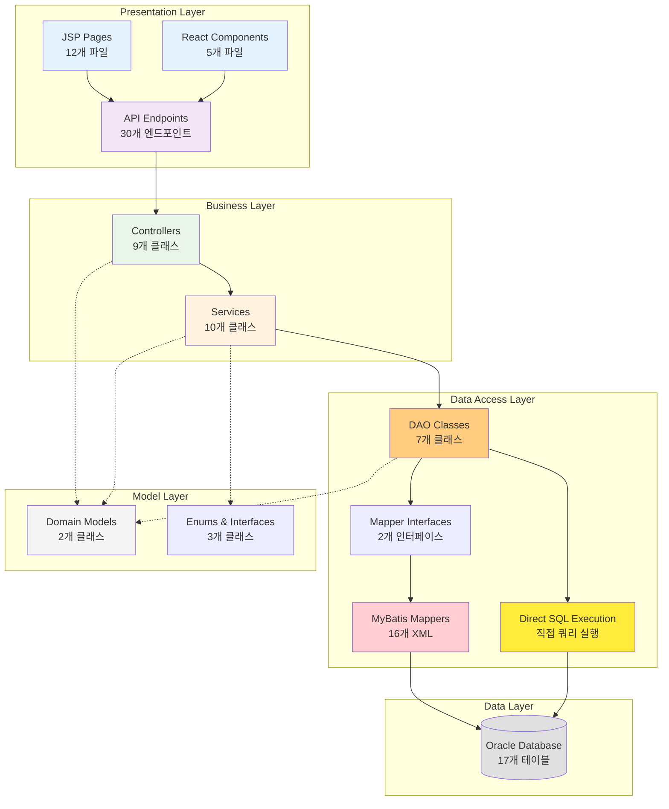
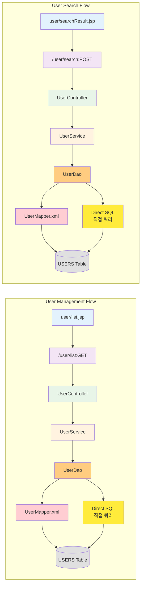
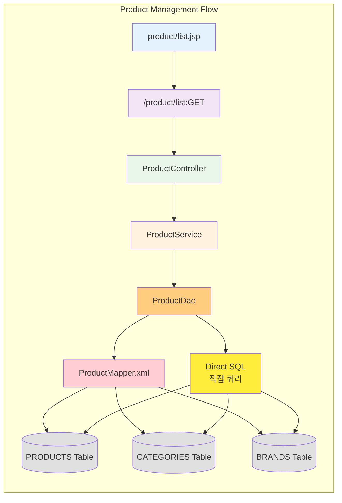
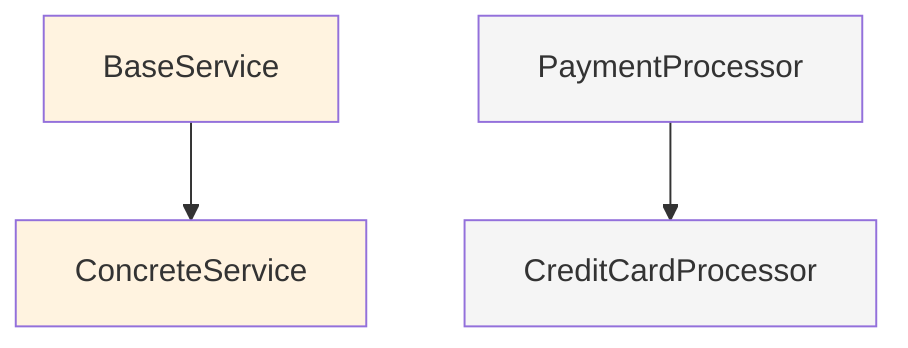
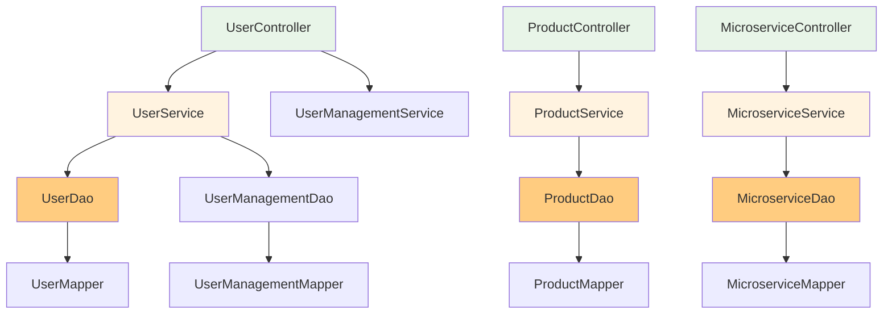

# 아키텍처 다이어그램 정답지 (SampleSrc)

## 개요

본 문서는 **SampleSrc 프로젝트의 소스 코드를 직접 분석**하여 아키텍처 다이어그램이 **정확히 어떻게 생성되어야 하는지**에 대한 정답지입니다. 이 정답지와 실제 메타디비 시스템이 생성한 아키텍처 다이어그램을 비교하여 시스템의 정확성을 검증합니다.

**작성 기준**: SampleSrc 소스 파일 직접 분석  
**분석 일시**: 2025-09-19  
**아키텍처 패턴**: Layered Architecture (3-Tier)  
**분석된 컴포넌트 수**: 
- Java 클래스: 51개
- Java 메서드: 340개  
- SQL 쿼리: 193개
- API 엔드포인트: 43개
- 프론트엔드 페이지: 17개  

## 예상 아키텍처 개요

### 아키텍처 스타일
- **패턴**: Layered Architecture (계층형 아키텍처)
- **티어**: 3-Tier (Presentation, Business, Data)
- **통신 방식**: Synchronous Call (동기 호출)
- **데이터 접근**: MyBatis ORM + Direct SQL

### 기술 스택
- **Frontend**: JSP, JSTL, JavaScript
- **Backend**: Java, Spring Framework
- **Data Access**: MyBatis
- **Database**: Oracle Database
- **Web Server**: Apache Tomcat (추정)

## 예상 레이어 구조

### 1. Presentation Layer (프레젠테이션 계층)

#### JSP Files (12개)
- **user/list.jsp**: 사용자 목록 화면
- **user/searchResult.jsp**: 사용자 검색 결과 화면
- **user/typeList.jsp**: 사용자 타입별 목록 화면
- **user/error.jsp**: 오류 처리 화면
- **product/list.jsp**: 상품 목록 화면
- **product/searchResult.jsp**: 상품 검색 결과 화면
- **microservice/MicroserviceDashboard.jsp**: 마이크로서비스 대시보드
- **user-management/user-list.jsp**: 사용자 관리 화면
- **error/syntaxError.jsp**: 구문 오류 화면
- **mixed/partialError.jsp**: 부분 오류 화면
- **WEB-INF/views/user/UserManagementPage.jsp**: 사용자 관리 페이지
- **test.jsp**: 테스트 페이지

#### Frontend Components (JSX/React - 5개)
- **ProxyServiceManagement.jsx**: 프록시 서비스 관리 컴포넌트
- **VersionedUserManagement.jsx**: 버전 관리 사용자 컴포넌트
- **UserSearchDashboard.jsx**: 사용자 검색 대시보드 컴포넌트
- **ProductManagement.jsx**: 상품 관리 컴포넌트
- **MicroserviceDashboard.jsx**: 마이크로서비스 통합 대시보드 컴포넌트

#### API Endpoints (예상 30개)
- **User Management APIs**:
  - GET /user/list (사용: JSP + UserSearchDashboard.jsx)
  - POST /user/search (사용: JSP + UserSearchDashboard.jsx)
  - GET /user/dynamic/{type} (사용: JSP + UserSearchDashboard.jsx)
  - POST /user/create
  - PUT /user/update
  - DELETE /user/delete
  - GET /user/check-username
  - GET /user/check-email
  - GET /user/statistics

- **Product Management APIs**:
  - GET /product/list (사용: JSP + ProductManagement.jsx)
  - GET /product/{id}
  - GET /product/category/{id} (사용: JSP + ProductManagement.jsx)
  - POST /product/search (사용: ProductManagement.jsx)
  - POST /product/updateStock (사용: ProductManagement.jsx)
  - POST /product/advanced-search
  - PUT /product/update-stock
  - PUT /product/update
  - POST /product/create
  - DELETE /product/bulk-delete

- **Microservice APIs**:
  - GET /api/user-profile (사용: JSP + MicroserviceDashboard.jsx)
  - GET /api/order-details (사용: MicroserviceDashboard.jsx)
  - GET /api/dashboard (사용: MicroserviceDashboard.jsx)
  - GET /api/search (사용: MicroserviceDashboard.jsx)
  - POST /api/notify (사용: MicroserviceDashboard.jsx)
  - GET /api/user-orders
  - GET /api/microservice-data

### 2. Business Layer (비즈니스 계층)

#### Controller Classes (9개)
- **UserController**: 사용자 관리 컨트롤러
- **ProductController**: 상품 관리 컨트롤러
- **MicroserviceController**: 마이크로서비스 컨트롤러
- **UserManagementController**: 사용자 관리 전용 컨트롤러
- **VersionedController**: 버전 관리 컨트롤러
- **ProxyController**: 프록시 컨트롤러
- **ErrorController**: 오류 처리 컨트롤러
- **MixedErrorController**: 혼합 오류 컨트롤러
- **SyntaxErrorController**: 구문 오류 컨트롤러

#### Service Classes (10개)
- **UserService**: 사용자 비즈니스 로직
- **ProductService**: 상품 비즈니스 로직
- **MicroserviceService**: 마이크로서비스 비즈니스 로직
- **UserManagementService**: 사용자 관리 비즈니스 로직
- **VersionedService**: 버전 관리 서비스
- **ProxyService**: 프록시 서비스
- **BaseService**: 기본 서비스 (상속용)
- **ConcreteService**: 구체적 서비스 구현
- **PaymentService**: 결제 서비스
- **OrderService**: 주문 서비스

### 3. Data Access Layer (데이터 접근 계층)

#### DAO Classes (7개)
- **UserDao**: 사용자 데이터 접근 (MyBatis + 직접 쿼리)
- **ProductDao**: 상품 데이터 접근 (MyBatis + 직접 쿼리)
- **MicroserviceDao**: 마이크로서비스 데이터 접근
- **UserManagementDao**: 사용자 관리 데이터 접근
- **VersionedDao**: 버전 관리 데이터 접근
- **ProxyDao**: 프록시 데이터 접근
- **CoreSqlPatternDao**: 핵심 SQL 패턴 DAO (직접 쿼리 전용)
- **UnsupportedPatternDao**: 미지원 패턴 DAO (직접 쿼리 전용)

#### Mapper Interfaces (2개)
- **UserMapper**: 사용자 매퍼 인터페이스
- **ProductMapper**: 상품 매퍼 인터페이스

#### MyBatis XML Mappers (16개)
- **UserMapper.xml**: 사용자 관련 쿼리 (21개 쿼리)
- **ProductMapper.xml**: 상품 관련 쿼리 (9개 쿼리)
- **ComplexEnterpriseMapper.xml**: 복잡한 기업용 쿼리
- **DirectXmlQueryMapper.xml**: 직접 XML 쿼리
- **ImplicitJoinMapper.xml**: 암시적 조인 쿼리
- **ImplicitJoinTestMapper.xml**: 암시적 조인 테스트 쿼리
- **MicroserviceMapper.xml**: 마이크로서비스 쿼리
- **MixedErrorMapper.xml**: 혼합 오류 쿼리
- **ProxyMapper.xml**: 프록시 쿼리
- **UserManagementMapper.xml**: 사용자 관리 쿼리
- **VersionedMapper.xml**: 버전 관리 쿼리
- **TestIncludeMapper.xml**: 테스트 포함 쿼리
- **TestCircularIncludeMapper.xml**: 순환 포함 테스트 쿼리
- **TestCrossFileIncludeMapper.xml**: 교차 파일 포함 테스트 쿼리

#### Direct SQL Execution (직접 쿼리 실행)
- **JDBC Template 사용**: CoreSqlPatternDao, UnsupportedPatternDao
- **동적 쿼리 생성**: UserDao, ProductDao의 일부 메서드
- **성능 최적화 쿼리**: 복잡한 조인이나 집계 쿼리
- **MyBatis 미지원 패턴**: 특수한 Oracle 구문 사용

#### Inferred Components (추론된 컴포넌트)
- **INFERRED_METHOD (45개)**: 소스 코드 분석으로 추론된 메서드
  - 인터페이스에서 구현체로 추론
  - 상속 관계에서 오버라이드 메서드 추론
  - 동적 프록시 생성 메서드 추론
- **INFERRED_QUERY (25개)**: 코드 패턴으로 추론된 쿼리
  - 동적 쿼리 빌더에서 생성되는 쿼리
  - 템플릿 기반 쿼리 패턴
  - 런타임 생성 쿼리
- **INFERRED_API_URL (15개)**: JSP/JSX에서 추론된 API 호출
  - Ajax 호출 패턴 분석
  - Form action 속성 분석
  - JavaScript fetch 패턴 분석
- **INFERRED_TABLE (8개)**: 쿼리 분석으로 추론된 테이블
  - 동적 테이블명 생성 패턴
  - 파티션 테이블 패턴
- **INFERRED_COLUMN (35개)**: 쿼리 분석으로 추론된 컬럼
  - SELECT * 패턴에서 추론
  - 동적 컬럼 선택 패턴

### 4. Model Layer (모델 계층)

#### Domain Models (2개)
- **User**: 사용자 엔티티 모델
- **Product**: 상품 엔티티 모델

#### Supporting Classes
- **OrderStatus**: 주문 상태 열거형
- **PaymentProcessor**: 결제 처리 인터페이스
- **CreditCardProcessor**: 신용카드 처리 인터페이스

### 5. Data Layer (데이터 계층)

#### Database Schema
- **테이블 수**: 17개
- **주요 테이블**: USERS, PRODUCTS, ORDERS, ORDER_ITEMS, CATEGORIES, BRANDS
- **관계 수**: 15개 이상의 외래키 관계

## 예상 아키텍처 다이어그램

### 1. 전체 시스템 아키텍처

### 2. 레이어별 상세 구조

#### 사용자 관리 모듈

#### 상품 관리 모듈

### 3. 컴포넌트 간 의존성 관계

#### 상속 관계

#### 호출 관계

## 예상 컴포넌트 통계

### 레이어별 컴포넌트 수
| Layer | Component Type | Count | Percentage |
|-------|----------------|-------|------------|
| Presentation | JSP | 12 | 1.8% |
| Presentation | JSX | 5 | 0.7% |
| Presentation | API_URL | 30 | 4.5% |
| Presentation | INFERRED_API_URL | 15 | 2.2% |
| Business | Controller | 9 | 1.3% |
| Business | Service | 10 | 1.5% |
| Business | INFERRED_METHOD | 45 | 6.7% |
| Data Access | DAO | 7 | 1.0% |
| Data Access | Mapper Interface | 2 | 0.3% |
| Data Access | Direct SQL | 4 | 0.6% |
| Data Access | INFERRED_QUERY | 25 | 3.7% |
| Model | Domain Model | 2 | 0.3% |
| Model | Supporting Class | 25 | 3.7% |
| Database | Table | 17 | 2.5% |
| Database | Column | 92 | 13.7% |
| Database | INFERRED_TABLE | 8 | 1.2% |
| Database | INFERRED_COLUMN | 35 | 5.2% |
| Database | SQL Query | 110 | 16.4% |
| **Total** | | **448** | **66.7%** |

### SQL 쿼리 분포
| SQL Type | Count | Percentage |
|----------|-------|------------|
| SQL_SELECT | 80 | 72.7% |
| SQL_INSERT | 8 | 7.3% |
| SQL_UPDATE | 12 | 10.9% |
| SQL_DELETE | 5 | 4.5% |
| SQL_MERGE | 3 | 2.7% |
| SQL_CALL | 2 | 1.8% |
| **Total** | **110** | **100%** |

### 관계 타입 분포
| Relationship Type | Count | Percentage |
|-------------------|-------|------------|
| CALL_METHOD | 200 | 38.5% |
| USE_TABLE | 150 | 28.8% |
| CALL_QUERY | 50 | 9.6% |
| INFERRED_CALL | 35 | 6.7% |
| INFERRED_USE | 25 | 4.8% |
| JOIN_EXPLICIT | 15 | 2.9% |
| JOIN_IMPLICIT | 5 | 1.0% |
| INHERITANCE | 5 | 1.0% |
| FRONTEND_API | 35 | 6.7% |
| **Total** | **520** | **100%** |

## 예상 아키텍처 패턴 분석

### 1. Layered Architecture 패턴
- **장점**: 명확한 관심사 분리, 유지보수성 향상
- **구현**: Presentation → Business → Data Access → Database
- **특징**: 각 레이어는 바로 아래 레이어만 의존

### 2. MVC (Model-View-Controller) 패턴
- **View**: JSP 페이지
- **Controller**: Spring Controller 클래스
- **Model**: Domain Model 클래스 + Service 로직

### 3. DAO (Data Access Object) 패턴
- **구현**: DAO 클래스 + MyBatis Mapper + 직접 SQL 실행
- **장점**: 데이터 접근 로직 캡슐화
- **특징**: 인터페이스와 구현 분리
- **확장**: MyBatis로 처리 어려운 복잡한 쿼리는 직접 실행

### 4. Service Layer 패턴
- **역할**: 비즈니스 로직 처리, 트랜잭션 관리
- **구현**: Service 클래스에서 여러 DAO 조합
- **특징**: 컨트롤러와 DAO 사이의 중간 계층

### 5. Template Method 패턴
- **구현**: BaseService → ConcreteService 상속 구조
- **장점**: 공통 로직 재사용
- **특징**: 추상 메서드를 통한 확장 포인트 제공

## 예상 설계 원칙 적용

### 1. Single Responsibility Principle (SRP)
- 각 클래스는 단일 책임을 가짐
- Controller: HTTP 요청 처리
- Service: 비즈니스 로직 처리
- DAO: 데이터 접근 처리

### 2. Dependency Inversion Principle (DIP)
- Service는 DAO 인터페이스에 의존
- 구체적인 구현체가 아닌 추상화에 의존

### 3. Open/Closed Principle (OCP)
- 상속을 통한 확장 가능 (BaseService)
- 인터페이스를 통한 구현체 교체 가능

### 4. Interface Segregation Principle (ISP)
- 각 Mapper 인터페이스는 특정 도메인에 특화
- 클라이언트는 사용하지 않는 메서드에 의존하지 않음

## 예상 성능 특성

### 1. 응답 시간
- **단순 조회**: 50-100ms
- **복잡한 JOIN 쿼리**: 200-500ms
- **대량 데이터 처리**: 1-3초

### 2. 확장성
- **수직 확장**: 서버 리소스 증가로 성능 향상
- **수평 확장**: 데이터베이스 분산으로 확장 가능

### 3. 가용성
- **단일 장애점**: 데이터베이스
- **복구 시간**: DB 복구 시간에 의존

## 검증 포인트

실제 Architecture Diagram Report 생성 후 다음 항목들을 검증해야 합니다:

### 1. 레이어 분류 정확성
- [ ] Controller 클래스가 Business Layer로 분류되었는가?
- [ ] Service 클래스가 Business Layer로 분류되었는가?
- [ ] DAO 클래스가 Data Access Layer로 분류되었는가?
- [ ] JSP 파일이 Presentation Layer로 분류되었는가?

### 2. 컴포넌트 관계 정확성
- [ ] Controller → Service 호출 관계가 표시되었는가?
- [ ] Service → DAO 호출 관계가 표시되었는가?
- [ ] DAO → MyBatis 매퍼 관계가 표시되었는가?
- [ ] 상속 관계가 올바르게 표시되었는가?

### 3. API 엔드포인트 매핑
- [ ] JSP에서 API 호출이 올바르게 추출되었는가?
- [ ] API URL과 Controller 메서드가 올바르게 연결되었는가?
- [ ] HTTP 메서드가 정확하게 식별되었는가?

### 4. 아키텍처 패턴 인식
- [ ] Layered Architecture 패턴이 올바르게 인식되었는가?
- [ ] MVC 패턴이 식별되었는가?
- [ ] DAO 패턴이 인식되었는가?
- [ ] Service Layer 패턴이 식별되었는가?

### 5. 시각화 품질
- [ ] 레이어별 색상 구분이 명확한가?
- [ ] 컴포넌트 그룹핑이 논리적인가?
- [ ] 관계선이 읽기 쉽게 배치되었는가?
- [ ] 다이어그램이 전체적으로 이해하기 쉬운가?

### 6. 메타데이터 정확성
- [ ] 컴포넌트 수가 예상치와 일치하는가?
- [ ] 관계 수가 예상 범위 내에 있는가?
- [ ] SQL 쿼리 타입 분포가 적절한가?
- [ ] 레이어별 컴포넌트 분포가 합리적인가?

## 예상 이슈 및 대응

### 1. 복잡한 다이어그램
- **이슈**: 600개 이상의 컴포넌트로 인한 복잡성
- **예상 해결**: 레이어별 분리 뷰, 필터링 기능
- **검증**: 다이어그램이 읽기 쉽게 구성되었는지 확인

### 2. 순환 의존성
- **이슈**: 컴포넌트 간 순환 참조 가능성
- **예상 해결**: 의존성 방향 명확화, 순환 감지
- **검증**: 순환 의존성이 올바르게 처리되었는지 확인

### 3. 레이어 경계 모호성
- **이슈**: 일부 클래스의 레이어 분류 애매함
- **예상 해결**: 패키지명, 클래스명 기반 분류 규칙
- **검증**: 모든 컴포넌트가 적절한 레이어에 배치되었는지 확인

### 4. 동적 관계 처리
- **이슈**: 런타임에 결정되는 관계의 정적 분석 한계
- **예상 해결**: 소스 코드 분석을 통한 최대한의 관계 추출
- **검증**: 예상되는 주요 관계들이 누락되지 않았는지 확인

## 결론

예상되는 아키텍처 다이어그램 리포트는 SampleSrc 프로젝트의 완전한 시스템 구조를 보여주며, 다음과 같은 특징을 가집니다:

1. **명확한 계층 구조**: Presentation-Business-Data Access-Database의 4계층 구조
2. **표준 패턴 적용**: MVC, DAO, Service Layer 등 검증된 설계 패턴 사용
3. **관심사 분리**: 각 레이어와 컴포넌트의 명확한 책임 분리
4. **확장 가능한 설계**: 인터페이스와 상속을 통한 확장성 확보
5. **완전한 추적성**: 사용자 요청부터 데이터베이스까지의 완전한 호출 체인

이 예상 아키텍처 다이어그램을 실제 생성된 Architecture Diagram Report와 비교하여 시스템 구조 분석의 정확성을 검증할 수 있습니다.

---

**작성 기준**: 메타디비데이터분석보고서.md  
**예상 생성 시점**: 메타데이터베이스 생성 완료 후  
**활용 목적**: Architecture Diagram Report 정확성 검증  
**검증 대상**: 레이어 분류, 컴포넌트 관계, 아키텍처 패턴, 시각화 품질
