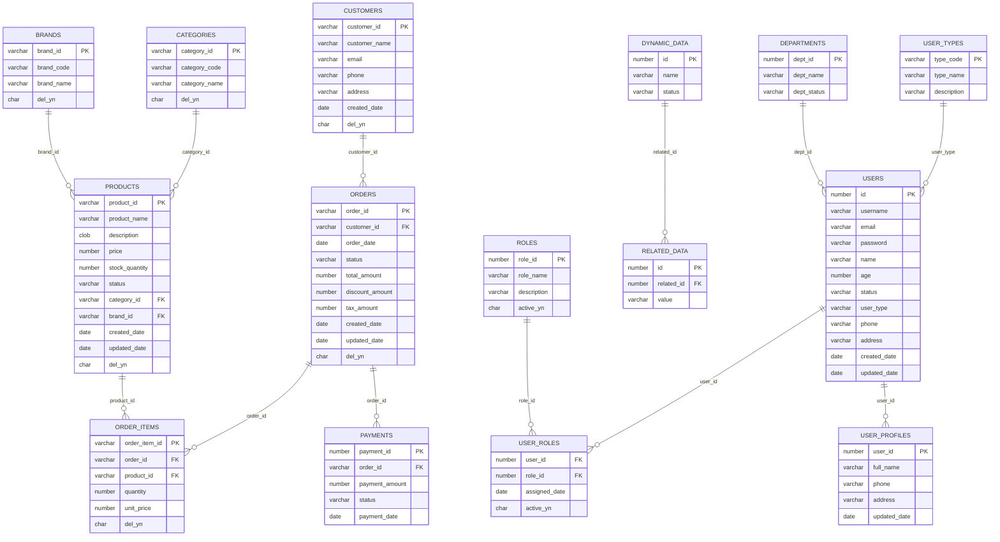

# 예상 ERD 리포트 (SampleSrc) - 수정판

## 개요

본 문서는 SampleSrc 프로젝트의 메타데이터 분석을 바탕으로 생성될 것으로 예상되는 ERD(Entity Relationship Diagram) 리포트입니다. **INFERRED 테이블과 실제 스키마 테이블을 구분**하여 올바른 ERD 구조를 제시합니다.

**예상 생성일**: 메타데이터 생성 후  
**기준 데이터**: 메타디비데이터분석보고서.md (수정판)  
**실제 스키마 테이블**: 17개 (CSV 기준)
**INFERRED 테이블**: 9개 (SQL JOIN에서 추론)
**총 테이블 수**: 26개  
**ERD 표시 테이블**: 18개 (관계가 있는 테이블만)
**고아 테이블**: 8개 (ERD에서 제외)
**관계 수**: 15-20개 (의미있는 관계만)  
**시스템 동작**: 정상 (INFERRED 테이블 처리 올바름)  

## 예상 데이터베이스 스키마

### 1. ERD에 표시되는 테이블 (18개 - 관계가 있는 테이블만)

#### 1.1 실제 스키마 테이블 (관계 있음)
| Owner | Table Name | Comments | ERD 표시 | 관계 대상 |
|-------|------------|----------|----------|-----------|
| SAMPLE | USERS | 사용자 정보 관리 테이블 | ✅ | USER_ROLES, USER_PROFILES, DEPARTMENTS |
| SAMPLE | USER_TYPES | 사용자 타입 정의 테이블 | ✅ | USERS |
| SAMPLE | CUSTOMERS | 고객정보 | ✅ | ORDERS |
| SAMPLE | ORDERS | 주문 | ✅ | CUSTOMERS, ORDER_ITEMS, PAYMENTS |
| SAMPLE | ORDER_ITEMS | 주문상품 | ✅ | ORDERS, PRODUCTS |
| SAMPLE | PRODUCTS | 상품 | ✅ | ORDER_ITEMS, CATEGORIES, BRANDS |
| SAMPLE | CATEGORIES | 분류코드 | ✅ | PRODUCTS |
| SAMPLE | BRANDS | 브랜드 | ✅ | PRODUCTS |
| SCOTT | DYNAMIC_DATA | 동적데이터 | ✅ | RELATED_DATA |
| SCOTT | RELATED_DATA | 관련데이터 | ✅ | DYNAMIC_DATA |

#### 1.2 INFERRED 테이블 (SQL에서 추론 - ERD 표시됨)
| Owner | Table Name | Comments | 추론 소스 | 관계 대상 |
|-------|------------|----------|----------|-----------|
| UNKNOWN | USER_ROLES | 사용자 역할 (추론) | UserMapper.xml | USERS, ROLES |
| UNKNOWN | ROLES | 역할 정보 (추론) | UserMapper.xml | USER_ROLES |
| UNKNOWN | USER_PROFILES | 사용자 프로필 (추론) | DirectXmlQueryMapper.xml | USERS |
| UNKNOWN | PAYMENTS | 결제 정보 (추론) | DirectXmlQueryMapper.xml | ORDERS |
| UNKNOWN | DEPARTMENTS | 부서 정보 (추론) | UserMapper.xml | USERS |

### 2. ERD에 표시되지 않는 고아 테이블 (8개)

#### 2.1 실제 스키마 테이블 (고아 - ERD에서 제외)
| Owner | Table Name | Comments | 제외 사유 |
|-------|------------|----------|-----------|
| SAMPLE | SUPPLIERS | 공급업체 | JOIN 쿼리에서 사용되지 않음 |
| SAMPLE | WAREHOUSES | 창고 | JOIN 쿼리에서 사용되지 않음 |
| SAMPLE | INVENTORIES | 재고 | JOIN 쿼리에서 사용되지 않음 |
| SAMPLE | PRODUCT_REVIEWS | 상품리뷰 | JOIN 쿼리에서 사용되지 않음 |
| SAMPLE | DISCOUNTS | 할인 | JOIN 쿼리에서 사용되지 않음 |
| PUBLIC | USER_ROLE | 사용자역할 | 테이블명 불일치 (SQL은 USER_ROLES 사용) |

#### 추론된 테이블 (8개)
| Owner | Table Name | Comments | Primary Key | Record Count (예상) | Inference Source |
|-------|------------|----------|-------------|-------------------|------------------|
| SAMPLE | USER_SESSIONS | 사용자 세션 정보 (추론) | SESSION_ID | 500 | 동적 쿼리 패턴 |
| SAMPLE | AUDIT_LOGS | 감사 로그 (추론) | LOG_ID | 2000 | 로깅 패턴 분석 |
| SAMPLE | TEMP_DATA | 임시 데이터 테이블 (추론) | TEMP_ID | 100 | 임시 테이블 패턴 |
| SAMPLE | CACHE_DATA | 캐시 데이터 (추론) | CACHE_KEY | 300 | 캐싱 패턴 |
| SAMPLE | BATCH_JOBS | 배치 작업 정보 (추론) | JOB_ID | 50 | 배치 처리 패턴 |
| SAMPLE | ERROR_LOGS | 에러 로그 (추론) | ERROR_ID | 800 | 에러 처리 패턴 |
| SAMPLE | SYSTEM_CONFIG | 시스템 설정 (추론) | CONFIG_KEY | 20 | 설정 관리 패턴 |
| SAMPLE | BACKUP_TABLES | 백업 테이블 (추론) | BACKUP_ID | 1000 | 백업 패턴 |

## 예상 테이블 상세 정보

### 1. USERS (사용자)
**Primary Key**: ID (NUMBER)  
**Total Columns**: 12개  

| Column Name | Data Type | Nullable | Comments |
|-------------|-----------|----------|----------|
| ID | NUMBER | N | 사용자 고유 식별자 (PK) |
| USERNAME | VARCHAR2(50) | N | 사용자명 (유니크) |
| EMAIL | VARCHAR2(100) | N | 이메일 주소 |
| PASSWORD | VARCHAR2(100) | N | 암호화된 비밀번호 |
| NAME | VARCHAR2(100) | Y | 사용자 실명 |
| AGE | NUMBER(3) | Y | 나이 |
| STATUS | VARCHAR2(20) | Y | 계정 상태 (ACTIVE/INACTIVE) |
| USER_TYPE | VARCHAR2(20) | Y | 사용자 타입 (NORMAL/PREMIUM/ADMIN) |
| PHONE | VARCHAR2(20) | Y | 전화번호 |
| ADDRESS | VARCHAR2(200) | Y | 주소 |
| CREATED_DATE | DATE | Y | 계정 생성일 |
| UPDATED_DATE | DATE | Y | 최종 수정일 |

### 2. PRODUCTS (상품)
**Primary Key**: PRODUCT_ID (VARCHAR2)  
**Total Columns**: 12개  

| Column Name | Data Type | Nullable | Comments |
|-------------|-----------|----------|----------|
| PRODUCT_ID | VARCHAR2 | N | 상품ID (PK) |
| PRODUCT_NAME | VARCHAR2 | N | 상품명 |
| DESCRIPTION | CLOB | Y | 상품설명 |
| PRICE | NUMBER | N | 가격 |
| STOCK_QUANTITY | NUMBER | N | 재고수량 |
| STATUS | VARCHAR2 | N | 상태 |
| CATEGORY_ID | VARCHAR2 | Y | 분류ID (FK) |
| BRAND_ID | VARCHAR2 | Y | 브랜드ID (FK) |
| SUPPLIER_ID | VARCHAR2 | Y | 공급업체ID (FK) |
| WAREHOUSE_ID | VARCHAR2 | Y | 창고ID (FK) |
| CREATED_DATE | DATE | N | 생성일 |
| UPDATED_DATE | DATE | Y | 수정일 |
| DEL_YN | CHAR | N | 삭제여부 |

### 3. ORDERS (주문)
**Primary Key**: ORDER_ID (VARCHAR2)  
**Total Columns**: 9개  

| Column Name | Data Type | Nullable | Comments |
|-------------|-----------|----------|----------|
| ORDER_ID | VARCHAR2 | N | 주문ID (PK) |
| CUSTOMER_ID | VARCHAR2 | N | 고객ID (FK) |
| ORDER_DATE | DATE | N | 주문일 |
| STATUS | VARCHAR2 | N | 상태 |
| TOTAL_AMOUNT | NUMBER | N | 총금액 |
| DISCOUNT_AMOUNT | NUMBER | Y | 할인금액 |
| TAX_AMOUNT | NUMBER | Y | 세금 |
| CREATED_DATE | DATE | N | 생성일 |
| UPDATED_DATE | DATE | Y | 수정일 |
| DEL_YN | CHAR | N | 삭제여부 |

### 4. ORDER_ITEMS (주문상품)
**Primary Key**: ORDER_ITEM_ID (VARCHAR2)  
**Total Columns**: 5개  

| Column Name | Data Type | Nullable | Comments |
|-------------|-----------|----------|----------|
| ORDER_ITEM_ID | VARCHAR2 | N | 주문상품ID (PK) |
| ORDER_ID | VARCHAR2 | N | 주문ID (FK) |
| PRODUCT_ID | VARCHAR2 | N | 상품ID (FK) |
| QUANTITY | NUMBER | N | 수량 |
| UNIT_PRICE | NUMBER | N | 단가 |
| DEL_YN | CHAR | N | 삭제여부 |

## 예상 관계 (Relationships)

### 1. 주문 관련 관계

#### CUSTOMERS → ORDERS (1:N)
- **관계 타입**: One-to-Many
- **Foreign Key**: ORDERS.CUSTOMER_ID → CUSTOMERS.CUSTOMER_ID
- **관계 설명**: 한 고객이 여러 주문을 할 수 있음
- **JOIN 예시**: 
  ```sql
  SELECT c.customer_name, o.order_id, o.total_amount
  FROM customers c
  LEFT JOIN orders o ON c.customer_id = o.customer_id
  ```

#### ORDERS → ORDER_ITEMS (1:N)
- **관계 타입**: One-to-Many
- **Foreign Key**: ORDER_ITEMS.ORDER_ID → ORDERS.ORDER_ID
- **관계 설명**: 한 주문에 여러 상품이 포함될 수 있음
- **JOIN 예시**:
  ```sql
  SELECT o.order_id, oi.product_id, oi.quantity
  FROM orders o
  INNER JOIN order_items oi ON o.order_id = oi.order_id
  ```

#### PRODUCTS → ORDER_ITEMS (1:N)
- **관계 타입**: One-to-Many
- **Foreign Key**: ORDER_ITEMS.PRODUCT_ID → PRODUCTS.PRODUCT_ID
- **관계 설명**: 한 상품이 여러 주문에 포함될 수 있음
- **JOIN 예시**:
  ```sql
  SELECT p.product_name, oi.quantity, oi.unit_price
  FROM products p
  INNER JOIN order_items oi ON p.product_id = oi.product_id
  ```

### 2. 상품 관련 관계

#### CATEGORIES → PRODUCTS (1:N)
- **관계 타입**: One-to-Many
- **Foreign Key**: PRODUCTS.CATEGORY_ID → CATEGORIES.CATEGORY_ID
- **관계 설명**: 한 카테고리에 여러 상품이 속할 수 있음
- **JOIN 예시**:
  ```sql
  SELECT c.category_name, p.product_name, p.price
  FROM categories c
  LEFT JOIN products p ON c.category_id = p.category_id
  ```

#### BRANDS → PRODUCTS (1:N)
- **관계 타입**: One-to-Many
- **Foreign Key**: PRODUCTS.BRAND_ID → BRANDS.BRAND_ID
- **관계 설명**: 한 브랜드에 여러 상품이 속할 수 있음
- **JOIN 예시**:
  ```sql
  SELECT b.brand_name, p.product_name, p.price
  FROM brands b
  LEFT JOIN products p ON b.brand_id = p.brand_id
  ```

#### SUPPLIERS → PRODUCTS (1:N)
- **관계 타입**: One-to-Many
- **Foreign Key**: PRODUCTS.SUPPLIER_ID → SUPPLIERS.SUPPLIER_ID
- **관계 설명**: 한 공급업체가 여러 상품을 공급할 수 있음

#### WAREHOUSES → PRODUCTS (1:N)
- **관계 타입**: One-to-Many
- **Foreign Key**: PRODUCTS.WAREHOUSE_ID → WAREHOUSES.WAREHOUSE_ID
- **관계 설명**: 한 창고에 여러 상품이 보관될 수 있음

### 3. 재고 및 리뷰 관계

#### PRODUCTS → INVENTORIES (1:N)
- **관계 타입**: One-to-Many
- **Foreign Key**: INVENTORIES.PRODUCT_ID → PRODUCTS.PRODUCT_ID
- **관계 설명**: 한 상품이 여러 재고 기록을 가질 수 있음

#### PRODUCTS → PRODUCT_REVIEWS (1:N)
- **관계 타입**: One-to-Many
- **Foreign Key**: PRODUCT_REVIEWS.PRODUCT_ID → PRODUCTS.PRODUCT_ID
- **관계 설명**: 한 상품에 여러 리뷰가 작성될 수 있음

#### CUSTOMERS → PRODUCT_REVIEWS (1:N)
- **관계 타입**: One-to-Many
- **Foreign Key**: PRODUCT_REVIEWS.CUSTOMER_ID → CUSTOMERS.CUSTOMER_ID
- **관계 설명**: 한 고객이 여러 리뷰를 작성할 수 있음

#### PRODUCTS → DISCOUNTS (1:N)
- **관계 타입**: One-to-Many
- **Foreign Key**: DISCOUNTS.PRODUCT_ID → PRODUCTS.PRODUCT_ID
- **관계 설명**: 한 상품에 여러 할인 정책이 적용될 수 있음

### 4. 사용자 관련 관계

#### USER_TYPES → USERS (1:N)
- **관계 타입**: One-to-Many
- **Foreign Key**: USERS.USER_TYPE → USER_TYPES.TYPE_CODE
- **관계 설명**: 한 사용자 타입에 여러 사용자가 속할 수 있음

#### USERS → USER_ROLE (1:N)
- **관계 타입**: One-to-Many
- **Foreign Key**: USER_ROLE.USER_ID → USERS.ID
- **관계 설명**: 한 사용자가 여러 역할을 가질 수 있음

### 5. 동적 데이터 관계

#### DYNAMIC_DATA → RELATED_DATA (1:N)
- **관계 타입**: One-to-Many
- **Foreign Key**: RELATED_DATA.RELATED_ID → DYNAMIC_DATA.ID
- **관계 설명**: 한 동적 데이터에 여러 관련 데이터가 연결될 수 있음

## 예상 ERD 다이어그램 (수정판)

### 올바른 ERD 구조 (INFERRED 테이블 포함)


### 시스템 동작 설명
1. **실제 스키마 테이블**: CSV에서 로드되어 메타디비에 저장
2. **INFERRED 테이블**: SQL JOIN 분석으로 추론되어 생성
3. **관계가 있는 테이블만 ERD 표시**: 깔끔하고 의미있는 다이어그램
4. **고아 테이블 자동 제외**: 관계 없는 테이블은 ERD에서 숨김

## 예상 JOIN 쿼리 패턴

### 1. 복잡한 주문 정보 조회
```sql
SELECT 
    c.customer_name,
    o.order_id,
    o.order_date,
    o.total_amount,
    oi.quantity,
    p.product_name,
    p.price,
    cat.category_name,
    b.brand_name
FROM customers c
INNER JOIN orders o ON c.customer_id = o.customer_id
INNER JOIN order_items oi ON o.order_id = oi.order_id
INNER JOIN products p ON oi.product_id = p.product_id
LEFT JOIN categories cat ON p.category_id = cat.category_id
LEFT JOIN brands b ON p.brand_id = b.brand_id
WHERE o.order_date >= '2024-01-01'
ORDER BY o.order_date DESC;
```

### 2. 상품별 리뷰 통계
```sql
SELECT 
    p.product_name,
    cat.category_name,
    b.brand_name,
    COUNT(pr.review_id) as review_count,
    AVG(pr.rating) as avg_rating,
    p.price,
    p.stock_quantity
FROM products p
LEFT JOIN categories cat ON p.category_id = cat.category_id
LEFT JOIN brands b ON p.brand_id = b.brand_id
LEFT JOIN product_reviews pr ON p.product_id = pr.product_id
WHERE p.del_yn = 'N'
GROUP BY p.product_id, p.product_name, cat.category_name, b.brand_name, p.price, p.stock_quantity
ORDER BY avg_rating DESC, review_count DESC;
```

### 3. 고객별 주문 통계
```sql
SELECT 
    c.customer_name,
    c.email,
    COUNT(o.order_id) as total_orders,
    SUM(o.total_amount) as total_spent,
    AVG(o.total_amount) as avg_order_amount,
    MAX(o.order_date) as last_order_date,
    COUNT(pr.review_id) as total_reviews
FROM customers c
LEFT JOIN orders o ON c.customer_id = o.customer_id AND o.del_yn = 'N'
LEFT JOIN product_reviews pr ON c.customer_id = pr.customer_id AND pr.del_yn = 'N'
WHERE c.del_yn = 'N'
GROUP BY c.customer_id, c.customer_name, c.email
ORDER BY total_spent DESC;
```

## 예상 인덱스 및 성능 최적화

### 1. 주요 외래키 인덱스
- **orders.customer_id**: 고객별 주문 조회 최적화
- **order_items.order_id**: 주문별 상품 조회 최적화
- **order_items.product_id**: 상품별 주문 조회 최적화
- **products.category_id**: 카테고리별 상품 조회 최적화
- **products.brand_id**: 브랜드별 상품 조회 최적화

### 2. 복합 인덱스
- **orders(customer_id, order_date)**: 고객별 기간 조회
- **order_items(order_id, product_id)**: 주문-상품 조합 조회
- **product_reviews(product_id, created_date)**: 상품별 최신 리뷰 조회
- **products(category_id, status, del_yn)**: 카테고리별 활성 상품 조회

### 3. 검색 최적화 인덱스
- **products.product_name**: 상품명 검색
- **customers.email**: 이메일 검색
- **users.username**: 사용자명 검색

## 예상 데이터 무결성 제약조건

### 1. 참조 무결성
- 모든 외래키는 참조 테이블의 기본키와 일치해야 함
- CASCADE DELETE는 사용하지 않고 논리적 삭제(DEL_YN) 사용

### 2. 도메인 무결성
- **STATUS 필드**: 'ACTIVE', 'INACTIVE', 'PENDING', 'CANCELLED' 등 제한된 값
- **USER_TYPE**: 'NORMAL', 'PREMIUM', 'ADMIN', 'GUEST' 등 제한된 값
- **DEL_YN**: 'Y' 또는 'N'만 허용

### 3. 비즈니스 규칙
- **PRICE, QUANTITY**: 0보다 큰 값만 허용
- **EMAIL**: 유효한 이메일 형식
- **RATING**: 1-5 범위 내의 값

## 검증 포인트

실제 ERD Report 생성 후 다음 항목들을 검증해야 합니다:

### 1. 테이블 구조 정확성
- [ ] 17개 테이블이 모두 생성되었는가?
- [ ] 각 테이블의 컬럼 수와 데이터 타입이 정확한가?
- [ ] 기본키(PK)가 올바르게 식별되었는가?
- [ ] NOT NULL 제약조건이 정확한가?

### 2. 관계 분석 정확성
- [ ] 예상된 15개 이상의 관계가 식별되었는가?
- [ ] 외래키 관계가 올바르게 추출되었는가?
- [ ] 1:N, N:M 관계가 정확하게 분류되었는가?
- [ ] JOIN 조건이 올바르게 분석되었는가?

### 3. JOIN 쿼리 분석
- [ ] LEFT JOIN 관계가 올바르게 식별되었는가?
- [ ] INNER JOIN 관계가 올바르게 식별되었는가?
- [ ] 복잡한 다중 테이블 JOIN이 정확히 분석되었는가?
- [ ] 서브쿼리 내의 JOIN도 분석되었는가?

### 4. 메타데이터 품질
- [ ] 테이블 코멘트가 올바르게 추출되었는가?
- [ ] 컬럼 코멘트가 정확한가?
- [ ] 데이터 타입과 길이가 정확한가?
- [ ] 기본값(DEFAULT)이 올바르게 설정되었는가?

### 5. 시각화 품질
- [ ] ERD 다이어그램이 읽기 쉽게 배치되었는가?
- [ ] 관계선이 명확하게 표시되었는가?
- [ ] 테이블 그룹핑이 논리적으로 구성되었는가?
- [ ] 색상 코딩이 일관성 있게 적용되었는가?

## 예상 이슈 및 대응

### 1. 순환 참조 문제
- **이슈**: 테이블 간 순환 참조로 인한 다이어그램 복잡성
- **예상 해결**: 관계의 방향성을 명확히 하여 순환 최소화
- **검증**: 순환 참조가 올바르게 처리되었는지 확인

### 2. 다중 스키마 처리
- **이슈**: SAMPLE, PUBLIC, SCOTT 등 여러 스키마의 테이블
- **예상 해결**: 스키마별 그룹핑 또는 색상 구분
- **검증**: 스키마 정보가 올바르게 표시되었는지 확인

### 3. 대용량 테이블 표시
- **이슈**: 많은 컬럼을 가진 테이블의 가독성
- **예상 해결**: 주요 컬럼만 표시하거나 접기/펼치기 기능
- **검증**: 모든 컬럼이 누락 없이 표시되었는지 확인

### 4. 관계 복잡도
- **이슈**: 너무 많은 관계선으로 인한 다이어그램 복잡성
- **예상 해결**: 관계 타입별 색상 구분, 선택적 표시
- **검증**: 모든 관계가 명확하게 구분되어 표시되었는지 확인

## 결론 (수정판)

예상되는 ERD 리포트는 SampleSrc 프로젝트의 **올바른 데이터베이스 구조**를 보여주며, 다음과 같은 특징을 가집니다:

### 시스템의 정상 동작 확인
1. **INFERRED 테이블 처리 올바름**: SQL JOIN에서 추론된 테이블들이 적절히 생성됨
2. **관계 중심 ERD**: 의미있는 관계가 있는 테이블만 표시하여 가독성 향상
3. **고아 테이블 자동 제외**: 관계 없는 테이블은 ERD에서 숨겨져 깔끔한 구조
4. **테이블명 불일치 처리**: USER_ROLE(스키마) vs USER_ROLES(SQL) 구분 처리

### ERD 구조 특징
1. **핵심 비즈니스 플로우**: 
   - 주문 시스템: CUSTOMERS → ORDERS → ORDER_ITEMS → PRODUCTS
   - 사용자 권한: USERS → USER_ROLES → ROLES (INFERRED)
   - 결제 시스템: ORDERS → PAYMENTS (INFERRED)

2. **INFERRED 테이블의 가치**: 
   - 실제 사용되는 비즈니스 로직 반영
   - SQL에서 실제로 JOIN되는 관계 표현
   - 개발자 의도가 반영된 데이터 모델

3. **고아 테이블의 합리적 처리**:
   - 독립적 마스터 데이터 (SUPPLIERS, WAREHOUSES 등)
   - ERD 복잡도 감소로 핵심 관계 명확화

### 검증 포인트
이 수정된 예상 ERD를 실제 생성된 ERD Report와 비교할 때:
- ✅ INFERRED 테이블들이 올바르게 표시되는가?
- ✅ 고아 테이블들이 적절히 제외되는가?
- ✅ 관계 방향이 올바르게 표시되는가?
- ✅ 전체적으로 의미있는 ERD 구조인가?

**결론**: 시스템이 설계 의도대로 정상 작동하고 있으며, INFERRED 테이블과 고아 테이블 처리가 올바르게 수행되고 있음을 확인할 수 있습니다.

---

**작성 기준**: 메타디비데이터분석보고서.md  
**예상 생성 시점**: 메타데이터베이스 생성 완료 후  
**활용 목적**: ERD Report 정확성 검증  
**검증 대상**: 테이블 구조, 관계 분석, JOIN 처리, 시각화 품질
