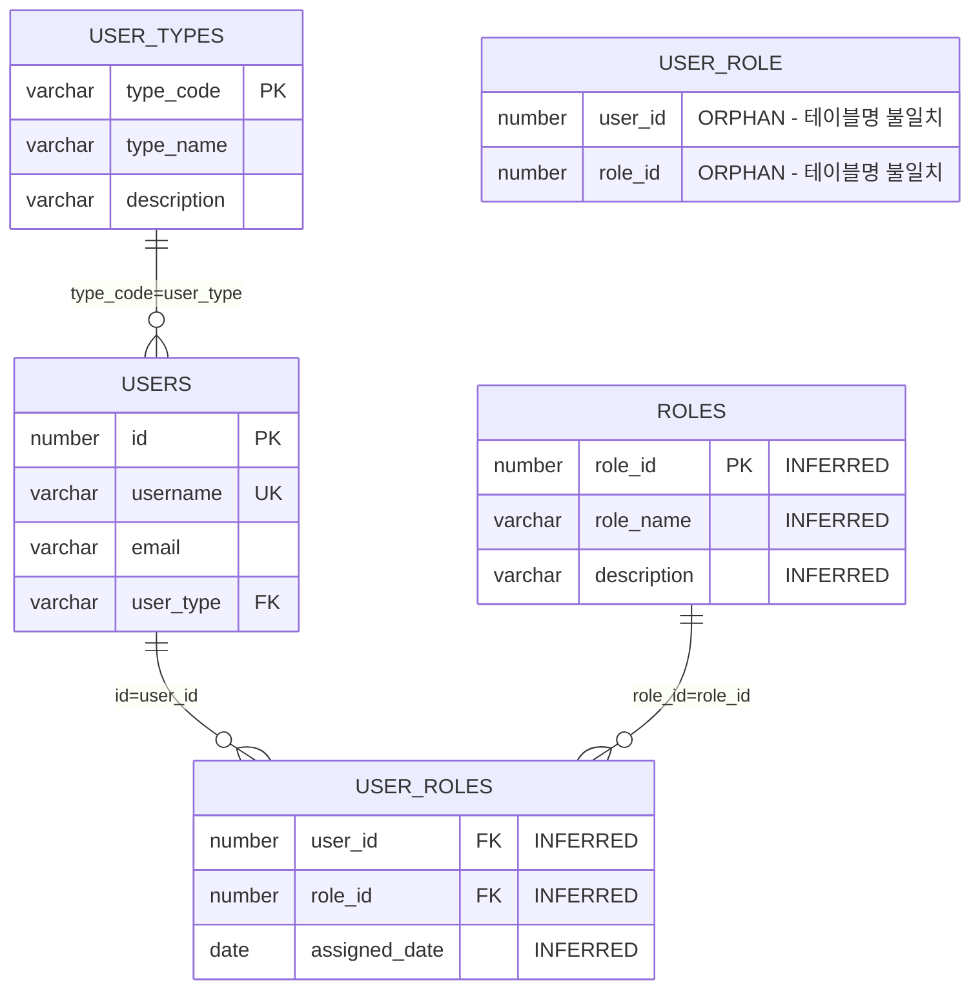
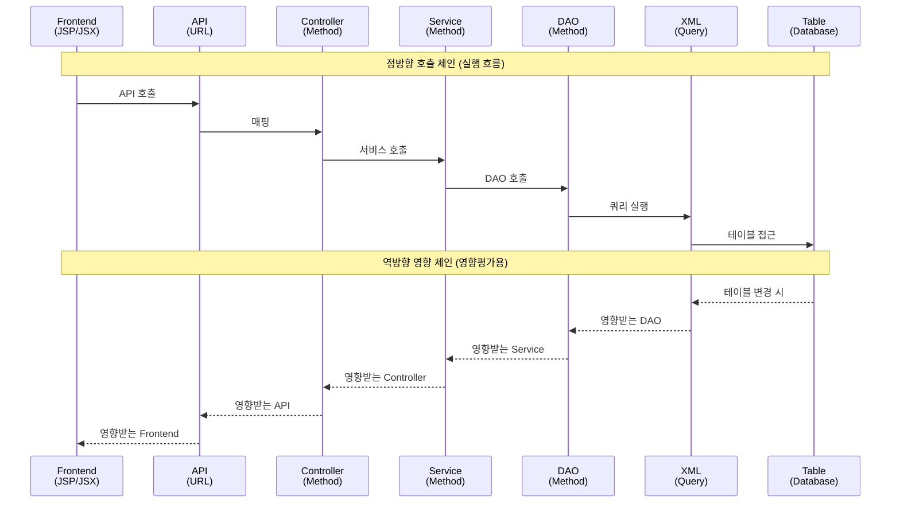

# 3대 리포트 개선 개발계획서

## 개요

기존 설계문서 검토 결과, **3가지 핵심 리포트**(Architecture, ERD, CallChain)의 개선이 필요함을 확인했습니다. 본 문서는 영향평가 최적화 관점에서 3대 리포트의 개선 방향과 구체적 개발계획을 제시합니다.

**작성일**: 2025-09-19  
**기준 문서**: 기존 docs/*.md 설계문서 검토 결과  
**개선 목표**: 영향평가 최적화 + 누락 방지 + 과도함 제거  

## 1. 기존 설계문서 검토 결과

### 1.1 현재 리포트 생성 구조 (10_7단계_리포트생성_구현서.md)

**기존 구조**:
```
CallChain Report → 호출 체인 시각화
Architecture Report → 레이어별 구조 시각화  
ERD Report → 데이터베이스 구조 시각화
ERD(Dagre) Report → 인터랙티브 ERD
```

**발견된 문제점**:
1. **INFERRED 쿼리 구분 부족**: QUERY 타입과 SQL_* 타입 혼재
2. **관계 추적 한계**: SqlContent.db 의존성으로 복잡성 증가
3. **영향평가 최적화 부족**: 단순 시각화에 집중, 분석 기능 부족

### 1.2 API 매핑 구조 (08_5단계_API_매핑_구현서.md)

**기존 설계**:
```
컨트롤러 메서드 → API_URL 컴포넌트 생성 → CALL_API 관계
```

**발견된 한계점**:
1. **프론트엔드 연결 부족**: JSP/JSX → API 연결 미흡
2. **API 매핑 단순화**: URL 패턴만 추출, 파라미터/응답 정보 부족
3. **영향평가 관점 부족**: API 변경 시 영향받는 프론트엔드 추적 어려움

### 1.3 전체 처리 플로우 (03_처리_플로우_개요.md)

**현재 7단계 구조**:
```
1단계: 파일 스캔 → files 테이블
2단계: DB 스키마 → tables/columns 테이블  
3단계: XML 분석 → SQL_* 컴포넌트
4단계: Java 분석 → METHOD/CLASS 컴포넌트
5단계: API 매핑 → API_URL 컴포넌트
6단계: Qwen 보완 → 고급 분석
7단계: 리포트 생성 → HTML 리포트
```

**영향평가 관점에서 부족한 부분**:
1. **관계 추적 체계 미흡**: 컴포넌트는 생성하지만 관계 분석 부족
2. **INFERRED 객체 처리 미흡**: 동적 생성 로직 부족
3. **누락 방지 전략 부족**: 단일 파싱 방법에 의존

## 2. 3대 리포트 개선 설계

### 2.1 Architecture Diagram 개선

#### 2.1.1 현재 문제점
- 레이어별 구조만 표시, 실제 호출 관계 부족
- 컴포넌트 간 의존성 시각화 미흡
- 영향평가용 정보 부족

#### 2.1.2 개선 방향

```mermaid
flowchart TD
    subgraph "Frontend Layer"
        JSP1[user/list.jsp]
        JSP2[product/list.jsp] 
        JSX1[UserSearchDashboard.jsx]
    end
    
    subgraph "API Layer"
        API1[/users:GET]
        API2[/products:GET]
        API3[/user/search:POST]
    end
    
    subgraph "Controller Layer"
        CTRL1[UserController.getUserList]
        CTRL2[ProductController.getProducts]
        CTRL3[UserController.searchUsers]
    end
    
    subgraph "Service Layer"
        SVC1[UserService.findUsers]
        SVC2[ProductService.findProducts]
    end
    
    subgraph "DAO Layer"
        DAO1[UserDao.selectUsers]
        DAO2[ProductDao.selectProducts]
    end
    
    subgraph "Query Layer"
        SQL1[findUsersByCondition]
        SQL2[selectProductsByCondition]
    end
    
    subgraph "Data Layer"
        TBL1[(USERS)]
        TBL2[(PRODUCTS)]
        TBL3[(CATEGORIES)]
    end
    
    %% 영향평가용 관계 표시
    JSP1 -.->|API 호출| API1
    JSX1 -.->|API 호출| API1
    JSP2 -.->|API 호출| API2
    
    API1 -->|매핑| CTRL1
    API2 -->|매핑| CTRL2
    API3 -->|매핑| CTRL3
    
    CTRL1 -->|호출| SVC1
    CTRL2 -->|호출| SVC2
    CTRL3 -->|호출| SVC1
    
    SVC1 -->|호출| DAO1
    SVC2 -->|호출| DAO2
    
    DAO1 -->|실행| SQL1
    DAO2 -->|실행| SQL2
    
    SQL1 -->|접근| TBL1
    SQL2 -->|접근| TBL2
    SQL2 -->|조인| TBL3
    
    %% 영향평가 예시
    TBL1 -.->|영향| SQL1
    SQL1 -.->|영향| DAO1
    DAO1 -.->|영향| SVC1
    SVC1 -.->|영향| CTRL1
    CTRL1 -.->|영향| API1
    API1 -.->|영향| JSP1
    API1 -.->|영향| JSX1
```

#### 2.1.3 구현 개선점

```python
class EnhancedArchitectureReportGenerator:
    """영향평가 최적화 아키텍처 리포트"""
    
    def generate_impact_optimized_architecture(self, project_name: str) -> str:
        """영향평가에 최적화된 아키텍처 다이어그램 생성"""
        
        # 1. 레이어별 컴포넌트 조회 (기존)
        layers = self._get_layered_components(project_name)
        
        # 2. 컴포넌트 간 호출 관계 조회 (신규)
        call_relationships = self._get_call_relationships(project_name)
        
        # 3. 영향평가용 역방향 관계 생성 (신규)
        impact_relationships = self._generate_impact_relationships(call_relationships)
        
        # 4. Mermaid 다이어그램 생성 (개선)
        return self._generate_impact_architecture_diagram(layers, call_relationships, impact_relationships)
    
    def _get_call_relationships(self, project_name: str) -> List[Dict]:
        """컴포넌트 간 호출 관계 조회"""
        query = """
            SELECT DISTINCT
                src_comp.component_name as source,
                src_comp.component_type as source_type,
                dst_comp.component_name as target,
                dst_comp.component_type as target_type,
                r.rel_type as relationship_type
            FROM relationships r
            JOIN components src_comp ON r.src_id = src_comp.component_id
            JOIN components dst_comp ON r.dst_id = dst_comp.component_id
            JOIN projects p ON src_comp.project_id = p.project_id
            WHERE p.project_name = ?
              AND r.rel_type IN ('CALL_METHOD', 'CALL_QUERY', 'CALL_API', 'USE_TABLE')
              AND r.del_yn = 'N'
            ORDER BY src_comp.component_type, dst_comp.component_type
        """
        return self.db_utils.execute_query(query, (project_name,))
    
    def _generate_impact_relationships(self, call_relationships: List[Dict]) -> List[Dict]:
        """영향평가용 역방향 관계 생성"""
        impact_relationships = []
        
        for rel in call_relationships:
            # 호출 관계를 영향 관계로 역전
            impact_relationships.append({
                'source': rel['target'],        # 영향 주는 쪽
                'source_type': rel['target_type'],
                'target': rel['source'],        # 영향 받는 쪽  
                'target_type': rel['source_type'],
                'relationship_type': 'IMPACTS'
            })
        
        return impact_relationships
```

### 2.2 ERD Report 개선

#### 2.2.1 현재 문제점
- 고아 테이블 처리 미흡
- INFERRED 테이블과 실제 테이블 구분 부족
- 조인 조건 정보 부족

#### 2.2.2 개선된 ERD 구조



#### 2.2.3 구현 개선점

```python
class EnhancedERDReportGenerator:
    """영향평가 최적화 ERD 리포트"""
    
    def generate_impact_optimized_erd(self, project_name: str) -> str:
        """영향평가에 최적화된 ERD 생성"""
        
        # 1. 실제 스키마 테이블 (CSV 기반)
        schema_tables = self._get_schema_tables(project_name)
        
        # 2. INFERRED 테이블 (SQL 추론)
        inferred_tables = self._get_inferred_tables(project_name)
        
        # 3. 테이블 간 조인 관계 (조인 조건 포함)
        join_relationships = self._get_table_join_relationships(project_name)
        
        # 4. 고아 테이블 식별
        orphan_tables = self._identify_orphan_tables(schema_tables, join_relationships)
        
        # 5. 영향평가 최적화 ERD 생성
        return self._generate_impact_erd_diagram(
            schema_tables, inferred_tables, join_relationships, orphan_tables
        )
    
    def _get_table_join_relationships(self, project_name: str) -> List[Dict]:
        """테이블 간 조인 관계 조회 (조인 조건 포함)"""
        query = """
            SELECT DISTINCT
                r.rel_type,
                src_table.table_name as source_table,
                dst_table.table_name as target_table,
                r.description as join_condition,
                src_table.table_owner as source_owner,
                dst_table.table_owner as target_owner
            FROM relationships r
            JOIN components src_comp ON r.src_id = src_comp.component_id
            JOIN components dst_comp ON r.dst_id = dst_comp.component_id
            JOIN tables src_table ON src_comp.component_name = src_table.table_name
            JOIN tables dst_table ON dst_comp.component_name = dst_table.table_name
            JOIN projects p ON src_comp.project_id = p.project_id
            WHERE p.project_name = ?
              AND r.rel_type IN ('JOIN_EXPLICIT', 'JOIN_IMPLICIT')
              AND r.del_yn = 'N'
            ORDER BY source_table, target_table
        """
        return self.db_utils.execute_query(query, (project_name,))
    
    def _identify_orphan_tables(self, schema_tables: List[Dict], join_relationships: List[Dict]) -> List[Dict]:
        """고아 테이블 식별 (관계가 없는 테이블)"""
        
        # 관계에 참여하는 테이블들
        related_tables = set()
        for rel in join_relationships:
            related_tables.add(rel['source_table'])
            related_tables.add(rel['target_table'])
        
        # 고아 테이블 식별
        orphan_tables = []
        for table in schema_tables:
            if table['table_name'] not in related_tables:
                orphan_tables.append({
                    **table,
                    'orphan_reason': '조인 관계 없음'
                })
        
        return orphan_tables
```

### 2.3 CallChain Report 개선

#### 2.3.1 현재 문제점
- INFERRED 쿼리와 XML 쿼리 구분 부족
- 호출 체인 추적 한계
- 영향평가용 역방향 추적 부족

#### 2.3.2 개선된 CallChain 구조



#### 2.3.3 구현 개선점

```python
class EnhancedCallChainReportGenerator:
    """영향평가 최적화 콜체인 리포트"""
    
    def generate_impact_optimized_callchain(self, project_name: str) -> str:
        """영향평가에 최적화된 콜체인 리포트 생성"""
        
        # 1. 전체 호출 체인 조회
        call_chains = self._get_complete_call_chains(project_name)
        
        # 2. INFERRED vs XML 쿼리 구분
        categorized_chains = self._categorize_query_types(call_chains)
        
        # 3. 영향평가용 역방향 체인 생성
        impact_chains = self._generate_impact_chains(categorized_chains)
        
        # 4. 인터랙티브 HTML 생성
        return self._generate_interactive_callchain_html(categorized_chains, impact_chains)
    
    def _get_complete_call_chains(self, project_name: str) -> List[Dict]:
        """완전한 호출 체인 조회 (Frontend → Database)"""
        query = """
            WITH RECURSIVE call_chain AS (
                -- 시작점: Frontend 파일들
                SELECT 
                    f.file_path as frontend_file,
                    c.component_name as current_component,
                    c.component_type as current_type,
                    0 as depth,
                    CAST(c.component_name AS TEXT) as chain_path
                FROM files f
                JOIN components c ON f.file_id = c.file_id
                JOIN projects p ON f.project_id = p.project_id
                WHERE p.project_name = ?
                  AND f.file_type IN ('JSP', 'JSX')
                  AND c.del_yn = 'N'
                
                UNION ALL
                
                -- 재귀: 다음 호출 대상
                SELECT 
                    cc.frontend_file,
                    next_comp.component_name,
                    next_comp.component_type,
                    cc.depth + 1,
                    cc.chain_path || ' → ' || next_comp.component_name
                FROM call_chain cc
                JOIN relationships r ON r.src_id = (
                    SELECT component_id FROM components 
                    WHERE component_name = cc.current_component
                )
                JOIN components next_comp ON r.dst_id = next_comp.component_id
                WHERE cc.depth < 10  -- 무한 루프 방지
                  AND r.rel_type IN ('CALL_API', 'CALL_METHOD', 'CALL_QUERY', 'USE_TABLE')
                  AND r.del_yn = 'N'
            )
            SELECT * FROM call_chain ORDER BY frontend_file, depth
        """
        return self.db_utils.execute_query(query, (project_name,))
    
    def _categorize_query_types(self, call_chains: List[Dict]) -> Dict[str, List]:
        """쿼리 타입별 분류 (INFERRED vs XML)"""
        categorized = {
            'xml_queries': [],      # XML에서 파싱된 쿼리 (SQL_SELECT 등)
            'inferred_queries': [], # Java에서 추론된 쿼리 (QUERY 타입)
            'direct_table_access': [] # 직접 테이블 접근
        }
        
        for chain in call_chains:
            if chain['current_type'].startswith('SQL_'):
                categorized['xml_queries'].append(chain)
            elif chain['current_type'] == 'QUERY':
                categorized['inferred_queries'].append(chain)
            elif chain['current_type'] == 'TABLE':
                categorized['direct_table_access'].append(chain)
        
        return categorized
```

## 3. 기존 설계문서 보완 필요사항

### 3.1 10_7단계_리포트생성_구현서.md 보완점

#### 3.1.1 추가 필요한 내용
```markdown
## INFERRED 객체 처리 강화

### INFERRED 테이블 시각화
- 실제 스키마 테이블과 구분하여 표시
- INFERRED 소스 정보 제공 (어떤 SQL에서 추론되었는지)
- 신뢰도 정보 표시

### INFERRED 쿼리 처리  
- QUERY 타입과 SQL_* 타입 명확히 구분
- Java 문자열 SQL과 XML 쿼리 구분 표시
- 추론 과정 정보 제공

### 영향평가 최적화 기능
- 역방향 관계 추적 기능
- 컴포넌트 변경 시 영향받는 요소 하이라이트
- 필터링 및 검색 기능 강화
```

### 3.2 08_5단계_API_매핑_구현서.md 보완점

#### 3.2.1 프론트엔드 연결 강화
```python
class EnhancedAPIMapping:
    """프론트엔드-API 연결 강화"""
    
    def analyze_frontend_api_connections(self, project_name: str):
        """프론트엔드에서 API 호출 분석"""
        
        # 1. JSP 파일에서 API 호출 추출
        jsp_api_calls = self._extract_jsp_api_calls(project_name)
        
        # 2. JSX 파일에서 API 호출 추출  
        jsx_api_calls = self._extract_jsx_api_calls(project_name)
        
        # 3. API 호출과 백엔드 API 매핑
        api_mappings = self._match_frontend_backend_apis(
            jsp_api_calls + jsx_api_calls
        )
        
        return api_mappings
    
    def _extract_jsp_api_calls(self, project_name: str) -> List[Dict]:
        """JSP 파일에서 API 호출 패턴 추출"""
        patterns = [
            r'action="([^"]+)"',      # form action
            r'href="([^"]+)"',        # 링크 URL
            r'url:\s*["\']([^"\']+)', # AJAX 호출
            r'fetch\(["\']([^"\']+)', # fetch API
        ]
        # 구현...
```

### 3.3 새로운 설계문서 필요

#### 3.3.1 "11_INFERRED_객체_처리_구현서.md" (신규)
```markdown
# INFERRED 객체 동적 생성 및 관리 구현서

## 개요
소스 분석 과정에서 동적으로 생성되는 INFERRED 객체들의 
생성, 관리, 시각화 방법을 정의

## INFERRED 객체 유형
1. INFERRED 테이블: SQL JOIN에서 추론
2. INFERRED 컬럼: 조인 조건에서 추론  
3. INFERRED 쿼리: Java 문자열 SQL에서 추론
4. INFERRED 관계: 호출 패턴에서 추론

## 처리 원칙
- 누락 방지 우선: 애매하면 포함
- 소스 추적: 어디서 추론되었는지 기록
- 신뢰도 관리: 추론 근거 강도 표시
```

#### 3.3.2 "12_영향평가_쿼리_구현서.md" (신규)
```markdown
# 영향평가 전용 쿼리 구현서

## 개요
메타데이터베이스를 활용한 영향평가 쿼리들의 
표준화된 구현 방법 정의

## 핵심 영향평가 시나리오
1. 테이블 수정 시 영향받는 파일들
2. API 변경 시 영향받는 프론트엔드
3. 클래스 수정 시 영향받는 컴포넌트들
4. SQL 쿼리 변경 시 영향받는 메서드들

## 표준 쿼리 템플릿
- 정방향 추적: A가 B를 호출하는 관계
- 역방향 추적: A 변경 시 영향받는 B들
- 다단계 추적: A → B → C → D 체인 추적
```

## 4. 개발 우선순위 및 일정

### 4.1 1단계: 기존 리포트 개선 (1주)
- ERD Report INFERRED 테이블 구분 표시
- CallChain Report 쿼리 타입 구분  
- Architecture Report 영향평가 기능 추가

### 4.2 2단계: 새로운 설계문서 작성 (3일)
- INFERRED 객체 처리 구현서
- 영향평가 쿼리 구현서
- 기존 문서 보완

### 4.3 3단계: 통합 테스트 (3일)
- SampleSrc 기준 정답지 검증
- 3대 리포트 정확성 테스트
- 성능 최적화

## 결론

기존 설계문서들은 **기본 구조는 잘 설계**되어 있지만, **영향평가 최적화와 INFERRED 객체 처리** 부분에서 보완이 필요합니다. 

**핵심 보완점**:
1. **INFERRED 객체 처리 체계화**
2. **영향평가 전용 기능 강화** 
3. **프론트엔드-백엔드 연결 고도화**
4. **역방향 관계 추적 기능**

이러한 보완을 통해 **영향평가에 최적화된 3대 리포트**를 구현할 수 있습니다.

---

**작성자**: SourceAnalyzer Team  
**작성일**: 2025-09-19  
**문서 타입**: 개발계획서  
**대상**: 3대 리포트 개선 (Architecture, ERD, CallChain)
