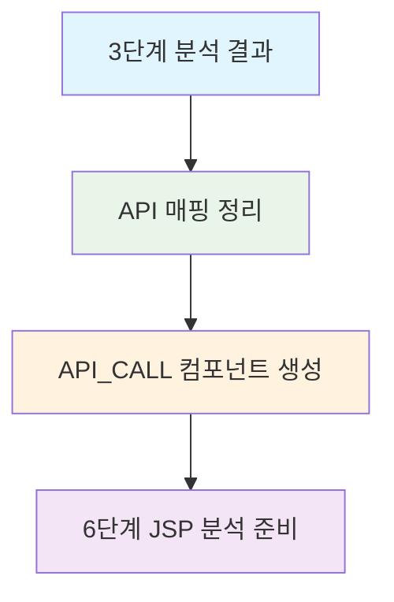

# 5단계 API 매핑 정리 - 단순화 개발계획서 v3.0

## 📋 개요

### 목적
기존 3단계에서 분석된 Spring/Servlet 컨트롤러 정보를 바탕으로 **API 매핑을 정리**하고, 6단계 JSP 분석을 위한 기반을 마련합니다.

### 주요 변경사항
- **기존**: Phase1 Spring + Phase2 Servlet + Phase3 React (복잡한 3단계 구조)
- **개선**: API 매핑 정리만 (단순한 1단계 구조)
- **이유**: API_URL은 이미 3단계에서 분석 완료, 추가 분석 불필요

### 범위
- **API 매핑 정리**: 3단계에서 분석된 컨트롤러 정보를 API_CALL 형태로 정리
- **JSP 분석 준비**: 6단계 JSP 분석을 위한 API 매핑 정보 제공

---

## 🏗️ 단순화된 아키텍처

### 파일 구조
```
CreateMetaDb/
├── api_mapping_loading.py          # (신규) 5단계 메인 엔진 (단순화)
├── parser/
│   └── api_mapping_analyzer.py     # (신규) API 매핑 분석기
├── config/parser/
│   └── api_mapping_keyword.yaml    # (신규) API 매핑 설정
└── util/
    ├── path_utils.py               # (기존) URL 경로 조합 함수
    └── logger.py                   # (기존) 로깅 공통함수
```

### 데이터 흐름


---

## 📊 데이터베이스 구조

### components 테이블 (API_CALL 타입)
| 컬럼명 | 설명 | 예시 |
|--------|------|------|
| component_type | API_CALL | API_CALL |
| component_name | 컨트롤러명 | MicroserviceController |
| api_url | API URL | /api/user-profile |
| call_method | HTTP 메서드 | GET |
| class_name | 클래스명 | MicroserviceController |
| method_name | 메서드명 | getUserProfile |

### relationships 테이블
| rel_type | 설명 | 예시 |
|----------|------|------|
| CALL_API | API_CALL → METHOD | API_CALL → getUserProfile |

---

## 🔧 구현 상세

### 1. API 매핑 분석기 (api_mapping_analyzer.py)

```python
class APIMappingAnalyzer:
    """API 매핑 분석기 - 3단계 결과를 API_CALL로 변환"""
    
    def analyze_controllers(self, project_id: int) -> List[APIMapping]:
        """컨트롤러 분석 결과를 API 매핑으로 변환"""
        # 3단계에서 분석된 METHOD 컴포넌트 조회
        methods = self.get_method_components(project_id, 'CONTROLLER')
        
        api_mappings = []
        for method in methods:
            # @RequestMapping + @GetMapping 조합으로 API_URL 생성
            api_url = self.build_api_url(method)
            
            api_mapping = APIMapping(
                component_name=method.class_name,
                api_url=api_url,
                call_method=method.http_method,
                class_name=method.class_name,
                method_name=method.method_name
            )
            api_mappings.append(api_mapping)
        
        return api_mappings
    
    def build_api_url(self, method: MethodComponent) -> str:
        """@RequestMapping과 @GetMapping을 조합하여 API URL 생성"""
        base_path = method.request_mapping or "/api"
        method_path = method.get_mapping or method.post_mapping or ""
        return f"{base_path}{method_path}"
```

### 2. API 매핑 로딩 엔진 (api_mapping_loading.py)

```python
class APIMappingLoadingEngine:
    """API 매핑 로딩 엔진 - 5단계 메인 엔진"""
    
    def process_project(self, project_name: str) -> None:
        """프로젝트의 API 매핑 처리"""
        try:
            # 1. API 매핑 분석
            analyzer = APIMappingAnalyzer()
            api_mappings = analyzer.analyze_controllers(project_id)
            
            # 2. API_CALL 컴포넌트 생성
            for mapping in api_mappings:
                self.create_api_call_component(mapping)
            
            # 3. 관계 생성
            self.create_api_relationships(api_mappings)
            
            logger.info(f"API 매핑 처리 완료: {len(api_mappings)}개")
            
        except Exception as e:
            handle_error(f"API 매핑 처리 실패: {e}")
    
    def create_api_call_component(self, mapping: APIMapping) -> None:
        """API_CALL 컴포넌트 생성"""
        component_data = {
            'project_id': self.project_id,
            'file_id': None,  # 컨트롤러 파일 ID
            'component_name': mapping.component_name,
            'component_type': 'API_CALL',
            'parent_id': None,
            'layer': 'CONTROLLER',
            'line_start': None,
            'line_end': None,
            'api_url': mapping.api_url,
            'call_method': mapping.call_method,
            'class_name': mapping.class_name,
            'method_name': mapping.method_name
        }
        
        self.db_manager.insert_component(component_data)
```

### 3. 설정 파일 (api_mapping_keyword.yaml)

```yaml
# API 매핑 분석 키워드 설정
api_mapping:
  # HTTP 메서드 매핑
  http_methods:
    GET: "GET"
    POST: "POST"
    PUT: "PUT"
    DELETE: "DELETE"
    PATCH: "PATCH"
  
  # 기본 API 경로
  default_api_path: "/api"
  
  # 컨트롤러 계층 식별
  controller_layers:
    - "CONTROLLER"
    - "REST_CONTROLLER"
  
  # API URL 조합 규칙
  url_combination:
    request_mapping: "base_path"
    method_mapping: "method_path"
    separator: ""
```

---

## 📈 처리 과정

### 1단계: 3단계 결과 조회
```sql
-- 3단계에서 분석된 컨트롤러 메서드 조회
SELECT c.component_id, c.component_name, c.class_name, c.method_name
FROM components c
WHERE c.project_id = ? 
  AND c.layer = 'CONTROLLER'
  AND c.component_type = 'METHOD'
  AND c.del_yn = 'N'
```

### 2단계: API URL 생성
```python
# @RequestMapping + @GetMapping 조합
base_path = "/api"  # @RequestMapping("/api")
method_path = "/user-profile"  # @GetMapping("/user-profile")
api_url = "/api/user-profile"
```

### 3단계: API_CALL 컴포넌트 생성
```sql
INSERT INTO components (
    project_id, file_id, component_name, component_type,
    layer, api_url, call_method, class_name, method_name
) VALUES (
    1, 201, 'MicroserviceController', 'API_CALL',
    'CONTROLLER', '/api/user-profile', 'GET', 
    'MicroserviceController', 'getUserProfile'
);
```

### 4단계: 관계 생성
```sql
INSERT INTO relationships (
    src_id, dst_id, rel_type, confidence
) VALUES (
    1001, 2001, 'CALL_API', 1.0
);
```

---

## 🎯 기대 효과

### 1. 단순화된 구조
- **기존**: 3단계 복잡한 분석 (Spring + Servlet + React)
- **개선**: 1단계 단순한 정리 (API 매핑만)

### 2. 효율적인 처리
- **기존**: 중복 분석 (3단계에서 이미 분석된 것 재분석)
- **개선**: 기존 결과 활용 (3단계 결과를 API_CALL로 변환)

### 3. 명확한 역할 분담
- **5단계**: API 매핑 정리 (백엔드 중심)
- **6단계**: JSP 분석 (프론트엔드 중심)

---

## 📋 개발 일정

### Phase 1: 기본 구조 (1일)
- [ ] api_mapping_analyzer.py 구현
- [ ] api_mapping_loading.py 구현
- [ ] api_mapping_keyword.yaml 설정

### Phase 2: 테스트 및 검증 (1일)
- [ ] sampleSrc 프로젝트 테스트
- [ ] API_CALL 컴포넌트 생성 검증
- [ ] 관계 생성 검증

### Phase 3: 통합 및 최적화 (1일)
- [ ] main.py 통합
- [ ] 성능 최적화
- [ ] 문서화

---

## 🔍 검증 방법

### 1. API_CALL 컴포넌트 검증
```sql
-- API_CALL 컴포넌트 생성 확인
SELECT component_name, api_url, call_method, class_name, method_name
FROM components
WHERE component_type = 'API_CALL'
  AND project_id = 1;
```

### 2. 관계 생성 검증
```sql
-- CALL_API 관계 생성 확인
SELECT r.rel_type, c1.component_name as api_call, c2.component_name as method
FROM relationships r
JOIN components c1 ON r.src_id = c1.component_id
JOIN components c2 ON r.dst_id = c2.component_id
WHERE r.rel_type = 'CALL_API';
```

### 3. 6단계 준비 상태 확인
```sql
-- JSP 분석을 위한 API 매핑 정보 확인
SELECT api_url, call_method, class_name, method_name
FROM components
WHERE component_type = 'API_CALL'
ORDER BY api_url;
```

---

## 📚 관련 문서

- [메타데이터베이스 스키마 정의서 v3.0](../메타데이터베이스스키마정의서.md)
- [6단계 JSP 분석 개발계획서](JSP_백엔드호출_개발계획서_Phase1.md)
- [API 매핑 사례 분석](../API_매핑_사례_분석.md)

이 개발계획서는 기존의 복잡한 3단계 구조를 단순화하여 효율적이고 명확한 API 매핑 정리 기능을 제공합니다.
