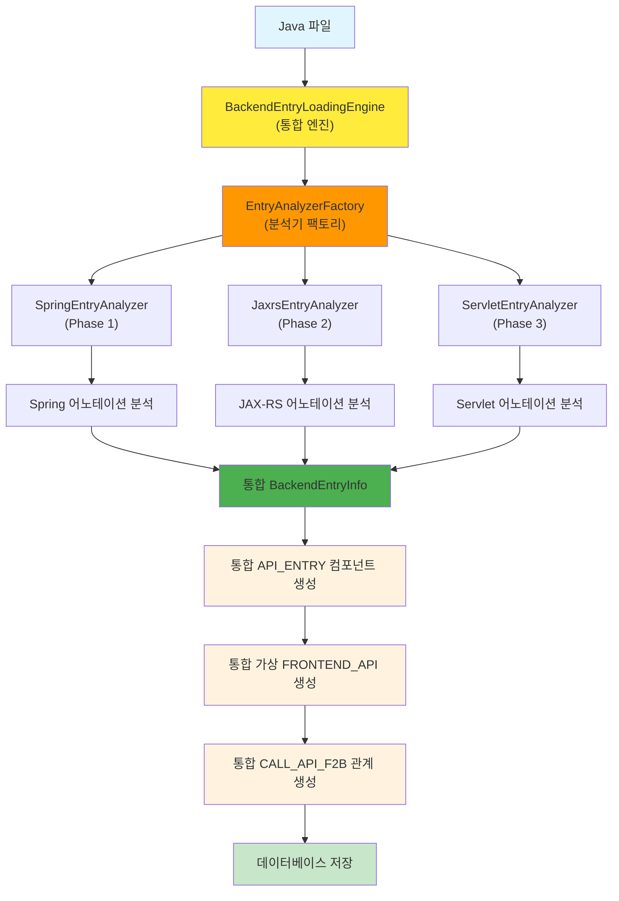

# 처리플로우 상세 5단계 - Spring API 진입점 분석 개발계획서

## 📋 개요

### 목적
Spring 프레임워크 기반 Java 백엔드에서 **API 진입점을 분석**하여 프론트엔드 → 백엔드 호출 체인을 구성하는 기능을 개발합니다.

### 핵심 목표
- **연관관계 도출**: 완벽한 파싱이 아닌 **호출 관계 추적**에 집중
- **Spring 진입점 식별**: `@RestController`, `@Controller`, `@RequestMapping` 등 Spring MVC 어노테이션 분석
- **가상 프론트엔드 생성**: 실제 프론트엔드 기술에 무관하게 완전한 호출 체인 구성
- **API 엔드포인트 매핑**: URL 패턴과 HTTP 메서드 매핑

### 범위
- **Spring Boot REST API**: `@RestController`, `@GetMapping`, `@PostMapping` 등
- **Spring MVC**: `@Controller`, `@RequestMapping` 등
- **JAX-RS**: `@Path`, `@GET`, `@POST` 등 (선택적)
- **Servlet**: `@WebServlet`, `HttpServlet` 상속 (선택적)

---

## 🏗️ 시스템 아키텍처

### 전체 구조
```
CreateMetaDb/
├── parser/
│   ├── backend_entry_analyzer.py     # Spring 진입점 분석기 (신규)
│   └── manual/07_spring/             # Spring 파싱 가이드
├── config/parser/
│   ├── spring_keyword.yaml           # Spring 키워드 설정 (기존 활용)
│   └── backend_entry_keyword.yaml    # 진입점 분석 설정 (신규)
├── util/                             # 기존 공통함수 활용
│   ├── path_utils.py                 # 경로 처리 (크로스플랫폼)
│   ├── config_utils.py               # 설정 파일 로드
│   ├── database_utils.py             # 데이터베이스 처리
│   └── logger.py                     # 로깅 및 에러 처리
└── backend_entry_loading.py          # 5단계 메인 엔진 (신규)
```

### 신규 생성 파일 목록 (Phase 1: Spring 전용)

#### Phase 1 파일
1. **backend_entry_loading.py** (루트 디렉토리)
   - 5단계 메인 엔진
   - BackendEntryLoadingEngine 클래스
   - 전체 처리 과정 관리

2. **parser/spring_entry_analyzer.py** (parser 디렉토리)
   - Spring 진입점 분석 전담 (Phase 1)
   - SpringEntryAnalyzer 클래스
   - Spring 어노테이션 및 URL 패턴 분석

3. **config/parser/spring_entry_keyword.yaml** (config/parser 디렉토리)
   - Spring 진입점 분석 설정 (Phase 1)
   - Spring 어노테이션 패턴 정의
   - URL 추출 규칙 정의

#### 향후 Phase 확장 파일 (설계만)
4. **parser/jaxrs_entry_analyzer.py** (Phase 2)
   - JAX-RS 진입점 분석
   - JaxrsEntryAnalyzer 클래스

5. **parser/servlet_entry_analyzer.py** (Phase 3)
   - Servlet 진입점 분석
   - ServletEntryAnalyzer 클래스

6. **config/parser/jaxrs_entry_keyword.yaml** (Phase 2)
   - JAX-RS 분석 설정

7. **config/parser/servlet_entry_keyword.yaml** (Phase 3)
   - Servlet 분석 설정

### 데이터 흐름 (통합 구조)


### 통합 처리 특징
- **단일 엔진**: `BackendEntryLoadingEngine`이 모든 백엔드 프레임워크를 통합 처리
- **팩토리 패턴**: `EntryAnalyzerFactory`가 프레임워크별 분석기를 동적 생성
- **공통 결과**: 모든 프레임워크의 진입점이 동일한 `BackendEntryInfo` 형태로 통합
- **프레임워크 무관**: API_ENTRY, FRONTEND_API, CALL_API_F2B는 프레임워크에 관계없이 동일하게 생성

---

## 🔧 상세 설계

### 1. 설정 파일 설계

#### 1.1 spring_entry_keyword.yaml (Phase 1 전용)
```yaml
# Spring 진입점 분석 설정 (Phase 1)
spring_annotations:
  # 클래스 레벨 어노테이션
  class_annotations:
    - "@RestController"
    - "@Controller"
  
  # 메서드 레벨 어노테이션
  method_annotations:
    - "@RequestMapping"
    - "@GetMapping"
    - "@PostMapping"
    - "@PutMapping"
    - "@DeleteMapping"
    - "@PatchMapping"

# URL 패턴 추출 설정
url_pattern_extraction:
  # RequestMapping 어노테이션 속성
  request_mapping_attributes:
    - "value"
    - "path"
  
  # HTTP 메서드 추출
  http_methods:
    - "GET"
    - "POST"
    - "PUT"
    - "DELETE"
    - "PATCH"
    - "HEAD"
    - "OPTIONS"

# 파일 필터링 설정
file_filtering:
  # Spring 진입점이 될 수 있는 파일 패턴
  include_patterns:
    - "*Controller.java"
    - "*RestController.java"
  
  # 제외할 파일 패턴
  exclude_patterns:
    - "*Test.java"
    - "*Tests.java"
    - "*Config.java"
    - "*Configuration.java"
```

#### 1.2 jaxrs_entry_keyword.yaml (Phase 2 예정)
```yaml
# JAX-RS 진입점 분석 설정 (Phase 2)
jaxrs_annotations:
  # 클래스 레벨 어노테이션
  class_annotations:
    - "@Path"
  
  # 메서드 레벨 어노테이션
  method_annotations:
    - "@GET"
    - "@POST"
    - "@PUT"
    - "@DELETE"
    - "@HEAD"
    - "@OPTIONS"

# 파일 필터링 설정
file_filtering:
  include_patterns:
    - "*Resource.java"
    - "*Endpoint.java"
```

#### 1.3 servlet_entry_keyword.yaml (Phase 3 예정)
```yaml
# Servlet 진입점 분석 설정 (Phase 3)
servlet_annotations:
  # 클래스 레벨 어노테이션
  class_annotations:
    - "@WebServlet"
  
  # 상속 관계
  inheritance:
    - "HttpServlet"

# 파일 필터링 설정
file_filtering:
  include_patterns:
    - "*Servlet.java"
```

#### 1.2 기존 설정 파일 활용
- **spring_keyword.yaml**: Spring 어노테이션 및 패턴 정의 (기존 활용)
- **target_source_config.yaml**: 분석 대상 파일 및 경로 설정 (기존 활용)

### 2. 핵심 컴포넌트 설계

#### 2.1 BaseEntryAnalyzer (parser/base_entry_analyzer.py) - 추상 클래스
**역할**: 모든 진입점 분석기의 기본 클래스

**클래스 구조**:
```python
from abc import ABC, abstractmethod

class BaseEntryAnalyzer(ABC):
    def __init__(self, config_path: str = None):
        # 공통 초기화
        # 설정 파일 로드 (config_utils.py 활용)
        # 정규식 패턴 컴파일
        
    @abstractmethod
    def analyze_backend_entry(self, java_file: FileInfo) -> List[BackendEntryInfo]:
        # 메인 분석 메서드 (각 프레임워크별 구현)
        pass
        
    def _create_backend_entry_info(self, class_name: str, method_name: str, 
                                  url_pattern: str, http_method: str, 
                                  file_path: str, line_start: int, line_end: int) -> BackendEntryInfo:
        # 공통 진입점 정보 객체 생성
        
    def _extract_annotations(self, content: str) -> Dict[str, List[str]]:
        # 공통 어노테이션 추출 로직
```

#### 2.2 SpringEntryAnalyzer (parser/spring_entry_analyzer.py) - Phase 1
**역할**: Spring 프레임워크 진입점 분석

**클래스 구조**:
```python
from .base_entry_analyzer import BaseEntryAnalyzer

class SpringEntryAnalyzer(BaseEntryAnalyzer):
    def __init__(self, config_path: str = "config/parser/spring_entry_keyword.yaml"):
        super().__init__(config_path)
        # Spring 전용 설정 로드
        
    def analyze_backend_entry(self, java_file: FileInfo) -> List[BackendEntryInfo]:
        # Spring 진입점 분석 구현
        # 1. Spring 어노테이션 추출
        # 2. URL 패턴 추출
        # 3. HTTP 메서드 추출
        # 4. BackendEntryInfo 객체 생성
        
    def _extract_spring_annotations(self, content: str) -> Dict[str, List[str]]:
        # Spring 어노테이션 추출 (@RestController, @Controller, @RequestMapping 등)
        
    def _extract_spring_url_patterns(self, annotations: Dict) -> List[str]:
        # Spring URL 패턴 추출
        
    def _extract_spring_http_methods(self, annotations: Dict) -> List[str]:
        # Spring HTTP 메서드 추출
```

#### 2.3 JaxrsEntryAnalyzer (parser/jaxrs_entry_analyzer.py) - Phase 2 (향후)
**역할**: JAX-RS 프레임워크 진입점 분석

**클래스 구조**:
```python
from .base_entry_analyzer import BaseEntryAnalyzer

class JaxrsEntryAnalyzer(BaseEntryAnalyzer):
    def __init__(self, config_path: str = "config/parser/jaxrs_entry_keyword.yaml"):
        super().__init__(config_path)
        # JAX-RS 전용 설정 로드
        
    def analyze_backend_entry(self, java_file: FileInfo) -> List[BackendEntryInfo]:
        # JAX-RS 진입점 분석 구현
        
    def _extract_jaxrs_annotations(self, content: str) -> Dict[str, List[str]]:
        # JAX-RS 어노테이션 추출 (@Path, @GET, @POST 등)
```

#### 2.4 ServletEntryAnalyzer (parser/servlet_entry_analyzer.py) - Phase 3 (향후)
**역할**: Servlet 진입점 분석

**클래스 구조**:
```python
from .base_entry_analyzer import BaseEntryAnalyzer

class ServletEntryAnalyzer(BaseEntryAnalyzer):
    def __init__(self, config_path: str = "config/parser/servlet_entry_keyword.yaml"):
        super().__init__(config_path)
        # Servlet 전용 설정 로드
        
    def analyze_backend_entry(self, java_file: FileInfo) -> List[BackendEntryInfo]:
        # Servlet 진입점 분석 구현
        
    def _extract_servlet_annotations(self, content: str) -> Dict[str, List[str]]:
        # Servlet 어노테이션 추출 (@WebServlet 등)
```

**데이터 구조**:
```python
@dataclass
class BackendEntryInfo:
    class_name: str           # 클래스명
    method_name: str          # 메서드명
    url_pattern: str          # URL 패턴
    http_method: str          # HTTP 메서드
    parameters: List[str]     # 파라미터 목록
    return_type: str          # 반환 타입
    annotations: List[str]    # 관련 어노테이션
    file_path: str            # 파일 경로
    line_start: int           # 시작 라인
    line_end: int             # 종료 라인
```

#### 2.5 BackendEntryLoadingEngine (backend_entry_loading.py)
**역할**: 5단계 전체 처리 과정 관리 (모든 백엔드 프레임워크 통합)

**핵심 특징**:
- **통합 엔진**: Spring, JAX-RS, Servlet 모든 백엔드 진입점을 하나의 엔진에서 처리
- **프레임워크 무관**: 공통 컴포넌트(API_ENTRY, FRONTEND_API)와 관계(CALL_API_F2B) 생성
- **확장 가능**: 새로운 프레임워크 추가 시에도 동일한 엔진 사용

**클래스 구조**:
```python
class BackendEntryLoadingEngine:
    def __init__(self, project_name: str):
        # 프로젝트명 설정
        # 공통함수 초기화 (path_utils, config_utils, database_utils, logger)
        # 분석기 팩토리 초기화
        
    def execute_backend_entry_loading(self) -> bool:
        # 메인 실행 메서드 (모든 프레임워크 통합 처리)
        # 1. 데이터베이스 연결
        # 2. Java 파일 수집
        # 3. 프레임워크별 진입점 분석 (Spring + JAX-RS + Servlet)
        # 4. 통합 컴포넌트 생성 (API_ENTRY, FRONTEND_API)
        # 5. 통합 관계 생성 (CALL_API_F2B)
        # 6. 통계 출력
        
    def get_filtered_files(self) -> List[FileInfo]:
        # Java 파일 수집 및 필터링 (target_source_config.yaml 활용)
        
    def analyze_backend_entries(self, java_files: List[FileInfo]) -> List[BackendEntryInfo]:
        # 모든 프레임워크 진입점 분석 (통합 처리)
        all_entries = []
        
        # Phase 1: Spring 분석
        spring_analyzer = self.factory.create_analyzer("spring")
        spring_entries = spring_analyzer.analyze_backend_entry(java_files)
        all_entries.extend(spring_entries)
        
        # Phase 2: JAX-RS 분석 (향후 추가)
        jaxrs_analyzer = self.factory.create_analyzer("jaxrs")
        jaxrs_entries = jaxrs_analyzer.analyze_backend_entry(java_files)
        all_entries.extend(jaxrs_entries)
        
        # Phase 3: Servlet 분석 (향후 추가)
        servlet_analyzer = self.factory.create_analyzer("servlet")
        servlet_entries = servlet_analyzer.analyze_backend_entry(java_files)
        all_entries.extend(servlet_entries)
        
        return all_entries
        
    def create_api_entry_components(self, backend_entries: List[BackendEntryInfo]) -> bool:
        # 통합 API_ENTRY 컴포넌트 생성 (프레임워크 무관)
        
    def create_virtual_frontend_components(self, backend_entries: List[BackendEntryInfo]) -> bool:
        # 통합 가상 FRONTEND_API 생성 (프레임워크 무관)
        
    def create_api_call_relationships(self, backend_entries: List[BackendEntryInfo]) -> bool:
        # 통합 CALL_API_F2B 관계 생성 (프레임워크 무관)
        
    def _print_backend_entry_statistics(self):
        # 통합 통계 정보 출력 (프레임워크별 분류)
```

#### 2.6 EntryAnalyzerFactory (parser/entry_analyzer_factory.py) - 확장 지원
**역할**: 프레임워크별 분석기 생성 및 관리

**클래스 구조**:
```python
class EntryAnalyzerFactory:
    def __init__(self):
        # 분석기 등록
        
    def create_analyzer(self, framework_type: str) -> BaseEntryAnalyzer:
        # 프레임워크별 분석기 생성
        # Phase 1: "spring" -> SpringEntryAnalyzer
        # Phase 2: "jaxrs" -> JaxrsEntryAnalyzer
        # Phase 3: "servlet" -> ServletEntryAnalyzer
        
    def get_supported_frameworks(self) -> List[str]:
        # 지원하는 프레임워크 목록 반환
        
    def register_analyzer(self, framework_type: str, analyzer_class: type):
        # 새로운 분석기 등록 (확장 시 사용)
```

### 3. 데이터베이스 설계

#### 3.1 components 테이블 확장
**새로운 컴포넌트 타입**:
- `API_ENTRY`: 백엔드 API 진입점
- `FRONTEND_API`: 가상 프론트엔드 컴포넌트

**컴포넌트명 규칙**:
- API_ENTRY: `API_ENTRY.{HTTP_METHOD}_{URL_PATTERN}`
- FRONTEND_API: `FRONTEND_API.{HTTP_METHOD}_{URL_PATTERN}`

**예시**:
```
API_ENTRY.GET_/api/users/list
API_ENTRY.POST_/api/users/create
FRONTEND_API.GET_/api/users/list
FRONTEND_API.POST_/api/users/create
```

#### 3.2 relationships 테이블 확장
**새로운 관계 타입**:
- `CALL_API_F2B`: 프론트엔드 → 백엔드 API 진입점 호출

**관계 구조**:
```
FRONTEND_API.GET_/api/users/list → API_ENTRY.GET_/api/users/list
```

---

## 🔍 분석 로직 설계

### 1. Spring 어노테이션 분석

#### 1.1 클래스 레벨 분석
**대상 어노테이션**:
- `@RestController`: REST API 컨트롤러
- `@Controller`: MVC 컨트롤러
- `@Path`: JAX-RS 리소스

**분석 방법**:
1. 정규식 패턴으로 어노테이션 추출
2. 클래스명과 함께 진입점 후보로 등록
3. 설정 파일 기반 패턴 매칭 (하드코딩 금지)

#### 1.2 메서드 레벨 분석
**대상 어노테이션**:
- `@RequestMapping`, `@GetMapping`, `@PostMapping` 등
- `@GET`, `@POST` 등 (JAX-RS)

**분석 방법**:
1. 메서드별 어노테이션 추출
2. URL 패턴과 HTTP 메서드 추출
3. 파라미터 및 반환 타입 분석

### 2. URL 패턴 추출

#### 2.1 패턴 추출 규칙
**클래스 레벨 + 메서드 레벨 조합**:
```
@RestController
@RequestMapping("/api/users")
public class UserController {
    @GetMapping("/list")
    public List<User> getUserList() { ... }
}
→ 최종 URL: /api/users/list
```

**단일 레벨 패턴**:
```
@RestController
public class UserController {
    @GetMapping("/api/users/list")
    public List<User> getUserList() { ... }
}
→ 최종 URL: /api/users/list
```

#### 2.2 HTTP 메서드 추출
**명시적 메서드**:
- `@GetMapping` → GET
- `@PostMapping` → POST
- `@PutMapping` → PUT
- `@DeleteMapping` → DELETE

**RequestMapping 메서드 속성**:
- `@RequestMapping(method = RequestMethod.GET)` → GET
- `@RequestMapping(method = {RequestMethod.GET, RequestMethod.POST})` → GET, POST

### 3. 가상 프론트엔드 생성

#### 3.1 생성 규칙
**1:1 매핑**: 각 API_ENTRY에 대응하는 FRONTEND_API 생성
**명명 규칙**: `FRONTEND_API.{HTTP_METHOD}_{URL_PATTERN}`

#### 3.2 관계 생성
**CALL_API_F2B 관계**: FRONTEND_API → API_ENTRY
**목적**: 완전한 호출 체인 구성

---

## 🛠️ 구현 전략

### 1. User Rules 준수

#### 1.1 예외 처리
- **모든 exception**: `handle_error()`로 exit() 처리
- **파싱 에러**: `has_error='Y'`, `error_message` 저장 후 계속 진행
- **warning 후 계속 실행 금지**: 에러 발생 시 즉시 exit()

#### 1.2 하드코딩 금지
- **경로 처리**: `path_utils.py` 공통함수 사용
- **설정 로드**: `config_utils.py` 공통함수 사용
- **파일 필터링**: `target_source_config.yaml` 설정 활용
- **패턴 정의**: `config/parser/` 설정 파일 활용

#### 1.3 공통함수 활용
- **기존 util 함수 우선 사용**: 중복 개발 금지
- **크로스플랫폼 대응**: Windows, RHEL 호환
- **경로 처리**: `path_utils.py` 활용

### 2. 성능 최적화

#### 2.1 메모리 효율성
- **스트리밍 처리**: 한 파일씩만 메모리에 로드
- **배치 저장**: `batch_insert_or_replace()` 활용
- **캐시 활용**: `DatabaseCache` 클래스 활용

#### 2.2 처리 최적화
- **정규식 컴파일**: 패턴 사전 컴파일
- **중복 제거**: 동일한 진입점 중복 생성 방지
- **조기 종료**: 필터링으로 불필요한 파일 제외

### 3. 확장성 고려

#### 3.1 통합 엔진의 장점
- **단일 진입점**: `BackendEntryLoadingEngine` 하나로 모든 백엔드 프레임워크 처리
- **일관된 처리**: Spring, JAX-RS, Servlet 모두 동일한 방식으로 처리
- **공통 컴포넌트**: API_ENTRY, FRONTEND_API는 프레임워크에 관계없이 동일
- **공통 관계**: CALL_API_F2B 관계도 프레임워크 무관하게 생성

#### 3.2 새로운 프레임워크 지원
- **분석기 추가**: 새로운 `*EntryAnalyzer` 클래스만 추가
- **팩토리 등록**: `EntryAnalyzerFactory`에 새 분석기 등록
- **설정 파일**: 프레임워크별 `*_entry_keyword.yaml` 추가
- **기존 엔진 재사용**: `BackendEntryLoadingEngine`은 수정 없이 확장

#### 3.3 설정 기반 동작
- **패턴 변경**: 설정 파일 수정으로 동작 변경
- **필터링 조정**: 분석 대상 파일 범위 조정
- **출력 형식**: 컴포넌트명 규칙 변경 가능
- **프레임워크 선택**: 필요한 프레임워크만 활성화 가능

---

## 📊 테스트 전략

### 1. 단위 테스트

#### 1.1 BackendEntryAnalyzer 테스트
- **Spring 어노테이션 추출**: 다양한 어노테이션 조합 테스트
- **URL 패턴 추출**: 복잡한 URL 패턴 테스트
- **HTTP 메서드 추출**: 다양한 메서드 조합 테스트
- **에러 처리**: 잘못된 형식 파일 처리 테스트

#### 1.2 BackendEntryLoadingEngine 테스트
- **파일 필터링**: include/exclude 패턴 테스트
- **컴포넌트 생성**: API_ENTRY, FRONTEND_API 생성 테스트
- **관계 생성**: CALL_API_F2B 관계 생성 테스트
- **통계 출력**: 처리 결과 통계 테스트

### 2. 통합 테스트

#### 2.1 실제 프로젝트 테스트
- **sampleSrc 프로젝트**: 기존 테스트 프로젝트 활용
- **다양한 Spring 패턴**: 실제 사용되는 다양한 패턴 테스트
- **성능 테스트**: 대용량 프로젝트 처리 성능 테스트

#### 2.2 데이터베이스 테스트
- **컴포넌트 저장**: components 테이블 저장 테스트
- **관계 저장**: relationships 테이블 저장 테스트
- **데이터 무결성**: 중복 데이터 처리 테스트

### 3. 회귀 테스트

#### 3.1 기존 기능 영향도
- **1~4단계 영향**: 기존 단계에 영향 없는지 확인
- **데이터베이스 스키마**: 기존 테이블 구조 유지 확인
- **공통함수 호환성**: 기존 util 함수 호환성 확인

---

## 📈 성공 지표

### 1. 기능 지표

#### 1.1 분석 정확도
- **진입점 식별률**: 95% 이상
- **URL 패턴 추출률**: 90% 이상
- **HTTP 메서드 매핑률**: 98% 이상
- **관계 생성 정확도**: 95% 이상

#### 1.2 처리 성능
- **파일 처리 속도**: 평균 100ms/파일 이하
- **메모리 사용량**: 최대 512MB 이하
- **데이터베이스 저장 속도**: 평균 50ms/컴포넌트 이하

### 2. 품질 지표

#### 2.1 에러 처리
- **예외 발생률**: 1% 이하
- **데이터 손실률**: 0%
- **프로그램 중단률**: 0%

#### 2.2 사용자 만족도
- **설정 파일 기반 동작**: 100%
- **크로스플랫폼 호환성**: 100%
- **기존 기능 호환성**: 100%

---

## 🚀 개발 일정

### Phase 1: Spring 진입점 분석 (2주)
#### Week 1: 기반 구조
- [ ] BaseEntryAnalyzer 추상 클래스 구현
- [ ] SpringEntryAnalyzer 클래스 구현
- [ ] EntryAnalyzerFactory 팩토리 클래스 구현
- [ ] spring_entry_keyword.yaml 설정 파일 생성

#### Week 2: Spring 분석 로직
- [ ] Spring 어노테이션 분석 로직 구현
- [ ] URL 패턴 추출 로직 구현
- [ ] HTTP 메서드 추출 로직 구현
- [ ] BackendEntryLoadingEngine Spring 전용 구현

### Phase 2: JAX-RS 진입점 분석 (1주) - 향후
- [ ] JaxrsEntryAnalyzer 클래스 구현
- [ ] jaxrs_entry_keyword.yaml 설정 파일 생성
- [ ] JAX-RS 어노테이션 분석 로직 구현
- [ ] BackendEntryLoadingEngine JAX-RS 지원 추가

### Phase 3: Servlet 진입점 분석 (1주) - 향후
- [ ] ServletEntryAnalyzer 클래스 구현
- [ ] servlet_entry_keyword.yaml 설정 파일 생성
- [ ] Servlet 어노테이션 분석 로직 구현
- [ ] BackendEntryLoadingEngine Servlet 지원 추가

### Phase 4: 통합 및 최적화 (1주)
- [ ] 모든 프레임워크 통합 테스트
- [ ] 성능 최적화 적용
- [ ] 문서화 완료
- [ ] 배포 준비

---

## 📋 체크리스트

### 설계 완료 기준
- [ ] 설정 파일 설계 완료
- [ ] 핵심 컴포넌트 설계 완료
- [ ] 데이터베이스 스키마 설계 완료
- [ ] 분석 로직 설계 완료
- [ ] 테스트 전략 수립 완료
- [ ] 성공 지표 정의 완료
- [ ] 개발 일정 수립 완료

### 품질 기준
- [ ] User Rules 100% 준수
- [ ] 하드코딩 0% (설정 파일 기반)
- [ ] 공통함수 100% 활용
- [ ] 크로스플랫폼 호환성 확보
- [ ] 예외 처리 완비
- [ ] 성능 최적화 고려
- [ ] 확장성 고려

---

## 🎯 기대 효과

### 1. 기술적 효과
- **완전한 호출 체인**: Frontend → API_ENTRY → Controller → Service → DAO → DB
- **다중 프레임워크 지원**: Spring, JAX-RS, Servlet 등 다양한 백엔드 프레임워크 지원
- **통합 처리**: 하나의 엔진으로 모든 백엔드 진입점 통합 분석
- **실시간 API 분석**: 새로운 API 추가 시 자동 분석 및 관계 생성

### 2. 비즈니스 효과
- **API 문서화 자동화**: 모든 백엔드 프레임워크의 API 진입점 자동 식별 및 문서화
- **의존성 분석**: 프론트엔드-백엔드 의존성 관계 명확화
- **리팩토링 지원**: API 변경 시 영향도 분석 지원
- **프레임워크 마이그레이션**: 프레임워크 변경 시 영향도 분석 지원

### 3. 운영 효과
- **유지보수성 향상**: API 구조 시각화로 이해도 증진
- **성능 분석**: API 호출 패턴 분석으로 성능 최적화 지원
- **보안 분석**: API 진입점 식별로 보안 취약점 분석 지원
- **통합 관리**: 여러 프레임워크를 하나의 시스템으로 통합 관리

## 📋 실행 예시

### Phase 1 실행 (Spring만)
```bash
# Spring 진입점 분석 실행
python main.py --project-name sampleSrc --phase backend_entry

# 결과: Spring 진입점만 분석하여 API_ENTRY, FRONTEND_API, CALL_API_F2B 생성
```

### Phase 2 실행 (Spring + JAX-RS)
```bash
# Spring + JAX-RS 진입점 분석 실행
python main.py --project-name sampleSrc --phase backend_entry

# 결과: Spring과 JAX-RS 진입점 모두 분석하여 통합 컴포넌트 생성
```

### Phase 3 실행 (Spring + JAX-RS + Servlet)
```bash
# 모든 백엔드 프레임워크 진입점 분석 실행
python main.py --project-name sampleSrc --phase backend_entry

# 결과: 모든 프레임워크 진입점 분석하여 완전한 백엔드 진입점 맵 구성
```

이 설계서를 바탕으로 확장 가능한 백엔드 진입점 분석 시스템을 개발하여 완전한 호출 체인을 구성할 수 있습니다.
