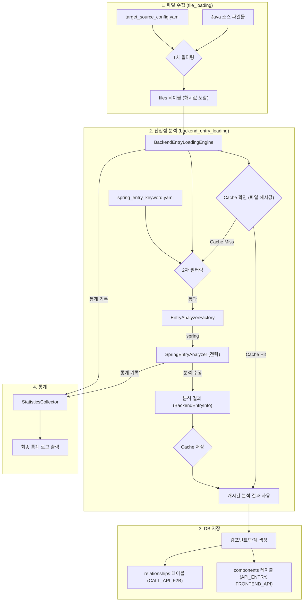

# 5단계 Phase1 Spring API 진입점 분석 - 상세 개발 계획서

## 1. 개요

### 1.1. 문서 목적
이 문서는 '5단계 - Spring API 진입점 분석' 기능 개발을 위한 **코딩 레벨의 상세 구현 방안**을 정의합니다. 기존 계획서와 개발자 의견들을 종합하여, 개발자가 즉시 참고하여 개발을 진행할 수 있는 구체적인 명세를 제공하는 것을 목표로 합니다.

### 1.2. 최종 범위
- **Phase 1**: Spring Framework (`@RestController`, `@Controller`, `@RequestMapping` 계열) 기반의 API 진입점 분석 기능 구현
- **분석 대상**: `target_source_config.yaml`에 정의된 Java 소스 파일
- **산출물**:
    - `API_ENTRY`, `FRONTEND_API` 타입의 `components`
    - `CALL_API_F2B` 타입의 `relationships`

---

## 2. 최종 아키텍처 설계

### 2.1. 파일 구조
```
CreateMetaDb/
├── backend_entry_loading.py          # (신규) 5단계 메인 엔진
├── parser/
│   ├── base_entry_analyzer.py        # (신규) 분석기 추상 기본 클래스
│   ├── spring_entry_analyzer.py      # (신규) Spring 분석기 (전략 1)
│   └── entry_analyzer_factory.py     # (신규) 분석기 팩토리
│   └── ...
├── config/parser/
│   └── spring_entry_keyword.yaml     # (신규) Spring 분석기 전용 설정
├── util/
│   ├── cache_utils.py                # (신규) 분석 결과 캐시 유틸리티
│   ├── statistics_utils.py           # (신규) 통계 수집 유틸리티
│   └── path_utils.py                 # (수정) URL 경로 조합 함수 추가
└── ...
```

### 2.2. 데이터 흐름 (Data Flow)
전략 패턴, 캐싱, 2단계 필터링을 모두 적용한 최종 데이터 흐름입니다.



---

## 3. 설정 파일 상세 설계

### 3.1. 설정 파일 역할 분담 (2-Tier Filtering)
- **`target_source_config.yaml` (1차 전역 필터)**: 프로젝트 전체에서 분석할 파일의 범위를 정의합니다. (`.java`, `.xml` 등)
- **`spring_entry_keyword.yaml` (2차 세부 필터)**: 1차 필터링된 `.java` 파일 중, Spring 분석기가 실제 파싱할 파일을 정밀하게 선별합니다. (예: `*Controller.java`) 이는 불필요한 파일(DTO, Service 등)을 열어보는 I/O 낭비를 막아 성능을 최적화합니다.

### 3.2. `config/parser/spring_entry_keyword.yaml` 상세 구조
```yaml
# Spring 진입점 분석을 위한 모든 설정을 정의

# 1. 파일 필터링 (2차 필터)
file_filtering:
  # Spring 컨트롤러일 가능성이 높은 파일 패턴 (필수)
  include_patterns:
    - "*Controller.java"
    - "*RestController.java"
  # 분석에서 제외할 파일 패턴 (선택)
  exclude_patterns:
    - "*Test.java"

# 2. Spring 어노테이션 정의
spring_annotations:
  # 클래스 레벨에서 검색할 어노테이션
  class_annotations:
    - "@RestController"
    - "@Controller"
    - "@RequestMapping"
  
  # 메서드 레벨에서 검색할 어노테이션
  method_annotations:
    - "@RequestMapping"
    - "@GetMapping"
    - "@PostMapping"
    - "@PutMapping"
    - "@DeleteMapping"
    - "@PatchMapping"

# 3. URL 및 HTTP 메서드 추출 규칙
extraction_rules:
  # URL 경로를 담고 있는 어노테이션 속성 목록 (Spring 버전에 따라 다를 수 있음)
  url_attributes:
    - "path"
    - "value"
  
  # @RequestMapping의 method 속성이 없을 경우 적용할 기본 HTTP 메서드
  default_http_methods:
    - "GET"
    - "POST"

# 4. 정규식 패턴 (AST 파서 Fallback용)
regex_patterns:
  # 주석, 문자열을 제외하고 클래스 선언부를 찾는 패턴
  class_declaration: '(?m)^[ \t]*((public|private|protected)\s+)?class\s+(\w+)\s*.*{'
  # 클래스 레벨 어노테이션과 URL을 찾는 패턴
  class_annotation: '(@(?:RestController|Controller|RequestMapping)\s*(?:\(.*?\))?)\s+(?=(?:public|class))'
  # 메서드 레벨 어노테이션과 URL, 메서드명을 찾는 패턴
  method_annotation: '(@(?:GetMapping|PostMapping|PutMapping|DeleteMapping|PatchMapping|RequestMapping)\s*(?:\(.*?\))?)\s+(?:public|private|protected|)\s*[\w\<\>\[\]]+\s+(\w+)\s*\('
  # 어노테이션 속성에서 URL 값을 추출하는 패턴 (path="/api", value="/api")
  url_from_attribute: '(?:path|value)\s*=\s*"(.*?)"'
```

---

## 4. 핵심 컴포넌트 상세 구현

### 4.1. `util/path_utils.py` (수정)
**역할**: URL 경로를 안전하게 조합하는 유틸리티 함수 추가

```python
# util/path_utils.py

def normalize_url_path(*parts):
    """
    여러 경로 조각을 안전하게 조합하여 표준 URL 경로로 만듭니다.
    예: normalize_url_path("/api/", "users", "list") -> "/api/users/list"
    예: normalize_url_path("api/users", "/list/") -> "/api/users/list"
    """
    from urllib.parse import urljoin
    
    # 항상 절대 경로 형태로 시작하도록 보장
    result = "/"
    for part in parts:
        # 각 부분을 슬래시로 끝나도록 만들어 urljoin이 상대경로로 인식하게 함
        if not part.endswith('/'):
            part += '/'
        result = urljoin(result, part)

    # 마지막에 불필요한 슬래시 제거 (루트 경로 제외)
    if result != '/' and result.endswith('/'):
        result = result[:-1]
        
    return result
```

### 4.2. `util/cache_utils.py` 및 `statistics_utils.py` (신규)
- `개발자의견2` 문서에 제안된 소스 코드와 동일하게 구현합니다.

### 4.3. `parser/base_entry_analyzer.py` (신규)
**역할**: 모든 분석기의 공통 인터페이스를 정의하는 추상 기본 클래스

```python
# parser/base_entry_analyzer.py
from abc import ABC, abstractmethod
from typing import List, Dict
# FileInfo, BackendEntryInfo 등 필요한 데이터 클래스 import

class BaseEntryAnalyzer(ABC):
    def __init__(self, framework_name: str, config_path: str):
        self.framework_name = framework_name
        self.config = self._load_config(config_path)
        # ... 공통 초기화 ...

    @abstractmethod
    def analyze_backend_entry(self, java_file: FileInfo, stats: 'StatisticsCollector') -> List['BackendEntryInfo']:
        """
        주어진 Java 파일에서 백엔드 진입점 정보를 분석하여 반환합니다.
        USER RULE: 파싱 에러 발생 시, 빈 리스트를 반환하고 stats에 실패를 기록합니다.
                   내부적으로 has_error='Y' 처리 후 DB에 저장될 수 있도록 합니다.
        """
        pass

    def _load_config(self, config_path: str) -> Dict:
        # util.config_utils 사용하여 설정 로드
        # USER RULE: 설정 파일 로드 실패 시 handle_error() 호출
        pass
```

### 4.4. `parser/spring_entry_analyzer.py` (신규)
**역할**: Spring 프레임워크 진입점 분석 (Fallback 전략 포함)

```python
# parser/spring_entry_analyzer.py
from .base_entry_analyzer import BaseEntryAnalyzer
# ... imports ...

class SpringEntryAnalyzer(BaseEntryAnalyzer):
    def __init__(self):
        super().__init__('spring', 'config/parser/spring_entry_keyword.yaml')
        # 설정 파일에서 정규식 패턴 미리 컴파일
        self.class_anno_regex = re.compile(self.config['regex_patterns']['class_annotation'])
        # ... 다른 정규식들도 컴파일 ...

    def analyze_backend_entry(self, java_file: FileInfo, stats: 'StatisticsCollector') -> List['BackendEntryInfo']:
        """
        Fallback 전략에 따라 Spring 진입점을 분석합니다.
        AST -> 정규식 순서로 시도합니다.
        """
        try:
            # 1. AST(Abstract Syntax Tree) 기반 파싱 시도
            # javalang 라이브러리 등을 활용
            ast_results = self._parse_with_ast(java_file.content)
            if ast_results is not None: # None이 아니면 성공 또는 복구 불가능한 오류
                stats.log_file_result(self.framework_name, success=True, stage='ast')
                # ... ast_results를 BackendEntryInfo 객체 리스트로 변환 ...
                return backend_entry_info_list

            # 2. 정규식 기반 파싱으로 Fallback
            # USER RULE: AST 파싱이 실패(None 반환)했으므로 계속 진행
            regex_results = self._parse_with_regex(java_file.content)
            if regex_results:
                stats.log_file_result(self.framework_name, success=True, stage='regex_fallback')
                # ... regex_results를 BackendEntryInfo 객체 리스트로 변환 ...
                return backend_entry_info_list

            # 모든 파싱 실패
            # USER RULE: 파싱 에러는 로그만 남기고 계속 진행
            logger.warning(f"모든 파싱 방법으로 진입점을 찾지 못했습니다: {java_file.path}")
            stats.log_file_result(self.framework_name, success=False, stage='full_failure')
            return []

        except Exception as e:
            # USER RULE: 예측하지 못한 예외는 handle_error()로 즉시 종료
            handle_error(f"Spring 분석 중 심각한 오류 발생: {java_file.path}", e)

    def _parse_with_ast(self, content: str) -> List[Dict]:
        """AST 기반 파싱. 실패 시 None 반환."""
        try:
            # ... javalang.parse.parse(content) ...
            # ... 트리 순회하며 어노테이션, URL, 메서드명 등 추출 ...
            return extracted_data
        except (javalang.tokenizer.LexerError, javalang.parser.JavaSyntaxError):
            # USER RULE: 파싱 문법 오류는 Fallback을 위해 None 반환
            return None
        except Exception as e:
            # USER RULE: 기타 예외는 로그 남기고 None 반환
            logger.error(f"AST 파싱 중 예외 발생: {e}")
            return None

    def _parse_with_regex(self, content: str) -> List[Dict]:
        """정규식 기반 파싱."""
        # 1. 주석 및 문자열 제거 전처리
        clean_content = self._preprocess_content(content)
        
        # 2. 클래스/메서드 어노테이션 분석
        # ... self.class_anno_regex.findall(clean_content) ...
        # ... self.method_anno_regex.findall(clean_content) ...
        # ... util.path_utils.normalize_url_path()로 URL 조합 ...
        return extracted_data

    def _preprocess_content(self, content: str) -> str:
        """정규식 분석 전, 주석과 문자열 리터럴을 제거하여 오탐지를 방지."""
        # 멀티라인 주석 제거
        content = re.sub(r'/\*.*?\*/', '', content, flags=re.DOTALL)
        # 한 줄 주석 제거
        content = re.sub(r'//.*', '', content)
        # 문자열 리터럴을 빈 문자열로 대체
        content = re.sub(r'"(.*?)"', '""', content)
        return content
```

### 4.5. `backend_entry_loading.py` (신규)
**역할**: 5단계 전체 프로세스 관리 (파일 필터링, 분석기 실행, DB 저장)

```python
# backend_entry_loading.py
# ... imports ...

class BackendEntryLoadingEngine:
    def __init__(self, project_name: str):
        self.project_name = project_name
        self.db = DatabaseManager() # util.database_utils
        self.stats = StatisticsCollector()
        self.cache = AnalysisCache()
        
        # 전략 패턴: 설정에 따라 분석기(전략) 로드
        self.analyzers = self._load_analyzers_from_config()

    def execute_backend_entry_loading(self):
        try:
            # 1. 분석 대상 Java 파일 목록 가져오기 (1차 필터링된 결과)
            java_files = self.db.get_files_by_extension('.java')

            # 2. 각 파일을 순회하며 진입점 분석
            all_backend_entries = []
            for java_file in java_files:
                # 캐시 확인
                cached_entries = self.cache.get(java_file.hash_value)
                if cached_entries:
                    all_backend_entries.extend(cached_entries)
                    continue

                # 2차 필터링 및 분석 실행
                file_entries = self._filter_and_analyze_file(java_file)
                
                # 캐시 저장 및 결과 취합
                self.cache.set(java_file.hash_value, file_entries)
                all_backend_entries.extend(file_entries)

            # 3. 분석 결과를 DB에 저장
            self._save_results_to_db(all_backend_entries)

            # 4. 최종 통계 출력
            self._print_backend_entry_statistics()

        except Exception as e:
            # USER RULE: 예측하지 못한 예외는 handle_error()로 즉시 종료
            handle_error("백엔드 진입점 로딩 프로세스 실패", e)

    def _filter_and_analyze_file(self, java_file: FileInfo) -> List['BackendEntryInfo']:
        """2차 필터링을 수행하고, 통과 시 등록된 분석기로 분석."""
        file_entries = []
        for analyzer in self.analyzers:
            # 각 분석기는 자신의 설정(spring_entry_keyword.yaml)에 따라 2차 필터링 수행
            if self._is_target_for_analyzer(java_file, analyzer):
                entries = analyzer.analyze_backend_entry(java_file, self.stats)
                file_entries.extend(entries)
        return file_entries

    def _is_target_for_analyzer(self, java_file: FileInfo, analyzer: BaseEntryAnalyzer) -> bool:
        """분석기의 2차 필터링(include/exclude) 규칙에 맞는지 확인."""
        # fnmatch 라이브러리 등을 사용하여 파일명 패턴 매칭
        # analyzer.config['file_filtering'] 설정 활용
        pass

    def _save_results_to_db(self, entries: List['BackendEntryInfo']):
        """분석 결과를 components와 relationships 테이블에 저장."""
        components_to_insert = []
        relationships_to_insert = []
        for entry in entries:
            # 컴포넌트 이름 유일성 보장 (클래스명 포함)
            # 예: API_ENTRY.GET_/api/users/{VAR}-com.example.UserController
            url_pattern_safe = entry.url_pattern.replace('/', '_')
            class_name_safe = entry.class_name.replace('.', '_')
            
            api_entry_name = f"API_ENTRY.{entry.http_method}_{url_pattern_safe}-{class_name_safe}"
            frontend_api_name = f"FRONTEND_API.{entry.http_method}_{url_pattern_safe}-{class_name_safe}"
            
            # ... components_to_insert, relationships_to_insert 리스트에 데이터 추가 ...

        # DB에 배치 삽입
        self.db.batch_insert_components(components_to_insert)
        self.db.batch_insert_relationships(relationships_to_insert)

    # ... 기타 메서드 ...
```

---

## 5. User Rules 준수 방안

- **`handle_error()` 사용**: 모든 `try...except Exception` 블록에서 `handle_error()`를 호출하여 예측하지 못한 오류 발생 시 즉시 프로그램을 종료하도록 명시했습니다.
- **파싱 에러 처리**: `SpringEntryAnalyzer`에서 `javalang`의 문법 오류나 예측된 파싱 실패는 `None`을 반환하여 Fallback을 유도하고, 이는 `handle_error()`를 호출하지 않아 프로그램이 중단되지 않습니다. 최종 실패 시에는 로그만 남기고 빈 리스트를 반환하여 다음 파일 분석으로 넘어갑니다.
- **하드코딩 금지**: 모든 설정값(파일 패턴, 어노테이션, 정규식 등)은 `.yaml` 파일에서 로드하도록 설계했습니다.
- **공통 함수 사용**: `path_utils`, `config_utils`, `database_utils` 등 기존 유틸리티 사용을 명시하고, `normalize_url_path`와 같이 필요한 신규 함수는 `util`에 추가하도록 제안했습니다.
- **`target_source_config.yaml` 활용**: 1차 필터링 역할로 명확히 정의하고, 2차 필터링과의 관계를 설명하여 중복이 아닌 효율적인 계층 구조임을 명시했습니다.

---

## 6. 개발 단계별 Task 정의

1.  **[Util]** `util/path_utils.py`에 `normalize_url_path` 함수 구현 및 단위 테스트 작성.
2.  **[Util]** `util/cache_utils.py`에 `AnalysisCache` 클래스 구현 및 단위 테스트 작성.
3.  **[Util]** `util/statistics_utils.py`에 `StatisticsCollector` 클래스 구현 및 단위 테스트 작성.
4.  **[Config]** `config/parser/spring_entry_keyword.yaml` 파일 상세 구조에 맞게 작성.
5.  **[Parser]** `parser/base_entry_analyzer.py`에 `BaseEntryAnalyzer` 추상 클래스 정의.
6.  **[Parser]** `parser/spring_entry_analyzer.py`에 `SpringEntryAnalyzer` 클래스 기본 구조 및 초기화 구현.
7.  **[Parser]** `SpringEntryAnalyzer`에 `_preprocess_content` (주석/문자열 제거) 메서드 구현.
8.  **[Parser]** `SpringEntryAnalyzer`에 `_parse_with_regex` (정규식 기반 파싱) 메서드 구현.
9.  **[Parser]** `SpringEntryAnalyzer`에 `_parse_with_ast` (AST 기반 파싱) 메서드 구현 (javalang 라이브러리 활용).
10. **[Parser]** `SpringEntryAnalyzer`의 메인 메서드 `analyze_backend_entry`에 Fallback 로직 구현.
11. **[Core]** `backend_entry_loading.py`에 `BackendEntryLoadingEngine` 클래스 구현 (분석기 로딩, 캐싱, 통계 로직 포함).
12. **[Core]** `BackendEntryLoadingEngine`에 2차 필터링 로직 (`_is_target_for_analyzer`) 구현.
13. **[Core]** `BackendEntryLoadingEngine`에 DB 저장 로직 (`_save_results_to_db`) 구현 (컴포넌트명 유일성 보장 로직 포함).
14. **[Integration]** `main.py`에 5단계 실행 로직을 추가하고 `BackendEntryLoadingEngine` 호출 연동.
15. **[Test]** 다양한 Spring Controller 예제 파일에 대한 통합 테스트 및 결과 검증.

```