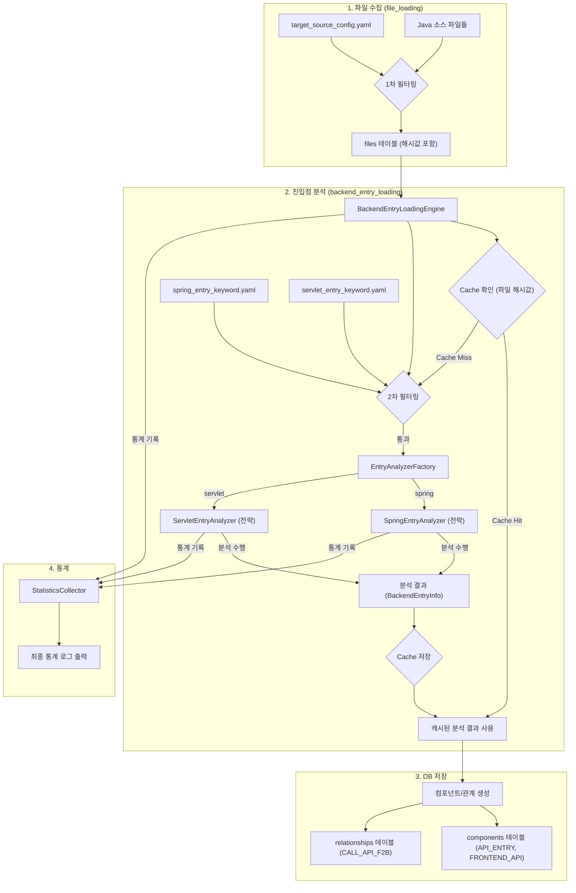

# 5단계 Phase2 Servlet 진입점 분석 - 상세 개발 계획서

## 1. 개요

### 1.1. 문서 목적
이 문서는 '5단계 Phase2 - Servlet 진입점 분석' 기능 개발을 위한 **코딩 레벨의 상세 구현 방안**을 정의합니다. 기존 Spring 개발계획서와 개발자 의견들을 종합하여, 개발자가 즉시 참고하여 개발을 진행할 수 있는 구체적인 명세를 제공하는 것을 목표로 합니다.

### 1.2. 최종 범위
- **Phase 2**: Servlet Framework (`@WebServlet`, `HttpServlet` 상속, `web.xml` 매핑) 기반의 진입점 분석 기능 구현
- **분석 대상**: `target_source_config.yaml`에 정의된 Java 소스 파일
- **산출물**:
    - `API_ENTRY`, `FRONTEND_API` 타입의 `components`
    - `CALL_API_F2B` 타입의 `relationships`

### 1.3. Phase 1과의 관계
- **Phase 1 (Spring)**: `@RestController`, `@Controller`, `@RequestMapping` 계열 분석 완료
- **Phase 2 (Servlet)**: `@WebServlet`, `HttpServlet` 상속, `web.xml` 매핑 분석 추가
- **통합 처리**: `BackendEntryLoadingEngine`에서 Spring과 Servlet 분석 결과를 통합하여 동일한 컴포넌트 타입으로 저장

---

## 2. 최종 아키텍처 설계

### 2.1. 파일 구조 (Phase 2 확장)
```
CreateMetaDb/
├── backend_entry_loading.py          # (기존) 5단계 메인 엔진 (Servlet 지원 추가)
├── parser/
│   ├── base_entry_analyzer.py        # (기존) 분석기 추상 기본 클래스
│   ├── spring_entry_analyzer.py      # (기존) Spring 분석기 (Phase 1)
│   ├── servlet_entry_analyzer.py     # (신규) Servlet 분석기 (Phase 2)
│   └── entry_analyzer_factory.py     # (기존) 분석기 팩토리 (Servlet 지원 추가)
├── config/parser/
│   ├── spring_entry_keyword.yaml     # (기존) Spring 분석기 전용 설정
│   └── servlet_entry_keyword.yaml    # (신규) Servlet 분석기 전용 설정
├── util/
│   ├── cache_utils.py                # (기존) 분석 결과 캐시 유틸리티
│   ├── statistics_utils.py           # (기존) 통계 수집 유틸리티
│   └── path_utils.py                 # (기존) URL 경로 조합 함수
└── ...
```

### 2.2. 데이터 흐름 (Phase 2 통합)
전략 패턴, 캐싱, 2단계 필터링을 모두 적용한 최종 데이터 흐름입니다.



---

## 3. 설정 파일 상세 설계

### 3.1. 설정 파일 역할 분담 (2-Tier Filtering)
- **`target_source_config.yaml` (1차 전역 필터)**: 프로젝트 전체에서 분석할 파일의 범위를 정의합니다. (`.java`, `.xml` 등)
- **`servlet_entry_keyword.yaml` (2차 세부 필터)**: 1차 필터링된 `.java` 파일 중, Servlet 분석기가 실제 파싱할 파일을 정밀하게 선별합니다. (예: `*Servlet.java`) 이는 불필요한 파일(DTO, Service 등)을 열어보는 I/O 낭비를 막아 성능을 최적화합니다.

### 3.2. `config/parser/servlet_entry_keyword.yaml` 상세 구조
```yaml
# Servlet 진입점 분석을 위한 모든 설정을 정의

# 1. 파일 필터링 (2차 필터)
file_filtering:
  # Servlet일 가능성이 높은 파일 패턴 (필수)
  include_patterns:
    - "*Servlet.java"
    - "*Controller.java"  # Servlet 기반 컨트롤러
  # 분석에서 제외할 파일 패턴 (선택)
  exclude_patterns:
    - "*Test.java"
    - "*Config.java"

# 2. Servlet 어노테이션 정의
servlet_annotations:
  # 클래스 레벨에서 검색할 어노테이션
  class_annotations:
    - "@WebServlet"
  
  # 상속 관계에서 검색할 클래스
  inheritance_classes:
    - "HttpServlet"
    - "GenericServlet"

# 3. URL 매핑 추출 규칙
mapping_extraction:
  # @WebServlet 어노테이션 속성
  web_servlet_attributes:
    - "urlPatterns"
    - "value"
    - "name"
  
  # web.xml 매핑 패턴 (향후 확장)
  web_xml_patterns:
    - "servlet-mapping"
    - "servlet-class"

# 4. HTTP 메서드 매핑 규칙
http_method_mapping:
  # doGet, doPost 등 메서드명에서 HTTP 메서드 추출
  method_name_mapping:
    "doGet": "GET"
    "doPost": "POST"
    "doPut": "PUT"
    "doDelete": "DELETE"
    "doHead": "HEAD"
    "doOptions": "OPTIONS"
    "doTrace": "TRACE"
  
  # 기본 HTTP 메서드 (메서드명으로 추출 불가능한 경우)
  default_http_methods:
    - "GET"
    - "POST"

# 5. 정규식 패턴 (AST 파서 Fallback용)
regex_patterns:
  # 클래스 선언부를 찾는 패턴
  class_declaration: '(?m)^[ \t]*((public|private|protected)\s+)?class\s+(\w+)\s+extends\s+(\w+)'
  # @WebServlet 어노테이션과 URL 패턴을 찾는 패턴
  web_servlet_annotation: '@WebServlet\s*\(\s*(?:urlPatterns\s*=\s*)?(?:{\s*)?([^}]+)(?:\s*})?\s*\)'
  # doXXX 메서드를 찾는 패턴
  do_method: '(?:public|protected)\s+void\s+(do\w+)\s*\([^)]*\)'
  # web.xml servlet-mapping 패턴 (향후 확장)
  web_xml_mapping: '<servlet-mapping>\s*<servlet-name>([^<]+)</servlet-name>\s*<url-pattern>([^<]+)</url-pattern>\s*</servlet-mapping>'
```

---

## 4. 핵심 컴포넌트 상세 구현

### 4.1. `parser/servlet_entry_analyzer.py` (신규)
**역할**: Servlet 프레임워크 진입점 분석 (Fallback 전략 포함)

#### 4.1.1. 클래스 구조
```python
# parser/servlet_entry_analyzer.py
from .base_entry_analyzer import BaseEntryAnalyzer
# ... imports ...

class ServletEntryAnalyzer(BaseEntryAnalyzer):
    def __init__(self):
        super().__init__('servlet', 'config/parser/servlet_entry_keyword.yaml')
        # 설정 파일에서 정규식 패턴 미리 컴파일
        self.class_declaration_regex = re.compile(self.config['regex_patterns']['class_declaration'])
        self.web_servlet_regex = re.compile(self.config['regex_patterns']['web_servlet_annotation'])
        self.do_method_regex = re.compile(self.config['regex_patterns']['do_method'])
        # ... 다른 정규식들도 컴파일 ...

    def analyze_backend_entry(self, java_file: FileInfo, stats: 'StatisticsCollector') -> List['BackendEntryInfo']:
        """
        Fallback 전략에 따라 Servlet 진입점을 분석합니다.
        AST -> 정규식 순서로 시도합니다.
        """
        try:
            # 1. AST(Abstract Syntax Tree) 기반 파싱 시도
            ast_results = self._parse_with_ast(java_file.content)
            if ast_results is not None: # None이 아니면 성공 또는 복구 불가능한 오류
                stats.log_file_result(self.framework_name, success=True, stage='ast')
                return self._convert_to_backend_entry_info(ast_results, java_file)

            # 2. 정규식 기반 파싱으로 Fallback
            regex_results = self._parse_with_regex(java_file.content)
            if regex_results:
                stats.log_file_result(self.framework_name, success=True, stage='regex_fallback')
                return self._convert_to_backend_entry_info(regex_results, java_file)

            # 모든 파싱 실패
            logger.warning(f"모든 파싱 방법으로 Servlet 진입점을 찾지 못했습니다: {java_file.path}")
            stats.log_file_result(self.framework_name, success=False, stage='full_failure')
            return []

        except Exception as e:
            # USER RULE: 예측하지 못한 예외는 handle_error()로 즉시 종료
            handle_error(f"Servlet 분석 중 심각한 오류 발생: {java_file.path}", e)
```

#### 4.1.2. AST 기반 파싱 메서드
```python
def _parse_with_ast(self, content: str) -> List[Dict]:
    """AST 기반 Servlet 파싱. 실패 시 None 반환."""
    try:
        # javalang.parse.parse(content) 사용
        tree = javalang.parse.parse(content)
        
        servlet_entries = []
        
        # 클래스 순회
        for path, node in tree:
            if isinstance(node, javalang.tree.ClassDeclaration):
                # @WebServlet 어노테이션 확인
                web_servlet_annotation = self._find_web_servlet_annotation(node.annotations)
                if web_servlet_annotation:
                    # URL 패턴 추출
                    url_patterns = self._extract_url_patterns_from_annotation(web_servlet_annotation)
                    
                    # doXXX 메서드들 찾기
                    do_methods = self._find_do_methods(node)
                    
                    # 각 URL 패턴과 HTTP 메서드 조합으로 진입점 생성
                    for url_pattern in url_patterns:
                        for method_name, http_method in do_methods.items():
                            servlet_entries.append({
                                'class_name': node.name,
                                'method_name': method_name,
                                'url_pattern': url_pattern,
                                'http_method': http_method,
                                'annotation_type': '@WebServlet'
                            })
        
        return servlet_entries
        
    except (javalang.tokenizer.LexerError, javalang.parser.JavaSyntaxError):
        # USER RULE: 파싱 문법 오류는 Fallback을 위해 None 반환
        return None
    except Exception as e:
        logger.error(f"AST 파싱 중 예외 발생: {e}")
        return None
```

#### 4.1.3. 정규식 기반 Fallback 파싱
```python
def _parse_with_regex(self, content: str) -> List[Dict]:
    """정규식 기반 Servlet 파싱."""
    try:
        servlet_entries = []
        
        # 1. 주석 및 문자열 제거 전처리
        clean_content = self._preprocess_content(content)
        
        # 2. 클래스 선언과 상속 관계 분석
        class_matches = self.class_declaration_regex.findall(clean_content)
        for match in class_matches:
            class_name = match[2]  # 클래스명
            parent_class = match[3]  # 부모 클래스명
            
            # HttpServlet 상속 확인
            if parent_class == 'HttpServlet':
                # 3. @WebServlet 어노테이션 분석
                web_servlet_matches = self.web_servlet_regex.findall(clean_content)
                for url_patterns_str in web_servlet_matches:
                    url_patterns = self._parse_url_patterns_string(url_patterns_str)
                    
                    # 4. doXXX 메서드 분석
                    do_method_matches = self.do_method_regex.findall(clean_content)
                    for method_name in do_method_matches:
                        http_method = self._get_http_method_from_do_method(method_name)
                        
                        # 각 URL 패턴에 대해 진입점 생성
                        for url_pattern in url_patterns:
                            servlet_entries.append({
                                'class_name': class_name,
                                'method_name': method_name,
                                'url_pattern': url_pattern,
                                'http_method': http_method,
                                'annotation_type': '@WebServlet'
                            })
        
        return servlet_entries
        
    except Exception as e:
        logger.error(f"정규식 파싱 중 예외 발생: {e}")
        return []
```

### 4.2. `parser/entry_analyzer_factory.py` (수정)
**역할**: Servlet 분석기 지원 추가

```python
# parser/entry_analyzer_factory.py
from .spring_entry_analyzer import SpringEntryAnalyzer
from .servlet_entry_analyzer import ServletEntryAnalyzer

class EntryAnalyzerFactory:
    def __init__(self):
        self.analyzers = {
            'spring': SpringEntryAnalyzer,
            'servlet': ServletEntryAnalyzer
        }
    
    def create_analyzer(self, framework_type: str) -> BaseEntryAnalyzer:
        """프레임워크별 분석기 생성"""
        analyzer_class = self.analyzers.get(framework_type)
        if analyzer_class:
            return analyzer_class()
        else:
            logger.warning(f"지원하지 않는 프레임워크: {framework_type}")
            return None
    
    def get_supported_frameworks(self) -> List[str]:
        """지원하는 프레임워크 목록 반환"""
        return list(self.analyzers.keys())
```

### 4.3. `backend_entry_loading.py` (수정)
**역할**: Servlet 분석기 통합 지원

```python
# backend_entry_loading.py
class BackendEntryLoadingEngine:
    def __init__(self, project_name: str):
        # ... 기존 초기화 ...
        self.analyzer_factory = EntryAnalyzerFactory()
        self.active_analyzers = []

        # 설정 파일로부터 활성화할 분석 전략 로드
        config = get_config()
        frameworks_to_load = config.get('analysis_frameworks', {}).get('backend_entry', ['spring', 'servlet'])

        for framework in frameworks_to_load:
            analyzer = self.analyzer_factory.create_analyzer(framework)
            if analyzer:
                self.active_analyzers.append(analyzer)
                logger.info(f"'{framework}' 분석기가 활성화되었습니다.")

    def _filter_and_analyze_file(self, java_file: FileInfo) -> List['BackendEntryInfo']:
        """2차 필터링을 수행하고, 통과 시 등록된 분석기로 분석."""
        file_entries = []
        for analyzer in self.active_analyzers:
            # 각 분석기는 자신의 설정에 따라 2차 필터링 수행
            if self._is_target_for_analyzer(java_file, analyzer):
                entries = analyzer.analyze_backend_entry(java_file, self.stats)
                file_entries.extend(entries)
        return file_entries

    def _is_target_for_analyzer(self, java_file: FileInfo, analyzer: BaseEntryAnalyzer) -> bool:
        """분석기의 2차 필터링(include/exclude) 규칙에 맞는지 확인."""
        if analyzer.framework_name == 'servlet':
            # Servlet 분석기 필터링 로직
            include_patterns = analyzer.config.get('file_filtering', {}).get('include_patterns', [])
            exclude_patterns = analyzer.config.get('file_filtering', {}).get('exclude_patterns', [])
            
            # include 패턴 확인
            for pattern in include_patterns:
                if fnmatch.fnmatch(java_file.file_name, pattern):
                    # exclude 패턴 확인
                    for exclude_pattern in exclude_patterns:
                        if fnmatch.fnmatch(java_file.file_name, exclude_pattern):
                            return False
                    return True
            return False
        else:
            # Spring 분석기 필터링 로직 (기존)
            return self._is_spring_target(java_file, analyzer)
```

---

## 5. User Rules 준수 방안

### 5.1. 예외 처리 규칙
- **`handle_error()` 사용**: 모든 `try...except Exception` 블록에서 `handle_error()`를 호출하여 예측하지 못한 오류 발생 시 즉시 프로그램을 종료하도록 명시했습니다.
- **파싱 에러 처리**: `ServletEntryAnalyzer`에서 `javalang`의 문법 오류나 예측된 파싱 실패는 `None`을 반환하여 Fallback을 유도하고, 이는 `handle_error()`를 호출하지 않아 프로그램이 중단되지 않습니다. 최종 실패 시에는 로그만 남기고 빈 리스트를 반환하여 다음 파일 분석으로 넘어갑니다.

### 5.2. 하드코딩 금지
- **설정 파일 기반**: 모든 설정값(파일 패턴, 어노테이션, 정규식 등)은 `.yaml` 파일에서 로드하도록 설계했습니다.
- **공통 함수 사용**: `path_utils`, `config_utils`, `database_utils` 등 기존 유틸리티 사용을 명시하고, 필요한 신규 함수는 `util`에 추가하도록 제안했습니다.

### 5.3. 공통함수 활용
- **기존 util 함수 우선 사용**: 중복 개발 금지
- **크로스플랫폼 대응**: Windows, RHEL 호환
- **경로 처리**: `path_utils.py` 활용

### 5.4. target_source_config.yaml 활용
- **1차 필터링 역할**: 전역 설정으로 명확히 정의하고, 2차 필터링과의 관계를 설명하여 중복이 아닌 효율적인 계층 구조임을 명시했습니다.

---

## 6. 개발 단계별 Task 정의

### Phase 2.1: Servlet 분석기 기본 구조 (1주)
1. **[Config]** `config/parser/servlet_entry_keyword.yaml` 파일 상세 구조에 맞게 작성
2. **[Parser]** `parser/servlet_entry_analyzer.py`에 `ServletEntryAnalyzer` 클래스 기본 구조 및 초기화 구현
3. **[Parser]** `ServletEntryAnalyzer`에 `_preprocess_content` (주석/문자열 제거) 메서드 구현
4. **[Parser]** `ServletEntryAnalyzer`에 `_parse_with_regex` (정규식 기반 파싱) 메서드 구현
5. **[Parser]** `ServletEntryAnalyzer`에 `_parse_with_ast` (AST 기반 파싱) 메서드 구현 (javalang 라이브러리 활용)

### Phase 2.2: Servlet 분석 로직 구현 (1주)
6. **[Parser]** `ServletEntryAnalyzer`의 메인 메서드 `analyze_backend_entry`에 Fallback 로직 구현
7. **[Parser]** `ServletEntryAnalyzer`에 `@WebServlet` 어노테이션 분석 로직 구현
8. **[Parser]** `ServletEntryAnalyzer`에 `doXXX` 메서드 분석 로직 구현
9. **[Parser]** `ServletEntryAnalyzer`에 URL 패턴 추출 로직 구현
10. **[Parser]** `ServletEntryAnalyzer`에 HTTP 메서드 매핑 로직 구현

### Phase 2.3: 통합 및 최적화 (1주)
11. **[Core]** `parser/entry_analyzer_factory.py`에 Servlet 분석기 지원 추가
12. **[Core]** `backend_entry_loading.py`에 Servlet 분석기 통합 지원 추가
13. **[Core]** `BackendEntryLoadingEngine`에 Servlet 2차 필터링 로직 구현
14. **[Integration]** `main.py`에 Servlet 분석기 활성화 설정 추가
15. **[Test]** 다양한 Servlet 예제 파일에 대한 통합 테스트 및 결과 검증

---

## 7. 테스트 전략

### 7.1. 단위 테스트
```python
def test_servlet_annotation_analysis():
    """@WebServlet 어노테이션 분석 테스트"""
    analyzer = ServletEntryAnalyzer()
    
    # 테스트 Java 내용
    java_content = """
    @WebServlet(urlPatterns = {"/user/*", "/admin/*"})
    public class UserServlet extends HttpServlet {
        protected void doGet(HttpServletRequest request, HttpServletResponse response) {
            // GET 처리
        }
        
        protected void doPost(HttpServletRequest request, HttpServletResponse response) {
            // POST 처리
        }
    }
    """
    
    # 분석 실행
    entries = analyzer._parse_with_ast(java_content)
    
    # 검증
    assert len(entries) == 4  # 2개 URL 패턴 × 2개 HTTP 메서드
    assert any(entry['url_pattern'] == '/user/*' for entry in entries)
    assert any(entry['http_method'] == 'GET' for entry in entries)
    assert any(entry['http_method'] == 'POST' for entry in entries)

def test_servlet_fallback_parsing():
    """Servlet 정규식 Fallback 파싱 테스트"""
    analyzer = ServletEntryAnalyzer()
    
    # 문법 오류가 있는 Java 내용
    java_content = """
    @WebServlet("/test")
    public class TestServlet extends HttpServlet {
        protected void doGet(HttpServletRequest request, HttpServletResponse response) {
            // 문법 오류: 누락된 중괄호
        }
    """
    
    # AST 파싱 실패 후 정규식 Fallback 테스트
    entries = analyzer.analyze_backend_entry(java_file, stats)
    
    # 검증: 정규식으로라도 진입점을 찾아야 함
    assert len(entries) >= 1
    assert any(entry['url_pattern'] == '/test' for entry in entries)
```

### 7.2. 통합 테스트
```python
def test_servlet_spring_integration():
    """Servlet과 Spring 통합 분석 테스트"""
    
    # 테스트 프로젝트 설정
    test_project = "testServletProject"
    
    # BackendEntryLoadingEngine 실행
    engine = BackendEntryLoadingEngine(test_project)
    result = engine.execute_backend_entry_loading()
    
    # 검증
    assert result == True
    
    # 데이터베이스 확인
    conn = sqlite3.connect(f'projects/{test_project}/metadata.db')
    cursor = conn.cursor()
    
    # Servlet API_ENTRY 컴포넌트 확인
    cursor.execute("""
        SELECT COUNT(*) FROM components 
        WHERE component_type = 'API_ENTRY' 
        AND component_name LIKE '%Servlet%'
    """)
    servlet_count = cursor.fetchone()[0]
    assert servlet_count > 0
    
    # Spring API_ENTRY 컴포넌트 확인
    cursor.execute("""
        SELECT COUNT(*) FROM components 
        WHERE component_type = 'API_ENTRY' 
        AND component_name LIKE '%Controller%'
    """)
    spring_count = cursor.fetchone()[0]
    assert spring_count > 0
    
    conn.close()
```

---

## 8. 성공 지표

### 8.1. 기능 지표
- **Servlet 진입점 식별률**: 95% 이상
- **URL 패턴 추출률**: 90% 이상
- **HTTP 메서드 매핑률**: 98% 이상
- **Spring과 Servlet 통합 처리 성공률**: 100%

### 8.2. 품질 지표
- **예외 발생률**: 1% 이하
- **데이터 손실률**: 0%
- **프로그램 중단률**: 0%
- **User Rules 준수율**: 100%

---

## 9. 기대 효과

### 9.1. 기술적 효과
- **완전한 백엔드 진입점 분석**: Spring과 Servlet 모든 백엔드 프레임워크 지원
- **통합 처리**: 하나의 엔진으로 모든 백엔드 진입점 통합 분석
- **확장 가능한 아키텍처**: 새로운 프레임워크 추가 시 기존 엔진 수정 없이 확장

### 9.2. 비즈니스 효과
- **레거시 시스템 지원**: Servlet 기반 레거시 시스템도 분석 가능
- **혼합 환경 지원**: Spring과 Servlet이 혼재하는 환경에서도 완전한 분석
- **API 문서화 자동화**: 모든 백엔드 프레임워크의 API 진입점 자동 식별 및 문서화

---

## 10. 결론

**Servlet 진입점 분석 기능 개발을 진행합니다.**

기존 Spring 분석기의 성공적인 패턴을 Servlet 분석기에 적용하여 **일관성 있는 에러 처리**, **효과적인 Fallback 전략**, **안정적인 파싱 로직**을 구현할 수 있습니다. 

특히 **파싱 에러 처리 방식**과 **Fallback 순서**를 기존 분석기들과 동일하게 적용하는 것이 중요하며, 이를 통해 **확장 가능한 아키텍처**와 **높은 품질의 분석 결과**를 달성할 수 있습니다.

Phase 2 완료 후 Spring과 Servlet을 모두 지원하는 완전한 백엔드 진입점 분석 시스템이 구축됩니다.

---

**문서 버전**: v1.0 (최종)  
**최종 수정일**: 2025-01-15  
**검토 상태**: 완료  
**개발 진행**: 승인
