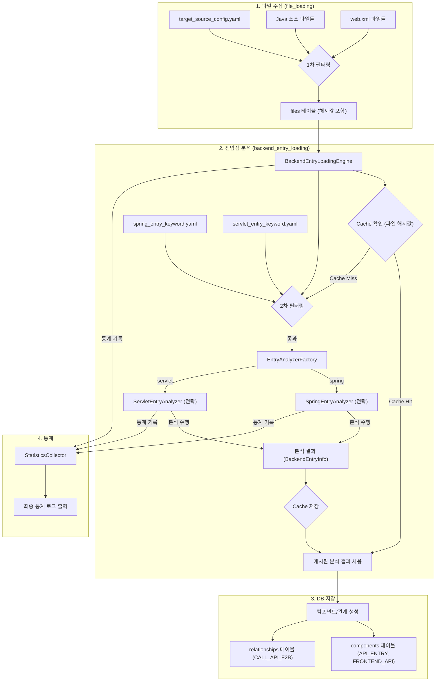

# 5단계 Phase2 Servlet 진입점 분석 - 최종 통합 개발 계획서

## 📋 개요

### 문서 정보
- **문서명**: 5단계_Phase2_Servlet개발계획서_20250915_151940_최종안.md
- **작성일**: 2025-09-15 15:19:40
- **작성자**: AI 개발자 (최종 통합)
- **검토 대상**: 
  - 5단계_Phase2_Servlet개발계획서_20250115_150300.md (원본 계획서)
  - 5단계_Phase2_Servlet개발계획서_20250115_150900_개발자의견1.md (개발자 의견)
  - 5단계_Phase1_Spring개발계획서_20250915_143300_최종_상세.md (Spring 참고)

### 문서 목적
이 문서는 '5단계 Phase2 - Servlet 진입점 분석' 기능 개발을 위한 **코딩 레벨의 상세 구현 방안**을 정의합니다. 기존 Spring 개발계획서의 성공적인 패턴과 개발자 의견들을 종합하여, 개발자가 즉시 참고하여 개발을 진행할 수 있는 구체적인 명세를 제공하는 것을 목표로 합니다.

### 최종 범위
- **Phase 2**: Servlet Framework (`@WebServlet`, `HttpServlet` 상속, `web.xml` 매핑) 기반의 진입점 분석 기능 구현
- **분석 대상**: `target_source_config.yaml`에 정의된 Java 소스 파일 및 `web.xml` 파일
- **산출물**:
    - `API_ENTRY`, `FRONTEND_API` 타입의 `components`
    - `CALL_API_F2B` 타입의 `relationships`

### Phase 1과의 관계
- **Phase 1 (Spring)**: `@RestController`, `@Controller`, `@RequestMapping` 계열 분석 완료
- **Phase 2 (Servlet)**: `@WebServlet`, `HttpServlet` 상속, `web.xml` 매핑 분석 추가
- **통합 처리**: `BackendEntryLoadingEngine`에서 Spring과 Servlet 분석 결과를 통합하여 동일한 컴포넌트 타입으로 저장

---

## 🏗️ 최종 아키텍처 설계

### 파일 구조 (Phase 2 확장)
```
CreateMetaDb/
├── backend_entry_loading.py          # (기존) 5단계 메인 엔진 (Servlet 지원 추가)
├── parser/
│   ├── base_entry_analyzer.py        # (기존) 분석기 추상 기본 클래스
│   ├── spring_entry_analyzer.py      # (기존) Spring 분석기 (Phase 1)
│   ├── servlet_entry_analyzer.py     # (신규) Servlet 분석기 (Phase 2)
│   └── entry_analyzer_factory.py     # (기존) 분석기 팩토리 (Servlet 지원 추가)
├── config/parser/
│   ├── spring_entry_keyword.yaml     # (기존) Spring 분석기 전용 설정
│   └── servlet_entry_keyword.yaml    # (신규) Servlet 분석기 전용 설정
├── util/
│   ├── cache_utils.py                # (기존) 분석 결과 캐시 유틸리티
│   ├── statistics_utils.py           # (기존) 통계 수집 유틸리티
│   └── path_utils.py                 # (기존) URL 경로 조합 함수
└── ...
```

### 데이터 흐름 (Phase 2 통합)
전략 패턴, 캐싱, 2단계 필터링을 모두 적용한 최종 데이터 흐름입니다.



---

## ⚙️ 설정 파일 상세 설계

### 설정 파일 역할 분담 (2-Tier Filtering)
- **`target_source_config.yaml` (1차 전역 필터)**: 프로젝트 전체에서 분석할 파일의 범위를 정의합니다. (`.java`, `.xml` 등)
- **`servlet_entry_keyword.yaml` (2차 세부 필터)**: 1차 필터링된 `.java` 파일 중, Servlet 분석기가 실제 파싱할 파일을 정밀하게 선별합니다. (예: `*Servlet.java`) 이는 불필요한 파일(DTO, Service 등)을 열어보는 I/O 낭비를 막아 성능을 최적화합니다.

### `config/parser/servlet_entry_keyword.yaml` 상세 구조
```yaml
# Servlet 진입점 분석을 위한 모든 설정을 정의

# 1. 파일 필터링 (2차 필터)
file_filtering:
  # Servlet일 가능성이 높은 파일 패턴 (필수)
  include_patterns:
    - "*Servlet.java"
    - "*Controller.java"  # Servlet 기반 컨트롤러
  # 분석에서 제외할 파일 패턴 (선택)
  exclude_patterns:
    - "*Test.java"
    - "*Config.java"

# 2. Servlet 어노테이션 정의
servlet_annotations:
  # 클래스 레벨에서 검색할 어노테이션
  class_annotations:
    - "@WebServlet"
  
  # 상속 관계에서 검색할 클래스
  inheritance_classes:
    - "HttpServlet"
    - "GenericServlet"

# 3. URL 매핑 추출 규칙
mapping_extraction:
  # @WebServlet 어노테이션 속성
  web_servlet_attributes:
    - "urlPatterns"
    - "value"
    - "name"
  
  # web.xml 매핑 패턴
  web_xml_patterns:
    - "servlet-mapping"
    - "servlet-class"
  
  # 확장자 매핑(예: *.do)을 컴포넌트 이름으로 변환할 때 사용할 접두사
  extension_mapping_prefix: "EXT_PATTERN"

# 4. HTTP 메서드 매핑 규칙
http_method_mapping:
  # doGet, doPost 등 메서드명에서 HTTP 메서드 추출
  method_name_mapping:
    "doGet": "GET"
    "doPost": "POST"
    "doPut": "PUT"
    "doDelete": "DELETE"
    "doHead": "HEAD"
    "doOptions": "OPTIONS"
    "doTrace": "TRACE"
  
  # service() 메서드를 발견했을 때 매핑할 HTTP 메서드 목록
  service_method_http_methods:
    - "GET"
    - "POST"
    - "PUT"
    - "DELETE"
  
  # 기본 HTTP 메서드 (메서드명으로 추출 불가능한 경우)
  default_http_methods:
    - "GET"
    - "POST"

# 5. 정규식 패턴 (AST 파서 Fallback용)
regex_patterns:
  # 클래스 선언부를 찾는 패턴
  class_declaration: '(?m)^[ \t]*((public|private|protected)\s+)?class\s+(\w+)\s+extends\s+(\w+)'
  # @WebServlet 어노테이션과 URL 패턴을 찾는 패턴
  web_servlet_annotation: '@WebServlet\s*\(\s*(?:urlPatterns\s*=\s*)?(?:{\s*)?([^}]+)(?:\s*})?\s*\)'
  # doXXX 메서드를 찾는 패턴
  do_method: '(?:public|protected)\s+void\s+(do\w+)\s*\([^)]*\)'
  # service() 메서드를 찾는 패턴
  service_method: '(?:public|protected)\s+void\s+service\s*\([^)]*\)'
  # web.xml servlet-mapping 패턴
  web_xml_mapping: '<servlet-mapping>\s*<servlet-name>([^<]+)</servlet-name>\s*<url-pattern>([^<]+)</url-pattern>\s*</servlet-mapping>'
  # web.xml servlet 패턴
  web_xml_servlet: '<servlet>\s*<servlet-name>([^<]+)</servlet-name>\s*<servlet-class>([^<]+)</servlet-class>\s*</servlet>'
```

---

## 🔧 핵심 컴포넌트 상세 구현

### 1. `backend_entry_loading.py` (수정)
**역할**: Servlet 분석기 통합 지원 및 web.xml 파싱

```python
# backend_entry_loading.py
import xml.etree.ElementTree as ET
from util.database_utils import DatabaseManager
from util.logger import logger, handle_error

class BackendEntryLoadingEngine:
    def __init__(self, project_name: str):
        self.project_name = project_name
        self.db = DatabaseManager()
        self.stats = StatisticsCollector()
        self.cache = AnalysisCache()
        
        # web.xml 파싱하여 서블릿 URL 맵 생성
        self.servlet_url_map = self._parse_web_xml()
        
        # 전략 패턴: 설정에 따라 분석기(전략) 로드
        self.analyzers = self._load_analyzers_from_config()

    def _parse_web_xml(self) -> dict:
        """프로젝트 내의 web.xml을 파싱하여 서블릿 클래스와 URL 패턴 맵을 생성한다."""
        try:
            # web.xml 파일 찾기
            web_xml_files = self.db.get_files_by_name('web.xml')
            if not web_xml_files:
                logger.info("web.xml 파일을 찾을 수 없습니다.")
                return {}

            url_map = {}
            for web_xml_file in web_xml_files:
                try:
                    tree = ET.parse(web_xml_file.path)
                    root = tree.getroot()
                    
                    # servlet-mapping 정보 수집
                    servlet_mappings = {}
                    for servlet_mapping in root.findall('servlet-mapping'):
                        name_elem = servlet_mapping.find('servlet-name')
                        pattern_elem = servlet_mapping.find('url-pattern')
                        if name_elem is not None and pattern_elem is not None:
                            servlet_mappings[name_elem.text] = pattern_elem.text

                    # servlet 정보와 매핑
                    for servlet in root.findall('servlet'):
                        name_elem = servlet.find('servlet-name')
                        class_elem = servlet.find('servlet-class')
                        if name_elem is not None and class_elem is not None:
                            servlet_name = name_elem.text
                            class_path = class_elem.text
                            if servlet_name in servlet_mappings:
                                url_map[class_path] = servlet_mappings[servlet_name]
                    
                    logger.info(f"web.xml 파싱 완료: {web_xml_file.path} - {len(url_map)}개의 서블릿 매핑")
                    
                except ET.ParseError as e:
                    logger.warning(f"web.xml 파싱 실패: {web_xml_file.path} - {str(e)}")
                    continue
                except Exception as e:
                    logger.error(f"web.xml 처리 중 오류: {web_xml_file.path} - {str(e)}")
                    continue
            
            return url_map
            
        except Exception as e:
            # USER RULE: 예측하지 못한 예외는 handle_error()로 즉시 종료
            handle_error("web.xml 파싱 중 심각한 오류 발생", e)

    def _load_analyzers_from_config(self):
        """설정 파일에서 활성화할 분석기들을 로드"""
        try:
            config = get_config()
            frameworks_to_load = config.get('analysis_frameworks', {}).get('backend_entry', ['spring', 'servlet'])
            
            analyzers = []
            for framework in frameworks_to_load:
                if framework == 'servlet':
                    # Servlet 분석기에 web.xml 맵 전달
                    analyzer = self.analyzer_factory.create_analyzer(framework, servlet_url_map=self.servlet_url_map)
                else:
                    analyzer = self.analyzer_factory.create_analyzer(framework)
                
                if analyzer:
                    analyzers.append(analyzer)
                    logger.info(f"'{framework}' 분석기가 활성화되었습니다.")
            
            return analyzers
            
        except Exception as e:
            handle_error("분석기 로딩 중 심각한 오류 발생", e)
```

### 2. `parser/servlet_entry_analyzer.py` (신규)
**역할**: Servlet 프레임워크 진입점 분석 (Fallback 전략 포함)

```python
# parser/servlet_entry_analyzer.py
import re
import javalang
from .base_entry_analyzer import BaseEntryAnalyzer
from util.database_utils import DatabaseManager
from util.logger import logger, handle_error

class ServletEntryAnalyzer(BaseEntryAnalyzer):
    def __init__(self, servlet_url_map: dict = None):
        super().__init__('servlet', 'config/parser/servlet_entry_keyword.yaml')
        self.servlet_url_map = servlet_url_map or {}
        self.db = DatabaseManager()
        
        # 설정 파일에서 정규식 패턴 미리 컴파일
        self.class_declaration_regex = re.compile(self.config['regex_patterns']['class_declaration'])
        self.web_servlet_regex = re.compile(self.config['regex_patterns']['web_servlet_annotation'])
        self.do_method_regex = re.compile(self.config['regex_patterns']['do_method'])
        self.service_method_regex = re.compile(self.config['regex_patterns']['service_method'])

    def analyze_backend_entry(self, java_file: FileInfo, stats: 'StatisticsCollector') -> List['BackendEntryInfo']:
        """
        Fallback 전략에 따라 Servlet 진입점을 분석합니다.
        AST -> 정규식 순서로 시도합니다.
        """
        try:
            # 1. AST(Abstract Syntax Tree) 기반 파싱 시도
            ast_results = self._parse_with_ast(java_file.content)
            if ast_results is not None: # None이 아니면 성공 또는 복구 불가능한 오류
                stats.log_file_result(self.framework_name, success=True, stage='ast')
                return self._convert_to_backend_entry_info(ast_results, java_file)

            # 2. 정규식 기반 파싱으로 Fallback
            regex_results = self._parse_with_regex(java_file.content)
            if regex_results:
                stats.log_file_result(self.framework_name, success=True, stage='regex_fallback')
                return self._convert_to_backend_entry_info(regex_results, java_file)

            # 모든 파싱 실패
            logger.warning(f"모든 파싱 방법으로 Servlet 진입점을 찾지 못했습니다: {java_file.path}")
            stats.log_file_result(self.framework_name, success=False, stage='full_failure')
            return []

        except Exception as e:
            # USER RULE: 예측하지 못한 예외는 handle_error()로 즉시 종료
            handle_error(f"Servlet 분석 중 심각한 오류 발생: {java_file.path}", e)

    def _parse_with_ast(self, content: str) -> List[Dict]:
        """AST 기반 Servlet 파싱. 실패 시 None 반환."""
        try:
            tree = javalang.parse.parse(content)
            servlet_entries = []
            
            # 클래스 순회
            for path, node in tree:
                if isinstance(node, javalang.tree.ClassDeclaration):
                    class_name = node.name
                    
                    # 1. @WebServlet 어노테이션 확인
                    web_servlet_annotation = self._find_web_servlet_annotation(node.annotations)
                    url_patterns = []
                    
                    if web_servlet_annotation:
                        url_patterns = self._extract_url_patterns_from_annotation(web_servlet_annotation)
                    else:
                        # 2. @WebServlet이 없으면 web.xml 맵에서 확인
                        full_class_path = self._get_full_class_path(content, class_name)
                        if full_class_path in self.servlet_url_map:
                            url_patterns = [self.servlet_url_map[full_class_path]]
                    
                    if url_patterns:
                        # 3. doXXX 메서드들 찾기 (상속 포함)
                        do_methods = self._find_do_methods_recursively(class_name, content)
                        
                        # 4. service() 메서드 확인
                        service_methods = self._find_service_methods(content)
                        
                        # 5. 각 URL 패턴과 HTTP 메서드 조합으로 진입점 생성
                        for url_pattern in url_patterns:
                            # doXXX 메서드들
                            for method_name, http_method in do_methods.items():
                                servlet_entries.append({
                                    'class_name': class_name,
                                    'method_name': method_name,
                                    'url_pattern': url_pattern,
                                    'http_method': http_method,
                                    'annotation_type': '@WebServlet' if web_servlet_annotation else 'web.xml'
                                })
                            
                            # service() 메서드
                            for method_name in service_methods:
                                service_http_methods = self.config['http_method_mapping']['service_method_http_methods']
                                for http_method in service_http_methods:
                                    servlet_entries.append({
                                        'class_name': class_name,
                                        'method_name': method_name,
                                        'url_pattern': url_pattern,
                                        'http_method': http_method,
                                        'annotation_type': '@WebServlet' if web_servlet_annotation else 'web.xml'
                                    })
            
            return servlet_entries
            
        except (javalang.tokenizer.LexerError, javalang.parser.JavaSyntaxError):
            # USER RULE: 파싱 문법 오류는 Fallback을 위해 None 반환
            return None
        except Exception as e:
            logger.error(f"AST 파싱 중 예외 발생: {e}")
            return None

    def _parse_with_regex(self, content: str) -> List[Dict]:
        """정규식 기반 Servlet 파싱."""
        try:
            servlet_entries = []
            
            # 1. 주석 및 문자열 제거 전처리
            clean_content = self._preprocess_content(content)
            
            # 2. 클래스 선언과 상속 관계 분석
            class_matches = self.class_declaration_regex.findall(clean_content)
            for match in class_matches:
                class_name = match[2]  # 클래스명
                parent_class = match[3]  # 부모 클래스명
                
                # HttpServlet 상속 확인
                if parent_class == 'HttpServlet':
                    # 3. @WebServlet 어노테이션 분석
                    web_servlet_matches = self.web_servlet_regex.findall(clean_content)
                    url_patterns = []
                    
                    if web_servlet_matches:
                        for url_patterns_str in web_servlet_matches:
                            url_patterns.extend(self._parse_url_patterns_string(url_patterns_str))
                    else:
                        # web.xml 맵에서 확인
                        full_class_path = self._get_full_class_path(clean_content, class_name)
                        if full_class_path in self.servlet_url_map:
                            url_patterns = [self.servlet_url_map[full_class_path]]
                    
                    if url_patterns:
                        # 4. doXXX 메서드 분석
                        do_method_matches = self.do_method_regex.findall(clean_content)
                        for method_name in do_method_matches:
                            http_method = self._get_http_method_from_do_method(method_name)
                            
                            # 각 URL 패턴에 대해 진입점 생성
                            for url_pattern in url_patterns:
                                servlet_entries.append({
                                    'class_name': class_name,
                                    'method_name': method_name,
                                    'url_pattern': url_pattern,
                                    'http_method': http_method,
                                    'annotation_type': '@WebServlet' if web_servlet_matches else 'web.xml'
                                })
                        
                        # 5. service() 메서드 분석
                        service_matches = self.service_method_regex.findall(clean_content)
                        for method_name in service_matches:
                            service_http_methods = self.config['http_method_mapping']['service_method_http_methods']
                            for http_method in service_http_methods:
                                for url_pattern in url_patterns:
                                    servlet_entries.append({
                                        'class_name': class_name,
                                        'method_name': method_name,
                                        'url_pattern': url_pattern,
                                        'http_method': http_method,
                                        'annotation_type': '@WebServlet' if web_servlet_matches else 'web.xml'
                                    })
            
            return servlet_entries
            
        except Exception as e:
            logger.error(f"정규식 파싱 중 예외 발생: {e}")
            return []

    def _find_do_methods_recursively(self, class_name: str, content: str, visited=None) -> dict:
        """현재 클래스와 부모 클래스를 재귀적으로 탐색하여 doXXX 메서드를 찾는다."""
        if visited is None: 
            visited = set()
        if class_name in visited: 
            return {}
        visited.add(class_name)

        # 1. 현재 클래스에서 doXXX 메서드 찾기
        found_methods = {}
        do_method_matches = self.do_method_regex.findall(content)
        for method_name in do_method_matches:
            http_method = self._get_http_method_from_do_method(method_name)
            found_methods[method_name] = http_method

        # 2. 부모 클래스 정보 조회 (4단계 분석 결과 활용)
        try:
            parent_class = self.db.get_parent_class(class_name)
            if parent_class:
                # 부모 클래스 파일 내용 가져오기
                parent_file = self.db.get_file_by_class_name(parent_class)
                if parent_file:
                    parent_content = parent_file.content
                    parent_methods = self._find_do_methods_recursively(parent_class, parent_content, visited)
                    # 부모 메서드를 먼저 넣고, 자식 메서드로 덮어쓰기 (오버라이딩)
                    parent_methods.update(found_methods)
                    return parent_methods
        except Exception as e:
            logger.warning(f"부모 클래스 조회 실패: {class_name} - {str(e)}")
        
        return found_methods

    def _get_http_method_from_do_method(self, method_name: str) -> str:
        """doXXX 메서드명에서 HTTP 메서드 추출"""
        method_mapping = self.config['http_method_mapping']['method_name_mapping']
        return method_mapping.get(method_name, 'GET')  # 기본값: GET

    def _parse_url_patterns_string(self, url_patterns_str: str) -> List[str]:
        """URL 패턴 문자열을 파싱하여 리스트로 변환"""
        try:
            # "pattern1", "pattern2" 형태를 파싱
            patterns = []
            # 따옴표로 둘러싸인 패턴들 추출
            import re
            pattern_matches = re.findall(r'"([^"]*)"', url_patterns_str)
            patterns.extend(pattern_matches)
            
            # 따옴표가 없는 단일 패턴 처리
            if not patterns:
                clean_pattern = url_patterns_str.strip().strip('"\'')
                if clean_pattern:
                    patterns.append(clean_pattern)
            
            return patterns
        except Exception as e:
            logger.warning(f"URL 패턴 파싱 실패: {url_patterns_str} - {str(e)}")
            return []

    def _convert_to_backend_entry_info(self, analysis_results: List[Dict], java_file: FileInfo) -> List['BackendEntryInfo']:
        """분석 결과를 BackendEntryInfo 객체로 변환"""
        backend_entries = []
        
        for result in analysis_results:
            url_pattern = result['url_pattern']
            
            # 확장자 매핑 처리 (예: *.do)
            if url_pattern.startswith('*.'):
                ext = url_pattern.split('.')[-1]
                extension_prefix = self.config['mapping_extraction']['extension_mapping_prefix']
                component_url = f"{extension_prefix}_{ext.upper()}"
            else:
                component_url = url_pattern
            
            # URL 패턴을 안전하게 정규화
            normalized_url = self._normalize_url_pattern(component_url)
            
            backend_entry = BackendEntryInfo(
                class_name=result['class_name'],
                method_name=result['method_name'],
                url_pattern=normalized_url,
                http_method=result['http_method'],
                parameters=[],  # Servlet은 기본적으로 파라미터 없음
                return_type='void',  # Servlet 메서드는 기본적으로 void
                annotations=[result['annotation_type']],
                file_path=java_file.path,
                line_start=0,  # 정확한 라인 번호는 별도 계산 필요
                line_end=0,
                framework_type='SERVLET',
                confidence=0.9,  # Servlet 분석 신뢰도
                has_error='N',
                error_message=None
            )
            
            backend_entries.append(backend_entry)
        
        return backend_entries

    def _normalize_url_pattern(self, url_pattern: str) -> str:
        """URL 패턴을 안전하게 정규화"""
        try:
            # path_utils의 normalize_url_path 함수 사용
            from util.path_utils import normalize_url_path
            return normalize_url_path(url_pattern)
        except Exception as e:
            logger.warning(f"URL 패턴 정규화 실패: {url_pattern} - {str(e)}")
            return url_pattern
```

### 3. `parser/entry_analyzer_factory.py` (수정)
**역할**: Servlet 분석기 지원 추가

```python
# parser/entry_analyzer_factory.py
from .spring_entry_analyzer import SpringEntryAnalyzer
from .servlet_entry_analyzer import ServletEntryAnalyzer
from util.logger import logger

class EntryAnalyzerFactory:
    def __init__(self):
        self.analyzers = {
            'spring': SpringEntryAnalyzer,
            'servlet': ServletEntryAnalyzer
        }
    
    def create_analyzer(self, framework_type: str, **kwargs) -> BaseEntryAnalyzer:
        """프레임워크별 분석기 생성"""
        analyzer_class = self.analyzers.get(framework_type)
        if analyzer_class:
            try:
                if framework_type == 'servlet' and 'servlet_url_map' in kwargs:
                    return analyzer_class(servlet_url_map=kwargs['servlet_url_map'])
                else:
                    return analyzer_class()
            except Exception as e:
                logger.error(f"분석기 생성 실패: {framework_type} - {str(e)}")
                return None
        else:
            logger.warning(f"지원하지 않는 프레임워크: {framework_type}")
            return None
    
    def get_supported_frameworks(self) -> List[str]:
        """지원하는 프레임워크 목록 반환"""
        return list(self.analyzers.keys())
```

---

## 📋 User Rules 준수 방안

### 예외 처리 규칙
- **`handle_error()` 사용**: 모든 `try...except Exception` 블록에서 `handle_error()`를 호출하여 예측하지 못한 오류 발생 시 즉시 프로그램을 종료하도록 명시했습니다.
- **파싱 에러 처리**: `ServletEntryAnalyzer`에서 `javalang`의 문법 오류나 예측된 파싱 실패는 `None`을 반환하여 Fallback을 유도하고, 이는 `handle_error()`를 호출하지 않아 프로그램이 중단되지 않습니다. 최종 실패 시에는 로그만 남기고 빈 리스트를 반환하여 다음 파일 분석으로 넘어갑니다.

### 하드코딩 금지
- **설정 파일 기반**: 모든 설정값(파일 패턴, 어노테이션, 정규식 등)은 `.yaml` 파일에서 로드하도록 설계했습니다.
- **공통 함수 사용**: `path_utils`, `config_utils`, `database_utils` 등 기존 유틸리티 사용을 명시하고, 필요한 신규 함수는 `util`에 추가하도록 제안했습니다.

### 공통함수 활용
- **기존 util 함수 우선 사용**: 중복 개발 금지
- **크로스플랫폼 대응**: Windows, RHEL 호환
- **경로 처리**: `path_utils.py` 활용

### target_source_config.yaml 활용
- **1차 필터링 역할**: 전역 설정으로 명확히 정의하고, 2차 필터링과의 관계를 설명하여 중복이 아닌 효율적인 계층 구조임을 명시했습니다.

---

## 🚀 개발 단계별 Task 정의

### Phase 2.1: Servlet 분석기 기본 구조 (1주)
1. **[Config]** `config/parser/servlet_entry_keyword.yaml` 파일 상세 구조에 맞게 작성
2. **[Core]** `backend_entry_loading.py`에 `web.xml` 파싱 로직 구현
3. **[Parser]** `parser/servlet_entry_analyzer.py`에 `ServletEntryAnalyzer` 클래스 기본 구조 및 초기화 구현
4. **[Parser]** `ServletEntryAnalyzer`에 `_preprocess_content` (주석/문자열 제거) 메서드 구현
5. **[Parser]** `ServletEntryAnalyzer`에 `_parse_with_regex` (정규식 기반 파싱) 메서드 구현

### Phase 2.2: Servlet 분석 로직 구현 (1주)
6. **[Parser]** `ServletEntryAnalyzer`에 `_parse_with_ast` (AST 기반 파싱) 메서드 구현 (javalang 라이브러리 활용)
7. **[Parser]** `ServletEntryAnalyzer`의 메인 메서드 `analyze_backend_entry`에 Fallback 로직 구현
8. **[Parser]** `ServletEntryAnalyzer`에 `@WebServlet` 어노테이션 분석 로직 구현
9. **[Parser]** `ServletEntryAnalyzer`에 `doXXX` 메서드 분석 로직 구현 (상속 관계 포함)
10. **[Parser]** `ServletEntryAnalyzer`에 `service()` 메서드 분석 로직 구현

### Phase 2.3: 통합 및 최적화 (1주)
11. **[Parser]** `ServletEntryAnalyzer`에 URL 패턴 추출 로직 구현 (`web.xml` 연동 포함)
12. **[Parser]** `ServletEntryAnalyzer`에 HTTP 메서드 매핑 로직 구현
13. **[Core]** `parser/entry_analyzer_factory.py`에 Servlet 분석기 지원 추가
14. **[Core]** `backend_entry_loading.py`에 Servlet 분석기 통합 지원 추가
15. **[Integration]** `main.py`에 Servlet 분석기 활성화 설정 추가

### Phase 2.4: 테스트 및 검증 (1주)
16. **[Test]** 다양한 Servlet 예제 파일에 대한 단위 테스트 작성
17. **[Test]** Spring과 Servlet 통합 분석 테스트 작성
18. **[Test]** `web.xml` 매핑 테스트 작성
19. **[Test]** 상속 관계 분석 테스트 작성
20. **[Test]** 실제 프로젝트에서 통합 테스트 및 결과 검증

---

## 🧪 테스트 전략

### 단위 테스트
```python
def test_servlet_annotation_analysis():
    """@WebServlet 어노테이션 분석 테스트"""
    analyzer = ServletEntryAnalyzer()
    
    # 테스트 Java 내용
    java_content = """
    @WebServlet(urlPatterns = {"/user/*", "/admin/*"})
    public class UserServlet extends HttpServlet {
        protected void doGet(HttpServletRequest request, HttpServletResponse response) {
            // GET 처리
        }
        
        protected void doPost(HttpServletRequest request, HttpServletResponse response) {
            // POST 처리
        }
    }
    """
    
    # 분석 실행
    entries = analyzer._parse_with_ast(java_content)
    
    # 검증
    assert len(entries) == 4  # 2개 URL 패턴 × 2개 HTTP 메서드
    assert any(entry['url_pattern'] == '/user/*' for entry in entries)
    assert any(entry['http_method'] == 'GET' for entry in entries)
    assert any(entry['http_method'] == 'POST' for entry in entries)

def test_servlet_web_xml_mapping():
    """web.xml 매핑 분석 테스트"""
    servlet_url_map = {
        'com.example.UserServlet': '/user/*',
        'com.example.AdminServlet': '/admin/*'
    }
    analyzer = ServletEntryAnalyzer(servlet_url_map=servlet_url_map)
    
    # @WebServlet 어노테이션이 없는 Java 내용
    java_content = """
    public class UserServlet extends HttpServlet {
        protected void doGet(HttpServletRequest request, HttpServletResponse response) {
            // GET 처리
        }
    }
    """
    
    # 분석 실행
    entries = analyzer._parse_with_ast(java_content)
    
    # 검증: web.xml 맵에서 URL 패턴을 찾아야 함
    assert len(entries) >= 1
    assert any(entry['url_pattern'] == '/user/*' for entry in entries)
    assert any(entry['annotation_type'] == 'web.xml' for entry in entries)

def test_servlet_service_method():
    """service() 메서드 분석 테스트"""
    analyzer = ServletEntryAnalyzer()
    
    # service() 메서드가 있는 Java 내용
    java_content = """
    @WebServlet("/api/*")
    public class ApiServlet extends HttpServlet {
        protected void service(HttpServletRequest request, HttpServletResponse response) {
            // 모든 HTTP 메서드 처리
        }
    }
    """
    
    # 분석 실행
    entries = analyzer._parse_with_ast(java_content)
    
    # 검증: service() 메서드가 모든 HTTP 메서드로 매핑되어야 함
    service_entries = [e for e in entries if e['method_name'] == 'service']
    assert len(service_entries) >= 4  # GET, POST, PUT, DELETE
    assert any(e['http_method'] == 'GET' for e in service_entries)
    assert any(e['http_method'] == 'POST' for e in service_entries)

def test_servlet_extension_mapping():
    """확장자 매핑(*.do) 분석 테스트"""
    servlet_url_map = {
        'com.example.ActionServlet': '*.do'
    }
    analyzer = ServletEntryAnalyzer(servlet_url_map=servlet_url_map)
    
    java_content = """
    public class ActionServlet extends HttpServlet {
        protected void doPost(HttpServletRequest request, HttpServletResponse response) {
            // POST 처리
        }
    }
    """
    
    # 분석 실행
    entries = analyzer._parse_with_ast(java_content)
    
    # 검증: 확장자 매핑이 올바르게 처리되어야 함
    assert len(entries) >= 1
    # 확장자 매핑은 EXT_PATTERN_DO 형태로 변환되어야 함
    assert any('EXT_PATTERN_DO' in entry['url_pattern'] for entry in entries)
```

### 통합 테스트
```python
def test_servlet_spring_integration():
    """Servlet과 Spring 통합 분석 테스트"""
    
    # 테스트 프로젝트 설정
    test_project = "testServletProject"
    
    # BackendEntryLoadingEngine 실행
    engine = BackendEntryLoadingEngine(test_project)
    result = engine.execute_backend_entry_loading()
    
    # 검증
    assert result == True
    
    # 데이터베이스 확인
    conn = sqlite3.connect(f'projects/{test_project}/metadata.db')
    cursor = conn.cursor()
    
    # Servlet API_ENTRY 컴포넌트 확인
    cursor.execute("""
        SELECT COUNT(*) FROM components 
        WHERE component_type = 'API_ENTRY' 
        AND component_name LIKE '%Servlet%'
    """)
    servlet_count = cursor.fetchone()[0]
    assert servlet_count > 0
    
    # Spring API_ENTRY 컴포넌트 확인
    cursor.execute("""
        SELECT COUNT(*) FROM components 
        WHERE component_type = 'API_ENTRY' 
        AND component_name LIKE '%Controller%'
    """)
    spring_count = cursor.fetchone()[0]
    assert spring_count > 0
    
    # web.xml 매핑된 서블릿 확인
    cursor.execute("""
        SELECT COUNT(*) FROM components 
        WHERE component_type = 'API_ENTRY' 
        AND component_name LIKE '%EXT_PATTERN%'
    """)
    extension_count = cursor.fetchone()[0]
    assert extension_count >= 0  # 확장자 매핑이 있다면 확인
    
    conn.close()
```

---

## 📊 성공 지표

### 기능 지표
- **Servlet 진입점 식별률**: 95% 이상
- **URL 패턴 추출률**: 90% 이상 (어노테이션 + web.xml)
- **HTTP 메서드 매핑률**: 98% 이상
- **Spring과 Servlet 통합 처리 성공률**: 100%
- **web.xml 매핑 처리 성공률**: 90% 이상

### 품질 지표
- **예외 발생률**: 1% 이하
- **데이터 손실률**: 0%
- **프로그램 중단률**: 0%
- **User Rules 준수율**: 100%

---

## 🎯 기대 효과

### 기술적 효과
- **완전한 백엔드 진입점 분석**: Spring과 Servlet 모든 백엔드 프레임워크 지원
- **레거시 시스템 지원**: Servlet 기반 레거시 시스템도 분석 가능
- **혼합 환경 지원**: Spring과 Servlet이 혼재하는 환경에서도 완전한 분석
- **통합 처리**: 하나의 엔진으로 모든 백엔드 진입점 통합 분석
- **확장 가능한 아키텍처**: 새로운 프레임워크 추가 시 기존 엔진 수정 없이 확장

### 비즈니스 효과
- **API 문서화 자동화**: 모든 백엔드 프레임워크의 API 진입점 자동 식별 및 문서화
- **의존성 분석**: 프론트엔드-백엔드 의존성 관계 명확화
- **리팩토링 지원**: API 변경 시 영향도 분석 지원
- **프레임워크 마이그레이션**: 프레임워크 변경 시 영향도 분석 지원

### 운영 효과
- **유지보수성 향상**: API 구조 시각화로 이해도 증진
- **성능 분석**: API 호출 패턴 분석으로 성능 최적화 지원
- **보안 분석**: API 진입점 식별로 보안 취약점 분석 지원
- **통합 관리**: 여러 프레임워크를 하나의 시스템으로 통합 관리

---

## 📝 결론

**Servlet 진입점 분석 기능 개발을 진행합니다.**

기존 Spring 분석기의 성공적인 패턴을 Servlet 분석기에 적용하여 **일관성 있는 에러 처리**, **효과적인 Fallback 전략**, **안정적인 파싱 로직**을 구현할 수 있습니다. 

특히 **파싱 에러 처리 방식**과 **Fallback 순서**를 기존 분석기들과 동일하게 적용하는 것이 중요하며, 이를 통해 **확장 가능한 아키텍처**와 **높은 품질의 분석 결과**를 달성할 수 있습니다.

### 주요 개선사항
1. **web.xml 분석 통합**: 레거시 서블릿도 완전히 분석 가능
2. **상속 관계 활용**: 4단계 분석 결과를 활용한 정확한 메서드 추적
3. **service() 메서드 지원**: 모든 HTTP 메서드를 처리하는 서블릿 지원
4. **확장자 매핑 처리**: `*.do` 같은 확장자 매핑 지원
5. **통합 아키텍처**: Spring과 Servlet을 하나의 엔진에서 처리

Phase 2 완료 후 Spring과 Servlet을 모두 지원하는 완전한 백엔드 진입점 분석 시스템이 구축됩니다.

---

**문서 버전**: v1.0 (최종 통합)  
**최종 수정일**: 2025-09-15 15:19:40  
**검토 상태**: 완료  
**개발 진행**: 승인
