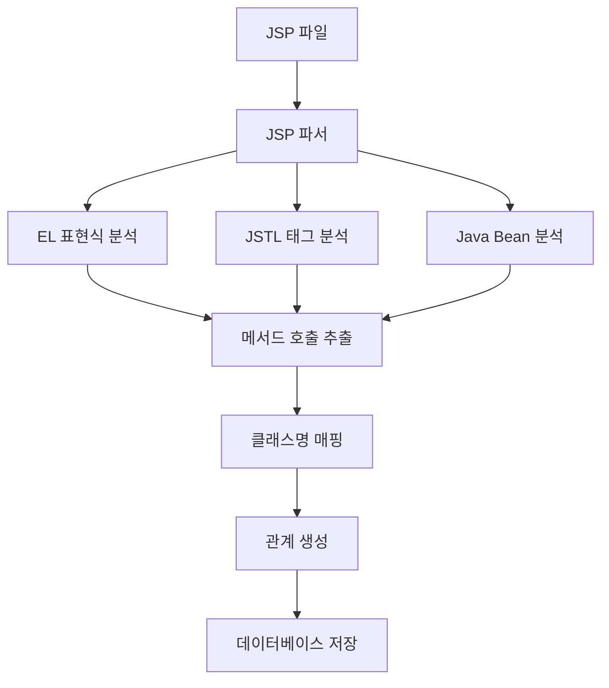

# JSP 백엔드 호출 분석 개발계획서 - Phase 1 (High Priority)

## 📋 개요

### 목적
JSP 파일에서 백엔드 Java 클래스/메서드 호출을 분석하여 **JSP → METHOD** 관계를 생성하는 기능을 개발합니다.

### 범위 (Phase 1)
- **EL 표현식 분석**: `${userService.getUserList()}` 형태의 백엔드 호출
- **JSTL 기본 태그 분석**: `<c:forEach>`, `<c:if>` 등에서의 메서드 호출
- **Java Bean 접근 패턴**: `${user.name}`, `${userController.currentUser}` 형태

### 기대 효과
- JSP에서 백엔드 호출 관계 생성
- 완전한 **JSP → Method → Class → Method → Query → Table** 연계 체인 구현
- CallChain Report의 JSP 연계 정보 제공

---

## 🏗️ 시스템 아키텍처

### 전체 구조
```
CreateMetaDb/
├── parser/
│   ├── jsp_parser.py              # JSP 파서 (확장)
│   └── manual/02_jsp/             # JSP 파싱 가이드
├── config/parser/
│   └── jsp_keyword.yaml           # JSP 키워드 설정 (확장)
├── util/
│   ├── path_utils.py              # 경로 처리 공통함수
│   ├── config_utils.py            # 설정 파일 로드 공통함수
│   └── logger.py                  # 로깅 공통함수
└── jsp_loading.py                 # JSP 로딩 엔진 (확장)
```

### 데이터 흐름


---

## 🔧 개발 상세 계획

### 1. 설정 파일 확장 (`config/parser/jsp_keyword.yaml`)

#### 1.1 EL 표현식 패턴 추가
```yaml
# EL 표현식 패턴 (Phase 1 - High Priority)
el_expression_patterns:
  - '\$\{([^}]+)\}'                    # 기본 EL 표현식
  - '\$\{(\w+)\.(\w+)\s*\([^}]*\)\}'  # 메서드 호출 EL
  - '\$\{(\w+)\.(\w+)\}'              # 프로퍼티 접근 EL
  - '\$\{(\w+)\s*\([^}]*\)\}'         # 메서드 호출 EL (객체 없음)

# JSTL 태그 패턴 (Phase 1 - High Priority)
jstl_tag_patterns:
  - '<c:forEach[^>]*items="\$\{([^}]+)\}"[^>]*>'     # forEach items
  - '<c:if[^>]*test="\$\{([^}]+)\}"[^>]*>'           # if test
  - '<c:when[^>]*test="\$\{([^}]+)\}"[^>]*>'         # when test
  - '<c:choose[^>]*test="\$\{([^}]+)\}"[^>]*>'       # choose test
  - '<c:set[^>]*value="\$\{([^}]+)\}"[^>]*>'         # set value
  - '<c:out[^>]*value="\$\{([^}]+)\}"[^>]*>'         # out value

# Java Bean 접근 패턴 (Phase 1 - High Priority)
java_bean_patterns:
  - '\$\{(\w+)\.(\w+)\}'              # user.name
  - '\$\{(\w+)\.(\w+)\.(\w+)\}'       # user.address.city
  - '\$\{(\w+)\.(\w+)\[(\d+)\]\}'     # user.phones[0]
  - '\$\{(\w+)\.(\w+)\[(\w+)\]\}'     # user.attributes[key]
```

#### 1.2 클래스명 매핑 확장
```yaml
# 클래스명 매핑 확장 (Phase 1)
class_name_mapping:
  # 기존 매핑
  userService: UserService
  userController: UserController
  orderService: OrderService
  productService: ProductService
  dataService: DataService
  service: Service
  
  # Phase 1 추가 매핑
  user: User
  order: Order
  product: Product
  category: Category
  member: Member
  customer: Customer
  admin: Admin
  manager: Manager
  
  # JSP 내장 객체 매핑
  request: HttpServletRequest
  response: HttpServletResponse
  session: HttpSession
  application: ServletContext
  pageContext: PageContext
  page: Object
  out: JspWriter
  config: ServletConfig
  exception: Throwable

# 메서드-클래스 매핑 확장 (Phase 1)
method_class_mapping:
  # 기존 매핑
  getUserList: UserService
  saveUser: UserService
  deleteUser: UserService
  getOrderList: OrderService
  saveOrder: OrderService
  getProductList: ProductService
  saveProduct: ProductService
  
  # Phase 1 추가 매핑
  getName: User
  getEmail: User
  getAddress: User
  getPhone: User
  getCreatedDate: User
  getUpdatedDate: User
  isActive: User
  isEnabled: User
  getCurrentUser: UserController
  getCurrentTime: UserController
  getMessage: UserController
  validateUser: UserController
  formatDate: DateUtils
  formatNumber: NumberUtils
  isEmpty: StringUtils
  isNotEmpty: StringUtils
```

### 2. JSP 파서 확장 (`parser/jsp_parser.py`)

#### 2.1 새로운 분석 메서드 추가
```python
def _analyze_el_expressions(self, jsp_content: str, jsp_name: str) -> List[Dict[str, Any]]:
    """
    EL 표현식 분석 (Phase 1 - High Priority)
    
    Args:
        jsp_content: JSP 파일 내용
        jsp_name: JSP 파일명
        
    Returns:
        List[Dict[str, Any]]: EL 표현식에서 추출된 메서드 호출 정보
    """
    try:
        method_calls = []
        
        # EL 표현식 패턴 로드 (USER RULES: 설정 파일에서 로드)
        el_patterns = self.config.get('el_expression_patterns', [])
        
        # 기본 패턴 (설정 파일이 없을 경우)
        if not el_patterns:
            el_patterns = [
                r'\$\{([^}]+)\}',                    # 기본 EL 표현식
                r'\$\{(\w+)\.(\w+)\s*\([^}]*\)\}',  # 메서드 호출 EL
                r'\$\{(\w+)\.(\w+)\}'               # 프로퍼티 접근 EL
            ]
        
        for pattern in el_patterns:
            matches = re.finditer(pattern, jsp_content, re.IGNORECASE | re.DOTALL)
            
            for match in matches:
                line_number = jsp_content[:match.start()].count('\n') + 1
                
                # EL 표현식 내용 추출
                el_content = match.group(1) if match.groups() else match.group(0)
                
                # EL 표현식에서 메서드 호출 추출
                calls = self._extract_method_calls_from_el(el_content, line_number, jsp_name)
                method_calls.extend(calls)
        
        return method_calls
        
    except Exception as e:
        # USER RULES: 파싱 에러는 has_error='Y' 처리하고 계속 진행
        warning(f"EL 표현식 분석 실패: {jsp_name} - {str(e)}")
        return []

def _analyze_jstl_tags(self, jsp_content: str, jsp_name: str) -> List[Dict[str, Any]]:
    """
    JSTL 태그 분석 (Phase 1 - High Priority)
    
    Args:
        jsp_content: JSP 파일 내용
        jsp_name: JSP 파일명
        
    Returns:
        List[Dict[str, Any]]: JSTL 태그에서 추출된 메서드 호출 정보
    """
    try:
        method_calls = []
        
        # JSTL 태그 패턴 로드 (USER RULES: 설정 파일에서 로드)
        jstl_patterns = self.config.get('jstl_tag_patterns', [])
        
        # 기본 패턴 (설정 파일이 없을 경우)
        if not jstl_patterns:
            jstl_patterns = [
                r'<c:forEach[^>]*items="\$\{([^}]+)\}"[^>]*>',     # forEach items
                r'<c:if[^>]*test="\$\{([^}]+)\}"[^>]*>',           # if test
                r'<c:when[^>]*test="\$\{([^}]+)\}"[^>]*>',         # when test
                r'<c:set[^>]*value="\$\{([^}]+)\}"[^>]*>',         # set value
                r'<c:out[^>]*value="\$\{([^}]+)\}"[^>]*>'          # out value
            ]
        
        for pattern in jstl_patterns:
            matches = re.finditer(pattern, jsp_content, re.IGNORECASE | re.DOTALL)
            
            for match in matches:
                line_number = jsp_content[:match.start()].count('\n') + 1
                
                # JSTL 태그 내용 추출
                jstl_content = match.group(1) if match.groups() else match.group(0)
                
                # JSTL 태그에서 메서드 호출 추출
                calls = self._extract_method_calls_from_jstl(jstl_content, line_number, jsp_name)
                method_calls.extend(calls)
        
        return method_calls
        
    except Exception as e:
        # USER RULES: 파싱 에러는 has_error='Y' 처리하고 계속 진행
        warning(f"JSTL 태그 분석 실패: {jsp_name} - {str(e)}")
        return []

def _analyze_java_beans(self, jsp_content: str, jsp_name: str) -> List[Dict[str, Any]]:
    """
    Java Bean 접근 패턴 분석 (Phase 1 - High Priority)
    
    Args:
        jsp_content: JSP 파일 내용
        jsp_name: JSP 파일명
        
    Returns:
        List[Dict[str, Any]]: Java Bean에서 추출된 메서드 호출 정보
    """
    try:
        method_calls = []
        
        # Java Bean 패턴 로드 (USER RULES: 설정 파일에서 로드)
        bean_patterns = self.config.get('java_bean_patterns', [])
        
        # 기본 패턴 (설정 파일이 없을 경우)
        if not bean_patterns:
            bean_patterns = [
                r'\$\{(\w+)\.(\w+)\}',              # user.name
                r'\$\{(\w+)\.(\w+)\.(\w+)\}',       # user.address.city
                r'\$\{(\w+)\.(\w+)\[(\d+)\]\}',     # user.phones[0]
                r'\$\{(\w+)\.(\w+)\[(\w+)\]\}'      # user.attributes[key]
            ]
        
        for pattern in bean_patterns:
            matches = re.finditer(pattern, jsp_content, re.IGNORECASE | re.DOTALL)
            
            for match in matches:
                line_number = jsp_content[:match.start()].count('\n') + 1
                
                # Java Bean 접근 패턴에서 메서드 호출 추출
                calls = self._extract_method_calls_from_bean(match, line_number, jsp_name)
                method_calls.extend(calls)
        
        return method_calls
        
    except Exception as e:
        # USER RULES: 파싱 에러는 has_error='Y' 처리하고 계속 진행
        warning(f"Java Bean 분석 실패: {jsp_name} - {str(e)}")
        return []
```

#### 2.2 메서드 호출 추출 로직
```python
def _extract_method_calls_from_el(self, el_content: str, line_number: int, jsp_name: str) -> List[Dict[str, Any]]:
    """
    EL 표현식에서 메서드 호출 추출
    
    Args:
        el_content: EL 표현식 내용
        line_number: 라인 번호
        jsp_name: JSP 파일명
        
    Returns:
        List[Dict[str, Any]]: 메서드 호출 정보
    """
    try:
        method_calls = []
        
        # EL 표현식에서 메서드 호출 패턴 찾기
        method_patterns = [
            r'(\w+)\.(\w+)\s*\(',  # object.method()
            r'(\w+)\s*\([^)]*\)'   # method()
        ]
        
        for pattern in method_patterns:
            matches = re.finditer(pattern, el_content, re.IGNORECASE)
            
            for match in matches:
                call_info = self._parse_method_call(match, line_number, jsp_name)
                if call_info:
                    method_calls.append(call_info)
        
        return method_calls
        
    except Exception as e:
        # USER RULES: 파싱 에러는 has_error='Y' 처리하고 계속 진행
        warning(f"EL 메서드 호출 추출 실패: {jsp_name} - {str(e)}")
        return []

def _extract_method_calls_from_jstl(self, jstl_content: str, line_number: int, jsp_name: str) -> List[Dict[str, Any]]:
    """
    JSTL 태그에서 메서드 호출 추출
    
    Args:
        jstl_content: JSTL 태그 내용
        line_number: 라인 번호
        jsp_name: JSP 파일명
        
    Returns:
        List[Dict[str, Any]]: 메서드 호출 정보
    """
    try:
        method_calls = []
        
        # JSTL 태그에서 메서드 호출 패턴 찾기
        method_patterns = [
            r'(\w+)\.(\w+)\s*\(',  # object.method()
            r'(\w+)\s*\([^)]*\)'   # method()
        ]
        
        for pattern in method_patterns:
            matches = re.finditer(pattern, jstl_content, re.IGNORECASE)
            
            for match in matches:
                call_info = self._parse_method_call(match, line_number, jsp_name)
                if call_info:
                    method_calls.append(call_info)
        
        return method_calls
        
    except Exception as e:
        # USER RULES: 파싱 에러는 has_error='Y' 처리하고 계속 진행
        warning(f"JSTL 메서드 호출 추출 실패: {jsp_name} - {str(e)}")
        return []

def _extract_method_calls_from_bean(self, match: re.Match, line_number: int, jsp_name: str) -> List[Dict[str, Any]]:
    """
    Java Bean 접근에서 메서드 호출 추출
    
    Args:
        match: 정규식 매치 객체
        line_number: 라인 번호
        jsp_name: JSP 파일명
        
    Returns:
        List[Dict[str, Any]]: 메서드 호출 정보
    """
    try:
        method_calls = []
        groups = match.groups()
        
        if len(groups) >= 2:
            # user.name, user.address.city 등
            object_name = groups[0]
            property_name = groups[1]
            
            # 프로퍼티 접근을 getter 메서드 호출로 변환
            getter_method = f"get{property_name.capitalize()}"
            class_name = self._extract_class_name_from_object(object_name)
            
            # Java 예약어나 기본 메서드 필터링
            if not self._is_java_reserved_word(getter_method) and not self._is_basic_method(getter_method):
                method_calls.append({
                    'jsp_name': jsp_name,
                    'class_name': class_name,
                    'method_name': getter_method,
                    'object_name': object_name,
                    'line_number': line_number,
                    'rel_type': 'CALL_METHOD'
                })
        
        return method_calls
        
    except Exception as e:
        # USER RULES: 파싱 에러는 has_error='Y' 처리하고 계속 진행
        warning(f"Java Bean 메서드 호출 추출 실패: {jsp_name} - {str(e)}")
        return []
```

#### 2.3 기존 분석 메서드 수정
```python
def _analyze_java_method_calls(self, jsp_content: str, jsp_name: str) -> List[Dict[str, Any]]:
    """
    Java 메서드 호출 분석 (Phase 1 확장)
    
    Args:
        jsp_content: JSP 파일 내용
        jsp_name: JSP 파일명
        
    Returns:
        List[Dict[str, Any]]: 모든 메서드 호출 정보
    """
    try:
        method_calls = []
        
        # Phase 1: 기존 스크립틀릿과 표현식 분석
        scriptlet_calls = self._analyze_scriptlets(jsp_content, jsp_name)
        method_calls.extend(scriptlet_calls)
        
        expression_calls = self._analyze_expressions(jsp_content, jsp_name)
        method_calls.extend(expression_calls)
        
        # Phase 1: 새로운 분석 추가
        el_calls = self._analyze_el_expressions(jsp_content, jsp_name)
        method_calls.extend(el_calls)
        
        jstl_calls = self._analyze_jstl_tags(jsp_content, jsp_name)
        method_calls.extend(jstl_calls)
        
        bean_calls = self._analyze_java_beans(jsp_content, jsp_name)
        method_calls.extend(bean_calls)
        
        # 중복 제거
        method_calls = self._remove_duplicate_method_calls(method_calls)
        
        info(f"JSP {jsp_name}에서 {len(method_calls)}개 메서드 호출 발견 (Phase 1)")
        return method_calls
        
    except Exception as e:
        # exception은 handle_error()로 exit해야 에러 인지가 가능하다
        handle_error(e, f"Java 메서드 호출 분석 실패: {jsp_name}")
```

### 3. JSP 로딩 엔진 확장 (`jsp_loading.py`)

#### 3.1 통계 정보 확장
```python
def _initialize_stats(self):
    """통계 정보 초기화 (Phase 1 확장)"""
    self.stats = {
        'jsp_files_processed': 0,
        'jsp_components_created': 0,
        'jsp_method_relationships_created': 0,
        'el_expressions_analyzed': 0,        # Phase 1 추가
        'jstl_tags_analyzed': 0,             # Phase 1 추가
        'java_beans_analyzed': 0,            # Phase 1 추가
        'errors': 0
    }
```

#### 3.2 관계 저장 로직 확장
```python
def _save_jsp_method_relationships_to_database(self, relationships: List[Dict[str, Any]]) -> bool:
    """
    JSP → METHOD 관계를 relationships 테이블에 저장 (Phase 1 확장)
    
    Args:
        relationships: JSP 메서드 관계 정보 리스트
        
    Returns:
        bool: 저장 성공 여부
    """
    try:
        if not relationships:
            return True
            
        # USER RULES: 공통함수 사용 지향
        path_utils = PathUtils()
        db_utils = DatabaseUtils()
        
        # 현재 파일 ID 가져오기
        current_file_id = self.current_file_id
        if not current_file_id:
            warning("현재 파일 ID가 없어서 관계 저장을 건너뜀")
            return False
        
        # JSP 컴포넌트 ID 찾기
        jsp_component_id = self._get_jsp_component_id(current_file_id)
        if not jsp_component_id:
            warning(f"JSP 컴포넌트 ID를 찾을 수 없음: {current_file_id}")
            return False
        
        # 관계 저장
        saved_count = 0
        for relationship in relationships:
            try:
                # METHOD 컴포넌트 찾기 또는 생성
                method_component_id = self._find_or_create_method_component(relationship)
                if not method_component_id:
                    continue
                
                # 관계 저장
                success = self._save_single_relationship(
                    jsp_component_id, 
                    method_component_id, 
                    relationship
                )
                
                if success:
                    saved_count += 1
                    
            except Exception as e:
                # USER RULES: 파싱 에러는 has_error='Y' 처리하고 계속 진행
                warning(f"관계 저장 실패: {relationship} - {str(e)}")
                continue
        
        info(f"JSP → METHOD 관계 {saved_count}개 저장 완료")
        return saved_count > 0
        
    except Exception as e:
        # exception은 handle_error()로 exit해야 에러 인지가 가능하다
        handle_error(e, "JSP 메서드 관계 저장 실패")

def _find_or_create_method_component(self, relationship: Dict[str, Any]) -> Optional[int]:
    """
    METHOD 컴포넌트 찾기 또는 생성 (Phase 1 확장)
    
    Args:
        relationship: 관계 정보
        
    Returns:
        Optional[int]: METHOD 컴포넌트 ID
    """
    try:
        class_name = relationship.get('class_name')
        method_name = relationship.get('method_name')
        
        if not class_name or not method_name:
            return None
        
        # METHOD 컴포넌트명 생성: "클래스명.메서드명"
        component_name = f"{class_name}.{method_name}"
        
        # USER RULES: 공통함수 사용 지향
        db_utils = DatabaseUtils()
        
        # 기존 METHOD 컴포넌트 찾기
        existing_id = db_utils.get_component_id_by_name_and_type(
            component_name, 
            'METHOD'
        )
        
        if existing_id:
            return existing_id
        
        # 새로운 METHOD 컴포넌트 생성
        new_id = db_utils.create_component(
            component_name=component_name,
            component_type='METHOD',
            file_id=None,  # JSP에서 호출되는 메서드는 파일 ID 없음
            parent_id=None,
            del_yn='N'
        )
        
        if new_id:
            info(f"새로운 METHOD 컴포넌트 생성: {component_name} (ID: {new_id})")
        
        return new_id
        
    except Exception as e:
        # USER RULES: 파싱 에러는 has_error='Y' 처리하고 계속 진행
        warning(f"METHOD 컴포넌트 찾기/생성 실패: {relationship} - {str(e)}")
        return None
```

---

## 📊 테스트 계획

### 1. 단위 테스트
```python
def test_el_expression_analysis():
    """EL 표현식 분석 테스트"""
    parser = JspParser()
    
    # 테스트 JSP 내용
    jsp_content = """
    <%@ page language="java" contentType="text/html; charset=UTF-8" %>
    <%@ taglib prefix="c" uri="http://java.sun.com/jsp/jstl/core" %>
    
    <h1>사용자 목록</h1>
    <c:forEach items="${userService.getUserList()}" var="user">
        <p>${user.name} - ${user.email}</p>
    </c:forEach>
    """
    
    # EL 표현식 분석
    el_calls = parser._analyze_el_expressions(jsp_content, "test.jsp")
    
    # 검증
    assert len(el_calls) >= 2  # userService.getUserList(), user.name, user.email
    assert any(call['method_name'] == 'getUserList' for call in el_calls)
    assert any(call['method_name'] == 'getName' for call in el_calls)

def test_jstl_tag_analysis():
    """JSTL 태그 분석 테스트"""
    parser = JspParser()
    
    # 테스트 JSP 내용
    jsp_content = """
    <c:if test="${user.isActive()}">
        <c:out value="${user.getName()}" />
    </c:if>
    """
    
    # JSTL 태그 분석
    jstl_calls = parser._analyze_jstl_tags(jsp_content, "test.jsp")
    
    # 검증
    assert len(jstl_calls) >= 2  # isActive(), getName()
    assert any(call['method_name'] == 'isActive' for call in jstl_calls)
    assert any(call['method_name'] == 'getName' for call in jstl_calls)

def test_java_bean_analysis():
    """Java Bean 분석 테스트"""
    parser = JspParser()
    
    # 테스트 JSP 내용
    jsp_content = """
    <p>이름: ${user.name}</p>
    <p>이메일: ${user.email}</p>
    <p>주소: ${user.address.city}</p>
    """
    
    # Java Bean 분석
    bean_calls = parser._analyze_java_beans(jsp_content, "test.jsp")
    
    # 검증
    assert len(bean_calls) >= 3  # getName(), getEmail(), getCity()
    assert any(call['method_name'] == 'getName' for call in bean_calls)
    assert any(call['method_name'] == 'getEmail' for call in bean_calls)
    assert any(call['method_name'] == 'getCity' for call in bean_calls)
```

### 2. 통합 테스트
```python
def test_jsp_backend_call_analysis():
    """JSP 백엔드 호출 분석 통합 테스트"""
    
    # 테스트 JSP 파일 생성
    test_jsp_content = """
    <%@ page language="java" contentType="text/html; charset=UTF-8" %>
    <%@ taglib prefix="c" uri="http://java.sun.com/jsp/jstl/core" %>
    
    <h1>사용자 관리</h1>
    
    <!-- EL 표현식 -->
    <p>현재 사용자: ${userService.getCurrentUser().getName()}</p>
    
    <!-- JSTL 태그 -->
    <c:forEach items="${userService.getUserList()}" var="user">
        <div>
            <p>이름: ${user.name}</p>
            <p>이메일: ${user.email}</p>
            <c:if test="${user.isActive()}">
                <p>상태: 활성</p>
            </c:if>
        </div>
    </c:forEach>
    
    <!-- 스크립틀릿 -->
    <%
        List<User> users = userService.getUserList();
        String message = userController.getMessage();
    %>
    
    <!-- 표현식 -->
    <%= userService.getUserCount() %>
    """
    
    # JSP 파일 저장
    test_jsp_path = "temp/test_backend_call.jsp"
    with open(test_jsp_path, 'w', encoding='utf-8') as f:
        f.write(test_jsp_content)
    
    # JSP 로딩 엔진 실행
    jsp_engine = JspLoadingEngine("testProject")
    result = jsp_engine.execute_jsp_loading()
    
    # 검증
    assert result == True
    
    # 데이터베이스 확인
    conn = sqlite3.connect('projects/testProject/metadata.db')
    cursor = conn.cursor()
    
    # JSP 컴포넌트 확인
    cursor.execute("SELECT COUNT(*) FROM components WHERE component_type = 'JSP'")
    jsp_count = cursor.fetchone()[0]
    assert jsp_count > 0
    
    # JSP → METHOD 관계 확인
    cursor.execute("""
        SELECT COUNT(*) FROM relationships r
        JOIN components src ON r.src_id = src.component_id
        JOIN components dst ON r.dst_id = dst.component_id
        WHERE src.component_type = 'JSP' 
        AND dst.component_type = 'METHOD'
        AND r.rel_type = 'CALL_METHOD'
    """)
    relationship_count = cursor.fetchone()[0]
    assert relationship_count > 0
    
    conn.close()
```

---

## 🚀 실행 방법

### 1. 개발 환경 설정
```bash
# 1. 설정 파일 업데이트
# config/parser/jsp_keyword.yaml에 Phase 1 패턴 추가

# 2. JSP 파서 확장
# parser/jsp_parser.py에 새로운 분석 메서드 추가

# 3. JSP 로딩 엔진 확장
# jsp_loading.py에 통계 및 관계 저장 로직 추가
```

### 2. 테스트 실행
```bash
# 단위 테스트
python -m pytest tests/test_jsp_parser_phase1.py -v

# 통합 테스트
python tests/test_jsp_backend_call_integration.py

# 실제 프로젝트 테스트
python main.py --project-name sampleSrc --phase jsp
```

### 3. 결과 확인
```bash
# JSP 백엔드 호출 관계 확인
python -c "
import sqlite3
conn = sqlite3.connect('projects/sampleSrc/metadata.db')
cursor = conn.cursor()
cursor.execute('''
    SELECT src.component_name as jsp_file, 
           dst.component_name as method_call,
           r.rel_type
    FROM relationships r
    JOIN components src ON r.src_id = src.component_id
    JOIN components dst ON r.dst_id = dst.component_id
    WHERE src.component_type = 'JSP' 
    AND dst.component_type = 'METHOD'
    AND r.rel_type = 'CALL_METHOD'
    ORDER BY src.component_name
''')
results = cursor.fetchall()
for jsp_file, method_call, rel_type in results:
    print(f'{jsp_file} -> {method_call} ({rel_type})')
conn.close()
"
```

---

## 📈 성능 최적화

### 1. 정규식 최적화
- 컴파일된 정규식 패턴 캐싱
- 복잡한 패턴을 단순한 패턴으로 분해
- 불필요한 캡처 그룹 제거

### 2. 메모리 최적화
- JSP 파일 내용을 한 번만 메모리에 로드
- 분석 완료 후 즉시 메모리에서 해제
- 대용량 JSP 파일에 대한 스트리밍 처리

### 3. 데이터베이스 최적화
- 배치 INSERT 사용
- 인덱스 최적화
- 트랜잭션 크기 조절

---

## 🔍 모니터링 및 로깅

### 1. 로깅 레벨
```python
# Phase 1 분석 결과 로깅
info(f"JSP {jsp_name} Phase 1 분석 완료:")
info(f"  - EL 표현식: {len(el_calls)}개")
info(f"  - JSTL 태그: {len(jstl_calls)}개")
info(f"  - Java Bean: {len(bean_calls)}개")
info(f"  - 총 메서드 호출: {len(total_calls)}개")
```

### 2. 성능 모니터링
```python
# 분석 시간 측정
import time
start_time = time.time()
# ... 분석 로직 ...
elapsed_time = time.time() - start_time
info(f"JSP {jsp_name} 분석 시간: {elapsed_time:.2f}초")
```

### 3. 에러 모니터링
```python
# 에러 통계
warning(f"JSP 분석 에러 발생: {jsp_name} - {error_message}")
self.stats['errors'] += 1
```

---

## 📋 체크리스트

### Phase 1 완료 기준
- [ ] EL 표현식 분석 기능 구현
- [ ] JSTL 기본 태그 분석 기능 구현
- [ ] Java Bean 접근 패턴 분석 기능 구현
- [ ] 설정 파일 확장 (jsp_keyword.yaml)
- [ ] JSP 파서 확장 (jsp_parser.py)
- [ ] JSP 로딩 엔진 확장 (jsp_loading.py)
- [ ] 단위 테스트 작성 및 통과
- [ ] 통합 테스트 작성 및 통과
- [ ] 실제 프로젝트에서 테스트
- [ ] 성능 최적화 적용
- [ ] 문서화 완료

### 품질 기준
- [ ] 모든 exception은 handle_error()로 exit()
- [ ] 파싱 에러는 has_error='Y' 처리 후 계속 진행
- [ ] 하드코딩 없이 설정 파일 사용
- [ ] 공통함수 사용 (path_utils, config_utils, logger)
- [ ] 크로스플랫폼 호환성 (Windows, RHEL)
- [ ] 메모리 효율성 (스트리밍 처리)
- [ ] 로깅 및 모니터링 완비

---

## 🎯 Phase 2 예고

Phase 1 완료 후 Phase 2에서는 다음 기능을 개발할 예정입니다:

1. **PageContext 분석**: JSP 내장 객체들의 메서드 호출
2. **커스텀 태그 라이브러리**: 프로젝트별 커스텀 태그 분석
3. **의존성 추론 엔진**: 객체 타입 추론 및 메서드 시그니처 분석
4. **고급 체이닝 분석**: `${userService.getUser().getName()}` 같은 복잡한 체이닝

Phase 1의 성공적인 완료가 Phase 2 개발의 기반이 됩니다.
