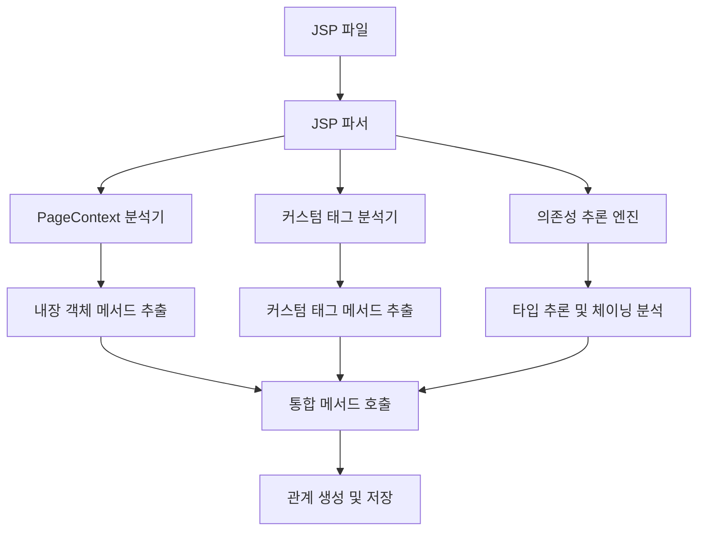

# JSP 백엔드 호출 분석 개발계획서 - Phase 2 (Medium Priority)

## 📋 개요

### 목적
Phase 1 완료 후 JSP에서 백엔드 호출 분석을 고도화하여 더 정확하고 포괄적인 관계를 생성합니다.

### 범위 (Phase 2)
- **PageContext 분석**: JSP 내장 객체들의 메서드 호출
- **커스텀 태그 라이브러리**: 프로젝트별 커스텀 태그 분석
- **의존성 추론 엔진**: 객체 타입 추론 및 메서드 시그니처 분석
- **고급 체이닝 분석**: `${userService.getUser().getName()}` 같은 복잡한 체이닝

### 기대 효과
- JSP 내장 객체 활용 분석
- 프로젝트별 커스텀 태그 지원
- 더 정확한 클래스/메서드 매핑
- 복잡한 메서드 체이닝 지원

---

## 🏗️ 시스템 아키텍처

### Phase 2 확장 구조
```
CreateMetaDb/
├── parser/
│   ├── jsp_parser.py              # JSP 파서 (Phase 2 확장)
│   ├── page_context_analyzer.py   # PageContext 분석기 (신규)
│   ├── custom_tag_analyzer.py     # 커스텀 태그 분석기 (신규)
│   └── dependency_inferencer.py   # 의존성 추론 엔진 (신규)
├── config/parser/
│   ├── jsp_keyword.yaml           # JSP 키워드 설정 (Phase 2 확장)
│   ├── page_context_mapping.yaml  # PageContext 매핑 (신규)
│   └── custom_tag_mapping.yaml    # 커스텀 태그 매핑 (신규)
└── util/
    ├── type_inference_utils.py    # 타입 추론 유틸리티 (신규)
    └── method_signature_utils.py  # 메서드 시그니처 유틸리티 (신규)
```

### 데이터 흐름


---

## 🔧 개발 상세 계획

### 1. PageContext 분석기 (`parser/page_context_analyzer.py`)

#### 1.1 JSP 내장 객체 분석
```python
class PageContextAnalyzer:
    """JSP PageContext 분석기 - Phase 2"""
    
    def __init__(self, config: Dict[str, Any]):
        self.config = config
        self.page_context_mapping = config.get('page_context_mapping', {})
    
    def analyze_page_context_calls(self, jsp_content: str, jsp_name: str) -> List[Dict[str, Any]]:
        """
        PageContext 내장 객체 메서드 호출 분석
        
        Args:
            jsp_content: JSP 파일 내용
            jsp_name: JSP 파일명
            
        Returns:
            List[Dict[str, Any]]: PageContext 메서드 호출 정보
        """
        try:
            method_calls = []
            
            # JSP 내장 객체 패턴 분석
            page_context_patterns = [
                r'request\.(\w+)\s*\(',           # request.method()
                r'response\.(\w+)\s*\(',          # response.method()
                r'session\.(\w+)\s*\(',           # session.method()
                r'application\.(\w+)\s*\(',       # application.method()
                r'pageContext\.(\w+)\s*\(',       # pageContext.method()
                r'out\.(\w+)\s*\(',               # out.method()
                r'config\.(\w+)\s*\(',            # config.method()
                r'exception\.(\w+)\s*\(',         # exception.method()
            ]
            
            for pattern in page_context_patterns:
                matches = re.finditer(pattern, jsp_content, re.IGNORECASE)
                
                for match in matches:
                    call_info = self._parse_page_context_call(match, jsp_name)
                    if call_info:
                        method_calls.append(call_info)
            
            return method_calls
            
        except Exception as e:
            warning(f"PageContext 분석 실패: {jsp_name} - {str(e)}")
            return []
    
    def _parse_page_context_call(self, match: re.Match, jsp_name: str) -> Optional[Dict[str, Any]]:
        """PageContext 메서드 호출 파싱"""
        try:
            object_name = match.group(0).split('.')[0]
            method_name = match.groups()[0]
            
            # PageContext 매핑에서 클래스명 찾기
            class_name = self.page_context_mapping.get(object_name, object_name)
            
            return {
                'jsp_name': jsp_name,
                'class_name': class_name,
                'method_name': method_name,
                'object_name': object_name,
                'line_number': 0,  # 라인 번호는 별도 계산
                'rel_type': 'CALL_METHOD'
            }
            
        except Exception as e:
            warning(f"PageContext 메서드 호출 파싱 실패: {str(e)}")
            return None
```

#### 1.2 PageContext 매핑 설정 (`config/parser/page_context_mapping.yaml`)
```yaml
# JSP 내장 객체 매핑
page_context_mapping:
  request: HttpServletRequest
  response: HttpServletResponse
  session: HttpSession
  application: ServletContext
  pageContext: PageContext
  page: Object
  out: JspWriter
  config: ServletConfig
  exception: Throwable

# HttpServletRequest 메서드 매핑
request_methods:
  getParameter: String
  getParameterValues: String[]
  getAttribute: Object
  setAttribute: void
  getRequestURI: String
  getMethod: String
  getHeader: String
  getCookies: Cookie[]

# HttpServletResponse 메서드 매핑
response_methods:
  setContentType: void
  setCharacterEncoding: void
  addCookie: void
  sendRedirect: void
  setHeader: void
  addHeader: void
  getWriter: PrintWriter
  getOutputStream: ServletOutputStream

# HttpSession 메서드 매핑
session_methods:
  getAttribute: Object
  setAttribute: void
  removeAttribute: void
  invalidate: void
  getId: String
  getCreationTime: long
  getLastAccessedTime: long
  isNew: boolean

# ServletContext 메서드 매핑
application_methods:
  getAttribute: Object
  setAttribute: void
  removeAttribute: void
  getInitParameter: String
  getRealPath: String
  getResourceAsStream: InputStream
  getResource: URL
  getRequestDispatcher: RequestDispatcher
```

### 2. 커스텀 태그 분석기 (`parser/custom_tag_analyzer.py`)

#### 2.1 커스텀 태그 분석
```python
class CustomTagAnalyzer:
    """커스텀 태그 분석기 - Phase 2"""
    
    def __init__(self, config: Dict[str, Any]):
        self.config = config
        self.custom_tag_mapping = config.get('custom_tag_mapping', {})
    
    def analyze_custom_tags(self, jsp_content: str, jsp_name: str) -> List[Dict[str, Any]]:
        """
        커스텀 태그 분석
        
        Args:
            jsp_content: JSP 파일 내용
            jsp_name: JSP 파일명
            
        Returns:
            List[Dict[str, Any]]: 커스텀 태그 메서드 호출 정보
        """
        try:
            method_calls = []
            
            # 커스텀 태그 패턴 분석
            custom_tag_patterns = [
                r'<(\w+):(\w+)[^>]*>',                    # <prefix:tag>
                r'<(\w+):(\w+)[^>]*/>',                   # <prefix:tag/>
                r'<(\w+):(\w+)[^>]*>.*?</\1:\2>',         # <prefix:tag>content</prefix:tag>
            ]
            
            for pattern in custom_tag_patterns:
                matches = re.finditer(pattern, jsp_content, re.IGNORECASE | re.DOTALL)
                
                for match in matches:
                    call_info = self._parse_custom_tag(match, jsp_name)
                    if call_info:
                        method_calls.append(call_info)
            
            return method_calls
            
        except Exception as e:
            warning(f"커스텀 태그 분석 실패: {jsp_name} - {str(e)}")
            return []
    
    def _parse_custom_tag(self, match: re.Match, jsp_name: str) -> Optional[Dict[str, Any]]:
        """커스텀 태그 파싱"""
        try:
            prefix = match.groups()[0]
            tag_name = match.groups()[1]
            
            # 커스텀 태그 매핑에서 클래스명 찾기
            tag_key = f"{prefix}:{tag_name}"
            class_name = self.custom_tag_mapping.get(tag_key, f"{prefix.capitalize()}{tag_name.capitalize()}Tag")
            
            return {
                'jsp_name': jsp_name,
                'class_name': class_name,
                'method_name': 'doTag',  # 커스텀 태그의 기본 메서드
                'object_name': tag_key,
                'line_number': 0,
                'rel_type': 'CALL_METHOD'
            }
            
        except Exception as e:
            warning(f"커스텀 태그 파싱 실패: {str(e)}")
            return None
```

#### 2.2 커스텀 태그 매핑 설정 (`config/parser/custom_tag_mapping.yaml`)
```yaml
# 커스텀 태그 매핑
custom_tag_mapping:
  # 프로젝트별 커스텀 태그
  "app:user": AppUserTag
  "app:order": AppOrderTag
  "app:product": AppProductTag
  "app:category": AppCategoryTag
  
  # 공통 커스텀 태그
  "ui:button": UiButtonTag
  "ui:form": UiFormTag
  "ui:table": UiTableTag
  "ui:grid": UiGridTag
  
  # 데이터 바인딩 태그
  "data:bind": DataBindTag
  "data:list": DataListTag
  "data:item": DataItemTag
  
  # 유틸리티 태그
  "util:date": UtilDateTag
  "util:number": UtilNumberTag
  "util:string": UtilStringTag
  "util:format": UtilFormatTag

# 커스텀 태그 속성 분석
custom_tag_attributes:
  "app:user":
    - name: userId
    - name: userName
    - name: userEmail
  "app:order":
    - name: orderId
    - name: orderDate
    - name: orderStatus
  "ui:button":
    - name: text
    - name: onclick
    - name: style
    - name: class
```

### 3. 의존성 추론 엔진 (`parser/dependency_inferencer.py`)

#### 3.1 타입 추론 및 체이닝 분석
```python
class DependencyInferencer:
    """의존성 추론 엔진 - Phase 2"""
    
    def __init__(self, config: Dict[str, Any]):
        self.config = config
        self.type_inference_rules = config.get('type_inference_rules', {})
    
    def analyze_method_chaining(self, jsp_content: str, jsp_name: str) -> List[Dict[str, Any]]:
        """
        메서드 체이닝 분석
        
        Args:
            jsp_content: JSP 파일 내용
            jsp_name: JSP 파일명
            
        Returns:
            List[Dict[str, Any]]: 메서드 체이닝 정보
        """
        try:
            method_calls = []
            
            # 메서드 체이닝 패턴 분석
            chaining_patterns = [
                r'(\w+)\.(\w+)\s*\([^)]*\)\.(\w+)\s*\(',                    # obj.method1().method2()
                r'(\w+)\.(\w+)\s*\([^)]*\)\.(\w+)\s*\([^)]*\)\.(\w+)\s*\(', # obj.method1().method2().method3()
                r'\$\{(\w+)\.(\w+)\s*\([^}]*\)\.(\w+)\}',                   # ${obj.method1().method2}
                r'\$\{(\w+)\.(\w+)\s*\([^}]*\)\.(\w+)\s*\([^}]*\)\.(\w+)\}', # ${obj.method1().method2().method3}
            ]
            
            for pattern in chaining_patterns:
                matches = re.finditer(pattern, jsp_content, re.IGNORECASE | re.DOTALL)
                
                for match in matches:
                    call_info = self._parse_method_chaining(match, jsp_name)
                    if call_info:
                        method_calls.extend(call_info)
            
            return method_calls
            
        except Exception as e:
            warning(f"메서드 체이닝 분석 실패: {jsp_name} - {str(e)}")
            return []
    
    def _parse_method_chaining(self, match: re.Match, jsp_name: str) -> List[Dict[str, Any]]:
        """메서드 체이닝 파싱"""
        try:
            method_calls = []
            groups = match.groups()
            
            if len(groups) >= 3:
                # 첫 번째 메서드 호출
                object_name = groups[0]
                first_method = groups[1]
                
                # 두 번째 메서드 호출
                second_method = groups[2]
                
                # 첫 번째 메서드 호출 정보
                first_call = {
                    'jsp_name': jsp_name,
                    'class_name': self._infer_class_name(object_name),
                    'method_name': first_method,
                    'object_name': object_name,
                    'line_number': 0,
                    'rel_type': 'CALL_METHOD'
                }
                method_calls.append(first_call)
                
                # 두 번째 메서드 호출 정보 (첫 번째 메서드의 반환 타입 추론)
                second_call = {
                    'jsp_name': jsp_name,
                    'class_name': self._infer_return_type(first_method),
                    'method_name': second_method,
                    'object_name': f"{object_name}.{first_method}()",
                    'line_number': 0,
                    'rel_type': 'CALL_METHOD'
                }
                method_calls.append(second_call)
                
                # 세 번째 메서드 호출이 있는 경우
                if len(groups) >= 4:
                    third_method = groups[3]
                    third_call = {
                        'jsp_name': jsp_name,
                        'class_name': self._infer_return_type(second_method),
                        'method_name': third_method,
                        'object_name': f"{object_name}.{first_method}().{second_method}()",
                        'line_number': 0,
                        'rel_type': 'CALL_METHOD'
                    }
                    method_calls.append(third_call)
            
            return method_calls
            
        except Exception as e:
            warning(f"메서드 체이닝 파싱 실패: {str(e)}")
            return []
    
    def _infer_class_name(self, object_name: str) -> str:
        """객체명에서 클래스명 추론"""
        # 기존 매핑에서 찾기
        class_mapping = self.config.get('class_name_mapping', {})
        if object_name in class_mapping:
            return class_mapping[object_name]
        
        # 기본 규칙 적용
        if object_name.endswith('Service'):
            return object_name
        elif object_name.endswith('Controller'):
            return object_name
        elif object_name.endswith('Dao'):
            return object_name
        else:
            return f"{object_name.capitalize()}Service"
    
    def _infer_return_type(self, method_name: str) -> str:
        """메서드명에서 반환 타입 추론"""
        # 반환 타입 추론 규칙
        if method_name.startswith('get') and method_name != 'getClass':
            # getter 메서드의 경우
            property_name = method_name[3:]  # get 제거
            if property_name.endswith('List'):
                return 'List'
            elif property_name.endswith('Map'):
                return 'Map'
            elif property_name.endswith('Set'):
                return 'Set'
            else:
                return property_name
        elif method_name.startswith('is'):
            # boolean getter 메서드
            return 'Boolean'
        elif method_name.startswith('has'):
            # boolean has 메서드
            return 'Boolean'
        else:
            # 기본 반환 타입
            return 'Object'
```

### 4. JSP 파서 통합 (`parser/jsp_parser.py`)

#### 4.1 Phase 2 분석 통합
```python
def _analyze_java_method_calls(self, jsp_content: str, jsp_name: str) -> List[Dict[str, Any]]:
    """
    Java 메서드 호출 분석 (Phase 2 통합)
    
    Args:
        jsp_content: JSP 파일 내용
        jsp_name: JSP 파일명
        
    Returns:
        List[Dict[str, Any]]: 모든 메서드 호출 정보
    """
    try:
        method_calls = []
        
        # Phase 1: 기존 분석
        scriptlet_calls = self._analyze_scriptlets(jsp_content, jsp_name)
        method_calls.extend(scriptlet_calls)
        
        expression_calls = self._analyze_expressions(jsp_content, jsp_name)
        method_calls.extend(expression_calls)
        
        el_calls = self._analyze_el_expressions(jsp_content, jsp_name)
        method_calls.extend(el_calls)
        
        jstl_calls = self._analyze_jstl_tags(jsp_content, jsp_name)
        method_calls.extend(jstl_calls)
        
        bean_calls = self._analyze_java_beans(jsp_content, jsp_name)
        method_calls.extend(bean_calls)
        
        # Phase 2: 새로운 분석
        page_context_analyzer = PageContextAnalyzer(self.config)
        page_context_calls = page_context_analyzer.analyze_page_context_calls(jsp_content, jsp_name)
        method_calls.extend(page_context_calls)
        
        custom_tag_analyzer = CustomTagAnalyzer(self.config)
        custom_tag_calls = custom_tag_analyzer.analyze_custom_tags(jsp_content, jsp_name)
        method_calls.extend(custom_tag_calls)
        
        dependency_inferencer = DependencyInferencer(self.config)
        chaining_calls = dependency_inferencer.analyze_method_chaining(jsp_content, jsp_name)
        method_calls.extend(chaining_calls)
        
        # 중복 제거
        method_calls = self._remove_duplicate_method_calls(method_calls)
        
        info(f"JSP {jsp_name}에서 {len(method_calls)}개 메서드 호출 발견 (Phase 2)")
        return method_calls
        
    except Exception as e:
        handle_error(e, f"Java 메서드 호출 분석 실패: {jsp_name}")
```

---

## 📊 테스트 계획

### 1. PageContext 분석 테스트
```python
def test_page_context_analysis():
    """PageContext 분석 테스트"""
    analyzer = PageContextAnalyzer(config)
    
    jsp_content = """
    <%
        String param = request.getParameter("id");
        session.setAttribute("user", user);
        response.setContentType("text/html");
    %>
    """
    
    calls = analyzer.analyze_page_context_calls(jsp_content, "test.jsp")
    
    assert len(calls) >= 3
    assert any(call['method_name'] == 'getParameter' for call in calls)
    assert any(call['method_name'] == 'setAttribute' for call in calls)
    assert any(call['method_name'] == 'setContentType' for call in calls)
```

### 2. 커스텀 태그 분석 테스트
```python
def test_custom_tag_analysis():
    """커스텀 태그 분석 테스트"""
    analyzer = CustomTagAnalyzer(config)
    
    jsp_content = """
    <app:user userId="123" userName="홍길동" />
    <ui:button text="저장" onclick="save()" />
    <data:list items="${userList}" />
    """
    
    calls = analyzer.analyze_custom_tags(jsp_content, "test.jsp")
    
    assert len(calls) >= 3
    assert any(call['class_name'] == 'AppUserTag' for call in calls)
    assert any(call['class_name'] == 'UiButtonTag' for call in calls)
    assert any(call['class_name'] == 'DataListTag' for call in calls)
```

### 3. 메서드 체이닝 분석 테스트
```python
def test_method_chaining_analysis():
    """메서드 체이닝 분석 테스트"""
    inferencer = DependencyInferencer(config)
    
    jsp_content = """
    <p>${userService.getUser().getName()}</p>
    <p>${orderService.getOrder().getItems().size()}</p>
    """
    
    calls = inferencer.analyze_method_chaining(jsp_content, "test.jsp")
    
    assert len(calls) >= 4  # getUser, getName, getOrder, getItems, size
    assert any(call['method_name'] == 'getUser' for call in calls)
    assert any(call['method_name'] == 'getName' for call in calls)
    assert any(call['method_name'] == 'getOrder' for call in calls)
    assert any(call['method_name'] == 'getItems' for call in calls)
```

---

## 🚀 실행 방법

### 1. Phase 2 개발 환경 설정
```bash
# 1. 새로운 분석기 모듈 생성
# parser/page_context_analyzer.py
# parser/custom_tag_analyzer.py
# parser/dependency_inferencer.py

# 2. 설정 파일 생성
# config/parser/page_context_mapping.yaml
# config/parser/custom_tag_mapping.yaml

# 3. JSP 파서 통합
# parser/jsp_parser.py에 Phase 2 분석 통합
```

### 2. 테스트 실행
```bash
# Phase 2 단위 테스트
python -m pytest tests/test_jsp_parser_phase2.py -v

# Phase 2 통합 테스트
python tests/test_jsp_phase2_integration.py

# 실제 프로젝트 테스트
python main.py --project-name sampleSrc --phase jsp --phase2
```

---

## 📋 체크리스트

### Phase 2 완료 기준
- [ ] PageContext 분석기 구현
- [ ] 커스텀 태그 분석기 구현
- [ ] 의존성 추론 엔진 구현
- [ ] 설정 파일 생성 (page_context_mapping.yaml, custom_tag_mapping.yaml)
- [ ] JSP 파서 Phase 2 통합
- [ ] 단위 테스트 작성 및 통과
- [ ] 통합 테스트 작성 및 통과
- [ ] 실제 프로젝트에서 테스트
- [ ] 성능 최적화 적용
- [ ] 문서화 완료

### 품질 기준
- [ ] 모든 exception은 handle_error()로 exit()
- [ ] 파싱 에러는 has_error='Y' 처리 후 계속 진행
- [ ] 하드코딩 없이 설정 파일 사용
- [ ] 공통함수 사용 (path_utils, config_utils, logger)
- [ ] 크로스플랫폼 호환성 (Windows, RHEL)
- [ ] 메모리 효율성 (스트리밍 처리)
- [ ] 로깅 및 모니터링 완비

---

## 🎯 Phase 3 예고

Phase 2 완료 후 Phase 3에서는 다음 기능을 개발할 예정입니다:

1. **고급 체이닝 분석**: 더 복잡한 메서드 체이닝 지원
2. **런타임 의존성 분석**: 실제 실행 시점의 의존성 분석
3. **성능 최적화**: 대용량 JSP 파일 처리 최적화
4. **정적 분석 고도화**: 코드 품질 및 보안 취약점 분석

Phase 2의 성공적인 완료가 Phase 3 개발의 기반이 됩니다.
