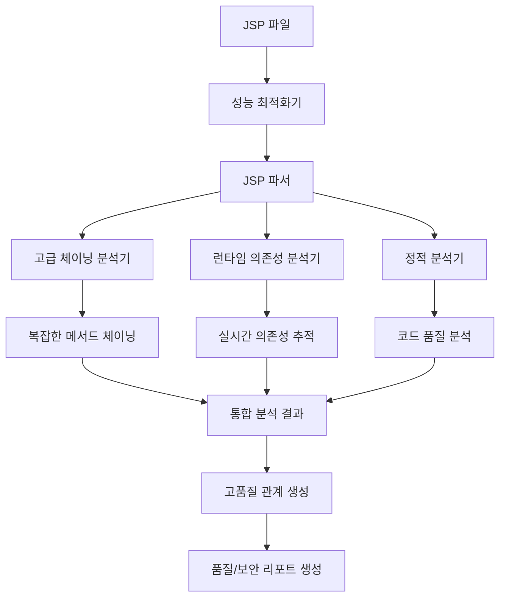

# JSP 백엔드 호출 분석 개발계획서 - Phase 3 (Low Priority)

## 📋 개요

### 목적
Phase 1, 2 완료 후 JSP 백엔드 호출 분석을 최종 고도화하여 완전한 분석 시스템을 구축합니다.

### 범위 (Phase 3)
- **고급 체이닝 분석**: 더 복잡한 메서드 체이닝 지원
- **런타임 의존성 분석**: 실제 실행 시점의 의존성 분석
- **성능 최적화**: 대용량 JSP 파일 처리 최적화
- **정적 분석 고도화**: 코드 품질 및 보안 취약점 분석

### 기대 효과
- 완전한 JSP 백엔드 호출 분석 시스템
- 고성능 대용량 파일 처리
- 코드 품질 및 보안 분석
- 실시간 의존성 추적

---

## 🏗️ 시스템 아키텍처

### Phase 3 최종 구조
```
CreateMetaDb/
├── parser/
│   ├── jsp_parser.py              # JSP 파서 (Phase 3 최종)
│   ├── advanced_chaining_analyzer.py  # 고급 체이닝 분석기 (신규)
│   ├── runtime_dependency_analyzer.py # 런타임 의존성 분석기 (신규)
│   ├── performance_optimizer.py   # 성능 최적화기 (신규)
│   └── static_analyzer.py         # 정적 분석기 (신규)
├── config/parser/
│   ├── advanced_chaining_rules.yaml    # 고급 체이닝 규칙 (신규)
│   ├── runtime_dependency_rules.yaml   # 런타임 의존성 규칙 (신규)
│   └── performance_config.yaml         # 성능 설정 (신규)
├── util/
│   ├── advanced_type_inference.py # 고급 타입 추론 (신규)
│   ├── performance_monitor.py     # 성능 모니터링 (신규)
│   └── security_analyzer.py       # 보안 분석 (신규)
└── reports/
    ├── jsp_quality_report.py      # JSP 품질 리포트 (신규)
    └── jsp_security_report.py     # JSP 보안 리포트 (신규)
```

### 최종 데이터 흐름


---

## 🔧 개발 상세 계획

### 1. 고급 체이닝 분석기 (`parser/advanced_chaining_analyzer.py`)

#### 1.1 복잡한 메서드 체이닝 분석
```python
class AdvancedChainingAnalyzer:
    """고급 체이닝 분석기 - Phase 3"""
    
    def __init__(self, config: Dict[str, Any]):
        self.config = config
        self.chaining_rules = config.get('advanced_chaining_rules', {})
    
    def analyze_complex_chaining(self, jsp_content: str, jsp_name: str) -> List[Dict[str, Any]]:
        """
        복잡한 메서드 체이닝 분석
        
        Args:
            jsp_content: JSP 파일 내용
            jsp_name: JSP 파일명
            
        Returns:
            List[Dict[str, Any]]: 복잡한 체이닝 정보
        """
        try:
            method_calls = []
            
            # 복잡한 체이닝 패턴 분석
            complex_chaining_patterns = [
                # 4단계 이상 체이닝
                r'(\w+)\.(\w+)\s*\([^)]*\)\.(\w+)\s*\([^)]*\)\.(\w+)\s*\([^)]*\)\.(\w+)\s*\(',
                # 조건부 체이닝
                r'(\w+)\s*\?\s*(\w+)\.(\w+)\s*\([^)]*\)\.(\w+)\s*\([^)]*\)\s*:\s*(\w+)\.(\w+)\s*\(',
                # 배열/리스트 체이닝
                r'(\w+)\.(\w+)\s*\([^)]*\)\[(\d+)\]\.(\w+)\s*\([^)]*\)\.(\w+)\s*\(',
                # 중첩된 EL 표현식
                r'\$\{(\w+)\.(\w+)\s*\([^}]*\)\.(\w+)\s*\([^}]*\)\.(\w+)\s*\([^}]*\)\.(\w+)\}',
            ]
            
            for pattern in complex_chaining_patterns:
                matches = re.finditer(pattern, jsp_content, re.IGNORECASE | re.DOTALL)
                
                for match in matches:
                    call_info = self._parse_complex_chaining(match, jsp_name)
                    if call_info:
                        method_calls.extend(call_info)
            
            return method_calls
            
        except Exception as e:
            warning(f"복잡한 체이닝 분석 실패: {jsp_name} - {str(e)}")
            return []
    
    def _parse_complex_chaining(self, match: re.Match, jsp_name: str) -> List[Dict[str, Any]]:
        """복잡한 체이닝 파싱"""
        try:
            method_calls = []
            groups = match.groups()
            
            # 체이닝 단계별 분석
            for i in range(0, len(groups), 2):
                if i + 1 < len(groups):
                    object_name = groups[i]
                    method_name = groups[i + 1]
                    
                    # 타입 추론 및 클래스명 결정
                    class_name = self._infer_advanced_class_name(object_name, i)
                    
                    call_info = {
                        'jsp_name': jsp_name,
                        'class_name': class_name,
                        'method_name': method_name,
                        'object_name': object_name,
                        'line_number': 0,
                        'rel_type': 'CALL_METHOD',
                        'chaining_level': i // 2 + 1,
                        'complexity': 'HIGH'
                    }
                    method_calls.append(call_info)
            
            return method_calls
            
        except Exception as e:
            warning(f"복잡한 체이닝 파싱 실패: {str(e)}")
            return []
    
    def _infer_advanced_class_name(self, object_name: str, level: int) -> str:
        """고급 클래스명 추론"""
        # 체이닝 레벨에 따른 타입 추론
        if level == 0:
            return self._infer_root_class_name(object_name)
        else:
            return self._infer_chained_class_name(object_name, level)
    
    def _infer_root_class_name(self, object_name: str) -> str:
        """루트 클래스명 추론"""
        class_mapping = self.config.get('class_name_mapping', {})
        if object_name in class_mapping:
            return class_mapping[object_name]
        
        # 고급 추론 규칙
        if object_name.endswith('Service'):
            return object_name
        elif object_name.endswith('Controller'):
            return object_name
        elif object_name.endswith('Repository'):
            return object_name
        elif object_name.endswith('Manager'):
            return object_name
        else:
            return f"{object_name.capitalize()}Service"
    
    def _infer_chained_class_name(self, object_name: str, level: int) -> str:
        """체이닝된 클래스명 추론"""
        # 체이닝 레벨에 따른 타입 추론
        if level == 1:
            return self._infer_first_level_type(object_name)
        elif level == 2:
            return self._infer_second_level_type(object_name)
        else:
            return self._infer_deep_level_type(object_name, level)
```

#### 1.2 고급 체이닝 규칙 설정 (`config/parser/advanced_chaining_rules.yaml`)
```yaml
# 고급 체이닝 분석 규칙
advanced_chaining_rules:
  # 4단계 이상 체이닝 패턴
  deep_chaining_patterns:
    - "(\w+)\.(\w+)\s*\([^)]*\)\.(\w+)\s*\([^)]*\)\.(\w+)\s*\([^)]*\)\.(\w+)\s*\("
    - "(\w+)\.(\w+)\s*\([^)]*\)\.(\w+)\s*\([^)]*\)\.(\w+)\s*\([^)]*\)\.(\w+)\s*\([^)]*\)\.(\w+)\s*\("
  
  # 조건부 체이닝 패턴
  conditional_chaining_patterns:
    - "(\w+)\s*\?\s*(\w+)\.(\w+)\s*\([^)]*\)\.(\w+)\s*\([^)]*\)\s*:\s*(\w+)\.(\w+)\s*\("
    - "(\w+)\s*\?\s*(\w+)\.(\w+)\s*\([^)]*\)\.(\w+)\s*\([^)]*\)\.(\w+)\s*\([^)]*\)\s*:\s*(\w+)\.(\w+)\s*\("
  
  # 배열/리스트 체이닝 패턴
  array_chaining_patterns:
    - "(\w+)\.(\w+)\s*\([^)]*\)\[(\d+)\]\.(\w+)\s*\([^)]*\)\.(\w+)\s*\("
    - "(\w+)\.(\w+)\s*\([^)]*\)\[(\w+)\]\.(\w+)\s*\([^)]*\)\.(\w+)\s*\("
  
  # 중첩된 EL 표현식 패턴
  nested_el_patterns:
    - "\$\{(\w+)\.(\w+)\s*\([^}]*\)\.(\w+)\s*\([^}]*\)\.(\w+)\s*\([^}]*\)\.(\w+)\}"
    - "\$\{(\w+)\.(\w+)\s*\([^}]*\)\.(\w+)\s*\([^}]*\)\.(\w+)\s*\([^}]*\)\.(\w+)\s*\([^}]*\)\.(\w+)\}"

# 체이닝 레벨별 타입 추론 규칙
chaining_level_types:
  level_1:
    - "getUser": "User"
    - "getOrder": "Order"
    - "getProduct": "Product"
    - "getList": "List"
    - "getMap": "Map"
    - "getSet": "Set"
  
  level_2:
    - "getName": "String"
    - "getEmail": "String"
    - "getAddress": "Address"
    - "getItems": "List"
    - "getProperties": "Map"
    - "getAttributes": "Map"
  
  level_3:
    - "getCity": "String"
    - "getCountry": "String"
    - "getSize": "Integer"
    - "getLength": "Integer"
    - "getCount": "Integer"
    - "getValue": "Object"

# 복잡도 분류 규칙
complexity_classification:
  LOW: 1
  MEDIUM: 2
  HIGH: 3
  VERY_HIGH: 4
```

### 2. 런타임 의존성 분석기 (`parser/runtime_dependency_analyzer.py`)

#### 2.1 실시간 의존성 추적
```python
class RuntimeDependencyAnalyzer:
    """런타임 의존성 분석기 - Phase 3"""
    
    def __init__(self, config: Dict[str, Any]):
        self.config = config
        self.runtime_rules = config.get('runtime_dependency_rules', {})
        self.dependency_cache = {}
    
    def analyze_runtime_dependencies(self, jsp_content: str, jsp_name: str) -> Dict[str, Any]:
        """
        런타임 의존성 분석
        
        Args:
            jsp_content: JSP 파일 내용
            jsp_name: JSP 파일명
            
        Returns:
            Dict[str, Any]: 런타임 의존성 정보
        """
        try:
            dependencies = {
                'jsp_name': jsp_name,
                'runtime_dependencies': [],
                'circular_dependencies': [],
                'unresolved_dependencies': [],
                'performance_impact': 'UNKNOWN'
            }
            
            # 런타임 의존성 패턴 분석
            runtime_patterns = [
                # 동적 메서드 호출
                r'(\w+)\.(\w+)\s*\([^)]*\)\.(\w+)\s*\([^)]*\)\.(\w+)\s*\([^)]*\)',
                # 조건부 의존성
                r'(\w+)\s*\?\s*(\w+)\.(\w+)\s*\([^)]*\)\s*:\s*(\w+)\.(\w+)\s*\(',
                # 반복문 내 의존성
                r'<c:forEach[^>]*>.*?(\w+)\.(\w+)\s*\([^)]*\)\.(\w+)\s*\([^)]*\)',
                # 중첩된 의존성
                r'\$\{(\w+)\.(\w+)\s*\([^}]*\)\.(\w+)\s*\([^}]*\)\.(\w+)\s*\([^}]*\)\}',
            ]
            
            for pattern in runtime_patterns:
                matches = re.finditer(pattern, jsp_content, re.IGNORECASE | re.DOTALL)
                
                for match in matches:
                    dependency_info = self._parse_runtime_dependency(match, jsp_name)
                    if dependency_info:
                        dependencies['runtime_dependencies'].append(dependency_info)
            
            # 순환 의존성 검사
            dependencies['circular_dependencies'] = self._detect_circular_dependencies(dependencies['runtime_dependencies'])
            
            # 해결되지 않은 의존성 검사
            dependencies['unresolved_dependencies'] = self._detect_unresolved_dependencies(dependencies['runtime_dependencies'])
            
            # 성능 영향 분석
            dependencies['performance_impact'] = self._analyze_performance_impact(dependencies['runtime_dependencies'])
            
            return dependencies
            
        except Exception as e:
            warning(f"런타임 의존성 분석 실패: {jsp_name} - {str(e)}")
            return {'jsp_name': jsp_name, 'error': str(e)}
    
    def _parse_runtime_dependency(self, match: re.Match, jsp_name: str) -> Optional[Dict[str, Any]]:
        """런타임 의존성 파싱"""
        try:
            groups = match.groups()
            
            dependency_info = {
                'jsp_name': jsp_name,
                'dependency_chain': [],
                'complexity': 'UNKNOWN',
                'performance_impact': 'UNKNOWN',
                'line_number': 0
            }
            
            # 의존성 체인 구성
            for i in range(0, len(groups), 2):
                if i + 1 < len(groups):
                    object_name = groups[i]
                    method_name = groups[i + 1]
                    
                    dependency_info['dependency_chain'].append({
                        'object': object_name,
                        'method': method_name,
                        'level': i // 2 + 1
                    })
            
            # 복잡도 계산
            dependency_info['complexity'] = self._calculate_complexity(dependency_info['dependency_chain'])
            
            # 성능 영향 분석
            dependency_info['performance_impact'] = self._calculate_performance_impact(dependency_info['dependency_chain'])
            
            return dependency_info
            
        except Exception as e:
            warning(f"런타임 의존성 파싱 실패: {str(e)}")
            return None
    
    def _detect_circular_dependencies(self, dependencies: List[Dict[str, Any]]) -> List[Dict[str, Any]]:
        """순환 의존성 검사"""
        try:
            circular_dependencies = []
            
            for dep in dependencies:
                # 간단한 순환 의존성 검사 (실제로는 더 복잡한 알고리즘 필요)
                if self._has_circular_reference(dep['dependency_chain']):
                    circular_dependencies.append(dep)
            
            return circular_dependencies
            
        except Exception as e:
            warning(f"순환 의존성 검사 실패: {str(e)}")
            return []
    
    def _detect_unresolved_dependencies(self, dependencies: List[Dict[str, Any]]) -> List[Dict[str, Any]]:
        """해결되지 않은 의존성 검사"""
        try:
            unresolved_dependencies = []
            
            for dep in dependencies:
                # 의존성 해결 여부 검사
                if not self._is_dependency_resolved(dep['dependency_chain']):
                    unresolved_dependencies.append(dep)
            
            return unresolved_dependencies
            
        except Exception as e:
            warning(f"해결되지 않은 의존성 검사 실패: {str(e)}")
            return []
    
    def _analyze_performance_impact(self, dependencies: List[Dict[str, Any]]) -> str:
        """성능 영향 분석"""
        try:
            total_complexity = sum(self._calculate_complexity(dep['dependency_chain']) for dep in dependencies)
            
            if total_complexity < 5:
                return 'LOW'
            elif total_complexity < 15:
                return 'MEDIUM'
            elif total_complexity < 30:
                return 'HIGH'
            else:
                return 'VERY_HIGH'
                
        except Exception as e:
            warning(f"성능 영향 분석 실패: {str(e)}")
            return 'UNKNOWN'
```

### 3. 성능 최적화기 (`parser/performance_optimizer.py`)

#### 3.1 대용량 JSP 파일 처리 최적화
```python
class PerformanceOptimizer:
    """성능 최적화기 - Phase 3"""
    
    def __init__(self, config: Dict[str, Any]):
        self.config = config
        self.performance_config = config.get('performance_config', {})
        self.cache = {}
    
    def optimize_jsp_processing(self, jsp_file_path: str) -> Dict[str, Any]:
        """
        JSP 파일 처리 최적화
        
        Args:
            jsp_file_path: JSP 파일 경로
            
        Returns:
            Dict[str, Any]: 최적화 결과
        """
        try:
            # 파일 크기 확인
            file_size = os.path.getsize(jsp_file_path)
            
            # 최적화 전략 결정
            optimization_strategy = self._determine_optimization_strategy(file_size)
            
            # 최적화 실행
            if optimization_strategy == 'STREAMING':
                return self._streaming_processing(jsp_file_path)
            elif optimization_strategy == 'CHUNKED':
                return self._chunked_processing(jsp_file_path)
            elif optimization_strategy == 'CACHED':
                return self._cached_processing(jsp_file_path)
            else:
                return self._standard_processing(jsp_file_path)
                
        except Exception as e:
            warning(f"JSP 처리 최적화 실패: {jsp_file_path} - {str(e)}")
            return {'error': str(e)}
    
    def _determine_optimization_strategy(self, file_size: int) -> str:
        """최적화 전략 결정"""
        max_standard_size = self.performance_config.get('max_standard_size', 1024 * 1024)  # 1MB
        max_chunked_size = self.performance_config.get('max_chunked_size', 10 * 1024 * 1024)  # 10MB
        
        if file_size <= max_standard_size:
            return 'STANDARD'
        elif file_size <= max_chunked_size:
            return 'CHUNKED'
        else:
            return 'STREAMING'
    
    def _streaming_processing(self, jsp_file_path: str) -> Dict[str, Any]:
        """스트리밍 처리"""
        try:
            result = {
                'strategy': 'STREAMING',
                'chunks_processed': 0,
                'total_method_calls': 0,
                'processing_time': 0
            }
            
            start_time = time.time()
            
            # 스트리밍으로 파일 읽기
            with open(jsp_file_path, 'r', encoding='utf-8') as file:
                chunk_size = self.performance_config.get('chunk_size', 8192)
                chunk = file.read(chunk_size)
                
                while chunk:
                    # 청크별 분석
                    method_calls = self._analyze_chunk(chunk)
                    result['total_method_calls'] += len(method_calls)
                    result['chunks_processed'] += 1
                    
                    chunk = file.read(chunk_size)
            
            result['processing_time'] = time.time() - start_time
            return result
            
        except Exception as e:
            warning(f"스트리밍 처리 실패: {str(e)}")
            return {'error': str(e)}
    
    def _chunked_processing(self, jsp_file_path: str) -> Dict[str, Any]:
        """청크 단위 처리"""
        try:
            result = {
                'strategy': 'CHUNKED',
                'chunks_processed': 0,
                'total_method_calls': 0,
                'processing_time': 0
            }
            
            start_time = time.time()
            
            # 청크 단위로 파일 읽기
            with open(jsp_file_path, 'r', encoding='utf-8') as file:
                content = file.read()
                
                # 청크로 분할
                chunk_size = self.performance_config.get('chunk_size', 4096)
                chunks = [content[i:i+chunk_size] for i in range(0, len(content), chunk_size)]
                
                for chunk in chunks:
                    # 청크별 분석
                    method_calls = self._analyze_chunk(chunk)
                    result['total_method_calls'] += len(method_calls)
                    result['chunks_processed'] += 1
            
            result['processing_time'] = time.time() - start_time
            return result
            
        except Exception as e:
            warning(f"청크 단위 처리 실패: {str(e)}")
            return {'error': str(e)}
    
    def _cached_processing(self, jsp_file_path: str) -> Dict[str, Any]:
        """캐시된 처리"""
        try:
            # 파일 해시로 캐시 키 생성
            file_hash = hashlib.md5(open(jsp_file_path, 'rb').read()).hexdigest()
            
            # 캐시에서 결과 확인
            if file_hash in self.cache:
                result = self.cache[file_hash].copy()
                result['strategy'] = 'CACHED'
                result['cache_hit'] = True
                return result
            
            # 캐시에 없으면 일반 처리
            result = self._standard_processing(jsp_file_path)
            result['strategy'] = 'CACHED'
            result['cache_hit'] = False
            
            # 결과 캐시
            self.cache[file_hash] = result.copy()
            
            return result
            
        except Exception as e:
            warning(f"캐시된 처리 실패: {str(e)}")
            return {'error': str(e)}
    
    def _standard_processing(self, jsp_file_path: str) -> Dict[str, Any]:
        """표준 처리"""
        try:
            result = {
                'strategy': 'STANDARD',
                'total_method_calls': 0,
                'processing_time': 0
            }
            
            start_time = time.time()
            
            # 파일 읽기
            with open(jsp_file_path, 'r', encoding='utf-8') as file:
                content = file.read()
            
            # 분석
            method_calls = self._analyze_chunk(content)
            result['total_method_calls'] = len(method_calls)
            
            result['processing_time'] = time.time() - start_time
            return result
            
        except Exception as e:
            warning(f"표준 처리 실패: {str(e)}")
            return {'error': str(e)}
    
    def _analyze_chunk(self, chunk: str) -> List[Dict[str, Any]]:
        """청크 분석"""
        try:
            method_calls = []
            
            # 간단한 메서드 호출 패턴 분석
            patterns = [
                r'(\w+)\.(\w+)\s*\(',
                r'\$\{(\w+)\.(\w+)\s*\([^}]*\)\}',
            ]
            
            for pattern in patterns:
                matches = re.finditer(pattern, chunk, re.IGNORECASE)
                for match in matches:
                    method_calls.append({
                        'match': match.group(),
                        'groups': match.groups()
                    })
            
            return method_calls
            
        except Exception as e:
            warning(f"청크 분석 실패: {str(e)}")
            return []
```

### 4. 정적 분석기 (`parser/static_analyzer.py`)

#### 4.1 코드 품질 및 보안 분석
```python
class StaticAnalyzer:
    """정적 분석기 - Phase 3"""
    
    def __init__(self, config: Dict[str, Any]):
        self.config = config
        self.quality_rules = config.get('quality_rules', {})
        self.security_rules = config.get('security_rules', {})
    
    def analyze_jsp_quality(self, jsp_content: str, jsp_name: str) -> Dict[str, Any]:
        """
        JSP 코드 품질 분석
        
        Args:
            jsp_content: JSP 파일 내용
            jsp_name: JSP 파일명
            
        Returns:
            Dict[str, Any]: 코드 품질 분석 결과
        """
        try:
            quality_report = {
                'jsp_name': jsp_name,
                'quality_score': 0,
                'issues': [],
                'recommendations': [],
                'complexity': 'UNKNOWN',
                'maintainability': 'UNKNOWN'
            }
            
            # 코드 품질 분석
            quality_report['issues'].extend(self._analyze_code_quality_issues(jsp_content))
            quality_report['recommendations'].extend(self._generate_quality_recommendations(jsp_content))
            
            # 복잡도 분석
            quality_report['complexity'] = self._analyze_complexity(jsp_content)
            
            # 유지보수성 분석
            quality_report['maintainability'] = self._analyze_maintainability(jsp_content)
            
            # 품질 점수 계산
            quality_report['quality_score'] = self._calculate_quality_score(quality_report)
            
            return quality_report
            
        except Exception as e:
            warning(f"JSP 코드 품질 분석 실패: {jsp_name} - {str(e)}")
            return {'jsp_name': jsp_name, 'error': str(e)}
    
    def analyze_jsp_security(self, jsp_content: str, jsp_name: str) -> Dict[str, Any]:
        """
        JSP 보안 분석
        
        Args:
            jsp_content: JSP 파일 내용
            jsp_name: JSP 파일명
            
        Returns:
            Dict[str, Any]: 보안 분석 결과
        """
        try:
            security_report = {
                'jsp_name': jsp_name,
                'security_score': 0,
                'vulnerabilities': [],
                'security_issues': [],
                'recommendations': []
            }
            
            # 보안 취약점 분석
            security_report['vulnerabilities'].extend(self._analyze_security_vulnerabilities(jsp_content))
            security_report['security_issues'].extend(self._analyze_security_issues(jsp_content))
            security_report['recommendations'].extend(self._generate_security_recommendations(jsp_content))
            
            # 보안 점수 계산
            security_report['security_score'] = self._calculate_security_score(security_report)
            
            return security_report
            
        except Exception as e:
            warning(f"JSP 보안 분석 실패: {jsp_name} - {str(e)}")
            return {'jsp_name': jsp_name, 'error': str(e)}
    
    def _analyze_code_quality_issues(self, jsp_content: str) -> List[Dict[str, Any]]:
        """코드 품질 이슈 분석"""
        try:
            issues = []
            
            # 하드코딩 검사
            hardcoded_patterns = [
                r'"http://[^"]*"',
                r"'http://[^']*'",
                r'"https://[^"]*"',
                r"'https://[^']*'",
                r'"localhost[^"]*"',
                r"'localhost[^']*'",
            ]
            
            for pattern in hardcoded_patterns:
                matches = re.finditer(pattern, jsp_content, re.IGNORECASE)
                for match in matches:
                    issues.append({
                        'type': 'HARDCODED_URL',
                        'severity': 'MEDIUM',
                        'message': f"하드코딩된 URL 발견: {match.group()}",
                        'line_number': jsp_content[:match.start()].count('\n') + 1
                    })
            
            # SQL 인젝션 취약점 검사
            sql_patterns = [
                r'<%=.*?\+.*?request\.getParameter.*?%>',
                r'<%=.*?request\.getParameter.*?\+.*?%>',
            ]
            
            for pattern in sql_patterns:
                matches = re.finditer(pattern, jsp_content, re.IGNORECASE | re.DOTALL)
                for match in matches:
                    issues.append({
                        'type': 'SQL_INJECTION_RISK',
                        'severity': 'HIGH',
                        'message': f"SQL 인젝션 위험: {match.group()}",
                        'line_number': jsp_content[:match.start()].count('\n') + 1
                    })
            
            return issues
            
        except Exception as e:
            warning(f"코드 품질 이슈 분석 실패: {str(e)}")
            return []
    
    def _analyze_security_vulnerabilities(self, jsp_content: str) -> List[Dict[str, Any]]:
        """보안 취약점 분석"""
        try:
            vulnerabilities = []
            
            # XSS 취약점 검사
            xss_patterns = [
                r'<%=.*?request\.getParameter.*?%>',
                r'<c:out.*?value="\$\{.*?request\.getParameter.*?\}".*?/>',
            ]
            
            for pattern in xss_patterns:
                matches = re.finditer(pattern, jsp_content, re.IGNORECASE | re.DOTALL)
                for match in matches:
                    vulnerabilities.append({
                        'type': 'XSS_VULNERABILITY',
                        'severity': 'HIGH',
                        'message': f"XSS 취약점 발견: {match.group()}",
                        'line_number': jsp_content[:match.start()].count('\n') + 1,
                        'recommendation': 'c:out 태그 사용 또는 HTML 이스케이프 처리 필요'
                    })
            
            # CSRF 취약점 검사
            csrf_patterns = [
                r'<form[^>]*method="post"[^>]*>',
            ]
            
            for pattern in csrf_patterns:
                matches = re.finditer(pattern, jsp_content, re.IGNORECASE | re.DOTALL)
                for match in matches:
                    if 'csrf' not in match.group().lower():
                        vulnerabilities.append({
                            'type': 'CSRF_VULNERABILITY',
                            'severity': 'MEDIUM',
                            'message': f"CSRF 취약점 발견: {match.group()}",
                            'line_number': jsp_content[:match.start()].count('\n') + 1,
                            'recommendation': 'CSRF 토큰 추가 필요'
                        })
            
            return vulnerabilities
            
        except Exception as e:
            warning(f"보안 취약점 분석 실패: {str(e)}")
            return []
    
    def _calculate_quality_score(self, quality_report: Dict[str, Any]) -> int:
        """품질 점수 계산"""
        try:
            base_score = 100
            
            # 이슈별 점수 차감
            for issue in quality_report['issues']:
                if issue['severity'] == 'HIGH':
                    base_score -= 20
                elif issue['severity'] == 'MEDIUM':
                    base_score -= 10
                elif issue['severity'] == 'LOW':
                    base_score -= 5
            
            # 복잡도별 점수 차감
            if quality_report['complexity'] == 'VERY_HIGH':
                base_score -= 20
            elif quality_report['complexity'] == 'HIGH':
                base_score -= 10
            elif quality_report['complexity'] == 'MEDIUM':
                base_score -= 5
            
            return max(0, base_score)
            
        except Exception as e:
            warning(f"품질 점수 계산 실패: {str(e)}")
            return 0
    
    def _calculate_security_score(self, security_report: Dict[str, Any]) -> int:
        """보안 점수 계산"""
        try:
            base_score = 100
            
            # 취약점별 점수 차감
            for vulnerability in security_report['vulnerabilities']:
                if vulnerability['severity'] == 'HIGH':
                    base_score -= 30
                elif vulnerability['severity'] == 'MEDIUM':
                    base_score -= 15
                elif vulnerability['severity'] == 'LOW':
                    base_score -= 5
            
            # 보안 이슈별 점수 차감
            for issue in security_report['security_issues']:
                if issue['severity'] == 'HIGH':
                    base_score -= 20
                elif issue['severity'] == 'MEDIUM':
                    base_score -= 10
                elif issue['severity'] == 'LOW':
                    base_score -= 5
            
            return max(0, base_score)
            
        except Exception as e:
            warning(f"보안 점수 계산 실패: {str(e)}")
            return 0
```

---

## 📊 테스트 계획

### 1. 고급 체이닝 분석 테스트
```python
def test_advanced_chaining_analysis():
    """고급 체이닝 분석 테스트"""
    analyzer = AdvancedChainingAnalyzer(config)
    
    jsp_content = """
    <p>${userService.getUser().getProfile().getAddress().getCity()}</p>
    <p>${orderService.getOrder().getItems().get(0).getProduct().getName()}</p>
    """
    
    calls = analyzer.analyze_complex_chaining(jsp_content, "test.jsp")
    
    assert len(calls) >= 8  # getUser, getProfile, getAddress, getCity, getOrder, getItems, get, getProduct, getName
    assert any(call['chaining_level'] == 4 for call in calls)
    assert any(call['complexity'] == 'HIGH' for call in calls)
```

### 2. 런타임 의존성 분석 테스트
```python
def test_runtime_dependency_analysis():
    """런타임 의존성 분석 테스트"""
    analyzer = RuntimeDependencyAnalyzer(config)
    
    jsp_content = """
    <c:forEach items="${userService.getUserList()}" var="user">
        <p>${user.getName()}</p>
    </c:forEach>
    """
    
    dependencies = analyzer.analyze_runtime_dependencies(jsp_content, "test.jsp")
    
    assert len(dependencies['runtime_dependencies']) > 0
    assert dependencies['performance_impact'] in ['LOW', 'MEDIUM', 'HIGH', 'VERY_HIGH']
    assert 'jsp_name' in dependencies
```

### 3. 성능 최적화 테스트
```python
def test_performance_optimization():
    """성능 최적화 테스트"""
    optimizer = PerformanceOptimizer(config)
    
    # 대용량 JSP 파일 생성
    large_jsp_content = "<!-- " + "x" * (1024 * 1024) + " -->\n"  # 1MB
    large_jsp_content += "<%= userService.getUserList() %>\n"
    
    with open("temp/large_test.jsp", "w", encoding="utf-8") as f:
        f.write(large_jsp_content)
    
    result = optimizer.optimize_jsp_processing("temp/large_test.jsp")
    
    assert result['strategy'] in ['STREAMING', 'CHUNKED', 'CACHED', 'STANDARD']
    assert 'processing_time' in result
    assert 'total_method_calls' in result
```

### 4. 정적 분석 테스트
```python
def test_static_analysis():
    """정적 분석 테스트"""
    analyzer = StaticAnalyzer(config)
    
    jsp_content = """
    <%@ page language="java" contentType="text/html; charset=UTF-8" %>
    <h1>사용자 정보</h1>
    <p>이름: <%= request.getParameter("name") %></p>
    <form method="post" action="/user/save">
        <input type="text" name="email" value="<%= request.getParameter("email") %>" />
        <input type="submit" value="저장" />
    </form>
    """
    
    quality_report = analyzer.analyze_jsp_quality(jsp_content, "test.jsp")
    security_report = analyzer.analyze_jsp_security(jsp_content, "test.jsp")
    
    assert quality_report['quality_score'] >= 0
    assert security_report['security_score'] >= 0
    assert len(quality_report['issues']) > 0
    assert len(security_report['vulnerabilities']) > 0
```

---

## 🚀 실행 방법

### 1. Phase 3 개발 환경 설정
```bash
# 1. 새로운 분석기 모듈 생성
# parser/advanced_chaining_analyzer.py
# parser/runtime_dependency_analyzer.py
# parser/performance_optimizer.py
# parser/static_analyzer.py

# 2. 설정 파일 생성
# config/parser/advanced_chaining_rules.yaml
# config/parser/runtime_dependency_rules.yaml
# config/parser/performance_config.yaml

# 3. 리포트 생성기 생성
# reports/jsp_quality_report.py
# reports/jsp_security_report.py

# 4. JSP 파서 최종 통합
# parser/jsp_parser.py에 Phase 3 분석 통합
```

### 2. 테스트 실행
```bash
# Phase 3 단위 테스트
python -m pytest tests/test_jsp_parser_phase3.py -v

# Phase 3 통합 테스트
python tests/test_jsp_phase3_integration.py

# 성능 테스트
python tests/test_jsp_performance.py

# 보안 테스트
python tests/test_jsp_security.py

# 실제 프로젝트 테스트
python main.py --project-name sampleSrc --phase jsp --phase3
```

### 3. 리포트 생성
```bash
# JSP 품질 리포트 생성
python reports/jsp_quality_report.py --project-name sampleSrc

# JSP 보안 리포트 생성
python reports/jsp_security_report.py --project-name sampleSrc

# 통합 리포트 생성
python reports/jsp_integrated_report.py --project-name sampleSrc
```

---

## 📋 체크리스트

### Phase 3 완료 기준
- [ ] 고급 체이닝 분석기 구현
- [ ] 런타임 의존성 분석기 구현
- [ ] 성능 최적화기 구현
- [ ] 정적 분석기 구현
- [ ] 설정 파일 생성 (advanced_chaining_rules.yaml, runtime_dependency_rules.yaml, performance_config.yaml)
- [ ] JSP 품질 리포트 생성기 구현
- [ ] JSP 보안 리포트 생성기 구현
- [ ] JSP 파서 Phase 3 최종 통합
- [ ] 단위 테스트 작성 및 통과
- [ ] 통합 테스트 작성 및 통과
- [ ] 성능 테스트 작성 및 통과
- [ ] 보안 테스트 작성 및 통과
- [ ] 실제 프로젝트에서 테스트
- [ ] 성능 최적화 적용
- [ ] 문서화 완료

### 품질 기준
- [ ] 모든 exception은 handle_error()로 exit()
- [ ] 파싱 에러는 has_error='Y' 처리 후 계속 진행
- [ ] 하드코딩 없이 설정 파일 사용
- [ ] 공통함수 사용 (path_utils, config_utils, logger)
- [ ] 크로스플랫폼 호환성 (Windows, RHEL)
- [ ] 메모리 효율성 (스트리밍 처리)
- [ ] 로깅 및 모니터링 완비
- [ ] 성능 모니터링 완비
- [ ] 보안 분석 완비

---

## 🎯 최종 목표

Phase 3 완료 후 달성할 목표:

1. **완전한 JSP 백엔드 호출 분석**: 모든 JSP 패턴에서 백엔드 호출 분석
2. **고성능 처리**: 대용량 JSP 파일도 효율적으로 처리
3. **코드 품질 보장**: 자동화된 코드 품질 및 보안 분석
4. **실시간 의존성 추적**: 런타임 의존성 분석 및 최적화
5. **완전한 연계 체인**: JSP → Method → Class → Method → Query → Table 완전 구현

Phase 3의 성공적인 완료로 JSP 백엔드 호출 분석 시스템이 완성됩니다.
