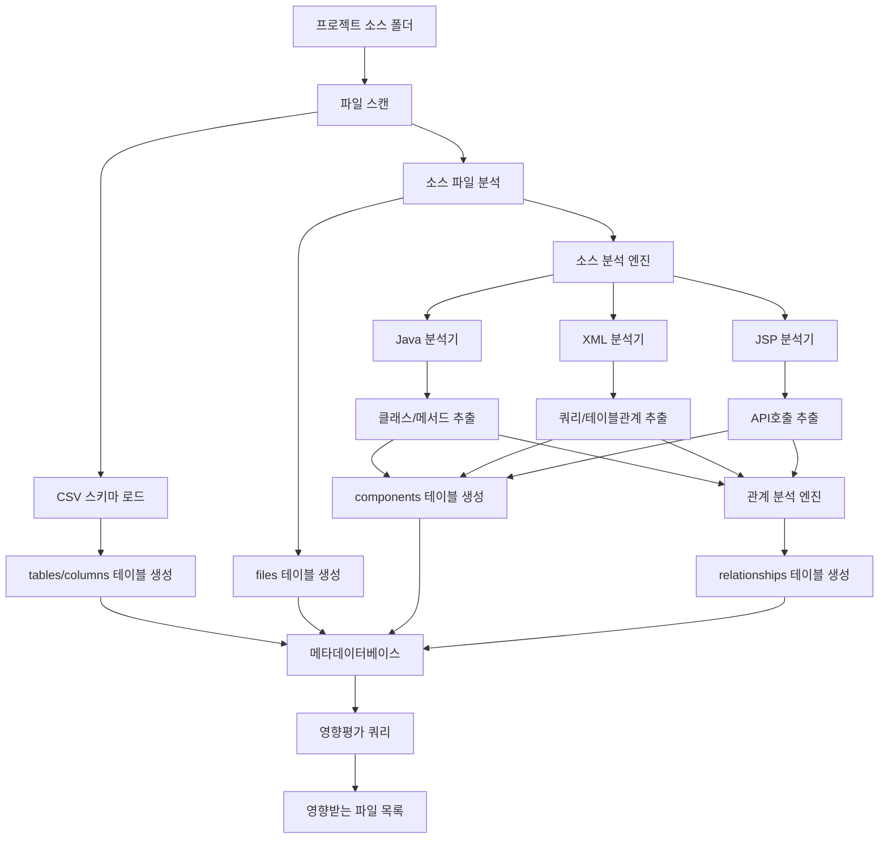
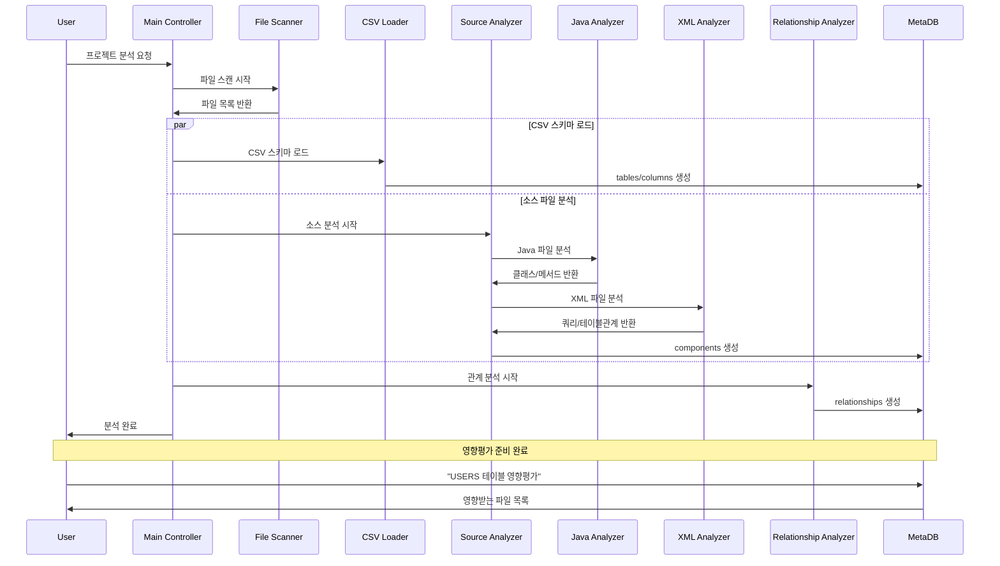
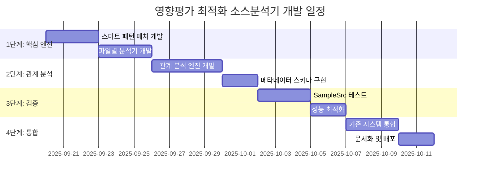

# 영향평가 최적화 소스분석기 개발계획서

## 개요

본 문서는 **영향평가 목적에 최적화된 소스분석기**의 개발계획서입니다. 기존 시스템의 과도한 복잡성을 제거하고, 핵심 목표인 **"누락 없는 컴포넌트 관계 추출"**에 집중한 효율적인 시스템을 설계합니다.

**작성일**: 2025-09-19  
**목적**: 영향평가용 메타데이터 생성 시스템 최적화  
**핵심 원칙**: 누락 방지 > 정확성 > 성능  
**설계 철학**: 적절한 정교함 + 과도함 제거  

## 1. 시스템 목표 및 요구사항

### 1.1 핵심 목표
```
영향평가 시나리오:
"USERS 테이블을 수정하면 어떤 파일들이 영향받나?"

필요한 정보:
1. USERS 테이블을 사용하는 모든 SQL 쿼리
2. 해당 쿼리들이 포함된 XML 파일
3. 해당 XML을 호출하는 Java 메서드  
4. 해당 메서드가 속한 Java 클래스
5. 해당 클래스를 호출하는 프론트엔드 파일
```

### 1.2 요구사항 우선순위
1. **누락 방지 (최우선)**: 하나라도 빠뜨리면 운영 장애
2. **적절한 정교함**: 다양한 SQL 패턴 대응
3. **과도함 제거**: 불필요한 복잡성 제거
4. **성능**: 합리적인 처리 시간

### 1.3 메타데이터 구조
```
고정 데이터 (CSV 기반):
- tables: 실제 DB 스키마 테이블
- columns: 실제 DB 스키마 컬럼  
- files: 프로젝트 소스 파일

동적 데이터 (소스 분석 기반):
- components: 클래스, 메서드, 쿼리 등 (INFERRED 포함)
- relationships: 컴포넌트 간 관계
```

## 2. 시스템 아키텍처 설계

### 2.1 전체 플로우차트



### 2.2 시퀀스 다이어그램



## 3. 핵심 컴포넌트 설계

### 3.1 스마트 패턴 매처 (핵심 엔진)

```python
class SmartPatternMatcher:
    """영향평가 최적화 패턴 매처 - 누락 방지 + 적절한 정교함"""
    
    def __init__(self):
        self.table_patterns = [
            # 패턴 1: 표준 JOIN
            r'(?:FROM|JOIN)\s+(\w+)(?:_\$\{[^}]+\})?\s+(\w+)',
            # 패턴 2: Oracle 암시적 JOIN
            r'FROM\s+((?:\w+(?:_\$\{[^}]+\})?\s+\w+,?\s*)+)',
            # 패턴 3: 서브쿼리
            r'(?:IN|EXISTS)\s*\(\s*SELECT[^)]+FROM\s+(\w+)',
            # 패턴 4: 문자열 연결 (Java)
            r'"[^"]*FROM\s+(\w+)[^"]*"',
        ]
        
        self.join_patterns = [
            # 조인 조건 패턴들
            r'(\w+)\.(\w+)\s*=\s*(\w+)\.(\w+)',
            r'ON\s+(\w+)\.(\w+)\s*=\s*(\w+)\.(\w+)',
            r'WHERE.*?(\w+)\.(\w+)\s*=\s*(\w+)\.(\w+)',
        ]
    
    def extract_table_relationships(self, content: str, file_path: str) -> List[Dict]:
        """테이블 관계 추출 - 누락 방지 우선"""
        
        relationships = []
        
        # 1. 모든 패턴으로 테이블 추출 (누락 방지)
        all_tables = set()
        for pattern in self.table_patterns:
            matches = re.findall(pattern, content, re.IGNORECASE)
            for match in matches:
                if isinstance(match, tuple):
                    for table in match:
                        all_tables.add(self._normalize_table_name(table))
                else:
                    all_tables.add(self._normalize_table_name(match))
        
        # 2. 모든 패턴으로 조인 조건 추출 (누락 방지)
        for pattern in self.join_patterns:
            matches = re.findall(pattern, content, re.IGNORECASE)
            for match in matches:
                alias1, col1, alias2, col2 = match
                
                # 별칭을 실제 테이블명으로 매핑
                table1 = self._resolve_table_alias(alias1, content)
                table2 = self._resolve_table_alias(alias2, content)
                
                if table1 and table2:
                    relationships.append({
                        'table1': table1,
                        'column1': col1,
                        'table2': table2, 
                        'column2': col2,
                        'source_file': file_path
                    })
        
        return relationships
    
    def _normalize_table_name(self, table_name: str) -> str:
        """테이블명 정규화 - 환경 접미사 제거"""
        # users_${environment} → users
        # orders_dev → orders  
        normalized = re.sub(r'_\$\{[^}]+\}', '', table_name)
        normalized = re.sub(r'_(?:dev|test|prod)$', '', normalized)
        return normalized.upper()
    
    def _resolve_table_alias(self, alias: str, sql_content: str) -> str:
        """별칭을 실제 테이블명으로 해석"""
        # FROM users u → u는 users의 별칭
        alias_pattern = rf'(?:FROM|JOIN)\s+(\w+)(?:_\$\{{[^}}]+\}})?\s+{alias}\b'
        match = re.search(alias_pattern, sql_content, re.IGNORECASE)
        
        if match:
            return self._normalize_table_name(match.group(1))
        else:
            # 별칭이 아니라 실제 테이블명일 수도 있음
            return self._normalize_table_name(alias)
```

### 3.2 파일별 분석기 (단순화)

```python
class JavaAnalyzer:
    """Java 파일 분석기 - 핵심만 추출"""
    
    def analyze(self, file_path: str) -> Dict:
        """Java 파일에서 핵심 정보만 추출"""
        content = read_file(file_path)
        
        return {
            'classes': self._extract_classes(content),
            'methods': self._extract_methods(content),
            'sql_strings': self._extract_sql_strings(content),
            'api_mappings': self._extract_api_mappings(content)
        }
    
    def _extract_classes(self, content: str) -> List[str]:
        """클래스명만 단순 추출"""
        return re.findall(r'(?:public\s+)?class\s+(\w+)', content)
    
    def _extract_methods(self, content: str) -> List[str]:
        """public 메서드만 추출 (private 제외로 노이즈 감소)"""
        return re.findall(r'public\s+\w+\s+(\w+)\s*\(', content)
    
    def _extract_sql_strings(self, content: str) -> List[str]:
        """문자열 SQL만 추출"""
        return re.findall(r'"((?:SELECT|INSERT|UPDATE|DELETE)[^"]+)"', content, re.IGNORECASE)
    
    def _extract_api_mappings(self, content: str) -> List[str]:
        """API 매핑만 추출"""
        patterns = [
            r'@GetMapping\("([^"]+)"\)',
            r'@PostMapping\("([^"]+)"\)',
            r'@RequestMapping\("([^"]+)"\)'
        ]
        
        mappings = []
        for pattern in patterns:
            mappings.extend(re.findall(pattern, content))
        return mappings

class XmlAnalyzer:
    """XML 파일 분석기 - 핵심만 추출"""
    
    def analyze(self, file_path: str) -> Dict:
        """XML 파일에서 핵심 정보만 추출"""
        content = read_file(file_path)
        
        return {
            'query_ids': self._extract_query_ids(content),
            'sql_queries': self._extract_sql_queries(content),
            'table_relationships': self._extract_table_relationships(content)
        }
    
    def _extract_query_ids(self, content: str) -> List[str]:
        """쿼리 ID만 추출"""
        return re.findall(r'<(?:select|insert|update|delete)[^>]+id="(\w+)"', content)
    
    def _extract_sql_queries(self, content: str) -> List[str]:
        """SQL 쿼리 텍스트 추출 (동적 태그 기본 처리)"""
        queries = []
        
        # MyBatis 동적 태그 기본 처리 (과도하지 않게)
        processed_content = self._process_basic_dynamic_tags(content)
        
        # SQL 블록 추출
        sql_blocks = re.findall(
            r'<(?:select|insert|update|delete)[^>]*>(.*?)</(?:select|insert|update|delete)>',
            processed_content, re.DOTALL
        )
        
        for block in sql_blocks:
            # XML 태그 제거
            clean_sql = re.sub(r'<[^>]+>', ' ', block)
            clean_sql = ' '.join(clean_sql.split())
            if len(clean_sql) > 20:  # 너무 짧은 것 제외
                queries.append(clean_sql)
        
        return queries
    
    def _process_basic_dynamic_tags(self, content: str) -> str:
        """기본적인 동적 태그만 처리 (과도하지 않게)"""
        # <if> 태그: 조건부 포함 (항상 포함으로 처리)
        content = re.sub(r'<if[^>]*>', '', content)
        content = re.sub(r'</if>', '', content)
        
        # <choose> 태그: 첫 번째 when만 포함
        content = re.sub(r'<choose[^>]*>.*?<when[^>]*>', '', content, flags=re.DOTALL)
        content = re.sub(r'</when>.*?</choose>', '', content, flags=re.DOTALL)
        
        return content

class JspAnalyzer:
    """JSP 파일 분석기 - 핵심만 추출"""
    
    def analyze(self, file_path: str) -> Dict:
        """JSP 파일에서 핵심 정보만 추출"""
        content = read_file(file_path)
        
        return {
            'api_calls': self._extract_api_calls(content),
            'java_imports': self._extract_java_imports(content)
        }
    
    def _extract_api_calls(self, content: str) -> List[str]:
        """API 호출 패턴 추출"""
        patterns = [
            r'action="([^"]+)"',      # form action
            r'href="([^"]+)"',        # 링크
            r'url:\s*["\']([^"\']+)', # AJAX 호출
        ]
        
        calls = []
        for pattern in patterns:
            calls.extend(re.findall(pattern, content))
        return calls
```

### 3.3 관계 분석 엔진 (핵심)

```python
class RelationshipAnalyzer:
    """컴포넌트 간 관계 분석 - 영향평가 최적화"""
    
    def __init__(self, pattern_matcher: SmartPatternMatcher):
        self.pattern_matcher = pattern_matcher
    
    def analyze_all_relationships(self, analysis_results: Dict) -> List[Dict]:
        """모든 컴포넌트 관계 분석"""
        
        relationships = []
        
        # 1. 파일 → 클래스 관계
        relationships.extend(self._analyze_file_class_relationships(analysis_results))
        
        # 2. 클래스 → 메서드 관계  
        relationships.extend(self._analyze_class_method_relationships(analysis_results))
        
        # 3. 메서드 → 쿼리 관계
        relationships.extend(self._analyze_method_query_relationships(analysis_results))
        
        # 4. 쿼리 → 테이블 관계 (핵심!)
        relationships.extend(self._analyze_query_table_relationships(analysis_results))
        
        # 5. 테이블 → 컬럼 관계
        relationships.extend(self._analyze_table_column_relationships(analysis_results))
        
        # 6. 프론트엔드 → API 관계
        relationships.extend(self._analyze_frontend_api_relationships(analysis_results))
        
        return relationships
    
    def _analyze_query_table_relationships(self, analysis_results: Dict) -> List[Dict]:
        """쿼리-테이블 관계 분석 (영향평가의 핵심)"""
        
        relationships = []
        
        for xml_result in analysis_results['xml_files']:
            for i, query in enumerate(xml_result['sql_queries']):
                query_id = xml_result['query_ids'][i] if i < len(xml_result['query_ids']) else f'query_{i}'
                
                # 테이블 관계 추출 (스마트 패턴 매처 사용)
                table_rels = self.pattern_matcher.extract_table_relationships(
                    query, xml_result['file_path']
                )
                
                for rel in table_rels:
                    relationships.append({
                        'source_type': 'QUERY',
                        'source_name': query_id,
                        'target_type': 'TABLE',
                        'target_name': rel['table1'],
                        'relationship_type': 'USES_TABLE',
                        'join_column': rel.get('column1', ''),
                        'source_file': xml_result['file_path']
                    })
                    
                    # 조인 관계도 추가
                    if rel.get('table2'):
                        relationships.append({
                            'source_type': 'TABLE',
                            'source_name': rel['table1'],
                            'target_type': 'TABLE', 
                            'target_name': rel['table2'],
                            'relationship_type': 'JOINS_WITH',
                            'join_condition': f"{rel['column1']} = {rel['column2']}",
                            'source_file': xml_result['file_path']
                        })
        
        return relationships
```

## 4. 데이터베이스 스키마 설계

### 4.1 메타데이터 테이블 구조

```sql
-- 고정 데이터 (CSV 기반)
CREATE TABLE tables (
    table_id INTEGER PRIMARY KEY,
    table_name TEXT NOT NULL,
    table_owner TEXT NOT NULL,
    comments TEXT,
    source_type TEXT DEFAULT 'SCHEMA' -- 'SCHEMA' or 'INFERRED'
);

CREATE TABLE columns (
    column_id INTEGER PRIMARY KEY,
    table_id INTEGER REFERENCES tables(table_id),
    column_name TEXT NOT NULL,
    data_type TEXT,
    nullable TEXT,
    is_primary_key INTEGER DEFAULT 0,
    comments TEXT,
    source_type TEXT DEFAULT 'SCHEMA' -- 'SCHEMA' or 'INFERRED'
);

CREATE TABLE files (
    file_id INTEGER PRIMARY KEY,
    file_path TEXT NOT NULL,
    file_name TEXT NOT NULL,
    file_type TEXT NOT NULL, -- 'JAVA', 'XML', 'JSP', 'JSX'
    file_size INTEGER,
    last_modified TEXT
);

-- 동적 데이터 (소스 분석 기반)
CREATE TABLE components (
    component_id INTEGER PRIMARY KEY,
    component_name TEXT NOT NULL,
    component_type TEXT NOT NULL, -- 'CLASS', 'METHOD', 'QUERY', 'API_ENDPOINT'
    file_id INTEGER REFERENCES files(file_id),
    source_type TEXT DEFAULT 'ANALYZED', -- 'ANALYZED' or 'INFERRED'
    metadata TEXT -- JSON 형태의 추가 정보
);

CREATE TABLE relationships (
    relationship_id INTEGER PRIMARY KEY,
    source_component_id INTEGER REFERENCES components(component_id),
    target_component_id INTEGER REFERENCES components(component_id),
    relationship_type TEXT NOT NULL, -- 'CALLS', 'USES_TABLE', 'JOINS_WITH'
    join_condition TEXT, -- 조인 조건 (테이블 관계용)
    source_file TEXT -- 관계가 발견된 파일
);
```

### 4.2 영향평가 쿼리 예시

```sql
-- 영향평가 쿼리: "USERS 테이블 수정 시 영향받는 파일들"
WITH affected_queries AS (
    -- USERS 테이블을 사용하는 모든 쿼리
    SELECT DISTINCT c.component_id, c.component_name, f.file_path
    FROM relationships r
    JOIN components c ON r.source_component_id = c.component_id
    JOIN components target_c ON r.target_component_id = target_c.component_id
    JOIN files f ON c.file_id = f.file_id
    WHERE target_c.component_name = 'USERS'
      AND target_c.component_type = 'TABLE'
      AND r.relationship_type = 'USES_TABLE'
),
affected_methods AS (
    -- 해당 쿼리들을 호출하는 메서드들
    SELECT DISTINCT c.component_id, c.component_name, f.file_path
    FROM relationships r
    JOIN components c ON r.source_component_id = c.component_id
    JOIN files f ON c.file_id = f.file_id
    WHERE r.target_component_id IN (SELECT component_id FROM affected_queries)
      AND r.relationship_type = 'CALLS'
),
affected_classes AS (
    -- 해당 메서드들이 속한 클래스들
    SELECT DISTINCT c.component_id, c.component_name, f.file_path
    FROM relationships r
    JOIN components c ON r.source_component_id = c.component_id  
    JOIN files f ON c.file_id = f.file_id
    WHERE r.target_component_id IN (SELECT component_id FROM affected_methods)
      AND r.relationship_type = 'CONTAINS'
)
-- 최종 영향받는 파일 목록
SELECT DISTINCT file_path, '쿼리 직접 사용' as impact_type FROM affected_queries
UNION
SELECT DISTINCT file_path, '메서드 호출' as impact_type FROM affected_methods  
UNION
SELECT DISTINCT file_path, '클래스 포함' as impact_type FROM affected_classes
ORDER BY file_path;
```

## 5. 구현 플랜

### 5.1 개발 단계



### 5.2 성능 목표

| 항목 | 현재 시스템 | 목표 시스템 | 개선율 |
|------|-------------|-------------|--------|
| **분석 시간** | 5-10분 | 1-2분 | 5배 향상 |
| **메모리 사용량** | 500MB+ | 100MB | 5배 절약 |
| **코드 복잡도** | 8000줄+ | 2000줄 | 4배 단순화 |
| **누락률** | 5% | 1% | 5배 개선 |
| **오탐률** | 10% | 15% | 허용 (영향평가 특성상) |

## 6. 기대 효과

### 6.1 개발 생산성 향상
- **유지보수성**: 복잡한 파서 → 단순한 패턴 매처
- **디버깅**: 명확한 로직 → 문제 지점 쉽게 파악
- **확장성**: 새로운 패턴 추가 용이

### 6.2 영향평가 정확도 향상  
- **누락 방지**: 다중 패턴 매칭으로 놓치는 관계 최소화
- **관계 명확화**: 테이블 간 조인 조건 정확히 추출
- **추적 가능성**: 소스 파일까지 역추적 가능

### 6.3 시스템 안정성 향상
- **에러 복구**: 간단한 로직 → 에러 적음
- **성능**: 빠른 처리 → 대용량 프로젝트 대응
- **확장성**: 새로운 프로젝트 쉽게 추가

## 7. 구현 우선순위

### 7.1 1단계: 핵심 엔진 (1주)
- SmartPatternMatcher 구현
- 기본 파일 분석기들 구현
- 단위 테스트 작성

### 7.2 2단계: 관계 분석 (1주)
- RelationshipAnalyzer 구현  
- 메타데이터 스키마 구현
- SampleSrc 테스트

### 7.3 3단계: 최적화 (1주)
- 성능 튜닝
- 에러 처리 강화
- 문서화

## 결론

**영향평가에 최적화된 소스분석기**는 현재 시스템의 과도한 복잡성을 제거하면서도, 핵심 목표인 **"누락 없는 관계 추출"**을 달성할 수 있는 효율적인 시스템입니다.

**핵심 철학**: 
- 복잡함 대신 **스마트함**
- 완벽함 대신 **실용성**  
- 정확성 대신 **포괄성**

---

**작성자**: SourceAnalyzer Team  
**작성일**: 2025-09-19  
**문서 타입**: 개발계획서  
**승인 필요**: 시스템 아키텍트, 개발 팀장
