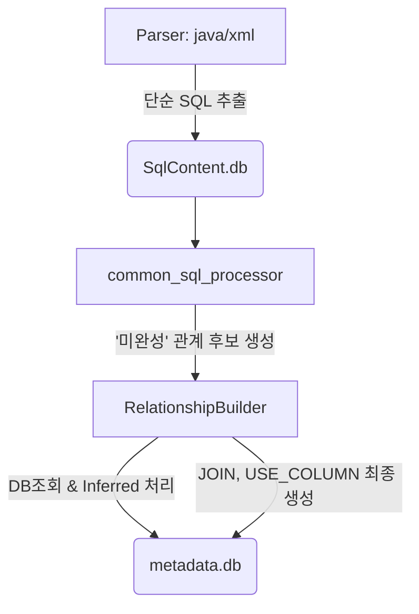

# [개선방안] SQL 관계 분석 로직 리팩토링 계획

## 1. 현황 및 문제점

현재 메타데이터 분석 결과, 정답지 대비 특정 관계 데이터가 누락되는 심각한 문제가 식별되었다.

### 1.1. `JOIN_IMPLICIT` 누락 문제 (2건)

- **현상:** 정답지 기준 5건 중 3건만 탐지, 2건 누락.
- **실패 사례:**
  ```sql
  -- 1. Oracle 외부 조인 (+) 구문
  SELECT ... FROM USERS u, USER_PROFILES p WHERE u.USER_ID = p.USER_ID(+)

  -- 2. 별칭 없는 컬럼 조인
  SELECT ... FROM USERS u, DEPARTMENTS d WHERE u.DEPT_ID = DEPT_ID
  ```

### 1.2. `USE_COLUMN` 대량 누락 문제 (29건)

- **현상:** 정답지 기준 100건 중 71건만 탐지, 29건 누락.
- **실패 사례:** `JOIN_IMPLICIT`과 동일하게, 조인 조건에 사용된 별칭 없는 컬럼(`DEPT_ID`)이나, `SELECT` 절에 명시된 별칭 없는 컬럼(`USER_NAME`)등을 처리하지 못함.

### 1.3. 근본 원인: 분산되고 불완전한 분석 로직

- **낡은 공통 분석기:** `relationship_builder.py`가 호출하는 `util/common_sql_processor.py`의 분석 로직(`_extract_implicit_joins`, `_extract_columns` 등)이 별칭 없는 컬럼, `(+)` 구문 등 복잡한 케이스를 처리하지 못한다.
- **잘못된 위치의 로직:** `inferred column`을 생성하는 핵심 로직이, 데이터 수집 단계가 아닌 `reports/erd_metadata_service.py`라는 리포트 생성 단계에 잘못 위치해 있어, 분석 시점에 활용되지 못하고 있다.
- **중복되고 파편화된 구현:** `java_parser.py`, `xml_loading.py` 등 여러 파일에서 각자 불완전한 방식으로 관계 생성을 시도하고 있어, 코드 구조가 복잡하고 문제 추적이 어렵다.

## 2. 개선 목표

1.  **'누락 Zero' 달성:** `JOIN_IMPLICIT`과 `USE_COLUMN` 관계를 누락 없이 모두 탐지한다.
2.  **로직 중앙화:** 여러 파일에 흩어져 있는 관계 생성 및 `inferred` 처리 로직을 `relationship_builder.py`로 일원화하여, 역할과 책임을 명확히 하고 유지보수성을 극대화한다.

## 3. 해결 전략: `RelationshipBuilder` 중심의 중앙 처리 방식

모든 관계 생성의 책임을 `relationship_builder.py`에 집중시키는 리팩토링을 제안한다.

### AS-IS (현재)

```mermaid
graph TD
    A[Parser: java/xml] -->|SQL 추출| B(SqlContent.db)
    A -->|불완전한 관계 분석 시도| D(metadata.db)
    C[common_sql_processor] -->|불완전한 관계 분석 시도| D
    E[Report-time] -->|Inferred 생성(너무 늦음)| D
```

### TO-BE (개선 후)



### 변경될 모듈별 역할

- **파서 (`java_parser.py`, `xml_parser.py`):**
  - **역할 축소:** 복잡한 분석 로직 제거. 순수하게 소스 코드에서 SQL 문자열을 '도려내어' `SqlContent.db`에 저장하는 역할에만 집중한다.
- **`util/common_sql_processor.py`:**
  - **역할 변경:** `SqlContent.db`를 읽어, 테이블/컬럼/조인 관계를 최종 확정하는 대신, 별칭이 없거나 테이블이 불분명한 상태 그대로의 **'미완성 관계 후보'** 목록을 생성하는 역할만 담당한다.
- **`relationship_builder.py` (핵심):**
  - **역할 강화:** 모든 관계 생성의 최종 책임을 지는 **중앙 처리 허브**가 된다.
  - `common_sql_processor`로부터 '미완성 관계 후보' 목록을 전달받는다.
  - DB에 직접 조회하여 별칭 없는 컬럼의 소속 테이블을 **확정**한다.
  - 소속 테이블이 없을 경우, **`inferred` 처리**를 수행한다.
  - 최종 확정된 정보를 바탕으로 `JOIN` 관계와 `USE_COLUMN` 관계를 **모두 생성**하여 `metadata.db`에 저장한다.

## 4. 상세 구현 계획

### 4.1. `reports/erd_metadata_service.py` 로직 이전

1.  `_save_inferred_columns_to_database` 함수의 핵심 로직을, 모든 모듈이 접근 가능한 `util/database_utils.py`로 옮겨, `register_inferred_column(table_name, column_name)`과 같은 공용 함수로 만든다.
2.  `reports/erd_metadata_service.py`에 남아있는 관련 코드를 **완전히 제거**한다.

### 4.2. `util/common_sql_processor.py` 리팩토링

1.  **`_extract_columns` 수정:** 별칭 없는 컬럼을 만났을 때, `'UNKNOWN'` 테이블과 함께 `alias_map` 정보를 포함하는 딕셔너리 리스트를 반환하도록 수정한다.
2.  **`_extract_implicit_joins` 수정:** `(+)` 구문을 처리하고, 별칭 없는 조인 조건을 분석하여 '미완성' 조인 후보 딕셔너리 리스트를 반환하도록 수정한다.
3.  **`analyze_all_queries` 수정:** 위 함수들을 호출하여 얻은 '미완성' 정보들을 취합하여 그대로 `relationship_builder.py`에 반환하도록 수정한다. (자체적으로 DB에 저장하는 로직 제거)

### 4.3. `relationship_builder.py` 기능 강화

1.  `build_all_relationships` 함수 내에, `common_sql_processor`를 호출하고 그 결과를 받는 부분을 추가한다.
2.  **`_resolve_and_build_relationships`** 라는 신규 메서드를 구현한다. 이 메서드가 이번 리팩토링의 핵심이다.
    - **입력:** '미완성' 관계 후보 목록
    - **처리:**
        - 목록을 순회하며 `table`이 `'UNKNOWN'`이거나 `None`인 항목을 찾는다.
        - 함께 넘어온 `alias_map`을 기반으로 후보 테이블 목록을 만든다.
        - `database_utils`를 통해 DB에 직접 쿼리하여, 컬럼을 소유한 실제 테이블을 찾는다.
        - 실제 테이블을 찾으면, 관계 정보의 `table`을 확정한다.
        - 못 찾으면, 4.1에서 만든 공용 `register_inferred_column` 함수를 호출하여 `inferred` 처리를 하고 테이블을 확정한다.
        - 최종 확정된 정보를 바탕으로 `JOIN` 관계와 `USE_COLUMN` 관계를 생성하여 `_insert_relationship`을 통해 DB에 저장한다.

### 4.4. `java_parser.py`, `xml_parser.py` 단순화

- 각 파서에서 `CommonSqlAnalyzer`의 세부 함수(`_extract_columns` 등)를 직접 호출하며 자체적으로 관계를 생성하려던 부분을 모두 제거한다.
- 이제 파서들은 `main.py`의 전체 흐름에 따라, SQL 추출 역할만 수행하게 된다.

## 5. 기대 효과

- **누락 문제 해결:** 별칭 없는 컬럼, `(+)` 구문 등을 모두 처리하게 되어 `JOIN_IMPLICIT`과 `USE_COLUMN` 누락 문제가 근본적으로 해결된다.
- **유지보수성 향상:** 복잡한 관계 생성 및 `inferred` 처리 로직이 `relationship_builder.py` 한 곳으로 중앙화되어, 향후 수정 및 디버깅이 매우 용이해진다.
- **명확한 데이터 흐름:** `파서(추출) -> 분석기(후보 생성) -> 빌더(확정 및 저장)`로 데이터 흐름이 명확해져 코드 전체의 이해도가 높아진다.
