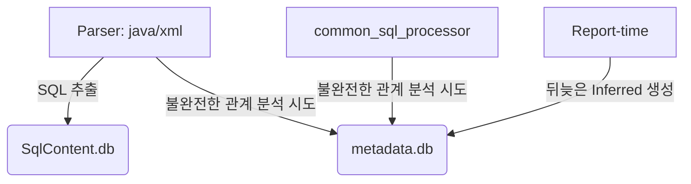
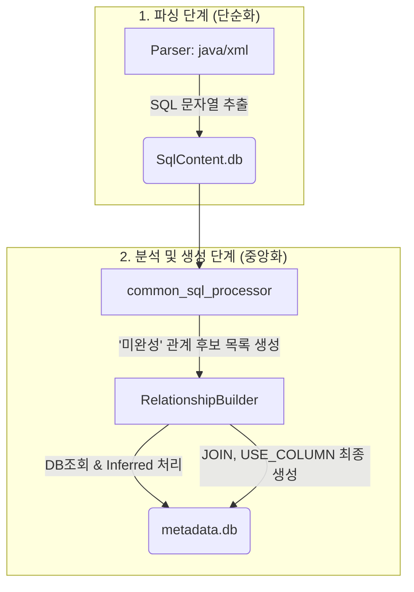

# [개선방안 v2] SQL 관계 분석 로직 리팩토링 최종 계획

## 1. 현황 및 문제점

현재 메타데이터 분석 결과, 정답지 대비 `JOIN_IMPLICIT` 및 `USE_COLUMN` 관계가 대량으로 누락되는 심각한 문제가 확인되었다.

### 1.1. 주요 누락 현황 (정답지 기반)

- **`JOIN_IMPLICIT`:** 2건 누락 (5건 중 3건 탐지)
- **`USE_COLUMN`:** 29건 누락 (100건 중 71건 탐지)

### 1.2. 근본 원인 추적 과정 및 최종 결론

초기에는 필터링 부재, 키워드 오인 등 여러 가설이 있었으나, 심층 분석 결과 진짜 원인은 다음과 같이 복합적이고 구조적인 문제임이 밝혀졌다.

1.  **전처리 파서의 한계:** `java_parser.py` 등이 실제 DB와 연동되지 않는 단순 문자열(예: `"SELECT your option FROM the menu"`)까지 SQL로 오인하여 `SqlContent.db`를 오염시킨다.
2.  **공통 분석기의 불완전성:** `util/common_sql_processor.py`의 SQL 분석 로직이 Oracle의 `(+)` 조인 구문이나, 별칭(alias)이 없는 컬럼(예: `... WHERE a.col = col`)을 제대로 해석하지 못한다.
3.  **핵심 로직의 잘못된 위치:** 컬럼이 존재하지 않을 때 이를 추론하여 등록하는 **`inferred column` 생성 기능**이, 데이터 수집 단계가 아닌 한참 뒤인 **`reports/erd_metadata_service.py`(리포트 생성 단계)에 잘못 위치**해 있다. 이로 인해, 정작 가장 중요한 메타데이터 생성 시점에는 이 기능이 전혀 활용되지 못하고 있다.

**결론: 각 모듈의 책임이 불분명하고, 분석 단계의 순서가 잘못되어 있으며, 로직이 여러 파일에 파편화되어 총체적인 누락이 발생하고 있다.**

## 2. 개선 목표

1.  **'누락 Zero' 달성:** `JOIN_IMPLICIT`과 `USE_COLUMN` 관계를 정답지 수준으로 복원한다.
2.  **로직 중앙화 및 재배치:** 파편화된 분석 및 생성 로직을 **메타데이터 생성 단계**로 통합하고, 역할과 책임을 명확히 하여 코드의 구조적 안정성과 유지보수성을 확보한다.

## 3. 해결 전략: `RelationshipBuilder` 중심의 중앙 처리 방식

모든 관계 생성의 책임을 `relationship_builder.py`에 집중시키는 대대적인 리팩토링을 통해 문제를 근본적으로 해결한다.

### AS-IS (현재의 복잡하고 비효율적인 흐름)

### TO-BE (개선 후의 명확한 흐름)

### 변경될 모듈별 역할

- **파서 (`java_parser.py`, `xml_loading.py`):**
  - **역할 축소:** 복잡한 분석 로직을 모두 제거한다. 순수하게 소스 코드에서 SQL 문자열을 '도려내어' `SqlContent.db`에 저장하는 역할에만 집중한다.
- **`util/common_sql_processor.py`:**
  - **역할 변경:** `SqlContent.db`를 읽어, 테이블/컬럼/조인 관계를 최종 확정하는 대신, 별칭이 없거나 테이블이 불분명한 상태 그대로의 **'미완성 관계 후보'** 목록을 생성하는 역할만 담당한다.
- **`relationship_builder.py` (핵심):**
  - **역할 강화:** 모든 관계 생성의 최종 책임을 지는 **중앙 처리 허브**가 된다.
  - `common_sql_processor`로부터 '미완성 관계 후보' 목록을 전달받는다.
  - DB에 직접 조회하여 별칭 없는 컬럼의 소속 테이블을 **확정**한다.
  - 소속 테이블이 없을 경우, **`inferred` 처리**를 수행한다.
  - 최종 확정된 정보를 바탕으로 `JOIN` 관계와 `USE_COLUMN` 관계를 **모두 생성**하여 `metadata.db`에 저장한다.

## 4. 상세 구현 계획

### 4.1. `reports/erd_metadata_service.py` 로직 제거 (선행 작업)

- `_save_inferred_columns_to_database` 함수와 관련 호출 코드를 **완전히 제거**하여, 리포트 생성 시점의 `inferred` 처리를 원천 차단한다.

### 4.2. `util/database_utils.py` 기능 추가

- 제거된 로직을 바탕으로, 모든 모듈에서 호출할 수 있는 `register_inferred_column(table_name, column_name)`과 같은 공용 함수를 여기에 신설한다. 이 함수는 `columns` 테이블과 `components` 테이블에 `inferred` 컬럼 정보를 원자적으로 추가한다.

### 4.3. `util/common_sql_processor.py` 리팩토링

- `_extract_columns` 함수가 별칭 없는 컬럼을 만났을 때, `{'table': 'UNKNOWN', 'column': 'DEPT_ID', 'alias_map': ...}` 형태의 딕셔너리를 반환하도록 수정한다.
- `_extract_implicit_joins` 함수가 `(+)` 구문을 처리하고, 별칭 없는 조인 조건을 분석하여 '미완성' 조인 후보 딕셔너리를 반환하도록 수정한다.
- `analyze_all_queries` 함수는 위 함수들을 호출하여 얻은 '미완성' 정보들을 취합하여, 후처리 없이 그대로 `relationship_builder.py`에 반환하도록 단순화한다.

### 4.4. `relationship_builder.py` 기능 강화

- `build_all_relationships` 함수 내에, `common_sql_processor`를 호출하고 그 결과를 받는 부분을 추가한다.
- **`_resolve_and_build_relationships`** 라는 신규 메서드를 구현한다. 이 메서드가 이번 리팩토링의 핵심이다.
    - **입력:** '미완성' 관계 후보 목록
    - **처리:**
        - 목록을 순회하며 `table`이 `'UNKNOWN'`이거나 `None`인 항목을 찾는다.
        - 함께 넘어온 `alias_map`을 기반으로 후보 테이블 목록을 만든다.
        - `database_utils`를 통해 DB에 직접 쿼리하여, 컬럼을 소유한 실제 테이블을 찾는다.
        - 실제 테이블을 찾으면, 관계 정보의 `table`을 확정한다.
        - 못 찾으면, 4.2에서 만든 공용 `register_inferred_column` 함수를 호출하여 `inferred` 처리를 하고 테이블을 확정한다.
        - 최종 확정된 정보를 바탕으로 `JOIN` 관계와 `USE_COLUMN` 관계를 생성하여 `_insert_relationship`을 통해 DB에 저장한다.

### 4.5. `java_parser.py`, `xml_loading.py` 단순화

- 각 파서에 존재하던 자체적인 관계 분석 및 저장 로직을 모두 제거한다.
- 이제 파서들은 `main.py`의 전체 흐름에 따라, SQL 추출 역할만 수행하게 된다.

## 5. 기대 효과

- **누락 문제 해결:** 별칭 없는 컬럼, `(+)` 구문 등 기존에 처리하지 못했던 모든 케이스를 커버하여 `JOIN_IMPLICIT`과 `USE_COLUMN` 누락 문제를 근본적으로 해결한다.
- **유지보수성 향상:** 복잡하고 파편화되었던 관계 생성 및 `inferred` 처리 로직이 `relationship_builder.py`와 `database_utils.py`로 중앙화되어, 향후 수정 및 디버깅이 매우 용이해진다.
- **명확한 데이터 흐름:** `파서(추출) -> 분석기(후보 생성) -> 빌더(확정 및 저장)`로 데이터 흐름이 명확해져 코드 전체의 이해도가 높아진다.
