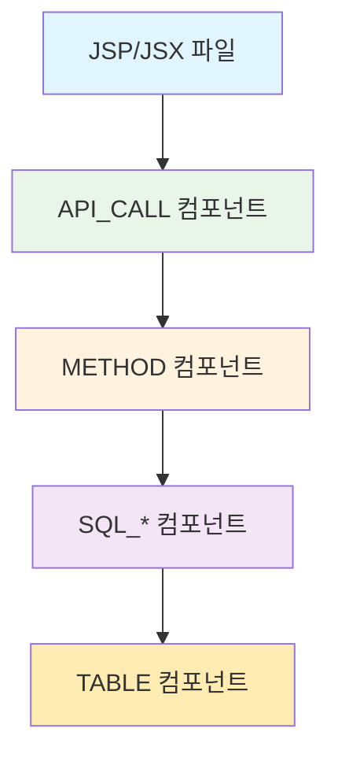

# API 매핑 사례 분석 v3.0

## 개요

CallChain 리포트에서 **단순화된 API 호출 구조**를 분석합니다. 이 문서는 sampleSrc 프로젝트에 구현된 실제 사례들을 바탕으로 작성되었습니다.

## 단순화된 API 호출 구조

### **기존 vs 개선**

| 구분 | 기존 (복잡) | 개선 (단순) | 설명 |
|------|-------------|-------------|------|
| **구조** | FRONTEND_API + API_ENTRY | API_CALL | 단일 컴포넌트로 통합 |
| **테이블** | api_components 테이블 | components 테이블 | 기존 테이블 활용 |
| **관계** | CALL_API_F2B + CALL_API_BE | CALL_API | 단일 관계로 통합 |
| **분석** | 3단계 복잡한 분석 | 1단계 단순한 정리 | 기존 결과 활용 |

### **API_CALL 컴포넌트 구조**

| 컬럼명 | 설명 | 예시 |
|--------|------|------|
| component_type | API_CALL | API_CALL |
| component_name | 컨트롤러명 | MicroserviceController |
| api_url | API URL | /api/user-profile |
| call_method | HTTP 메서드 | GET |
| class_name | 클래스명 | MicroserviceController |
| method_name | 메서드명 | getUserProfile |

## 실제 사례 분석

### 1. MicroserviceController

**소스 코드**:
```java
@RestController
@RequestMapping("/api")
public class MicroserviceController {
    
    @GetMapping("/user-profile")
    public ResponseEntity<Map<String, Object>> getUserProfile(@RequestParam Long userId) {
        // ...
    }
}
```

**API_CALL 컴포넌트**:
```sql
INSERT INTO components VALUES (
    1001, 1, 201, 'MicroserviceController', 'API_CALL', 
    NULL, 'CONTROLLER', 19, 26, 'N', NULL, 'hash123', 
    '2024-01-01', '2024-01-01', 'N',
    '/api/user-profile', 'GET', 'MicroserviceController', 'getUserProfile'
);
```

**관계**:
```sql
INSERT INTO relationships VALUES (
    1001, 2001, 'CALL_API', 1.0, 'N', NULL, 'hash_rel1', 
    '2024-01-01', '2024-01-01', 'N'
);
```

### 2. UserManagementController

**소스 코드**:
```java
@RestController
@RequestMapping("/api/user-management")
public class UserManagementController {
    
    @GetMapping("/users")
    public ResponseEntity<List<Map<String, Object>>> getUsers() {
        // ...
    }
    
    @PostMapping("/users")
    public ResponseEntity<Map<String, Object>> createUser(@RequestBody Map<String, Object> userData) {
        // ...
    }
}
```

**API_CALL 컴포넌트들**:
```sql
-- GET /api/user-management/users
INSERT INTO components VALUES (
    1002, 1, 202, 'UserManagementController', 'API_CALL', 
    NULL, 'CONTROLLER', 20, 25, 'N', NULL, 'hash456', 
    '2024-01-01', '2024-01-01', 'N',
    '/api/user-management/users', 'GET', 'UserManagementController', 'getUsers'
);

-- POST /api/user-management/users
INSERT INTO components VALUES (
    1003, 1, 202, 'UserManagementController', 'API_CALL', 
    NULL, 'CONTROLLER', 27, 32, 'N', NULL, 'hash789', 
    '2024-01-01', '2024-01-01', 'N',
    '/api/user-management/users', 'POST', 'UserManagementController', 'createUser'
);
```

### 3. ProxyController

**소스 코드**:
```java
@RestController
@RequestMapping("/api")
public class ProxyController {
    
    @GetMapping("/users")
    public ResponseEntity<Map<String, Object>> getUsers() {
        // 내부적으로 /api/v1/users 호출
        return ResponseEntity.ok().build();
    }
    
    @PostMapping("/payment")
    public ResponseEntity<Map<String, Object>> processPayment(@RequestBody Map<String, Object> paymentData) {
        // 내부적으로 /external/payment-gateway/process 호출
        return ResponseEntity.ok().build();
    }
}
```

**API_CALL 컴포넌트들**:
```sql
-- GET /api/users
INSERT INTO components VALUES (
    1004, 1, 203, 'ProxyController', 'API_CALL', 
    NULL, 'CONTROLLER', 25, 30, 'N', NULL, 'hash101', 
    '2024-01-01', '2024-01-01', 'N',
    '/api/users', 'GET', 'ProxyController', 'getUsers'
);

-- POST /api/payment
INSERT INTO components VALUES (
    1005, 1, 203, 'ProxyController', 'API_CALL', 
    NULL, 'CONTROLLER', 32, 37, 'N', NULL, 'hash202', 
    '2024-01-01', '2024-01-01', 'N',
    '/api/payment', 'POST', 'ProxyController', 'processPayment'
);
```

## API 호출 체인

### **완전한 호출 체인**



### **실제 예시**

```
MicroserviceDashboard.jsp → API_CALL(/api/user-profile) → METHOD(getUserProfile) → SQL_SELECT → TABLE(USERS)
```

## 주요 개선사항

### 1. 단순화된 구조
- **기존**: FRONTEND_API + API_ENTRY (복잡한 2단계)
- **개선**: API_CALL (단순한 1단계)

### 2. 효율적인 처리
- **기존**: 중복 분석 (같은 URL을 여러 번 분석)
- **개선**: 기존 결과 활용 (4단계 결과를 API_CALL로 변환)

### 3. 명확한 관계
- **기존**: CALL_API_F2B + CALL_API_BE (복잡한 2단계 관계)
- **개선**: CALL_API (단순한 1단계 관계)

### 4. 통합된 관리
- **기존**: api_components 테이블 (별도 테이블)
- **개선**: components 테이블 (기존 테이블 활용)

## 데이터베이스 구조

### **components 테이블 (API_CALL 타입)**

| component_id | component_name | component_type | api_url | call_method | class_name | method_name |
|-------------|----------------|----------------|---------|-------------|------------|-------------|
| 1001 | MicroserviceController | API_CALL | /api/user-profile | GET | MicroserviceController | getUserProfile |
| 1002 | UserManagementController | API_CALL | /api/user-management/users | GET | UserManagementController | getUsers |
| 1003 | UserManagementController | API_CALL | /api/user-management/users | POST | UserManagementController | createUser |
| 1004 | ProxyController | API_CALL | /api/users | GET | ProxyController | getUsers |
| 1005 | ProxyController | API_CALL | /api/payment | POST | ProxyController | processPayment |

### **relationships 테이블**

| relationship_id | src_id | dst_id | rel_type | confidence |
|----------------|--------|--------|----------|------------|
| 2001 | 1001 | 3001 | CALL_API | 1.0 |
| 2002 | 1002 | 3002 | CALL_API | 1.0 |
| 2003 | 1003 | 3003 | CALL_API | 1.0 |
| 2004 | 1004 | 3004 | CALL_API | 1.0 |
| 2005 | 1005 | 3005 | CALL_API | 1.0 |

## 검증 방법

### 1. API_CALL 컴포넌트 검증
```sql
-- API_CALL 컴포넌트 생성 확인
SELECT component_name, api_url, call_method, class_name, method_name
FROM components
WHERE component_type = 'API_CALL'
  AND project_id = 1
ORDER BY api_url;
```

### 2. 관계 생성 검증
```sql
-- CALL_API 관계 생성 확인
SELECT r.rel_type, c1.component_name as api_call, c2.component_name as method
FROM relationships r
JOIN components c1 ON r.src_id = c1.component_id
JOIN components c2 ON r.dst_id = c2.component_id
WHERE r.rel_type = 'CALL_API'
ORDER BY c1.api_url;
```

### 3. 통계 검증
```sql
-- API 매핑 통계 확인
SELECT 
    COUNT(*) as total_api_calls,
    COUNT(DISTINCT class_name) as total_controllers,
    COUNT(DISTINCT api_url) as unique_api_urls
FROM components
WHERE component_type = 'API_CALL'
  AND project_id = 1;
```

## 결론

단순화된 API 호출 구조는 기존의 복잡한 FRONTEND_API/API_ENTRY 구분을 제거하고, API_CALL 컴포넌트로 통합하여 더 효율적이고 명확한 구조를 제공합니다.

**주요 장점**:
1. **단순성**: 복잡한 2단계 구조를 1단계로 단순화
2. **효율성**: 기존 결과를 활용하여 중복 분석 제거
3. **일관성**: components 테이블을 통한 통합 관리
4. **확장성**: 새로운 API 추가 시 쉽게 확장 가능

이 구조는 SourceAnalyzer 시스템의 핵심 데이터 구조를 정의하며, 프로젝트 분석 결과를 효율적으로 저장하고 조회할 수 있도록 설계되었습니다.

