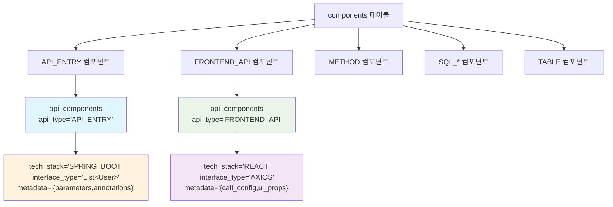
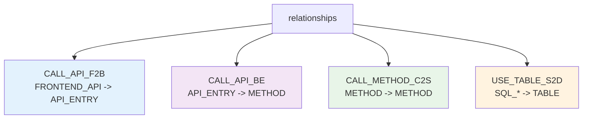
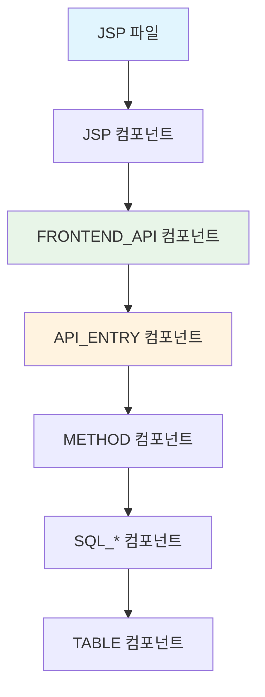
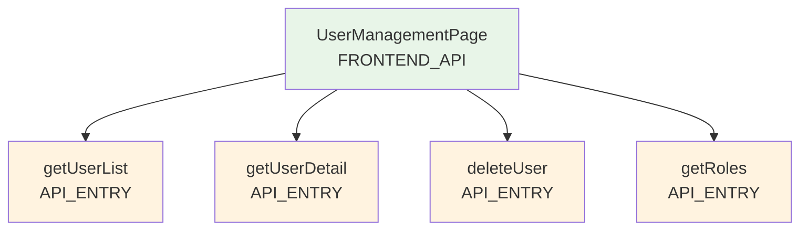
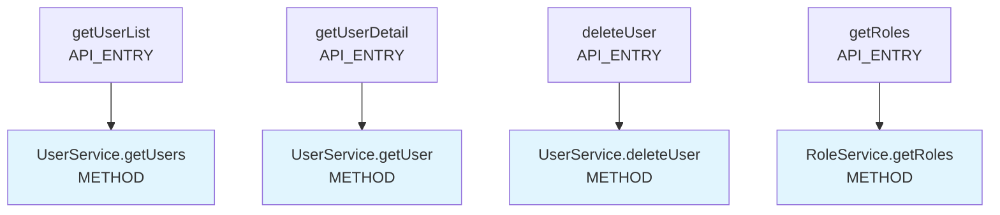

# SourceAnalyzer 메타데이터베이스 스키마 정의서

## 문서 목적

이 문서는 SourceAnalyzer 시스템의 **데이터베이스 스키마 구조와 설계 의도**를 상세히 설명합니다.  
**대상 독자**: 개발자, DBA, 시스템 아키텍트  
**참조 문서**: [요구사항정의서.md](./요구사항정의서.md), [처리플로우.md](./처리플로우.md)  
**기준 파일**: `database/create_table_script.sql`

## 개요

SourceAnalyzer 시스템의 메타데이터베이스 스키마 정의서입니다. 이 문서는 `database/create_table_script.sql`을 기준으로 작성되었으며, 프로젝트 분석 결과를 저장하는 데이터베이스 구조를 정의합니다.

## 시스템 폴더 구조

```
D:\Analyzer\CreateMetaDb\
├── config/                  # 설정 파일들
│   ├── config.yaml         # 시스템 설정
│   ├── logging.yaml        # 로깅 설정
│   ├── target_source_config.yaml  # 파일 필터링 설정
│   └── parser/             # 파서별 키워드 설정
│       ├── mybatis_dom_rules.yaml  # MyBatis DOM 파싱 규칙
│       ├── mybatis_keyword.yaml    # MyBatis 키워드 설정
│       └── method_xml_patterns.yaml # 메서드 XML 패턴 정의
├── database/               # DB 스키마
│   ├── create_table_script.sql  # 메타데이터베이스 스키마
│   └── create_sql_content_db.sql  # SQL Content DB 스키마
├── docs/                   # 문서들
│   ├── 요구사항정의서.md
│   ├── 메타데이터베이스스키마정의서.md
│   ├── 처리플로우_요약.md
│   ├── 처리플로우_상세_1단계.md
│   ├── 처리플로우_상세_2단계.md
│   ├── 처리플로우_상세_3단계.md
│   └── report/             # 진척보고서
├── parser/                 # 파서 소스 코드
│   ├── xml_parser.py       # MyBatis XML 파서 ✅ **구현 완료**
│   ├── java_parser.py      # Java 파서 ✅ **구현 완료**
│   └── manual/             # 파서 개발 가이드
├── util/                   # 유틸리티 소스 코드
│   ├── global_project.py   # 글로벌 프로젝트 정보 관리 ✅ **구현 완료**
│   ├── sql_content_manager.py  # SQL Content DB 관리 ✅ **구현 완료** (보류 상태)
│   ├── sql_content_processor.py # SQL Content 처리 (현재 보류 상태)
│   ├── path_utils.py       # 경로 유틸리티 ✅ **구현 완료**
│   ├── database_utils.py   # 데이터베이스 유틸리티 ✅ **구현 완료**
│   └── logger.py           # 로깅 유틸리티 ✅ **구현 완료**
├── projects/               # 분석 대상 프로젝트들
│   └── sampleSrc/          # 샘플 프로젝트
│       ├── metadata.db     # 메타데이터베이스
│       ├── SqlContent.db   # SQL Content 데이터베이스 (현재 보류 상태)
│       ├── config/         # 프로젝트별 설정
│       └── db_schema/      # DB 스키마 CSV 파일들
├── logs/                   # 로그 파일들
├── temp/                   # 임시 파일들
├── qna/                    # 질의응답 문서들
├── main.py                 # 메인 실행 파일
├── file_loading.py         # 1-2단계 처리 (파일 스캔, DB 구조 저장)
└── xml_loading.py          # 3단계 처리 (XML 분석)
```

## 스키마 버전

- **버전**: v2.0 (최적화된 메타데이터 스키마)
- **기준 파일**: `database/create_table_script.sql`
- **시간대**: 한국 시간대(KST) 적용 (UTC+9)
- **동적 활용**: ./project 폴더의 파일들을 동적으로 활용하여 성능 최적화

# 

## 연결 관계 정리

- **components**: 관계의 대상이 되는 모든 객체 저장 (jsp, method, query, table, column)
- **relationships**: 모든 관계를 통합 관리 (컴포넌트 간, 컬럼 간, 테이블 간 관계)
- **classes**: 클래스 정보를 별도 테이블로 관리하여 정확한 관계 모델링 지원
- **parent_id**: components 테이블의 계층 구조 및 다양한 테이블과의 관계 표현

## ERD (Entity Relationship Diagram)

```mermaid
erDiagram
    projects {
        int project_id
        string project_name
        string project_path
        string hash_value
        string created_at
        string updated_at
        string del_yn
        int total_files
    }

    files {
        int file_id
        int project_id
        string file_path
        string file_name
        string file_type
        string has_error
        string error_message
        string hash_value
        string created_at
        string updated_at
        string del_yn
        int line_count
    }

    classes {
        int class_id
        int project_id
        int file_id
        string class_name
        int parent_class_id
        int line_start
        int line_end
        string has_error
        string error_message
        string hash_value
        string created_at
        string updated_at
        string del_yn
    }

    components {
        int component_id
        int project_id
        int file_id
        string component_name
        string component_type
        int parent_id
        string layer
        int line_start
        int line_end
        string has_error
        string error_message
        string hash_value
        string created_at
        string updated_at
        string del_yn
    }

    tables {
        int table_id
        int project_id
        int component_id
        string table_name
        string table_owner
        string table_comments
        string has_error
        string error_message
        string hash_value
        string created_at
        string updated_at
        string del_yn
    }

    columns {
        int column_id
        int table_id
        int component_id
        string column_name
        string data_type
        int data_length
        string nullable
        string column_comments
        int position_pk
        string data_default
        string owner
        string has_error
        string error_message
        string hash_value
        string created_at
        string updated_at
        string del_yn
    }

    relationships {
        int relationship_id
        int src_id
        int dst_id
        string rel_type
        float confidence
        string has_error
        string error_message
        string hash_value
        string created_at
        string updated_at
        string del_yn
    }

    api_components {
        int api_component_id
        int project_id
        int component_id
        string api_type
        string name
        string method_name
        string url_pattern
        string http_method
        string tech_stack
        string interface_type
        string metadata
        string file_path
        int line_start
        int line_end
        string has_error
        string error_message
        string hash_value
        string created_at
        string updated_at
        string del_yn
    }

    projects ||--o{ files : "has"
    projects ||--o{ classes : "contains"
    projects ||--o{ components : "contains"
    projects ||--o{ tables : "defines"
    projects ||--o{ api_components : "contains"
    files ||--o{ classes : "contains"
    files ||--o{ components : "contains"
    classes ||--o{ classes : "parent_class_id"
    classes ||--o{ components : "parent_id"
    components ||--o{ tables : "defines"
    components ||--o{ relationships : "src_id"
    components ||--o{ relationships : "dst_id"
    components ||--o{ api_components : "api_component_detail"
    tables ||--o{ columns : "has"
    columns ||--o{ components : "component_id"
```



### API 컴포넌트 통합 ERD 상세

#### **1. Components 테이블 구조**


#### **2. Relationships 테이블 구조**


## 테이블 상세 정의

**총 테이블 수**: 8개 (projects, files, classes, components, tables, columns, relationships, api_components)

### 1. projects (프로젝트 메타데이터)

프로젝트의 기본 정보를 저장하는 테이블입니다.

| 컬럼명          | 데이터타입        | 제약조건                                  | 설명          |
| ------------ | ------------ | ------------------------------------- | ----------- |
| project_id   | INTEGER      | PRIMARY KEY, AUTOINCREMENT            | 프로젝트 고유 ID  |
| project_name | VARCHAR(100) | NOT NULL                              | 프로젝트명       |
| project_path | VARCHAR(500) | NOT NULL                              | 프로젝트 경로     |
| hash_value   | VARCHAR(64)  |                                       | 변경 감지용 해시값  |
| created_at   | DATETIME     | DEFAULT (datetime('now', '+9 hours')) | 생성일시        |
| updated_at   | DATETIME     | DEFAULT (datetime('now', '+9 hours')) | 수정일시        |
| del_yn       | CHAR(1)      | DEFAULT 'N'                           | 삭제 여부 (Y/N) |
| total_files  | INTEGER      | DEFAULT 0                             | 전체 파일 수     |

### 2. files (파일 인덱스)

분석 대상 파일들의 최소 정보를 저장하는 테이블입니다.

| 컬럼명           | 데이터타입        | 제약조건                                  | 설명                          |
| ------------- | ------------ | ------------------------------------- | --------------------------- |
| file_id       | INTEGER      | PRIMARY KEY, AUTOINCREMENT            | 파일 고유 ID                    |
| project_id    | INTEGER      | NOT NULL, FK                          | 프로젝트 ID                     |
| file_path     | VARCHAR(500) | NOT NULL                              | 상대경로                        |
| file_name     | VARCHAR(200) | NOT NULL                              | 파일명                         |
| file_type     | VARCHAR(20)  |                                       | 파일 타입 (java, jsp, sql, xml) |
| has_error     | CHAR(1)      | DEFAULT 'N'                           | 오류 여부 (Y/N)                 |
| error_message | TEXT         |                                       | 오류 메시지                      |
| hash_value    | VARCHAR(64)  | NOT NULL                              | 변경 감지용 해시값                  |
| created_at    | DATETIME     | DEFAULT (datetime('now', '+9 hours')) | 생성일시                        |
| updated_at    | DATETIME     | DEFAULT (datetime('now', '+9 hours')) | 수정일시                        |
| del_yn        | CHAR(1)      | DEFAULT 'N'                           | 삭제 여부 (Y/N)                 |
| line_count    | INTEGER      |                                       | 라인 수                        |

**외래키 관계:**

- `project_id` → `projects.project_id`

### 3. classes (클래스 정보)

클래스의 기본 정보를 저장하는 테이블입니다.

| 컬럼명             | 데이터타입        | 제약조건                                  | 설명              |
| --------------- | ------------ | ------------------------------------- | --------------- |
| class_id        | INTEGER      | PRIMARY KEY, AUTOINCREMENT            | 클래스 고유 ID       |
| project_id      | INTEGER      | NOT NULL, FK                          | 프로젝트 ID         |
| file_id         | INTEGER      | NOT NULL, FK                          | 파일 ID           |
| class_name      | VARCHAR(200) | NOT NULL                              | 클래스명            |
| parent_class_id | INTEGER      | FK                                    | 상속/구현 부모 클래스 ID |
| line_start      | INTEGER      |                                       | 시작 라인           |
| line_end        | INTEGER      |                                       | 종료 라인           |
| has_error       | CHAR(1)      | DEFAULT 'N'                           | 오류 여부 (Y/N)     |
| error_message   | TEXT         |                                       | 오류 메시지          |
| hash_value      | VARCHAR(64)  |                                       | 변경 감지용 해시값      |
| created_at      | DATETIME     | DEFAULT (datetime('now', '+9 hours')) | 생성일시            |
| updated_at      | DATETIME     | DEFAULT (datetime('now', '+9 hours')) | 수정일시            |
| del_yn          | CHAR(1)      | DEFAULT 'N'                           | 삭제 여부 (Y/N)     |

**외래키 관계:**

- `project_id` → `projects.project_id`
- `file_id` → `files.file_id`
- `parent_class_id` → `classes.class_id` (상속/구현 부모 클래스 참조)

**인덱스:**

- `ix_classes_01`: (class_name, file_id, project_id) - UNIQUE
- `ix_classes_02`: (parent_class_id) - 일반 인덱스

### 4. components (코드 구성 요소)

클래스, 메서드 등의 기본 정보를 저장하는 허브 테이블입니다.

| 컬럼명            | 데이터타입        | 제약조건                                  | 설명                                                                                              |
| -------------- | ------------ | ------------------------------------- | ----------------------------------------------------------------------------------------------- |
| component_id   | INTEGER      | PRIMARY KEY, AUTOINCREMENT            | 구성요소 고유 ID                                                                                      |
| project_id     | INTEGER      | NOT NULL, FK                          | 프로젝트 ID                                                                                         |
| file_id        | INTEGER      | NOT NULL, FK                          | 파일 ID                                                                                           |
| component_name | VARCHAR(200) | NOT NULL                              | 구성요소명                                                                                           |
| component_type | VARCHAR(20)  | NOT NULL                              | 구성요소 타입 (JSP, METHOD, SQL_SELECT, SQL_INSERT, SQL_UPDATE, SQL_DELETE, SQL_MERGE, TABLE, COLUMN, API_ENTRY, FRONTEND_API) |
| parent_id      | INTEGER      |                                       | 부모 컴포넌트 ID (COLUMN일때는 TABLE의 component_id, METHOD일때는 classes의 class_id)                                                                              |
| layer          | VARCHAR(30)  |                                       | 계층 (controller, service, mapper, model, dao, view, jsp, xml, db)                                |
| line_start     | INTEGER      |                                       | 시작 라인                                                                                           |
| line_end       | INTEGER      |                                       | 종료 라인                                                                                           |
| has_error      | CHAR(1)      | DEFAULT 'N'                           | 오류 여부 (Y/N)                                                                                     |
| error_message  | TEXT         |                                       | 오류 메시지                                                                                          |
| hash_value     | VARCHAR(64)  |                                       | 변경 감지용 해시값                                                                                      |
| created_at     | DATETIME     | DEFAULT (datetime('now', '+9 hours')) | 생성일시                                                                                            |
| updated_at     | DATETIME     | DEFAULT (datetime('now', '+9 hours')) | 수정일시                                                                                            |
| del_yn         | CHAR(1)      | DEFAULT 'N'                           | 삭제 여부 (Y/N)                                                                                     |

**외래키 관계:**

- `project_id` → `projects.project_id`
- `file_id` → `files.file_id`

**인덱스:**

- `ix_components_01`: (component_name, file_id, project_id) - UNIQUE

### 4. tables (데이터베이스 테이블 정보)

데이터베이스 테이블 정보를 저장하는 테이블입니다.

| 컬럼명            | 데이터타입        | 제약조건                                  | 설명          |
| -------------- | ------------ | ------------------------------------- | ----------- |
| table_id       | INTEGER      | PRIMARY KEY, AUTOINCREMENT            | 테이블 고유 ID   |
| project_id     | INTEGER      | NOT NULL, FK                          | 프로젝트 ID     |
| component_id   | INTEGER      | FK                                    | 구성요소 ID     |
| table_name     | VARCHAR(100) | NOT NULL                              | 테이블명        |
| table_owner    | VARCHAR(50)  | NOT NULL                              | 테이블 소유자     |
| table_comments | TEXT         |                                       | 테이블 코멘트     |
| has_error      | CHAR(1)      | DEFAULT 'N'                           | 오류 여부 (Y/N) |
| error_message  | TEXT         |                                       | 오류 메시지      |
| hash_value     | VARCHAR(64)  |                                       | 변경 감지용 해시값  |
| created_at     | DATETIME     | DEFAULT (datetime('now', '+9 hours')) | 생성일시        |
| updated_at     | DATETIME     | DEFAULT (datetime('now', '+9 hours')) | 수정일시        |
| del_yn         | CHAR(1)      | DEFAULT 'N'                           | 삭제 여부 (Y/N) |

**외래키 관계:**

- `project_id` → `projects.project_id`
- `component_id` → `components.component_id`

**인덱스:**

- `ix_tables_01`: (table_name, table_owner, project_id) - UNIQUE

### 5. columns (데이터베이스 컬럼 정보)

데이터베이스 컬럼 정보를 저장하는 테이블입니다.

| 컬럼명             | 데이터타입        | 제약조건                                  | 설명                   |
| --------------- | ------------ | ------------------------------------- | -------------------- |
| column_id       | INTEGER      | PRIMARY KEY, AUTOINCREMENT            | 컬럼 고유 ID             |
| table_id        | INTEGER      | NOT NULL, FK                          | 테이블 ID               |
| component_id    | INTEGER      | FK                                    | 컴포넌트 ID (COLUMN 타입) |
| column_name     | VARCHAR(100) | NOT NULL                              | 컬럼명                  |
| data_type       | VARCHAR(50)  |                                       | 데이터 타입               |
| data_length     | INTEGER      |                                       | 데이터 길이               |
| nullable        | CHAR(1)      | DEFAULT 'Y'                           | NULL 허용 여부           |
| column_comments | TEXT         |                                       | 컬럼 코멘트               |
| position_pk     | INTEGER      |                                       | PK 순번 (null이면 PK 아님) |
| data_default    | TEXT         |                                       | 기본값                  |
| owner           | VARCHAR(50)  |                                       | 소유자                  |
| has_error       | CHAR(1)      | DEFAULT 'N'                           | 오류 여부 (Y/N)          |
| error_message   | TEXT         |                                       | 오류 메시지               |
| hash_value      | VARCHAR(64)  |                                       | 변경 감지용 해시값           |
| created_at      | DATETIME     | DEFAULT (datetime('now', '+9 hours')) | 생성일시                 |
| updated_at      | DATETIME     | DEFAULT (datetime('now', '+9 hours')) | 수정일시                 |
| del_yn          | CHAR(1)      | DEFAULT 'N'                           | 삭제 여부 (Y/N)          |

**외래키 관계:**

- `table_id` → `tables.table_id`
- `component_id` → `components.component_id`

**인덱스:**

- `ix_columns_01`: (table_id, column_name) - UNIQUE

### 6. relationships (통합 관계 정보)

모든 관계를 통합 관리하는 테이블입니다.

| 컬럼명             | 데이터타입       | 제약조건                                  | 설명                                                                                            |
| --------------- | ----------- | ------------------------------------- | --------------------------------------------------------------------------------------------- |
| relationship_id | INTEGER     | PRIMARY KEY, AUTOINCREMENT            | 관계 고유 ID                                                                                      |
| src_id          | INTEGER     | NOT NULL, FK                          | 소스 ID (component_id, table_id, column_id 등)                                                   |
| dst_id          | INTEGER     | NOT NULL, FK                          | 대상 ID (component_id, table_id, column_id 등)                                                   |
| rel_type        | VARCHAR(30) | NOT NULL                              | 관계 타입 (CALL_API_F2B, CALL_API_BE, CALL_METHOD_C2S, CALL_METHOD_S2D, CALL_QUERY_M2S, CALL_QUERY_D2S, USE_TABLE_Q2D, USE_TABLE_S2D, FK, PK, JOIN_EXPLICIT, JOIN_IMPLICIT, QUERY_TABLE) |
| confidence      | FLOAT       | DEFAULT 1.0                           | 신뢰도                                                                                           |
| has_error       | CHAR(1)     | DEFAULT 'N'                           | 오류 여부 (Y/N)                                                                                   |
| error_message   | TEXT        |                                       | 오류 메시지                                                                                        |
| created_at      | DATETIME    | DEFAULT (datetime('now', '+9 hours')) | 생성일시                                                                                          |
| updated_at      | DATETIME    | DEFAULT (datetime('now', '+9 hours')) | 수정일시                                                                                          |
| del_yn          | CHAR(1)     | DEFAULT 'N'                           | 삭제 여부 (Y/N)                                                                                   |

**외래키 관계:**

- `src_id` → `components.component_id` (모든 관계의 소스)
- `dst_id` → `components.component_id` (모든 관계의 대상)

**제약조건:**

- `CHECK (src_id != dst_id)`: 자기 자신과의 관계 방지

**인덱스:**

- `ix_relationships_01`: (src_id, dst_id, rel_type) - UNIQUE

### 7. api_components (API 컴포넌트 상세 정보)

API_ENTRY와 FRONTEND_API를 통합한 상세 정보를 저장하는 테이블입니다.

| 컬럼명               | 데이터타입        | 제약조건                                  | 설명                          |
| ----------------- | ------------ | ------------------------------------- | --------------------------- |
| api_component_id  | INTEGER      | PRIMARY KEY, AUTOINCREMENT            | API 컴포넌트 고유 ID             |
| project_id        | INTEGER      | NOT NULL, FK                          | 프로젝트 ID                     |
| component_id      | INTEGER      | NOT NULL, FK                          | components 테이블의 컴포넌트 ID     |
| api_type          | VARCHAR(20)  | NOT NULL                              | API 타입 (API_ENTRY, FRONTEND_API) |
| name              | VARCHAR(200) | NOT NULL                              | 이름 (클래스명 또는 프론트엔드명)      |
| method_name       | VARCHAR(200) |                                       | 메서드명 (공통 사용)              |
| url_pattern       | VARCHAR(500) | NOT NULL                              | URL 패턴 (예: /api/users/{id})     |
| http_method       | VARCHAR(10)  | NOT NULL                              | HTTP 메서드 (GET, POST, PUT, DELETE 등) |
| tech_stack        | VARCHAR(50)  |                                       | 기술 스택 (framework_type + technology_type 통합) |
| interface_type    | VARCHAR(200) |                                       | 인터페이스 타입 (return_type + call_method 통합) |
| metadata          | TEXT         |                                       | 메타데이터 (parameters + annotations 통합, JSON) |
| file_path         | VARCHAR(500) |                                       | 파일 경로                       |
| line_start        | INTEGER      |                                       | 시작 라인                       |
| line_end          | INTEGER      |                                       | 종료 라인                       |
| has_error         | CHAR(1)      | DEFAULT 'N'                           | 오류 여부 (Y/N)                 |
| error_message     | TEXT         |                                       | 오류 메시지                      |
| hash_value        | VARCHAR(64)  | NOT NULL                              | 변경 감지용 해시값                  |
| created_at        | DATETIME     | DEFAULT (datetime('now', '+9 hours')) | 생성일시                        |
| updated_at        | DATETIME     | DEFAULT (datetime('now', '+9 hours')) | 수정일시                        |
| del_yn            | CHAR(1)      | DEFAULT 'N'                           | 삭제 여부 (Y/N)                 |

**외래키 관계:**

- `project_id` → `projects.project_id`
- `component_id` → `components.component_id`

**인덱스:**

- `ix_api_components_01`: (name, method_name, project_id) - UNIQUE
- `ix_api_components_02`: (component_id) - 일반 인덱스
- `ix_api_components_03`: (api_type) - 일반 인덱스
- `ix_api_components_04`: (url_pattern) - 일반 인덱스
- `ix_api_components_05`: (http_method) - 일반 인덱스
- `ix_api_components_06`: (tech_stack) - 일반 인덱스

**데이터 예시:**

```sql
-- API_ENTRY 데이터
INSERT INTO api_components VALUES (
    101, 1, 1001, 'API_ENTRY', 'UserController', 'getUserList',
    '/api/users/list', 'GET', 'SPRING_BOOT', 'List<User>',
    '{"parameters": [{"name": "id", "type": "Long"}], "annotations": ["@GetMapping", "@RequestMapping"], "framework_config": {"version": "2.7.0"}}',
    '/src/main/java/controller/UserController.java', 25, 35,
    'N', NULL, 'hash_api123', '2024-01-01', '2024-01-01', 'N'
);

-- FRONTEND_API 데이터
INSERT INTO api_components VALUES (
    102, 1, 1002, 'FRONTEND_API', 'UserManagementPage', 'fetchUsers',
    '/api/users/list', 'GET', 'REACT', 'AXIOS',
    '{"call_config": {"timeout": 5000, "retry": 3}, "ui_props": {"loading": true, "error_handling": "toast"}}',
    NULL, NULL, NULL,
    'N', NULL, 'hash_frontend123', '2024-01-01', '2024-01-01', 'N'
);
```

## 관계 구조 설명

### 컴포넌트 중심 모델

이 스키마는 **components 테이블을 중심으로 한 관계 모델**을 채택하고 있습니다:

- **components**: 관계의 대상이 되는 모든 객체 저장 (jsp, method, query, table, column)
- **relationships**: 모든 관계를 통합 관리 (컴포넌트 간, 컬럼 간, 테이블 간 관계)
- **tables**: component_id를 통해 components와 연결

### 관계 모델 다이어그램

다음은 사용자가 제시한 관계 모델을 시각화한 다이어그램입니다:

```
                  [fp]package
                  |
                  [fl]java
                  |
                  [cl]class
                  [cl]class                [f]xml
                  |                        |
  [cp]frontend_api===[cp]api_entry===[cp]method===[cp]query===[cp]table=============
            [cp]method               [cp]table            ||
                  ||                                      ||
                  [cp]query===[cp]table=============[cp]column
                              [cp]table             [cp]column
```

**관계 타입 설명:

* **범례**: [cp]=component, [cl]=class, [fl]=file, [fp]=files.file_path
- **싱글라인 (`|`)**: contain 관계 (포함 관계)
  - `package` contains `java`
  - `java` contains `class`
  - `class` contains `method`
  - `xml` contains `query`
  - `method` contains `query`
- **더블라인 (`===`)**: call/use/associate 관계 (호출/사용 관계)
  - `frontend_api` → `api_entry` (CALL_API_F2B)
  - `api_entry` → `method` (CALL_API_BE)
  - `method` → `method` (CALL_METHOD_C2S, CALL_METHOD_S2D)
  - `method` → `query` (CALL_QUERY_M2S, CALL_QUERY_D2S)
  - `query` → `table` (USE_TABLE_Q2D, USE_TABLE_S2D)
- **상하 붙어 있는 경우**: 같은 종류간의 관계
  - `method` calls another `method`
  - `table` joins another `table`
  - `class` inherits/implements another `class`

### 연결 관계 정리

#### 1. Components 테이블 역할

- **저장 대상**: 관계의 대상이 되는 모든 객체
  - jsp, method, query, table, column, api_entry, frontend_api
- **설계 원칙**: relationships 테이블에서 관계를 정의할 수 있는 모든 객체

#### 2. Files 테이블 역할

* java, xml, csv 파일을 등록.

* files.file_path에 패키지 경로가 저장됨

### 3. Relationships 테이블 역할

- **관계 대상**: 모든 관계를 통합 관리 (컴포넌트 간, 컬럼 간, 테이블 간 관계)
- **src_id, dst_id**: 모두 components.component_id를 참조
- **조인 관계**: 컬럼 간 조인 관계도 relationships에서 관리

### 관계 타입 (rel_type)

relationships 테이블의 rel_type 컬럼에서 사용 가능한 값들:

#### API 관계

- **CALL_API_F2B (FRONTEND_TO_BACKEND)**: 프론트엔드에서 백엔드 API로의 호출
  - 사용: src_id = FRONTEND_API 컴포넌트, dst_id = API_ENTRY 컴포넌트
  - 예시: React 컴포넌트에서 Spring Boot API 호출

- **CALL_API_BE (BACKEND_ENTRY)**: 백엔드 API 진입점에서 컨트롤러 메서드로의 호출
  - 사용: src_id = API_ENTRY 컴포넌트, dst_id = METHOD 컴포넌트
  - 예시: API 진입점에서 실제 컨트롤러 메서드 호출

#### Java 관계

- **CALL_METHOD_C2S (CONTROLLER_TO_SERVICE)**: 컨트롤러에서 서비스로의 호출
  - 사용: src_id = METHOD(controller), dst_id = METHOD(service)

- **CALL_METHOD_S2D (SERVICE_TO_DAO)**: 서비스에서 DAO로의 호출
  - 사용: src_id = METHOD(service), dst_id = METHOD(dao)

- **CALL_QUERY_M2S (METHOD_TO_SQL)**: 메서드에서 SQL 쿼리로의 호출
  - 사용: src_id = METHOD, dst_id = SQL_SELECT/SQL_INSERT 등

- **CALL_QUERY_D2S (DAO_TO_SQL)**: DAO에서 SQL로의 호출
  - 사용: src_id = METHOD(dao), dst_id = SQL_SELECT/SQL_INSERT 등

#### 데이터베이스 관계

- **USE_TABLE_Q2D (QUERY_TO_DB)**: 쿼리에서 데이터베이스 테이블 사용
  - 사용: src_id = SQL_*, dst_id = TABLE

- **USE_TABLE_S2D (SQL_TO_DB)**: SQL에서 테이블로의 사용
  - 사용: src_id = SQL_*, dst_id = TABLE

- **FK**: 외래키 관계
- **PK**: 기본키 관계
- **JOIN_EXPLICIT**: 명시적 조인 관계
- **JOIN_IMPLICIT**: 암시적 조인 관계
- **QUERY_TABLE**: 쿼리-테이블 관계 (기존 호환성 유지)

## 성능 최적화 특징

1. **변경 감지**: 모든 테이블에 hash_value 컬럼으로 변경 감지
2. **소프트 삭제**: del_yn 컬럼으로 논리적 삭제 지원
3. **오류 추적**: has_error, error_message로 오류 상태 관리
4. **인덱스 최적화**: 자주 조회되는 컬럼 조합에 인덱스 생성
5. **중복 방지**: UNIQUE 인덱스로 데이터 무결성 보장

## 사용 가이드

### 데이터 삽입 순서

1. projects → files → components
2. tables (components 기반)
3. columns (tables 기반)
4. relationships (components 기반)

### 조회 패턴

- **프로젝트별 분석**: projects → files → components
- **파일별 분석**: files → components
- **테이블별 분석**: tables → columns
- **컴포넌트 관계 분석**: relationships (src_id, dst_id 모두 components.component_id 참조)
- **컬럼 관계 분석**: relationships에서 컬럼 간 조인 관계 직접 관리

## 구현된 관계 모델

### 사용자 요구사항 반영

이 스키마는 사용자가 제시한 관계 모델을 완전히 반영하고 있습니다:

#### 1. 싱글라인 (contain) 관계

- **[F] package contains java**: file_path를 package로 활용
- **[F] java contains class**: Java 파일이 클래스를 포함
- **[C] class contains method**: 클래스가 메서드를 포함 (parent_class_id 활용)
- **[F] xml contains query**: XML 파일이 쿼리를 포함
- **[R] method contains query**: 메서드가 쿼리를 포함

#### 2. 더블라인 (call, use) 관계

- **[R] frontend_api calls api_entry**: 가상 프론트엔드가 API 진입점을 호출 (CALL_API_F2B)
- **[R] api_entry calls method**: API 진입점이 메서드를 호출 (CALL_API_BE)
- **[R] method calls method**: 메서드가 메서드를 호출 (CALL_METHOD_C2S, CALL_METHOD_S2D)
- **[R] method calls query**: 메서드가 쿼리를 호출 (CALL_QUERY_M2S, CALL_QUERY_D2S)
- **[R] query uses table**: 쿼리가 테이블을 사용 (USE_TABLE_Q2D, USE_TABLE_S2D)

#### 3. 상하 붙어 있는 경우 (같은 종류간의 관계)

- **[R] method calls another method**: 메서드 간 호출
- **[R] table joins another table**: 테이블 간 조인
- **[R] class inherits another class**: 클래스 간 상속
- **[R] class implements another class**: 클래스 간 구현

### 관계 구현 현황

현재 구현된 관계 수: **2,037개** (API_ENTRY 관련 관계 추가 예정)

- 싱글라인 (contain): 0개 (현재 데이터 부족)
- 더블라인 (call, use): 825개
- 상하 붙어 있는 경우: 1,212개
- API 호출 관계: 0개 (5단계 API 진입점 분석 후 추가 예정)

### 새로운 API 컴포넌트 통합 설계

**api_components 테이블의 특징:**

1. **통합 설계**: API_ENTRY와 FRONTEND_API를 하나의 테이블로 통합
2. **필드 통합**: 
   - `tech_stack`: framework_type + technology_type 통합
   - `interface_type`: return_type + call_method 통합  
   - `metadata`: parameters + annotations 통합 (JSON)
3. **유연성**: JSON metadata로 향후 확장 가능
4. **일관성**: 기존 components + relationships 패턴과 동일한 구조

### JSP → API 관계 분석 설계

**JSP에서 API 호출 패턴 분석:**

#### **1. JSP → API 관계 구조**


#### **2. JSP API 호출 패턴**
- **JavaScript AJAX 호출**: `$.ajax()`, `fetch()`, `axios` 등
- **직접 호출 관계**: JSP → FRONTEND_API (CALL_API_J2F)
- **간접 호출 관계**: JSP → FRONTEND_API → API_ENTRY (CALL_API_J2F + CALL_API_F2B)

#### **3. 관계 타입 확장**
```sql
-- JSP 관련 API 호출 관계들
CALL_API_J2F    -- JSP → FRONTEND_API
CALL_API_F2B    -- FRONTEND_API → API_ENTRY  
CALL_API_BE     -- API_ENTRY → METHOD
```

#### **4. 완전한 호출 체인**
```
JSP 파일 → JSP 컴포넌트 → FRONTEND_API 컴포넌트 → API_ENTRY 컴포넌트 → METHOD 컴포넌트 → SQL_* 컴포넌트 → TABLE 컴포넌트
```

#### **5. JSP 분석 로직**
```python
def analyze_jsp_api_calls(self, jsp_content: str) -> List[APICall]:
    """JSP에서 API 호출 분석"""
    # JavaScript AJAX 호출 패턴 분석
    ajax_patterns = [
        r'\.ajax\s*\(\s*\{[^}]*url\s*:\s*[\'"]([^\'"]+)[\'"]',
        r'fetch\s*\(\s*[\'"]([^\'"]+)[\'"]',
        r'axios\.[get|post|put|delete]+\s*\(\s*[\'"]([^\'"]+)[\'"]'
    ]
    # 패턴 매칭으로 API 호출 추출
```

#### **6. 관계 생성 로직**
1. **JSP 컴포넌트** → **FRONTEND_API 컴포넌트** (CALL_API_J2F)
2. **FRONTEND_API 컴포넌트** → **API_ENTRY 컴포넌트** (CALL_API_F2B)
3. **API_ENTRY 컴포넌트** → **METHOD 컴포넌트** (CALL_API_BE)

### FRONTEND_API → API_ENTRY 1:N 관계 설계

**하나의 FRONTEND_API가 여러 API_ENTRY를 호출하는 1:N 관계:**

#### **1. 1:N 관계의 의미**
- **하나의 FRONTEND_API**: 하나의 프론트엔드 페이지/컴포넌트
- **여러 API_ENTRY**: 해당 페이지에서 호출하는 여러 백엔드 API

#### **2. 실제 사용 예시**
```javascript
// 하나의 React 컴포넌트 (FRONTEND_API)
const UserManagementPage = () => {
    // 여러 API 호출
    const fetchUsers = () => fetch('/api/users/list');
    const fetchUserDetail = (id) => fetch(`/api/users/detail/${id}`);
    const deleteUser = (id) => fetch(`/api/users/delete/${id}`, {method: 'DELETE'});
    
    return &lt;div&gt;{/* 하나의 페이지에서 여러 API 사용 */}&lt;/div&gt;;
};
```

#### **3. 데이터베이스 관계 구조**
```sql
-- 하나의 FRONTEND_API 컴포넌트
INSERT INTO components VALUES (
    1001, 1, NULL, 'UserManagementPage', 'FRONTEND_API', 
    NULL, 'FRONTEND', NULL, NULL, 'N', NULL, 'hash123', '2024-01-01', '2024-01-01', 'N'
);

-- 여러 개의 API_ENTRY 컴포넌트들
INSERT INTO components VALUES 
(1002, 1, 201, 'UserController', 'API_ENTRY', NULL, 'CONTROLLER', 25, 35, 'N', NULL, 'hash456', '2024-01-01', '2024-01-01', 'N'),
(1003, 1, 202, 'UserController', 'API_ENTRY', NULL, 'CONTROLLER', 40, 50, 'N', NULL, 'hash789', '2024-01-01', '2024-01-01', 'N'),
(1004, 1, 203, 'UserController', 'API_ENTRY', NULL, 'CONTROLLER', 55, 65, 'N', NULL, 'hash101', '2024-01-01', '2024-01-01', 'N');

-- 1:N 관계 테이블
INSERT INTO relationships VALUES 
(1001, 1002, 'CALL_API_F2B', 0.95, 'N', NULL, 'hash_rel1', '2024-01-01', '2024-01-01', 'N'),  -- UserManagementPage → getUserList
(1001, 1003, 'CALL_API_F2B', 0.95, 'N', NULL, 'hash_rel2', '2024-01-01', '2024-01-01', 'N'),  -- UserManagementPage → getUserDetail  
(1001, 1004, 'CALL_API_F2B', 0.95, 'N', NULL, 'hash_rel3', '2024-01-01', '2024-01-01', 'N');  -- UserManagementPage → deleteUser
```

#### **4. JSP 페이지 예시**
```jsp
<!-- 하나의 JSP 페이지 (FRONTEND_API) -->
<script>
// 여러 API 호출
$.ajax({url: '/api/users/list', method: 'GET'});
$.ajax({url: '/api/users/detail', method: 'GET'});
$.ajax({url: '/api/users/delete', method: 'DELETE'});
</script>
```

#### **5. 관계 구조 다이어그램**

**5-1. 1:N 관계 구조 (FRONTEND_API → API_ENTRY)**


**5-2. API_ENTRY → METHOD 호출 체인**


#### **6. 1:N 관계의 장점**
- **실제 웹 애플리케이션 구조 반영**: 하나의 페이지가 여러 API를 호출하는 일반적인 패턴
- **유연한 확장성**: 새로운 API 추가 시 기존 FRONTEND_API와 쉽게 연결
- **명확한 호출 체인**: 프론트엔드에서 백엔드까지의 완전한 호출 경로 추적
- **성능 분석**: 하나의 페이지에서 호출하는 모든 API 성능 분석 가능

이 스키마는 SourceAnalyzer 시스템의 핵심 데이터 구조를 정의하며, 프로젝트 분석 결과를 효율적으로 저장하고 조회할 수 있도록 설계되었습니다.

## SQL Content 데이터베이스

### 개요

정제된 SQL 내용을 gzip 압축하여 저장하는 전용 데이터베이스입니다. 3단계 XML 파싱 과정에서 추출된 정제된 SQL 내용을 압축하여 저장하며, 2차 개발 리포트에서 활용됩니다.

### 데이터베이스 구조

**데이터베이스 경로**: `./projects/{project_name}/SqlContent.db`

**생성 스크립트**: `database/create_sql_content_db.sql`

### sql_contents 테이블

정제된 SQL 내용을 저장하는 핵심 테이블입니다.

#### 테이블 구조

| 컬럼명 | 타입 | 제약조건 | 설명 |
|--------|------|----------|------|
| content_id | INTEGER | PRIMARY KEY AUTOINCREMENT | SQL 내용 고유 ID |
| project_id | INTEGER | NOT NULL | 프로젝트 ID (Foreign Key) |
| file_id | INTEGER | | XML 파일 ID (Foreign Key) |
| component_id | INTEGER | | 컴포넌트 ID (Foreign Key) |
| component_name | VARCHAR(200) | | 컴포넌트명 |
| sql_content_compressed | BLOB | NOT NULL | gzip 압축된 정제된 SQL 내용 |
| query_type | VARCHAR(20) | NOT NULL | 쿼리 타입 (SQL_SELECT, SQL_INSERT, SQL_UPDATE, SQL_DELETE, SQL_MERGE) |
| file_path | VARCHAR(500) | | 파일 경로 |
| file_name | VARCHAR(200) | | 파일명 |
| line_start | INTEGER | | 시작 라인 |
| line_end | INTEGER | | 종료 라인 |
| hash_value | VARCHAR(64) | | SQL 내용 해시값 |
| error_message | TEXT | | 오류 메시지 |
| created_at | DATETIME | DEFAULT CURRENT_TIMESTAMP | 생성일시 |
| updated_at | DATETIME | DEFAULT CURRENT_TIMESTAMP | 수정일시 |
| del_yn | CHAR(1) | DEFAULT 'N' | 삭제 여부 |

#### 인덱스

- `ix_sql_contents_01`: (project_id, created_at) - 프로젝트별 시간순 조회
- `ix_sql_contents_02`: (query_type, created_at) - 쿼리 타입별 시간순 조회
- `ix_sql_contents_03`: (file_path, created_at) - 파일별 시간순 조회
- `ix_sql_contents_04`: (component_name, created_at) - 컴포넌트별 시간순 조회
- `ix_sql_contents_05`: (hash_value) - 해시값으로 중복 검사

### 특징

1. **압축 저장**: gzip 압축을 사용하여 저장 공간 최적화
2. **프로젝트별 독립**: 각 프로젝트마다 별도의 SqlContent.db 파일 생성
3. **메타데이터 연결**: components 테이블과 연결하여 상세 정보 제공
4. **2차 개발 활용**: 리포트 생성 시 정제된 SQL 내용 활용

### 활용 예시

```python
# SQL Content Manager 사용 예시
from util.sql_content_manager import SqlContentManager

# 초기화
sql_content_manager = SqlContentManager("sampleSrc")

# SQL 내용 저장
sql_content_manager.save_sql_content(
    sql_content="SELECT * FROM users WHERE id = ?",
    project_id=1,
    file_id=100,
    query_type="SQL_SELECT",
    file_path="/src/main/resources/mapper/UserMapper.xml",
    component_name="SQL_CONTENT_SELECT",
    file_name="UserMapper.xml",
    line_start=10,
    line_end=15,
    hash_value="a1b2c3d4e5f6..."
)

# 통계 조회
stats = sql_content_manager.get_stats(1)
print(f"저장된 SQL 내용: {stats['total_stats'][0]}개")
print(f"총 압축 크기: {stats['total_stats'][1]} bytes")

# 연결 해제
sql_content_manager.close()
```

---

## 📚 관련 문서

- **[요구사항정의서.md](./요구사항정의서.md)**: 비즈니스 요구사항 및 기능 명세
- **[처리플로우.md](./처리플로우.md)**: 실제 구현 과정 및 개발 가이드
- **[처리플로우_상세_3단계.md](./처리플로우_상세_3단계.md)**: 3단계 XML 파싱 상세 처리 과정
- **[create_table_script.sql](../database/create_table_script.sql)**: 메타데이터베이스 스키마 정의 원본 파일
- **[create_sql_content_db.sql](../database/create_sql_content_db.sql)**: SQL Content 데이터베이스 스키마 정의 파일