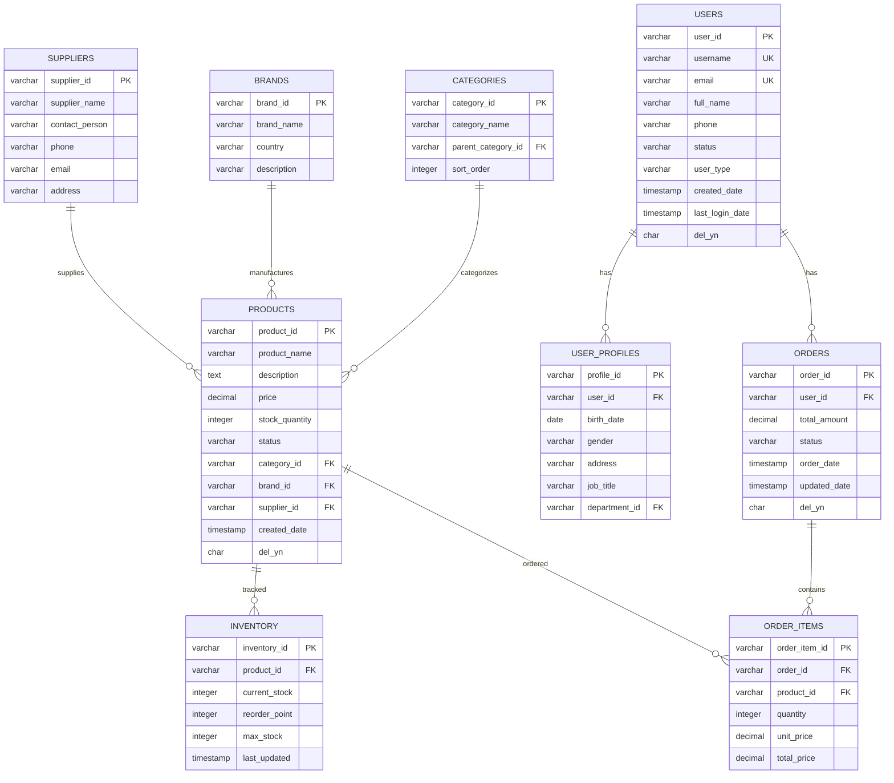
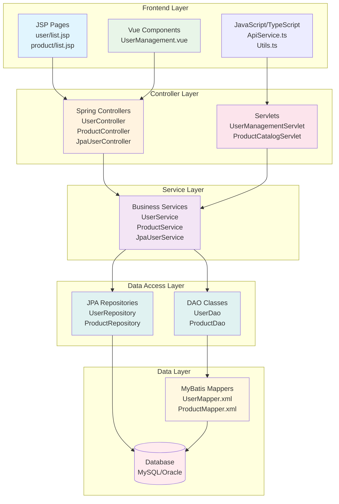
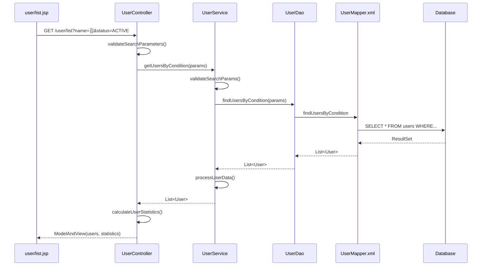
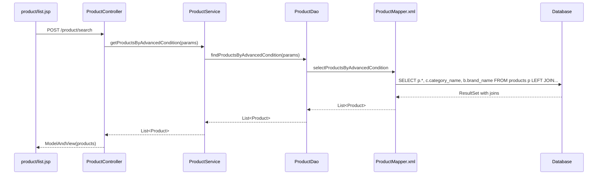
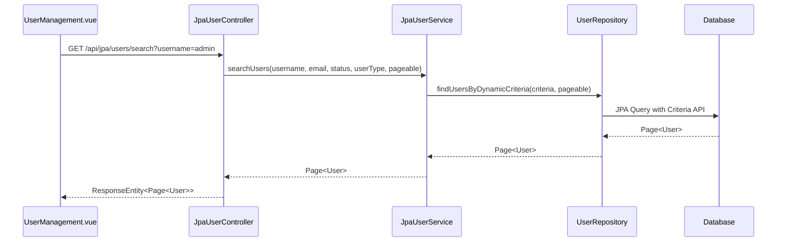
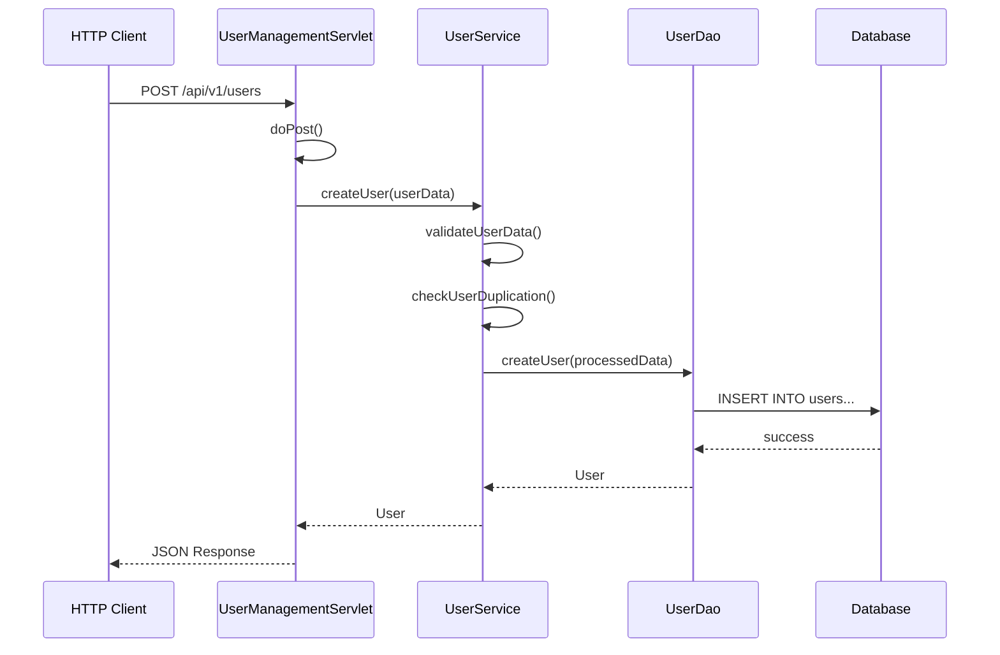
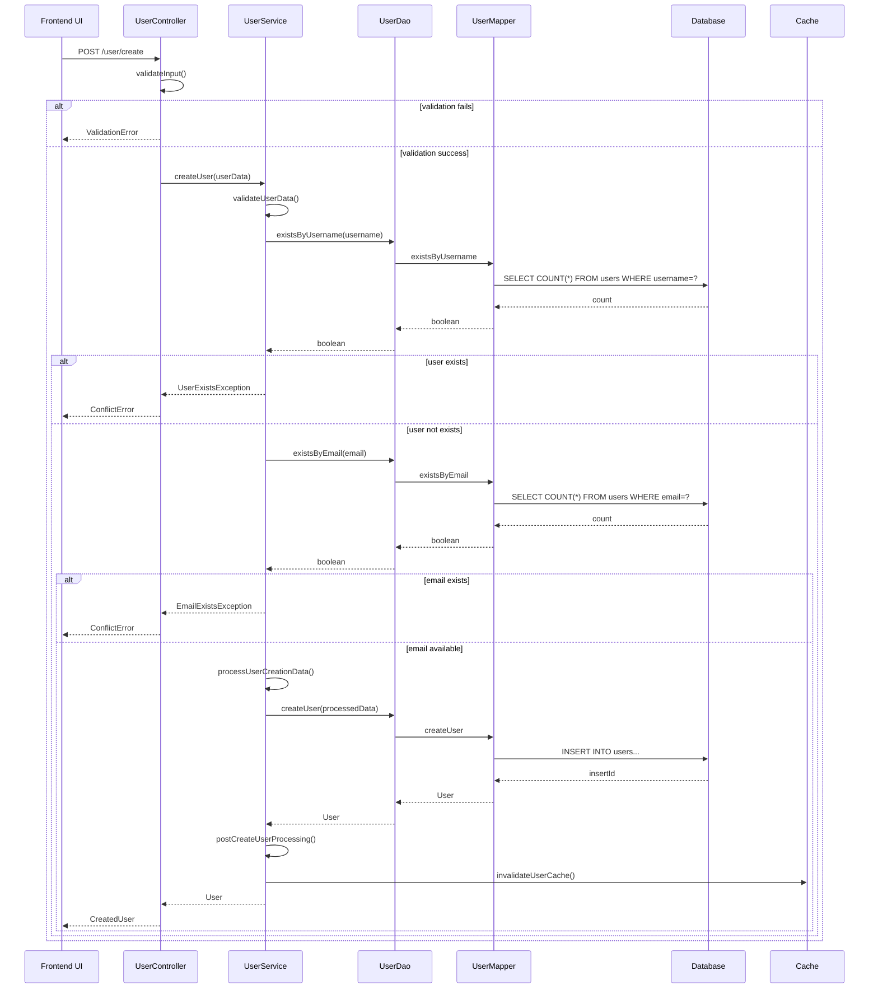
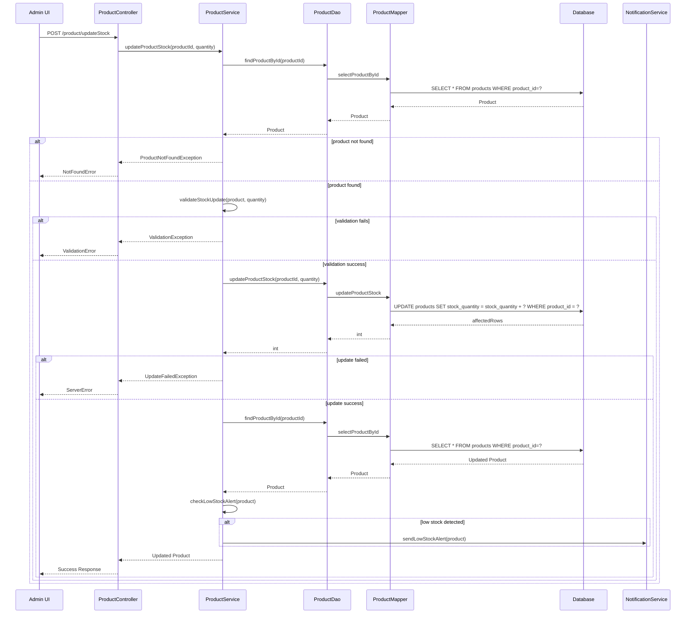
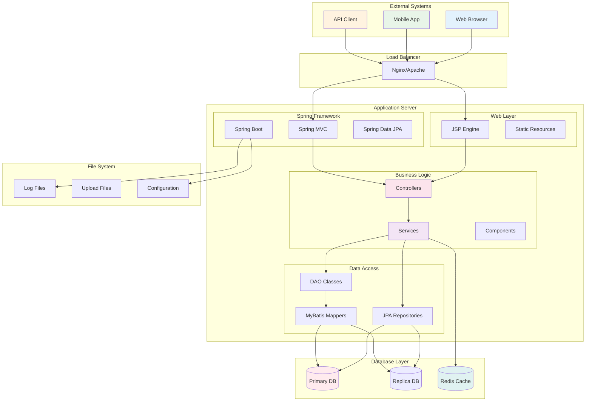

# 예상 리포트

SampleSrc 폴더의 파일들을 수작업으로 분석하여 create_report.py로 생성될 것으로 예상되는 리포트들입니다.

## 1. ERD (Entity Relationship Diagram) 리포트

### 예상 ERD 구조



### ERD 특징
- **총 9개 테이블**로 구성
- **사용자 중심 설계**: USERS를 중심으로 한 주문 관리 시스템
- **상품 관리**: 카테고리, 브랜드, 공급업체별 상품 분류
- **재고 관리**: 별도 INVENTORY 테이블로 재고 추적
- **확장성**: USER_PROFILES로 사용자 상세 정보 확장 가능

## 2. Architecture Layer Diagram 리포트

### 예상 아키텍처 레이어



### 아키텍처 특징
- **5계층 구조**: Frontend → Controller → Service → Data Access → Data
- **하이브리드 접근**: Spring MVC + Servlet + JPA + MyBatis 혼재
- **다양한 Frontend**: JSP + Vue.js 혼합 사용
- **데이터 접근 다양성**: JPA Repository와 MyBatis Mapper 병행

## 3. Call Chain Report

### 주요 호출 체인들

#### 1. 사용자 목록 조회 체인


#### 2. 상품 검색 체인


#### 3. JPA REST API 체인


#### 4. Servlet 처리 체인


### 호출 체인 통계
- **평균 호출 깊이**: 4-5 레벨
- **최대 호출 깊이**: 6 레벨 (JSP → Controller → Service → DAO → Mapper → DB)
- **주요 패턴**: MVC + Repository/DAO 패턴
- **예외 처리**: 각 계층별 try-catch 구조

## 4. Sequence Diagram Report

### 복합 비즈니스 프로세스 시퀀스

#### 사용자 생성 및 검증 프로세스


#### 상품 재고 업데이트 프로세스


## 5. Architecture Diagram Report

### 전체 시스템 아키텍처



### 아키텍처 구성 요소

#### Frontend Components
- **JSP Pages**: 전통적인 서버 사이드 렌더링
- **Vue.js Components**: 모던 SPA 컴포넌트
- **TypeScript Services**: API 통신 및 비즈니스 로직

#### Backend Components
- **Spring Controllers**: REST API 및 MVC 엔드포인트
- **Servlet Classes**: 레거시 서블릿 기반 처리
- **Service Layer**: 비즈니스 로직 처리
- **DAO/Repository**: 데이터 접근 추상화

#### Data Layer
- **MyBatis Mappers**: SQL 기반 데이터 접근
- **JPA Repositories**: 객체 관계 매핑
- **Database**: 관계형 데이터베이스

## 6. 리포트 생성 예상 결과

### 파일 구조
```
reports/
├── [SampleSrc]_ERD_20240101_120000.html
├── [SampleSrc]_ERD_Dagre_20240101_120001.html  
├── [SampleSrc]_ArchitectureLayerDiagram_20240101_120002.html
├── [SampleSrc]_CallChainReport_20240101_120003.html
├── [SampleSrc]_SequenceDiagramReport_20240101_120004.html
└── [SampleSrc]_ArchitectureDiagram_20240101_120005.html
```

### 각 리포트 특징

#### ERD 리포트
- **테이블 수**: 9개 주요 테이블
- **관계 수**: 8개 주요 관계
- **시각화**: Mermaid ERD 다이어그램
- **상호작용**: 클릭 가능한 테이블/컬럼 정보

#### Architecture Layer 리포트  
- **레이어 수**: 5개 계층
- **컴포넌트 수**: 약 15개 주요 컴포넌트
- **연결선**: 계층 간 의존성 표시
- **색상 구분**: 계층별 색상 코딩

#### Call Chain 리포트
- **체인 수**: 약 20개 주요 호출 체인
- **평균 깊이**: 4-5 레벨
- **최대 깊이**: 6 레벨
- **필터링**: 계층별, 메서드별 필터 기능

#### Sequence Diagram 리포트
- **시나리오 수**: 약 10개 주요 비즈니스 프로세스
- **참여자 수**: 평균 5-6개 클래스/컴포넌트
- **메시지 수**: 시나리오당 평균 15-20개 메시지
- **조건 분기**: alt/opt 블록으로 예외 상황 표현

#### Architecture Diagram 리포트
- **노드 수**: 약 25개 시스템 컴포넌트
- **연결 수**: 약 30개 연결선
- **그룹핑**: 논리적 레이어별 서브그래프
- **레이아웃**: 계층적 상하 구조

### 예상 성능 지표
- **ERD 생성 시간**: 2-3초
- **Call Chain 분석 시간**: 5-7초  
- **Sequence Diagram 생성 시간**: 3-5초
- **전체 리포트 생성 시간**: 15-20초
- **HTML 파일 크기**: 평균 500KB-2MB

이러한 리포트들은 SampleSrc의 실제 코드 구조를 반영하여 개발자들이 시스템의 전체적인 구조와 흐름을 이해하는데 도움을 줄 것으로 예상됩니다.

