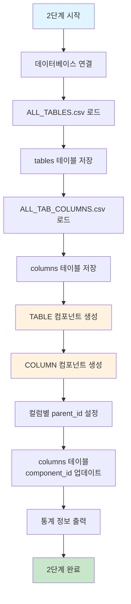

# 처리플로우 상세 - 2단계: 데이터베이스 구조 저장 및 컴포넌트 생성

## 개요

**목적**: CSV 파일에서 테이블/컬럼 정보를 메타데이터베이스에 저장하고 components 테이블에 등록  
**핵심 기능**: CSV 파일 로딩, 테이블/컬럼 정보 저장, 컴포넌트 생성  
**실행 함수**: `FileLoadingEngine.execute_db_loading()`  
**구현 상태**: ✅ **구현 완료**  
**파일**: `file_loading.py`

## 처리 플로우 차트



## 2단계 실행 흐름

### 1. 데이터베이스 연결 (`execute_db_loading`)

```python
def execute_db_loading(self) -> bool:
```

**기능**:

- 메타데이터베이스에 연결
- 2단계 전체 처리 과정 관리

**처리 과정**:

1. `DatabaseUtils`를 사용하여 SQLite 메타데이터베이스 연결
2. 연결 실패 시 오류 로그 출력 후 종료
3. 5단계 순차 처리 실행
4. 처리 완료 후 데이터베이스 연결 해제

### 2. ALL_TABLES.csv 로드 및 저장

#### 2-1. CSV 파일 로드 (`load_csv_file`)

```python
def load_csv_file(self, csv_path: str) -> List[Dict[str, str]]:
```

**기능**: CSV 파일을 읽어서 딕셔너리 리스트로 변환

**처리 과정**:

1. **파일 존재 여부 확인**: `validate_file_exists()`로 파일 검증
2. **파일 내용 읽기**: `FileUtils.read_file()`로 파일 내용 읽기
3. **CSV 파싱**: 
   - 헤더 추출 (첫 번째 행)
   - 데이터 행 처리 (두 번째 행부터)
   - 빈 행 제거
4. **한글 인코딩 지원**: UTF-8 인코딩으로 한글 데이터 처리

**CSV 파일 경로**: `./projects/{project_name}/db_schema/ALL_TABLES.csv`

#### 2-2. 테이블 정보 저장 (`save_tables_to_database`)

```python
def save_tables_to_database(self, tables_data: List[Dict[str, str]]) -> bool:
```

**기능**: ALL_TABLES.csv 데이터를 `tables` 테이블에 저장

**처리 과정**:

1. **프로젝트 ID 조회**: `get_project_id()`로 프로젝트 ID 획득
2. **ALL_TABLES.csv 파일 ID 조회**: `_get_csv_file_id()`로 파일 ID 획득
3. **데이터 변환**: CSV 데이터를 테이블 스키마에 맞게 변환
4. **배치 저장**: `DatabaseUtils.batch_insert_or_replace()`로 배치 저장

**테이블 데이터 구성**:

- `project_id`: 프로젝트 ID
- `component_id`: None (나중에 components에서 생성)
- `table_name`: 테이블명 (TABLE_NAME 컬럼)
- `table_owner`: 테이블 소유자 (OWNER 컬럼, 없으면 'UNKNOWN')
- `table_comments`: 테이블 코멘트 (COMMENTS 컬럼)
- `has_error`: 오류 여부 ('N'/'Y')
- `error_message`: 오류 메시지 (오류 시)
- `hash_value`: 테이블 해시값 (HashUtils 사용)
- `del_yn`: 'N' (삭제되지 않음)

**오류 처리**:

- 필수 필드 누락 시 오류 표시하고 계속 진행
- 테이블명이 없는 경우 해당 행 건너뛰기
- 테이블 소유자가 없는 경우 'UNKNOWN'으로 설정

### 3. ALL_TAB_COLUMNS.csv 로드 및 저장

#### 3-1. CSV 파일 로드

**CSV 파일 경로**: `./projects/{project_name}/db_schema/ALL_TAB_COLUMNS.csv`

#### 3-2. 컬럼 정보 저장 (`save_columns_to_database`)

```python
def save_columns_to_database(self, columns_data: List[Dict[str, str]]) -> bool:
```

**기능**: ALL_TAB_COLUMNS.csv 데이터를 `columns` 테이블에 저장

**처리 과정**:

1. **데이터 변환**: CSV 데이터를 컬럼 스키마에 맞게 변환
2. **테이블 ID 조회**: `_get_table_id()`로 컬럼이 속한 테이블 ID 조회
3. **데이터 타입 파싱**: `_parse_data_type()`으로 타입과 길이 정보 분리
4. **배치 저장**: `DatabaseUtils.batch_insert_or_replace()`로 배치 저장

**컬럼 데이터 구성**:

- `table_id`: 테이블 ID (테이블 조회 결과)
- `column_name`: 컬럼명 (COLUMN_NAME 컬럼)
- `data_type`: 데이터 타입 (DATA_TYPE에서 타입 부분만 추출)
- `data_length`: 데이터 길이 (DATA_TYPE에서 길이 부분만 추출)
- `nullable`: NULL 허용 여부 (NULLABLE 컬럼, 'Y'/'N')
- `column_comments`: 컬럼 코멘트 (COLUMN_COMMENTS 컬럼)
- `position_pk`: PK 위치 (PK 컬럼, 숫자로 변환)
- `data_default`: 기본값 (None, CSV에 없음)
- `owner`: 테이블 소유자 (OWNER 컬럼)
- `has_error`: 오류 여부 ('N'/'Y')
- `error_message`: 오류 메시지 (오류 시)
- `hash_value`: 컬럼 해시값 (HashUtils 사용)
- `del_yn`: 'N' (삭제되지 않음)

**데이터 타입 파싱** (`_parse_data_type()` 메서드):

- `VARCHAR2(50)` → `data_type='VARCHAR2'`, `data_length=50`
- `NUMBER(10,2)` → `data_type='NUMBER'`, `data_length=10` (첫 번째 숫자만 사용)
- `DATE` → `data_type='DATE'`, `data_length=None`
- `CLOB` → `data_type='CLOB'`, `data_length=None`
- `TIMESTAMP(6)` → `data_type='TIMESTAMP'`, `data_length=6`

**파싱 로직 상세** (`_parse_data_type()` 메서드 구현):

1. **빈 값 처리**: `data_type_raw`가 없으면 `('', None)` 반환
2. **괄호가 있는 경우**: 
   - `VARCHAR2(50)` → `type_part='VARCHAR2'`, `length_part='50'`
   - `split('(')[0]`으로 타입 부분 추출
   - `split('(')[1].split(')')[0]`으로 길이 부분 추출
3. **쉼표가 있는 경우**: 
   - `NUMBER(10,2)` → `length_part='10,2'`에서 `split(',')[0]`으로 첫 번째 숫자만 사용
   - `data_length = int(length_part)`로 정수 변환
4. **괄호가 없는 경우**: 
   - `DATE`, `CLOB` → `data_type_raw.strip()`으로 타입만 반환, `data_length=None`
5. **오류 처리**: 
   - `ValueError` 발생 시 (길이 변환 실패) `data_length=None`으로 설정
   - 예외 발생해도 프로그램 중단 없이 계속 진행

**오류 처리**:

- 필수 필드 누락 시 오류 표시하고 계속 진행
- 테이블 ID를 찾을 수 없는 경우 `table_id=0`으로 설정하고 오류 표시
- 테이블 소유자가 없는 경우 'UNKNOWN'으로 설정

### 4. 테이블 컴포넌트 생성 (`create_table_components`)

```python
def create_table_components(self) -> bool:
```

**기능**: `tables` 테이블의 모든 테이블을 `components` 테이블에 `TABLE` 타입으로 등록

**처리 과정**:

1. **프로젝트 ID 조회**: `get_project_id()`로 프로젝트 ID 획득
2. **ALL_TABLES.csv 파일 ID 조회**: `_get_csv_file_id()`로 파일 ID 획득
3. **테이블 조회**: `tables` 테이블에서 모든 테이블 정보 조회
4. **컴포넌트 데이터 생성**: 각 테이블을 컴포넌트 형태로 변환
5. **배치 저장**: `DatabaseUtils.batch_insert_or_replace()`로 배치 저장
6. **테이블 component_id 업데이트**: `_update_table_component_ids()`로 테이블의 component_id 업데이트

**컴포넌트 데이터 구성**:

- `project_id`: 프로젝트 ID
- `file_id`: ALL_TABLES.csv 파일 ID
- `component_name`: 테이블명
- `component_type`: 'TABLE'
- `parent_id`: None
- `layer`: 'DB'
- `line_start`: None
- `line_end`: None
- `has_error`: 'N'
- `error_message`: None
- `hash_value`: 테이블 해시값
- `del_yn`: 'N'

### 5. 컬럼 컴포넌트 생성 (`create_column_components`)

```python
def create_column_components(self) -> bool:
```

**기능**: `columns` 테이블의 모든 컬럼을 `components` 테이블에 `COLUMN` 타입으로 등록

**처리 과정**:

1. **프로젝트 ID 조회**: `get_project_id()`로 프로젝트 ID 획득
2. **ALL_TAB_COLUMNS.csv 파일 ID 조회**: `_get_csv_file_id()`로 파일 ID 획득
3. **컬럼 조회**: `columns`와 `tables` 테이블을 조인하여 컬럼 정보 조회
4. **컴포넌트 데이터 생성**: 각 컬럼을 컴포넌트 형태로 변환
5. **배치 저장**: `DatabaseUtils.batch_insert_or_replace()`로 배치 저장
6. **columns 테이블 업데이트**: `_update_columns_component_id()`로 columns 테이블의 component_id 업데이트

**컴포넌트 데이터 구성**:

- `project_id`: 프로젝트 ID
- `file_id`: ALL_TAB_COLUMNS.csv 파일 ID
- `component_name`: 컬럼명 (예: "USER_ID", "ORDER_NO", "PRODUCT_NAME")
- `component_type`: 'COLUMN'
- `parent_id`: 종속된 TABLE의 component_id
- `layer`: 'DB'
- `line_start`: None
- `line_end`: None
- `has_error`: 'N'
- `error_message`: None
- `hash_value`: 컬럼 해시값
- `del_yn`: 'N'

**컴포넌트명 구성 규칙**:

- **형식**: `{column_name}` (컬럼명만)
- **예시**: 
  - 테이블: USER_INFO, 컬럼: USER_ID → "USER_ID"
  - 테이블: ORDER_MASTER, 컬럼: ORDER_NO → "ORDER_NO"
  - 테이블: PRODUCT, 컬럼: PRODUCT_NAME → "PRODUCT_NAME"
- **목적**: 컬럼의 고유 식별 (테이블과의 관계는 parent_id로 표현)
- **종속관계**: parent_id를 통해 해당 컬럼이 속한 테이블의 component_id와 연결
- **후속 단계 활용**: 3단계 XML 분석에서 parent_id를 통해 테이블-컬럼 관계 파악 가능

### 6. 통계 정보 출력 (`_print_db_loading_statistics`)

```python
def _print_db_loading_statistics(self):
```

**출력 통계**:

- 테이블 로드 수 (오류 수 포함)
- 컬럼 로드 수 (오류 수 포함)
- 컴포넌트 생성 수 (오류 수 포함)
- inferred 컬럼 생성 수
- 총 오류 발생 수

**실제 출력 예시**:

```
=== 데이터베이스 구조 저장 통계 ===
테이블 로드: 15 (오류: 0)
컬럼 로드: 89 (오류: 0)
컴포넌트 생성: 104 (오류: 0)
inferred 컬럼 생성: 0
오류 없이 완료
```

**통계 계산 로직**:

- `total_errors = tables_with_errors + columns_with_errors + components_with_errors`
- 오류가 있으면 경고 메시지, 없으면 "오류 없이 완료" 메시지 출력

## 2단계 특징

### 사용자 규칙 준수

- **공통함수 사용**: `DatabaseUtils`, `FileUtils`, `HashUtils` 등 util 모듈 활용
- **하드코딩된 2개 파일만 처리**: ALL_TABLES.csv, ALL_TAB_COLUMNS.csv만 처리
- **예외 처리**: `handle_error()` 공통함수로 모든 예외 처리
- **프로젝트 해시값**: 하드코딩된 '-' 사용

### 성능 최적화

- **배치 처리**: `batch_insert_or_replace()`로 대량 데이터 효율적 저장
- **메모리 효율**: 파일별 개별 처리로 메모리 사용량 최소화
- **UPSERT 방식**: 중복 실행 시에도 안전한 데이터 업데이트

### 안정성

- **오류 복구**: 개별 데이터 오류가 전체 프로세스를 중단시키지 않음
- **데이터 무결성**: 트랜잭션 기반 데이터베이스 저장
- **로깅**: 상세한 로그로 실행 과정 추적 가능

## 실행 결과 예시

```
=== 데이터베이스 로딩 시작: 데이터베이스 구조 저장 ===
CSV 파일 로드 완료: ALL_TABLES.csv, 15개 행
테이블 정보 저장 완료: 15개 테이블 (오류: 0개)
CSV 파일 로드 완료: ALL_TAB_COLUMNS.csv, 89개 행
컬럼 정보 저장 완료: 89개 컬럼 (오류: 0개)
테이블 컴포넌트 생성 완료: 15개
컬럼 컴포넌트 생성 완료: 89개
=== 데이터베이스 구조 저장 통계 ===
테이블 로드: 15 (오류: 0)
컬럼 로드: 89 (오류: 0)
컴포넌트 생성: 104 (오류: 0)
오류 없이 완료
=== 데이터베이스 로딩 완료 ===
```

**실제 구현된 통계 정보**:

- `self.stats['tables_loaded']`: 테이블 로드 수
- `self.stats['tables_with_errors']`: 테이블 로드 오류 수
- `self.stats['columns_loaded']`: 컬럼 로드 수
- `self.stats['columns_with_errors']`: 컬럼 로드 오류 수
- `self.stats['components_created']`: 컴포넌트 생성 수
- `self.stats['components_with_errors']`: 컴포넌트 생성 오류 수

### 생성된 컴포넌트 예시

**테이블 컴포넌트**:

- `component_name`: "USER_INFO", `component_type`: "TABLE"
- `component_name`: "ORDER_MASTER", `component_type`: "TABLE"
- `component_name`: "PRODUCT", `component_type`: "TABLE"

**컬럼 컴포넌트**:

- `component_name`: "USER_ID", `component_type`: "COLUMN", `parent_id`: USER_INFO 테이블의 component_id
- `component_name`: "USER_NAME", `component_type`: "COLUMN", `parent_id`: USER_INFO 테이블의 component_id
- `component_name`: "ORDER_NO", `component_type`: "COLUMN", `parent_id`: ORDER_MASTER 테이블의 component_id
- `component_name`: "ORDER_DATE", `component_type`: "COLUMN", `parent_id`: ORDER_MASTER 테이블의 component_id
- `component_name`: "PRODUCT_ID", `component_type`: "COLUMN", `parent_id`: PRODUCT 테이블의 component_id
- `component_name`: "PRODUCT_NAME", `component_type`: "COLUMN", `parent_id`: PRODUCT 테이블의 component_id

## 데이터베이스 테이블

### tables 테이블

데이터베이스의 모든 테이블 정보를 저장하는 테이블

**주요 컬럼**:

- `table_id`: 테이블 고유 ID (Primary Key)
- `project_id`: 프로젝트 ID (Foreign Key)
- `component_id`: 컴포넌트 ID (Foreign Key, 나중에 업데이트)
- `table_name`: 테이블명
- `table_owner`: 테이블 소유자
- `table_comments`: 테이블 코멘트
- `has_error`: 오류 여부 ('N'/'Y')
- `error_message`: 오류 메시지
- `hash_value`: 테이블 해시값
- `del_yn`: 삭제 여부 ('N'/'Y')

### columns 테이블

데이터베이스의 모든 컬럼 정보를 저장하는 테이블

**주요 컬럼**:

- `column_id`: 컬럼 고유 ID (Primary Key)
- `table_id`: 테이블 ID (Foreign Key)
- `column_name`: 컬럼명
- `data_type`: 데이터 타입
- `data_length`: 데이터 길이
- `nullable`: NULL 허용 여부 ('Y'/'N')
- `column_comments`: 컬럼 코멘트
- `position_pk`: PK 위치
- `data_default`: 기본값
- `owner`: 테이블 소유자
- `has_error`: 오류 여부 ('N'/'Y')
- `error_message`: 오류 메시지
- `hash_value`: 컬럼 해시값
- `del_yn`: 삭제 여부 ('N'/'Y')

### components 테이블

모든 컴포넌트 정보를 저장하는 통합 테이블

**주요 컬럼**:

- `component_id`: 컴포넌트 고유 ID (Primary Key)
- `project_id`: 프로젝트 ID (Foreign Key)
- `file_id`: 파일 ID (Foreign Key)
- `component_name`: 컴포넌트명
- `component_type`: 컴포넌트 타입 ('TABLE', 'COLUMN' 등)
- `parent_id`: 부모 컴포넌트 ID (COLUMN일떄는 TABLE의 compoennt_id, METHOD일때는 classes의 class_Id)
- `layer`: 레이어 ('DB' 등)
- `line_start`: 시작 라인
- `line_end`: 종료 라인
- `has_error`: 오류 여부 ('N'/'Y')
- `error_message`: 오류 메시지
- `hash_value`: 컴포넌트 해시값
- `del_yn`: 삭제 여부 ('N'/'Y')

## 설정 파일

### CSV 파일 구조

**ALL_TABLES.csv**:

- `OWNER`: 테이블 소유자
- `TABLE_NAME`: 테이블명
- `COMMENTS`: 테이블 코멘트

**ALL_TAB_COLUMNS.csv**:

- `OWNER`: 테이블 소유자
- `TABLE_NAME`: 테이블명
- `COLUMN_NAME`: 컬럼명
- `DATA_TYPE`: 데이터 타입
- `NULLABLE`: NULL 허용 여부
- `PK`: PK 위치
- `COLUMN_COMMENTS`: 컬럼 코멘트

## 오류 처리

### 예외 처리 방식

- **공통함수 사용**: `handle_error()` 함수로 모든 예외 처리
- **오류 로깅**: 상세한 오류 메시지와 함께 로그 기록
- **프로그램 종료**: 치명적 오류 시 프로그램 종료
- **데이터 오류 예외**: 데이터 오류는 `has_error='Y'`로 표시하고 계속 진행

### 오류 유형

1. **파일 오류**: CSV 파일이 존재하지 않거나 읽기 실패
2. **데이터 오류**: 필수 필드 누락, 잘못된 데이터 형식
3. **참조 오류**: 테이블 ID를 찾을 수 없는 경우
4. **데이터베이스 오류**: 연결 실패, 쿼리 실행 실패

## 확장성

### 새로운 CSV 파일 지원

- `load_csv_file()` 함수에 새로운 파일 타입 추가
- `save_*_to_database()` 함수에 새로운 저장 로직 추가
- 데이터베이스 스키마 확장 (필요시)

### 로깅 레벨

- **INFO**: 일반적인 실행 과정
- **DEBUG**: 상세한 디버깅 정보
- **WARNING**: 경고 메시지
- **ERROR**: 오류 메시지

### 통계 정보

- **처리 통계**: 테이블/컬럼/컴포넌트 처리 수
- **오류 통계**: 오류 발생 현황 및 원인 분석
- **최종 통계**: 처리 완료 후 전체 통계 정보

이 2단계 로직은 데이터베이스 스키마 정보를 체계적으로 수집하고 메타데이터베이스에 저장하여, 이후 단계에서의 관계 분석 및 컴포넌트 분석을 위한 기반 데이터를 구축하는 핵심 역할을 수행합니다.
