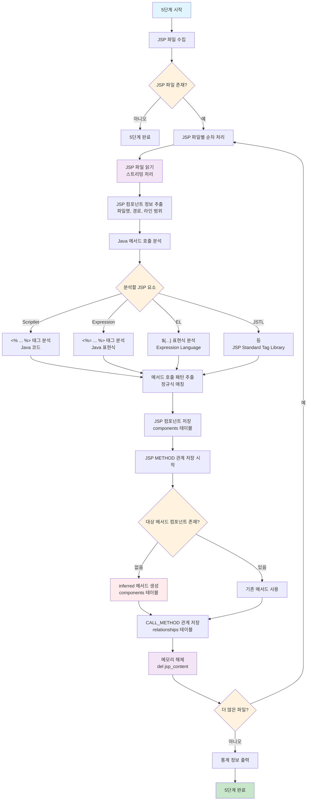

# 처리플로우 상세 - 5단계: JSP 파일 분석 및 컴포넌트 등록

## 개요

**목적**: JSP 파일에서 JSP 컴포넌트 추출, components 테이블 등록, JSP → Java 메서드 관계 분석  
**핵심 기능**: JSP 파일 파싱, JSP 컴포넌트 등록, JSP → METHOD 관계 분석, 스크립틀릿/표현식/EL 분석  
**실행 함수**: `JspLoadingEngine.execute_jsp_loading()`  
**구현 상태**: 🔄 **개발 예정** (문서 설계 완료, 실제 Python 파일 미구현)  
**파일**: `jsp_loading.py`, `parser/jsp_parser.py` (문서에 설계되어 있으나 실제 파일 없음)  
**메모리 최적화**: 스트리밍 처리로 한 파일씩만 메모리에 로드하여 처리

> **📚 관련 문서**: [메타데이터베이스스키마정의서.md](./메타데이터베이스스키마정의서.md) - 데이터베이스 스키마 구조 상세

## 처리 플로우 차트



## 5단계 실행 흐름

### 1. JSP 로딩 엔진 초기화 (`JspLoadingEngine.__init__`)

```python
def __init__(self, project_name: str):
```

**기능**:
- JSP 로딩 엔진 초기화
- 프로젝트 경로 및 메타데이터베이스 경로 설정
- JSP 파서 초기화
- 통계 정보 초기화

**초기화 과정**:
1. **프로젝트 정보 설정**: `project_name`으로 프로젝트 경로 설정
2. **경로 설정**: 
   - `project_source_path`: `./projects/{project_name}/src/` (get_project_source_path 사용)
   - `metadata_db_path`: `./projects/{project_name}/metadata.db` (get_project_metadata_db_path 사용)
3. **JSP 파서 초기화**: `JspParser()` 인스턴스 생성
4. **통계 초기화**: 처리 통계 정보 딕셔너리 초기화

**통계 정보 구성**:
- `jsp_files_processed`: 처리된 JSP 파일 수
- `jsp_components_created`: 생성된 JSP 컴포넌트 수
- `jsp_method_relationships_created`: 생성된 JSP → METHOD 관계 수
- `jsp_class_relationships_created`: 생성된 JSP → CLASS 관계 수
- `errors`: 오류 발생 수

### 2. JSP 로딩 실행 (`execute_jsp_loading`)

```python
def execute_jsp_loading(self) -> bool:
```

**기능**: 5단계 처리 실행

**처리 과정**:
1. **데이터베이스 연결**: `DatabaseUtils`를 사용하여 SQLite 메타데이터베이스 연결
2. **JSP 파일 수집**: `JspParser.get_filtered_jsp_files()`로 JSP 파일 수집
3. **JSP 파일별 통합 처리**: 각 JSP 파일에 대해 컴포넌트 등록 및 관계 분석
   - `JspParser.parse_jsp_file()` 호출
   - 파싱 에러가 있어도 계속 진행 (USER RULES)
4. **통계 정보 출력**: 처리 완료 후 통계 정보 출력
5. **데이터베이스 연결 해제**: 처리 완료 후 연결 해제

**오류 처리**: 예외 발생 시 `handle_error()` 함수로 오류 처리 후 `False` 반환

### 3. JSP 파일 수집 (`get_filtered_jsp_files`)

```python
def get_filtered_jsp_files(self, project_path: str) -> List[str]:
```

**기능**: JSP 파일 수집 및 필터링

**처리 과정**:
1. **디렉토리 재귀 탐색**: `FileUtils.scan_directory()`로 프로젝트 전체 디렉토리 탐색
2. **JSP 파일 필터링**: `.jsp` 확장자 파일만 수집
3. **파일 경로 리스트 반환**: 유효한 JSP 파일 경로 리스트 반환

### 4. JSP 파일 통합 분석 (`parse_jsp_file`)

```python
def parse_jsp_file(self, jsp_file: str) -> Dict[str, Any]:
```

**기능**: JSP 파일에서 컴포넌트 정보 추출 및 Java 메서드 관계 분석

**처리 과정**:
1. **JSP 파일 읽기**: `FileUtils.read_file()`로 JSP 파일 내용 읽기
2. **JSP 컴포넌트 정보 추출**: `_extract_jsp_component_info()`로 JSP 컴포넌트 정보 추출
3. **Java 메서드 호출 분석**: `_analyze_java_method_calls()`로 JSP에서 Java 메서드 호출 분석
4. **결과 반환**: JSP 컴포넌트 정보와 Java 메서드 관계 정보 반환

**반환 데이터 구조**:
```python
{
    'jsp_component': {
        'jsp_name': 'userList.jsp',
        'jsp_path': '/WEB-INF/views/user/userList.jsp',
        'line_start': 1,
        'line_end': 150,
        'hash_value': 'abc123...'
    },
    'java_method_relationships': [
        {
            'method_name': 'getUserList',
            'class_name': 'UserController',
            'rel_type': 'CALL_METHOD',
            'line_number': 25
        }
    ],
    'file_path': '/path/to/userList.jsp'
}
```

### 5. JSP 컴포넌트 정보 추출 (`_extract_jsp_component_info`)

```python
def _extract_jsp_component_info(self, jsp_content: str, file_path: str) -> Dict[str, Any]:
```

**기능**: JSP 파일에서 JSP 컴포넌트 정보 추출

**처리 과정**:
1. **JSP 파일명 추출**: 파일 경로에서 JSP 파일명 추출
2. **JSP 경로 추출**: 웹 애플리케이션 기준 상대 경로 추출
3. **라인 번호 추출**: JSP 파일의 시작/종료 라인 추출
4. **해시 값 생성**: `HashUtils.generate_md5()`로 JSP 내용 해시 생성

**JSP 컴포넌트 정보 구성**:
- `jsp_name`: JSP 파일명 (예: "userList.jsp")
- `jsp_path`: 웹 애플리케이션 기준 상대 경로 (예: "/WEB-INF/views/user/userList.jsp")
- `line_start`: 시작 라인 번호
- `line_end`: 종료 라인 번호
- `hash_value`: JSP 내용 해시값

### 6. Java 메서드 호출 분석 (`_analyze_java_method_calls`)

```python
def _analyze_java_method_calls(self, jsp_content: str) -> List[Dict[str, Any]]:
```

**기능**: JSP 파일에서 Java 메서드 호출 분석

**처리 과정**:
1. **설정 파일에서 패턴 로드**: `config/parser/jsp_keyword.yaml`에서 JSP 분석 패턴 로드
2. **스크립틀릿 분석**: `<% ... %>` 태그 내 Java 코드 분석
3. **표현식 분석**: `<%= ... %>` 태그 내 Java 표현식 분석
4. **EL 분석**: `${...}` 표현식 언어 분석
5. **메서드 호출 추출**: 정규식으로 메서드 호출 패턴 추출
6. **관계 정보 생성**: JSP → METHOD 관계 정보 생성

**분석하는 JSP 요소들**:

**스크립틀릿 (Scriptlet)**:
```jsp
<%
    List<User> users = userService.getUserList();
    String message = userController.getMessage();
%>
```

**표현식 (Expression)**:
```jsp
<%= userService.getUserName() %>
<%= userController.getCurrentTime() %>
```

**EL (Expression Language)**:
```jsp
${userService.userName}
${userController.currentUser.name}
```

**JSTL (JSP Standard Tag Library)**:
```jsp
<c:forEach items="${userService.getUserList()}" var="user">
    <c:out value="${user.name}"/>
</c:forEach>
```

### 7. 메서드 호출 패턴 분석 (`_extract_method_calls`)

```python
def _extract_method_calls(self, jsp_content: str) -> List[Dict[str, Any]]:
```

**기능**: JSP 내용에서 Java 메서드 호출 패턴 추출

**처리 과정**:
1. **설정 파일에서 패턴 로드**: `config/parser/jsp_keyword.yaml`에서 메서드 호출 패턴 로드
2. **정규식 매칭**: 설정된 패턴으로 메서드 호출 매칭
3. **메서드 정보 파싱**: 메서드명, 클래스명, 라인 번호 추출
4. **관계 정보 생성**: JSP → METHOD 관계 정보 생성

**메서드 호출 패턴**:
- **직접 호출**: `methodName()`
- **객체 메서드 호출**: `object.methodName()`
- **체이닝 호출**: `object.method1().method2()`
- **EL 메서드 호출**: `${object.methodName()}`

### 8. JSP 컴포넌트 저장 (`_save_jsp_components_to_database`)

```python
def _save_jsp_components_to_database(self, jsp_components: List[Dict[str, Any]]) -> bool:
```

**기능**: JSP 컴포넌트를 components 테이블에 저장

**처리 과정**:
1. **프로젝트 ID 조회**: `_get_project_id()`로 프로젝트 ID 획득
2. **JSP 데이터 변환**: JSP 컴포넌트 정보를 컴포넌트 형태로 변환
3. **파일 ID 조회**: `_get_file_id()`로 JSP 파일 ID 획득
4. **배치 저장**: `DatabaseUtils.batch_insert_or_replace()`로 배치 저장

**JSP 컴포넌트 데이터 구성**:
- `project_id`: 프로젝트 ID
- `component_type`: 'JSP'
- `component_name`: JSP 파일명 (예: "userList.jsp")
- `parent_id`: None (JSP는 독립적인 컴포넌트)
- `file_id`: JSP 파일 ID
- `line_start`: 시작 라인 번호
- `line_end`: 종료 라인 번호
- `hash_value`: JSP 내용 해시값
- `has_error`: 'N'
- `error_message`: None
- `del_yn`: 'N'

### 9. JSP → METHOD 관계 저장 (`_save_jsp_method_relationships_to_database`)

```python
def _save_jsp_method_relationships_to_database(self, relationships: List[Dict[str, Any]]) -> bool:
```

**기능**: JSP → METHOD 관계를 relationships 테이블에 저장

**처리 과정**:
1. **프로젝트 ID 조회**: `_get_project_id()`로 프로젝트 ID 획득
2. **JSP 컴포넌트 ID 조회**: `_get_jsp_component_id()`로 JSP 컴포넌트 ID 조회
3. **METHOD 컴포넌트 ID 조회**: `_get_method_component_id()`로 METHOD 컴포넌트 ID 조회
4. **관계 데이터 변환**: JSP → METHOD 관계 정보를 relationships 테이블 형태로 변환
5. **배치 저장**: `DatabaseUtils.batch_insert_or_replace()`로 배치 저장

**관계 데이터 구성**:
- `src_id`: JSP 컴포넌트 ID
- `dst_id`: METHOD 컴포넌트 ID
- `rel_type`: 'CALL_METHOD'
- `confidence`: 1.0
- `has_error`: 'N'
- `error_message`: None
- `hash_value`: '-' (하드코딩)
- `del_yn`: 'N'

### 10. JSP 컴포넌트 ID 조회 (`_get_jsp_component_id`)

```python
def _get_jsp_component_id(self, project_id: int, jsp_name: str) -> Optional[int]:
```

**기능**: JSP명으로 JSP 컴포넌트 ID 조회

**처리 과정**:
1. **공통함수 사용**: `PathUtils.get_jsp_component_id()` 사용
2. **JSP 조회**: project_id와 jsp_name으로 JSP 컴포넌트 조회
3. **컴포넌트 ID 반환**: components 테이블의 component_id 반환

### 11. METHOD 컴포넌트 ID 조회 (`_get_method_component_id`)

```python
def _get_method_component_id(self, project_id: int, class_name: str, method_name: str) -> Optional[int]:
```

**기능**: 클래스명과 메서드명으로 METHOD 컴포넌트 ID 조회

**처리 과정**:
1. **공통함수 사용**: `PathUtils.get_method_component_id()` 사용
2. **METHOD 조회**: project_id, class_name, method_name으로 METHOD 컴포넌트 조회
3. **컴포넌트 ID 반환**: components 테이블의 component_id 반환

### 12. 메모리 최적화 전략

**스트리밍 처리**:
1. **한 파일씩 처리**: 전체 JSP 파일을 메모리에 로드하지 않고 한 파일씩 처리
2. **즉시 해제**: 파일 처리 완료 후 즉시 메모리에서 해제 (`del jsp_content`)
3. **배치 저장**: 여러 컴포넌트를 한 번에 저장하여 DB 연결 횟수 최소화

**메모리 사용량 최적화**:
1. **정규식 기반 파싱**: AST 파서 대신 정규식으로 메모리 효율성 확보
2. **필터링**: 유효한 메서드 호출만 추출하여 메모리 사용량 최소화
3. **즉시 저장**: 분석 완료 즉시 데이터베이스에 저장

**오류 처리**:
1. **파싱 오류**: JSP 파싱 오류가 있어도 계속 진행 (USER RULES)
2. **시스템 오류**: 시스템 오류 발생 시 `handle_error()` 함수로 처리
3. **오류 통계**: 오류 발생 수를 통계에 기록

## 5단계 특징

### 사용자 규칙 준수

- **공통함수 사용**: `DatabaseUtils`, `FileUtils`, `HashUtils`, `PathUtils` 등 util 모듈 활용
- **하드코딩 금지**: `config/parser/jsp_keyword.yaml` 설정 파일 사용
- **예외 처리**: `handle_error()` 공통함수로 모든 예외 처리
- **프로젝트 해시값**: 하드코딩된 '-' 사용
- **메뉴얼 기반**: `parser/manual/02_jsp` 참고

### 메모리 최적화

- **스트리밍 처리**: 한 파일씩만 메모리에 로드하여 처리
- **즉시 해제**: 처리 후 `del jsp_content`로 메모리에서 즉시 해제
- **배치 처리**: `batch_insert_or_replace()`로 대량 데이터 효율적 저장
- **메모리 사용량 최소화**: 전체 JSP 파일을 메모리에 로드하지 않음

### 통합 처리

- **JSP 컴포넌트 등록과 관계 분석**: JSP 컴포넌트 등록과 Java 메서드 관계 분석을 한 번에 처리
- **한 번의 JSP 읽기**: JSP 파일을 한 번만 읽어서 모든 분석 수행
- **효율성 극대화**: 중복 파일 읽기 방지

### JSP 분석 강화

- **스크립틀릿 분석**: `<% ... %>` 태그 내 Java 코드 분석
- **표현식 분석**: `<%= ... %>` 태그 내 Java 표현식 분석
- **EL 분석**: `${...}` 표현식 언어 분석
- **JSTL 분석**: JSP Standard Tag Library 분석

### 안정성

- **오류 복구**: 개별 파일 오류가 전체 프로세스를 중단시키지 않음
- **로깅**: 상세한 로그로 실행 과정 추적 가능
- **관계 분석**: JSP → METHOD 관계만 분석 (JSP → CLASS 관계는 parent_id로 찾아감)

## 실행 결과 예시

```
=== JSP 로딩 시작: 5단계 처리 ===
JSP 파일 수집 완료: 8개
JSP 컴포넌트 저장 완료: 8개
JSP → METHOD 관계 저장 완료: 15개
=== JSP 로딩 통계 ===
처리된 JSP 파일: 8개
생성된 JSP 컴포넌트: 8개
생성된 JSP → METHOD 관계: 15개
오류 발생: 0개
=== JSP 로딩 완료 ===
```

### 생성된 컴포넌트 예시

**JSP 컴포넌트**:
- `component_name`: "userList.jsp", `component_type`: "JSP"
- `component_name`: "userDetail.jsp", `component_type`: "JSP"
- `component_name`: "userForm.jsp", `component_type`: "JSP"

**JSP → METHOD 관계**:
- `src_id`: 2001 (userList.jsp), `dst_id`: 1001 (getUserList), `rel_type`: "CALL_METHOD"
- `src_id`: 2002 (userDetail.jsp), `dst_id`: 1002 (getUserById), `rel_type`: "CALL_METHOD"
- `src_id`: 2003 (userForm.jsp), `dst_id`: 1003 (saveUser), `rel_type`: "CALL_METHOD"

## 데이터베이스 테이블

### components 테이블

JSP 컴포넌트 정보를 저장하는 테이블

**주요 컬럼**:
- `component_id`: 컴포넌트 고유 ID (Primary Key)
- `project_id`: 프로젝트 ID (Foreign Key)
- `file_id`: JSP 파일 ID (Foreign Key)
- `component_name`: 컴포넌트명 (JSP 파일명)
- `component_type`: 컴포넌트 타입 ('JSP')
- `parent_id`: 부모 컴포넌트 ID (None)
- `layer`: 레이어 (None)
- `line_start`: 시작 라인 번호
- `line_end`: 종료 라인 번호
- `has_error`: 오류 여부 ('N'/'Y')
- `error_message`: 오류 메시지
- `hash_value`: JSP 내용 해시값
- `del_yn`: 삭제 여부 ('N'/'Y')

### relationships 테이블

JSP → METHOD 관계 정보를 저장하는 테이블

**주요 컬럼**:
- `relationship_id`: 관계 고유 ID (Primary Key)
- `src_id`: 소스 컴포넌트 ID (JSP 컴포넌트 ID)
- `dst_id`: 대상 컴포넌트 ID (METHOD 컴포넌트 ID)
- `rel_type`: 관계 타입 ('CALL_METHOD')
- `confidence`: 신뢰도 (1.0)
- `has_error`: 오류 여부 ('N'/'Y')
- `error_message`: 오류 메시지
- `hash_value`: 해시값 ('-')
- `del_yn`: 삭제 여부 ('N'/'Y')

## 설정 파일

### jsp_keyword.yaml

JSP 분석을 위한 키워드 및 패턴 설정

**주요 설정**:
- `jsp_scriptlet_patterns`: 스크립틀릿 분석 패턴
- `jsp_expression_patterns`: 표현식 분석 패턴
- `jsp_el_patterns`: EL 분석 패턴
- `jsp_jstl_patterns`: JSTL 분석 패턴
- `java_method_call_patterns`: Java 메서드 호출 패턴
- `jsp_reserved_keywords`: JSP 예약어

## 오류 처리

### 예외 처리 방식

- **공통함수 사용**: `handle_error()` 함수로 모든 예외 처리
- **오류 로깅**: 상세한 오류 메시지와 함께 로그 기록
- **프로그램 종료**: 치명적 오류 시 프로그램 종료
- **파싱 오류 예외**: 파싱 오류는 `has_error='Y'`로 표시하고 계속 진행

### 오류 유형

1. **파일 오류**: JSP 파일이 존재하지 않거나 읽기 실패
2. **파싱 오류**: JSP 파싱 실패, 잘못된 JSP 구문
3. **분석 오류**: Java 메서드 호출 추출 실패
4. **데이터베이스 오류**: 연결 실패, 쿼리 실행 실패
5. **컴포넌트 오류**: 컴포넌트 생성 실패, 관계 저장 실패

## 확장성

### 새로운 JSP 태그 지원

- `jsp_keyword.yaml`에 새로운 JSP 태그 추가
- `_analyze_java_method_calls()`에 새로운 태그 처리 로직 추가

### 새로운 메서드 호출 패턴 지원

- `jsp_keyword.yaml`에 새로운 메서드 호출 패턴 추가
- `_extract_method_calls()`에 새로운 패턴 처리 로직 추가

### 로깅 레벨

- **INFO**: 일반적인 실행 과정
- **DEBUG**: 상세한 디버깅 정보
- **WARNING**: 경고 메시지
- **ERROR**: 오류 메시지

### 통계 정보

- **처리 통계**: JSP 파일/JSP 컴포넌트/관계 처리 수
- **오류 통계**: 오류 발생 현황 및 원인 분석
- **최종 통계**: 처리 완료 후 전체 통계 정보

이 5단계 로직은 JSP 파일에서 JSP 컴포넌트를 추출하고 Java 메서드와의 관계를 분석하여 메타데이터베이스에 저장하는 핵심 역할을 수행하며, 메모리 최적화를 통해 효율적인 분석을 제공합니다.

## 📚 관련 문서

- **[메타데이터베이스스키마정의서.md](./메타데이터베이스스키마정의서.md)**: 데이터베이스 스키마 구조 상세
- **[처리플로우_상세_1단계.md](./처리플로우_상세_1단계.md)**: 1단계 파일 정보 저장 상세 구현 가이드
- **[처리플로우_상세_2단계.md](./처리플로우_상세_2단계.md)**: 2단계 데이터베이스 구조 저장 상세 구현 가이드
- **[처리플로우_상세_3단계.md](./처리플로우_상세_3단계.md)**: 3단계 XML 파일 분석 상세 구현 가이드
- **[처리플로우_상세_4단계.md](./처리플로우_상세_4단계.md)**: 4단계 Java 소스코드 분석 및 관계 생성 상세 구현 가이드
- **[create_table_script.sql](../database/create_table_script.sql)**: 메타데이터베이스 스키마 정의 원본 파일
