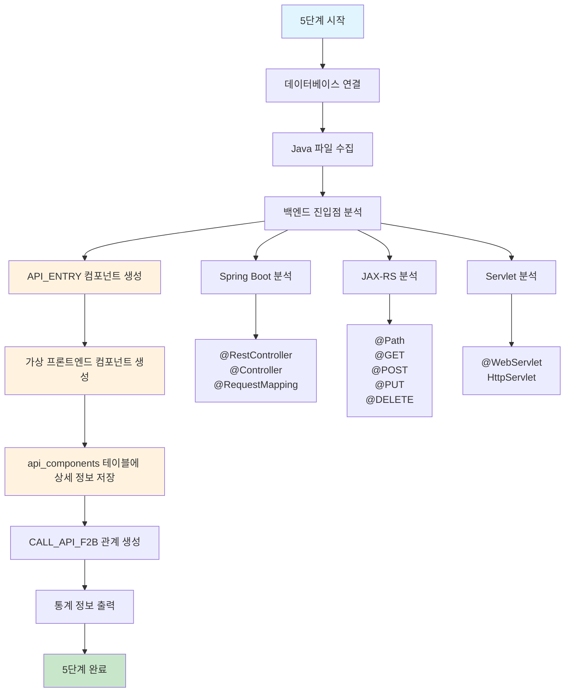
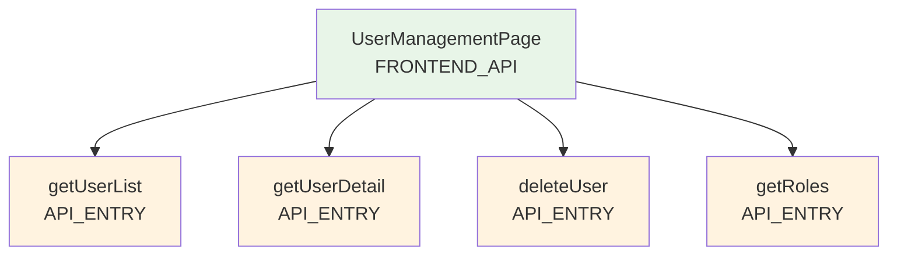
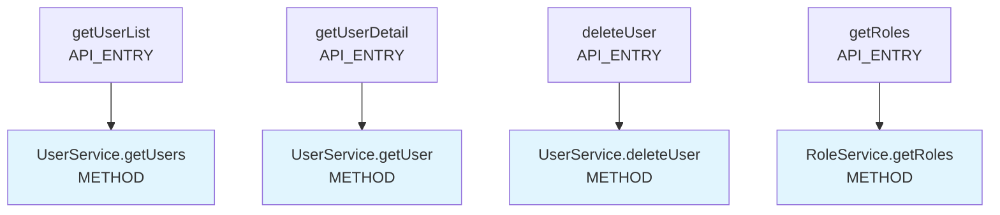

# 처리플로우 상세 - 5단계: API 진입점 분석 (개발 예정)

## 개요

**목적**: Java 백엔드 제일 앞단인 API 진입점을 분석하여 프론트엔드 → 백엔드 호출 체인 구성  
**핵심 기능**: Java 파일에서 백엔드 진입점 식별, API 엔드포인트 매핑, 가상 프론트엔드 컴포넌트 생성, 완전한 호출 체인 구성  
**실행 함수**: `BackendEntryLoadingEngine.execute_backend_entry_loading()`  
**구현 상태**: 🔄 **개발 예정** (현재 미구현)  
**파일**: `backend_entry_loading.py` (5단계 메인 엔진), `parser/backend_entry_analyzer.py` (백엔드 진입점 분석 로직)  
**통합 설계**: API_ENTRY와 FRONTEND_API를 api_components 테이블로 통합 관리  
**메모리 최적화**: 스트리밍 처리로 한 파일씩만 메모리에 로드하여 처리

## 처리 플로우 차트



## 5단계 실행 흐름

### 1. 데이터베이스 연결 (`execute_backend_entry_loading`)

```python
def execute_backend_entry_loading(self) -> bool:
```

**기능**:

- 메타데이터베이스에 연결
- 5단계 전체 처리 과정 관리

**처리 과정**:

1. `DatabaseUtils`를 사용하여 SQLite 메타데이터베이스 연결
2. 연결 실패 시 오류 로그 출력 후 종료
3. 4단계 순차 처리 실행
4. 처리 완료 후 데이터베이스 연결 해제

### 2. Java 파일 수집 (`get_filtered_files`)

```python
def get_filtered_files(self) -> List[FileInfo]:
```

**기능**: Java 파일 중 백엔드 진입점이 될 수 있는 파일들을 필터링하여 수집

**처리 과정**:

1. `FileUtils.scan_directory()`로 프로젝트 전체 Java 파일 스캔
2. `target_source_config.yaml` 설정 기반 파일 필터링
3. 백엔드 진입점 패턴 매칭:
   - `*Controller.java` (Spring MVC)
   - `*RestController.java` (Spring Boot REST)
   - `*Resource.java` (JAX-RS)
   - `*Servlet.java` (Servlet)
   - `*Endpoint.java` (기타 엔드포인트)

### 3. 백엔드 진입점 분석 (`BackendEntryAnalyzer.analyze_backend_entry`)

```python
def analyze_backend_entry(self, java_file: FileInfo) -> List[BackendEntryInfo]:
```

**기능**: Java 파일에서 백엔드 진입점을 식별하고 상세 정보 추출

**처리 과정**:

1. **Java 파일 파싱**: AST 파싱을 통한 클래스 및 메서드 분석
2. **어노테이션 분석**: 
   - Spring Boot: `@RestController`, `@Controller`, `@RequestMapping`, `@GetMapping`, `@PostMapping` 등
   - JAX-RS: `@Path`, `@GET`, `@POST`, `@PUT`, `@DELETE` 등
   - Servlet: `@WebServlet`, `HttpServlet` 상속 등
3. **URL 패턴 추출**: 어노테이션에서 URL 패턴 및 HTTP 메서드 추출
4. **메서드 정보 추출**: 파라미터, 반환 타입, 메서드명 등

**백엔드 진입점 정보 구성**:

```python
@dataclass
class BackendEntryInfo:
    class_name: str           # 클래스명
    method_name: str          # 메서드명
    url_pattern: str          # URL 패턴
    http_method: str          # HTTP 메서드 (GET, POST, PUT, DELETE 등)
    parameters: List[str]     # 파라미터 목록
    return_type: str          # 반환 타입
    annotations: List[str]    # 관련 어노테이션
    file_path: str            # 파일 경로
    line_start: int           # 시작 라인
    line_end: int             # 종료 라인
```

### 4. API_ENTRY 컴포넌트 생성 (`create_api_entry_components`)

```python
def create_api_entry_components(self, backend_entries: List[BackendEntryInfo]) -> bool:
```

**기능**: 백엔드 진입점을 `API_ENTRY` 타입으로 components 테이블에 등록

**처리 과정**:

1. **프로젝트 ID 조회**: `get_project_id()`로 프로젝트 ID 획득
2. **Java 파일 ID 조회**: `_get_java_file_id()`로 파일 ID 획득
3. **컴포넌트 데이터 생성**: 각 백엔드 진입점을 컴포넌트 형태로 변환
4. **배치 저장**: `DatabaseUtils.batch_insert_or_replace()`로 배치 저장

**컴포넌트 데이터 구성**:

- `project_id`: 프로젝트 ID
- `file_id`: Java 파일 ID
- `component_name`: API 진입점명 (예: "API_ENTRY.GET_/api/users/list")
- `component_type`: 'API_ENTRY'
- `parent_id`: None
- `layer`: 'API'
- `line_start`: 메서드 시작 라인
- `line_end`: 메서드 종료 라인
- `has_error`: 'N'
- `error_message`: None
- `hash_value`: API 진입점 해시값
- `del_yn`: 'N'

**컴포넌트명 구성 규칙**:

- **형식**: `API_ENTRY.{HTTP_METHOD}_{URL_PATTERN}`
- **예시**: 
  - `API_ENTRY.GET_/api/users/list`
  - `API_ENTRY.POST_/api/users/create`
  - `API_ENTRY.PUT_/api/users/{id}/update`
  - `API_ENTRY.DELETE_/api/users/{id}/delete`

### 5. 가상 프론트엔드 컴포넌트 생성 (`create_virtual_frontend_components`)

```python
def create_virtual_frontend_components(self, backend_entries: List[BackendEntryInfo]) -> bool:
```

**기능**: 각 API 진입점에 대응하는 가상 프론트엔드 컴포넌트를 생성

**처리 과정**:

1. **가상 컴포넌트 데이터 생성**: 각 API 진입점에 대응하는 프론트엔드 컴포넌트 생성
2. **배치 저장**: `DatabaseUtils.batch_insert_or_replace()`로 배치 저장

**컴포넌트 데이터 구성**:

- `project_id`: 프로젝트 ID
- `file_id`: None (가상 컴포넌트)
- `component_name`: 가상 프론트엔드명 (예: "FRONTEND_API.GET_/api/users/list")
- `component_type`: 'FRONTEND_API'
- `parent_id`: None
- `layer`: 'FRONTEND'
- `line_start`: None
- `line_end`: None
- `has_error`: 'N'
- `error_message`: None
- `hash_value`: 가상 컴포넌트 해시값
- `del_yn`: 'N'

**가상 프론트엔드 컴포넌트명 구성 규칙**:

- **형식**: `FRONTEND_API.{HTTP_METHOD}_{URL_PATTERN}`
- **예시**: 
  - `FRONTEND_API.GET_/api/users/list`
  - `FRONTEND_API.POST_/api/users/create`
  - `FRONTEND_API.PUT_/api/users/{id}/update`
  - `FRONTEND_API.DELETE_/api/users/{id}/delete`

### 6. CALL_API_F2B 관계 생성 (`create_api_call_relationships`)

```python
def create_api_call_relationships(self, backend_entries: List[BackendEntryInfo]) -> bool:
```

**기능**: 프론트엔드 → 백엔드 진입점 관계를 relationships 테이블에 등록

**처리 과정**:

1. **관계 데이터 생성**: 각 API 진입점에 대응하는 API_CALL 관계 생성
2. **컴포넌트 ID 조회**: FRONTEND_API와 API_ENTRY 컴포넌트의 ID 조회
3. **배치 저장**: `DatabaseUtils.batch_insert_or_replace()`로 배치 저장

**관계 데이터 구성**:

- `project_id`: 프로젝트 ID
- `src_id`: FRONTEND_API 컴포넌트 ID
- `dst_id`: API_ENTRY 컴포넌트 ID
- `rel_type`: 'CALL_API_F2B'
- `has_error`: 'N'
- `error_message`: None
- `hash_value`: 관계 해시값
- `del_yn`: 'N'

### 7. 통계 정보 출력 (`_print_backend_entry_statistics`)

```python
def _print_backend_entry_statistics(self):
```

**출력 통계**:

- 백엔드 진입점 분석 수 (오류 수 포함)
- API_ENTRY 컴포넌트 생성 수 (오류 수 포함)
- FRONTEND_API 컴포넌트 생성 수 (오류 수 포함)
- CALL_API_F2B 관계 생성 수 (오류 수 포함)
- 총 오류 발생 수

**실제 출력 예시**:

```
=== API 진입점 분석 통계 ===
백엔드 진입점 분석: 25 (오류: 0)
API_ENTRY 컴포넌트 생성: 25 (오류: 0)
FRONTEND_API 컴포넌트 생성: 25 (오류: 0)
CALL_API_F2B 관계 생성: 25 (오류: 0)
오류 없이 완료
```

## 5단계 특징

### 프론트엔드 기술 무관성

- **React, Vue, Angular 등 프론트엔드 기술에 관계없이** 백엔드 진입점만 분석
- **가상 프론트엔드 컴포넌트** 생성으로 완전한 호출 체인 구성
- **일반적인 Java 백엔드 프로젝트**에 적용 가능

### 완전한 호출 체인 구성

- **Frontend → API_ENTRY → Controller → Service → DAO → DB** 체인 완성
- **백엔드 제일 앞단부터** 데이터베이스까지의 전체 흐름 추적 가능
- **CallChain Report**에서 완전한 연계 정보 제공

### 사용자 규칙 준수

- **공통함수 사용**: `DatabaseUtils`, `FileUtils`, `HashUtils` 등 util 모듈 활용
- **예외 처리**: `handle_error()` 공통함수로 모든 예외 처리
- **하드코딩 금지**: YAML 설정 파일 기반 패턴 매칭
- **프로젝트 해시값**: 하드코딩된 '-' 사용

### 성능 최적화

- **스트리밍 처리**: 한 파일씩만 메모리에 로드하여 처리
- **배치 저장**: `batch_insert_or_replace()`로 대량 데이터 효율적 저장
- **메모리 효율**: 파일별 개별 처리로 메모리 사용량 최소화

### 안정성

- **오류 복구**: 개별 파일 오류가 전체 프로세스를 중단시키지 않음
- **데이터 무결성**: 트랜잭션 기반 데이터베이스 저장
- **로깅**: 상세한 로그로 실행 과정 추적 가능

## 실행 결과 예시

```
=== API 진입점 분석 시작 ===
Java 파일 수집 완료: 15개 파일
백엔드 진입점 분석 완료: 25개 진입점 (오류: 0개)
API_ENTRY 컴포넌트 생성 완료: 25개
FRONTEND_API 컴포넌트 생성 완료: 25개
CALL_API_F2B 관계 생성 완료: 25개
=== API 진입점 분석 통계 ===
백엔드 진입점 분석: 25 (오류: 0)
API_ENTRY 컴포넌트 생성: 25 (오류: 0)
FRONTEND_API 컴포넌트 생성: 25 (오류: 0)
CALL_API_F2B 관계 생성: 25 (오류: 0)
오류 없이 완료
=== API 진입점 분석 완료 ===
```

### 생성된 컴포넌트 예시

**API_ENTRY 컴포넌트**:

- `component_name`: "API_ENTRY.GET_/api/users/list", `component_type`: "API_ENTRY"
- `component_name`: "API_ENTRY.POST_/api/users/create", `component_type`: "API_ENTRY"
- `component_name`: "API_ENTRY.PUT_/api/users/{id}/update", `component_type`: "API_ENTRY"

**FRONTEND_API 컴포넌트**:

- `component_name`: "FRONTEND_API.GET_/api/users/list", `component_type`: "FRONTEND_API"
- `component_name`: "FRONTEND_API.POST_/api/users/create", `component_type`: "FRONTEND_API"
- `component_name`: "FRONTEND_API.PUT_/api/users/{id}/update", `component_type`: "FRONTEND_API"

**CALL_API_F2B 관계**:

- `src_id`: FRONTEND_API.GET_/api/users/list, `dst_id`: API_ENTRY.GET_/api/users/list, `rel_type`: "CALL_API_F2B"
- `src_id`: FRONTEND_API.POST_/api/users/create, `dst_id`: API_ENTRY.POST_/api/users/create, `rel_type`: "CALL_API_F2B"

## 데이터베이스 테이블

### components 테이블 (확장)

**새로운 컴포넌트 타입**:

- `API_ENTRY`: 백엔드 API 진입점 컴포넌트
- `FRONTEND_API`: 가상 프론트엔드 컴포넌트

**주요 컬럼**:

- `component_id`: 컴포넌트 고유 ID (Primary Key)
- `project_id`: 프로젝트 ID (Foreign Key)
- `file_id`: 파일 ID (Foreign Key, FRONTEND_API는 None)
- `component_name`: 컴포넌트명
- `component_type`: 컴포넌트 타입 ('API_ENTRY', 'FRONTEND_API' 등)
- `parent_id`: 부모 컴포넌트 ID
- `layer`: 레이어 ('API', 'FRONTEND' 등)
- `line_start`: 시작 라인
- `line_end`: 종료 라인
- `has_error`: 오류 여부 ('N'/'Y')
- `error_message`: 오류 메시지
- `hash_value`: 컴포넌트 해시값
- `del_yn`: 삭제 여부 ('N'/'Y')

### relationships 테이블 (확장)

**새로운 관계 타입**:

- `CALL_API_F2B`: 프론트엔드 → 백엔드 API 진입점 호출 관계

**주요 컬럼**:

- `relationship_id`: 관계 고유 ID (Primary Key)
- `project_id`: 프로젝트 ID (Foreign Key)
- `src_id`: 소스 컴포넌트 ID (Foreign Key)
- `dst_id`: 대상 컴포넌트 ID (Foreign Key)
- `rel_type`: 관계 타입 ('CALL_API_F2B' 등)
- `has_error`: 오류 여부 ('N'/'Y')
- `error_message`: 오류 메시지
- `hash_value`: 관계 해시값
- `del_yn`: 삭제 여부 ('N'/'Y')

## 설정 파일

### backend_entry_keyword.yaml

백엔드 진입점 식별을 위한 키워드 및 패턴 정의

**Spring Boot 패턴**:

```yaml
spring_boot:
  class_annotations:
    - "@RestController"
    - "@Controller"
  method_annotations:
    - "@RequestMapping"
    - "@GetMapping"
    - "@PostMapping"
    - "@PutMapping"
    - "@DeleteMapping"
    - "@PatchMapping"
  url_patterns:
    - "value"
    - "path"
  http_methods:
    - "GET"
    - "POST"
    - "PUT"
    - "DELETE"
    - "PATCH"
```

**JAX-RS 패턴**:

```yaml
jax_rs:
  class_annotations:
    - "@Path"
  method_annotations:
    - "@GET"
    - "@POST"
    - "@PUT"
    - "@DELETE"
    - "@HEAD"
    - "@OPTIONS"
  url_patterns:
    - "value"
  http_methods:
    - "GET"
    - "POST"
    - "PUT"
    - "DELETE"
    - "HEAD"
    - "OPTIONS"
```

**Servlet 패턴**:

```yaml
servlet:
  class_annotations:
    - "@WebServlet"
  inheritance:
    - "HttpServlet"
  url_patterns:
    - "urlPatterns"
    - "value"
```

## 오류 처리

### 예외 처리 방식

- **공통함수 사용**: `handle_error()` 함수로 모든 예외 처리
- **오류 로깅**: 상세한 오류 메시지와 함께 로그 기록
- **프로그램 종료**: 치명적 오류 시 프로그램 종료
- **파일 오류 예외**: 개별 파일 오류는 `has_error='Y'`로 표시하고 계속 진행

### 오류 유형

1. **파일 오류**: Java 파일이 존재하지 않거나 읽기 실패
2. **파싱 오류**: Java 파일 파싱 실패, 어노테이션 분석 실패
3. **데이터 오류**: 필수 필드 누락, 잘못된 데이터 형식
4. **데이터베이스 오류**: 연결 실패, 쿼리 실행 실패

## 확장성

### 새로운 백엔드 프레임워크 지원

- `backend_entry_keyword.yaml`에 새로운 프레임워크 패턴 추가
- `BackendEntryAnalyzer`에 새로운 분석 로직 추가
- 새로운 어노테이션 및 URL 패턴 지원

### 로깅 레벨

- **INFO**: 일반적인 실행 과정
- **DEBUG**: 상세한 디버깅 정보
- **WARNING**: 경고 메시지
- **ERROR**: 오류 메시지

### 통계 정보

- **처리 통계**: 백엔드 진입점/컴포넌트/관계 처리 수
- **오류 통계**: 오류 발생 현황 및 원인 분석
- **최종 통계**: 처리 완료 후 전체 통계 정보

### FRONTEND_API → API_ENTRY 1:N 관계 설계

**하나의 FRONTEND_API가 여러 API_ENTRY를 호출하는 1:N 관계:**

#### **1. 1:N 관계의 의미**
- **하나의 FRONTEND_API**: 하나의 프론트엔드 페이지/컴포넌트
- **여러 API_ENTRY**: 해당 페이지에서 호출하는 여러 백엔드 API

#### **2. 실제 사용 예시**
```javascript
// 하나의 React 컴포넌트 (FRONTEND_API)
const UserManagementPage = () => {
    // 여러 API 호출
    const fetchUsers = () => fetch('/api/users/list');
    const fetchUserDetail = (id) => fetch(`/api/users/detail/${id}`);
    const deleteUser = (id) => fetch(`/api/users/delete/${id}`, {method: 'DELETE'});
    
    return &lt;div&gt;{/* 하나의 페이지에서 여러 API 사용 */}&lt;/div&gt;;
};
```

#### **3. 데이터베이스 관계 구조**
```sql
-- 하나의 FRONTEND_API 컴포넌트
INSERT INTO components VALUES (
    1001, 1, NULL, 'UserManagementPage', 'FRONTEND_API', 
    NULL, 'FRONTEND', NULL, NULL, 'N', NULL, 'hash123', '2024-01-01', '2024-01-01', 'N'
);

-- 여러 개의 API_ENTRY 컴포넌트들
INSERT INTO components VALUES 
(1002, 1, 201, 'UserController', 'API_ENTRY', NULL, 'CONTROLLER', 25, 35, 'N', NULL, 'hash456', '2024-01-01', '2024-01-01', 'N'),
(1003, 1, 202, 'UserController', 'API_ENTRY', NULL, 'CONTROLLER', 40, 50, 'N', NULL, 'hash789', '2024-01-01', '2024-01-01', 'N'),
(1004, 1, 203, 'UserController', 'API_ENTRY', NULL, 'CONTROLLER', 55, 65, 'N', NULL, 'hash101', '2024-01-01', '2024-01-01', 'N');

-- 1:N 관계 테이블
INSERT INTO relationships VALUES 
(1001, 1002, 'CALL_API_F2B', 0.95, 'N', NULL, 'hash_rel1', '2024-01-01', '2024-01-01', 'N'),  -- UserManagementPage -> getUserList
(1001, 1003, 'CALL_API_F2B', 0.95, 'N', NULL, 'hash_rel2', '2024-01-01', '2024-01-01', 'N'),  -- UserManagementPage -> getUserDetail  
(1001, 1004, 'CALL_API_F2B', 0.95, 'N', NULL, 'hash_rel3', '2024-01-01', '2024-01-01', 'N');  -- UserManagementPage -> deleteUser
```

#### **4. 관계 구조 다이어그램**

**4-1. 1:N 관계 구조 (FRONTEND_API → API_ENTRY)**


**4-2. API_ENTRY → METHOD 호출 체인**


#### **5. 1:N 관계의 장점**
- **실제 웹 애플리케이션 구조 반영**: 하나의 페이지가 여러 API를 호출하는 일반적인 패턴
- **유연한 확장성**: 새로운 API 추가 시 기존 FRONTEND_API와 쉽게 연결
- **명확한 호출 체인**: 프론트엔드에서 백엔드까지의 완전한 호출 경로 추적
- **성능 분석**: 하나의 페이지에서 호출하는 모든 API 성능 분석 가능

이 5단계 로직은 Java 백엔드 제일 앞단인 API 진입점을 분석하여 프론트엔드 기술에 관계없이 완전한 호출 체인을 구성하는 핵심 역할을 수행합니다.
