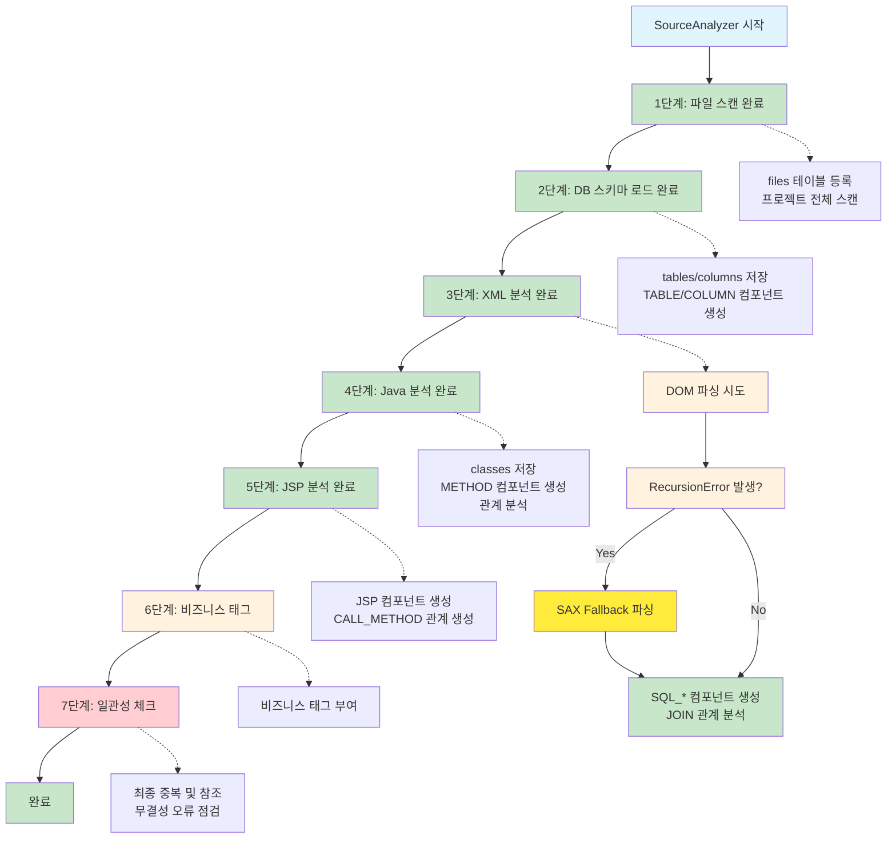

# SourceAnalyzer 처리 플로우 구현 가이드

## 문서 목적

이 문서는 SourceAnalyzer 시스템의 **실제 구현 과정과 개발 가이드**를 상세히 설명합니다.  
**대상 독자**: 개발자, 시스템 엔지니어  
**참조 문서**: [요구사항정의서.md](./요구사항정의서.md), [메타데이터베이스스키마정의서.md](./메타데이터베이스스키마정의서.md)

## 개요

SourceAnalyzer의 실제 메타데이터 생성 플로우는 `main.py`로부터 시작한다.

## 전체 처리 플로우



## 시스템 폴더 구조

```
D:\Analyzer\CreateMetaDb\
├── config/                  # 설정 파일들
│   ├── config.yaml         # 시스템 설정
│   ├── config.yaml.bak     # 설정 백업
│   ├── logging.yaml        # 로깅 설정
│   ├── target_source_config.yaml # 파일 필터링 설정
│   └── parser/             # 파서별 키워드 설정
│       ├── mybatis_dom_rules.yaml  # MyBatis DOM 파싱 규칙 ✅ **구현 완료**
│       ├── mybatis_keyword.yaml    # MyBatis 키워드 설정 ✅ **구현 완료**
│       ├── method_xml_patterns.yaml # 메서드 XML 패턴 정의 ✅ **구현 완료**
│       ├── ai_config.yaml
│       ├── css_keyword.yaml
│       ├── html_keyword.yaml
│       ├── java_keyword.yaml
│       ├── javascript_keyword.yaml
│       ├── jpa_keyword.yaml
│       ├── jquery_keyword.yaml
│       ├── jsp_keyword.yaml
│       ├── oracle_sql_keyword.yaml
│       ├── spring_keyword.yaml
│       ├── sql_keyword.yaml
│       └── xml_parser_config.yaml
├── database/               # DB 스키마
│   ├── create_table_script.sql  # 메타데이터베이스 스키마
│   └── create_sql_content_db.sql  # SQL Content DB 스키마 ✅ **구현 완료**
├── docs/                   # 문서들
│   ├── report/             # 진척보고 및 분석 리포트
│   ├── 메타데이터베이스스키마정의서.md
│   ├── 요구사항정의서.md
│   ├── 처리플로우_요약.md
│   ├── 처리플로우_상세_1단계.md
│   ├── 처리플로우_상세_2단계.md
│   └── 처리플로우_상세_3단계.md
├── parser/                 # 파서 소스 코드 및 매뉴얼
│   ├── xml_parser.py       # MyBatis XML 파서 (DOM + SAX Fallback) ✅ **구현 완료**
│   ├── sax_fallback_parser.py # SAX Fallback 파서 ✅ **구현 완료**
│   └── manual/             # 기술별 매뉴얼
│       ├── 01_java/
│       ├── 02_jsp/
│       ├── 03_web_frontend/
│       ├── 04_mybatis/     # MyBatis 파서 가이드 ✅ **구현 완료**
│       ├── 05_jpa/
│       ├── 06_oracle_sql/
│       ├── 07_spring/
│       ├── 08_xml/
│       └── 99_common/
├── util/                   # 유틸리티 소스 코드
│   ├── __init__.py
│   ├── arg_utils.py        # 명령행 인자 처리
│   ├── arg_utils_example.py
│   ├── config_utils.py     # 설정 파일 처리
│   ├── database_utils.py   # 데이터베이스 유틸리티
│   ├── file_utils.py       # 파일 처리 유틸리티
│   ├── global_project.py   # 글로벌 프로젝트 정보 관리 ✅ **구현 완료**
│   ├── hash_utils.py       # 해시 처리 유틸리티
│   ├── integrated_example.py
│   ├── logger.py           # 로깅 유틸리티
│   ├── path_utils.py       # 경로 처리 유틸리티
│   ├── path_utils_example.py
│   ├── sql_content_manager.py  # SQL Content DB 관리 ✅ **구현 완료**
│   ├── sql_content_processor.py # SQL Content 처리 (현재 보류 상태)
│   └── validation_utils.py # 검증 유틸리티
├── projects/               # 분석 대상 프로젝트들
│   └── sampleSrc/          # 샘플 프로젝트
│       ├── config/
│       │   └── target_source_config.yaml
│       ├── db_schema/      # DB 스키마 CSV 파일
│       │   ├── ALL_TABLES.csv
│       │   └── ALL_TAB_COLUMNS.csv
│       ├── metadata.db     # 메타데이터베이스
│       ├── SqlContent.db   # SQL Content 데이터베이스 (현재 보류 상태)
│       └── src/            # 소스 코드
│           └── ... 내용은 프로젝트마다 가변
├── logs/                   # 로그 파일들
├── temp/                   # 임시 파일들
├── qna/                    # Q&A 폴더
├── main.py                 # 메인 실행 파일
├── file_loading.py         # 1-2단계 처리 (파일 스캔, DB 구조 저장) ✅ **구현 완료**
└── xml_loading.py          # 3단계 처리 (XML 분석) ✅ **구현 완료**
```

## 실제 처리 순서 (3단계로 통합)

### 1단계: 파일 정보 저장 (프로젝트 전체 스캔) ✅ **구현 완료**

- **목적**: `./projects/{project_name}` 하위 모든 파일을 `files` 테이블에 등록
- **처리**: 
  - `FileUtils.scan_directory()`로 프로젝트 전체 디렉토리 재귀적 스캔
  - `target_source_config.yaml` 설정 기반 파일 필터링 (include/exclude 패턴)
  - 파일 확장자로 타입 결정 (java, xml, jsp, sql, csv 등)
  - `HashUtils`로 파일 내용 해시값 생성
  - `DatabaseUtils.upsert()`로 `INSERT OR REPLACE` 실행
- **결과**: 모든 파일의 `file_id` 생성으로 후속 단계에서 참조 가능
- **상세 문서**: [처리플로우_상세_1단계.md](./처리플로우_상세_1단계.md)

### 2단계: 데이터베이스 구조 저장 및 컴포넌트 생성 ✅ **구현 완료**

- **목적**: CSV 파일에서 테이블/컬럼 정보를 메타DB에 저장하고 components에 등록
- **처리**: 
  - `FileLoadingEngine.load_csv_file()`: ALL_TABLES.csv → `tables` 테이블, ALL_TAB_COLUMNS.csv → `columns` 테이블 (OWNER, TABLE_NAME, COLUMN_NAME, DATA_TYPE, NULLABLE, PK, COLUMN_COMMENTS, DATA_DEFAULT 컬럼 포함) - **하드코딩된 2개 파일만 처리**
  - `FileLoadingEngine.create_table_components()`: `tables` 테이블의 모든 테이블을 `components` 테이블에 `TABLE` 타입으로 등록
  - `FileLoadingEngine.create_column_components()`: `columns` 테이블의 모든 컬럼을 `components` 테이블에 `COLUMN` 타입으로 등록 (component_name: "컬럼명" 형태, parent_id: 테이블의 component_id) 및 columns 테이블의 component_id 업데이트
  - `HashUtils`로 테이블/컬럼 해시값 생성
  - `DatabaseUtils.batch_insert_or_replace()`로 배치 저장
- **결과**: 테이블/컬럼 구조 정보 저장 및 components에서 참조 가능
- **상세 문서**: [처리플로우_상세_2단계.md](./처리플로우_상세_2단계.md)

> **관련 스키마**: `tables`, `columns`, `components` 테이블 구조는 [메타데이터베이스스키마정의서.md](./메타데이터베이스스키마정의서.md) 참조

### 3단계: XML 파일 분석 및 SQL 컴포넌트 등록 + JOIN 관계 분석 (통합 처리) - 메모리 최적화 ✅ **구현 완료**

- **목적**: XML 파일에서 SQL 쿼리 추출, components 테이블 등록, JOIN 관계 분석, SQL Content DB 저장을 한 번에 처리
- **처리**:
  - `get_filtered_files()`로 XML 파일 수집
  - **스트리밍 처리**: 한 파일씩만 메모리에 로드하여 처리
  - `XmlLoadingEngine`을 통한 통합 처리:
    - **DOM + SAX Fallback 파싱**: DOM 파싱 실패 시 SAX 파서로 자동 전환
      - **DOM**: 빠르고 정확하지만 복잡한 중첩 구조에서 RecursionError 위험
      - **SAX**: 재귀 없이 안전하지만 구현 복잡하고 정확도 제한적
    - XML 파싱하여 쿼리 ID와 SQL 내용 추출
    - 각 쿼리 ID를 `SQL_SELECT`, `SQL_INSERT`, `SQL_UPDATE`, `SQL_DELETE`, `SQL_MERGE` 타입으로 components 등록
    - **동시에** SQL 내용에서 JOIN 관계 분석:
      - **Explicit JOIN**: ANSI SQL JOIN 구문 분석 (`INNER JOIN`, `LEFT JOIN` 등)
      - **Implicit JOIN**: Oracle 전통 구문 분석 (FROM 절의 콤마 구분, WHERE 절의 조인 조건)
      - **별칭 해석**: 테이블 별칭을 실제 테이블명으로 변환
      - **별칭 생략 처리**: `u.DEPT_ID = DEPT_ID` 형태의 조건에서 생략된 별칭 추론
    - `relationships` 테이블에 `JOIN_EXPLICIT`, `JOIN_IMPLICIT` 관계 등록
    - **SQL Content DB 저장**: 정제된 SQL 내용을 gzip 압축하여 `./projects/{project_name}/SqlContent.db`에 저장
  - 처리 후 즉시 메모리에서 해제 (`del xml_content`)
- **결과**: SQL 쿼리 컴포넌트 등록 + JOIN 관계 분석 + SQL Content 저장 완료 (메모리 사용량 최소화)
- **파일**: `xml_loading.py` (메인 엔진), `parser/xml_parser.py` (파싱 로직), `parser/sax_fallback_parser.py` (SAX Fallback)
- **상세 문서**: [처리플로우_상세_3단계.md](./처리플로우_상세_3단계.md)

### 4단계: Java 소스코드 분석 및 관계 생성 - 메모리 최적화 ✅ **구현 완료**

- **목적**: Java 파일에서 CLASS, METHOD 추출 및 관계 분석을 한 번에 처리
- **처리**:
  - `get_filtered_files()`로 Java 파일 수집
  - **스트리밍 처리**: `JavaParser.parse_java_file()`로 한 파일씩 처리
  - **통합 분석**: 클래스/메서드 추출과 관계 분석을 동시에 처리
  - `classes` 테이블에 클래스 정보 등록 (상속 관계는 `parent_class_id`로 저장)
  - `components` 테이블에 `METHOD` 타입으로 등록 (component_name: "클래스명.메서드명")
  - **관계 분석**: CALL_QUERY, CALL_METHOD, USE_TABLE 관계를 relationships 테이블에 등록
  - **인터페이스 구현 관계는 저장하지 않음** (껍데기일 뿐, 실제 메서드 호출 분석에 불필요)
  - **소스 코드 레벨에서만 분석** (런타임 의존성은 고려하지 않음)
  - **오류 처리**: 파싱 오류 발생 시 `has_error='Y'` 설정하고 다음 파일로 계속 진행
- **결과**: CLASS, METHOD 정보 등록 및 관계 분석 완료 (메모리 사용량 최소화)
- **파일**: `java_loading.py` (메인 엔진), `parser/java_parser.py` (파싱 로직)

> **관련 스키마**: `classes`, `components`, `relationships` 테이블 구조는 [메타데이터베이스스키마정의서.md](./메타데이터베이스스키마정의서.md) 참조

### 5단계: JSP 파일 분석 ✅ **구현 완료**

- **목적**: JSP 파일을 `components` 테이블에 등록하고 JSP → Java 메서드 관계 생성
- **처리**: 
  - `get_filtered_files()`로 JSP 파일 수집
  - **스트리밍 처리**: 한 파일씩만 메모리에 로드하여 처리
  - JSP 파일을 `JSP` 타입으로 components 테이블에 등록
  - JSP에서 Java 메서드 호출 분석 (스크립틀릿, 표현식, EL, JSTL 등)
  - **JSP → METHOD**: `CALL_METHOD` 관계 생성 (inferred 메서드 자동 생성)
  - **JSP → CLASS**: 관계 생성 안함 (parent_id로 찾아감)
  - 처리 후 즉시 메모리에서 해제 (`del jsp_content`)
- **결과**: JSP 컴포넌트 등록 및 JSP → Java 메서드 관계 생성 완료 (메모리 사용량 최소화)
- **파일**: `jsp_loading.py` (메인 엔진), `parser/jsp_parser.py` (파싱 로직)
- **상세 문서**: [처리플로우_상세_5단계.md](./처리플로우_상세_5단계.md)

### 6단계: 비즈니스 태그 생성 (향후 개발)

- **목적**: 컴포넌트에 비즈니스 의미 태그 부여
- **처리**: JavaParser에서 이미 처리됨 (실제로는 별도 처리 없음)
- **결과**: 비즈니스 태그 등록

### 7단계: 일관성 체크 (향후 개발)

- **목적**: 최종 중복 제거, 참조 무결성 점검, 데이터 일관성 검증
- **처리**:
  - `metadata_engine.check_consistency()`: 중복 데이터 정리
  - `metadata_engine.validate_references()`: 참조 무결성 점검
  - `metadata_engine.finalize_metadata()`: 최종 통계 및 정리
- **결과**: 완전한 메타데이터 및 일관성 보장

### 최종 단계: 데이터 무결성 정리 (향후 개발)

- **목적**: 최종 데이터 정리 및 통계 생성
- **처리**:
  - `metadata_engine.finalize_metadata_generation()`: 고아 컬럼 정리, 중복 관계 정리
- **결과**: 최종 통계 및 정리 완료

## 핵심 설계 원칙

### Components 테이블 저장 대상

- **저장**: CLASS, METHOD, SQL_*, TABLE, COLUMN, JSP (구현 필요)
- **제외**: java 파일 자체 (files 테이블에만 저장)

### Relationships 테이블 역할

- **모든 관계 통합 관리**: 컴포넌트 간, 컬럼 간, 테이블 간 관계
- **조인 관계**: 테이블 간 조인 관계도 relationships에서 관리
- **호출 관계**: 메서드 → 쿼리, JSP → 메서드 등

### 처리 순서의 중요성

1. **종속관계 고려**: 하위 테이블부터 생성 후 상위 테이블 연결
2. **컴포넌트 우선**: relationships에서 참조할 수 있도록 components 먼저 생성
3. **관계 마지막**: 모든 컴포넌트 생성 후 관계 정의

# 처리단계

- [✅] 1단계: 파일 인덱스 생성 (프로젝트 전체 스캔) - **구현 완료**

- [✅] 2단계: DB 스키마 로드 및 컴포넌트 생성 - **구현 완료**

- [✅] 3단계: XML 파일 분석 및 SQL 컴포넌트 등록 + JOIN 관계 분석 (통합 처리) - **구현 완료**

- [✅] 4단계: Java 소스코드 분석 및 관계 생성 - **구현 완료**

- [✅] 5단계: JSP 파일 분석 (JSP 컴포넌트 등록 및 JSP → METHOD 관계 생성) - **구현 완료**

- [⏳] 6단계: 비즈니스 태그 생성 - **향후 개발**

- [⏳] 7단계: 일관성 체크 - **향후 개발**

## 실제 개발 플로우 검증

현재 SourceAnalyzer는 다음과 같은 플로우로 동작합니다:

```
1. 파일 스캔 → files 테이블 등록 ✅ **구현 완료**
2. CSV 로드 → tables/columns 테이블 등록 → TABLE 컴포넌트 등록 ✅ **구현 완료**
3. XML 분석 + JOIN 관계 분석 (통합 처리, 메모리 최적화) → SQL_* 컴포넌트 등록 + JOIN 관계 등록 ✅ **구현 완료**
   - 한 번의 XML 읽기로 SQL 추출과 JOIN 분석을 동시 처리
   - SQL Content DB에 gzip 압축 저장 (현재 보류 상태)
   - Explicit JOIN (ANSI SQL) 및 Implicit JOIN (Oracle 전통 구문) 모두 지원
   - 별칭 해석 및 별칭 생략 처리로 정확한 테이블 관계 추출
   - 쿼리에서 도출된 테이블이 기존 tables에 없을 수 있음 (정상 상황)
   - project_id, table_name으로 tables에서 조회 시:
     * table_owner가 'UNKNOWN'이 아닌 테이블을 우선 선택 (LIMIT 1)
     * table_owner가 'UNKNOWN'이 아닌 테이블이 없으면 'UNKNOWN' 테이블 선택
   - 기존 테이블이 없으면 inferred 테이블 생성:
     * table_owner='UNKNOWN', HASH_VALUE='INFERRED'로 tables에 등록
   - inferred 테이블의 table_id로 relationships 등록
4. Java 분석 + 관계 생성 (메모리 최적화) → classes 테이블 등록 + METHOD 컴포넌트 등록 + 관계 등록 ✅ **구현 완료**
   - 한 번의 Java 읽기로 클래스/메서드 추출과 관계 분석을 동시 처리
   - CALL_QUERY/CALL_METHOD/USE_TABLE 관계를 relationships 테이블에 등록
   - inferred 컴포넌트 자동 생성 (기존에 없는 클래스/메서드/쿼리/테이블)
5. JSP 분석 (메모리 최적화) → JSP 컴포넌트 등록 + JSP → METHOD 관계 생성 ✅ **구현 완료**
   - 한 번의 JSP 읽기로 컴포넌트 등록과 관계 분석을 동시 처리
   - inferred 메서드 자동 생성 (기존에 없는 메서드)
6. 비즈니스 태그 → 태그 부여
7. 일관성 체크 → 최종 중복 및 참조 무결성 오류 점검
```

### 주요 개선 사항

- **3단계 통합 처리**: XML 파일 분석과 JOIN 관계 분석을 한 번에 처리하여 메모리 최적화 [OK]
- **3단계 메모리 최적화**: XML 파일 분석 시 스트리밍 처리로 메모리 사용량 최소화 [OK]
- **3단계 JOIN 분석 강화**: Explicit JOIN과 Implicit JOIN 모두 지원, 별칭 해석 및 생략 처리 [OK]
- **3단계 SAX Fallback**: RecursionError 발생 시 SAX 파서로 자동 전환하여 파싱 안정성 보장 [OK]
- **4단계 통합 처리**: Java 파일 분석과 관계 분석을 한 번에 처리하여 메모리 최적화 [OK]
- **4단계 메모리 최적화**: Java 파일 분석 시 스트리밍 처리로 메모리 사용량 최소화 [OK]
- **4단계 상속 관계**: Java 클래스 상속 관계를 `parent_class_id`로 저장 [OK]
- **4단계 인터페이스 관계 제거**: IMPLEMENTS 관계 저장하지 않음 (껍데기일 뿐) [OK]
- **4단계 메소드→메소드 관계**: CALL_METHOD 관계 생성 기능 추가 [OK]
- **4단계 YAML 설정**: Java 기본 메서드 하드코딩 제거 및 YAML 설정 파일 활용 [OK]
- **4단계 소스 레벨 분석**: 런타임 의존성 고려하지 않고 소스상 연결만 분석 [OK]
- **5단계 JSP 분석**: JSP 파일을 components 테이블에 등록하고 JSP → METHOD 관계 생성 [OK]
- **5단계 메모리 최적화**: JSP 파일 분석 시 스트리밍 처리로 메모리 사용량 최소화 [OK]
- **5단계 inferred 컴포넌트**: 참조되는 메서드가 없으면 inferred 메서드 자동 생성 [OK]
- **7단계 일관성 체크**: 최종 중복 제거, 참조 무결성 점검, 데이터 일관성 검증

---

## 📚 관련 문서

- **[요구사항정의서.md](./요구사항정의서.md)**: 비즈니스 요구사항 및 기능 명세
- **[메타데이터베이스스키마정의서.md](./메타데이터베이스스키마정의서.md)**: 데이터베이스 스키마 구조 상세
- **[create_table_script.sql](../database/create_table_script.sql)**: 스키마 정의 원본 파일
- **[처리플로우_상세_1단계.md](./처리플로우_상세_1단계.md)**: 1단계 파일 정보 저장 상세 구현 가이드
- **[처리플로우_상세_2단계.md](./처리플로우_상세_2단계.md)**: 2단계 데이터베이스 구조 저장 상세 구현 가이드
- **[처리플로우_상세_3단계.md](./처리플로우_상세_3단계.md)**: 3단계 XML 파일 분석 및 SQL 컴포넌트 등록 상세 구현 가이드
- **[처리플로우_상세_4단계.md](./처리플로우_상세_4단계.md)**: 4단계 Java 소스코드 분석 및 관계 생성 상세 구현 가이드
- **[처리플로우_상세_5단계.md](./처리플로우_상세_5단계.md)**: 5단계 JSP 파일 분석 상세 구현 가이드
- **[DOM_vs_SAX_비교분석.md](./DOM_vs_SAX_비교분석.md)**: DOM과 SAX 파서 비교 및 SAX Fallback 구조 분석
